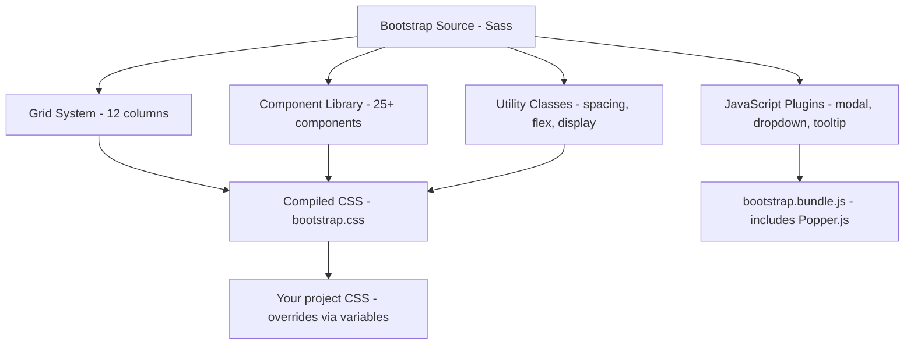

## WHY

Before CSS frameworks like Bootstrap, building a consistent responsive layout meant inventing your own grid system from scratch — calculating percentages, writing custom clearfix hacks, and discovering that your `float`-based layout collapsed in Internet Explorer 8. Every project re-solved the same problems: how many columns? What breakpoints? How do I make a modal accessible? How do I style a dropdown that works without JavaScript from scratch? Teams of 2–3 people spent 20% of their project time on boilerplate CSS infrastructure that had nothing to do with their actual product.

Bootstrap (originally "Twitter Blueprint") solved this by shipping a complete, battle-tested CSS framework: a 12-column responsive grid, a pre-styled component library (buttons, modals, forms, navbars, tooltips, cards), a utility class layer, and a JavaScript plugin layer — all in one package. Teams could now start with a working design system on day one. Bootstrap became the most-used open-source project on GitHub for years, powering millions of admin dashboards, SaaS products, and marketing sites worldwide.

The failure mode when Bootstrap is misused: teams accept Bootstrap's visual defaults unchanged, producing the unmistakable "Bootstrap look" (slightly dated, very similar to every other Bootstrap site) without customising the Sass variables. The deeper problem is loading Bootstrap's full 140 KB CSS bundle even when using 5% of its components — killing performance scores. Production-grade Bootstrap usage means compiling only the components you need via `@import` and overriding design tokens through Sass variables before the framework compiles.

Senior engineers need to understand Bootstrap to triage legacy codebases (it's in hundreds of millions of sites), to evaluate whether a project needs a full framework or a utility-first approach, and to know when Bootstrap's opinionated component library accelerates delivery vs when it creates a design ceiling.

## THEORY

### Architecture: Grid, Components, Utilities, and JavaScript

Bootstrap is structured in four distinct layers:



### The 12-Column Grid

Bootstrap's grid divides the viewport into 12 equal columns. You place content in `.row` containers (flex rows) with `.col-*` children:

```
xs (<576px)  sm (≥576)  md (≥768)  lg (≥992)  xl (≥1200)  xxl (≥1400)
.col         .col-sm-*  .col-md-*  .col-lg-*  .col-xl-*   .col-xxl-*
```

**How the grid works internally:**
1. `.container` sets a max-width and centers with `margin: 0 auto`
2. `.row` uses `display: flex; flex-wrap: wrap; margin: 0 -12px` (negative margin = gutter compensation)
3. `.col-md-6` = `flex: 0 0 auto; width: 50%` at ≥768px, `width: 100%` below
4. Gutters (`g-3`, `gx-4`) set CSS custom property `--bs-gutter-x` consumed by row + col

### Sass Variable Override System

Bootstrap's entire visual design is parameterised by Sass variables. Override BEFORE the `@import`:

```scss
// _custom.scss — your overrides
$primary:   #6366f1;   // your brand colour replaces Bootstrap blue
$border-radius: 0.5rem;
$font-family-sans-serif: 'Inter', system-ui, sans-serif;
$body-bg:   #f8fafc;
$enable-rounded: true;
$enable-shadows: true;

// Then import Bootstrap — your variables win
@import "bootstrap/scss/bootstrap";
```

### Component vs Utility: When Bootstrap 5 Converged with Tailwind

Bootstrap 5 added a full utility layer inspired by Tailwind — `d-flex`, `gap-3`, `p-4`, `text-primary`, `fw-bold`. This means modern Bootstrap code mixes component classes with utility classes:

```html
<!-- Bootstrap 5: component + utility hybrid approach -->
<div class="card border-0 shadow-sm mb-4">
  <div class="card-body d-flex align-items-center gap-3 p-4">
    <div class="rounded-circle bg-primary d-flex align-items-center
                justify-content-center" style="width:48px;height:48px">
      <i class="bi bi-person-fill text-white fs-5"></i>
    </div>
    <div>
      <h6 class="mb-0 fw-semibold">Alice Johnson</h6>
      <small class="text-muted">Senior Engineer</small>
    </div>
    <span class="badge bg-success ms-auto">Active</span>
  </div>
</div>
```

### Comparison: Bootstrap vs Tailwind

| Dimension | Bootstrap 5 | Tailwind CSS |
|-----------|-------------|--------------|
| Bundle size | ~140 KB default CSS | 5–15 KB (JIT only) |
| Component library | Yes (25+ built-in) | No (utility only) |
| Learning curve | Low (classes obvious) | Medium (utility names) |
| Customisation | Sass variables | JS config + arbitrary values |
| HTML verbosity | Lower (semantic components) | Higher (many utilities) |
| Design flexibility | Constrained by components | Near-unlimited |
| Best for | Rapid prototypes, admin dashboards | Design systems, custom UI |

### Common Misconception

Most developers load `bootstrap.css` wholesale and override with `!important`. The correct approach is Sass partial imports — include only the components you use:

```scss
// Import ONLY what you need (cuts bundle by 60–80%)
@import "bootstrap/scss/functions";
@import "bootstrap/scss/variables";
@import "bootstrap/scss/mixins";
@import "bootstrap/scss/grid";       // grid only
@import "bootstrap/scss/utilities";  // utilities only
@import "bootstrap/scss/buttons";    // buttons only
// @import "bootstrap/scss/modal"    // NOT imported = not in bundle
```

## VISUALIZATION_CONFIG

```json
{ "component": "ConceptMap", "state": "css-bootstrap-architecture" }
```

## CODE

### Level 1 — Beginner: Responsive Grid Layout
```html
<!doctype html>
<html lang="en">
<head>
  <meta charset="utf-8">
  <meta name="viewport" content="width=device-width, initial-scale=1">
  <link href="https://cdn.jsdelivr.net/npm/bootstrap@5.3.3/dist/css/bootstrap.min.css" rel="stylesheet">
  <title>Bootstrap Grid</title>
</head>
<body class="bg-light">
  <div class="container py-5">
    <h1 class="mb-4 fw-bold">Team Members</h1>

    <!-- Row of cards: 1 column on mobile, 2 on sm, 3 on md, 4 on lg -->
    <div class="row g-4">
      <div class="col-sm-6 col-md-4 col-lg-3">
        <div class="card h-100 border-0 shadow-sm">
          <div class="card-body text-center p-4">
            <div class="bg-primary rounded-circle mx-auto mb-3 d-flex
                        align-items-center justify-content-center"
                 style="width:60px;height:60px">
              <span class="text-white fw-bold fs-5">AJ</span>
            </div>
            <h6 class="fw-semibold mb-1">Alice Johnson</h6>
            <small class="text-muted">Frontend Engineer</small>
          </div>
        </div>
      </div>
      <!-- Repeat col for each team member -->
    </div>
  </div>
  <script src="https://cdn.jsdelivr.net/npm/bootstrap@5.3.3/dist/js/bootstrap.bundle.min.js"></script>
</body>
</html>
```

### Level 2 — Intermediate: Dashboard with Sidebar + Navbar
```html
<!doctype html>
<html lang="en">
<head>
  <meta charset="utf-8">
  <meta name="viewport" content="width=device-width, initial-scale=1">
  <link href="https://cdn.jsdelivr.net/npm/bootstrap@5.3.3/dist/css/bootstrap.min.css" rel="stylesheet">
</head>
<body>
  <!-- Fixed top navbar -->
  <nav class="navbar navbar-expand-lg navbar-dark bg-dark fixed-top">
    <div class="container-fluid">
      <a class="navbar-brand fw-bold" href="#">DevMastery</a>
      <button class="navbar-toggler" type="button" data-bs-toggle="collapse"
              data-bs-target="#navbarNav" aria-controls="navbarNav"
              aria-expanded="false" aria-label="Toggle navigation">
        <span class="navbar-toggler-icon"></span>
      </button>
      <div class="collapse navbar-collapse" id="navbarNav">
        <ul class="navbar-nav ms-auto">
          <li class="nav-item"><a class="nav-link active" href="#">Dashboard</a></li>
          <li class="nav-item"><a class="nav-link" href="#">Courses</a></li>
          <li class="nav-item"><a class="nav-link" href="#">Settings</a></li>
        </ul>
      </div>
    </div>
  </nav>

  <!-- Sidebar + content layout (below fixed navbar) -->
  <div class="container-fluid" style="padding-top:56px">
    <div class="row">
      <!-- Sidebar: full width on mobile, 2-col on lg -->
      <div class="col-lg-2 bg-white border-end min-vh-100 d-none d-lg-block">
        <nav class="p-3">
          <a href="#" class="d-block py-2 text-decoration-none text-dark fw-semibold">📊 Overview</a>
          <a href="#" class="d-block py-2 text-decoration-none text-secondary">📚 Courses</a>
          <a href="#" class="d-block py-2 text-decoration-none text-secondary">👥 Users</a>
          <a href="#" class="d-block py-2 text-decoration-none text-secondary">⚙️ Settings</a>
        </nav>
      </div>

      <!-- Main content -->
      <main class="col-lg-10 p-4 bg-light">
        <h2 class="fw-bold mb-4">Overview</h2>
        <!-- Metric cards -->
        <div class="row g-3 mb-4">
          <div class="col-md-3">
            <div class="card border-0 shadow-sm">
              <div class="card-body">
                <h6 class="text-muted small mb-1">Total Users</h6>
                <h3 class="fw-bold mb-0">12,842</h3>
                <small class="text-success">+8% this week</small>
              </div>
            </div>
          </div>
          <!-- Repeat for other metrics -->
        </div>
      </main>
    </div>
  </div>

  <script src="https://cdn.jsdelivr.net/npm/bootstrap@5.3.3/dist/js/bootstrap.bundle.min.js"></script>
</body>
</html>
```

### Level 3 — Advanced: Custom Bootstrap Theme with Sass
```scss
// src/scss/_variables.scss — override BEFORE Bootstrap imports
$primary:           #6366f1;   // Indigo brand colour
$secondary:         #64748b;
$success:           #10b981;
$danger:            #ef4444;
$warning:           #f59e0b;

$border-radius:     0.5rem;
$border-radius-lg:  0.75rem;
$border-radius-sm:  0.375rem;

$font-family-sans-serif: 'Inter', system-ui, -apple-system, sans-serif;
$font-size-base:    0.9375rem;  // 15px

$body-bg:           #f8fafc;
$body-color:        #0f172a;

$card-border-color: rgba(0, 0, 0, 0.08);
$card-box-shadow:   0 1px 3px rgba(0,0,0,0.08), 0 1px 2px rgba(0,0,0,0.05);

$navbar-dark-bg:    $primary;

// Enable opt-in features
$enable-rounded:    true;
$enable-shadows:    true;
$enable-negative-margins: true;

// Custom spacing tokens beyond Bootstrap's default scale
$spacers: map-merge($spacers, (
  "6": $spacer * 4,    // 64px
  "7": $spacer * 6,    // 96px
));
```

```scss
// src/scss/main.scss
@import "variables";       // your overrides first

// Import only what you need (reduces bundle ~60%)
@import "bootstrap/scss/functions";
@import "bootstrap/scss/variables";
@import "bootstrap/scss/variables-dark";
@import "bootstrap/scss/maps";
@import "bootstrap/scss/mixins";
@import "bootstrap/scss/root";
@import "bootstrap/scss/reboot";
@import "bootstrap/scss/grid";
@import "bootstrap/scss/containers";
@import "bootstrap/scss/utilities";
@import "bootstrap/scss/helpers";
@import "bootstrap/scss/buttons";
@import "bootstrap/scss/card";
@import "bootstrap/scss/navbar";
@import "bootstrap/scss/nav";
@import "bootstrap/scss/modal";
@import "bootstrap/scss/forms";
@import "bootstrap/scss/badge";
@import "bootstrap/scss/alert";
@import "bootstrap/scss/utilities/api"; // must be last

// Your custom component overrides
@import "components/stat-card";
@import "components/sidebar";
```

### Level 4 — Expert / Production: Bootstrap + React Integration
```tsx
// Using React Bootstrap (react-bootstrap package) for accessible components
import { Container, Row, Col, Card, Badge, Button, Modal } from 'react-bootstrap';
import { useState } from 'react';

interface Course {
  id: number;
  title: string;
  category: string;
  level: 'beginner' | 'intermediate' | 'advanced';
  enrolled: number;
}

const LEVEL_VARIANT: Record<Course['level'], string> = {
  beginner:     'success',
  intermediate: 'warning',
  advanced:     'danger',
};

function CourseCard({ course, onEnroll }: { course: Course; onEnroll: (id: number) => void }) {
  return (
    // h-100 makes all cards equal height in a row
    <Card className="h-100 border-0 shadow-sm">
      <Card.Body className="d-flex flex-column p-4">
        {/* Badge + title */}
        <div className="d-flex justify-content-between align-items-start mb-2">
          <Badge bg={LEVEL_VARIANT[course.level]} className="text-capitalize">
            {course.level}
          </Badge>
          <small className="text-muted">{course.enrolled.toLocaleString()} enrolled</small>
        </div>

        <Card.Title className="fw-semibold fs-6 mb-1">{course.title}</Card.Title>
        <Card.Text className="text-muted small flex-grow-1">{course.category}</Card.Text>

        {/* mt-auto pushes button to bottom regardless of content length */}
        <Button
          variant="primary"
          size="sm"
          className="mt-auto w-100"
          onClick={() => onEnroll(course.id)}
        >
          Enrol now
        </Button>
      </Card.Body>
    </Card>
  );
}

export function CourseGrid({ courses }: { courses: Course[] }) {
  const [confirmId, setConfirmId] = useState<number | null>(null);

  return (
    <Container className="py-4">
      <Row xs={1} sm={2} lg={3} xl={4} className="g-4">
        {courses.map(course => (
          <Col key={course.id}>
            <CourseCard course={course} onEnroll={setConfirmId} />
          </Col>
        ))}
      </Row>

      {/* Accessible confirmation modal — Bootstrap handles focus trap */}
      <Modal show={confirmId !== null} onHide={() => setConfirmId(null)} centered>
        <Modal.Header closeButton>
          <Modal.Title className="fs-6 fw-semibold">Confirm enrolment</Modal.Title>
        </Modal.Header>
        <Modal.Body>
          You are about to enrol in <strong>{courses.find(c => c.id === confirmId)?.title}</strong>.
        </Modal.Body>
        <Modal.Footer>
          <Button variant="secondary" onClick={() => setConfirmId(null)}>Cancel</Button>
          <Button variant="primary" onClick={() => { /* enrol */ setConfirmId(null); }}>Confirm</Button>
        </Modal.Footer>
      </Modal>
    </Container>
  );
}
```

## REAL_WORLD

### How GitHub Uses Bootstrap

GitHub's original interface (pre-2020 Primer system) was built on Bootstrap. GitHub's own component library **Primer** (now open-source) evolved from Bootstrap — it shares the same grid and utility philosophy but replaces Bootstrap's visual defaults with GitHub's brand. The lesson: Bootstrap is a starting point, and production systems that outgrow it build a thin layer on top rather than fighting its CSS specificity.

For enterprise admin tooling, Bootstrap remains the dominant choice in 2026 — Django's admin panel, Rails' Hotwire demos, and 80%+ of open-source admin templates are Bootstrap-based because the time-to-working-UI is under an hour.

```html
<!-- Production-grade Bootstrap dashboard card pattern (GitHub-admin style) -->
<div class="card border shadow-none mb-3">
  <div class="card-header bg-transparent d-flex align-items-center
              justify-content-between py-3">
    <h5 class="mb-0 fw-semibold text-body">Repository activity</h5>
    <div class="d-flex gap-2">
      <button class="btn btn-sm btn-outline-secondary">Export</button>
      <button class="btn btn-sm btn-primary">
        <svg class="me-1" width="14" height="14" viewBox="0 0 16 16" fill="currentColor">
          <path d="M8 2a.5.5 0 0 1 .5.5v5h5a.5.5 0 0 1 0 1h-5v5a.5.5 0 0 1-1 0v-5h-5a.5.5 0 0 1 0-1h5v-5A.5.5 0 0 1 8 2z"/>
        </svg>
        New repo
      </button>
    </div>
  </div>
  <div class="card-body p-0">
    <table class="table table-hover table-borderless mb-0 align-middle">
      <thead class="table-light">
        <tr>
          <th class="ps-4 py-3 text-muted small fw-semibold">Repository</th>
          <th class="py-3 text-muted small fw-semibold">Status</th>
          <th class="pe-4 py-3 text-muted small fw-semibold text-end">Stars</th>
        </tr>
      </thead>
      <tbody>
        <tr>
          <td class="ps-4 py-3 fw-medium">dev-mastery</td>
          <td class="py-3"><span class="badge text-bg-success">Active</span></td>
          <td class="pe-4 py-3 text-end text-muted">1,204</td>
        </tr>
      </tbody>
    </table>
  </div>
</div>
```

### Production Gotcha: Loading the Full Bootstrap Bundle

```html
<!-- ❌ Full CDN Bootstrap — 140 KB CSS + 63 KB JS, 40+ components you don't use -->
<link href="https://cdn.jsdelivr.net/npm/bootstrap@5.3.3/dist/css/bootstrap.min.css" rel="stylesheet">
<script src="https://cdn.jsdelivr.net/npm/bootstrap@5.3.3/dist/js/bootstrap.bundle.min.js"></script>

<!-- ✅ Custom Sass build — import only used components, compile once -->
<!-- Import only grid + utilities + buttons + card (~25 KB) -->
<!-- src/scss/main.scss contains only the @import statements you need -->
<!-- Compiled output: node scripts/build-css.js → dist/app.css (25 KB instead of 140 KB) -->
```

**Why it happens:** Bootstrap is designed so you CAN use the CDN for prototypes, but the CDN ships every component (modal, carousel, tooltip, offcanvas, popover, etc.) even if you use none of them. Teams copy the CDN approach from tutorials and never switch to a Sass build, paying the 140 KB bundle tax on every page load — adding ~500ms on a 3G connection.

### Performance Characteristics
| Approach | CSS Size | JS Size | Load Impact |
|----------|----------|---------|-------------|
| Full CDN bundle | 140 KB | 63 KB | +500ms on 3G |
| Grid + utilities only | ~45 KB | 0 | Acceptable |
| Custom Sass — 5 components | ~25 KB | 15 KB | Minimal |
| Custom Sass — full override | ~40 KB | 30 KB | Production-ready |

## INTERVIEW

**Q1 (Junior): What does Bootstrap's 12-column grid mean?**
A: The viewport is divided into 12 equal columns. You assign elements a column span (e.g., `col-md-6` = 6 of 12 = 50%) and they stack at breakpoints below `md`. The grid is implemented with Flexbox — `.row` is a flex container, `.col-*` are flex children. Gutters are added via CSS custom properties (`--bs-gutter-x`) so spacing is consistent and configurable.

**Q2 (Junior): Why should you customise Bootstrap with Sass variables instead of CSS overrides?**
A: Sass variables are resolved at compile time — your override wins because Bootstrap's variables are defined with `!default` (which only sets a value if the variable isn't already defined). CSS overrides require higher specificity or `!important` and fight Bootstrap's already-generated rules. Sass customisation produces cleaner, smaller CSS; CSS overrides create specificity debt.

**Q3 (Mid): How does Bootstrap 5's utility API differ from Bootstrap 3/4?**
A: Bootstrap 5 introduced a utility API that generates utility classes from a Sass map — you can add, modify, or remove utilities without forking Bootstrap's source. Example: adding a `text-decoration-skip-ink` utility requires 3 lines in your config. Bootstrap 3/4 had utilities as static CSS only — customisation meant overrides. The utility API pattern was inspired by Tailwind.

**Q4 (Mid): Bootstrap vs Tailwind — when each?**
A: Bootstrap: pre-built components (modal, navbar, form), rapid prototyping, teams unfamiliar with utility-first, legacy codebases. Tailwind: custom designs, design systems, React/Vue component libraries, when bundle size is critical. Bootstrap saves time building common UI patterns; Tailwind prevents the "Bootstrap look" and produces smaller production CSS.

**Q5 (Senior): How do you tree-shake Bootstrap to reduce bundle size?**
A: Use Sass partial imports — import only the `@import "bootstrap/scss/..."` partials for components you use. This reduces CSS from 140 KB to 20–40 KB. For JS, import Bootstrap plugins individually: `import { Modal } from 'bootstrap'` instead of the full bundle. Or use Vite/Webpack tree-shaking with the ES module build.

**Q6 (Senior): What accessibility features does Bootstrap provide out of the box?**
A: ARIA attributes on interactive components (modals trap focus and set `aria-modal`, dropdowns set `aria-expanded`, tooltips link with `aria-describedby`). Keyboard navigation for dropdown, navbar, modal, and tabs. Screen-reader-only text via `.visually-hidden`. These are provided because Bootstrap's JS plugins wire ARIA state automatically — but developers must still provide meaningful labels (`aria-label`, `alt` text).

**Q7 (Senior+): How would you migrate a Bootstrap 4 project to Bootstrap 5?**
A: Key breaking changes: jQuery removed (pure Vanilla JS), `data-*` attributes renamed to `data-bs-*`, `.media` component removed (use grid/flex), float-based grid replaced fully with Flexbox grid, `$grid-gutter-width` replaced by gutter utilities, colour modifier classes renamed (`.text-left` → `.text-start` for RTL support). Use the official Bootstrap migration guide and `codemod-bootstrap` to auto-fix most class renames. Test every JS plugin — the API changed from `$('.modal').modal('show')` to `bootstrap.Modal.getInstance(el).show()`.

## FEYNMAN CHECK

### Explain Bootstrap Like I'm 10 Years Old
> Bootstrap is a pre-built LEGO set for websites. Instead of building a grid, buttons, and modals from scratch each time, Bootstrap hands you a box with all the common pieces already made and tested. You snap pieces together using CSS class names (`btn btn-primary`, `col-md-6`). The non-obvious part: if you use the whole box, your website carries all 200+ pieces even if you only used 5 — slowing it down. Smart developers compile only the pieces they need, cutting the box from 140 KB to 25 KB. This is why "Bootstrap is slow" usually means "you loaded the full CDN bundle without removing unused pieces."

---

### 5 Deep Conceptual Questions

**Q1: What problem does Bootstrap fundamentally solve?**
> **A:** Bootstrap solves the "reinvent-the-wheel" problem of CSS infrastructure. Every project needs a grid, a button style, a form style, a modal, responsive breakpoints, and consistent typography. Without Bootstrap, developers implement each from scratch — inconsistently, with accessibility gaps, with browser bugs unfixed. Bootstrap encodes years of cross-browser fixes and accessibility patterns into a single well-tested package. You only justify rebuilding this when Bootstrap's opinionation becomes a constraint — i.e., when your design system diverges from Bootstrap's component signatures.

**Q2: ONE mental model for Bootstrap's grid.**
> **A:** "12 columns. Place flex children. Assign widths as fractions of 12 per breakpoint. Gutters are CSS variables. Nesting = a new row inside a col." Every Bootstrap layout problem decomposes to: (1) choose your breakpoint columns, (2) choose gutter size, (3) handle the edge cases (offset, auto-width, order).

**Q3: Most dangerous Bootstrap misconception with code.**
> **A:** Using inline `!important` overrides instead of Sass variables.
> ```scss
> // ❌ Fighting Bootstrap's specificity — unpredictable cascade
> .btn-primary { background-color: #6366f1 !important; border-color: #6366f1 !important; }
>
> // ✅ Override at compile time — Bootstrap uses your value
> $primary: #6366f1;
> @import "bootstrap/scss/bootstrap";
> ```

**Q4: How does Bootstrap's JS interact with the DOM?**
> **A:** Bootstrap 5 uses `MutationObserver` to watch for `data-bs-*` attribute changes and attaches event listeners. `Modal.getInstance(el)` returns the JS controller attached to a DOM node. Plugins communicate via CustomEvents (`show.bs.modal`, `shown.bs.modal`, `hide.bs.modal`) — you can cancel them with `event.preventDefault()`. This separation means Bootstrap JS works without jQuery and is tree-shakeable in ESM.

**Q5: Senior one-liner.**
> **A:** "Bootstrap is a Sass-configured, Flexbox-based CSS framework with battle-tested accessible components whose bundle size is only 'heavy' when consumed via CDN rather than via Sass partial imports tuned to your used component set — which is why the distinction between 'Bootstrap prototyping' and 'Bootstrap production' is entirely about the build pipeline."

## BUILD

### 🏗️ Mini Project: Custom-Themed Bootstrap 5 Admin Panel

**What you will build:** An admin dashboard with a custom brand colour, sidebar, responsive card grid, and a working modal — compiled from Sass partials (not CDN).
**Why this project:** Forces you to understand the Sass variable override system and partial imports — the skill that separates Bootstrap users from Bootstrap engineers.
**Time estimate:** 40 minutes

---

#### Step 1 — Setup
```bash
mkdir bootstrap-admin && cd bootstrap-admin
npm init -y
npm install bootstrap sass
mkdir -p src/scss src/js dist
touch src/scss/main.scss src/js/app.js index.html
```

#### Step 2 — Custom Sass Build
```scss
/* src/scss/main.scss */

/* 1. Override Bootstrap variables BEFORE importing */
$primary:           #6366f1;
$secondary:         #64748b;
$success:           #10b981;
$danger:            #ef4444;
$body-bg:           #f1f5f9;
$body-color:        #0f172a;
$font-family-sans-serif: system-ui, -apple-system, sans-serif;
$card-border-color: rgba(0,0,0,.06);
$enable-shadows:    true;
$border-radius:     .5rem;

/* 2. Import only what you use — reduces to ~35 KB */
@import "../../node_modules/bootstrap/scss/functions";
@import "../../node_modules/bootstrap/scss/variables";
@import "../../node_modules/bootstrap/scss/variables-dark";
@import "../../node_modules/bootstrap/scss/maps";
@import "../../node_modules/bootstrap/scss/mixins";
@import "../../node_modules/bootstrap/scss/root";
@import "../../node_modules/bootstrap/scss/reboot";
@import "../../node_modules/bootstrap/scss/grid";
@import "../../node_modules/bootstrap/scss/containers";
@import "../../node_modules/bootstrap/scss/utilities";
@import "../../node_modules/bootstrap/scss/helpers";
@import "../../node_modules/bootstrap/scss/buttons";
@import "../../node_modules/bootstrap/scss/card";
@import "../../node_modules/bootstrap/scss/navbar";
@import "../../node_modules/bootstrap/scss/nav";
@import "../../node_modules/bootstrap/scss/modal";
@import "../../node_modules/bootstrap/scss/badge";
@import "../../node_modules/bootstrap/scss/tables";
@import "../../node_modules/bootstrap/scss/utilities/api";

/* 3. Your custom overrides on top */
.sidebar {
  width: 220px;
  min-height: 100vh;
  background: #1e293b;
  color: #cbd5e1;
}
.sidebar a { color: #cbd5e1; text-decoration: none; padding: .5rem 1rem; display: block; border-radius: .375rem; }
.sidebar a:hover, .sidebar a.active { background: rgba(255,255,255,.1); color: #fff; }
```

#### Step 3 — Compile and Build HTML
```bash
# Add to package.json scripts:
# "build:css": "sass src/scss/main.scss dist/app.css --style compressed"
npm run build:css
```

```html
<!-- index.html -->
<!doctype html>
<html lang="en">
<head>
  <meta charset="utf-8"><meta name="viewport" content="width=device-width, initial-scale=1">
  <link rel="stylesheet" href="dist/app.css">
  <title>Admin Panel</title>
</head>
<body class="bg-body">
  <div class="d-flex">
    <aside class="sidebar d-none d-lg-flex flex-column p-3 flex-shrink-0">
      <div class="fw-bold text-white fs-5 mb-4 px-2">DevMastery</div>
      <a href="#" class="active">📊 Dashboard</a>
      <a href="#">👥 Users</a>
      <a href="#">📚 Courses</a>
      <a href="#">⚙️ Settings</a>
    </aside>
    <main class="flex-grow-1 p-4">
      <h2 class="fw-bold mb-4">Dashboard</h2>
      <!-- Metric row -->
      <div class="row g-3 mb-4">
        <div class="col-sm-6 col-xl-3">
          <div class="card border-0">
            <div class="card-body">
              <p class="text-muted small mb-1">Total Users</p>
              <h3 class="fw-bold mb-0">12,842</h3>
              <span class="badge text-bg-success mt-1">+8%</span>
            </div>
          </div>
        </div>
      </div>
      <!-- Modal trigger -->
      <button class="btn btn-primary" data-bs-toggle="modal" data-bs-target="#addUserModal">
        Add User
      </button>
    </main>
  </div>
  <!-- Modal -->
  <div class="modal fade" id="addUserModal" tabindex="-1" aria-labelledby="addUserLabel" aria-hidden="true">
    <div class="modal-dialog modal-dialog-centered">
      <div class="modal-content">
        <div class="modal-header">
          <h5 class="modal-title fw-semibold" id="addUserLabel">Add New User</h5>
          <button type="button" class="btn-close" data-bs-dismiss="modal" aria-label="Close"></button>
        </div>
        <div class="modal-body">
          <div class="mb-3">
            <label for="userName" class="form-label fw-medium">Name</label>
            <input type="text" class="form-control" id="userName" placeholder="Alice Johnson">
          </div>
          <div class="mb-3">
            <label for="userEmail" class="form-label fw-medium">Email</label>
            <input type="email" class="form-control" id="userEmail" placeholder="alice@example.com">
          </div>
        </div>
        <div class="modal-footer">
          <button class="btn btn-secondary" data-bs-dismiss="modal">Cancel</button>
          <button class="btn btn-primary">Save user</button>
        </div>
      </div>
    </div>
  </div>
  <script type="module">
    import { Modal } from './node_modules/bootstrap/dist/js/bootstrap.esm.min.js';
    window.addEventListener('DOMContentLoaded', () => {
      document.querySelectorAll('[data-bs-toggle="modal"]').forEach(trigger => {
        const modal = new Modal(document.querySelector(trigger.dataset.bsTarget));
        trigger.addEventListener('click', () => modal.show());
      });
    });
  </script>
</body>
</html>
```

#### Step 4 — Error Handling
```html
<!-- Guard forms with proper validation states -->
<input class="form-control is-invalid" id="userEmail" required>
<div class="invalid-feedback">Please enter a valid email address.</div>
<!-- Bootstrap shows/hides .invalid-feedback based on .is-invalid class -->
```

#### Step 5 — Verify Bundle Size
```bash
npm run build:css
ls -lh dist/app.css   # Should be 30–40 KB
# Compare: wc -c node_modules/bootstrap/dist/css/bootstrap.min.css  → ~140 KB
```

**Expected Output:**
```
dist/app.css: ~35 KB (vs 140 KB full CDN)
Modal opens/closes with keyboard accessible focus trap
Custom indigo primary colour throughout
```

**Stretch Challenges:**
- [ ] Add a data table with sorting using Bootstrap's table classes + vanilla JS
- [ ] Make the sidebar a collapsible offcanvas on mobile using Bootstrap's Offcanvas component
- [ ] Generate a custom colour theme using Bootstrap's Sass maps to create `bg-brand-*` utilities

## SPACED REVIEW

> Answer from memory first, then verify.

---

### Day 1 — Recall

**Q1:** Define Bootstrap in one sentence including what it is, how the grid works, and when to choose it over Tailwind.

**Q2:** What are the two most costly Bootstrap mistakes? What breaks in production for each?

**Q3:** Write a responsive 4-column card grid from memory:
```html
<!-- 1 column on xs, 2 on sm, 4 on lg — all cards equal height -->
```

---

### Day 3 — Comprehension

**Q4:** Explain Sass `!default` and why it enables Bootstrap's variable override system.

**Q5:** What is the bundle size difference between CDN Bootstrap and a Sass partial build? Name 3 components you can remove to reduce size.

**Q6:** Refactor from !important overrides to the correct Sass approach:
```css
/* Current — wrong */
.btn-primary { background-color: #6366f1 !important; border-color: #4f46e5 !important; }
```

---

### Day 7 — Application

**Q7:** Set up a Bootstrap 5 project using Sass partials that imports only grid + utilities + buttons + card + modal. Measure the compiled CSS size.

**Q8:** A PR uses `col-6` everywhere without responsive variants. On a phone, what does the user see? What is the correct fix?

**Q9:** What Bootstrap changes broke jQuery-dependent Bootstrap 4 code when migrating to Bootstrap 5?

---

### Day 14 — Synthesis & Interview Prep

**Q10:** ★ "Why is Bootstrap still used in 2026 despite Tailwind's popularity?" Give the complete senior-level answer covering use cases, tradeoffs, and legacy context.

**Q11:** Draw the relationship between Bootstrap Sass variables → component styles → utility classes → your overrides.

**Q12:** ★ "You inherit a 3-year-old Bootstrap 4 admin panel with 300 KB of CSS overrides and `!important` everywhere. Plan the migration to Bootstrap 5 with a proper Sass build — what's the step-by-step approach?"

