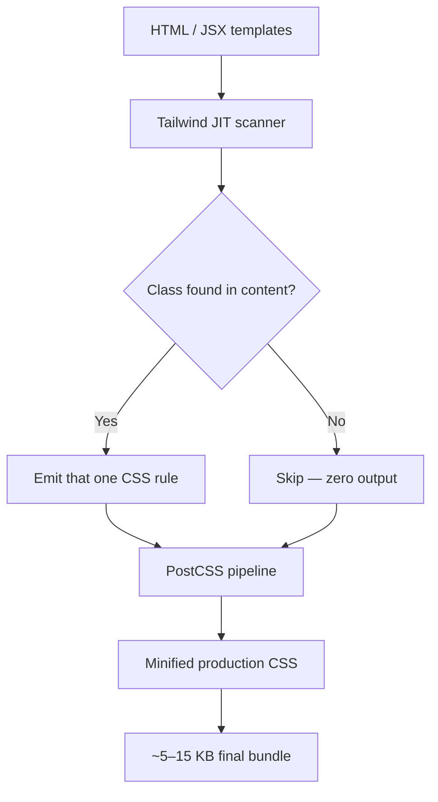

## WHY

Before Tailwind CSS, styling a web application meant switching between HTML and a separate CSS file constantly, fighting specificity wars, and naming classes according to BEM, SMACSS, or OOCSS conventions that inevitably became inconsistent as teams grew. Developers spent hours deciding whether to call something `.card-header__title--large` or `.card-title-large`, and both names conveyed nothing about what CSS properties were actually applied. The result was stylesheet files that grew without bound, dead code nobody dared delete, and cascading conflicts that turned simple UI tweaks into full-day hunts through inherited styles.

Tailwind solves this with a utility-first approach: instead of inventing class names, you compose small, single-purpose utility classes directly in your HTML — `flex`, `pt-4`, `text-blue-500`, `rounded-lg`. There are no naming decisions. Every class corresponds to exactly one CSS rule. The compiler (JIT mode) scans your files and emits only the CSS you actually use, producing bundles as small as a few KB even for large applications.

The real failure mode when ignoring Tailwind (or utility-first thinking generally) is stylesheet accumulation: after 18 months, teams routinely have 300 KB+ of CSS with 60%+ dead rules, zero confidence when deleting anything, and 5+ layers of specificity overrides for what should be a single padding change. This produces a "CSS is broken, nothing ever works as expected" culture that Tailwind eliminates.

Senior engineers must understand Tailwind because its JIT compiler, configuration system (`tailwind.config.js`), and arbitrary-value escape hatch (`text-[14px]`) have architectural implications — choosing Tailwind versus CSS-in-JS versus global CSS is a design system decision that constrains developer experience for years.

## THEORY

### Utility-First Philosophy and JIT Compilation

Tailwind's core insight is that CSS design tokens should be expressed as class names, not invented CSS identifiers. The framework ships ~20,000 utility classes covering every CSS property, but the JIT (Just-In-Time) compiler means you never ship unused rules.



**How JIT works step by step:**
1. Tailwind scans every file listed in `content` array (HTML, JSX, TSX, Vue, etc.)
2. Extracts every class string (including dynamic variants like `hover:bg-blue-500`)
3. For each class, generates the corresponding CSS rule on-demand
4. Arbitrary values (`w-[342px]`, `text-[#1da1f2]`) generate unique rules from any CSS value
5. PostCSS processes the output (autoprefixer, cssnano for prod)
6. Result: only the CSS you reference, ever

### Responsive + State Modifiers

Every utility is prefixable with responsive breakpoints and state variants:

```
sm:    ≥ 640px
md:    ≥ 768px
lg:    ≥ 1024px
xl:    ≥ 1280px
2xl:   ≥ 1536px

hover:   :hover
focus:   :focus
active:  :active
dark:    prefers-color-scheme: dark (or data-theme="dark")
group-hover: child when parent .group is hovered
```

```html
<button class="bg-blue-500 hover:bg-blue-700 focus:ring-2 focus:ring-blue-300
               text-white font-bold py-2 px-4 rounded
               dark:bg-blue-400 dark:hover:bg-blue-600
               disabled:opacity-50 disabled:cursor-not-allowed
               transition-colors duration-200">
  Save changes
</button>
```

### Configuration System

`tailwind.config.js` is where design tokens live:

```js
// tailwind.config.js
module.exports = {
  content: ['./src/**/*.{js,ts,jsx,tsx,html}'],
  theme: {
    extend: {
      colors: {
        brand: { 50: '#eff6ff', 500: '#3b82f6', 900: '#1e3a5f' },
      },
      fontFamily: {
        sans: ['Inter', 'system-ui', 'sans-serif'],
      },
      spacing: {
        '18': '4.5rem',   // custom spacing token
      },
    },
  },
  plugins: [
    require('@tailwindcss/forms'),
    require('@tailwindcss/typography'),
  ],
};
```

### Comparison: Tailwind vs Alternatives

| Approach | Bundle Size | Naming | Type Safety | Scoping | Best For |
|----------|-------------|--------|-------------|---------|----------|
| Tailwind JIT | Tiny (5-15KB) | None (utilities) | Via editor plugin | None | Most apps |
| CSS Modules | Per-component | Manual | None | Module | React component libs |
| CSS-in-JS (Emotion) | Runtime overhead | Programmatic | Full TS | Component | Dynamic styles |
| Global BEM | Grows forever | Manual BEM | None | None | Legacy |
| Bootstrap | ~140KB | Framework classes | None | Global | Rapid prototypes |

### Common Misconception

Most developers think "utility classes bloat my HTML". In practice: a Tailwind button with 8 classes results in the same 1 CSS rule per class that you'd write manually, and your HTML is its own documentation — you can see every applied style without opening a separate file. The "bloat" is in the HTML character count, not the shipped CSS, which is smaller than any hand-written approach.

## VISUALIZATION_CONFIG
```json
{
  "steps": [
    {
      "title": "Tailwind Utility-First",
      "description": "Tailwind provides low-level utility classes — compose them in HTML instead of writing custom CSS.",
      "code": "<!-- Without Tailwind -->\n<div class=\"card\">\n  <p class=\"title\">Hello</p>\n</div>\n<style>\n.card { padding: 1rem; border-radius: 0.5rem; shadow: 0 2px 8px ... }\n.title { font-size: 1.5rem; font-weight: 700; }\n</style>\n\n<!-- With Tailwind -->\n<div class=\"p-4 rounded-lg shadow-md\">\n  <p class=\"text-2xl font-bold\">Hello</p>\n</div>",
      "highlight": [
        11,
        12
      ],
      "diagram": {
        "kind": "flow",
        "steps": [
          {
            "label": "Class in HTML"
          },
          {
            "label": "Tailwind generates CSS"
          },
          {
            "label": "JIT compilation"
          },
          {
            "label": "Only used classes in bundle"
          }
        ]
      }
    },
    {
      "title": "Configuration",
      "description": "tailwind.config.js extends the design system — add custom colors, fonts, spacing.",
      "code": "// tailwind.config.js\nmodule.exports = {\n  content: ['./src/**/*.{tsx,jsx,html}'],\n  theme: {\n    extend: {\n      colors: {\n        brand: {\n          DEFAULT: '#1d4ed8',\n          dark: '#1e40af',\n        }\n      },\n      fontFamily: { sans: ['Inter', ...defaultTheme.fontFamily.sans] },\n    }\n  },\n  plugins: [require('@tailwindcss/forms')],\n};",
      "highlight": [
        3,
        6,
        7,
        8,
        12
      ],
      "diagram": {
        "kind": "boxes",
        "items": [
          {
            "label": "content (scan files)",
            "color": "#1e88e5"
          },
          {
            "label": "theme.extend",
            "color": "#43a047"
          },
          {
            "label": "plugins",
            "color": "#fb8c00"
          }
        ]
      }
    },
    {
      "title": "Responsive and State Variants",
      "description": "Prefix utilities with breakpoint or state modifiers.",
      "code": "<div class=\"\n  p-4 md:p-8 lg:p-12\n  text-sm md:text-base\n  bg-white dark:bg-gray-900\n  hover:bg-gray-50\n  focus-within:ring-2\n  disabled:opacity-50\n\">",
      "highlight": [
        2,
        3,
        4,
        5,
        6,
        7
      ],
      "diagram": {
        "kind": "boxes",
        "items": [
          {
            "label": "md: lg: responsive",
            "color": "#1e88e5"
          },
          {
            "label": "hover: focus: state",
            "color": "#43a047"
          },
          {
            "label": "dark: dark mode",
            "color": "#37474f"
          }
        ]
      }
    },
    {
      "title": "Component Extraction",
      "description": "Use @apply to extract repeated utility patterns into a semantic class.",
      "code": "/* components.css */\n@layer components {\n  .btn {\n    @apply inline-flex items-center px-4 py-2 rounded-md font-medium;\n    @apply transition-colors duration-200;\n  }\n  .btn-primary {\n    @apply btn bg-blue-600 text-white hover:bg-blue-700;\n  }\n  .btn-ghost {\n    @apply btn bg-transparent border border-gray-300 hover:bg-gray-50;\n  }\n}",
      "highlight": [
        3,
        4,
        5,
        8,
        11
      ],
      "diagram": {
        "kind": "flow",
        "steps": [
          {
            "label": "@apply utils"
          },
          {
            "label": "@layer components"
          },
          {
            "label": "Semantic .btn class"
          },
          {
            "label": "HTML uses it"
          }
        ]
      }
    },
    {
      "title": "JIT and Arbitrary Values",
      "description": "Just-in-Time mode generates classes on demand — supports arbitrary values in [brackets].",
      "code": "<!-- Arbitrary values with [] -->\n<div class=\"w-[327px] h-[calc(100vh-64px)]\">\n<div class=\"text-[#1d4ed8] bg-[var(--brand)]\">\n<div class=\"grid-cols-[1fr_2fr_1fr]\">\n\n<!-- Dynamic classes (must use full string) -->\n{/* ❌ Won't work: */}\nconst cls = `text-${size}`;\n\n{/* ✅ Safelist full class names: */}\nconst cls = size === 'lg' ? 'text-lg' : 'text-sm';",
      "highlight": [
        2,
        3,
        4,
        10
      ],
      "diagram": {
        "kind": "flow",
        "steps": [
          {
            "label": "[arbitrary value]"
          },
          {
            "label": "JIT generates CSS"
          },
          {
            "label": "tree-shaken in prod"
          },
          {
            "label": "Only used classes"
          }
        ]
      }
    }
  ]
}
```

## CODE

### Level 1 — Beginner: Utility Classes for a Card Component
```html
<!-- A card using Tailwind utilities — every style visible inline -->
<div class="bg-white rounded-lg shadow-md p-6 max-w-sm mx-auto">
  <!-- Text colour + size + weight in one spot — no external CSS needed -->
  <h2 class="text-xl font-bold text-gray-900 mb-2">Getting Started</h2>

  <!-- Muted text colour with comfortable line height -->
  <p class="text-gray-600 leading-relaxed mb-4">
    Tailwind gives you design primitives you compose in HTML.
    No naming decisions, no context-switching.
  </p>

  <!-- Button: coloured background, white text, full-rounded, hover state -->
  <a href="#" class="inline-block bg-blue-600 text-white font-medium
                     px-4 py-2 rounded-md hover:bg-blue-700
                     transition-colors duration-150">
    Read more
  </a>
</div>
```

### Level 2 — Intermediate: Responsive Navigation Bar
```html
<!-- Responsive nav: stacks on mobile, horizontal on md+ -->
<nav class="bg-white shadow-sm border-b border-gray-200">
  <div class="max-w-7xl mx-auto px-4 sm:px-6 lg:px-8">
    <div class="flex items-center justify-between h-16">

      <!-- Logo — always visible -->
      <div class="flex-shrink-0">
        <span class="text-2xl font-bold text-blue-600">DevMastery</span>
      </div>

      <!-- Desktop links — hidden on mobile, flex on md+ -->
      <div class="hidden md:flex md:items-center md:space-x-8">
        <a href="/courses" class="text-gray-700 hover:text-blue-600 font-medium
                                  transition-colors duration-150">Courses</a>
        <a href="/blog"    class="text-gray-700 hover:text-blue-600 font-medium
                                  transition-colors duration-150">Blog</a>
        <a href="/pricing" class="text-gray-700 hover:text-blue-600 font-medium
                                  transition-colors duration-150">Pricing</a>
        <a href="/login"   class="bg-blue-600 text-white px-4 py-2 rounded-md
                                  hover:bg-blue-700 font-medium text-sm
                                  transition-colors duration-150">Sign in</a>
      </div>

      <!-- Mobile hamburger — visible on mobile, hidden on md+ -->
      <div class="md:hidden">
        <button class="p-2 rounded-md text-gray-500 hover:bg-gray-100
                       focus:outline-none focus:ring-2 focus:ring-blue-500"
                aria-label="Open menu">
          <!-- 3-line hamburger icon -->
          <svg class="h-6 w-6" fill="none" viewBox="0 0 24 24" stroke="currentColor">
            <path stroke-linecap="round" stroke-linejoin="round" stroke-width="2"
                  d="M4 6h16M4 12h16M4 18h16" />
          </svg>
        </button>
      </div>

    </div>
  </div>
</nav>
```

### Level 3 — Advanced: Dark Mode + Custom Tokens + @apply Components
```css
/* globals.css — define reusable component classes with @apply */
@tailwind base;
@tailwind components;
@tailwind utilities;

/* Component class using @apply — keeps HTML clean for repeated patterns */
@layer components {
  .btn {
    @apply inline-flex items-center justify-center gap-2 px-4 py-2 rounded-md
           font-medium text-sm transition-all duration-150
           focus:outline-none focus:ring-2 focus:ring-offset-2
           disabled:opacity-50 disabled:pointer-events-none;
  }
  .btn-primary {
    @apply btn bg-blue-600 text-white hover:bg-blue-700
           focus:ring-blue-500
           dark:bg-blue-500 dark:hover:bg-blue-400;
  }
  .btn-secondary {
    @apply btn bg-gray-100 text-gray-900 hover:bg-gray-200
           focus:ring-gray-400
           dark:bg-gray-700 dark:text-white dark:hover:bg-gray-600;
  }
  .btn-destructive {
    @apply btn bg-red-600 text-white hover:bg-red-700 focus:ring-red-500;
  }

  /* Card variant tokens */
  .card { @apply bg-white dark:bg-gray-800 rounded-xl shadow-sm border border-gray-200 dark:border-gray-700; }
  .card-body { @apply p-6; }
}
```

```html
<!-- Usage: HTML is now clean but all styles are customisable -->
<div class="card">
  <div class="card-body">
    <h3 class="text-lg font-semibold text-gray-900 dark:text-white">Profile</h3>
    <div class="mt-4 flex gap-3">
      <button class="btn-primary">Save</button>
      <button class="btn-secondary">Cancel</button>
      <button class="btn-destructive">Delete account</button>
    </div>
  </div>
</div>
```

### Level 4 — Expert / Production: Full Dashboard Layout with Custom Plugin
```js
// tailwind.config.js — custom plugin for grid dashboard layout
const plugin = require('tailwindcss/plugin');

module.exports = {
  content: ['./src/**/*.{ts,tsx,html}'],
  darkMode: 'class',  // toggle via <html class="dark">
  theme: {
    extend: {
      colors: {
        brand: {
          50:  '#eff6ff',
          100: '#dbeafe',
          500: '#3b82f6',
          600: '#2563eb',
          700: '#1d4ed8',
          900: '#1e3a5f',
        },
        surface: {
          DEFAULT: '#ffffff',
          dark:    '#0f172a',
          muted:   '#f8fafc',
          'muted-dark': '#1e293b',
        },
      },
      screens: {
        'xs': '475px',   // add a smaller breakpoint
      },
      borderRadius: {
        'xl': '0.75rem',
        '2xl': '1rem',
        '4xl': '2rem',
      },
      boxShadow: {
        'card': '0 1px 3px 0 rgb(0 0 0 / 0.08), 0 1px 2px -1px rgb(0 0 0 / 0.08)',
        'card-hover': '0 4px 6px -1px rgb(0 0 0 / 0.1)',
      },
      animation: {
        'fade-in': 'fadeIn 200ms ease-out',
        'slide-up': 'slideUp 300ms ease-out',
      },
      keyframes: {
        fadeIn:  { '0%': { opacity: '0' }, '100%': { opacity: '1' } },
        slideUp: { '0%': { transform: 'translateY(8px)', opacity: '0' }, '100%': { transform: 'none', opacity: '1' } },
      },
    },
  },
  plugins: [
    require('@tailwindcss/forms'),
    require('@tailwindcss/typography'),
    // Custom plugin: scrollbar utilities
    plugin(function({ addUtilities }) {
      addUtilities({
        '.scrollbar-hide': {
          '-ms-overflow-style': 'none',
          'scrollbar-width': 'none',
          '&::-webkit-scrollbar': { display: 'none' },
        },
        '.scrollbar-thin': { 'scrollbar-width': 'thin' },
      });
    }),
    // Custom plugin: focus-visible ring
    plugin(function({ addBase }) {
      addBase({
        ':focus-visible': {
          outline: '2px solid #3b82f6',
          'outline-offset': '2px',
        },
        ':focus:not(:focus-visible)': { outline: 'none' },
      });
    }),
  ],
};
```

```tsx
// Dashboard layout — TypeScript + Tailwind production pattern
interface DashboardLayoutProps {
  sidebar: React.ReactNode;
  children: React.ReactNode;
}

export function DashboardLayout({ sidebar, children }: DashboardLayoutProps) {
  return (
    // Full-height flex root — sidebar fixed, content scrollable
    <div className="flex h-screen overflow-hidden bg-surface dark:bg-surface-dark">

      {/* Sidebar — fixed width, scrollable independently */}
      <aside className="hidden lg:flex lg:flex-col lg:w-64 lg:shrink-0
                        border-r border-gray-200 dark:border-gray-700
                        bg-white dark:bg-gray-900 overflow-y-auto scrollbar-thin">
        {sidebar}
      </aside>

      {/* Main content — takes remaining space, scrollable */}
      <main className="flex-1 overflow-y-auto scrollbar-thin">
        <div className="max-w-7xl mx-auto px-4 sm:px-6 lg:px-8 py-8
                        animate-fade-in">
          {children}
        </div>
      </main>
    </div>
  );
}

// Stat card component
interface StatCardProps {
  label: string;
  value: string;
  delta?: string;
  positive?: boolean;
}

export function StatCard({ label, value, delta, positive }: StatCardProps) {
  return (
    <div className="bg-white dark:bg-gray-800 rounded-xl p-6
                    shadow-card hover:shadow-card-hover
                    border border-gray-200 dark:border-gray-700
                    transition-shadow duration-200 animate-slide-up">
      <p className="text-sm font-medium text-gray-500 dark:text-gray-400">{label}</p>
      <p className="mt-2 text-3xl font-bold text-gray-900 dark:text-white">{value}</p>
      {delta && (
        <p className={`mt-1 text-sm font-medium ${positive ? 'text-green-600' : 'text-red-600'}`}>
          {positive ? '↑' : '↓'} {delta} vs last week
        </p>
      )}
    </div>
  );
}
```

## REAL_WORLD

### How Vercel Uses Tailwind CSS Internally

Vercel's dashboard (and the Next.js documentation site) are built on Tailwind CSS. The Next.js docs site ships under 15 KB of CSS for the entire documentation, achieved via JIT pruning — despite thousands of interactive components, the bundled CSS is smaller than a single hand-written component stylesheet in a non-utility-first approach. Vercel chose Tailwind specifically because their engineering teams can contribute across components without CSS context-switching, and the constraint of design tokens prevents one-off colours and spacings from proliferating.

```tsx
// Pattern inspired by Vercel's dashboard component style
// Production-scale stat card grid
export function MetricsGrid({ metrics }: { metrics: Metric[] }) {
  return (
    <div className="grid grid-cols-1 gap-4 sm:grid-cols-2 xl:grid-cols-4">
      {metrics.map((metric) => (
        <div
          key={metric.id}
          className="group relative overflow-hidden rounded-xl
                     bg-white dark:bg-zinc-900
                     border border-zinc-200 dark:border-zinc-800
                     p-5 transition-all hover:border-zinc-400
                     dark:hover:border-zinc-600"
        >
          {/* Gradient accent — group-hover shifts the accent */}
          <div className="absolute inset-x-0 top-0 h-0.5 bg-gradient-to-r
                          from-blue-500 to-purple-500
                          opacity-0 group-hover:opacity-100
                          transition-opacity duration-300" />

          <p className="text-sm font-medium text-zinc-500 dark:text-zinc-400">
            {metric.label}
          </p>
          <p className="mt-3 text-2xl font-bold tracking-tight
                        text-zinc-900 dark:text-white">
            {metric.value}
          </p>
          <div className={`mt-1 flex items-center gap-1 text-sm font-medium
            ${metric.positive ? 'text-emerald-600' : 'text-red-600'}`}>
            <span>{metric.positive ? '+' : ''}{metric.delta}%</span>
            <span className="text-zinc-400">vs prev period</span>
          </div>
        </div>
      ))}
    </div>
  );
}
```

### Production Gotcha: Dynamic Class Names Are Purged

```tsx
// ❌ DANGEROUS — JIT scanner can't find dynamically assembled strings
const colour = 'blue';
return <div className={`bg-${colour}-500`}>Hello</div>;
// The class "bg-blue-500" never appears as a literal → JIT prunes it → no style applied

// ✅ PRODUCTION-SAFE — full class names as literals in a lookup
const colourMap = {
  blue:  'bg-blue-500 text-blue-900',
  green: 'bg-green-500 text-green-900',
  red:   'bg-red-500 text-red-900',
} as const;
const colour = 'blue';
return <div className={colourMap[colour]}>Hello</div>;
// Full string literals exist → JIT includes them all
```

**Why it happens:** Tailwind's JIT performs static string analysis — it finds class names by scanning for the full literal string. Concatenated strings, template literals with variables, or computed styles are invisible to the scanner.

### Performance Characteristics
| Operation | Output Size | Dev Build | Prod Build |
|-----------|-------------|-----------|------------|
| JIT (used classes only) | 5–15 KB | Fast HMR | Minified |
| Full Tailwind (no purge) | ~3.5 MB | N/A | Never |
| With typography plugin | +15 KB | Incremental | Minified |
| Arbitrary values | 1 rule/value | Instant | Minified |

## INTERVIEW

**Q1 (Junior): What is utility-first CSS and how does Tailwind implement it?**
A: Utility-first means applying single-purpose classes (`flex`, `p-4`, `text-red-500`) directly in HTML instead of writing custom CSS classes. Tailwind implements this by providing ~20,000 utility classes for every CSS property and a JIT compiler that only emits CSS for classes you actually use. The result is that your stylesheet never grows with your application — it stays at roughly the size of the utilities you reference, typically 5–15 KB.

**Q2 (Junior): Why doesn't Tailwind CSS bloat the stylesheet?**
A: The JIT (Just-In-Time) compiler scans every file in your `content` configuration, finds every utility class string, and generates only those CSS rules. Classes you never reference are never emitted. A large Next.js app with thousands of components typically ships under 20 KB of CSS. Contrast this with a BEM codebase growing to 300 KB+ after 18 months.

**Q3 (Mid): How do Tailwind's responsive modifiers work under the hood?**
A: Each responsive prefix (`sm:`, `md:`, `lg:`, `xl:`, `2xl:`) generates a corresponding `@media (min-width: ...)` rule for that specific utility. `md:flex` compiles to `@media (min-width: 768px) { .md\:flex { display: flex; } }`. The selectors are generated on-demand by JIT so only the responsive variants you use exist in your CSS. Tailwind uses a mobile-first approach — unprefixed classes apply at all sizes, prefixed classes apply at that breakpoint and above.

**Q4 (Mid): When should you use `@apply` and when should you avoid it?**
A: Use `@apply` to extract repeated utility combinations into a named component class when you have 10+ components sharing identical HTML-level class lists — e.g., `@apply btn bg-blue-600 text-white hover:bg-blue-700`. Avoid `@apply` for one-off elements — it defeats the utility-first pattern and re-introduces naming decisions. The official Tailwind guidance is: if you're bothered by class repetition in HTML, extract a JavaScript component, not an `@apply` class.

**Q5 (Senior): How does Tailwind's configuration extend vs override theme values?**
A: `theme.extend` merges additions with defaults — your custom colours appear alongside Tailwind's full palette. `theme` (without `extend`) replaces the entire category — using `theme.colors` with only your brand colours removes all default Tailwind colours. Production systems almost always use `extend` to keep access to the full palette while adding brand tokens.

**Q6 (Senior): What is the dynamic class name purging gotcha?**
A: Tailwind JIT does static analysis of class name strings. Dynamically assembled strings (`bg-${colour}-500`) are invisible to the scanner and get purged. The fix is to keep full class names as literals in lookup objects or arrays, ensuring the JIT can find them. This also applies to class names in data attributes, JSON files, or database content — they need to be in files listed in `content`.

**Q7 (Senior+): How would you enforce Tailwind design token consistency across 20 teams?**
A: Centralise `tailwind.config.js` in a shared npm package (`@acme/tailwind-config`) that teams extend. Use ESLint with `eslint-plugin-tailwindcss` to enforce class ordering and flag arbitrary values. Disallow arbitrary colour values in the config (`disallowArbitraryValues: true` for colours). Run `npx tailwind-config-viewer` to publish a visual token catalogue. Use the `@tailwindcss/typography` and `@tailwindcss/forms` plugins from the shared config so form and prose styling is uniform.

## FEYNMAN CHECK

### Explain Tailwind CSS Like I'm 10 Years Old
> Tailwind is a box of LEGO-style style bricks. Instead of building a custom red brick each time you want red, you just snap on the pre-made red brick (`bg-red-500`). Want it a bit bigger? Snap on the sizing brick (`p-4`). Want it only on big screens? Use the "screen size" brick (`md:p-8`). The non-obvious part: the factory (JIT compiler) only ships the exact bricks you used — your final LEGO manual is tiny even if the factory has 20,000 brick types. This is why Tailwind's CSS bundle is smaller than hand-written CSS despite offering more options.

---

### 5 Deep Conceptual Questions

**Q1: What problem does utility-first CSS fundamentally solve?**
> **A:** The naming problem. Every CSS approach that uses custom class names requires naming decisions that are inherently ambiguous and inconsistent across teams and over time. `.button-primary`, `.main-button`, `.btn-primary-blue`, `.cta-button` all get invented independently. Tailwind replaces naming with composition of predictable atomic tokens — `bg-blue-600 text-white px-4 py-2 rounded` — that describe exactly what they do. You can't mis-name a utility because its name IS its behaviour.

**Q2: What is the ONE mental model for Tailwind's JIT?**
> **A:** "The CSS file is a function of your templates." Traditional CSS grows as you add rules. Tailwind's JIT output = f(templates) — exactly the CSS described by your HTML and JSX, nothing more. Remove a class from your template and the CSS rule disappears from the bundle on the next build. This makes the CSS size proportional to unique utilities used, not total application size.

**Q3: What is the most dangerous Tailwind misconception with code?**
> **A:** Dynamic class assembly is transparent to JIT.
> ```js
> // ❌ Missing: JIT never sees "bg-red-500" as a string
> const style = `bg-${severity}-500`;
>
> // ✅ Full literals in a safe list
> const severityClasses = { error: 'bg-red-500', warning: 'bg-yellow-500', info: 'bg-blue-500' };
> const style = severityClasses[severity];
> ```

**Q4: How does Tailwind interact with CSS custom properties at the browser level?**
> **A:** Tailwind's generated CSS uses static class rules (`.bg-blue-500 { background-color: #3b82f6 }`). It does NOT use CSS variables for its default palette. But when you reference a colour from `tailwind.config.js` that you've defined as a CSS variable (`colors: { brand: 'var(--color-brand)' }`), the generated rule IS `background-color: var(--color-brand)` — allowing runtime theming. This is the pattern used by Radix UI, shadcn/ui, and other design system libraries.

**Q5: One-sentence senior definition.**
> **A:** "Tailwind CSS is a JIT-compiled utility-first framework that transforms design token configuration into an on-demand stylesheet whose size equals the union of utilities referenced across all templates — which is why it produces the smallest CSS bundles of any approach while providing the most design flexibility."

## BUILD

### 🏗️ Mini Project: Tailwind CSS Dashboard Card Grid

**What you will build:** A responsive statistics dashboard with dark mode, animated cards, and a production-safe dynamic colour system.
**Why this project:** Forces you to work with responsive modifiers, dark mode, the purge-safe colour map pattern, and @apply components.
**Time estimate:** 35 minutes

---

#### Step 1 — Project Setup
```bash
npm create vite@latest tailwind-dashboard -- --template react-ts
cd tailwind-dashboard
npm install -D tailwindcss postcss autoprefixer
npx tailwindcss init -p
```

#### Step 2 — Configure Tailwind
```js
// tailwind.config.js
module.exports = {
  content: ['./index.html', './src/**/*.{ts,tsx}'],
  darkMode: 'class',
  theme: {
    extend: {
      colors: {
        brand: { 500: '#6366f1', 600: '#4f46e5', 700: '#4338ca' },
      },
    },
  },
};
```

```css
/* src/index.css */
@tailwind base;
@tailwind components;
@tailwind utilities;

@layer components {
  .stat-card {
    @apply bg-white dark:bg-gray-800 rounded-xl p-6
           border border-gray-200 dark:border-gray-700
           shadow-sm hover:shadow-md transition-shadow duration-200;
  }
}
```

#### Step 3 — Dashboard Component
```tsx
// src/App.tsx
const STATUS_CLASSES = {
  success: 'text-emerald-600 bg-emerald-50 dark:bg-emerald-900/30',
  warning: 'text-amber-600 bg-amber-50 dark:bg-amber-900/30',
  danger:  'text-red-600 bg-red-50 dark:bg-red-900/30',
} as const;

const metrics = [
  { id: 1, label: 'Monthly Revenue', value: '$24,512', delta: '+12%', status: 'success' as const },
  { id: 2, label: 'Active Users',    value: '8,421',   delta: '+7%',  status: 'success' as const },
  { id: 3, label: 'Bounce Rate',     value: '34.2%',   delta: '+3%',  status: 'warning' as const },
  { id: 4, label: 'Failed Payments', value: '12',      delta: '+5',   status: 'danger'  as const },
];

export default function App() {
  const [dark, setDark] = useState(false);
  return (
    <div className={dark ? 'dark' : ''}>
      <div className="min-h-screen bg-gray-50 dark:bg-gray-950 p-8 transition-colors">
        <div className="max-w-5xl mx-auto">
          <div className="flex items-center justify-between mb-8">
            <h1 className="text-2xl font-bold text-gray-900 dark:text-white">Dashboard</h1>
            <button
              onClick={() => setDark(d => !d)}
              className="px-4 py-2 rounded-lg bg-gray-200 dark:bg-gray-700
                         text-gray-700 dark:text-gray-200 text-sm font-medium
                         hover:bg-gray-300 dark:hover:bg-gray-600 transition-colors"
            >
              {dark ? '☀️ Light' : '🌙 Dark'}
            </button>
          </div>
          <div className="grid grid-cols-1 sm:grid-cols-2 xl:grid-cols-4 gap-4">
            {metrics.map(m => (
              <div key={m.id} className="stat-card">
                <p className="text-sm font-medium text-gray-500 dark:text-gray-400">{m.label}</p>
                <p className="mt-2 text-2xl font-bold text-gray-900 dark:text-white">{m.value}</p>
                <span className={`mt-2 inline-block px-2 py-0.5 rounded-full text-xs font-medium ${STATUS_CLASSES[m.status]}`}>
                  {m.delta}
                </span>
              </div>
            ))}
          </div>
        </div>
      </div>
    </div>
  );
}
```

#### Step 4 — Error Handling
```tsx
// Guard unknown status values at compile time with satisfies
const STATUS_CLASSES = {
  success: 'text-emerald-600 bg-emerald-50',
  warning: 'text-amber-600 bg-amber-50',
  danger:  'text-red-600 bg-red-50',
} satisfies Record<string, string>;
// TypeScript will error if status is not a valid key
```

#### Step 5 — Test Dark Mode
```bash
npm run dev
# Toggle dark mode — all cards should update instantly
# Inspect built CSS: npm run build && cat dist/assets/*.css | wc -c
```

**Expected Output:**
```
4 stat cards in a responsive grid. Dark mode toggle works. CSS bundle < 15 KB.
```

**Stretch Challenges:**
- [ ] Add a sidebar using `hidden lg:flex` pattern
- [ ] Implement an animated skeleton loader using `animate-pulse`
- [ ] Add a custom plugin that generates `ring-brand` utilities from the brand colour

## SPACED REVIEW

> **How to use:** Answer from memory first, then verify.

---

### Day 1 — Recall

**Q1:** Define Tailwind CSS in one sentence including: (1) what it IS, (2) HOW it reduces bundle size, and (3) WHEN to use it over CSS Modules.

**Q2:** What are the two most dangerous misuses of Tailwind? What breaks when you make each mistake?

**Q3:** Write a responsive card with dark mode from memory:
```html
<!-- A white card, dark:bg-gray-800, shadow, rounded, p-6, max-w-sm -->
<!-- Inside: an h2 (text-lg, font-bold, dark:text-white) and a p (text-gray-600, dark:text-gray-400) -->
```

---

### Day 3 — Comprehension

**Q4:** `theme.extend.colors` vs `theme.colors` — what happens to the default Tailwind palette in each case?

**Q5:** Show the dynamic class name purging bug with code and the safe lookup-table fix.

**Q6:** Refactor this to be purge-safe:
```tsx
// Current (dangerous)
function Badge({ type }) {
  return <span className={`bg-${type}-100 text-${type}-800`}>{type}</span>;
}
```

---

### Day 7 — Application

**Q7:** Build a button component with 3 variants (primary, secondary, destructive) using `@apply` in a `@layer components` block. Each variant must have hover, focus-ring, and disabled states.

**Q8:** A PR uses arbitrary values everywhere: `w-[342px]`, `mt-[17px]`, `text-[13.5px]`. Why is this a design system smell? When is it acceptable?

**Q9:** Explain how `dark:` mode works with `darkMode: 'class'` vs `darkMode: 'media'`. Which is production-preferred and why?

---

### Day 14 — Synthesis & Interview Prep

**Q10:** ★ "What is Tailwind CSS and why does it produce smaller CSS than hand-written BEM?" Give the complete interview answer including JIT mechanics.

**Q11:** Draw the dependency graph: Tailwind config → JIT scanner → PostCSS → browser. What does each step contribute?

**Q12:** ★ "You're architecting CSS for a design system used by 30 teams. Should they all use Tailwind with a shared config, or each maintain their own? What breaks at scale without a shared config?"

