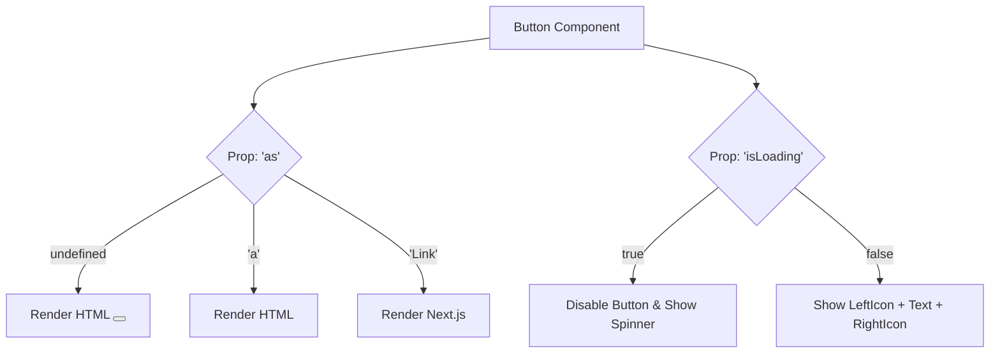

## WHY

The Button is the absolute foundation of any Design System. If you get the Button wrong, your entire UI will feel inconsistent, clunky, and inaccessible. 

A poorly designed Button component leads to "prop bloat" (e.g., `<Button isPrimary isLarge hasIcon isLoading isDanger />`), making the API impossible to maintain. A senior frontend engineer designs a Button to be polymorphic (it can render as an `<a>` or `<button>`), accessible (handling focus rings and ARIA states), and perfectly aligned with the system's design tokens (variants, sizes, states).

---

## THEORY

### The Anatomy of a Button
A Button must handle multiple dimensions of state and style simultaneously:
1. **Variants:** Primary, Secondary, Outline, Ghost, Danger.
2. **Sizes:** Small, Medium, Large.
3. **States:** Default, Hover, Active (pressed), Focus-Visible, Disabled, Loading.
4. **Content:** Text, Left Icon, Right Icon, Icon-Only.

### Polymorphism
Sometimes a visual "Button" is actually a link that navigates to a new page. Using a `<button onClick={() => navigate('/home')}>` is terrible for SEO and breaks right-click "Open in New Tab". A true Button component must be polymorphic—able to render as an `<a>` tag or a Next.js `<Link>` while maintaining exact Button styling.

### Focus Management & Accessibility
Browsers apply ugly default focus rings. Junior devs often use `outline: none;` to remove them, destroying keyboard accessibility. The correct approach is using the `:focus-visible` pseudo-class to only show the focus ring when a user navigates via keyboard, keeping it hidden during mouse clicks.

---

## IMPLEMENTATION

Here is an advanced, polymorphic React Button using `styled-components` and modern API design.

```tsx
import React, { forwardRef } from 'react';
import styled, { css } from 'styled-components';

// 1. Strict Token Maps for Variants
const VARIANT_STYLES = {
  primary: css`
    background-color: var(--color-primary-500);
    color: white;
    border: 1px solid transparent;
    &:hover:not(:disabled) { background-color: var(--color-primary-600); }
  `,
  secondary: css`
    background-color: var(--color-surface-200);
    color: var(--text-primary);
    border: 1px solid var(--border-subtle);
    &:hover:not(:disabled) { background-color: var(--color-surface-300); }
  `,
  ghost: css`
    background-color: transparent;
    color: var(--color-primary-500);
    border: 1px solid transparent;
    &:hover:not(:disabled) { background-color: var(--color-primary-50); }
  `
};

const SIZE_STYLES = {
  sm: css`padding: 6px 12px; font-size: 14px; border-radius: 4px;`,
  md: css`padding: 10px 16px; font-size: 16px; border-radius: 6px;`,
  lg: css`padding: 14px 24px; font-size: 18px; border-radius: 8px;`
};

// 2. The Styled Element
const StyledButton = styled.button<{ $variant: keyof typeof VARIANT_STYLES; $size: keyof typeof SIZE_STYLES }>`
  display: inline-flex;
  align-items: center;
  justify-content: center;
  gap: 8px;
  font-family: inherit;
  font-weight: 600;
  cursor: pointer;
  transition: all 0.2s ease-in-out;
  
  /* Inject Variant & Size */
  ${({ $variant }) => VARIANT_STYLES[$variant]}
  ${({ $size }) => SIZE_STYLES[$size]}

  /* Advanced Focus Visible */
  outline: none;
  &:focus-visible {
    box-shadow: 0 0 0 3px var(--color-primary-200);
    border-color: var(--color-primary-500);
  }

  &:disabled {
    opacity: 0.6;
    cursor: not-allowed;
  }
`;

// 3. Polymorphic Props Interface
type ButtonOptions = {
  variant?: keyof typeof VARIANT_STYLES;
  size?: keyof typeof SIZE_STYLES;
  isLoading?: boolean;
  leftIcon?: React.ReactNode;
  rightIcon?: React.ReactNode;
  as?: React.ElementType; // Allows rendering as 'a' or NextLink
};

export type ButtonProps = React.ButtonHTMLAttributes<HTMLButtonElement> & 
                          React.AnchorHTMLAttributes<HTMLAnchorElement> & 
                          ButtonOptions;

// 4. The ForwardRef Component
export const Button = forwardRef<HTMLButtonElement, ButtonProps>(({
  variant = 'primary',
  size = 'md',
  isLoading = false,
  leftIcon,
  rightIcon,
  children,
  disabled,
  as,
  ...rest
}, ref) => {
  return (
    <StyledButton
      ref={ref}
      as={as}
      $variant={variant}
      $size={size}
      disabled={disabled || isLoading}
      aria-disabled={disabled || isLoading}
      {...rest}
    >
      {isLoading && <Spinner size={size} />}
      {!isLoading && leftIcon}
      {children}
      {!isLoading && rightIcon}
    </StyledButton>
  );
});

Button.displayName = 'Button';
```

---

## VISUALIZATION_CONFIG


