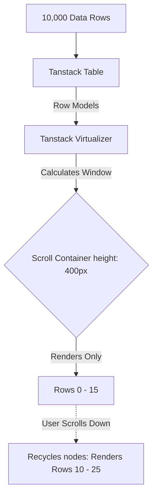

## WHY

Data display components are the workhorses of enterprise applications. While B2C apps might rely on beautiful Cards, B2B dashboards live and die by the `Data Table`. 

If you build a Data Table using standard HTML `<table>` tags without a virtualization strategy, rendering 5,000 rows will completely freeze the browser's main thread. Furthermore, if your Cards and Badges don't use strict design tokens, dashboards quickly become a visually chaotic mess of arbitrary padding, borders, and neon colors.

---

## THEORY

### Virtualization (Windowing)
When rendering a list of 10,000 items, the browser creates 10,000 DOM nodes. This consumes massive memory and stalls the painting pipeline. **Virtualization** solves this by only rendering the rows that are currently visible within the user's viewport (e.g., 20 rows). As the user scrolls, the framework constantly recycles those 20 DOM nodes, replacing their data and updating their absolute `top` positioning. 

### The Composition Pattern for Cards
Junior developers often build monolithic Card components: `<Card title="Hello" image="img.png" footer="Footer" />`. This becomes a nightmare when a designer asks to put a Badge next to the title, or a Button in the image.
Senior developers use the **Compound Component Pattern** to build Cards. Instead of one massive prop interface, the Card provides sub-components: `<Card.Header>`, `<Card.Body>`, `<Card.Footer>`. This allows infinite compositional flexibility without bloating the component API.

---

## IMPLEMENTATION

### 1. The Compound Card Component
Using React's Context (or simple dot-notation), we can build highly composable Cards.

```tsx
import React from 'react';
import styled from 'styled-components';

const CardWrapper = styled.div`
  background: var(--bg-surface);
  border: 1px solid var(--border-subtle);
  border-radius: 8px;
  overflow: hidden;
  box-shadow: 0 2px 8px rgba(0,0,0,0.05);
`;

const CardHeader = styled.div`
  padding: 16px; border-bottom: 1px solid var(--border-subtle); font-weight: 600;
`;

const CardBody = styled.div`
  padding: 16px;
`;

const CardFooter = styled.div`
  padding: 16px; background: var(--bg-muted); border-top: 1px solid var(--border-subtle);
`;

// Export as a Compound Component
export const Card = Object.assign(
  ({ children }: { children: React.ReactNode }) => <CardWrapper>{children}</CardWrapper>,
  {
    Header: CardHeader,
    Body: CardBody,
    Footer: CardFooter
  }
);

// Usage:
// <Card>
//   <Card.Header>User Profile</Card.Header>
//   <Card.Body><Avatar /> <h3>John Doe</h3></Card.Body>
//   <Card.Footer><Button>Edit</Button></Card.Footer>
// </Card>
```

### 2. High-Performance Virtualized Data Table
Instead of building a Table from scratch, enterprise teams use Headless UI libraries like `@tanstack/react-table` combined with `@tanstack/react-virtual` for row virtualization. 

```tsx
import { useReactTable, getCoreRowModel, flexRender } from '@tanstack/react-table';
import { useVirtualizer } from '@tanstack/react-virtual';
import { useRef } from 'react';
import styled from 'styled-components';

const TableContainer = styled.div`
  height: 400px; /* Crucial for virtualization window */
  overflow: auto;
  border: 1px solid var(--border-subtle);
`;

const StyledTable = styled.table`
  width: 100%; border-collapse: collapse; table-layout: fixed;
`;

export function VirtualizedTable({ data, columns }) {
  // 1. Headless Table Logic (Sorting, Filtering, Column Resizing)
  const table = useReactTable({
    data,
    columns,
    getCoreRowModel: getCoreRowModel(),
  });

  const { rows } = table.getRowModel();
  const tableContainerRef = useRef<HTMLDivElement>(null);

  // 2. Virtualizer (Windowing Logic)
  const rowVirtualizer = useVirtualizer({
    count: rows.length,
    getScrollElement: () => tableContainerRef.current,
    estimateSize: () => 40, // Estimated row height
    overscan: 5, // Render 5 rows above/below to prevent flicker during fast scrolling
  });

  return (
    <TableContainer ref={tableContainerRef}>
      <StyledTable>
        <thead>
          {table.getHeaderGroups().map(headerGroup => (
            <tr key={headerGroup.id}>
              {headerGroup.headers.map(header => (
                <th key={header.id} style={{ width: header.getSize() }}>
                  {flexRender(header.column.columnDef.header, header.getContext())}
                </th>
              ))}
            </tr>
          ))}
        </thead>
        <tbody style={{ height: `${rowVirtualizer.getTotalSize()}px`, position: 'relative' }}>
          {rowVirtualizer.getVirtualItems().map(virtualRow => {
            const row = rows[virtualRow.index];
            return (
              <tr
                key={row.id}
                style={{
                  position: 'absolute',
                  top: 0,
                  left: 0,
                  width: '100%',
                  height: `${virtualRow.size}px`,
                  transform: `translateY(${virtualRow.start}px)`, // Move the row to its correct scroll position
                }}
              >
                {row.getVisibleCells().map(cell => (
                  <td key={cell.id}>
                    {flexRender(cell.column.columnDef.cell, cell.getContext())}
                  </td>
                ))}
              </tr>
            );
          })}
        </tbody>
      </StyledTable>
    </TableContainer>
  );
}
```

---

## VISUALIZATION_CONFIG


