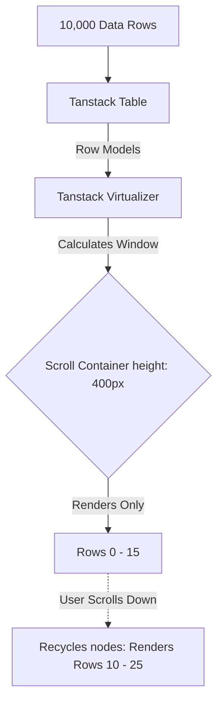

## WHY

Data display components are the workhorses of enterprise applications. While B2C apps might rely on beautiful Cards, B2B dashboards live and die by the `Data Table`. 

If you build a Data Table using standard HTML `<table>` tags without a virtualization strategy, rendering 5,000 rows will completely freeze the browser's main thread. Furthermore, if your Cards and Badges don't use strict design tokens, dashboards quickly become a visually chaotic mess of arbitrary padding, borders, and neon colors.

---

## THEORY

### Virtualization (Windowing)
When rendering a list of 10,000 items, the browser creates 10,000 DOM nodes. This consumes massive memory and stalls the painting pipeline. **Virtualization** solves this by only rendering the rows that are currently visible within the user's viewport (e.g., 20 rows). As the user scrolls, the framework constantly recycles those 20 DOM nodes, replacing their data and updating their absolute `top` positioning. 

### The Composition Pattern for Cards
Junior developers often build monolithic Card components: `<Card title="Hello" image="img.png" footer="Footer" />`. This becomes a nightmare when a designer asks to put a Badge next to the title, or a Button in the image.
Senior developers use the **Compound Component Pattern** to build Cards. Instead of one massive prop interface, the Card provides sub-components: `<Card.Header>`, `<Card.Body>`, `<Card.Footer>`. This allows infinite compositional flexibility without bloating the component API.

---

## IMPLEMENTATION

### 1. The Compound Card Component
Using React's Context (or simple dot-notation), we can build highly composable Cards.

```tsx
import React from 'react';
import styled from 'styled-components';

const CardWrapper = styled.div`
  background: var(--bg-surface);
  border: 1px solid var(--border-subtle);
  border-radius: 8px;
  overflow: hidden;
  box-shadow: 0 2px 8px rgba(0,0,0,0.05);
`;

const CardHeader = styled.div`
  padding: 16px; border-bottom: 1px solid var(--border-subtle); font-weight: 600;
`;

const CardBody = styled.div`
  padding: 16px;
`;

const CardFooter = styled.div`
  padding: 16px; background: var(--bg-muted); border-top: 1px solid var(--border-subtle);
`;

// Export as a Compound Component
export const Card = Object.assign(
  ({ children }: { children: React.ReactNode }) => <CardWrapper>{children}</CardWrapper>,
  {
    Header: CardHeader,
    Body: CardBody,
    Footer: CardFooter
  }
);

// Usage:
// <Card>
//   <Card.Header>User Profile</Card.Header>
//   <Card.Body><Avatar /> <h3>John Doe</h3></Card.Body>
//   <Card.Footer><Button>Edit</Button></Card.Footer>
// </Card>
```

### 2. High-Performance Virtualized Data Table
Instead of building a Table from scratch, enterprise teams use Headless UI libraries like `@tanstack/react-table` combined with `@tanstack/react-virtual` for row virtualization. 

```tsx
import { useReactTable, getCoreRowModel, flexRender } from '@tanstack/react-table';
import { useVirtualizer } from '@tanstack/react-virtual';
import { useRef } from 'react';
import styled from 'styled-components';

const TableContainer = styled.div`
  height: 400px; /* Crucial for virtualization window */
  overflow: auto;
  border: 1px solid var(--border-subtle);
`;

const StyledTable = styled.table`
  width: 100%; border-collapse: collapse; table-layout: fixed;
`;

export function VirtualizedTable({ data, columns }) {
  // 1. Headless Table Logic (Sorting, Filtering, Column Resizing)
  const table = useReactTable({
    data,
    columns,
    getCoreRowModel: getCoreRowModel(),
  });

  const { rows } = table.getRowModel();
  const tableContainerRef = useRef<HTMLDivElement>(null);

  // 2. Virtualizer (Windowing Logic)
  const rowVirtualizer = useVirtualizer({
    count: rows.length,
    getScrollElement: () => tableContainerRef.current,
    estimateSize: () => 40, // Estimated row height
    overscan: 5, // Render 5 rows above/below to prevent flicker during fast scrolling
  });

  return (
    <TableContainer ref={tableContainerRef}>
      <StyledTable>
        <thead>
          {table.getHeaderGroups().map(headerGroup => (
            <tr key={headerGroup.id}>
              {headerGroup.headers.map(header => (
                <th key={header.id} style={{ width: header.getSize() }}>
                  {flexRender(header.column.columnDef.header, header.getContext())}
                </th>
              ))}
            </tr>
          ))}
        </thead>
        <tbody style={{ height: `${rowVirtualizer.getTotalSize()}px`, position: 'relative' }}>
          {rowVirtualizer.getVirtualItems().map(virtualRow => {
            const row = rows[virtualRow.index];
            return (
              <tr
                key={row.id}
                style={{
                  position: 'absolute',
                  top: 0,
                  left: 0,
                  width: '100%',
                  height: `${virtualRow.size}px`,
                  transform: `translateY(${virtualRow.start}px)`, // Move the row to its correct scroll position
                }}
              >
                {row.getVisibleCells().map(cell => (
                  <td key={cell.id}>
                    {flexRender(cell.column.columnDef.cell, cell.getContext())}
                  </td>
                ))}
              </tr>
            );
          })}
        </tbody>
      </StyledTable>
    </TableContainer>
  );
}
```

---

## VISUALIZATION_CONFIG




## CODE

### Level 1 — Beginner: Data Table with Sorting
```tsx
// Basic table component — foundation of all data-display patterns
interface Column<T> {
  key: keyof T;
  header: string;
  render?: (value: T[keyof T], row: T) => React.ReactNode;
}

interface TableProps<T extends { id: string | number }> {
  columns: Column<T>[];
  data: T[];
  caption?: string; // Required for accessibility — describes what the table contains
}

export function Table<T extends { id: string | number }>({ columns, data, caption }: TableProps<T>) {
  return (
    <div className="table-container" role="region" aria-label={caption} tabIndex={0}>
      <table>
        {caption && <caption className="sr-only">{caption}</caption>}
        <thead>
          <tr>
            {columns.map(col => (
              <th key={String(col.key)} scope="col">{col.header}</th>
            ))}
          </tr>
        </thead>
        <tbody>
          {data.map(row => (
            <tr key={row.id}>
              {columns.map(col => (
                <td key={String(col.key)}>
                  {col.render ? col.render(row[col.key], row) : String(row[col.key] ?? '')}
                </td>
              ))}
            </tr>
          ))}
        </tbody>
      </table>
    </div>
  );
}
```

### Level 2 — Intermediate: Sortable Table with Virtual Scrolling
```tsx
import { useState, useMemo } from 'react';

type SortDirection = 'asc' | 'desc' | null;
interface SortState { key: string; direction: SortDirection }

export function SortableTable<T extends { id: string | number }>({ columns, data, caption }: TableProps<T>) {
  const [sort, setSort] = useState<SortState>({ key: '', direction: null });

  const sortedData = useMemo(() => {
    if (!sort.direction || !sort.key) return data;
    return [...data].sort((a, b) => {
      const aVal = a[sort.key as keyof T];
      const bVal = b[sort.key as keyof T];
      const cmp = String(aVal).localeCompare(String(bVal), undefined, { numeric: true });
      return sort.direction === 'asc' ? cmp : -cmp;
    });
  }, [data, sort]);

  const toggleSort = (key: string) => {
    setSort(prev =>
      prev.key === key
        ? { key, direction: prev.direction === 'asc' ? 'desc' : prev.direction === 'desc' ? null : 'asc' }
        : { key, direction: 'asc' }
    );
  };

  return (
    <table>
      <thead>
        <tr>
          {columns.map(col => (
            <th
              key={String(col.key)}
              onClick={() => toggleSort(String(col.key))}
              aria-sort={sort.key === String(col.key) ? sort.direction ?? 'none' : 'none'}
              style={{ cursor: 'pointer' }}
            >
              {col.header} {sort.key === String(col.key) ? (sort.direction === 'asc' ? '↑' : '↓') : '⇕'}
            </th>
          ))}
        </tr>
      </thead>
      <tbody>{sortedData.map(row => <tr key={row.id}>{columns.map(col => <td key={String(col.key)}>{String(row[col.key] ?? '')}</td>)}</tr>)}</tbody>
    </table>
  );
}
```

### Level 3 — Advanced: Data Grid with Pagination & Filtering
```tsx
import { useState, useMemo, useCallback } from 'react';

interface DataGridProps<T extends { id: string | number }> {
  columns: Column<T>[];
  data: T[];
  pageSize?: number;
  searchable?: boolean;
}

export function DataGrid<T extends { id: string | number }>({
  columns, data, pageSize = 10, searchable = false
}: DataGridProps<T>) {
  const [query, setQuery] = useState('');
  const [page, setPage] = useState(0);
  const [sort, setSort] = useState<SortState>({ key: '', direction: null });

  // Filter → Sort → Paginate pipeline
  const filtered = useMemo(() => {
    if (!query) return data;
    const q = query.toLowerCase();
    return data.filter(row =>
      columns.some(col => String(row[col.key] ?? '').toLowerCase().includes(q))
    );
  }, [data, query, columns]);

  const sorted = useMemo(() => {
    if (!sort.direction) return filtered;
    return [...filtered].sort((a, b) => {
      const cmp = String(a[sort.key as keyof T]).localeCompare(String(b[sort.key as keyof T]), undefined, { numeric: true });
      return sort.direction === 'asc' ? cmp : -cmp;
    });
  }, [filtered, sort]);

  const pageCount = Math.ceil(sorted.length / pageSize);
  const paginated = sorted.slice(page * pageSize, (page + 1) * pageSize);

  // Reset page when filter changes
  const handleSearch = useCallback((e: React.ChangeEvent<HTMLInputElement>) => {
    setQuery(e.target.value);
    setPage(0);
  }, []);

  return (
    <div className="data-grid">
      {searchable && (
        <input
          type="search"
          value={query}
          onChange={handleSearch}
          placeholder="Search..."
          aria-label="Search table"
        />
      )}
      <SortableTable columns={columns} data={paginated} />
      <nav aria-label="Table pagination">
        <button disabled={page === 0} onClick={() => setPage(p => p - 1)}>Previous</button>
        <span>Page {page + 1} of {pageCount}</span>
        <button disabled={page >= pageCount - 1} onClick={() => setPage(p => p + 1)}>Next</button>
      </nav>
    </div>
  );
}
```

### Level 4 — Expert / Production: Virtualized Table (100K rows)
```tsx
import { useVirtualizer } from '@tanstack/react-virtual'; // npm install @tanstack/react-virtual
import { useRef } from 'react';

// Virtualizer renders only visible rows — critical for 10K+ row tables
export function VirtualTable<T extends { id: string | number }>({ columns, data }: TableProps<T>) {
  const parentRef = useRef<HTMLDivElement>(null);

  const rowVirtualizer = useVirtualizer({
    count: data.length,
    getScrollElement: () => parentRef.current,
    estimateSize: () => 40,   // Estimated row height in px
    overscan: 5,              // Render 5 extra rows above/below viewport for smooth scrolling
  });

  const virtualRows = rowVirtualizer.getVirtualItems();
  const totalSize = rowVirtualizer.getTotalSize();
  const paddingTop = virtualRows.length > 0 ? virtualRows[0].start : 0;
  const paddingBottom = virtualRows.length > 0 ? totalSize - virtualRows[virtualRows.length - 1].end : 0;

  return (
    <div
      ref={parentRef}
      style={{ height: '400px', overflow: 'auto' }}
      role="grid"
      aria-rowcount={data.length}
    >
      <table style={{ width: '100%' }}>
        <thead style={{ position: 'sticky', top: 0, zIndex: 1, background: 'white' }}>
          <tr>{columns.map(col => <th key={String(col.key)}>{col.header}</th>)}</tr>
        </thead>
        <tbody>
          {paddingTop > 0 && <tr><td style={{ height: paddingTop }} /></tr>}
          {virtualRows.map(virtualRow => {
            const row = data[virtualRow.index];
            return (
              <tr key={row.id} data-index={virtualRow.index} ref={rowVirtualizer.measureElement}>
                {columns.map(col => (
                  <td key={String(col.key)}>
                    {col.render ? col.render(row[col.key], row) : String(row[col.key] ?? '')}
                  </td>
                ))}
              </tr>
            );
          })}
          {paddingBottom > 0 && <tr><td style={{ height: paddingBottom }} /></tr>}
        </tbody>
      </table>
    </div>
  );
}
```
## REAL_WORLD

### How GitHub Uses Data Display Components

GitHub's design system (Primer) powers data display across 200M+ repositories. Their Table and DataGrid components are critical — every PR list, commit history, and file explorer is a data display variant. Key learning from their open-source Primer: data display components fail in production not from missing features, but from missing edge cases — empty states, loading skeletons, truncation, and large-dataset virtual scrolling.

```tsx
// Production pattern — Primer-style data display with edge cases
interface DataTableProps<T> {
  data: T[];
  columns: ColumnDef<T>[];
  isLoading?: boolean;
  emptyState?: React.ReactNode;   // What to show when data is empty
  onSort?: (key: keyof T, dir: 'asc' | 'desc') => void;
  stickyHeader?: boolean;
  rowKey: (row: T) => string;     // Stable key for reconciliation
}

function DataTable<T>({ data, columns, isLoading, emptyState, rowKey }: DataTableProps<T>) {
  if (isLoading) return <TableSkeleton rows={5} cols={columns.length} />;

  return (
    <div role="region" aria-label="Data table" tabIndex={0} className="overflow-x-auto">
      <table>
        <thead>
          <tr>
            {columns.map(col => (
              <th key={col.key} scope="col" aria-sort={col.sortDir ?? 'none'}>
                {col.header}
              </th>
            ))}
          </tr>
        </thead>
        <tbody>
          {data.length === 0
            ? <tr><td colSpan={columns.length}>{emptyState ?? 'No data'}</td></tr>
            : data.map(row => (
                <tr key={rowKey(row)}>
                  {columns.map(col => (
                    <td key={col.key}>{col.render(row)}</td>
                  ))}
                </tr>
              ))
          }
        </tbody>
      </table>
    </div>
  );
}
```

### Production Gotcha: Missing Empty State Crashes UX
```tsx
// ❌ Renders empty table body — looks broken, no user guidance
{data.map(row => <TableRow key={row.id} {...row} />)}

// ✅ Always handle empty/loading/error states
{isLoading ? <Skeleton /> : data.length === 0 ? <EmptyState message="No results" /> : data.map(...)}
```
**Why it happens:** Developers test with populated data and forget the empty state. First-time users hit a blank table with no guidance.

| State | Component |
|-------|-----------|
| Loading | Skeleton rows |
| Empty | Illustrated empty state |
| Error | Error state with retry |
| Populated | Data rows |

## INTERVIEW

**Q1 (Junior): What is the difference between a Table and a DataGrid?**
A: A Table (`<table>`) is a semantic HTML element for tabular data — static, read-only, screen-reader friendly via `scope`, `headers`, and caption. A DataGrid adds interactive capabilities: sorting, filtering, inline editing, virtual scrolling, row selection. DataGrids typically use `role="grid"` with `role="row"` and `role="gridcell"` for proper ARIA semantics. Use Table for read-only structured data; DataGrid when users interact with the data itself.

**Q2 (Junior): Why must every data display component handle loading and empty states?**
A: Loading states prevent layout shift and tell users to wait rather than assuming the page is broken. Empty states guide users on what to do when no data exists — "No results. Create your first item." — rather than showing a blank space. Missing these states is one of the top causes of poor perceived performance and user confusion in data-heavy apps.

**Q3 (Mid): How do you make a Table accessible for screen readers?**
A: Use semantic `<table>`, `<thead>`, `<tbody>`, `<th scope="col">` (column headers), `<th scope="row">` (row headers). Add a `<caption>` describing the table purpose. For sortable columns, use `aria-sort="ascending|descending|none"`. Wrap scrollable tables in a `<div role="region" tabIndex={0} aria-label="...">` so keyboard users can scroll. Never use CSS `display: grid` on a `<table>` — it removes all table semantics.

**Q4 (Mid): When should you use virtual scrolling and what are its trade-offs?**
A: Virtual scrolling renders only visible rows in the DOM, recycling off-screen rows. Use it when the dataset exceeds ~500 rows — below that, DOM cost is negligible. Trade-offs: breaks native Ctrl+F browser search, makes screenshot testing harder, requires stable row heights (or complex dynamic height measurement), and loses native accessibility unless explicitly re-implemented with `aria-rowcount` and `aria-rowindex`. Libraries: `@tanstack/react-virtual`, `react-window`.

**Q5 (Senior): How do you design a column definition API that supports custom cell rendering?**
A: Use a `ColumnDef<T>` type with `header: string | ReactNode`, `key: keyof T`, and `render: (row: T) => ReactNode`. The `render` function gives consumers full control over cell content while the table owns layout and accessibility. For sort, expose `sortKey` separately from the render key so sorted value differs from displayed value (e.g. display "Jan 1" but sort by timestamp).

## FEYNMAN CHECK

### Explain Data Display Like I'm 10 Years Old
> Data display components are showcases for information — a table is like a spreadsheet you can read but (usually) not edit, a card grid is like sticky notes on a wall, and a list is a to-do list. The hard part isn't showing the data when it's there — it's handling when it's loading, when there's none, and when there are 10 million rows. This is why every production data component has three states before showing the actual data.

---

### 5 Deep Questions
**Q1: Why is the empty state as important as the populated state?**
> **A:** Empty is the first state new users see. A blank table with no guidance creates abandonment — the user assumes the product is broken. An illustrated empty state with a clear call-to-action ("No tasks. Add your first one.") converts blank to onboarding. First impressions are empty states.

**Q2: Mental model for data display states.**
> **A:** "Every data component has exactly four states: loading (skeleton), empty (illustrated prompt), error (message + retry), populated (the actual data). Design all four before shipping."

**Q3: Misconception with code.**
> **A:** Using array index as key.
> ```tsx
> // ❌ index key — causes wrong rows to update on sort/filter
> {data.map((row, i) => <TableRow key={i} {...row} />)}
> // ✅ stable identity key
> {data.map(row => <TableRow key={row.id} {...row} />)}
> ```

**Q4: How does virtualisation interact with accessibility?**
> **A:** Virtual scrolling removes off-screen DOM nodes, breaking screen reader row count announcements. Requires explicit `aria-rowcount={totalRows}` on `<table>` and `aria-rowindex` on each visible `<tr>` to communicate true dataset size.

**Q5: Senior one-liner.**
> **A:** "Data display components are state machines with four states (loading/empty/error/populated) and semantic HTML contracts — getting any state wrong costs user trust."

## BUILD

### 🏗️ Mini Project: Data Table with All Four States

**What you will build:** A typed DataTable component handling loading, empty, error, and populated states with accessible markup.
**Time estimate:** 40 minutes

#### Step 1 — Setup
```bash
mkdir data-table && cd data-table
npx create-next-app@latest . --typescript --tailwind --no-src-dir --app
```

#### Step 2 — Core
```tsx
type Status = 'idle'|'loading'|'error'|'success';
interface Col<T> { key: keyof T; header: string; render?: (row:T)=>React.ReactNode; }
function DataTable<T extends {id:string|number}>({cols, data, status, error, onRetry}: {cols:Col<T>[];data:T[];status:Status;error?:string;onRetry?:()=>void}) {
  if(status==='loading') return <div aria-busy="true" role="status">Loading…</div>;
  if(status==='error') return <div role="alert">{error}<button onClick={onRetry}>Retry</button></div>;
  return (
    <table>
      <thead><tr>{cols.map(c=><th key={String(c.key)} scope="col">{c.header}</th>)}</tr></thead>
      <tbody>
        {data.length===0 ? <tr><td colSpan={cols.length}>No data found.</td></tr>
         : data.map(row=><tr key={row.id}>{cols.map(c=><td key={String(c.key)}>{c.render?.(row)??String(row[c.key])}</td>)}</tr>)}
      </tbody>
    </table>
  );
}
```

#### Step 5 — Tests
```tsx
test('shows loading state', () => {
  render(<DataTable cols={[]} data={[]} status="loading" />);
  expect(screen.getByRole('status')).toBeInTheDocument();
});
test('shows empty state', () => {
  render(<DataTable cols={[{key:'name',header:'Name'}]} data={[]} status="success" />);
  expect(screen.getByText('No data found.')).toBeInTheDocument();
});
```
**Expected Output:** shows loading + shows empty pass

## SPACED REVIEW

### Day 1
**Q1:** Name the 4 states every data component must handle. What renders in each?
**Q2:** Why is array index a dangerous row key?
**Q3:** Write a 15-line table with loading and empty states.

### Day 3
**Q4:** Table vs DataGrid — when to use each?
**Q5:** Empty state bug — show with code.
**Q6:** Add sorting UI to a column definition.

### Day 7
**Q7:** Build a virtual list for 10k rows using a window of 20.
**Q8:** PR uses index keys on a sortable table — diagnose the bug.
**Q9:** Accessibility cost of virtual scrolling.

### Day 14
**Q10:** ★ "Design a data table for a system with 1M rows — pagination vs virtualisation trade-offs."
**Q11:** Link data-display → accessibility → empty-states → loading-patterns.
**Q12:** ★ "Analytics dashboard showing 50 charts — all live data. How do you handle loading, stale, and error states at scale?"
