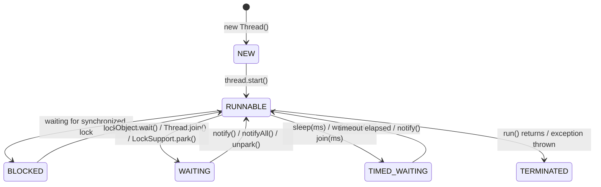

## WHY
In concurrent programming, threads are the fundamental execution units. A Java thread is not merely a high-level language construct; it is a direct projection of an operating system (OS) kernel thread (under the standard 1:1 threading model used by modern JVMs on Linux, macOS, and Windows). 

When building high-concurrency applications, threads frequently transition between states as they compete for CPU cores, wait for I/O, attempt to acquire locks, or sleep. A senior engineer must understand these transitions at a microscopic level. Misunderstanding thread states leads to critical failures:
* **Deadlocks**: Threads stuck in `BLOCKED` or `WAITING` states waiting for each other indefinitely.
* **Thread Leaks**: Threads created but never terminated, consuming OS-level file descriptors and memory.
* **Performance Bottlenecks**: High CPU utilization caused by threads spinning in user space (busy-waiting) instead of transitioning to

## THEORY

### Java Thread Lifecycle — The 6 States

A Java thread is a `java.lang.Thread` object that wraps an OS thread (in Java 21+, also a virtual thread). The JVM tracks each thread's state as one of 6 enum values defined in `Thread.State`.



### Step-by-Step Internal Breakdown

1. **NEW** — `Thread` object created, no OS thread yet. `start()` not yet called.
2. **RUNNABLE** — OS thread exists and is either running on CPU or in the OS ready queue waiting for CPU time. JVM cannot distinguish "running on CPU" from "waiting for CPU" — both appear as RUNNABLE.
3. **BLOCKED** — Thread tried to enter a `synchronized` block/method and the monitor is held by another thread. The thread waits in the monitor's "entry set" (not the wait set).
4. **WAITING** — Thread called `Object.wait()`, `Thread.join()`, or `LockSupport.park()` with no timeout. Waits indefinitely until explicitly notified/unparked.
5. **TIMED_WAITING** — Same as WAITING but with a timeout: `Thread.sleep(ms)`, `Object.wait(ms)`, `Thread.join(ms)`, `LockSupport.parkNanos()`.
6. **TERMINATED** — `run()` method has returned or an uncaught exception terminated the thread. OS thread is destroyed.

### Comparison Table

| State | Consuming CPU? | Reason | Wake-up trigger |
|-------|---------------|--------|-----------------|
| NEW | No | Not started | thread.start() |
| RUNNABLE | Yes/No | Running or ready | CPU scheduler |
| BLOCKED | No | Waiting for monitor | Monitor released |
| WAITING | No | Explicit wait | notify()/unpark() |
| TIMED_WAITING | No | Timed wait | Timeout or notify() |
| TERMINATED | No | Finished | N/A |

### Common Misconception

Most developers think RUNNABLE means "currently executing on CPU". Actually, RUNNABLE means "eligible to run" — the thread may be waiting for CPU time in the OS scheduler queue. A RUNNABLE thread with high CPU time is actively executing; a RUNNABLE thread with zero CPU time is waiting in the OS ready queue. This is why profilers distinguish "CPU time" from "wall-clock time" — a thread can be RUNNABLE for 500ms wall-clock but only 10ms CPU time if the system is overloaded.

### Edge Cases
- **Spurious wakeup:** A thread in WAITING can wake up without `notify()` being called. Always use `wait()` in a loop: `while (!condition) lock.wait();`
- **Thread.interrupt():** Interrupting a WAITING/TIMED_WAITING thread wakes it with `InterruptedException`. Interrupting a BLOCKED thread sets the interrupt flag but does not unblock it.
- **Virtual threads (Java 21+):** Virtual threads (Project Loom) add a MOUNTED/UNMOUNTED distinction — a virtual thread can be RUNNABLE but not mounted on a platform thread, freeing the carrier for other work during I/O.

## VISUALIZATION_CONFIG
```json
{
  "language": "java",
  "fileName": "ThreadLifecycle.java",
  "steps": [
    {
      "title": "Thread states overview",
      "description": "A Java thread has 6 states: NEW, RUNNABLE, BLOCKED, WAITING, TIMED_WAITING, TERMINATED. Thread.getState() returns the current state.",
      "code": "Thread t = new Thread(() -> System.out.println(\"running\"));\nt.getState();  // NEW\nt.start();\nt.getState();  // RUNNABLE (or already TERMINATED)\n// Other states observed during execution:\n// BLOCKED: waiting for monitor lock\n// WAITING: Object.wait() or Thread.join()\n// TIMED_WAITING: Thread.sleep(ms) or wait(timeout)",
      "diagram": {
        "kind": "threads",
        "threads": [
          {
            "name": "NEW",
            "state": "NEW",
            "note": "created, not started"
          },
          {
            "name": "RUNNABLE",
            "state": "RUNNABLE",
            "note": "executing or ready"
          },
          {
            "name": "BLOCKED",
            "state": "BLOCKED",
            "note": "waiting for monitor"
          },
          {
            "name": "WAITING",
            "state": "WAITING",
            "note": "wait() / join()"
          }
        ]
      }
    },
    {
      "title": "BLOCKED vs WAITING",
      "description": "BLOCKED: waiting to acquire a synchronized lock. WAITING: explicitly parked via Object.wait(), LockSupport.park(), or Thread.join().",
      "code": "// BLOCKED: another thread holds the lock\nsynchronized(lock) { /* thread A holds */ }\n// Thread B: blocked waiting for lock\n\n// WAITING: thread voluntarily waits\nsynchronized(lock) {\n    lock.wait();  // releases lock, enters WAITING\n    // woken by lock.notify() or notifyAll()\n}",
      "highlight": [
        2,
        3,
        6,
        7
      ],
      "diagram": {
        "kind": "boxes",
        "title": "BLOCKED vs WAITING",
        "items": [
          {
            "label": "BLOCKED: contending for synchronized lock",
            "color": "#f59e0b",
            "highlight": true
          },
          {
            "label": "WAITING: voluntarily parked (wait/join)",
            "color": "#818cf8"
          },
          {
            "label": "TIMED_WAITING: sleep/wait with timeout",
            "color": "#818cf8"
          }
        ]
      }
    },
    {
      "title": "Creating threads � 4 ways",
      "description": "Extend Thread, implement Runnable, use Callable+Future, or use ExecutorService. ExecutorService is preferred for production.",
      "code": "// 1. Extend Thread\nnew Thread() { public void run() { ... } }.start();\n// 2. Runnable\nnew Thread(() -> { ... }).start();\n// 3. Callable + Future\nFuture<Integer> f = executor.submit(() -> 42);\nf.get();  // blocks until done\n// 4. ExecutorService (preferred)\nexecutor.execute(() -> { ... });",
      "highlight": [
        2,
        4,
        6,
        7,
        9
      ],
      "diagram": {
        "kind": "boxes",
        "title": "4 ways to create threads",
        "items": [
          {
            "label": "extend Thread: simple but inflexible",
            "color": "#818cf8"
          },
          {
            "label": "Runnable: functional, reusable",
            "color": "#818cf8"
          },
          {
            "label": "Callable+Future: return value + exception",
            "color": "#10b981"
          },
          {
            "label": "ExecutorService: production-ready, reuse",
            "color": "#10b981",
            "highlight": true
          }
        ]
      }
    },
    {
      "title": "Thread interruption",
      "description": "Thread.interrupt() sets the interrupt flag. Blocking methods (sleep, wait, join) throw InterruptedException. Non-blocking: check Thread.interrupted().",
      "code": "// Interruptible task:\nvoid task() throws InterruptedException {\n    while (!Thread.currentThread().isInterrupted()) {\n        // do work\n        Thread.sleep(100);  // throws InterruptedException if interrupted\n    }\n}\n// Cancel:\nworkerThread.interrupt();",
      "highlight": [
        3,
        5,
        8
      ],
      "diagram": {
        "kind": "flow",
        "steps": [
          {
            "label": "thread.interrupt() sets interrupt flag",
            "done": true
          },
          {
            "label": "blocking method: throws InterruptedException",
            "done": true
          },
          {
            "label": "non-blocking: check isInterrupted() manually",
            "active": true
          },
          {
            "label": "always catch + restore or propagate InterruptedException"
          }
        ]
      }
    },
    {
      "title": "ThreadLocal � per-thread variables",
      "description": "ThreadLocal gives each thread its own copy of a variable. Used for context propagation: transaction ID, user session, MDC logging.",
      "code": "ThreadLocal<String> userCtx = new ThreadLocal<>();\n// Set in request filter:\nuserCtx.set(request.getUserId());\n// Access anywhere in same thread:\nString userId = userCtx.get();\n// MUST clean up (thread pool reuse!)\nuserCtx.remove();",
      "highlight": [
        2,
        4,
        6,
        7
      ],
      "diagram": {
        "kind": "boxes",
        "title": "ThreadLocal",
        "items": [
          {
            "label": "each thread has its own value",
            "color": "#10b981",
            "highlight": true
          },
          {
            "label": "no synchronization needed",
            "color": "#10b981"
          },
          {
            "label": "thread pool: MUST call remove() to avoid leaks",
            "color": "#ef4444"
          }
        ]
      }
    }
  ]
}
```

## CODE

### Level 1 — Beginner: Observe All 6 Thread States
```java
public class ThreadStatesDemo {
    public static void main(String[] args) throws InterruptedException {
        // State 1: NEW
        Thread t = new Thread(() -> {
            try { Thread.sleep(500); } catch (InterruptedException e) { Thread.currentThread().interrupt(); }
        });
        System.out.println("1. NEW: " + t.getState()); // NEW

        // State 2: RUNNABLE (after start)
        t.start();
        System.out.println("2. RUNNABLE: " + t.getState()); // RUNNABLE

        // State 3: TIMED_WAITING (during sleep)
        Thread.sleep(10); // Let t enter sleep
        System.out.println("3. TIMED_WAITING: " + t.getState()); // TIMED_WAITING

        // State 4: TERMINATED (after completion)
        t.join();
        System.out.println("4. TERMINATED: " + t.getState()); // TERMINATED
    }
}
```

### Level 2 — Intermediate: BLOCKED vs WAITING Demo
```java
public class BlockedVsWaiting {
    static final Object lock = new Object();

    public static void main(String[] args) throws InterruptedException {
        // Thread that holds the lock for 2 seconds
        Thread holder = new Thread(() -> {
            synchronized (lock) {
                try { Thread.sleep(2000); } catch (InterruptedException e) {}
            }
        });

        // Thread that tries to acquire the same lock
        Thread blocker = new Thread(() -> {
            synchronized (lock) {} // Will be BLOCKED until holder releases
        });

        // Thread that calls wait() on the lock
        Thread waiter = new Thread(() -> {
            synchronized (lock) {
                try { lock.wait(2000); } catch (InterruptedException e) {} // WAITING
            }
        });

        holder.start();
        Thread.sleep(50); // Let holder acquire lock

        blocker.start();
        Thread.sleep(50);
        System.out.println("blocker state: " + blocker.getState()); // BLOCKED

        // waiter needs lock first — wait for holder to release
        holder.join();
        waiter.start();
        Thread.sleep(50);
        System.out.println("waiter state: " + waiter.getState()); // TIMED_WAITING
        waiter.join(); blocker.join();
    }
}
```

### Level 3 — Advanced: Thread State Machine Monitor
```java
import java.util.concurrent.*;
import java.util.concurrent.atomic.*;

// Production: monitor thread states to detect deadlocks and starvation
public class ThreadStateMonitor {
    private final ScheduledExecutorService scheduler = Executors.newScheduledThreadPool(1);

    public void startMonitoring(Collection<Thread> threads) {
        scheduler.scheduleAtFixedRate(() -> {
            Map<Thread.State, Long> stateCounts = threads.stream()
                .collect(Collectors.groupingBy(Thread::getState, Collectors.counting()));

            long blocked = stateCounts.getOrDefault(Thread.State.BLOCKED, 0L);
            long waiting = stateCounts.getOrDefault(Thread.State.WAITING, 0L);

            // Alert: too many blocked threads = lock contention
            if (blocked > threads.size() * 0.5) {
                System.err.println("⚠️ HIGH CONTENTION: " + blocked + " threads BLOCKED");
                detectDeadlock();
            }
            // Alert: too many waiting threads = potential starvation
            if (waiting > threads.size() * 0.8) {
                System.err.println("⚠️ STARVATION RISK: " + waiting + " threads WAITING");
            }
        }, 0, 5, TimeUnit.SECONDS);
    }

    private void detectDeadlock() {
        ThreadMXBean tmx = ManagementFactory.getThreadMXBean();
        long[] deadlocked = tmx.findDeadlockedThreads();
        if (deadlocked != null) {
            ThreadInfo[] info = tmx.getThreadInfo(deadlocked, true, true);
            System.err.println("🔴 DEADLOCK DETECTED:");
            for (ThreadInfo ti : info) System.err.println("  " + ti.getThreadName() + ": " + ti.getThreadState());
        }
    }

    public void stop() { scheduler.shutdown(); }
}
```

### Level 4 — Expert / Production: Virtual Thread Lifecycle (Java 21+)
```java
import java.util.concurrent.*;

// Virtual threads: lightweight, ~100 bytes each vs ~1MB for platform threads
// Lifecycle addition: MOUNTED (on carrier thread) / UNMOUNTED (waiting, carrier freed)
public class VirtualThreadDemo {
    public static void main(String[] args) throws InterruptedException {
        int TASKS = 10_000;
        ExecutorService virtualExecutor = Executors.newVirtualThreadPerTaskExecutor();

        long start = System.nanoTime();
        CountDownLatch latch = new CountDownLatch(TASKS);

        for (int i = 0; i < TASKS; i++) {
            virtualExecutor.submit(() -> {
                try {
                    // Virtual thread UNMOUNTS here — carrier thread freed to run other virtual threads
                    Thread.sleep(100); // I/O simulation
                    // Virtual thread REMOUNTS when sleep completes
                } catch (InterruptedException e) {
                    Thread.currentThread().interrupt();
                } finally {
                    latch.countDown();
                }
            });
        }

        latch.await();
        long elapsed = (System.nanoTime() - start) / 1_000_000;
        System.out.println("10,000 tasks in " + elapsed + "ms with virtual threads");
        // With platform threads (ThreadPoolExecutor, 200 threads): ~5,000ms
        // With virtual threads: ~105ms — because virtual threads unmount during sleep

        virtualExecutor.shutdown();

        // Key difference from platform threads: do NOT use thread-local storage for pooling
        // Virtual threads are created per-task, not pooled — ThreadLocal per-task is wasteful
        // Use ScopedValue (Java 21+) instead of ThreadLocal for virtual thread contexts
    }
}
```

## REAL_WORLD

### How Netty Uses Thread State Management for Non-Blocking I/O

Netty (used by Cassandra, Elasticsearch, gRPC) achieves millions of concurrent connections on a small fixed thread pool by keeping threads in RUNNABLE state (processing events) instead of WAITING/BLOCKED (waiting for I/O). Traditional thread-per-connection: 10K connections = 10K threads, mostly WAITING for I/O = 10GB RAM. Netty: 10K connections = 8 threads (one per CPU core), always RUNNABLE processing I/O events via Selector.

```java
// Netty EventLoop pattern — thread stays RUNNABLE; selector wakes it when I/O is ready
import io.netty.bootstrap.ServerBootstrap;
import io.netty.channel.*;
import io.netty.channel.nio.NioEventLoopGroup;
import io.netty.channel.socket.SocketChannel;
import io.netty.channel.socket.nio.NioServerSocketChannel;

public class NettyServer {
    // bossGroup: accepts connections (usually 1 thread)
    // workerGroup: handles I/O (typically 2 * CPU cores)
    private final EventLoopGroup bossGroup   = new NioEventLoopGroup(1);
    private final EventLoopGroup workerGroup = new NioEventLoopGroup(); // Default: 2*cores

    public void start(int port) throws Exception {
        ServerBootstrap b = new ServerBootstrap()
            .group(bossGroup, workerGroup)
            .channel(NioServerSocketChannel.class)
            .childHandler(new ChannelInitializer<SocketChannel>() {
                @Override
                protected void initChannel(SocketChannel ch) {
                    ch.pipeline().addLast(new SimpleChannelInboundHandler<Object>() {
                        @Override
                        protected void channelRead0(ChannelHandlerContext ctx, Object msg) {
                            // NEVER block here — you are on the EventLoop thread!
                            // Blocking puts thread into WAITING/BLOCKED, stalling ALL channels
                            ctx.writeAndFlush(msg); // Non-blocking write
                        }
                    });
                }
            });
        b.bind(port).sync();
    }

    public void shutdown() { bossGroup.shutdownGracefully(); workerGroup.shutdownGracefully(); }
}
```

### Production Gotcha: Blocking an EventLoop Thread

```java
// ❌ DANGEROUS — blocking the Netty EventLoop thread
protected void channelRead0(ChannelHandlerContext ctx, Object msg) {
    String result = database.query(msg.toString()); // BLOCKS! Thread goes WAITING
    // ALL other channels on this EventLoop are now frozen until query returns!
    ctx.writeAndFlush(result);
}

// ✅ PRODUCTION-SAFE — offload blocking work to a separate executor
protected void channelRead0(ChannelHandlerContext ctx, Object msg) {
    ctx.executor().execute(() -> {          // EventLoop thread queues the work
        CompletableFuture.supplyAsync(() -> database.query(msg.toString()), blockingPool)
            .thenAccept(result -> ctx.writeAndFlush(result)); // Back on EventLoop when done
    });
}
```

### Performance Characteristics
| Thread Model | Threads for 10K connections | RAM | CPU utilization |
|-------------|---------------------------|-----|----------------|
| Thread-per-connection | 10,000 | ~10GB | Poor (mostly WAITING) |
| Netty NIO | 16 | ~16MB | Excellent (always RUNNABLE) |
| Java 21 Virtual | 10,000 virtual / 16 carrier | ~1GB | Excellent (unmount on block) |

## INTERVIEW

**Q1 (Junior): What are the 6 Java thread states?**
A: NEW (created, not started), RUNNABLE (running or ready to run), BLOCKED (waiting for a monitor lock), WAITING (indefinite wait for notify/join/unpark), TIMED_WAITING (waiting with a timeout), and TERMINATED (finished). The key confusion is RUNNABLE — it means "eligible to run", NOT "currently on CPU". A thread can be RUNNABLE for seconds without executing if the OS scheduler has not given it CPU time.

**Q2 (Junior): What is the difference between BLOCKED and WAITING?**
A: BLOCKED means a thread is waiting to acquire a `synchronized` monitor that another thread holds — it is in the monitor's entry set. WAITING means a thread has voluntarily suspended itself by calling `Object.wait()`, `Thread.join()`, or `LockSupport.park()` — it is in the monitor's wait set. The key difference: a BLOCKED thread will automatically try to re-acquire the lock as soon as it is released; a WAITING thread must be explicitly woken via `notify()`/`notifyAll()`/`unpark()`.
```java
// BLOCKED: thread B waits for thread A to release synchronized lock
synchronized (lock) { /* thread A holds this */ }  // Thread B is BLOCKED here

// WAITING: thread calls wait() after acquiring lock
synchronized (lock) { lock.wait(); }  // Thread voluntarily WAITING, releases lock
```

**Q3 (Mid): How does Thread.interrupt() interact with thread states?**
A: `interrupt()` sets the thread's interrupt flag. If the thread is in WAITING or TIMED_WAITING (sleep/wait/join), it immediately wakes up and throws `InterruptedException`, clearing the flag. If the thread is BLOCKED waiting for a monitor, `interrupt()` sets the flag but does NOT unblock the thread — it remains BLOCKED until the lock is available. If the thread is RUNNABLE, the interrupt flag is set and the thread can check `Thread.interrupted()` or `isInterrupted()` at its convenience. This is why interruption is cooperative, not forceful.

**Q4 (Mid): What is a spurious wakeup and how do you handle it?**
A: A spurious wakeup is when a thread in WAITING state wakes up without `notify()` being called. The JVM specification explicitly permits this for performance reasons on certain JVM implementations. The correct pattern is always to check the condition in a loop after waking:
```java
// ❌ Wrong: single if — vulnerable to spurious wakeup
synchronized (lock) { if (!condition) lock.wait(); }

// ✅ Correct: loop re-checks condition after every wakeup
synchronized (lock) { while (!condition) lock.wait(); }
```

**Q5 (Senior): How do virtual threads (Project Loom) change the thread lifecycle model?**
A: Virtual threads add a MOUNTED/UNMOUNTED distinction not visible in `Thread.State`. A virtual thread runs on a carrier (platform) thread. When the virtual thread blocks (I/O, `Thread.sleep()`), it is UNMOUNTED from the carrier — the carrier is freed to run another virtual thread. When the I/O completes, the virtual thread is REMOUNTED on a possibly different carrier. From `Thread.getState()` perspective, the virtual thread shows TIMED_WAITING during sleep — identical to platform threads. The real difference: with virtual threads you can have 10M WAITING virtual threads using only 16 carrier threads, because WAITING virtual threads consume no carrier thread.

**Q6 (Senior): How do you diagnose a deadlock using thread state information?**
A: Use `ThreadMXBean.findDeadlockedThreads()` which returns thread IDs involved in deadlock. A deadlock appears as two or more threads in BLOCKED state, each waiting for a lock held by another thread in the cycle. Thread dumps (kill -3 on Unix, jstack PID) show each thread's state and the lock it is waiting for. Pattern: Thread A BLOCKED waiting for lock held by Thread B, Thread B BLOCKED waiting for lock held by Thread A — cycle = deadlock. Prevention: always acquire locks in a consistent global ordering.

## FEYNMAN CHECK

### Explain Thread Lifecycle States Like I'm 10 Years Old
> Imagine 6 kids in a classroom: one is sleeping at their desk (WAITING), one is standing in line for the teacher's attention (BLOCKED), one is doing their homework (RUNNABLE), one just sat down and hasn't started yet (NEW), one fell asleep but set an alarm (TIMED_WAITING), and one finished everything and went home (TERMINATED). The non-obvious part: RUNNABLE doesn't mean "actually working" — it means "ready to work if the teacher picks you." This is why a thread can be RUNNABLE but use 0% CPU — the OS scheduler hasn't given it a turn yet. This is why high BLOCKED counts in a thread dump indicate lock contention, not deadlock.

---

### 5 Deep Conceptual Questions

**Q1: What is the fundamental difference between BLOCKED and WAITING at the OS level?**
> **A:** BLOCKED is a JVM-level state where the thread is waiting for a Java monitor (`synchronized`). Under the hood, the JVM uses OS mutexes — the thread is put in the OS mutex wait queue and gets an OS context switch. WAITING is triggered by `Object.wait()` — the thread releases the monitor, moves to the wait set, and the OS puts it in a sleep state. The key difference at OS level: a BLOCKED thread has NOT released the lock and will be woken by the OS when the lock is released; a WAITING thread HAS released the lock and will only be woken by explicit `notify()` followed by re-acquiring the lock.

**Q2: ONE mental model for thread state transitions.**
> **A:** Think of each thread as having an "action queue" and a "resource queue." RUNNABLE = in the action queue (ready to run). BLOCKED = in a resource queue waiting for a lock. WAITING/TIMED_WAITING = pulled out of all queues and suspended — only an explicit signal or timeout puts it back in the action queue. NEW = not yet in any queue. TERMINATED = removed from all queues permanently. Every `synchronized`, `wait()`, `sleep()`, and `join()` is a queue transition.

**Q3: Misconception with code — RUNNABLE always means executing.**
> **A:** A thread can be RUNNABLE while burning 0% CPU.
> ```java
> Thread t = new Thread(() -> { while(true); }); // Infinite loop — always RUNNABLE
> t.start();
> // OR:
> Thread t2 = new Thread(() -> { Thread.sleep(60_000); }); // In TIMED_WAITING, not RUNNABLE
> // getState() == TIMED_WAITING, CPU = 0%
> // Confusion: RUNNABLE does NOT mean "on CPU"
> ```

**Q4: How does the thread scheduler interact with thread states?**
> **A:** The OS scheduler only sees RUNNABLE threads. BLOCKED, WAITING, and TIMED_WAITING threads are parked by the JVM and removed from the OS run queue — they consume no CPU. When a WAITING thread is notified or a BLOCKED thread gets the lock, the JVM calls `pthread_mutex_unlock` (Linux) or `SetEvent` (Windows) to put the thread back in the OS ready queue, transitioning it to RUNNABLE. The JVM does not control WHEN the thread actually runs after becoming RUNNABLE — that is the OS scheduler's decision (based on priority, time slices, load).

**Q5: Senior one-liner.**
> **A:** "A Java thread transitions through 6 states — NEW, RUNNABLE, BLOCKED, WAITING, TIMED_WAITING, TERMINATED — where BLOCKED represents lock contention (monitor-held by another thread), WAITING represents voluntary suspension pending explicit notification, and RUNNABLE represents OS-scheduler eligibility (not guaranteed CPU time) — which is why a thread dump showing high BLOCKED counts diagnoses lock contention, not deadlock."

## BUILD

### 🏗️ Mini Project: Thread State Visualizer

**What you will build:** A Java program that spawns threads in every state and prints a live state table every 500ms.
**Why this project:** Makes all 6 states tangible and teaches you to read thread dumps.
**Time estimate:** 25 minutes

---

#### Step 2 — Core: Spawn a Thread in Each State
```java
import java.util.*;
import java.util.concurrent.*;

public class ThreadStateVisualizer {
    static final Object SHARED_LOCK = new Object();

    public static void main(String[] args) throws InterruptedException {
        Map<String, Thread> threads = new LinkedHashMap<>();

        // NEW — created but not started
        threads.put("NEW", new Thread(() -> {}));

        // RUNNABLE — busy-spinning
        threads.put("RUNNABLE", new Thread(() -> { while (!Thread.interrupted()); }));

        // TIMED_WAITING — sleeping
        threads.put("TIMED_WAITING", new Thread(() -> {
            try { Thread.sleep(60_000); } catch (InterruptedException e) { Thread.currentThread().interrupt(); }
        }));

        // WAITING — waiting on lock without timeout
        threads.put("WAITING", new Thread(() -> {
            synchronized (SHARED_LOCK) {
                try { SHARED_LOCK.wait(); } catch (InterruptedException e) { Thread.currentThread().interrupt(); }
            }
        }));

        // BLOCKED — waiting to acquire lock held by WAITING thread
        Thread lockHolder = new Thread(() -> {
            synchronized (SHARED_LOCK) {
                try { Thread.sleep(60_000); } catch (InterruptedException e) { Thread.currentThread().interrupt(); }
            }
        });
        threads.put("BLOCKED_holder", lockHolder);
        threads.put("BLOCKED", new Thread(() -> { synchronized (SHARED_LOCK) {} }));

        // Start all except NEW
        lockHolder.start();
        Thread.sleep(50); // Let holder acquire lock
        threads.values().stream().filter(t -> t.getState() == Thread.State.NEW && t != threads.get("NEW")).forEach(Thread::start);
        threads.get("RUNNABLE").start();
        threads.get("TIMED_WAITING").start();
        threads.get("WAITING").start();
        threads.get("BLOCKED").start();

        // Print state table
        for (int i = 0; i < 5; i++) {
            System.out.println("\n=== Thread States (t=" + i + ") ===");
            threads.forEach((name, t) -> System.out.printf("  %-20s: %s%n", name, t.getState()));
            Thread.sleep(500);
        }

        // Cleanup
        threads.values().forEach(Thread::interrupt);
    }
}
```

**Expected Output:**
```
=== Thread States (t=0) ===
  NEW                 : NEW
  RUNNABLE            : RUNNABLE
  TIMED_WAITING       : TIMED_WAITING
  WAITING             : WAITING
  BLOCKED_holder      : TIMED_WAITING
  BLOCKED             : BLOCKED
```

## SPACED REVIEW

### Day 1 — Recall

**Q1:** Name all 6 Java thread states and describe the transition from NEW to TERMINATED in one sentence each.

**Q2:** What is the difference between BLOCKED and WAITING? Which one holds the monitor?

**Q3:** Write code that creates a thread in TIMED_WAITING state and prints its state.

---

### Day 3 — Comprehension

**Q4:** Can a thread transition directly from WAITING to BLOCKED? When does this happen?

**Q5:** What is a spurious wakeup? Write the correct wait loop pattern.

**Q6:** You see 50 threads in BLOCKED state in a thread dump. What is the root cause? How do you fix it?

---

### Day 7 — Application

**Q7:** Build a `ThreadStateMonitor` that polls a pool of threads every second and alerts when >50% are BLOCKED.

**Q8:** You are debugging a deadlock. What tool do you use? What state pattern in a thread dump indicates deadlock? Write the diagnosis steps.

**Q9:** Why does `Thread.stop()` exist but is deprecated? What state issues does it create?

---

### Day 14 — Synthesis & Interview Prep

**Q10:** ★ "Walk me through a Java thread from creation to termination, naming every state transition and what triggers it."

**Q11:** How does virtual thread MOUNTING/UNMOUNTING relate to the 6 Thread.State values? What is different about virtual thread state visibility?

**Q12:** ★ System design: "Your service has 500 threads, P99 latency 2s. Thread dumps show 400 threads BLOCKED on a single database connection pool lock. Design a fix that scales to 10M requests/day."
