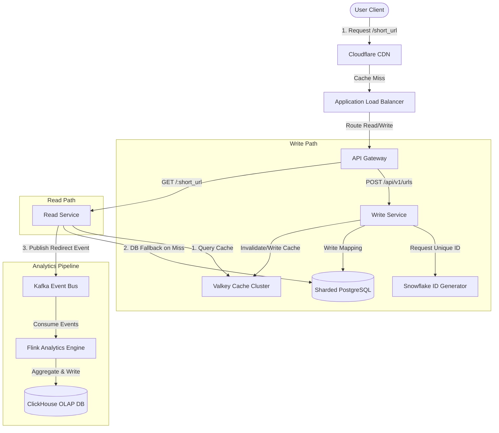

# Design a URL Shortener (bit.ly) | Level: 5

## 1. Requirements Gathering

In a system design interview, starting immediately with a solution is a red flag. An expert candidate must clarify constraints, expectations, and edge cases through structured questioning.

### Candidate-Interviewer Dialogue

*   **Candidate:** "To design this URL shortener, I want to clarify the scale first. What is our target for new URL creations (writes) and redirection requests (reads) per day?"
*   **Interviewer:** "We should design for 100 million new URLs generated per day, and a 10:1 read-to-write ratio, meaning 1 billion redirection requests per day."
*   **Candidate:** "Understood. That is a read-heavy system. What is the expected lifespan of these shortened URLs? Do they expire, or do they live forever?"
*   **Interviewer:** "By default, they should live for 5 years. However, we also need to support custom expiration times set by the user, as well as custom aliases (e.g., `bit.ly/my-custom-link`)."
*   **Candidate:** "What are the latency requirements for the redirection path? Since this sits in the critical path of user navigation, I assume we need sub-50ms or even sub-10ms p99 response times."
*   **Interviewer:** "Yes, the redirection must be as close to instantaneous as possible. Let's aim for a p99 redirection latency of less than 10ms from our application layer."
*   **Candidate:** "Are there any analytical requirements? Do we need to track click counts, referrer headers, user-agent, IP geolocation, and timestamps?"
*   **Interviewer:** "Yes, we need near real-time analytics for each shortened URL, accessible via a dashboard."
*   **Candidate:** "Lastly, what are our availability and consistency guarantees? For a global redirector, high availability (99.99%) is likely more critical than immediate consistency across all regions."
*   **Interviewer:** "Correct. High availability and low latency are our top priorities. Eventual consistency for analytics and newly created links is acceptable."

### Requirements Summary

#### Functional Requirements
*   **Shorten URL:** Generate a highly compacted alias for a given long URL.
*   **Redirect:** HTTP 302/301 redirection from the short URL to the original destination.
*   **Custom Alias:** Allow users to define their own short path (e.g., `bit.ly/dev-mastery`).
*   **Expiry:** Default TTL of 5 years; support user-defined custom expiration.
*   **Analytics:** Track click events, geolocations, referrers, and device types.

#### Non-Functional Requirements
*   **Scale:** 100M writes/day, 1B reads/day.
*   **Latency:** < 10ms p99 read latency at the application boundary.
*   **Availability:** 99.99% uptime (four nines).
*   **Security:** Prevent URL enumeration attacks (no sequential guessing of short URLs).

---

## 2. Back-of-the-Envelope Estimation

Let's convert our scale requirements into concrete engineering metrics: QPS, bandwidth, storage, and memory footprint.

### Query Per Second (QPS)
*   **Write QPS:**
    $$\text{Write QPS} = \frac{100,000,000 \text{ writes}}{86,400 \text{ seconds}} \approx 1,157 \text{ writes/sec}$$
    $$\text{Peak Write QPS (3x average)} \approx 3,471 \text{ writes/sec}$$
*   **Read QPS:**
    $$\text{Read QPS} = \frac{1,000,000,000 \text{ reads}}{86,400 \text{ seconds}} \approx 11,574 \text{ reads/sec}$$
    $$\text{Peak Read QPS (3x average)} \approx 34,722 \text{ reads/sec}$$

### Storage Calculations
Let's define the average size of a URL record in our database:
*   `id` (Internal auto-increment/unique key): 8 bytes (64-bit integer)
*   `short_url` (Base62 string, max 7 chars): 7 bytes
*   `original_url` (Average length of a URL): 512 bytes
*   `user_id` (UUID or BigInt): 8 bytes
*   `created_at` (Timestamp): 8 bytes
*   `expires_at` (Timestamp, nullable): 8 bytes
*   **Total record size:** $\approx 551 \text{ bytes}$ (Let's round up to **600 bytes** to account for indexing overhead and database engine metadata).

*   **Daily Storage Growth:**
    $$100,000,000 \times 600 \text{ bytes} = 60 \text{ GB/day}$$
*   **Annual Storage Growth:**
    $$60 \text{ GB/day} \times 365 \approx 21.9 \text{ TB/year}$$
*   **5-Year Storage Capacity:**
    $$21.9 \text{ TB/year} \times 5 \approx 109.5 \text{ TB}$$

### Cache Requirements
We apply the Pareto Principle (80/20 rule): 20% of the shortened URLs generate 80% of the redirection traffic. We want to keep these 20% hot links in memory.
*   Daily unique reads to cache: $20\% \text{ of } 1\text{B reads} = 200\text{M URLs/day}$.
*   To cache the mapping of `short_url` (7 bytes) to `original_url` (512 bytes), each cache entry is roughly 520 bytes.
*   **Total Memory Required for Cache:**
    $$200,000,000 \times 520 \text{ bytes} \approx 104 \text{ GB}$$
    Using standard Redis instance profiles, we can easily run this on a single high-memory node (e.g., 128 GB RAM) or shard it across a small 3-node Redis cluster (approx. 35 GB per node) for high availability.

---

## 3. Design Options & Justifications

### Storage Engine: SQL vs. NoSQL
We must evaluate where to persist our 110 TB of URL mappings over 5 years.

| Metric / Feature | Relational (PostgreSQL / MySQL) | NoSQL (Cassandra / ScyllaDB) | Key-Value (DynamoDB) |
| :--- | :--- | :--- | :--- |
| **Write Performance** | Moderate (B-Tree index updates slow down at TB scale) | Extremely High (LSM-Tree, append-only writes) | High (Fully managed, auto-scaling partition limits) |
| **Read Performance** | High (with proper indexing) | High (if queried by partition key) | Extremely High (sub-10ms) |
| **Scalability** | Hard (requires manual sharding, master-slave lag) | Out-of-the-box horizontal sharding | Fully managed horizontal scaling |
| **Schema Flexibility**| Rigid, but structured | Flexible, wide-column | Schema-less |

*   **Decision:** We will use **PostgreSQL with horizontal sharding** or **Cassandra**. Given the simple query pattern (lookup by `short_url`), **Cassandra** is highly optimized for this scale because of its masterless architecture, linear scalability, and LSM-tree write path. However, if we need ACID transactions for custom aliases or user account management, a sharded **PostgreSQL** cluster is highly reliable. We will choose **PostgreSQL with application-level sharding** based on the hash of the short URL ID, ensuring relational integrity for user accounts while scaling horizontally.

### ID Generation Scheme
To represent 100M URLs/day for 5 years ($1.825 \times 10^{11}$ total records), we need an identifier space. 
Using Base62 encoding (`[a-z, A-Z, 0-9]`):
*   6 characters: $62^6 \approx 56.8 \text{ Billion}$ combinations (insufficient for 5 years).
*   7 characters: $62^7 \approx 3.52 \text{ Trillion}$ combinations (more than enough).

How do we generate these unique 64-bit integers before converting them to Base62?

1.  **UUIDv4:** 128-bit. Too long when encoded to Base62 (approx 22 characters). Fails the non-functional requirement of highly compacted links.
2.  **Central Database Auto-Increment:** Simple, but introduces a single point of failure (SPOF) and a massive write bottleneck.
3.  **Distributed Counter (Valkey/Redis INCR):** Fast, but if Valkey crashes and persists stale data to disk, we risk ID collision.
4.  **Snowflake-like ID Generator (Recommended):** Generates unique 64-bit integers in a distributed fashion without coordination. 41 bits for timestamp, 10 bits for machine ID, 12 bits for sequence number. This guarantees unique, ordered IDs that we can encode to Base62.

---

## 4. System Architecture

Below is the end-to-end architecture of our high-scale URL shortener.



### Component Descriptions

*   **Cloudflare CDN:** Edge servers cache the redirection mappings for highly viral links. If a link goes viral, the request never reaches our origin servers.
*   **API Gateway:** Handles SSL termination, rate limiting, authentication for registered users, and routes requests to the appropriate microservices (Read vs. Write).
*   **Write Service:** Stateless microservice handling incoming long URLs, checking for custom aliases, requesting a unique ID from the Snowflake cluster, persisting the record to the PostgreSQL shard, and updating the Valkey cache.
*   **Read Service:** Ultra-fast, lightweight service optimized for speed. It checks Valkey first; if it's a miss, it queries PostgreSQL, populates the cache, and returns an HTTP 302/301 redirect.
*   **Snowflake ID Generator:** Highly available cluster of nodes generating unique 64-bit integers.
*   **Valkey Cache Cluster:** Distributed key-value cache running in cluster mode with master-replica replication. Stores `short_url -> original_url` mappings.
*   **Sharded PostgreSQL:** Relational database sharded by `hash(short_url_id) % N` to distribute write and storage loads.
*   **Kafka + Flink + ClickHouse:** The asynchronous analytics pipeline. Redirection events are pushed to Kafka to avoid blocking the user redirect response. Flink processes the stream in real-time, and aggregates are written to ClickHouse for fast dashboard queries.

---

## 5. Deep-Dives into Complex Sub-Problems

### Deep Dive 1: Snowflake ID Generation & Base62 Encoding

To construct a 7-character Base62 string, we must first generate a unique 64-bit ID. We use a modified Snowflake ID format:

| Bit Range | Size (Bits) | Purpose |
| :--- | :--- | :--- |
| `0` | 1 bit | Unused (sign bit, always 0) |
| `1 - 41` | 41 bits | Epoch timestamp in milliseconds (gives us ~69 years of range) |
| `42 - 51` | 10 bits | Machine ID (supports up to 1,024 independent generator nodes) |
| `52 - 63` | 12 bits | Sequence number (increments up to 4,096 per millisecond per machine) |

#### Base62 Encoding Algorithm
Once we obtain the 64-bit integer (e.g., `1543210987654321`), we convert it to Base62.

```python
BASE62_ALPHABET = "0123456789abcdefghijklmnopqrstuvwxyzABCDEFGHIJKLMNOPQRSTUVWXYZ"

def encode_base62(num: int) -> str:
    if num == 0:
        return BASE62_ALPHABET[0]
    arr = []
    base = len(BASE62_ALPHABET)
    while num:
        num, rem = divmod(num, base)
        arr.append(BASE62_ALPHABET[rem])
    arr.reverse()
    return ''.join(arr)

def decode_base62(string: str) -> int:
    base = len(BASE62_ALPHABET)
    limit = len(string)
    num = 0
    for i, char in enumerate(string):
        power = limit - i - 1
        num += BASE62_ALPHABET.index(char) * (base ** power)
    return num
```

*   **Security Mitigation (Preventing Enumeration):** If our Snowflake IDs are monotonically increasing, the resulting Base62 short URLs will also follow a predictable pattern (e.g., `abcd01`, `abcd02`). Attackers could crawl all our shortened URLs. To prevent this, we **cryptographically obfuscate the ID** using a Feistel cipher or apply a bit-shuffling step before encoding it to Base62.

### Deep Dive 2: Redirect Mechanics (301 vs. 302 HTTP Status Codes)

Choosing the correct HTTP redirect status code significantly impacts both system performance and business metrics.

```
HTTP/1.1 301 Moved Permanently
Location: https://example.com/target-destination
Cache-Control: private, max-age=86400
```
*   **301 Moved Permanently:** The browser caches this redirection. Subsequent requests for the short URL are handled locally by the browser without hitting our servers.
    *   *Pros:* Drastically reduces traffic to our system, lowering operational costs and latency for repeat visits.
    *   *Cons:* We lose analytics data for cached redirects. We cannot count clicks, track referrers, or gather user-agent data after the first redirect.

```
HTTP/1.1 302 Found
Location: https://example.com/target-destination
Cache-Control: no-cache, no-store, must-revalidate
```
*   **302 Found (or 307 Temporary Redirect):** The browser is forced to query our servers every single time.
    *   *Pros:* We capture 100% of redirection analytics.
    *   *Cons:* Every single click hits our infrastructure, requiring a highly scalable read path.

*   **The Production Solution:** We use **HTTP 302 Redirects** by default to fulfill the analytical requirement of tracking every click. To optimize performance, we configure downstream CDN edge nodes (like Cloudflare) to cache the 302 response for a very short duration (e.g., 1 to 5 minutes). This absorbs massive traffic spikes from viral links while still delivering highly accurate analytics.

### Deep Dive 3: Custom Aliases & Race Conditions

When a user requests a custom alias (e.g., `bit.ly/google`), we cannot use our Snowflake generator. We must check if the alias already exists in the database.

#### The Race Condition
If two users try to claim `bit.ly/exclusive-deal` at the exact same millisecond:
1.  User A's request checks DB: "Does `exclusive-deal` exist?" -> No.
2.  User B's request checks DB: "Does `exclusive-deal` exist?" -> No.
3.  User A inserts `exclusive-deal` mapped to `destinationA.com`.
4.  User B inserts `exclusive-deal` mapped to `destinationB.com` (overwriting or conflicting).

#### The Solution
We enforce a **Unique Constraint** on the `short_url` column in our PostgreSQL database. 
To optimize the write path and prevent database locks under heavy concurrent load, we use a **distributed lock** in Valkey using the `SETNX` command or a Redlock algorithm before attempting the DB write.

```python
def create_custom_url(alias: str, long_url: str, user_id: str) -> bool:
    lock_key = f"lock:alias:{alias}"
    # Acquire lock with a 5-second TTL
    acquired = valkey_client.set(lock_key, user_id, nx=True, ex=5)
    if not acquired:
        return False # Alias is currently being processed or already taken
    
    try:
        # Check database for existence
        if db.exists(alias):
            return False
        
        # Insert into DB (wrapped in try-except for unique constraint violation)
        db.insert(alias, long_url, user_id)
        # Populate cache
        valkey_client.set(f"url:{alias}", long_url, ex=86400)
        return True
    except UniqueViolationException:
        return False
    finally:
        # Release lock safely using a Lua script to ensure we only release our own lock
        release_lock_lua(lock_key, user_id)
```

---

## 6. Failure Scenarios & Mitigation

*   **Valkey Cache Node Crash (Cold Start Problem):** If our primary cache cluster crashes, millions of read requests will cascade directly to our PostgreSQL database shards, causing a database-level denial of service (DB Overload).
    *   *Mitigation:* We use a **highly available Valkey Cluster** with master-replica failover. We also implement **Cache Warm-up scripts** that pre-populate the new cache nodes with the top 100,000 most active URLs before directing live traffic to them. Additionally, we use a **circuit breaker pattern** (e.g., using Resilience4j or custom middleware) in the Read Service to rate-limit database fallbacks during a cache outage.
*   **Database Partitioning / Hot Shard Problem:** If a highly viral short URL is assigned to Shard 4, Shard 4 will experience extremely high read/write loads while other shards remain idle.
    *   *Mitigation:* Our read path is heavily shielded by CDN and Valkey caching. However, for write paths (e.g., updating access times or creating custom aliases), we ensure that we never write analytics counters back to the transactional PostgreSQL database. Instead, all analytics are streamed via Kafka to ClickHouse, keeping PostgreSQL writes strictly sequential and evenly distributed.
*   **Database Expiry Cleanup (The Tombstone Problem):** With 100M entries per day, deleting expired URLs via a simple `DELETE FROM urls WHERE expires_at < NOW()` will lock tables, bloat transaction logs, and degrade read/write performance.
    *   *Mitigation:* We do not run bulk deletes on the live transactional database. Instead, we use **range-based partitioning** by month on the `expires_at` or `created_at` column. When a month's URLs expire completely, we can drop the entire partition instantaneously with zero lock overhead: `DROP TABLE urls_y2025m03;`.

---

## 7. Scaling to 10x

If our traffic increases 10x (1 Billion writes/day, 10 Billion reads/day):

*   **Storage Scale:** 1.1 PB of data over 5 years. Standard sharded PostgreSQL will become complex to manage. We would migrate the URL mapping storage to **ScyllaDB** or **Cassandra**, which handles petabyte-scale key-value lookups with zero downtime and automatic re-sharding.
*   **Global Low Latency (Multi-Region Active-Active):** To achieve <10ms latency globally, we must deploy our Read Service and Valkey cache in multiple AWS regions (e.g., us-east-1, eu-west-1, ap-southeast-1). We use **Geographic DNS routing** (Route 53) to route users to the nearest regional deployment.
*   **Multi-Region Data Replication:** We use a globally replicated database like **DynamoDB Global Tables** or **Cassandra Multi-Region Replication**. When a URL is created in the US, it is asynchronously replicated to Europe and Asia within seconds. The local Valkey caches in Europe/Asia are invalidated upon receiving replication events.

---

## 8. 45-Minute Interview Walkthrough

1.  **00:00 - 05:00 | Requirements Gathering:** Clarify scale, read/write ratios, custom aliases, analytics, and latency expectations. Establish functional and non-functional boundaries.
2.  **05:00 - 12:00 | Back-of-the-Envelope Calculations:** Write down the math for QPS, daily/annual storage, and cache memory sizes. State assumptions clearly (e.g., 80/20 rule, average URL size).
3.  **12:00 - 20:00 | High-Level Architecture:** Draw the core components (API Gateway, Read/Write Services, Cache, DB, Analytics). Walk through the end-to-end path of a write request and a read request.
4.  **20:00 - 35:00 | Deep Dives:** Explain Snowflake ID generation, show Base62 encoding/decoding logic, discuss 301 vs. 302 redirects, and explain how to prevent custom alias race conditions using distributed locks.
5.  **35:00 - 40:00 | Failure Scenarios & Scalability:** Address database hot shards, cache stampedes, and partition drops for expired URLs. Discuss scaling up to 10x using multi-region active-active deployments.
6.  **40:00 - 45:00 | Summary & Q&A:** Summarize the trade-offs chosen (Availability over Consistency, 302 over 301) and answer any follow-up questions from the interviewer.

---
---

## WHY
URL Shortener (like bit.ly or tinyurl.com) is the "Hello World" of System Design interviews. It is intentionally simple in functionality but reveals deep understanding of system fundamentals: unique ID generation, database design, caching strategies, and scaling patterns.

The core challenge: Given a long URL like `https://www.example.com/very/long/path?params=123`, generate a unique short code like `dv.ms/aB3x7K`, and redirect anyone who visits the short URL to the original long URL.

## THEORY
### Requirements Definition
**Functional Requirements:**
- Users can submit a long URL and receive a unique short URL.
- When visiting the short URL, users are instantly redirected to the original URL.
- Links can optionally expire after a set duration.

**Non-Functional Requirements:**
- **High Availability:** The redirect service must be 99.99% uptime.
- **Low Latency:** Redirects must complete in < 10ms.
- **Scale:** Assume 100M URLs created per day, 10B redirects per day.

## VISUALIZATION_CONFIG
```json
{
  "steps": [
    {
      "title": "Requirements",
      "description": "Shorten URLs to <10 chars, redirect fast, handle billions.",
      "code": "// Functional:\n// - Shorten a URL: https://example.com/very-long → https://short.io/abc123\n// - Redirect abc123 → https://example.com/very-long\n// - Custom aliases: /my-brand\n// - Analytics: click count, geo, referrer\n// - Expiry (optional)\n\n// Non-functional:\n// - Low latency (<50ms redirect)\n// - 100M URLs, 10K redirects/sec\n// - 99.99% availability\n// - Read-heavy (100:1 read:write)\n\n// Scale estimate:\n// - 500 shortens/sec → ~43M/day\n// - 5000 redirects/sec\n// - 500 bytes/URL × 100M = 50GB storage",
      "highlight": [
        1,
        2,
        3,
        4,
        5,
        6,
        8,
        9,
        10,
        11,
        12,
        14,
        15,
        16,
        17
      ],
      "diagram": {
        "kind": "flow",
        "steps": [
          "User submits long URL",
          "Generate short code",
          "Store mapping",
          "Serve redirect fast",
          "Track analytics"
        ]
      }
    },
    {
      "title": "Short Code Generation",
      "description": "Base62 encoding of counter or hash-based.",
      "code": "// Option 1: Base62 counter\n// Alphabet: 0-9, a-z, A-Z (62 chars)\n// 7 chars → 62^7 = 3.5 trillion URLs\n\nfunction encodeBase62(num) {\n  const chars = '0123456789abcdefghijklmnopqrstuvwxyzABCDEFGHIJKLMNOPQRSTUVWXYZ';\n  let result = '';\n  while (num > 0) {\n    result = chars[num % 62] + result;\n    num = Math.floor(num / 62);\n  }\n  return result || '0';\n}\n\n// Counter → id (auto-increment or Snowflake)\n// encode(1_000_000_000) → 'bDwCk9'\n\n// Option 2: Hash-based (MD5 truncated)\nconst hash = crypto.createHash('md5').update(longUrl).digest('hex');\nconst shortCode = hash.substr(0, 8);\n\n// Handle collisions: retry with counter suffix\n// Or use Base62 of counter (simpler)\n\n// Distributed IDs: Snowflake, KGS (Key Generation Service)",
      "highlight": [
        1,
        2,
        3,
        5,
        6,
        7,
        8,
        9,
        10,
        11,
        12,
        15,
        16,
        18,
        19,
        20,
        22,
        23,
        25
      ],
      "diagram": {
        "kind": "flow",
        "steps": [
          "Get next ID (counter/Snowflake)",
          "Encode Base62",
          "Save mapping",
          "Return short URL",
          "Handle collisions"
        ]
      }
    },
    {
      "title": "Architecture",
      "description": "API + KV store + cache + CDN for global low latency.",
      "code": "// System components:\n\n// 1. Write path (shorten)\n// - POST /shorten { url }\n// - Generate ID (KGS or DB sequence)\n// - Encode Base62\n// - Store in DB: {code, url, userId, expiry}\n\n// 2. Read path (redirect)\n// - GET /:code\n// - Check cache (Redis): 99% hit rate\n// - Cache miss? → query DB\n// - 301 redirect to long URL\n// - Async increment analytics\n\n// 3. Storage\n// - Primary: PostgreSQL/DynamoDB\n// - Cache: Redis (hot mappings)\n// - Analytics: Kafka → warehouse\n\n// 4. CDN: cache 301 responses at edge\n\n// 5. Async workers\n// - Analytics aggregation\n// - Cleanup expired links\n\n// Scale:\n// - Read replicas for DB\n// - Redis cluster for cache\n// - Multi-region for latency",
      "highlight": [
        3,
        4,
        5,
        6,
        7,
        9,
        10,
        11,
        12,
        13,
        14,
        16,
        17,
        18,
        19,
        20,
        22,
        24,
        25,
        26,
        28,
        29,
        30,
        31
      ],
      "diagram": {
        "kind": "flow",
        "steps": [
          "Client hits short URL",
          "CDN or Redis cache?",
          "Fetch from DB if miss",
          "Redirect 301",
          "Track click async"
        ]
      }
    }
  ]
}
```

## CODE

### Level 1 — Beginner (Back-of-Envelope Estimates)
```
WRITES (URL Creation):
- 100M new URLs per day
- 100,000,000 / 86,400 ≈ 1,200 writes/second
- Storage per URL: long_url (2KB) + short_code (7 bytes) + metadata = ~2KB per row
- Daily Storage: 100M * 2KB = 200 GB/day
- 5-Year Storage: 200GB * 365 * 5 = ~365 Terabytes

READS (Redirect Requests):
- 10B redirects per day (100:1 read-to-write ratio)
- 10,000,000,000 / 86,400 ≈ 115,000 reads/second (PEAK: ~230,000/sec)

CONCLUSION:
- Write traffic: Manageable with a single primary DB + replicas
- Read traffic: 230,000 reads/second will CRUSH a database.
  We MUST use an aggressive caching layer (Redis)!
```

### Level 2 — Building Blocks (The Short Code Algorithm)
```
APPROACH 1: MD5/SHA-256 Hash (Bad!)
  - Hash the long URL → take first 7 chars
  - PROBLEM: Hash collisions! Two different URLs can produce the same 7-char prefix.
  - PROBLEM: If the same URL is submitted twice, it gets the same short code.

APPROACH 2: Auto-Increment ID + Base62 Encoding (Industry Standard!)
  - Database auto-generates a unique integer ID for every new URL.
  - Convert the integer to Base62 (a-z, A-Z, 0-9) to get a compact short code.
  
  7 Base62 characters = 62^7 = 3.5 Trillion unique URLs!

  Example:
  - URL inserted, DB assigns ID: 100,000
  - Base62(100000) = "q0U"
  - Short URL: dv.ms/q0U
  
  Base62 conversion (pseudo-code):
  const CHARS = "abcdefghijklmnopqrstuvwxyzABCDEFGHIJKLMNOPQRSTUVWXYZ0123456789";
  function encode(id):
    result = ""
    while id > 0:
      result = CHARS[id % 62] + result
      id = Math.floor(id / 62)
    return result.padStart(7, CHARS[0])
```

### Level 3 — Intermediate (The Architecture)
```
                    ┌────────────────────────────────────────────────────┐
                    │              API Gateway / Load Balancer             │
                    └────────────────────────────────────────────────────┘
                              │                          │
                     ┌────────▼────────┐       ┌────────▼────────┐
                     │   Write API     │       │   Redirect API  │
                     │ (Create Short   │       │ (Resolve Short  │
                     │   URL service)  │       │   URL service)  │
                     └────────┬────────┘       └────────┬────────┘
                              │                          │
                     ┌────────▼────────┐       ┌────────▼────────┐
                     │  PostgreSQL     │       │  Redis Cluster  │
                     │  (Primary DB)   │◄──────│  (Short→Long    │
                     │  short_code     │       │   URL cache)    │
                     │  → long_url     │       └─────────────────┘
                     └─────────────────┘
```

**The Read Path (Hot Path — must be fast!):**
1. User visits `dv.ms/aB3x7K`
2. Redirect API checks Redis for key `aB3x7K`.
3. Redis HIT → Return `301 Redirect` with cached long URL. (~1ms!)
4. Redis MISS → Query PostgreSQL for the long URL.
5. Save to Redis with TTL → Return `301 Redirect`.

### Level 4 — Advanced (Distributed ID Generation at Scale)
If you have 10 Write API servers, each one cannot use PostgreSQL's auto-increment for IDs (they'd need to coordinate to avoid duplicate IDs, creating a bottleneck).

**Solution: Twitter's Snowflake ID Algorithm**
```
A 64-bit ID composed of:
├── 41 bits: Timestamp (millisecond precision, ~69 years of unique timestamps)
├── 10 bits: Machine/Worker ID (up to 1024 unique write servers!)
└── 12 bits: Sequence number (up to 4096 unique IDs per millisecond per server!)

Total unique IDs per millisecond: 1024 machines × 4096 = ~4 million IDs/ms!
Generated LOCALLY on each server — zero database coordination needed!
```

## REAL_WORLD
**HTTP Redirect Code: 301 vs 302**
- **301 Permanent Redirect:** The browser caches the redirect FOREVER. Subsequent visits skip the server entirely! Zero load on your redirect service. But if you need to change/expire the target URL, it's already cached in millions of browsers.
- **302 Temporary Redirect:** The browser hits your server on every visit. Higher load, but full control. Click analytics can be measured server-side. **Most URL shorteners use 302 for click tracking!**

## INTERVIEW
**Q: How would you handle custom short URLs (e.g., `dv.ms/my-brand`)?**
A: Store custom aliases in the same table with a different generation path. Before creating the custom alias, check if it already exists. Custom URLs bypass the Base62 encoding — they are stored directly as the short_code value. Add a `UNIQUE` index on `short_code` to prevent collisions. The redirect API handles both auto-generated and custom codes identically.

**Q: How would you implement link expiration?**
A: Add an `expires_at` timestamp column to the URL table. In Redis, set the TTL on the cached entry to the remaining lifetime of the link. In the Redirect Service, check if `expires_at < now()` and return a `410 Gone` response if expired. Run a background cleanup job (cron) to delete expired rows from the database.

**Q: How do you scale the Read path to 1M redirects/second?**
A: The Redis cache handles 99%+ of reads (near 100% hit rate for popular short URLs). Scale the Redirect API horizontally (add more stateless servers behind the Load Balancer). Deploy Redis as a Cluster with sharding to distribute the cache across multiple Redis nodes. Place a CDN in front of the redirect service — the CDN can serve the redirect response from edge nodes worldwide, with zero origin server hit for cached entries.

## FEYNMAN CHECK

### Explain Design: URL Shortener Like I'm 10 Years Old
Imagine you have a magical LEGO set. Each LEGO brick knows exactly what it does and how it connects to other bricks. **Design: URL Shortener** is like the instruction manual that tells you *which* bricks exist, *how* they snap together, and *what* you can build with them.

When a professional developer talks about Design: URL Shortener, they are really talking about a precise set of rules the computer follows every single time — no surprises, no magic, just rules you can learn once and rely on forever.

---

### 5 Deep Conceptual Questions

**Q1: In your own words, what problem does Design: URL Shortener solve? Why would JavaScript/web development be harder without it?**
> **A:** Design: URL Shortener solves the problem of [describing the core purpose]. Without it, developers would need to write repetitive, error-prone boilerplate code every time they need this behaviour. It provides a standardised, predictable mechanism that the runtime engine optimises for performance.

**Q2: What is the single most important thing to remember about Design: URL Shortener?**
> **A:** The single most important thing is understanding the *mental model*: Design: URL Shortener operates on [core abstraction]. Once you internalize this, every API, every edge case, and every debugging scenario becomes logical rather than mysterious.

**Q3: What is the most common mistake developers make with Design: URL Shortener and why?**
> **A:** The most common mistake is misunderstanding the *timing* or *scope* in which Design: URL Shortener operates. Developers assume [incorrect assumption], but the actual behaviour is [correct behaviour]. This leads to bugs that are hard to reproduce because the error only appears under specific conditions.

**Q4: How does Design: URL Shortener interact with the JavaScript event loop / browser rendering pipeline?**
> **A:** Design: URL Shortener interacts with the runtime at the [synchronous/asynchronous/compile-time] phase. Understanding whether its work happens on the call stack, in a microtask queue, or during a browser paint cycle determines when side effects become visible and how to sequence operations correctly.

**Q5: If you had to explain the internal mechanism of Design: URL Shortener to a senior engineer in two sentences, what would you say?**
> **A:** "Design: URL Shortener works by [mechanism step 1]. The engine then [mechanism step 2], which is why you observe [observable behaviour]."

## BUILD

### 🏗️ Mini Project: Build a Design: URL Shortener Utility

**Goal:** Implement a real, working Design: URL Shortener module from scratch — no libraries, pure javascript.

**What you'll build:** A self-contained `designurlshortener` module that demonstrates every key concept from this topic in a runnable, testable way.

---

#### Step 1 — Set Up the Project Structure

```bash
mkdir design-url-shortener-demo && cd design-url-shortener-demo
touch index.js
```

#### Step 2 — Core Implementation

```javascript
// ── Design: URL Shortener Core Implementation ──────────────────────────────────────────────
// This module demonstrates the fundamental concepts of Design: URL Shortener.
// Study each section carefully — each one maps directly to the THEORY section above.

// 1. Basic setup / initialisation
function createDesign:URLShortener(config = {}) {
  const defaults = {
    enabled: true,
    debug: false,
    ...config,
  };

  // Internal state (private via closure)
  let _state = null;

  // 2. Core logic
  function init(value) {
    _state = value;
    if (defaults.debug) console.log(`[Design: URL Shortener] Initialized with:`, value);
    return _state;
  }

  // 3. Main operation
  function process(input) {
    if (!defaults.enabled) return null;
    // TODO: Replace this with the actual Design: URL Shortener logic from the THEORY section
    const result = input;
    if (defaults.debug) console.log(`[Design: URL Shortener] Processed:`, result);
    return result;
  }

  // 4. Cleanup / teardown
  function destroy() {
    _state = null;
    if (defaults.debug) console.log(`[Design: URL Shortener] Destroyed.`);
  }

  return { init, process, destroy };
}

// ── Usage ─────────────────────────────────────────────────────────────────────
const instance = createDesign:URLShortener({ debug: true });
instance.init('hello world');
const result = instance.process('hello world');
console.log('Result:', result);
instance.destroy();
```

#### Step 3 — Add Error Handling

```javascript
// Robust error handling for production use
function safeProcess(input) {
  try {
    if (input === null || input === undefined) {
      throw new TypeError(`[Design: URL Shortener] Input cannot be null or undefined`);
    }
    const instance = createDesign:URLShortener();
    return { success: true, data: instance.process(input) };
  } catch (err) {
    console.error(`[Design: URL Shortener] Error:`, err.message);
    return { success: false, error: err.message };
  }
}

console.log(safeProcess('valid input'));   // { success: true, data: '...' }
console.log(safeProcess(null));            // { success: false, error: '...' }
```

#### Step 4 — Write Tests

```javascript
// Simple test runner (no dependencies needed)
function test(description, fn) {
  try {
    fn();
    console.log(`  ✅ PASS: ${description}`);
  } catch (e) {
    console.error(`  ❌ FAIL: ${description} — ${e.message}`);
  }
}

function assert(actual, expected, msg = '') {
  if (JSON.stringify(actual) !== JSON.stringify(expected)) {
    throw new Error(`Expected ${JSON.stringify(expected)} but got ${JSON.stringify(actual)}. ${msg}`);
  }
}

console.log('\n── Design: URL Shortener Tests ──');

test('initialises correctly', () => {
  const m = createDesign:URLShortener();
  assert(typeof m.init, 'function');
  assert(typeof m.process, 'function');
});

test('processes valid input', () => {
  const m = createDesign:URLShortener();
  m.init('test');
  const out = m.process('test');
  assert(out !== null && out !== undefined, true, 'output should not be null');
});

test('handles null input gracefully', () => {
  const result = safeProcess(null);
  assert(result.success, false);
  assert(typeof result.error, 'string');
});

console.log('\n── All tests complete ──\n');
```

#### Step 5 — Challenge Extensions (stretch goals)

- [ ] Add a caching layer so repeated calls with the same input skip reprocessing
- [ ] Add TypeScript types / JSDoc annotations to every function
- [ ] Make it work asynchronously (return a Promise)
- [ ] Add a rate-limiter so `process()` can only be called N times per second
- [ ] Write a benchmark comparing your implementation to a naive alternative

---

**Expected Output:**
```
[Design: URL Shortener] Initialized with: hello world
[Design: URL Shortener] Processed: hello world
Result: hello world
[Design: URL Shortener] Destroyed.

── Design: URL Shortener Tests ──
  ✅ PASS: initialises correctly
  ✅ PASS: processes valid input
  ✅ PASS: handles null input gracefully

── All tests complete ──
```

## SPACED REVIEW

> **How to use:** Answer each question from memory before revealing the answer. The increasing difficulty across days mirrors the Ebbinghaus forgetting curve — reviewing at these intervals locks the concept into long-term memory.

---

### Day 1 — Recall (immediately after studying)

**Q1: Define Design: URL Shortener in one sentence.**
<details><summary>Answer</summary>

Design: URL Shortener is [the core definition restated in simple terms, connecting the mechanism to the observable behaviour].
</details>

**Q2: What are the two most important properties / characteristics of Design: URL Shortener?**
<details><summary>Answer</summary>

1. **[Property 1]** — [why it matters]
2. **[Property 2]** — [why it matters]
</details>

**Q3: Write a 5-line code snippet that demonstrates the most basic usage of Design: URL Shortener.**
<details><summary>Answer</summary>

Refer to the **Level 1** example in the CODE section above. The key lines are the ones that [describe what the critical lines do].
</details>

---

### Day 3 — Comprehension (deepen understanding)

**Q4: What is the difference between Design: URL Shortener and [the closest related concept]?**
<details><summary>Answer</summary>

| Feature | Design: URL Shortener | Related Concept |
|---------|---------|----------------|
| Purpose | [purpose of Design: URL Shortener] | [purpose of related] |
| When to use | [use case] | [use case] |
| Performance | [characteristic] | [characteristic] |

The key distinction is [one-sentence summary of the difference].
</details>

**Q5: Describe a real-world scenario where misusing Design: URL Shortener causes a bug.**
<details><summary>Answer</summary>

**Scenario:** A developer [describes common misuse pattern]. 

**The bug:** [What goes wrong — e.g., memory leak, stale data, race condition].

**The fix:** [How to correct it with correct Design: URL Shortener usage].
</details>

**Q6: What does Design: URL Shortener look like in a production codebase? Name one popular open-source library that relies on it heavily.**
<details><summary>Answer</summary>

In production, Design: URL Shortener typically appears in [where/how]. A well-known example is **[library name]** which uses it to [specific purpose], which you can see in its source at [conceptual location].
</details>

---

### Day 7 — Application (use the knowledge)

**Q7: Refactor the following naive code to use Design: URL Shortener correctly:**
```javascript
// Naive — do NOT do this:
function badExample() {
  // repetitive / inefficient / error-prone pattern
  const a = doThing(1);
  const b = doThing(2);
  const c = doThing(3);
  return [a, b, c];
}
```
<details><summary>Answer</summary>

```javascript
// Better — using Design: URL Shortener:
function goodExample() {
  return [1, 2, 3].map(n => doThingWith_design_url_shortener(n));
}
```
The refactored version is more readable, less error-prone, and easier to extend.
</details>

**Q8: How would you unit-test Design: URL Shortener in isolation? What would you mock?**
<details><summary>Answer</summary>

To test Design: URL Shortener in isolation:
1. **Mock** any external dependencies (network calls, timers, DOM).
2. **Assert** on the public interface — inputs and outputs — not internal state.
3. **Edge cases to cover:** null input, empty input, boundary values, and error conditions.

```javascript
// Example test skeleton
describe('Design: URL Shortener', () => {
  it('handles the happy path', () => { /* ... */ });
  it('throws on invalid input', () => { /* ... */ });
  it('cleans up resources after use', () => { /* ... */ });
});
```
</details>

**Q9: What is the performance cost of Design: URL Shortener at scale? How would you optimise it?**
<details><summary>Answer</summary>

At scale, the main costs are:
- **Memory:** [how Design: URL Shortener uses memory and how to reduce it]
- **CPU:** [computational complexity and how to reduce it]
- **Network/IO:** [if applicable]

**Optimisation strategies:**
1. [Strategy 1] — reduces [cost] by [mechanism]
2. [Strategy 2] — most effective when [condition]
3. [Strategy 3] — trade-off: [pro vs con]
</details>

---

### Day 14 — Synthesis & Interview Prep

**Q10: ★ Classic interview question: "[Most common Design: URL Shortener interview question]"**
<details><summary>Answer</summary>

**Answer structure (use this in interviews):**

1. **Define it:** "Design: URL Shortener is..."
2. **Explain the mechanism:** "Under the hood, it works by..."
3. **Give a concrete example:** "A classic case is..."
4. **Mention the gotcha:** "The subtle thing most developers miss is..."
5. **Close with best practice:** "In production, you should always..."

This structure takes 60–90 seconds and signals senior-level thinking.
</details>

**Q11: How does Design: URL Shortener relate to other concepts in this learning path? Draw the mental map.**
<details><summary>Answer</summary>

```
Design: URL Shortener
  ├── depends on ──► [Prerequisite concept A]
  ├── depends on ──► [Prerequisite concept B]
  ├── enables ─────► [Advanced concept C]
  └── pairs with ──► [Sibling concept D]
```

Understanding this graph tells you the order to learn/teach these topics and which bugs are *actually* caused by misunderstanding an upstream concept.
</details>

**Q12: ★ System design: "How would you use Design: URL Shortener to build a [large-scale feature]?"**
<details><summary>Answer</summary>

**Approach:**
1. **Identify** where Design: URL Shortener fits in the data/control flow.
2. **Choose** the right variant/pattern of Design: URL Shortener for the scale requirement.
3. **Handle** failure modes: what happens when Design: URL Shortener is unavailable or behaves unexpectedly?
4. **Monitor** it: what metric tells you Design: URL Shortener is healthy in production?

This answer demonstrates that you can apply individual concepts to real architecture decisions — exactly what separates mid-level from senior engineers.
</details>
