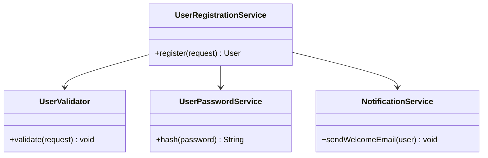
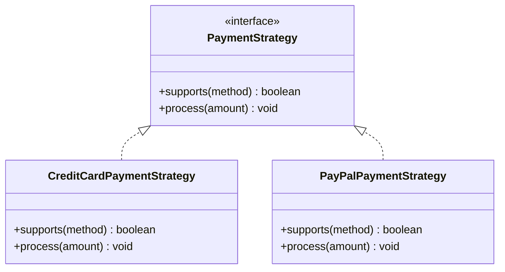
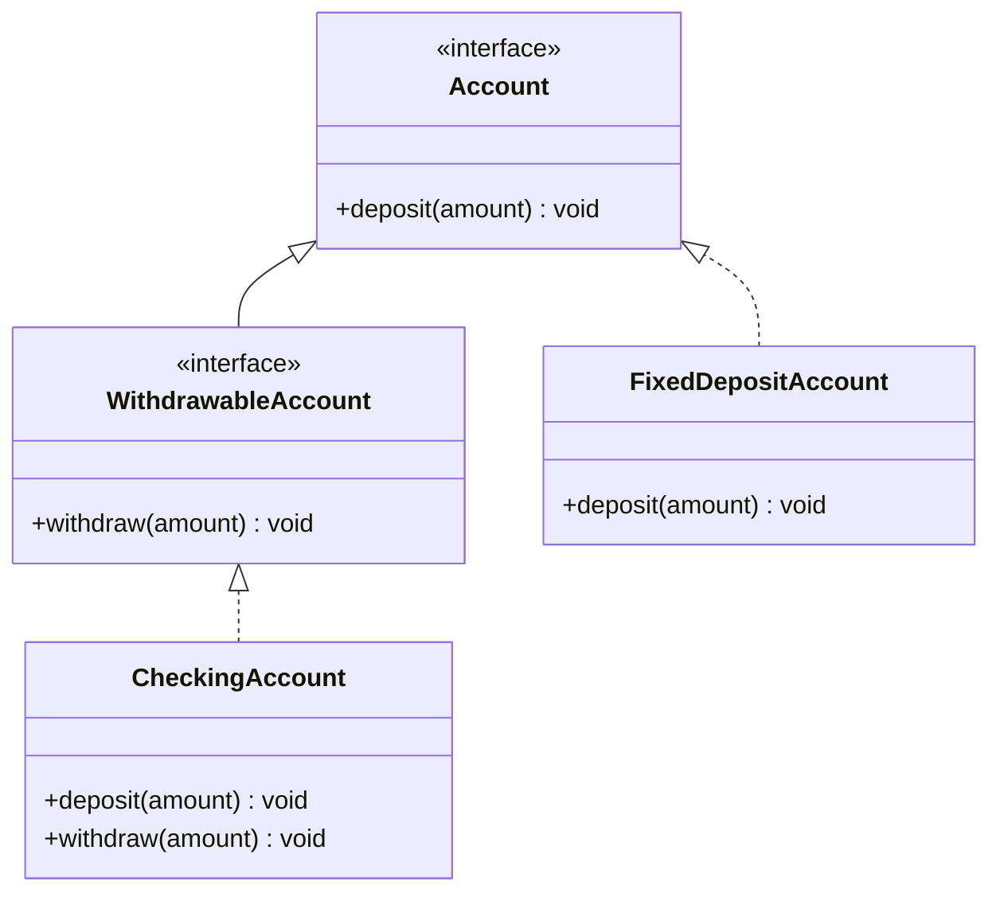
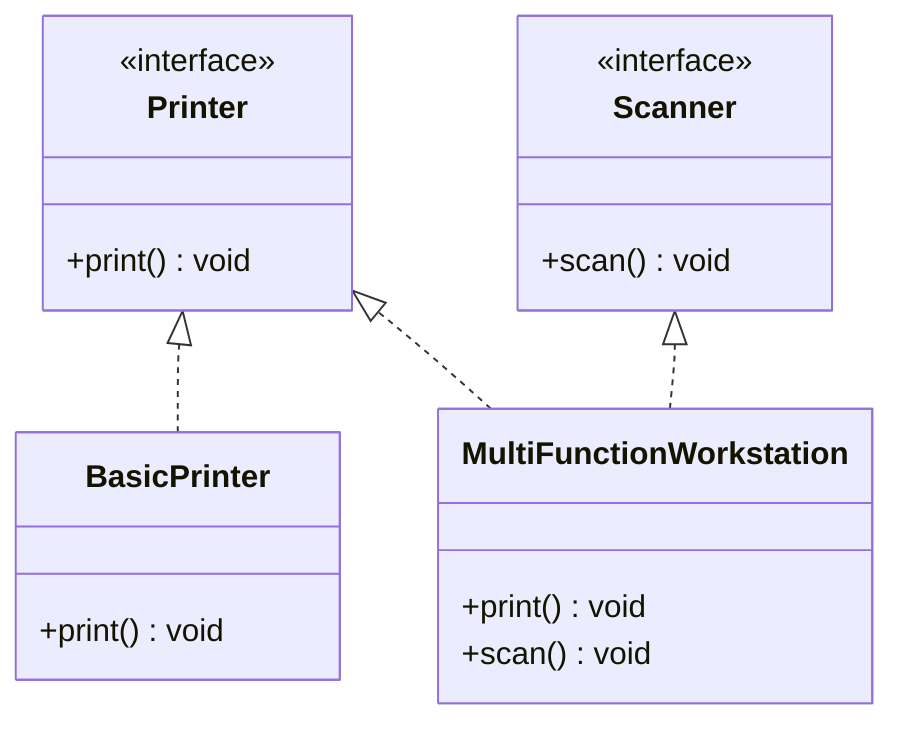
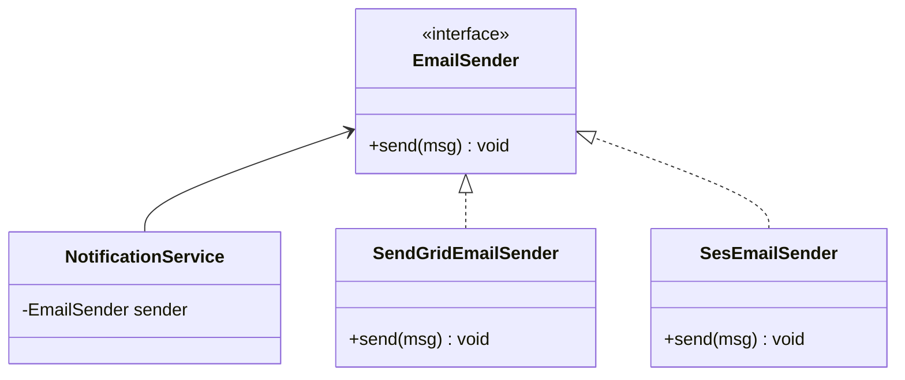
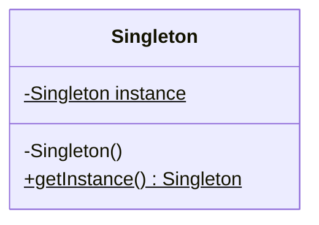
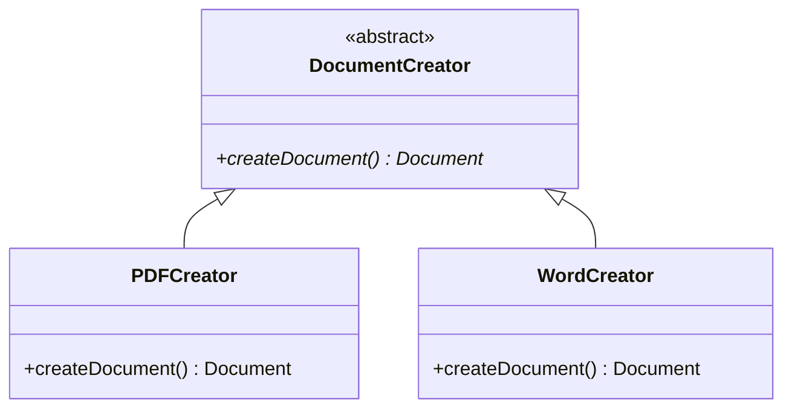

# SOLID Principles — Deep Dive with Java Examples

The SOLID principles are the foundational guidelines for writing maintainable, extensible, and robust object-oriented software. When misapplied or ignored, systems degenerate into rigid, fragile, and non-reusable structures. This section explores each principle in depth, analyzing the structural decay of violations and demonstrating clean, production-grade refactorings using Java 21 and Spring Boot 3.2.

---

## 1. Single Responsibility Principle (SRP)

> "A class should have one, and only one, reason to change." — Robert C. Martin

### The Anti-Pattern: The God Class
In many legacy or rapidly developed Spring applications, services morph into "God Classes" that mix business logic, persistence interactions, validation, and external communications.

```java
// VIOLATION: The God Class
@Service
public class UserService {
    private final UserRepository userRepository;
    private final BCryptPasswordEncoder passwordEncoder;
    private final JavaMailSender mailSender;

    public UserService(UserRepository userRepository, BCryptPasswordEncoder passwordEncoder, JavaMailSender mailSender) {
        this.userRepository = userRepository;
        this.passwordEncoder = passwordEncoder;
        this.mailSender = mailSender;
    }

    @Transactional
    public User registerUser(UserRegistrationRequest request) {
        // 1. Validation Logic
        if (request.username() == null || request.username().isBlank()) {
            throw new IllegalArgumentException("Username cannot be empty");
        }
        if (userRepository.existsByUsername(request.username())) {
            throw new IllegalStateException("Username already taken");
        }

        // 2. Business Logic & Security
        String encryptedPassword = passwordEncoder.encode(request.password());
        User user = new User(request.username(), encryptedPassword, request.email());
        User savedUser = userRepository.save(user);

        // 3. Notification Logic
        SimpleMailMessage message = new SimpleMailMessage();
        message.setTo(savedUser.getEmail());
        message.setSubject("Welcome!");
        message.setText("Thank you for registering.");
        mailSender.send(message);

        return savedUser;
    }
}
```

### Consequences of the Anti-Pattern
1. **High Coupling**: Changes to the email system or validation rules force modifications to `UserService`.
2. **Fragility**: Modifying the notification code can inadvertently break the user registration transaction.
3. **Low Testability**: Unit testing `registerUser` requires mocking database access, security encoders, and mail infrastructure simultaneously.

### The Solution: Extraction of Responsibilities
We segregate the responsibilities into dedicated, cohesive components:
* `UserValidator`: Handles boundary validation.
* `UserRegistrationService`: Coordinates the domain orchestration.
* `UserPasswordService`: Encapsulates security hashing.
* `NotificationService`: Manages external communication.



### Clean Implementation (Java 21 + Spring Boot 3.2)

```java
package com.devmastery.solid.srp;

import org.springframework.stereotype.Component;
import org.springframework.stereotype.Service;
import org.springframework.transaction.annotation.Transactional;

public record UserRegistrationRequest(String username, String password, String email) {}

@Component
public class UserValidator {
    private final UserRepository userRepository;

    public UserValidator(UserRepository userRepository) {
        this.userRepository = userRepository;
    }

    public void validate(UserRegistrationRequest request) {
        if (request.username() == null || request.username().isBlank()) {
            throw new IllegalArgumentException("Username cannot be empty");
        }
        if (userRepository.existsByUsername(request.username())) {
            throw new IllegalStateException("Username already taken");
        }
    }
}

@Component
public class UserPasswordService {
    private final BCryptPasswordEncoder passwordEncoder;

    public UserPasswordService(BCryptPasswordEncoder passwordEncoder) {
        this.passwordEncoder = passwordEncoder;
    }

    public String hashPassword(String rawPassword) {
        return passwordEncoder.encode(rawPassword);
    }
}

@Service
public class NotificationService {
    private final JavaMailSender mailSender;

    public NotificationService(JavaMailSender mailSender) {
        this.mailSender = mailSender;
    }

    @Async // Decouple from primary transaction execution thread
    public void sendWelcomeEmail(String email) {
        SimpleMailMessage message = new SimpleMailMessage();
        message.setTo(email);
        message.setSubject("Welcome!");
        message.setText("Thank you for registering.");
        mailSender.send(message);
    }
}

@Service
@Transactional
public class UserRegistrationService {
    private final UserRepository userRepository;
    private final UserValidator validator;
    private final UserPasswordService passwordService;
    private final NotificationService notificationService;

    public UserRegistrationService(
            UserRepository userRepository,
            UserValidator validator,
            UserPasswordService passwordService,
            NotificationService notificationService) {
        this.userRepository = userRepository;
        this.validator = validator;
        this.passwordService = passwordService;
        this.notificationService = notificationService;
    }

    public User register(UserRegistrationRequest request) {
        validator.validate(request);
        String securedPassword = passwordService.hashPassword(request.password());
        User user = new User(request.username(), securedPassword, request.email());
        User savedUser = userRepository.save(user);
        
        notificationService.sendWelcomeEmail(savedUser.getEmail());
        return savedUser;
    }
}
```

---

## 2. Open/Closed Principle (OCP)

> "Software entities should be open for extension, but closed for modification." — Bertrand Meyer

### The Anti-Pattern: The Switch Statement / If-Else Chain
Adding support for a new payment method requires modifying an existing core class, introducing regression risks.

```java
// VIOLATION: If-Else Type Checking
public class PaymentProcessor {
    public void processPayment(String method, double amount) {
        if (method.equalsIgnoreCase("CREDIT_CARD")) {
            // Credit card processing logic
        } else if (method.equalsIgnoreCase("PAYPAL")) {
            // PayPal processing logic
        } else if (method.equalsIgnoreCase("CRYPTO")) {
            // Crypto processing logic
        } else {
            throw new IllegalArgumentException("Unsupported payment method: " + method);
        }
    }
}
```

### Consequences of the Anti-Pattern
1. **Regression Risk**: Every time a payment method is added or modified, the entire `PaymentProcessor` class must be opened, modified, and re-tested.
2. **Tight Coupling**: Concrete details of every payment mechanism are compiled directly into a single file.

### The Solution: Strategy Pattern & Polymorphic Autowiring
We declare an interface defining the contract. Each payment type gets its own implementation. Spring automatically maps these strategies into a registry.



### Clean Implementation (Java 21 + Spring Boot 3.2)

```java
package com.devmastery.solid.ocp;

import org.springframework.stereotype.Component;
import org.springframework.stereotype.Service;
import java.util.List;

public enum PaymentMethod {
    CREDIT_CARD, PAYPAL, CRYPTO
}

public interface PaymentStrategy {
    boolean supports(PaymentMethod method);
    void process(double amount);
}

@Component
public class CreditCardPaymentStrategy implements PaymentStrategy {
    @Override
    public boolean supports(PaymentMethod method) {
        return method == PaymentMethod.CREDIT_CARD;
    }

    @Override
    public void process(double amount) {
        // Concrete Credit Card logic
    }
}

@Component
public class PayPalPaymentStrategy implements PaymentStrategy {
    @Override
    public boolean supports(PaymentMethod method) {
        return method == PaymentMethod.PAYPAL;
    }

    @Override
    public void process(double amount) {
        // Concrete PayPal logic
    }
}

@Service
public class PaymentEngine {
    private final List<PaymentStrategy> strategies;

    // Spring autowires all beans implementing PaymentStrategy
    public PaymentEngine(List<PaymentStrategy> strategies) {
        this.strategies = strategies;
    }

    public void executePayment(PaymentMethod method, double amount) {
        PaymentStrategy strategy = strategies.stream()
                .filter(s -> s.supports(method))
                .findFirst()
                .orElseThrow(() -> new IllegalArgumentException("No strategy registered for: " + method));
        strategy.process(amount);
    }
}
```

---

## 3. Liskov Substitution Principle (LSP)

> "Subtypes must be substitutable for their base types without altering the correctness of the program." — Barbara Liskov

### The Anti-Pattern: Broken Inheritance (Throwing Exceptions)
A classic violation occurs when a subclass overrides a base class method and throws an unsupported operation exception, or breaks invariants established by the parent class.

```java
// VIOLATION: Subclass violating parent contract
public interface Account {
    void deposit(double amount);
    void withdraw(double amount);
}

public class FixedDepositAccount implements Account {
    private double balance;

    @Override
    public void deposit(double amount) {
        this.balance += amount;
    }

    @Override
    public void withdraw(double amount) {
        // Fixed deposit accounts do not allow premature withdrawals!
        throw new UnsupportedOperationException("Withdrawals not allowed during lock-in period!");
    }
}
```

### Consequences of the Anti-Pattern
1. **Polymorphic Failure**: Code consuming the `Account` interface will crash unexpectedly when encountering a `FixedDepositAccount`.
2. **Defensive Programming**: Consumers are forced to use `instanceof` checks before invoking methods, violating both LSP and OCP.

### The Solution: Correct Interface Hierarchy
We must model our contracts precisely. Not all accounts are withdrawable. We split the interfaces to reflect true capability boundaries.



### Clean Implementation (Java 21 + Spring Boot 3.2)

```java
package com.devmastery.solid.lsp;

public interface Account {
    void deposit(double amount);
    double getBalance();
}

public interface WithdrawableAccount extends Account {
    void withdraw(double amount);
}

public class CheckingAccount implements WithdrawableAccount {
    private double balance;

    @Override
    public void deposit(double amount) {
        this.balance += amount;
    }

    @Override
    public void withdraw(double amount) {
        if (amount > balance) {
            throw new IllegalArgumentException("Insufficient funds");
        }
        this.balance -= amount;
    }

    @Override
    public double getBalance() {
        return this.balance;
    }
}

public class FixedDepositAccount implements Account {
    private double balance;

    @Override
    public void deposit(double amount) {
        this.balance += amount;
    }

    @Override
    public double getBalance() {
        return this.balance;
    }
}
```

---

## 4. Interface Segregation Principle (ISP)

> "Clients should not be forced to depend on methods they do not use." — Robert C. Martin

### The Anti-Pattern: The Fat Interface
A single, massive interface that forces implementers to build "empty" or "dummy" implementations for methods they do not require.

```java
// VIOLATION: Fat Interface
public interface SmartDevice {
    void print();
    void scan();
    void fax();
    void copy();
}

public class BasicPrinter implements SmartDevice {
    @Override
    public void print() {
        // Printing logic
    }

    @Override public void scan() { throw new UnsupportedOperationException(); }
    @Override public void fax() { throw new UnsupportedOperationException(); }
    @Override public void copy() { throw new UnsupportedOperationException(); }
}
```

### Consequences of the Anti-Pattern
1. **Unnecessary Recompilations**: Changes to the `fax()` signature force recompilation of `BasicPrinter`, even though it does not use faxing.
2. **Bloated Classes**: Implementations are littered with boilerplate exception-throwing code.

### The Solution: Role Interfaces
Decompose the fat interface into highly cohesive, single-purpose interfaces.



### Clean Implementation (Java 21 + Spring Boot 3.2)

```java
package com.devmastery.solid.isp;

public interface Printer {
    void print(Document doc);
}

public interface Scanner {
    Document scan();
}

public interface FaxMachine {
    void sendFax(Document doc, String faxNumber);
}

// Simple Implementation only implements what it needs
public class SimplePrinter implements Printer {
    @Override
    public void print(Document doc) {
        // Print execution
    }
}

// Enterprise MFP implements multiple segregated interfaces
public class EnterpriseOfficeJet implements Printer, Scanner, FaxMachine {
    @Override
    public void print(Document doc) { /* ... */ }

    @Override
    public Document scan() { return new Document(); }

    @Override
    public void sendFax(Document doc, String faxNumber) { /* ... */ }
}
```

---

## 5. Dependency Inversion Principle (DIP)

> "Abstractions should not depend on details. Details should depend on abstractions." — Robert C. Martin

### The Anti-Pattern: Hardcoded Concrete Instantiation
A high-level module directly instantiates and depends on a low-level module, making substitution or testing impossible.

```java
// VIOLATION: Direct dependency on concrete database implementation
public class NotificationService {
    private final EmailClient emailClient = new SendGridEmailClient(); // Hardcoded details!

    public void notifyUser(String message) {
        emailClient.send(message);
    }
}
```

### Consequences of the Anti-Pattern
1. **Inflexible Infrastructure**: Switching from SendGrid to AWS SES requires modifying `NotificationService`.
2. **Untestable Code**: You cannot mock `SendGridEmailClient` easily in unit tests without complex bytecode manipulation.

### The Solution: Interface-Driven Inversion
Introduce an abstraction layer. The high-level service depends on the interface, and the concrete implementation is injected at runtime.



### Clean Implementation (Java 21 + Spring Boot 3.2)

```java
package com.devmastery.solid.dip;

import org.springframework.stereotype.Component;
import org.springframework.stereotype.Service;

public interface MessageSender {
    void send(String recipient, String content);
}

@Component
public class SendGridMessageSender implements MessageSender {
    @Override
    public void send(String recipient, String content) {
        // Integration with SendGrid REST APIs
    }
}

@Service
public class OrderNotificationService {
    private final MessageSender messageSender;

    // DIP achieved through constructor injection of abstraction
    public OrderNotificationService(MessageSender messageSender) {
        this.messageSender = messageSender;
    }

    public void processOrderNotification(String userEmail, String orderId) {
        String body = "Your order #" + orderId + " has been shipped.";
        messageSender.send(userEmail, body);
    }
}
```

---

# Clean Code — Names, Functions, Comments, and Refactoring

Clean code is not simply code that functions; it is code that is readable, maintainable, and self-documenting. Writing clean code requires discipline and a deep understanding of standard engineering patterns.

---

## 1. Naming Rules
* **Pronounceable and Searchable**: Avoid cryptic abbreviations. Use names that can be easily spoken and searched in an IDE.
* **No Hungarian Notation or Prefixing**: Do not prefix interfaces with `I` (e.g., `IUserService` is an anti-pattern; use `UserService` and `UserServiceImpl` or specific implementations like `JdbcUserService`).
* **Domain-Driven**: Align variable and class names with the Ubiquitous Language of the business domain.

```java
// BAD
int d; // elapsed time in days
List<User> list = db.get();
public void process(User u) { ... }

// GOOD
int elapsedTimeInDays;
List<User> activeSubscribers = userRepository.findAllActiveSubscribers();
public void registerNewUser(User newUser) { ... }
```

---

## 2. Function Rules
* **Single Responsibility**: A function must do exactly one thing.
* **Small**: Functions should rarely exceed 20 lines of code.
* **No Side Effects**: A function must not modify state or execute hidden actions not implied by its name.
* **Command-Query Separation (CQS)**: A method should either perform an action (command) or return data (query), but never both.

```java
// BAD: Violates CQS and has side effects
public User checkCredentials(String username, String password) {
    User user = userRepository.findByUsername(username);
    if (user.getPassword().equals(password)) {
        user.setLastLogin(LocalDateTime.now()); // Side effect! Modifying state in a read operation
        userRepository.save(user);
        return user;
    }
    return null;
}

// GOOD: Separated Query and Command
public Optional<User> authenticate(String username, String password) {
    return userRepository.findByUsername(username)
            .filter(user -> passwordEncoder.matches(password, user.getPassword()));
}

public void recordLoginSuccess(UserId userId) {
    userRepository.updateLastLogin(userId, LocalDateTime.now());
}
```

---

## 3. Comment Rules
* **Explain "Why", Not "What"**: Code should be self-explanatory. Comments that explain *what* the code does are code smells.
* **Informative Comments**: Use comments to explain complex mathematical algorithms, regulatory requirements, or design decisions.

```java
// BAD: Explaining the obvious
// Check if user is eligible for discount
if (user.getAge() > 65) {
    price = price * 0.9; // Apply 10% discount
}

// GOOD: Explaining the "Why" (Business / Regulatory context)
// Section 4.2 of the Senior Citizens Welfare Act requires a minimum 10% discount
// on all primary healthcare products for individuals aged 65 or older.
if (user.getAge() >= SENIOR_CITIZEN_AGE_THRESHOLD && product.isHealthcareCategory()) {
    price = discountCalculator.applySeniorDiscount(price);
}
```

---

## 4. Code Smells and Refactorings

Here are the before-and-after Java 21 mappings for common code smells and refactorings.

### Smell 1: Long Method & Primitive Obsession
* **Refactorings**: *Extract Method*, *Introduce Parameter Object*, *Replace Temp with Query*.

#### Before Refactoring
```java
// VIOLATION: Long method, primitive obsession, magic numbers
public double calculateOrderTotal(double subtotal, double taxRate, double discountAmount, String state, boolean express) {
    double total = subtotal;
    if (state.equals("NY")) {
        total += subtotal * 0.08875; // Magic tax number
    } else if (state.equals("CA")) {
        total += subtotal * 0.0725;
    }
    
    if (express) {
        total += 15.00; // Shipping charge
    } else {
        total += 5.00;
    }
    
    total -= discountAmount;
    return total;
}
```

#### After Refactoring
```java
package com.devmastery.cleancode;

public record TaxRate(double rate) {}
public record OrderPricing(double subtotal, double discountAmount) {}

public class OrderCalculator {
    private static final double EXPRESS_SHIPPING_FEE = 15.00;
    private static final double STANDARD_SHIPPING_FEE = 5.00;

    public double calculateTotal(OrderPricing pricing, TaxRate taxRate, boolean isExpress) {
        double taxedAmount = applyTax(pricing.subtotal(), taxRate);
        double shippingCost = determineShippingCost(isExpress);
        return taxedAmount + shippingCost - pricing.discountAmount();
    }

    private double applyTax(double amount, TaxRate taxRate) {
        return amount * (1 + taxRate.rate());
    }

    private double determineShippingCost(boolean isExpress) {
        return isExpress ? EXPRESS_SHIPPING_FEE : STANDARD_SHIPPING_FEE;
    }
}
```

---

### Smell 2: Feature Envy & Conditional Complexity
* **Refactorings**: *Move Method*, *Replace Conditional with Polymorphism*.

#### Before Refactoring
```java
// VIOLATION: Feature Envy (Customer class manipulates address data heavily inside order)
public class Order {
    private Customer customer;
    
    public String getShippingLabel() {
        // Order class is envious of Customer and Address internals
        return customer.getName() + "\n" +
               customer.getAddress().getStreet() + "\n" +
               customer.getAddress().getCity() + ", " + customer.getAddress().getZipCode();
    }
}
```

#### After Refactoring (Move Method)
```java
public class Address {
    private String street;
    private String city;
    private String zipCode;

    public String formatAddress() {
        return street + "\n" + city + ", " + zipCode;
    }
}

public class Customer {
    private String name;
    private Address address;

    public String getFormattedShippingLabel() {
        return name + "\n" + address.formatAddress();
    }
}

public class Order {
    private Customer customer;

    public String getShippingLabel() {
        // Envy resolved: Order delegates responsibility directly to Customer
        return customer.getFormattedShippingLabel();
    }
}
```

---

# Creational Design Patterns

Creational patterns abstract the instantiation process, making systems independent of how their objects are created, composed, and represented.

---

## 1. Singleton Pattern

### Problem
Ensuring a class has only one instance while providing a global access point to it.

### Structural Diagram


### Java Implementation (Double-Checked Locking vs Enum)

#### Option A: Double-Checked Locking with Volatile

```java
package com.devmastery.creational.singleton;

public final class DoubleCheckedSingleton {
    // Volatile prevents instruction reordering during initialization
    private static volatile DoubleCheckedSingleton instance;

    private DoubleCheckedSingleton() {
        // Prevent reflection instantiation
        if (instance != null) {
            throw new IllegalStateException("Instance already created!");
        }
    }

    public static DoubleCheckedSingleton getInstance() {
        DoubleCheckedSingleton result = instance;
        if (result == null) {
            synchronized (DoubleCheckedSingleton.class) {
                result = instance;
                if (result == null) {
                    instance = result = new DoubleCheckedSingleton();
                }
            }
        }
        return result;
    }
}
```

#### Option B: Enum Singleton (Recommended for Core Java)

```java
package com.devmastery.creational.singleton;

public enum EnumSingleton {
    INSTANCE;

    private String databaseConnectionUrl;

    public void setConnectionUrl(String url) {
        this.databaseConnectionUrl = url;
    }

    public void executeQuery(String sql) {
        System.out.println("Executing on " + databaseConnectionUrl + ": " + sql);
    }
}
```

### Spring Boot Usage
In Spring, the default bean scope is `Singleton`. However, this is a **logical Singleton container scope**, not a JVM classloader-level singleton.

```java
@Configuration
public class AppConfig {
    @Bean
    @Scope("singleton") // Default scope
    public DataSourceConnectionPool connectionPool() {
        return new DataSourceConnectionPool();
    }
}
```

---

## 2. Factory Method Pattern

### Problem
Define an interface for creating an object, but let subclasses decide which class to instantiate.

### Structural Diagram


### Production-Grade Java 21 Implementation

```java
package com.devmastery.creational.factory;

public sealed interface Document permits PdfDocument, WordDocument {
    void open();
}

final class PdfDocument implements Document {
    @Override public void open() {