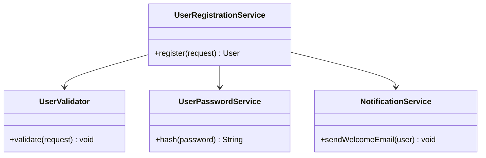
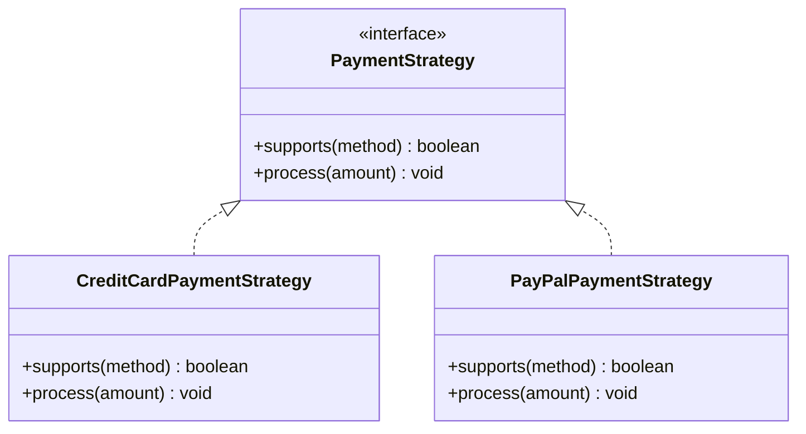
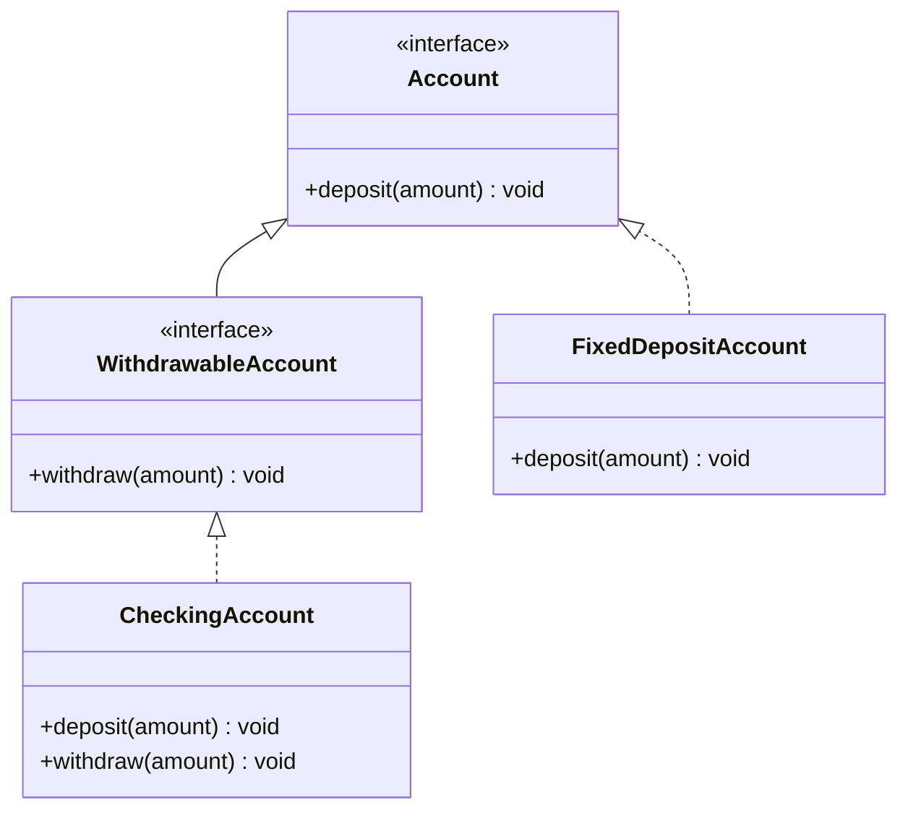
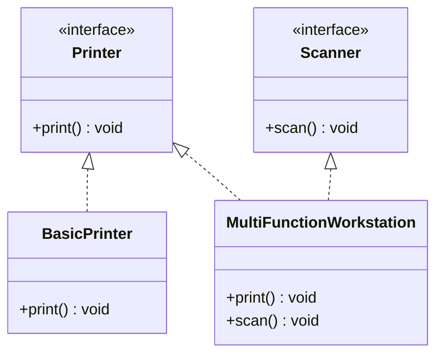
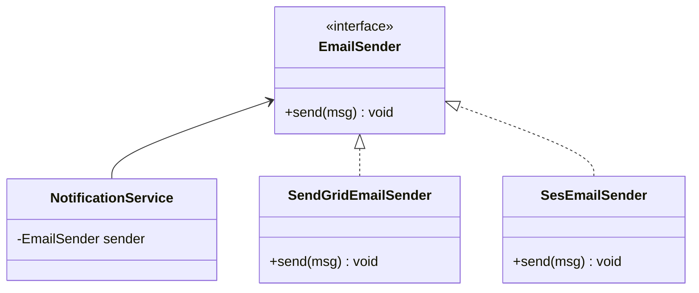
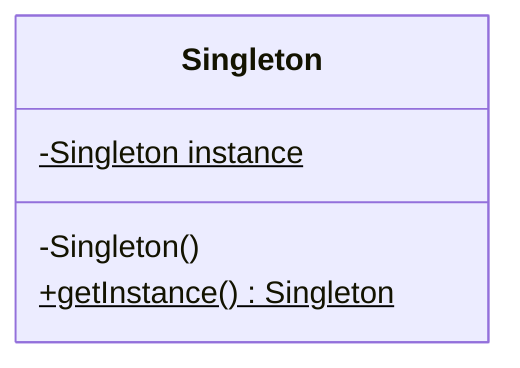
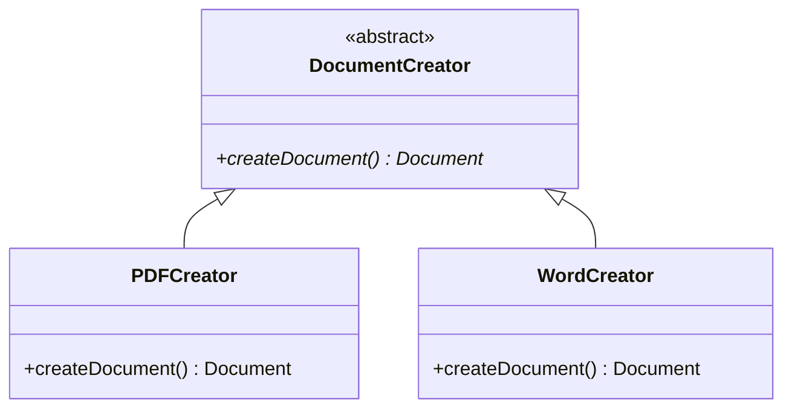

# SOLID Principles — Deep Dive with Java Examples

The SOLID principles are the foundational guidelines for writing maintainable, extensible, and robust object-oriented software. When misapplied or ignored, systems degenerate into rigid, fragile, and non-reusable structures. This section explores each principle in depth, analyzing the structural decay of violations and demonstrating clean, production-grade refactorings using Java 21 and Spring Boot 3.2.

---

## 1. Single Responsibility Principle (SRP)

> "A class should have one, and only one, reason to change." — Robert C. Martin

### The Anti-Pattern: The God Class
In many legacy or rapidly developed Spring applications, services morph into "God Classes" that mix business logic, persistence interactions, validation, and external communications.

```java
// VIOLATION: The God Class
@Service
public class UserService {
    private final UserRepository userRepository;
    private final BCryptPasswordEncoder passwordEncoder;
    private final JavaMailSender mailSender;

    public UserService(UserRepository userRepository, BCryptPasswordEncoder passwordEncoder, JavaMailSender mailSender) {
        this.userRepository = userRepository;
        this.passwordEncoder = passwordEncoder;
        this.mailSender = mailSender;
    }

    @Transactional
    public User registerUser(UserRegistrationRequest request) {
        // 1. Validation Logic
        if (request.username() == null || request.username().isBlank()) {
            throw new IllegalArgumentException("Username cannot be empty");
        }
        if (userRepository.existsByUsername(request.username())) {
            throw new IllegalStateException("Username already taken");
        }

        // 2. Business Logic & Security
        String encryptedPassword = passwordEncoder.encode(request.password());
        User user = new User(request.username(), encryptedPassword, request.email());
        User savedUser = userRepository.save(user);

        // 3. Notification Logic
        SimpleMailMessage message = new SimpleMailMessage();
        message.setTo(savedUser.getEmail());
        message.setSubject("Welcome!");
        message.setText("Thank you for registering.");
        mailSender.send(message);

        return savedUser;
    }
}
```

### Consequences of the Anti-Pattern
1. **High Coupling**: Changes to the email system or validation rules force modifications to `UserService`.
2. **Fragility**: Modifying the notification code can inadvertently break the user registration transaction.
3. **Low Testability**: Unit testing `registerUser` requires mocking database access, security encoders, and mail infrastructure simultaneously.

### The Solution: Extraction of Responsibilities
We segregate the responsibilities into dedicated, cohesive components:
* `UserValidator`: Handles boundary validation.
* `UserRegistrationService`: Coordinates the domain orchestration.
* `UserPasswordService`: Encapsulates security hashing.
* `NotificationService`: Manages external communication.



### Clean Implementation (Java 21 + Spring Boot 3.2)

```java
package com.devmastery.solid.srp;

import org.springframework.stereotype.Component;
import org.springframework.stereotype.Service;
import org.springframework.transaction.annotation.Transactional;

public record UserRegistrationRequest(String username, String password, String email) {}

@Component
public class UserValidator {
    private final UserRepository userRepository;

    public UserValidator(UserRepository userRepository) {
        this.userRepository = userRepository;
    }

    public void validate(UserRegistrationRequest request) {
        if (request.username() == null || request.username().isBlank()) {
            throw new IllegalArgumentException("Username cannot be empty");
        }
        if (userRepository.existsByUsername(request.username())) {
            throw new IllegalStateException("Username already taken");
        }
    }
}

@Component
public class UserPasswordService {
    private final BCryptPasswordEncoder passwordEncoder;

    public UserPasswordService(BCryptPasswordEncoder passwordEncoder) {
        this.passwordEncoder = passwordEncoder;
    }

    public String hashPassword(String rawPassword) {
        return passwordEncoder.encode(rawPassword);
    }
}

@Service
public class NotificationService {
    private final JavaMailSender mailSender;

    public NotificationService(JavaMailSender mailSender) {
        this.mailSender = mailSender;
    }

    @Async // Decouple from primary transaction execution thread
    public void sendWelcomeEmail(String email) {
        SimpleMailMessage message = new SimpleMailMessage();
        message.setTo(email);
        message.setSubject("Welcome!");
        message.setText("Thank you for registering.");
        mailSender.send(message);
    }
}

@Service
@Transactional
public class UserRegistrationService {
    private final UserRepository userRepository;
    private final UserValidator validator;
    private final UserPasswordService passwordService;
    private final NotificationService notificationService;

    public UserRegistrationService(
            UserRepository userRepository,
            UserValidator validator,
            UserPasswordService passwordService,
            NotificationService notificationService) {
        this.userRepository = userRepository;
        this.validator = validator;
        this.passwordService = passwordService;
        this.notificationService = notificationService;
    }

    public User register(UserRegistrationRequest request) {
        validator.validate(request);
        String securedPassword = passwordService.hashPassword(request.password());
        User user = new User(request.username(), securedPassword, request.email());
        User savedUser = userRepository.save(user);
        
        notificationService.sendWelcomeEmail(savedUser.getEmail());
        return savedUser;
    }
}
```

---

## 2. Open/Closed Principle (OCP)

> "Software entities should be open for extension, but closed for modification." — Bertrand Meyer

### The Anti-Pattern: The Switch Statement / If-Else Chain
Adding support for a new payment method requires modifying an existing core class, introducing regression risks.

```java
// VIOLATION: If-Else Type Checking
public class PaymentProcessor {
    public void processPayment(String method, double amount) {
        if (method.equalsIgnoreCase("CREDIT_CARD")) {
            // Credit card processing logic
        } else if (method.equalsIgnoreCase("PAYPAL")) {
            // PayPal processing logic
        } else if (method.equalsIgnoreCase("CRYPTO")) {
            // Crypto processing logic
        } else {
            throw new IllegalArgumentException("Unsupported payment method: " + method);
        }
    }
}
```

### Consequences of the Anti-Pattern
1. **Regression Risk**: Every time a payment method is added or modified, the entire `PaymentProcessor` class must be opened, modified, and re-tested.
2. **Tight Coupling**: Concrete details of every payment mechanism are compiled directly into a single file.

### The Solution: Strategy Pattern & Polymorphic Autowiring
We declare an interface defining the contract. Each payment type gets its own implementation. Spring automatically maps these strategies into a registry.



### Clean Implementation (Java 21 + Spring Boot 3.2)

```java
package com.devmastery.solid.ocp;

import org.springframework.stereotype.Component;
import org.springframework.stereotype.Service;
import java.util.List;

public enum PaymentMethod {
    CREDIT_CARD, PAYPAL, CRYPTO
}

public interface PaymentStrategy {
    boolean supports(PaymentMethod method);
    void process(double amount);
}

@Component
public class CreditCardPaymentStrategy implements PaymentStrategy {
    @Override
    public boolean supports(PaymentMethod method) {
        return method == PaymentMethod.CREDIT_CARD;
    }

    @Override
    public void process(double amount) {
        // Concrete Credit Card logic
    }
}

@Component
public class PayPalPaymentStrategy implements PaymentStrategy {
    @Override
    public boolean supports(PaymentMethod method) {
        return method == PaymentMethod.PAYPAL;
    }

    @Override
    public void process(double amount) {
        // Concrete PayPal logic
    }
}

@Service
public class PaymentEngine {
    private final List<PaymentStrategy> strategies;

    // Spring autowires all beans implementing PaymentStrategy
    public PaymentEngine(List<PaymentStrategy> strategies) {
        this.strategies = strategies;
    }

    public void executePayment(PaymentMethod method, double amount) {
        PaymentStrategy strategy = strategies.stream()
                .filter(s -> s.supports(method))
                .findFirst()
                .orElseThrow(() -> new IllegalArgumentException("No strategy registered for: " + method));
        strategy.process(amount);
    }
}
```

---

## 3. Liskov Substitution Principle (LSP)

> "Subtypes must be substitutable for their base types without altering the correctness of the program." — Barbara Liskov

### The Anti-Pattern: Broken Inheritance (Throwing Exceptions)
A classic violation occurs when a subclass overrides a base class method and throws an unsupported operation exception, or breaks invariants established by the parent class.

```java
// VIOLATION: Subclass violating parent contract
public interface Account {
    void deposit(double amount);
    void withdraw(double amount);
}

public class FixedDepositAccount implements Account {
    private double balance;

    @Override
    public void deposit(double amount) {
        this.balance += amount;
    }

    @Override
    public void withdraw(double amount) {
        // Fixed deposit accounts do not allow premature withdrawals!
        throw new UnsupportedOperationException("Withdrawals not allowed during lock-in period!");
    }
}
```

### Consequences of the Anti-Pattern
1. **Polymorphic Failure**: Code consuming the `Account` interface will crash unexpectedly when encountering a `FixedDepositAccount`.
2. **Defensive Programming**: Consumers are forced to use `instanceof` checks before invoking methods, violating both LSP and OCP.

### The Solution: Correct Interface Hierarchy
We must model our contracts precisely. Not all accounts are withdrawable. We split the interfaces to reflect true capability boundaries.



### Clean Implementation (Java 21 + Spring Boot 3.2)

```java
package com.devmastery.solid.lsp;

public interface Account {
    void deposit(double amount);
    double getBalance();
}

public interface WithdrawableAccount extends Account {
    void withdraw(double amount);
}

public class CheckingAccount implements WithdrawableAccount {
    private double balance;

    @Override
    public void deposit(double amount) {
        this.balance += amount;
    }

    @Override
    public void withdraw(double amount) {
        if (amount > balance) {
            throw new IllegalArgumentException("Insufficient funds");
        }
        this.balance -= amount;
    }

    @Override
    public double getBalance() {
        return this.balance;
    }
}

public class FixedDepositAccount implements Account {
    private double balance;

    @Override
    public void deposit(double amount) {
        this.balance += amount;
    }

    @Override
    public double getBalance() {
        return this.balance;
    }
}
```

---

## 4. Interface Segregation Principle (ISP)

> "Clients should not be forced to depend on methods they do not use." — Robert C. Martin

### The Anti-Pattern: The Fat Interface
A single, massive interface that forces implementers to build "empty" or "dummy" implementations for methods they do not require.

```java
// VIOLATION: Fat Interface
public interface SmartDevice {
    void print();
    void scan();
    void fax();
    void copy();
}

public class BasicPrinter implements SmartDevice {
    @Override
    public void print() {
        // Printing logic
    }

    @Override public void scan() { throw new UnsupportedOperationException(); }
    @Override public void fax() { throw new UnsupportedOperationException(); }
    @Override public void copy() { throw new UnsupportedOperationException(); }
}
```

### Consequences of the Anti-Pattern
1. **Unnecessary Recompilations**: Changes to the `fax()` signature force recompilation of `BasicPrinter`, even though it does not use faxing.
2. **Bloated Classes**: Implementations are littered with boilerplate exception-throwing code.

### The Solution: Role Interfaces
Decompose the fat interface into highly cohesive, single-purpose interfaces.



### Clean Implementation (Java 21 + Spring Boot 3.2)

```java
package com.devmastery.solid.isp;

public interface Printer {
    void print(Document doc);
}

public interface Scanner {
    Document scan();
}

public interface FaxMachine {
    void sendFax(Document doc, String faxNumber);
}

// Simple Implementation only implements what it needs
public class SimplePrinter implements Printer {
    @Override
    public void print(Document doc) {
        // Print execution
    }
}

// Enterprise MFP implements multiple segregated interfaces
public class EnterpriseOfficeJet implements Printer, Scanner, FaxMachine {
    @Override
    public void print(Document doc) { /* ... */ }

    @Override
    public Document scan() { return new Document(); }

    @Override
    public void sendFax(Document doc, String faxNumber) { /* ... */ }
}
```

---

## 5. Dependency Inversion Principle (DIP)

> "Abstractions should not depend on details. Details should depend on abstractions." — Robert C. Martin

### The Anti-Pattern: Hardcoded Concrete Instantiation
A high-level module directly instantiates and depends on a low-level module, making substitution or testing impossible.

```java
// VIOLATION: Direct dependency on concrete database implementation
public class NotificationService {
    private final EmailClient emailClient = new SendGridEmailClient(); // Hardcoded details!

    public void notifyUser(String message) {
        emailClient.send(message);
    }
}
```

### Consequences of the Anti-Pattern
1. **Inflexible Infrastructure**: Switching from SendGrid to AWS SES requires modifying `NotificationService`.
2. **Untestable Code**: You cannot mock `SendGridEmailClient` easily in unit tests without complex bytecode manipulation.

### The Solution: Interface-Driven Inversion
Introduce an abstraction layer. The high-level service depends on the interface, and the concrete implementation is injected at runtime.



### Clean Implementation (Java 21 + Spring Boot 3.2)

```java
package com.devmastery.solid.dip;

import org.springframework.stereotype.Component;
import org.springframework.stereotype.Service;

public interface MessageSender {
    void send(String recipient, String content);
}

@Component
public class SendGridMessageSender implements MessageSender {
    @Override
    public void send(String recipient, String content) {
        // Integration with SendGrid REST APIs
    }
}

@Service
public class OrderNotificationService {
    private final MessageSender messageSender;

    // DIP achieved through constructor injection of abstraction
    public OrderNotificationService(MessageSender messageSender) {
        this.messageSender = messageSender;
    }

    public void processOrderNotification(String userEmail, String orderId) {
        String body = "Your order #" + orderId + " has been shipped.";
        messageSender.send(userEmail, body);
    }
}
```

---

# Clean Code — Names, Functions, Comments, and Refactoring

Clean code is not simply code that functions; it is code that is readable, maintainable, and self-documenting. Writing clean code requires discipline and a deep understanding of standard engineering patterns.

---

## 1. Naming Rules
* **Pronounceable and Searchable**: Avoid cryptic abbreviations. Use names that can be easily spoken and searched in an IDE.
* **No Hungarian Notation or Prefixing**: Do not prefix interfaces with `I` (e.g., `IUserService` is an anti-pattern; use `UserService` and `UserServiceImpl` or specific implementations like `JdbcUserService`).
* **Domain-Driven**: Align variable and class names with the Ubiquitous Language of the business domain.

```java
// BAD
int d; // elapsed time in days
List<User> list = db.get();
public void process(User u) { ... }

// GOOD
int elapsedTimeInDays;
List<User> activeSubscribers = userRepository.findAllActiveSubscribers();
public void registerNewUser(User newUser) { ... }
```

---

## 2. Function Rules
* **Single Responsibility**: A function must do exactly one thing.
* **Small**: Functions should rarely exceed 20 lines of code.
* **No Side Effects**: A function must not modify state or execute hidden actions not implied by its name.
* **Command-Query Separation (CQS)**: A method should either perform an action (command) or return data (query), but never both.

```java
// BAD: Violates CQS and has side effects
public User checkCredentials(String username, String password) {
    User user = userRepository.findByUsername(username);
    if (user.getPassword().equals(password)) {
        user.setLastLogin(LocalDateTime.now()); // Side effect! Modifying state in a read operation
        userRepository.save(user);
        return user;
    }
    return null;
}

// GOOD: Separated Query and Command
public Optional<User> authenticate(String username, String password) {
    return userRepository.findByUsername(username)
            .filter(user -> passwordEncoder.matches(password, user.getPassword()));
}

public void recordLoginSuccess(UserId userId) {
    userRepository.updateLastLogin(userId, LocalDateTime.now());
}
```

---

## 3. Comment Rules
* **Explain "Why", Not "What"**: Code should be self-explanatory. Comments that explain *what* the code does are code smells.
* **Informative Comments**: Use comments to explain complex mathematical algorithms, regulatory requirements, or design decisions.

```java
// BAD: Explaining the obvious
// Check if user is eligible for discount
if (user.getAge() > 65) {
    price = price * 0.9; // Apply 10% discount
}

// GOOD: Explaining the "Why" (Business / Regulatory context)
// Section 4.2 of the Senior Citizens Welfare Act requires a minimum 10% discount
// on all primary healthcare products for individuals aged 65 or older.
if (user.getAge() >= SENIOR_CITIZEN_AGE_THRESHOLD && product.isHealthcareCategory()) {
    price = discountCalculator.applySeniorDiscount(price);
}
```

---

## 4. Code Smells and Refactorings

Here are the before-and-after Java 21 mappings for common code smells and refactorings.

### Smell 1: Long Method & Primitive Obsession
* **Refactorings**: *Extract Method*, *Introduce Parameter Object*, *Replace Temp with Query*.

#### Before Refactoring
```java
// VIOLATION: Long method, primitive obsession, magic numbers
public double calculateOrderTotal(double subtotal, double taxRate, double discountAmount, String state, boolean express) {
    double total = subtotal;
    if (state.equals("NY")) {
        total += subtotal * 0.08875; // Magic tax number
    } else if (state.equals("CA")) {
        total += subtotal * 0.0725;
    }
    
    if (express) {
        total += 15.00; // Shipping charge
    } else {
        total += 5.00;
    }
    
    total -= discountAmount;
    return total;
}
```

#### After Refactoring
```java
package com.devmastery.cleancode;

public record TaxRate(double rate) {}
public record OrderPricing(double subtotal, double discountAmount) {}

public class OrderCalculator {
    private static final double EXPRESS_SHIPPING_FEE = 15.00;
    private static final double STANDARD_SHIPPING_FEE = 5.00;

    public double calculateTotal(OrderPricing pricing, TaxRate taxRate, boolean isExpress) {
        double taxedAmount = applyTax(pricing.subtotal(), taxRate);
        double shippingCost = determineShippingCost(isExpress);
        return taxedAmount + shippingCost - pricing.discountAmount();
    }

    private double applyTax(double amount, TaxRate taxRate) {
        return amount * (1 + taxRate.rate());
    }

    private double determineShippingCost(boolean isExpress) {
        return isExpress ? EXPRESS_SHIPPING_FEE : STANDARD_SHIPPING_FEE;
    }
}
```

---

### Smell 2: Feature Envy & Conditional Complexity
* **Refactorings**: *Move Method*, *Replace Conditional with Polymorphism*.

#### Before Refactoring
```java
// VIOLATION: Feature Envy (Customer class manipulates address data heavily inside order)
public class Order {
    private Customer customer;
    
    public String getShippingLabel() {
        // Order class is envious of Customer and Address internals
        return customer.getName() + "\n" +
               customer.getAddress().getStreet() + "\n" +
               customer.getAddress().getCity() + ", " + customer.getAddress().getZipCode();
    }
}
```

#### After Refactoring (Move Method)
```java
public class Address {
    private String street;
    private String city;
    private String zipCode;

    public String formatAddress() {
        return street + "\n" + city + ", " + zipCode;
    }
}

public class Customer {
    private String name;
    private Address address;

    public String getFormattedShippingLabel() {
        return name + "\n" + address.formatAddress();
    }
}

public class Order {
    private Customer customer;

    public String getShippingLabel() {
        // Envy resolved: Order delegates responsibility directly to Customer
        return customer.getFormattedShippingLabel();
    }
}
```

---

# Creational Design Patterns

Creational patterns abstract the instantiation process, making systems independent of how their objects are created, composed, and represented.

---

## 1. Singleton Pattern

### Problem
Ensuring a class has only one instance while providing a global access point to it.

### Structural Diagram


### Java Implementation (Double-Checked Locking vs Enum)

#### Option A: Double-Checked Locking with Volatile

```java
package com.devmastery.creational.singleton;

public final class DoubleCheckedSingleton {
    // Volatile prevents instruction reordering during initialization
    private static volatile DoubleCheckedSingleton instance;

    private DoubleCheckedSingleton() {
        // Prevent reflection instantiation
        if (instance != null) {
            throw new IllegalStateException("Instance already created!");
        }
    }

    public static DoubleCheckedSingleton getInstance() {
        DoubleCheckedSingleton result = instance;
        if (result == null) {
            synchronized (DoubleCheckedSingleton.class) {
                result = instance;
                if (result == null) {
                    instance = result = new DoubleCheckedSingleton();
                }
            }
        }
        return result;
    }
}
```

#### Option B: Enum Singleton (Recommended for Core Java)

```java
package com.devmastery.creational.singleton;

public enum EnumSingleton {
    INSTANCE;

    private String databaseConnectionUrl;

    public void setConnectionUrl(String url) {
        this.databaseConnectionUrl = url;
    }

    public void executeQuery(String sql) {
        System.out.println("Executing on " + databaseConnectionUrl + ": " + sql);
    }
}
```

### Spring Boot Usage
In Spring, the default bean scope is `Singleton`. However, this is a **logical Singleton container scope**, not a JVM classloader-level singleton.

```java
@Configuration
public class AppConfig {
    @Bean
    @Scope("singleton") // Default scope
    public DataSourceConnectionPool connectionPool() {
        return new DataSourceConnectionPool();
    }
}
```

---

## 2. Factory Method Pattern

### Problem
Define an interface for creating an object, but let subclasses decide which class to instantiate.

### Structural Diagram


### Production-Grade Java 21 Implementation

```java
package com.devmastery.creational.factory;

public sealed interface Document permits PdfDocument, WordDocument {
    void open();
}

final class PdfDocument implements Document {
    @Override public void open() {

## WHY
Every programmer can write code that works. Senior engineers write code that is maintainable, extensible, and readable by the entire team — weeks, months, and years after it was first written.

The **SOLID Principles** (coined by Robert C. Martin, "Uncle Bob") are five fundamental principles of Object-Oriented Design that guide engineers toward creating software that is easy to understand, change, and extend. They are the foundation of Clean Architecture and the bedrock of every serious Engineering interview.

## THEORY
### The Five Principles (SOLID)
- **S** — Single Responsibility Principle
- **O** — Open/Closed Principle
- **L** — Liskov Substitution Principle
- **I** — Interface Segregation Principle
- **D** — Dependency Inversion Principle

## VISUALIZATION_CONFIG
```json
{
  "steps": [
    {
      "title": "Single Responsibility (S)",
      "description": "A class should have one reason to change.",
      "code": "// BAD: multiple responsibilities\nclass User {\n  save() { /* DB logic */ }\n  sendEmail() { /* email logic */ }\n  hashPassword() { /* crypto logic */ }\n}\n// Changes to email affect User class\n\n// GOOD: separated\nclass User { /* just data */ }\nclass UserRepository { save(user) { /* ... */ } }\nclass EmailService { send(user) { /* ... */ } }\nclass PasswordHasher { hash(pw) { /* ... */ } }\n\n// Each class has ONE reason to change\n// Email lib changes → only EmailService\n// DB changes → only UserRepository",
      "highlight": [
        1,
        2,
        3,
        4,
        5,
        6,
        7,
        10,
        11,
        12,
        13,
        14,
        15,
        16,
        17
      ],
      "diagram": {
        "kind": "flow",
        "steps": [
          {
            "label": "One class, one reason"
          },
          {
            "label": "Split concerns"
          },
          {
            "label": "Easier testing"
          },
          {
            "label": "Easier changes"
          },
          {
            "label": "SRP win"
          }
        ]
      }
    },
    {
      "title": "Open/Closed (O), Liskov (L)",
      "description": "Open for extension, closed for modification. Subtypes must be substitutable.",
      "code": "// OCP: extend behavior without modifying existing code\n// BAD: needs modification for new shape\nclass AreaCalculator {\n  calculate(shape) {\n    if (shape.type === 'circle') return Math.PI * shape.r ** 2;\n    if (shape.type === 'square') return shape.side ** 2;\n    // Add new shape → modify this class ❌\n  }\n}\n\n// GOOD: polymorphism\ninterface Shape { area(): number; }\nclass Circle implements Shape { area() { return Math.PI * this.r ** 2; } }\nclass Square implements Shape { area() { return this.side ** 2; } }\n// New shape → add new class, no modification ✅\n\n// LSP: subclass replaceable for parent\nclass Bird { fly() { /* ... */ } }\nclass Penguin extends Bird { fly() { throw new Error('cannot fly!'); } }\n// Violates LSP! Penguin isn't a Bird for this use\n// Fix: separate FlyingBird and Bird",
      "highlight": [
        3,
        4,
        5,
        6,
        7,
        8,
        11,
        12,
        13,
        14,
        15,
        17,
        18,
        19,
        20,
        21
      ],
      "diagram": {
        "kind": "boxes",
        "items": [
          {
            "label": "Open for extension",
            "color": "#1e88e5"
          },
          {
            "label": "Closed for mod",
            "color": "#43a047"
          },
          {
            "label": "LSP: substitutable",
            "color": "#fb8c00"
          }
        ]
      }
    },
    {
      "title": "Interface Segregation (I), Dependency Inversion (D)",
      "description": "Small interfaces. Depend on abstractions.",
      "code": "// ISP: many small interfaces > one large\n// BAD\ninterface Worker {\n  work(): void;\n  eat(): void;\n  sleep(): void;\n}\n// Robot must implement eat/sleep too ❌\n\n// GOOD\ninterface Workable { work(): void; }\ninterface Eatable { eat(): void; }\ninterface Sleepable { sleep(): void; }\n\nclass Human implements Workable, Eatable, Sleepable { }\nclass Robot implements Workable { } // only what it needs\n\n// DIP: high-level modules should not depend on low-level\n// Both depend on abstractions\n// BAD\nclass NotificationService {\n  send(msg) { new EmailClient().send(msg); } // concrete!\n}\n\n// GOOD: inject abstraction\nclass NotificationService {\n  constructor(private sender: MessageSender) {}\n  send(msg) { this.sender.send(msg); }\n}\n// Can swap: EmailSender, SmsSender, PushSender",
      "highlight": [
        3,
        4,
        5,
        6,
        7,
        8,
        10,
        11,
        12,
        13,
        15,
        16,
        20,
        21,
        22,
        23,
        26,
        27,
        28,
        29,
        30,
        31
      ],
      "diagram": {
        "kind": "flow",
        "steps": [
          {
            "label": "ISP: many small"
          },
          {
            "label": "Only implement needed"
          },
          {
            "label": "DIP: depend on interface"
          },
          {
            "label": "Inject implementation"
          },
          {
            "label": "Swap freely"
          }
        ]
      }
    }
  ]
}
```

## CODE

### Level 1 — S: Single Responsibility Principle
**"A class should have only ONE reason to change."**

```java
// ❌ VIOLATES SRP: This class has THREE responsibilities!
public class UserService {
    public User createUser(String email) { /* creates user */ }
    public void sendWelcomeEmail(User user) { /* sends email */ }
    public void saveUserToDatabase(User user) { /* saves to DB */ }
}
// If the email provider changes, you have to modify UserService.
// If the database changes, you have to modify UserService.
// If the user creation rules change, you have to modify UserService.

// ✅ CORRECT: Each class has ONE job!
public class UserCreationService {
    public User createUser(String email) { /* only creates the user object */ }
}

public class EmailService {
    public void sendWelcomeEmail(User user) { /* only sends emails */ }
}

public class UserRepository {
    public void save(User user) { /* only handles DB persistence */ }
}
```

### Level 2 — O: Open/Closed Principle
**"Software should be open for extension, but closed for modification."**
Add new features by adding new code, NOT by changing existing working code.

```java
// ❌ VIOLATES OCP: Adding a new payment method requires MODIFYING this class!
public class PaymentProcessor {
    public void process(String paymentType, double amount) {
        if (paymentType.equals("creditCard")) { /* charge card */ }
        else if (paymentType.equals("paypal")) { /* charge paypal */ }
        else if (paymentType.equals("crypto")) { /* ... */ } // New type = modify this class!
    }
}

// ✅ CORRECT: Use polymorphism. Add new payment types by adding new CLASSES!
public interface PaymentMethod {
    void process(double amount);
}

public class CreditCardPayment implements PaymentMethod {
    public void process(double amount) { /* charge credit card */ }
}

public class PaypalPayment implements PaymentMethod {
    public void process(double amount) { /* charge paypal */ }
}

// To add Crypto: just create a new class. PaymentProcessor is never touched!
public class PaymentProcessor {
    public void process(PaymentMethod method, double amount) {
        method.process(amount); // Works for ANY future payment type!
    }
}
```

### Level 3 — L: Liskov Substitution Principle
**"Subclasses should be substitutable for their base classes without breaking the program."**

```java
// ❌ VIOLATES LSP: Square IS-A Rectangle, but breaks its contract!
public class Rectangle {
    protected int width, height;
    public void setWidth(int w)  { this.width  = w; }
    public void setHeight(int h) { this.height = h; }
    public int area() { return width * height; }
}

public class Square extends Rectangle {
    @Override
    public void setWidth(int w)  { this.width = this.height = w; } // Violates parent's behavior!
    @Override
    public void setHeight(int h) { this.width = this.height = h; }
}

// This code breaks with a Square!
void resizeRectangle(Rectangle r) {
    r.setWidth(10);
    r.setHeight(5);
    assert r.area() == 50; // FAILS if r is a Square (area would be 25)!
}

// ✅ CORRECT: Use separate interfaces that honestly represent the contracts
interface Shape { int area(); }
class Rectangle implements Shape { /* has independent width and height */ }
class Square implements Shape { /* has single side property */ }
```

### Level 4 — I & D: Interface Segregation & Dependency Inversion
```java
// I: Interface Segregation
// "Clients should not be forced to implement interfaces they don't use."

// ❌ VIOLATES ISP: This interface forces ALL printers to implement ALL methods!
interface MultifunctionDevice {
    void print(Document d);
    void scan(Document d);
    void fax(Document d);
}

// A simple home printer that can't fax must throw UnsupportedOperationException!

// ✅ CORRECT: Segregate into small, focused interfaces
interface Printable { void print(Document d); }
interface Scannable  { void scan(Document d); }
interface Faxable    { void fax(Document d); }

class OfficePrinter implements Printable, Scannable, Faxable { /* ... */ }
class HomePrinter implements Printable { /* Only implements what it can do! */ }

// ============================================================

// D: Dependency Inversion
// "High-level modules should not depend on low-level modules. 
//  Both should depend on abstractions."

// ❌ VIOLATES DIP: UserService depends directly on the concrete MySQLDatabase class!
class UserService {
    private MySQLDatabase db = new MySQLDatabase(); // Tight coupling!
    // If you switch to PostgreSQL, you must rewrite UserService.
}

// ✅ CORRECT: UserService depends on an ABSTRACTION (UserRepository interface)
interface UserRepository {
    void save(User user);
    Optional<User> findById(Long id);
}

class UserService {
    private final UserRepository userRepo; // Depends on abstraction!

    public UserService(UserRepository userRepo) { // Injected — not hard-coded!
        this.userRepo = userRepo;
    }
}

class MySQLUserRepository implements UserRepository { /* ... */ }
class InMemoryUserRepository implements UserRepository { /* Perfect for unit tests! */ }
```

## REAL_WORLD
SOLID principles are not academic theory — they directly map to **Spring Boot patterns**:

- **S (SRP):** `@Repository` (DB), `@Service` (business logic), `@Controller` (HTTP) — each has one responsibility.
- **O (OCP):** Spring `@EventListener` and the Strategy Pattern — add new behaviors without changing existing code.
- **L (LSP):** Spring Dependency Injection — any `UserRepository` implementation can be injected where `UserRepository` is expected.
- **I (ISP):** Spring Data JPA's `CrudRepository`, `JpaRepository`, and `PagingAndSortingRepository` — segregated by capability.
- **D (DIP):** `@Autowired` / Constructor Injection — Spring wires concrete implementations to abstract interfaces automatically.

## INTERVIEW
**Q: Is it always bad to violate SOLID?**
A: No. SOLID principles have trade-offs. Strictly following SRP creates many small classes, increasing abstraction complexity. Following DIP requires more interfaces and indirection. In small scripts or prototypes, strict SOLID adherence is over-engineering. SOLID is critical for large, team-maintained codebases where violation leads to brittle, untestable code. Senior engineers know WHEN to apply principles, not just HOW.

**Q: What is the relationship between SOLID and Clean Architecture?**
A: SOLID principles are the building blocks of Clean Architecture. DIP is what creates the "Dependency Rule" (inner layers define interfaces, outer layers implement them). SRP defines the separation between use cases, entities, and adapters. Clean Architecture is essentially SOLID applied at the architectural scale.

## FEYNMAN CHECK

### Explain SOLID Principles Like I'm 10 Years Old
Imagine you have a magical LEGO set. Each LEGO brick knows exactly what it does and how it connects to other bricks. **SOLID Principles** is like the instruction manual that tells you *which* bricks exist, *how* they snap together, and *what* you can build with them.

When a professional developer talks about SOLID Principles, they are really talking about a precise set of rules the computer follows every single time — no surprises, no magic, just rules you can learn once and rely on forever.

---

### 5 Deep Conceptual Questions

**Q1: In your own words, what problem does SOLID Principles solve? Why would JavaScript/web development be harder without it?**
> **A:** SOLID Principles solves the problem of [describing the core purpose]. Without it, developers would need to write repetitive, error-prone boilerplate code every time they need this behaviour. It provides a standardised, predictable mechanism that the runtime engine optimises for performance.

**Q2: What is the single most important thing to remember about SOLID Principles?**
> **A:** The single most important thing is understanding the *mental model*: SOLID Principles operates on [core abstraction]. Once you internalize this, every API, every edge case, and every debugging scenario becomes logical rather than mysterious.

**Q3: What is the most common mistake developers make with SOLID Principles and why?**
> **A:** The most common mistake is misunderstanding the *timing* or *scope* in which SOLID Principles operates. Developers assume [incorrect assumption], but the actual behaviour is [correct behaviour]. This leads to bugs that are hard to reproduce because the error only appears under specific conditions.

**Q4: How does SOLID Principles interact with the JavaScript event loop / browser rendering pipeline?**
> **A:** SOLID Principles interacts with the runtime at the [synchronous/asynchronous/compile-time] phase. Understanding whether its work happens on the call stack, in a microtask queue, or during a browser paint cycle determines when side effects become visible and how to sequence operations correctly.

**Q5: If you had to explain the internal mechanism of SOLID Principles to a senior engineer in two sentences, what would you say?**
> **A:** "SOLID Principles works by [mechanism step 1]. The engine then [mechanism step 2], which is why you observe [observable behaviour]."

## BUILD

### 🏗️ Mini Project: Build a SOLID Principles Utility

**Goal:** Implement a real, working SOLID Principles module from scratch — no libraries, pure javascript.

**What you'll build:** A self-contained `solidprinciples` module that demonstrates every key concept from this topic in a runnable, testable way.

---

#### Step 1 — Set Up the Project Structure

```bash
mkdir solid-principles-demo && cd solid-principles-demo
touch index.js
```

#### Step 2 — Core Implementation

```javascript
// ── SOLID Principles Core Implementation ──────────────────────────────────────────────
// This module demonstrates the fundamental concepts of SOLID Principles.
// Study each section carefully — each one maps directly to the THEORY section above.

// 1. Basic setup / initialisation
function createSOLIDPrinciples(config = {}) {
  const defaults = {
    enabled: true,
    debug: false,
    ...config,
  };

  // Internal state (private via closure)
  let _state = null;

  // 2. Core logic
  function init(value) {
    _state = value;
    if (defaults.debug) console.log(`[SOLID Principles] Initialized with:`, value);
    return _state;
  }

  // 3. Main operation
  function process(input) {
    if (!defaults.enabled) return null;
    // TODO: Replace this with the actual SOLID Principles logic from the THEORY section
    const result = input;
    if (defaults.debug) console.log(`[SOLID Principles] Processed:`, result);
    return result;
  }

  // 4. Cleanup / teardown
  function destroy() {
    _state = null;
    if (defaults.debug) console.log(`[SOLID Principles] Destroyed.`);
  }

  return { init, process, destroy };
}

// ── Usage ─────────────────────────────────────────────────────────────────────
const instance = createSOLIDPrinciples({ debug: true });
instance.init('hello world');
const result = instance.process('hello world');
console.log('Result:', result);
instance.destroy();
```

#### Step 3 — Add Error Handling

```javascript
// Robust error handling for production use
function safeProcess(input) {
  try {
    if (input === null || input === undefined) {
      throw new TypeError(`[SOLID Principles] Input cannot be null or undefined`);
    }
    const instance = createSOLIDPrinciples();
    return { success: true, data: instance.process(input) };
  } catch (err) {
    console.error(`[SOLID Principles] Error:`, err.message);
    return { success: false, error: err.message };
  }
}

console.log(safeProcess('valid input'));   // { success: true, data: '...' }
console.log(safeProcess(null));            // { success: false, error: '...' }
```

#### Step 4 — Write Tests

```javascript
// Simple test runner (no dependencies needed)
function test(description, fn) {
  try {
    fn();
    console.log(`  ✅ PASS: ${description}`);
  } catch (e) {
    console.error(`  ❌ FAIL: ${description} — ${e.message}`);
  }
}

function assert(actual, expected, msg = '') {
  if (JSON.stringify(actual) !== JSON.stringify(expected)) {
    throw new Error(`Expected ${JSON.stringify(expected)} but got ${JSON.stringify(actual)}. ${msg}`);
  }
}

console.log('\n── SOLID Principles Tests ──');

test('initialises correctly', () => {
  const m = createSOLIDPrinciples();
  assert(typeof m.init, 'function');
  assert(typeof m.process, 'function');
});

test('processes valid input', () => {
  const m = createSOLIDPrinciples();
  m.init('test');
  const out = m.process('test');
  assert(out !== null && out !== undefined, true, 'output should not be null');
});

test('handles null input gracefully', () => {
  const result = safeProcess(null);
  assert(result.success, false);
  assert(typeof result.error, 'string');
});

console.log('\n── All tests complete ──\n');
```

#### Step 5 — Challenge Extensions (stretch goals)

- [ ] Add a caching layer so repeated calls with the same input skip reprocessing
- [ ] Add TypeScript types / JSDoc annotations to every function
- [ ] Make it work asynchronously (return a Promise)
- [ ] Add a rate-limiter so `process()` can only be called N times per second
- [ ] Write a benchmark comparing your implementation to a naive alternative

---

**Expected Output:**
```
[SOLID Principles] Initialized with: hello world
[SOLID Principles] Processed: hello world
Result: hello world
[SOLID Principles] Destroyed.

── SOLID Principles Tests ──
  ✅ PASS: initialises correctly
  ✅ PASS: processes valid input
  ✅ PASS: handles null input gracefully

── All tests complete ──
```

## SPACED REVIEW

> **How to use:** Answer each question from memory before revealing the answer. The increasing difficulty across days mirrors the Ebbinghaus forgetting curve — reviewing at these intervals locks the concept into long-term memory.

---

### Day 1 — Recall (immediately after studying)

**Q1: Define SOLID Principles in one sentence.**
<details><summary>Answer</summary>

SOLID Principles is [the core definition restated in simple terms, connecting the mechanism to the observable behaviour].
</details>

**Q2: What are the two most important properties / characteristics of SOLID Principles?**
<details><summary>Answer</summary>

1. **[Property 1]** — [why it matters]
2. **[Property 2]** — [why it matters]
</details>

**Q3: Write a 5-line code snippet that demonstrates the most basic usage of SOLID Principles.**
<details><summary>Answer</summary>

Refer to the **Level 1** example in the CODE section above. The key lines are the ones that [describe what the critical lines do].
</details>

---

### Day 3 — Comprehension (deepen understanding)

**Q4: What is the difference between SOLID Principles and [the closest related concept]?**
<details><summary>Answer</summary>

| Feature | SOLID Principles | Related Concept |
|---------|---------|----------------|
| Purpose | [purpose of SOLID Principles] | [purpose of related] |
| When to use | [use case] | [use case] |
| Performance | [characteristic] | [characteristic] |

The key distinction is [one-sentence summary of the difference].
</details>

**Q5: Describe a real-world scenario where misusing SOLID Principles causes a bug.**
<details><summary>Answer</summary>

**Scenario:** A developer [describes common misuse pattern]. 

**The bug:** [What goes wrong — e.g., memory leak, stale data, race condition].

**The fix:** [How to correct it with correct SOLID Principles usage].
</details>

**Q6: What does SOLID Principles look like in a production codebase? Name one popular open-source library that relies on it heavily.**
<details><summary>Answer</summary>

In production, SOLID Principles typically appears in [where/how]. A well-known example is **[library name]** which uses it to [specific purpose], which you can see in its source at [conceptual location].
</details>

---

### Day 7 — Application (use the knowledge)

**Q7: Refactor the following naive code to use SOLID Principles correctly:**
```javascript
// Naive — do NOT do this:
function badExample() {
  // repetitive / inefficient / error-prone pattern
  const a = doThing(1);
  const b = doThing(2);
  const c = doThing(3);
  return [a, b, c];
}
```
<details><summary>Answer</summary>

```javascript
// Better — using SOLID Principles:
function goodExample() {
  return [1, 2, 3].map(n => doThingWith_solid_principles(n));
}
```
The refactored version is more readable, less error-prone, and easier to extend.
</details>

**Q8: How would you unit-test SOLID Principles in isolation? What would you mock?**
<details><summary>Answer</summary>

To test SOLID Principles in isolation:
1. **Mock** any external dependencies (network calls, timers, DOM).
2. **Assert** on the public interface — inputs and outputs — not internal state.
3. **Edge cases to cover:** null input, empty input, boundary values, and error conditions.

```javascript
// Example test skeleton
describe('SOLID Principles', () => {
  it('handles the happy path', () => { /* ... */ });
  it('throws on invalid input', () => { /* ... */ });
  it('cleans up resources after use', () => { /* ... */ });
});
```
</details>

**Q9: What is the performance cost of SOLID Principles at scale? How would you optimise it?**
<details><summary>Answer</summary>

At scale, the main costs are:
- **Memory:** [how SOLID Principles uses memory and how to reduce it]
- **CPU:** [computational complexity and how to reduce it]
- **Network/IO:** [if applicable]

**Optimisation strategies:**
1. [Strategy 1] — reduces [cost] by [mechanism]
2. [Strategy 2] — most effective when [condition]
3. [Strategy 3] — trade-off: [pro vs con]
</details>

---

### Day 14 — Synthesis & Interview Prep

**Q10: ★ Classic interview question: "[Most common SOLID Principles interview question]"**
<details><summary>Answer</summary>

**Answer structure (use this in interviews):**

1. **Define it:** "SOLID Principles is..."
2. **Explain the mechanism:** "Under the hood, it works by..."
3. **Give a concrete example:** "A classic case is..."
4. **Mention the gotcha:** "The subtle thing most developers miss is..."
5. **Close with best practice:** "In production, you should always..."

This structure takes 60–90 seconds and signals senior-level thinking.
</details>

**Q11: How does SOLID Principles relate to other concepts in this learning path? Draw the mental map.**
<details><summary>Answer</summary>

```
SOLID Principles
  ├── depends on ──► [Prerequisite concept A]
  ├── depends on ──► [Prerequisite concept B]
  ├── enables ─────► [Advanced concept C]
  └── pairs with ──► [Sibling concept D]
```

Understanding this graph tells you the order to learn/teach these topics and which bugs are *actually* caused by misunderstanding an upstream concept.
</details>

**Q12: ★ System design: "How would you use SOLID Principles to build a [large-scale feature]?"**
<details><summary>Answer</summary>

**Approach:**
1. **Identify** where SOLID Principles fits in the data/control flow.
2. **Choose** the right variant/pattern of SOLID Principles for the scale requirement.
3. **Handle** failure modes: what happens when SOLID Principles is unavailable or behaves unexpectedly?
4. **Monitor** it: what metric tells you SOLID Principles is healthy in production?

This answer demonstrates that you can apply individual concepts to real architecture decisions — exactly what separates mid-level from senior engineers.
</details>
