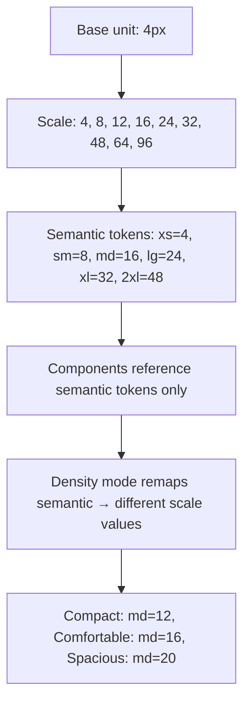

---
title: "Spacing System"
slug: spacing-system
---

### 1. Figma Workflow & Token Sync Pipeline
The spacing system is built on a strict **4px/8px grid system**. In Figma, these are mapped as Variables and applied directly to **Auto Layout** paddings, gap offsets, and fixed heights.

```
4px (xs) ── 8px (sm) ── 16px (md) ── 24px (lg) ── 32px (xl) ── 48px (2xl)
```

The system uses **logical properties** (`padding-inline`, `margin-block`) to ensure natural support for Right-to-Left (RTL) language layouts.

---

### 2. Token Definitions

#### CSS Custom Properties
```css
/* spacing.css */
:root {
  --spacing-xxs: 0.25rem; /* 4px */
  --spacing-xs: 0.5rem;   /* 8px */
  --spacing-sm: 0.75rem;  /* 12px */
  --spacing-md: 1rem;    /* 16px */
  --spacing-lg: 1.5rem;   /* 24px */
  --spacing-xl: 2rem;     /* 32px */
  --spacing-xxl: 3rem;    /* 48px */
}
```

#### Tailwind Configuration
```javascript
// tailwind.config.js
module.exports = {
  theme: {
    extend: {
      spacing: {
        xxs: "var(--spacing-xxs)",
        xs: "var(--spacing-xs)",
        sm: "var(--spacing-sm)",
        md: "var(--spacing-md)",
        lg: "var(--spacing-lg)",
        xl: "var(--spacing-xl)",
        xxl: "var(--spacing-xxl)",
      },
    },
  },
};
```

---

### 3. Accessibility Specifications (WCAG 2.1 AA)
- **Target Touch Size**: Under WCAG 2.1 Success Criterion 2.5.5 (and WCAG 2.2 Target Size), all interactive targets must have a size of at least **44x44px** (or **24x24px** if spacing around them guarantees safe zone spacing of 48px target-to-target).
- **Reflow and Spacing**: Ensure layout spacing uses relative units (`rem`, `em`) rather than hardcoded `px` to accommodate system font-scaling overrides.

---

### 4. React + TypeScript Implementation

```tsx
// Stack.tsx
import React from "react";

export type SpacingValue = "none" | "xxs" | "xs" | "sm" | "md" | "lg" | "xl" | "xxl";

export interface StackProps {
  direction?: "row" | "column";
  spacing?: SpacingValue;
  align?: "start" | "center" | "end" | "stretch";
  justify?: "start" | "center" | "end" | "between";
  wrap?: boolean;
  children: React.ReactNode;
  className?: string;
}

export const Stack: React.FC<StackProps> = ({
  direction = "column",
  spacing = "md",
  align = "stretch",
  justify = "start",
  wrap = false,
  children,
  className = "",
}) => {
  const directionMap = {
    row: "flex-row",
    column: "flex-col",
  };

  const spacingMap: Record<SpacingValue, string> = {
    none: "gap-0",
    xxs: "gap-xxs",
    xs: "gap-xs",
    sm: "gap-sm",
    md: "gap-md",
    lg: "gap-lg",
    xl: "gap-

## WHY

Before systematic spacing, every designer and developer picked padding and margin values from intuition — 7px here, 11px there, 20px somewhere else. Across a large product with 50 engineers, this produced hundreds of unique spacing values with no relationship to each other. Two cards sitting next to each other would have different internal padding even when they should look identical, because one engineer used `padding: 14px` and another used `padding: 16px`. The visual inconsistency was subtle but cumulative: the product felt "slightly off" without anyone being able to articulate why.

A systematic spacing scale solves this by defining a finite set of named values derived from a single base unit (typically 4px or 8px, matching most display pixel grids). Values on the scale — 4, 8, 12, 16, 24, 32, 48, 64px — are the only permitted spacing choices. The restricted vocabulary eliminates the one-off values that create visual noise, and the mathematical relationship between values (each is a multiple of the base) ensures visual harmony. In practice: changing the base unit remaps the entire product's spacing in one token edit.

The failure mode when spacing is unsystematic: design-to-development handoff becomes a negotiation — "the design says 14px but our existing cards use 16px, should I match the design or stay consistent?" These micro-decisions, made hundreds of times per week, are the source of the spacing entropy that makes large products feel visually incoherent. A spacing system makes the answer automatic: use the closest scale value.

Senior engineers and designers must understand: spacing tokens must be semantic (small/medium/large, not raw pixel values) so that global density changes (compact vs comfortable mode) are one mapping change, not a 500-component search-and-replace. The spacing scale is not optional decoration — it is the grid that keeps layouts coherent across every component and every page.

## THEORY

### The 4px Grid System

The standard is a 4px base unit because most screens have pixel densities that make 4px the smallest visually perceptible unit, and 4×n matches the natural rhythm of line heights (line-height of 20px = 5 units, 24px = 6 units). An 8px grid is an even more common choice — most layout spacing (padding, gaps, margins) is a multiple of 8.



### Internal Breakdown
1. **Base unit selection:** 4px aligns with pixel grids on HiDPI displays and produces whole numbers at common breakpoints.
2. **Scale generation:** Multiply base by a sequence (1, 2, 3, 4, 6, 8, 12, 16, 24) to produce the palette.
3. **Semantic mapping:** Name values by role — xs/sm/md/lg/xl — so scale can change without touching component code.
4. **Restriction enforcement:** Lint rules (stylelint-no-arbitrary-values, custom ESLint) fail PRs that use unlisted values.
5. **Density theming:** Map semantic names to different scale values per density mode (compact, comfortable, spacious).

### Scale Comparison
| Token | Compact | Comfortable | Spacious |
|-------|---------|-------------|---------|
| space-xs | 2px | 4px | 6px |
| space-sm | 4px | 8px | 12px |
| space-md | 8px | 16px | 24px |
| space-lg | 12px | 24px | 36px |
| space-xl | 16px | 32px | 48px |

### Common Misconception
Most developers think spacing tokens are just CSS variables for convenience. Actually, they are a density-switching mechanism: swapping the semantic→scale mapping changes the entire product's density without touching any component. Without semantic tokens, density modes require 500+ component changes.

### Edge Cases
- **Fractional spacing:** Never use 6px when your grid is 8px — it looks wrong because it breaks the grid.
- **Negative spacing:** Some scale systems include negative values (margin-top: -space-sm) for overlap patterns — document them explicitly.
- **Icon spacing:** Icon-to-text spacing (4px) feels different from card padding (16px) despite being the same token — context matters.

## VISUALIZATION_CONFIG
```json
{
  "steps": [
    {
      "title": "Spacing Scale",
      "description": "Consistent spacing based on 4px or 8px base unit.",
      "code": "// Spacing scale (4px base)\nconst spacing = {\n  0: '0',\n  1: '4px',\n  2: '8px',\n  3: '12px',\n  4: '16px',   // most common\n  5: '20px',\n  6: '24px',\n  8: '32px',\n  10: '40px',\n  12: '48px',\n  16: '64px',\n  20: '80px',\n  24: '96px',\n};\n\n// Rationale:\n// - Human eye perceives multiples of 4 as harmonic\n// - Snap to grid (design + code align)\n// - Fewer decisions = consistent UI",
      "highlight": [
        3,
        4,
        5,
        6,
        7,
        8,
        9,
        10,
        11,
        12,
        13,
        14,
        15,
        16,
        19,
        20,
        21,
        22
      ],
      "diagram": {
        "kind": "flow",
        "steps": [
          {
            "label": "4px or 8px base"
          },
          {
            "label": "Scale of multiples"
          },
          {
            "label": "Design + code align"
          },
          {
            "label": "Fewer decisions"
          },
          {
            "label": "Consistent UI"
          }
        ]
      }
    },
    {
      "title": "Layout Tokens",
      "description": "Padding, margin, gap use the same scale.",
      "code": "/* Component with tokens */\n.card {\n  padding: var(--space-6);        /* 24px */\n  margin-bottom: var(--space-4);  /* 16px */\n  gap: var(--space-3);            /* 12px */\n}\n\n.button {\n  padding: var(--space-2) var(--space-4); /* 8px 16px */\n}\n\n/* Grid gaps */\n.grid {\n  display: grid;\n  gap: var(--space-6);\n}\n\n/* Semantic spacing (optional layer) */\n:root {\n  --space-page: var(--space-6);     /* page padding */\n  --space-section: var(--space-12); /* between sections */\n  --space-tight: var(--space-2);    /* compact items */\n}",
      "highlight": [
        2,
        3,
        4,
        5,
        8,
        9,
        12,
        13,
        14,
        15,
        18,
        19,
        20,
        21,
        22
      ],
      "diagram": {
        "kind": "flow",
        "steps": [
          {
            "label": "CSS variables"
          },
          {
            "label": "padding/margin/gap"
          },
          {
            "label": "Semantic layer"
          },
          {
            "label": "Consistent rhythm"
          },
          {
            "label": "Predictable"
          }
        ]
      }
    },
    {
      "title": "Layout Patterns",
      "description": "Stack, Cluster, Grid, Sidebar — reusable layout primitives.",
      "code": "/* Stack: vertical spacing */\n.stack > * + * {\n  margin-top: var(--space-4);\n}\n\n/* Cluster: horizontal wrap with gap */\n.cluster {\n  display: flex;\n  flex-wrap: wrap;\n  gap: var(--space-3);\n}\n\n/* Sidebar: content + sidebar responsive */\n.sidebar-layout {\n  display: flex;\n  flex-wrap: wrap;\n  gap: var(--space-6);\n}\n.sidebar-layout > :first-child { flex-basis: 20rem; }\n.sidebar-layout > :last-child {\n  flex-basis: 0; flex-grow: 999; min-inline-size: 50%;\n}\n\n/* Center */\n.center {\n  max-inline-size: 65ch;\n  margin-inline: auto;\n  padding-inline: var(--space-4);\n}",
      "highlight": [
        1,
        2,
        3,
        4,
        6,
        7,
        8,
        9,
        10,
        11,
        13,
        14,
        15,
        16,
        17,
        18,
        19,
        20,
        21,
        22,
        24,
        25,
        26,
        27,
        28,
        29
      ],
      "diagram": {
        "kind": "boxes",
        "items": [
          {
            "label": "Stack: vertical",
            "color": "#1e88e5"
          },
          {
            "label": "Cluster: horizontal",
            "color": "#43a047"
          },
          {
            "label": "Sidebar",
            "color": "#fb8c00"
          },
          {
            "label": "Center",
            "color": "#8e24aa"
          }
        ]
      }
    }
  ]
}
```

## CODE

### Level 1 — Beginner: CSS Custom Property Scale
```css
/* A minimal 4px-base spacing scale as CSS custom properties */
:root {
  --space-1:  4px;   /* xs — icon padding, tight gaps */
  --space-2:  8px;   /* sm — small component padding */
  --space-3:  12px;  /* intermediate */
  --space-4:  16px;  /* md — default component padding */
  --space-6:  24px;  /* lg — section spacing */
  --space-8:  32px;  /* xl — page section gaps */
  --space-12: 48px;  /* 2xl — major section breaks */
  --space-16: 64px;  /* 3xl — hero spacing */
}
```

### Level 2 — Intermediate: Semantic Token Layer
```css
/* Semantic layer — components always reference these, never raw scale */
:root {
  --spacing-component-xs:   var(--space-1);   /* 4px  — icon internal */
  --spacing-component-sm:   var(--space-2);   /* 8px  — tight component */
  --spacing-component-md:   var(--space-4);   /* 16px — standard padding */
  --spacing-component-lg:   var(--space-6);   /* 24px — spacious component */
  --spacing-layout-sm:      var(--space-6);   /* 24px — small layout gap */
  --spacing-layout-md:      var(--space-8);   /* 32px — standard layout */
  --spacing-layout-lg:      var(--space-12);  /* 48px — large layout gap */
}

/* Density override — compact mode */
[data-density="compact"] {
  --spacing-component-md: var(--space-3);  /* 12px instead of 16px */
  --spacing-component-lg: var(--space-4);  /* 16px instead of 24px */
}
```

### Level 3 — Advanced: TypeScript Token Map + Tailwind Config
```ts
// tokens/spacing.ts — Single source, generates Tailwind + CSS
export const spacingPalette = {
  '1': '0.25rem',  // 4px
  '2': '0.5rem',   // 8px
  '3': '0.75rem',  // 12px
  '4': '1rem',     // 16px
  '6': '1.5rem',   // 24px
  '8': '2rem',     // 32px
  '12': '3rem',    // 48px
  '16': '4rem',    // 64px
} as const;

export const spacingSemantic = {
  'component-xs': 'var(--space-1)',
  'component-sm': 'var(--space-2)',
  'component-md': 'var(--space-4)',
  'component-lg': 'var(--space-6)',
  'layout-sm':    'var(--space-6)',
  'layout-md':    'var(--space-8)',
  'layout-lg':    'var(--space-12)',
} satisfies Record<string, string>;

// tailwind.config.ts
import { spacingPalette } from './tokens/spacing';
export default { theme: { extend: { spacing: spacingPalette } } };
```

### Level 4 — Expert: Spacing Lint Rule + Density System
```ts
// scripts/lint-spacing.ts — ESLint rule that forbids arbitrary spacing values
// Integrates with custom ESLint plugin for the design system

import { Rule } from 'eslint';

const VALID_SCALE = new Set([4,8,12,16,24,32,48,64,96]);

const lintRule: Rule.RuleModule = {
  meta: { type: 'problem', messages: {
    arbitrary: 'Use spacing token instead of arbitrary {{value}}px. Closest: var(--space-{{closest}})'
  }},
  create(context) {
    return {
      Property(node) {
        const spacingProps = ['padding','margin','gap','top','bottom','left','right'];
        if (!spacingProps.some(p => node.key.value?.includes(p))) return;
        const val = node.value.value;
        if (typeof val === 'number' && !VALID_SCALE.has(val)) {
          const closest = [...VALID_SCALE].reduce((a,b) => Math.abs(b-val)<Math.abs(a-val)?b:a);
          context.report({ node, messageId: 'arbitrary', data: { value: val, closest } });
        }
      }
    };
  }
};

export default lintRule;

// Usage: catches padding: 14 and suggests padding: 16 (--space-4)
```

## REAL_WORLD

### How GitHub Primer Enforces Spacing

GitHub's Primer design system (serving GitHub.com and GitHub Enterprise) uses an 8px base grid with 5 semantic sizes (compact, normal, spacious) mapped to Primer's `spacing` tokens. Their insight: every developer who uses `margin: 10px` is making a unilateral design decision — the spacing system removes that decision by making token use the path of least resistance.

```css
/* Primer pattern — Tailwind-compatible spacing tokens */
/* Components use these class-based tokens, never arbitrary values */
.card { padding: var(--base-size-16); }                  /* 16px */
.card + .card { margin-top: var(--base-size-24); }       /* 24px */
.card__header { padding-bottom: var(--base-size-8); }    /* 8px  */

/* Primer scale maps */
:root {
  --base-size-4:  4px;
  --base-size-8:  8px;
  --base-size-12: 12px;
  --base-size-16: 16px;
  --base-size-24: 24px;
  --base-size-32: 32px;
  --base-size-40: 40px;
  --base-size-48: 48px;
}
```

### Production Gotcha: Off-Grid Spacing
```css
/* ❌ 14px breaks the 4px grid — causes pixel rounding on some screens */
.dialog { padding: 14px; }

/* ✅ Nearest grid value */
.dialog { padding: var(--base-size-16); } /* or var(--base-size-12) */
```
**Why it happens:** Designers specify off-grid values from Figma when not constrained to the grid. A spacing lint rule catches these before merge.

| Token | Value | Use |
|-------|-------|-----|
| space-xs | 4px | Icon padding |
| space-sm | 8px | Small components |
| space-md | 16px | Standard padding |
| space-lg | 24px | Sections |
| space-xl | 32px | Layout gaps |

## INTERVIEW

**Q1 (Junior): Why is a 4px (or 8px) base unit the industry standard for spacing scales?**
A: 4px divides evenly into the smallest perceptible visual unit on most displays and aligns with typical line heights (20px = 5 units, 24px = 6 units). 8px is more common for layout spacing because UI elements naturally come in multiples of 8 — icon sizes (16, 24, 32), common container widths, and touch targets (44px minimum) are all multiples of 8. Using multiples of 4/8 ensures spacing always sits on the pixel grid, preventing anti-aliasing blur on sub-pixel values.

**Q2 (Junior): What is the difference between palette spacing tokens and semantic spacing tokens?**
A: Palette tokens are raw scale values: `space-4 = 4px`, `space-8 = 8px`. Semantic tokens assign meaning: `spacing-component-sm = var(--space-2)`, `spacing-layout-lg = var(--space-12)`. Components use semantic tokens. Themes and density modes remap semantic tokens to different palette values. Without the semantic layer, "compact mode" requires changing every component; with it, compact mode is a mapping change in one file.

**Q3 (Mid): How does a spacing system enable density modes (compact/comfortable/spacious)?**
A: Density modes remap semantic spacing tokens to different palette values. Comfortable mode: `spacing-component-md = 16px`. Compact: `spacing-component-md = 12px`. Spacious: `spacing-component-md = 24px`. Implementing via CSS custom property overrides on a `[data-density]` attribute means every component inheriting `var(--spacing-component-md)` responds automatically. This is why systematic spacing is a prerequisite for density switching.

**Q4 (Mid): How do you enforce the spacing scale and prevent arbitrary values?**
A: Three layers of enforcement: (1) Tailwind config with only scale values in `theme.spacing` — arbitrary Tailwind classes like `p-[14px]` won't generate CSS. (2) Stylelint with `stylelint-no-arbitrary-values` plugin flagging raw pixel values in CSS. (3) Custom ESLint rule for inline styles. The lint rules fail PRs before merge, making the scale the path of least resistance rather than a guideline that gets ignored.

**Q5 (Senior): How does spacing interact with responsive design at scale?**
A: Responsive spacing should be systematic too — spacing shrinks on mobile. The clean pattern: fluid spacing with `clamp()` — `var(--spacing-layout-md) = clamp(16px, 4vw, 32px)`. Or: define separate mobile/desktop scale values per semantic token with CSS media queries. Avoid component-level breakpoint overrides for spacing — that's 500 places to update. Keep responsive spacing in the token layer.

## FEYNMAN CHECK

### Explain Spacing Systems Like I'm 10 Years Old
> A spacing system is a ruler that only has certain notch marks: 4, 8, 16, 24, 32. When you're arranging elements on a page, you must snap to a notch — no in-betweens. This keeps everything aligned and rhythmic, the same way graph paper keeps drawings tidy. The non-obvious part: the notches have names (xs, sm, md) not numbers, so when the product needs a "denser" layout, you just change what number each name points to — the whole page re-spaces without touching any component. This is why "just use 14px there" creates spacing debt.

---

### 5 Deep Questions
**Q1: Why must spacing tokens be semantic (not numeric) for density switching to work?**
> **A:** If components reference `space-4` (raw number), changing density means finding every `space-4` usage that means "component padding" and changing it — which is indistinguishable from "icon gap" which should not change. Semantic names (`component-padding-md`) are specific to their use, so density remaps only the relevant semantics.

**Q2: ONE model.**
> **A:** "Palette = the ruler with notches. Semantic = names for each notch. Components snap to semantic names. Density remaps semantic → different notch."

**Q3: Misconception with code.**
> **A:** Using pixel math instead of tokens:
> ```css
> /* ❌ 14px — off grid, immune to density changes */
> .card { padding: 14px; }
> /* ✅ On grid, density-aware */
> .card { padding: var(--spacing-component-md); }
> ```

**Q4: How does spacing interact with the type scale?**
> **A:** Line height and spacing use the same base unit. A paragraph with `line-height: 24px` (6 units of 4px) followed by `margin-bottom: 16px` (4 units) produces consistent vertical rhythm. If spacing breaks the grid, the text rhythm breaks too — text and layout sit on different grids and the page feels subtly wrong.

**Q5: Senior one-liner.**
> **A:** "A spacing system is a finite scale of mathematically related values assigned to semantic names — which makes density switching O(1 mapping change) instead of O(n component edits)."

## BUILD

### 🏗️ Mini Project: Spacing Scale + Density Switcher

**What you will build:** A CSS token-based spacing system with three density modes (compact/comfortable/spacious) that switch without any component changes.
**Time estimate:** 30 minutes

---

#### Step 1 — Setup
```bash
mkdir spacing-system && cd spacing-system
npx create-next-app@latest . --typescript --tailwind --no-src-dir --app
touch app/spacing.css components/Card.tsx
```

#### Step 2 — Core Tokens
```css
/* app/spacing.css */
:root {
  /* Palette */
  --space-1: 0.25rem; --space-2: 0.5rem; --space-3: 0.75rem;
  --space-4: 1rem;    --space-6: 1.5rem; --space-8: 2rem;
  /* Semantic — comfortable defaults */
  --spacing-component-xs: var(--space-1);
  --spacing-component-sm: var(--space-2);
  --spacing-component-md: var(--space-4);
  --spacing-component-lg: var(--space-6);
  --spacing-layout-md:    var(--space-8);
}
[data-density="compact"] {
  --spacing-component-md: var(--space-3);
  --spacing-component-lg: var(--space-4);
  --spacing-layout-md:    var(--space-6);
}
[data-density="spacious"] {
  --spacing-component-md: var(--space-6);
  --spacing-component-lg: var(--space-8);
  --spacing-layout-md:    calc(var(--space-8) * 1.5);
}
```

#### Step 3 — Card Component (uses tokens only)
```tsx
export function Card({ title, body }: { title: string; body: string }) {
  return (
    <div style={{ padding: 'var(--spacing-component-md)', gap: 'var(--spacing-component-sm)', display:'flex', flexDirection:'column', border:'1px solid #e5e7eb', borderRadius:'8px' }}>
      <h3 style={{ margin: 0, fontSize: '1rem', fontWeight: 600 }}>{title}</h3>
      <p style={{ margin: 0 }}>{body}</p>
    </div>
  );
}
```

#### Step 4 — Density Switcher
```tsx
export function DensitySwitcher() {
  return (
    <div style={{ display:'flex', gap:'var(--spacing-component-sm)' }}>
      {(['compact','comfortable','spacious'] as const).map(d => (
        <button key={d} onClick={() => document.documentElement.dataset.density = d}>{d}</button>
      ))}
    </div>
  );
}
```

#### Step 5 — Tests
```tsx
test('compact density reduces spacing token values', () => {
  document.documentElement.dataset.density = 'compact';
  const styles = getComputedStyle(document.documentElement);
  expect(styles.getPropertyValue('--spacing-component-md').trim()).toBe('var(--space-3)');
});
```

**Expected Output:**
```
Clicking "compact" instantly reduces all card padding — zero component code changes.
```

**Stretch Challenges:**
- [ ] Add a lint rule that forbids inline `padding` with raw pixel values in TSX files
- [ ] Generate Tailwind spacing config from the token file automatically
- [ ] Add a "screen density" mode that responds to `prefers-reduced-data`

## SPACED REVIEW

### Day 1 — Recall

**Q1:** What is the standard base unit for a spacing scale? Why 4px or 8px specifically?

**Q2:** What is the difference between palette spacing tokens and semantic spacing tokens? What breaks if you only have palette tokens?

**Q3:** Write a 10-line CSS custom property spacing scale with 7 values.

---

### Day 3 — Comprehension

**Q4:** How do density modes (compact/comfortable/spacious) work with a semantic token system? What would change without semantic tokens?

**Q5:** Show the off-grid spacing bug and the token-based fix.

**Q6:** Refactor this CSS to use semantic spacing tokens:
```css
.card { padding: 14px; margin-bottom: 22px; gap: 6px; }
```

---

### Day 7 — Application

**Q7:** Build a spacing scale generator in Node.js: given a base unit and a sequence, output CSS custom properties for palette and semantic layers.

**Q8:** A PR adds `padding: 14px` to 30 components. Describe the visual impact and the lint rule that would have caught it.

**Q9:** How does spacing rhythm interact with the typography system's line heights?

---

### Day 14 — Synthesis & Interview Prep

**Q10:** ★ "Design a spacing system that supports compact and spacious density modes without changing any component code."

**Q11:** Link spacing-system → design-tokens → density-modes → responsive-design.

**Q12:** ★ "A product redesign changes the base spacing unit from 4px to 8px. With a systematic token approach, how many files change? Without tokens?"
