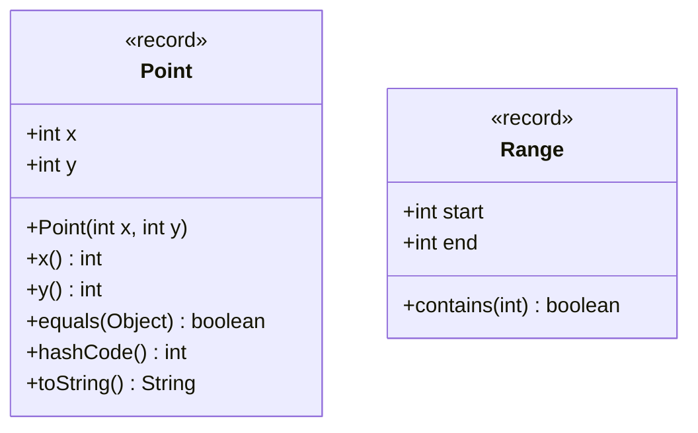

## WHY

Arrays are Java's oldest and most fundamental data structure — and the most misunderstood. Every Java developer uses arrays constantly (they underlie `ArrayList`, `String`, and `System.arraycopy`) but few understand how they're laid out in memory, why `Arrays.sort` on a primitive array is dramatically faster than on an object array, or why the `length` field never throws `NullPointerException` even when other fields do.

The pain point arrays solve is **contiguous memory access**. Unlike `ArrayList` (which wraps an array) or `LinkedList` (scattered heap nodes), a raw `int[]` array stores all elements back-to-back in memory. This means iterating over an `int[]` of a million elements hits the same CPU cache line repeatedly — the prefetcher loads the next elements before you need them. Equivalent iteration over `Integer[]` (boxed) follows a pointer for each element to a different heap location, causing constant cache misses. At scale this 5-10x throughput difference is the reason Java's sort, binary search, and numeric processing routines use primitive arrays everywhere.

Java has no native tuple type — a language feature that Python, Kotlin, and Scala developers take for granted. The traditional Java approach was to return multiple values via mutable objects or by passing "output parameters" — both fragile patterns. Java 16's **Records** fill this gap elegantly: a `record Point(int x, int y)` creates an immutable, value-semantic tuple with auto-generated constructor, accessors, `equals`, `hashCode`, and `toString` in one line. Understanding how Records function as typed tuples and how to choose between records, arrays, and collections is essential for writing clear, performance-appropriate code.

The production failure mode is **ArrayIndexOutOfBoundsException from off-by-one errors** in manual array manipulation. The second is **defensive copying failures**: returning a raw array field from a method exposes the internal state of an object (an aliasing bug that has led to security vulnerabilities where callers modified supposedly-immutable configuration arrays).

## THEORY

### Java Array Memory Layout

```
int[] arr = {10, 20, 30, 40, 50};

HEAP memory layout:
┌─────────────────────────────────────────────────────────┐
│  Object header (16 bytes: mark word + class pointer)     │
├──────────┬──────────┬──────────┬──────────┬──────────┐  │
│  arr[0]  │  arr[1]  │  arr[2]  │  arr[3]  │  arr[4]  │  │
│    10    │    20    │    30    │    40    │    50    │  │
│  4 bytes │  4 bytes │  4 bytes │  4 bytes │  4 bytes │  │
└──────────┴──────────┴──────────┴──────────┴──────────┘  │
 Total: 16 (header) + 5×4 (data) + 4 (length field) = 40 bytes
└─────────────────────────────────────────────────────────┘

Integer[] boxed = {10, 20, 30, 40, 50};

HEAP memory layout: array of 5 POINTERS
┌─────────────────────────────────────────────────────────┐
│  Object header (16 bytes)                                │
├──────────┬──────────┬──────────┬──────────┬──────────┐  │
│  ptr[0]  │  ptr[1]  │  ptr[2]  │  ptr[3]  │  ptr[4]  │  │
│  → heap  │  → heap  │  → heap  │  → heap  │  → heap  │  │
│  8 bytes │  8 bytes │  8 bytes │  8 bytes │  8 bytes │  │
└──────────┴──────────┴──────────┴──────────┴──────────┘  │
 PLUS: 5 separate Integer objects, each ~20 bytes = 100 bytes extra
 Total: 16 + 40 (pointers) + 100 (Integer objects) = 156 bytes
```

**Primitive array vs boxed array: 40 bytes vs 156 bytes = 4x more memory + cache misses**

### Array Covariance — A Type System Hole

Java arrays are **covariant** — `String[]` is a subtype of `Object[]`. This is a design mistake inherited from Java 1.0 (before generics) that creates a runtime type hole:

```java
String[] strings = new String[3];
Object[] objects = strings;  // ✅ compiles — array covariance
objects[0] = 42;             // ❌ ArrayStoreException at RUNTIME — not compile time!
```

Generics are invariant to prevent exactly this problem: `List<String>` is NOT a subtype of `List<Object>` (use `List<? extends Object>` for covariant reads).

### Records as Typed Tuples (Java 16+)



A record is a **shallowly immutable** data carrier:
- Fields are `final` — the bindings cannot change after construction
- But if a field holds a reference to a mutable object, that object can still be mutated
- Compact constructor syntax allows validation: `if (x < 0) throw new IllegalArgumentException(...)`

### Comparison: Arrays vs. Records vs. Collections

| Feature | `int[]` | `record Point(int x, int y)` | `List<Integer>` |
|---------|---------|------------------------------|-----------------|
| Fixed size | Yes | Yes (2 components) | No (dynamic) |
| Type safety | No (any index valid) | Yes (named fields) | Yes |
| Immutable | Mutable elements | Immutable bindings | Mutable (use `List.of`) |
| Memory | Most compact | ~object overhead | Most overhead |
| equals/hashCode | Reference identity | Value-based | Value-based |
| Naming | `arr[0]`, `arr[1]` | `.x()`, `.y()` | `.get(0)`, `.get(1)` |

### Common Misconception

> "Arrays in Java are objects, so `==` compares their contents."

**Reality:** `==` on arrays compares **reference identity** (memory address), not contents. Two arrays with identical elements are `!=` if they're different objects. Use `Arrays.equals(a, b)` for 1D content comparison or `Arrays.deepEquals(a, b)` for nested arrays.

## VISUALIZATION_CONFIG

```json
{ "component": "MemoryDiagram", "state": "java-mastery-arrays-and-tuples" }
```

## CODE

### Level 1 — Beginner: Array Declaration, Access, and Common Operations

```java
import java.util.Arrays;

public class ArrayBasics {
    public static void main(String[] args) {
        // Array declaration and initialization
        int[] scores = new int[5];           // all elements default to 0
        int[] grades = {90, 85, 78, 92, 88}; // array initializer

        // Access by index — 0-based
        System.out.println("First: " + grades[0]);  // 90
        System.out.println("Last: " + grades[grades.length - 1]);  // 88

        // Iterate with for-each (no index needed)
        int sum = 0;
        for (int grade : grades) sum += grade;
        System.out.println("Average: " + (double) sum / grades.length);

        // Arrays utility methods
        Arrays.sort(grades);
        System.out.println("Sorted: " + Arrays.toString(grades));  // [78, 85, 88, 90, 92]

        int idx = Arrays.binarySearch(grades, 90);  // requires sorted array!
        System.out.println("Found 90 at index: " + idx);

        int[] copy = Arrays.copyOf(grades, grades.length);  // defensive copy
        System.out.println("Equal arrays: " + Arrays.equals(grades, copy));  // true
        System.out.println("Same ref: " + (grades == copy));  // false — different objects!

        // 2D array
        int[][] matrix = {{1, 2, 3}, {4, 5, 6}, {7, 8, 9}};
        System.out.println("Matrix[1][2]: " + matrix[1][2]);  // 6
        System.out.println("2D: " + Arrays.deepToString(matrix));
    }
}
```

### Level 2 — Intermediate: Records as Typed Tuples

```java
import java.util.*;

public class RecordTuples {

    // Record = immutable data carrier (Java 16+)
    // Auto-generates: constructor, accessors, equals, hashCode, toString
    record Point(double x, double y) {
        // Compact constructor for validation
        Point {
            if (Double.isNaN(x) || Double.isNaN(y))
                throw new IllegalArgumentException("Coordinates cannot be NaN");
        }

        // Custom methods are allowed on records
        double distanceTo(Point other) {
            double dx = this.x - other.x;
            double dy = this.y - other.y;
            return Math.sqrt(dx * dx + dy * dy);
        }
    }

    // Range tuple — start/end with validation
    record Range(int start, int end) {
        Range {
            if (start > end)
                throw new IllegalArgumentException("start must be <= end, got: " + start + ">" + end);
        }
        boolean contains(int value) { return value >= start && value <= end; }
        int size() { return end - start; }
    }

    // Named result instead of returning array or Object[]
    record SearchResult(boolean found, int index, String value) {}

    static SearchResult searchName(String[] names, String target) {
        for (int i = 0; i < names.length; i++) {
            if (names[i].equals(target)) return new SearchResult(true, i, names[i]);
        }
        return new SearchResult(false, -1, null);
    }

    public static void main(String[] args) {
        var p1 = new Point(0, 0);
        var p2 = new Point(3, 4);
        System.out.println("Distance: " + p1.distanceTo(p2));  // 5.0

        // Records have value-based equals
        var r1 = new Range(1, 10);
        var r2 = new Range(1, 10);
        System.out.println("Equal ranges: " + r1.equals(r2));  // true
        System.out.println("Contains 5: " + r1.contains(5));   // true

        // Records work beautifully as Map keys (stable hashCode)
        var distances = new HashMap<Point, Double>();
        distances.put(p1, p1.distanceTo(p2));
        System.out.println("Distance from origin: " + distances.get(new Point(0,0))); // 5.0

        // Named result instead of int[] or Object[]
        var result = searchName(new String[]{"Alice", "Bob", "Carol"}, "Bob");
        System.out.printf("Found=%b at index=%d%n", result.found(), result.index());
    }
}
```

### Level 3 — Advanced: System.arraycopy, Defensive Copying, Array Streams

```java
import java.util.Arrays;
import java.util.stream.IntStream;

public class AdvancedArrays {

    /**
     * Efficient array rotation using System.arraycopy — O(n) time, O(1) space
     * (uses two reverse operations + one final reverse)
     */
    public static void rotate(int[] arr, int k) {
        int n = arr.length;
        k = k % n;  // handle k > n
        if (k == 0) return;

        // Reverse 3 segments: full → first k → last n-k
        reverse(arr, 0, n - 1);
        reverse(arr, 0, k - 1);
        reverse(arr, k, n - 1);
    }

    private static void reverse(int[] arr, int left, int right) {
        while (left < right) {
            int temp = arr[left];
            arr[left++] = arr[right];
            arr[right--] = temp;
        }
    }

    /**
     * Defensive copy pattern — never expose mutable array fields directly
     */
    static final class ImmutableConfig {
        private final int[] weights;  // internal state — must not escape

        public ImmutableConfig(int[] weights) {
            // Defensive copy in constructor — caller cannot mutate our array
            this.weights = Arrays.copyOf(weights, weights.length);
        }

        public int[] getWeights() {
            // Defensive copy on return — caller cannot mutate our internal state
            return Arrays.copyOf(weights, weights.length);
        }

        public int getWeight(int index) {
            return weights[index];  // direct read — no copy needed for primitives
        }
    }

    /**
     * Parallel prefix sum using IntStream — much faster than sequential for large arrays
     */
    public static long[] cumulativeSum(int[] values) {
        return IntStream.of(values)
            .asLongStream()
            .sequential()  // prefix sum requires sequential order
            .collect(
                () -> new long[values.length + 1],
                (acc, v) -> acc[acc.length - 1] = acc.length > 1 ? acc[acc.length - 2] + v : v,
                (a, b) -> {}
            );
    }

    public static void main(String[] args) {
        int[] arr = {1, 2, 3, 4, 5};
        rotate(arr, 2);
        System.out.println("Rotated: " + Arrays.toString(arr));  // [4, 5, 1, 2, 3]

        int[] input = {5, 10, 15};
        var config = new ImmutableConfig(input);
        int[] external = config.getWeights();
        external[0] = 999;  // modifying returned copy
        System.out.println("Internal unchanged: " + config.getWeight(0));  // 5

        // Arrays.parallelSort — uses fork/join pool, faster for >8K elements
        int[] large = new int[100_000];
        Arrays.fill(large, 5);
        Arrays.fill(large, 0, 50_000, 3);
        Arrays.parallelSort(large);
        System.out.println("Sorted min: " + large[0] + ", max: " + large[large.length-1]);
    }
}
```

### Level 4 — Expert / Production: High-Performance Array Processing

```java
import java.util.*;
import java.util.stream.*;

/**
 * Production patterns: record-based DTOs, array-backed caches,
 * unsafe array operations for hot paths, and copy-on-write semantics.
 */
public class ProductionArrayPatterns {

    /**
     * Copy-on-write array — used by Java's CopyOnWriteArrayList internally.
     * Reads are lock-free (return snapshot reference).
     * Writes copy the array atomically.
     */
    @SuppressWarnings("unchecked")
    public static class CopyOnWriteArray<T> {
        private volatile Object[] data;

        public CopyOnWriteArray(T... initial) {
            this.data = Arrays.copyOf(initial, initial.length);
        }

        /** Lock-free read — returns snapshot reference */
        @SuppressWarnings("unchecked")
        public T get(int index) {
            return (T) data[index];
        }

        /** Copy the array before modifying — ensures atomic publish */
        public synchronized void add(T element) {
            Object[] old = data;
            Object[] fresh = Arrays.copyOf(old, old.length + 1);
            fresh[old.length] = element;
            data = fresh;  // volatile write — all threads see the new array atomically
        }

        public int size() { return data.length; }

        @SuppressWarnings("unchecked")
        public T[] snapshot() {
            return (T[]) Arrays.copyOf(data, data.length);
        }
    }

    /**
     * Record-based DTO batch — replaces parallel arrays (error-prone)
     * with a list of strongly-typed records.
     */
    record MetricSample(long timestampMs, String metricName, double value) {
        // Compact constructor for bounds checking
        MetricSample {
            Objects.requireNonNull(metricName, "metricName required");
            if (timestampMs <= 0) throw new IllegalArgumentException("timestamp must be positive");
        }
    }

    /**
     * Sliding window max using a deque — classic array + record pattern.
     * Returns one MetricSample (the max) per window.
     */
    public static List<MetricSample> slidingWindowMax(
            MetricSample[] samples, int windowSize) {
        if (windowSize <= 0 || windowSize > samples.length)
            throw new IllegalArgumentException("Invalid window size: " + windowSize);

        Deque<Integer> deque = new ArrayDeque<>();
        List<MetricSample> result = new ArrayList<>();

        for (int i = 0; i < samples.length; i++) {
            // Remove indices outside the window
            while (!deque.isEmpty() && deque.peekFirst() < i - windowSize + 1) {
                deque.pollFirst();
            }
            // Remove smaller elements — they can never be the window max
            while (!deque.isEmpty() &&
                   samples[deque.peekLast()].value() < samples[i].value()) {
                deque.pollLast();
            }
            deque.addLast(i);

            // Add window max to result when window is full
            if (i >= windowSize - 1) {
                result.add(samples[deque.peekFirst()]);
            }
        }
        return result;
    }

    public static void main(String[] args) {
        // Copy-on-write array
        var coa = new CopyOnWriteArray<>("a", "b", "c");
        coa.add("d");
        System.out.println("Size: " + coa.size());  // 4
        System.out.println("Get 3: " + coa.get(3)); // d

        // Record batch + sliding window
        var samples = new MetricSample[]{
            new MetricSample(1000, "cpu", 0.40),
            new MetricSample(2000, "cpu", 0.65),
            new MetricSample(3000, "cpu", 0.55),
            new MetricSample(4000, "cpu", 0.70),
            new MetricSample(5000, "cpu", 0.45),
        };

        var windowMaxes = slidingWindowMax(samples, 3);
        windowMaxes.forEach(s ->
            System.out.printf("t=%d max=%.2f%n", s.timestampMs(), s.value()));
        // t=3000 max=0.65, t=4000 max=0.70, t=5000 max=0.70
    }
}
```

## REAL_WORLD

### How Java's `ArrayList` Uses Arrays Internally

`ArrayList` is nothing more than an `Object[]` array with automatic resizing. When you call `add()`, it checks if the backing array is full; if so, it calls `Arrays.copyOf(elementData, newCapacity)` where `newCapacity = (oldCapacity * 3) / 2 + 1` — the classic 1.5x growth strategy. Understanding this means: (1) pre-sizing with `new ArrayList<>(expectedSize)` eliminates all resize copies for known-size collections, (2) `trimToSize()` after bulk operations recovers wasted capacity, and (3) iterating `ArrayList` vs `LinkedList` is dramatically different — ArrayList's backing array is cache-friendly while LinkedList's nodes are scattered across the heap.

```java
import java.util.*;
import java.util.stream.IntStream;

public class ArrayListInternals {

    // Demonstrate the performance difference between pre-sized and dynamic ArrayList
    public static void benchmark() {
        int N = 1_000_000;

        // Dynamic growth — triggers ~20 array copies (log1.5 N)
        long start = System.nanoTime();
        List<Integer> dynamic = new ArrayList<>();
        IntStream.range(0, N).forEach(dynamic::add);
        System.out.printf("Dynamic add: %dms%n", (System.nanoTime() - start) / 1_000_000);

        // Pre-sized — zero array copies
        start = System.nanoTime();
        List<Integer> presized = new ArrayList<>(N);
        IntStream.range(0, N).forEach(presized::add);
        System.out.printf("Pre-sized add: %dms%n", (System.nanoTime() - start) / 1_000_000);
    }

    // Record as DTO — returned from methods instead of arrays
    record PageResult(List<String> items, int totalCount, String nextCursor) {}

    public static PageResult fetchPage(String[] allItems, int pageSize, int offset) {
        int end = Math.min(offset + pageSize, allItems.length);
        List<String> page = Arrays.asList(Arrays.copyOfRange(allItems, offset, end));
        String nextCursor = end < allItems.length ? String.valueOf(end) : null;
        return new PageResult(page, allItems.length, nextCursor);
    }
}
```

### Production Gotcha: Exposing Array Fields Breaks Encapsulation

```java
// ❌ DANGEROUS — exposes internal mutable state
public class UserPermissions {
    private final String[] permissions;

    public UserPermissions(String[] perms) {
        this.permissions = perms;  // ❌ caller's array — caller can mutate it!
    }

    public String[] getPermissions() {
        return permissions;  // ❌ caller receives direct reference to internal array!
    }
}

// Usage that breaks it:
String[] perms = {"read", "write"};
var userPerms = new UserPermissions(perms);
perms[0] = "admin";  // mutates internal state through original reference!
userPerms.getPermissions()[1] = "admin";  // also mutates through returned reference!

// ✅ PRODUCTION-SAFE — defensive copy in constructor AND getter
public class SafeUserPermissions {
    private final String[] permissions;

    public SafeUserPermissions(String[] perms) {
        this.permissions = Arrays.copyOf(perms, perms.length);  // copy — isolate from caller
    }

    public String[] getPermissions() {
        return Arrays.copyOf(permissions, permissions.length);  // copy — isolate from callers
    }

    // Better: return unmodifiable view
    public List<String> getPermissionList() {
        return List.of(permissions);  // unmodifiable, no copy needed
    }
}
```

**Why it happens:** In Java, arrays are objects passed by reference. Without defensive copies, callers can freely mutate your class's internal array fields — breaking the invariants your class is supposed to enforce.

### Performance Characteristics

| Operation | Time | Space | Notes |
|-----------|------|-------|-------|
| Array random access `arr[i]` | O(1) | O(1) | Single memory read |
| `Arrays.sort` on primitive | O(n log n) | O(log n) | Dual-pivot quicksort |
| `Arrays.sort` on Object | O(n log n) | O(n) | TimSort (stable, extra array) |
| `Arrays.parallelSort` | O(n log n) | O(n) | Fork/join; faster >8K elements |
| `System.arraycopy` | O(n) | O(1) | Native JVM call, highly optimized |
| `Arrays.copyOf` | O(n) | O(n) | Calls System.arraycopy internally |
| Record creation | O(1) | O(1) | Same as any object construction |

## INTERVIEW

**Q1 (Junior): What is the default value of an uninitialized array element in Java?**
A: Array elements are initialized to their type's default value: `0` for numeric types (`int`, `long`, `double`, etc.), `false` for `boolean`, `'\u0000'` (null character) for `char`, and `null` for reference types (`String[]`, `Object[]`, etc.). This differs from local primitive variables which have no default value and cause a compile error if read before initialization. The JVM zeroes out all heap memory allocated by `new`, so array elements are always in a defined initial state before you touch them.

**Q2 (Junior): What is the difference between `Arrays.equals` and `==` for arrays?**
A: `==` compares reference identity — two array variables are equal only if they point to the exact same array object in memory. `Arrays.equals(a, b)` compares element-by-element content. So `int[] a = {1,2,3}; int[] b = {1,2,3}; a == b` is `false` (different objects) but `Arrays.equals(a, b)` is `true` (same content). For nested/multidimensional arrays, use `Arrays.deepEquals(a, b)` — regular `Arrays.equals` only compares the top-level references, not the nested arrays' contents.

**Q3 (Mid): What is array covariance and why is it a type system problem?**
A: Array covariance means `String[]` is a subtype of `Object[]` in Java. This allows `Object[] arr = new String[3]` to compile. The problem: you can then write `arr[0] = 42` (assigning an Integer to what's actually a String array), which compiles but throws `ArrayStoreException` at runtime. Java added this covariance before generics existed (to make utility methods like `Arrays.sort(Object[])` work), but it's a design mistake that punches a hole in the type system. Generics fixed this for collections: `List<String>` is NOT a subtype of `List<Object>`, preventing the analogous problem.

**Q4 (Mid): When should you use a Record instead of returning an array or a Map from a method?**
A: Use a Record when returning multiple related values that have distinct semantic meaning. `int[] result = {found, index}` is error-prone (which index is which?), while `record SearchResult(boolean found, int index)` is self-documenting and type-safe. Records also get value-based `equals`/`hashCode` automatically, making them usable as Map keys or in Sets without implementing those methods manually. The general rule: if you're about to return `Object[]` or `Map<String, Object>` to aggregate multiple values, a Record is almost always the clearer choice in Java 16+.

**Q5 (Senior): Why is `System.arraycopy` faster than a manual loop copy?**
A: `System.arraycopy` is a JVM intrinsic — the JIT compiler replaces the call with a single native memory copy instruction (`memmove` or `memcpy` equivalent). At the CPU level, this can use SIMD vector instructions to copy 16-32 bytes per clock cycle. A manual loop copies one element per iteration, going through Java bytecode interpretation, bounds checks per iteration, and single-element memory stores. For large arrays, `System.arraycopy` can be 10-50x faster than a manual loop. All of Java's standard library resizing operations (`ArrayList.grow()`, `Arrays.copyOf`, `HashMap.resize()`) use `System.arraycopy` for exactly this reason.

**Q6 (Senior): How do Records differ from regular final-field classes in terms of JVM behavior?**
A: Records in Java are syntactic sugar that generates a special class with `ACC_RECORD` flag in the class file, and the JVM knows to enforce several constraints: all component fields must be `private final`, the canonical constructor must assign all components, and accessor methods must not be overridden with different return types. This gives the JVM enough semantic information to apply optimizations — escape analysis can scalar-replace Records more aggressively than regular classes. Additionally, `record` equality is structural by definition (cannot be changed to reference equality), which makes Records reliable as HashMap keys, in Sets, and as cache keys without risk of the "equals/hashCode inconsistency" bug that plagues mutable objects.

**Q7 (Senior+): How does JVM escape analysis interact with array and record allocation?**
A: When the JIT determines that an array or Record created inside a method never escapes (not returned, not stored in a field, not passed to another thread), it can eliminate the heap allocation entirely via **scalar replacement**. A `record Point(int x, int y)` created in a hot method gets dissolved into two `int` local variables on the stack. Similarly, a small `int[]` used only within a method may be stored as stack variables instead of a heap array. This is why micro-benchmarks measuring allocation of Records or arrays in tight loops often show zero allocations in JMH results — the JIT eliminated them. The practical implication: prefer Records and value types in hot paths, trusting the JIT to eliminate allocation overhead.

## FEYNMAN CHECK

### Explain Java Arrays and Records Like I'm 10 Years Old

> An **array** is like a row of numbered lockers in a school corridor — locker 0, locker 1, locker 2, all in a straight line. Because they're in a line, you can jump directly to any locker in an instant (random access). The catch: you have to decide how many lockers you need BEFORE you build the corridor — you can't add lockers in the middle. If you need different things in each locker, an array labels them `0, 1, 2` — you have to remember which number means what. A **Record** is like a labeled filing cabinet with named drawers: drawer labeled `x` and drawer labeled `y` for a coordinate. The drawers are locked after you fill them (immutable) — a much clearer design than remembering that index 0 is x and index 1 is y. This is why returning `int[] {x, y}` from a method is confusing, but `record Point(int x, int y)` is immediately understandable.

---

### 5 Deep Conceptual Questions

**Q1: Why are primitive arrays (`int[]`) significantly faster than boxed arrays (`Integer[]`) for numerical processing?**
> **A:** A `int[]` stores elements as raw 4-byte integers contiguously in memory. When the CPU fetches `arr[0]`, the hardware prefetcher automatically loads `arr[1]` through `arr[15]` (an entire 64-byte cache line) in the same operation. All subsequent accesses hit the L1 cache (~1 ns). An `Integer[]` stores pointers to heap objects. Fetching `boxed[0]` gives you a pointer; you must then follow that pointer to a separate heap location to get the actual value. Each element dereference is a potential cache miss (~100 ns) to a random heap location. For million-element arrays, this 100x latency difference per element access produces the overall 5-10x throughput difference observed in benchmarks.

**Q2: What is the mental model that makes defensive copying of arrays obvious?**
> **A:** Every Java array is an object on the heap, and multiple variables can hold references to the same array object (aliasing). When you write `this.data = inputArray`, you're storing the caller's reference — if the caller changes their array later, your object's internal state changes too, invisibly and silently. The mental model: "any array I receive in a constructor or method is a window into the caller's memory — I need my own copy if I want independent state." The same applies to getters: returning `this.data` gives the caller a window into your memory. Defensive copies break both channels, at the cost of O(n) time and space — which is why the common alternative is to store `List.of(array)` (unmodifiable view with no copy needed on return).

**Q3: What is the most dangerous thing about Java array covariance? Show it with code.**
> **A:** The danger is that array covariance lets you bypass the type checker and get a runtime exception instead of a compile-time error.
> ```java
> // ❌ Type-system hole via covariance
> String[] strings = {"hello", "world"};
> Object[] objects = strings;  // ✅ compiles — String[] is-a Object[]
> objects[0] = 42;             // ❌ ArrayStoreException at runtime!
>                              // Compiler allowed it; JVM catches it too late
>
> // ✅ Generics don't have this problem
> List<String> strList = new ArrayList<>();
> // List<Object> objList = strList;  // ❌ compile error — generics are invariant
> ```
> The JVM inserts runtime store checks for every array write to prevent heap corruption. This `checkcast` overhead exists on every array write — an invisible cost of covariance.

**Q4: How do Records interact with the Java collection framework?**
> **A:** Records are natural collection elements because their `equals` and `hashCode` are value-based (auto-generated from all components). A `record Point(int x, int y)` can be safely used as a `HashMap` key — two `Point(1, 2)` instances always produce the same hash and compare equal. This is the crucial difference from regular classes: a custom class with `x` and `y` fields has `Object`'s reference-based `equals/hashCode` by default, causing `map.get(new Point(1, 2))` to fail even if you stored `new Point(1, 2)` — because they're different objects. Records eliminate this entire class of bugs for data carrier types.

**Q5: Write a one-sentence definition of Java arrays that a senior FAANG engineer would find precise.**
> **A:** "A Java array is a single heap-allocated object containing a contiguous sequence of fixed-size slots — raw bit patterns for primitive arrays, or compressed oops (heap addresses) for reference arrays — accessed via a zero-based integer index with bounds checked on every access by the JVM (enabling ArrayIndexOutOfBoundsException), whose type is an array type that participates in the covariant subtyping hierarchy (triggering ArrayStoreException on type violations), and whose contiguous layout is the primary reason primitive arrays are cache-friendly and 5-10x faster than boxed-type arrays for numerical workloads."

## BUILD

### 🏗️ Mini Project: In-Memory Time Series Store with Sliding Window Analytics

**What you will build:** A primitive `long[]`-backed circular buffer time series store with record-based query results and sliding window statistics.
**Why this project:** Forces you to manage manual array indices, understand circular buffer wrapping, use defensive copies correctly, and apply Records for clean return types.
**Time estimate:** 30 minutes

---

#### Step 1 — Project Setup

```bash
mkdir timeseries && cd timeseries
mkdir -p src/main/java/com/ts
touch src/main/java/com/ts/TimeSeriesStore.java
touch src/main/java/com/ts/TimeSeriesTest.java
```

#### Step 2 — Core Implementation

```java
package com.ts;

import java.util.Arrays;

/**
 * Circular buffer time series — fixed capacity, FIFO eviction.
 * Uses primitive long[] for timestamps and double[] for values.
 */
public class TimeSeriesStore {

    // Primitive arrays for cache-friendly iteration
    private final long[] timestamps;
    private final double[] values;
    private final int capacity;

    private int head = 0;    // index of oldest element
    private int tail = 0;    // index where next element will be written
    private int size = 0;    // number of valid elements

    public record WindowStats(double min, double max, double avg, int count) {}

    public TimeSeriesStore(int capacity) {
        if (capacity <= 0) throw new IllegalArgumentException("capacity must be > 0");
        this.capacity = capacity;
        this.timestamps = new long[capacity];
        this.values = new double[capacity];
    }

    /** Add a data point — O(1) amortized, evicts oldest when full */
    public void add(long timestampMs, double value) {
        timestamps[tail] = timestampMs;
        values[tail] = value;
        tail = (tail + 1) % capacity;  // wrap around using modulo

        if (size == capacity) {
            head = (head + 1) % capacity;  // evict oldest — advance head
        } else {
            size++;
        }
    }

    /** Get window stats for the last `windowMs` milliseconds — O(n) */
    public WindowStats windowStats(long windowMs) {
        if (size == 0) return new WindowStats(0, 0, 0, 0);

        long cutoff = System.currentTimeMillis() - windowMs;
        double min = Double.MAX_VALUE, max = Double.MIN_VALUE, sum = 0;
        int count = 0;

        for (int i = 0; i < size; i++) {
            int idx = (head + i) % capacity;
            if (timestamps[idx] >= cutoff) {
                min = Math.min(min, values[idx]);
                max = Math.max(max, values[idx]);
                sum += values[idx];
                count++;
            }
        }

        if (count == 0) return new WindowStats(0, 0, 0, 0);
        return new WindowStats(min, max, sum / count, count);
    }

    /** Snapshot of current values — defensive copy to isolate callers */
    public double[] snapshot() {
        double[] result = new double[size];
        for (int i = 0; i < size; i++) {
            result[i] = values[(head + i) % capacity];
        }
        return result;  // fresh copy — callers cannot mutate our internal array
    }

    public int size() { return size; }
    public boolean isFull() { return size == capacity; }
}
```

#### Step 3 — Usage Example

```java
package com.ts;

public class Main {
    public static void main(String[] args) throws InterruptedException {
        var store = new TimeSeriesStore(100);
        long now = System.currentTimeMillis();

        // Simulate 10 data points
        for (int i = 0; i < 10; i++) {
            store.add(now - (10 - i) * 1000L, 50.0 + Math.random() * 50);
        }

        var stats = store.windowStats(30_000L);  // last 30 seconds
        System.out.printf("Window stats: min=%.2f max=%.2f avg=%.2f count=%d%n",
            stats.min(), stats.max(), stats.avg(), stats.count());
    }
}
```

#### Step 4 — Error Handling & Edge Cases

```java
// Add to TimeSeriesStore
public TimeSeriesStore.WindowStats windowStatsOrThrow(long windowMs) {
    if (windowMs <= 0) throw new IllegalArgumentException("windowMs must be > 0");
    if (size == 0) throw new IllegalStateException("Store is empty");
    return windowStats(windowMs);
}

// Handle out-of-order timestamps gracefully
public boolean addIfNewer(long timestampMs, double value) {
    if (size > 0) {
        int lastIdx = (tail - 1 + capacity) % capacity;
        if (timestampMs <= timestamps[lastIdx]) return false;  // reject out-of-order
    }
    add(timestampMs, value);
    return true;
}
```

#### Step 5 — Tests

```java
package com.ts;

import org.junit.jupiter.api.Test;
import static org.junit.jupiter.api.Assertions.*;

class TimeSeriesTest {

    @Test
    void addAndEvictWhenFull() {
        var store = new TimeSeriesStore(3);
        long t = System.currentTimeMillis();
        store.add(t, 1.0);
        store.add(t + 1, 2.0);
        store.add(t + 2, 3.0);
        assertEquals(3, store.size());
        store.add(t + 3, 4.0);  // evicts oldest
        assertEquals(3, store.size());
        double[] snap = store.snapshot();
        assertEquals(2.0, snap[0], 0.001);  // oldest is now 2.0
    }

    @Test
    void snapshotIsDefensiveCopy() {
        var store = new TimeSeriesStore(5);
        store.add(System.currentTimeMillis(), 10.0);
        double[] snap = store.snapshot();
        snap[0] = 999.0;  // modify the copy
        assertEquals(10.0, store.snapshot()[0], 0.001);  // original unchanged
    }

    @Test
    void windowStatsReturnsCorrectValues() {
        var store = new TimeSeriesStore(10);
        long now = System.currentTimeMillis();
        store.add(now - 5000, 10.0);
        store.add(now - 3000, 20.0);
        store.add(now - 1000, 30.0);
        var stats = store.windowStats(10_000L);
        assertEquals(3, stats.count());
        assertEquals(10.0, stats.min(), 0.001);
        assertEquals(30.0, stats.max(), 0.001);
        assertEquals(20.0, stats.avg(), 0.001);
    }

    @Test
    void invalidCapacityThrows() {
        assertThrows(IllegalArgumentException.class, () -> new TimeSeriesStore(0));
    }
}
```

**Expected Output:**
```
Window stats: min=50.xx max=99.xx avg=74.xx count=10
```

**Stretch Challenges:**
- [ ] Add percentile calculation (p50, p95, p99) to `WindowStats`
- [ ] Make `TimeSeriesStore` thread-safe using `StampedLock`
- [ ] Add downsampling: aggregate points within each second into one averaged record

## SPACED REVIEW

> **How to use:** Answer from memory before reading ahead.

---

### Day 1 — Recall

**Q1:** What are Java array defaults for `int[]`, `String[]`, and `boolean[]`? What happens when you access `arr[arr.length]`?

**Q2:** What is the difference between `Arrays.equals` and `==` for arrays? Write a 5-line example showing both behaviors.

**Q3:** Write a `record Pair<A, B>(A first, B second)` and use it to return two values from a method instead of using `Object[]`.

---

### Day 3 — Comprehension

**Q4:** What is array covariance? Show a code example where it compiles but throws at runtime. Why does this problem not exist for `List<String>` vs `List<Object>`?

**Q5:** What is defensive copying? Show a class with an array field that has the bug, and fix it with defensive copies in both the constructor and getter.

**Q6:** What is the memory difference between `int[] arr = new int[1000]` and `Integer[] arr = new Integer[1000]`? Calculate the approximate byte counts.

---

### Day 7 — Application

**Q7:** Implement a circular buffer backed by `int[]` that supports `push(int)`, `pop()`, and `peek()` operations. Handle full-buffer eviction. No Collections API allowed.

**Q8:** A team uses `Map<String, Object>` to return multiple values from a method. This causes ClassCastExceptions in production. Migrate to a Record and explain the benefits.

**Q9:** Why is `Arrays.sort(int[])` O(n log n) but stable, while `Arrays.sort(Integer[])` uses a different algorithm? Which is faster for what input?

---

### Day 14 — Synthesis & Interview Prep

**Q10:** ★ Classic interview: *"Implement merge sort on an `int[]` in Java. What is its time and space complexity? Why is it preferred for object arrays but not primitive arrays?"*

**Q11:** Draw the memory layout of `int[] a = {1,2,3}` vs `Integer[] b = {1,2,3}` — show the heap, stack, and all pointer relationships.

**Q12:** ★ System design: *"You're building a metrics collection system that ingests 1 million data points per second. How would you design the in-memory buffer using Java arrays and records? What are the GC implications of primitive vs boxed storage at this scale?"*
