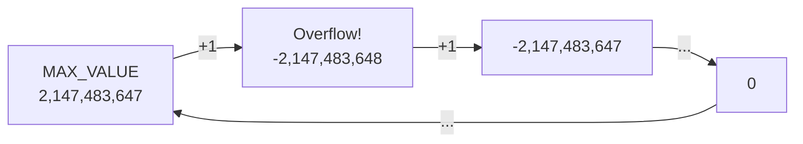

## WHY

Java's eight primitive types exist for one reason: **performance**. Before Java formalized primitives, every numeric operation in early object-oriented languages required heap allocation, pointer indirection, and garbage collection overhead. An integer addition that costs a single CPU cycle became a heap allocation + virtual dispatch + GC tracing chain. Java solved this by separating "values that fit in a register" (primitives) from "objects that live on the heap" (reference types). This single design decision makes Java numeric-intensive code (financial calculations, scientific computing, game physics) dramatically faster than equivalent Python or Ruby code.

The tricky part that trips up intermediate engineers is **autoboxing** — Java's automatic conversion between primitives and their wrapper counterparts (`int` ↔ `Integer`, `long` ↔ `Long`, etc.). This conversion is transparent at the source level but expensive at the bytecode level: each box conversion allocates a new heap object. In a tight loop processing millions of records, accidental autoboxing transforms an O(1)-space algorithm into one that generates gigabytes of heap garbage, triggering Stop-The-World GC pauses that can halt your application for hundreds of milliseconds.

The production failure mode is the **null unboxing NullPointerException**. Code like `int total = order.getQuantity()` compiles cleanly, but if `getQuantity()` returns `Integer` (nullable) and the value is `null`, the unboxing throws a NullPointerException at runtime. This exact bug has caused payment processing outages: a nullable `Integer` discount field returned `null` for unapplied discounts, and the unboxing to `int` for subtraction crashed the order total calculation. The stack trace is always cryptic because the NPE is thrown in the middle of an arithmetic expression.

Senior engineers must understand the exact sizes, ranges, and overflow behaviors of each primitive type to correctly design protocols, avoid silent integer overflow in financial arithmetic, and choose the right type for performance-sensitive data structures.

## THEORY

### The 8 Primitive Types

| Type | Size | Range | Default | Wrapper | Use When |
|------|------|-------|---------|---------|----------|
| `byte` | 8 bits | -128 to 127 | 0 | `Byte` | Binary data, network protocols |
| `short` | 16 bits | -32,768 to 32,767 | 0 | `Short` | Legacy file formats |
| `int` | 32 bits | -2,147,483,648 to 2,147,483,647 | 0 | `Integer` | General integers |
| `long` | 64 bits | -9.2×10¹⁸ to 9.2×10¹⁸ | 0L | `Long` | Timestamps, IDs, large counts |
| `float` | 32 bits | ~±3.4×10³⁸ (7 decimal digits) | 0.0f | `Float` | Rarely used in Java |
| `double` | 64 bits | ~±1.8×10³⁰⁸ (15 decimal digits) | 0.0 | `Double` | Floating-point calculations |
| `char` | 16 bits | '\u0000' to '\uffff' | '\u0000' | `Character` | Unicode characters (BMP only) |
| `boolean` | JVM-defined | true / false | false | `Boolean` | Flags, conditions |

### Memory Layout: Primitives vs. Wrapper Objects

```
STACK                          HEAP
┌─────────────────┐           ┌──────────────────────────────┐
│ int x = 42      │           │                              │
│ [00 00 00 2A]   │           │  Integer boxed = new Integer │
│  4 bytes        │           │  ┌──────────────────┐        │
│                 │           │  │ Object header    │ 16 bytes│
│ long y = 100L   │           │  │ (mark + class)   │        │
│ [00 00 00 00    │           │  ├──────────────────┤        │
│  00 00 00 64]   │           │  │ int value = 42   │  4 bytes│
│  8 bytes        │           │  └──────────────────┘        │
└─────────────────┘           │  Total: ~20 bytes            │
                              │  (vs 4 bytes for int!)        │
                              └──────────────────────────────┘
```

A boxed `Integer` costs **5x more memory** than a raw `int` due to the 16-byte object header. In a `List<Integer>` with 1 million elements, that's ~20 MB vs 4 MB — and every addition goes through autoboxing, creating millions of short-lived objects.

### Integer Overflow — Silent and Dangerous

Java integer arithmetic wraps around silently — there is no overflow exception:

```
int max = Integer.MAX_VALUE; // 2,147,483,647
int overflow = max + 1;      // -2,147,483,648 (wraps to MIN_VALUE!)
```



This is how the famous 2006 Java `Arrays.binarySearch()` bug worked: `int mid = (low + high) / 2` overflowed for large arrays. Fix: `int mid = low + (high - low) / 2`.

### Autoboxing Rules

The JVM caches `Integer` objects for values -128 to 127 (JVM spec §5.1.7). This creates a reference-equality trap:

```java
Integer a = 127;
Integer b = 127;
System.out.println(a == b);   // true (same cached object)

Integer c = 128;
Integer d = 128;
System.out.println(c == d);   // false (different heap objects!)
System.out.println(c.equals(d)); // true (value equality)
```

### Common Misconception

> "`float` and `double` are precise decimal types."

**Reality:** Both `float` and `double` are IEEE 754 binary floating-point types. They cannot exactly represent most decimal fractions. `0.1 + 0.2 != 0.3` in Java. For money calculations, always use `BigDecimal`, never `float` or `double`.

### Numeric Promotion Rules

Java automatically promotes smaller types in arithmetic expressions:
- `byte + byte` → `int` (both promoted to int before operation)
- `int + long` → `long` (int promoted to long)
- `long + float` → `float`
- `float + double` → `double`

## VISUALIZATION_CONFIG

```json
{ "component": "MemoryDiagram", "state": "java-mastery-basic-types" }
```

## CODE

### Level 1 — Beginner: Declaring and Using Each Primitive Type

```java
public class PrimitiveTypes {
    public static void main(String[] args) {
        // byte — for binary data, fits in 1 byte
        byte statusCode = 200;
        byte flags = 0b00001111;  // binary literal (Java 7+)

        // short — rarely used; mainly for legacy file format parsing
        short portNumber = 8080;

        // int — default integer type; use for most integer math
        int population = 1_000_000;  // underscore separators for readability

        // long — for values exceeding int range (timestamps, IDs)
        long unixTimestamp = 1_700_000_000L;  // L suffix required
        long nanoTime = System.nanoTime();

        // float — 32-bit; imprecise; avoid for new code
        float temperature = 36.6f;  // f suffix required

        // double — 64-bit; default for floating-point literals
        double preciseTemperature = 36.599999;

        // char — single Unicode BMP character (16-bit unsigned)
        char grade = 'A';
        char unicodePi = '\u03C0';  // π

        // boolean — only two values: true or false
        boolean isActive = true;

        // Type ranges and overflow
        System.out.println("int max: " + Integer.MAX_VALUE);    // 2147483647
        System.out.println("long max: " + Long.MAX_VALUE);      // 9223372036854775807
        System.out.println("int overflow: " + (Integer.MAX_VALUE + 1)); // -2147483648
    }
}
```

### Level 2 — Intermediate: Autoboxing, Integer Cache, and `BigDecimal` for Money

```java
import java.math.BigDecimal;
import java.math.RoundingMode;
import java.util.ArrayList;
import java.util.List;

public class AutoboxingAndPrecision {
    public static void main(String[] args) {
        // --- Autoboxing performance trap ---
        long start = System.nanoTime();
        Long sum = 0L;  // ❌ Long (wrapper) — autoboxes every iteration
        for (long i = 0; i < 1_000_000; i++) {
            sum += i;   // unbox Long, add long, box back to Long — ~1M allocations!
        }
        long boxedTime = System.nanoTime() - start;

        start = System.nanoTime();
        long primitiveSum = 0L;  // ✅ long (primitive) — zero allocations
        for (long i = 0; i < 1_000_000; i++) {
            primitiveSum += i;
        }
        long primitiveTime = System.nanoTime() - start;
        System.out.printf("Boxed: %dms, Primitive: %dms%n",
            boxedTime/1_000_000, primitiveTime/1_000_000);

        // --- Integer cache trap ---
        Integer a = 127, b = 127;
        Integer c = 128, d = 128;
        System.out.println("127 == 127: " + (a == b));   // true (cached)
        System.out.println("128 == 128: " + (c == d));   // false (new objects!)
        System.out.println("128 equals 128: " + c.equals(d)); // true (value)

        // --- Never use double for money ---
        double incorrectTotal = 0.1 + 0.2;
        System.out.println("0.1 + 0.2 = " + incorrectTotal); // 0.30000000000000004

        // ✅ Use BigDecimal for financial calculations
        BigDecimal price = new BigDecimal("0.10");  // String constructor — exact!
        BigDecimal tax = new BigDecimal("0.20");
        BigDecimal total = price.add(tax);
        System.out.println("BigDecimal: " + total); // 0.30 exactly
    }
}
```

### Level 3 — Advanced: Bit Manipulation, Overflow Detection, Type Casting

```java
public class AdvancedPrimitives {

    /** Safe integer multiplication — detects overflow before it happens */
    public static long safeMultiply(int a, int b) {
        long result = (long) a * (long) b;  // widen to long BEFORE multiply
        if (result > Integer.MAX_VALUE || result < Integer.MIN_VALUE) {
            throw new ArithmeticException(
                "Integer overflow: " + a + " * " + b + " = " + result);
        }
        return result;
    }

    /** Extract specific bits from a flags byte (common in protocol parsing) */
    public static void parseStatusFlags(byte flags) {
        boolean isError      = (flags & 0b00000001) != 0;  // bit 0
        boolean isRetryable  = (flags & 0b00000010) != 0;  // bit 1
        boolean requiresAuth = (flags & 0b00000100) != 0;  // bit 2
        int priority         = (flags >> 5) & 0b111;       // bits 5-7 (3 bits)
        System.out.printf("error=%b retry=%b auth=%b priority=%d%n",
            isError, isRetryable, requiresAuth, priority);
    }

    /** Narrowing conversions — data loss is SILENT */
    public static void narrowingDemo() {
        int bigValue = 300;
        byte narrowed = (byte) bigValue;  // explicit cast required
        System.out.println("300 narrowed to byte: " + narrowed);  // 44 — data lost!

        // Binary explanation: 300 = 100101100
        //                     byte takes last 8 bits: 00101100 = 44

        double pi = Math.PI;
        int truncated = (int) pi;    // truncation, not rounding: 3
        long truncLong = (long) pi;  // 3L
        System.out.printf("pi=%f truncated=%d%n", pi, truncated);
    }

    /** char arithmetic — chars are unsigned 16-bit integers */
    public static void charArithmetic() {
        char ch = 'A';
        int codePoint = ch;           // char → int widening: 65
        char next = (char)(ch + 1);   // 'B'
        char lower = (char)(ch + 32); // 'a' (lowercase via bit trick)
        System.out.printf("char=%c code=%d next=%c lower=%c%n",
            ch, codePoint, next, lower);
    }

    public static void main(String[] args) {
        System.out.println(safeMultiply(100_000, 100_000)); // 10000000000
        parseStatusFlags((byte) 0b10100101); // error=true retry=false auth=true priority=5
        narrowingDemo();
        charArithmetic();
    }
}
```

### Level 4 — Expert / Production: High-Performance Numeric Processing

```java
import java.math.BigDecimal;
import java.math.MathContext;
import java.math.RoundingMode;
import java.nio.ByteBuffer;
import java.util.Arrays;

/**
 * Production numeric patterns for financial systems and binary protocol parsing.
 *
 * Key techniques:
 * 1. BigDecimal with explicit scale for money arithmetic
 * 2. Math.addExact/multiplyExact for overflow detection
 * 3. ByteBuffer for efficient binary protocol parsing
 * 4. Bit manipulation for compact flag storage
 */
public class ProductionNumericPatterns {

    private static final int SCALE = 4;  // 4 decimal places for financial amounts
    private static final RoundingMode ROUNDING = RoundingMode.HALF_EVEN; // banker's rounding

    /**
     * Money arithmetic: always use BigDecimal with explicit scale.
     * HALF_EVEN (banker's rounding) is standard in financial systems
     * to avoid cumulative rounding bias over millions of transactions.
     */
    public static BigDecimal calculateTotal(BigDecimal[] lineItems, BigDecimal taxRate) {
        BigDecimal subtotal = Arrays.stream(lineItems)
                .reduce(BigDecimal.ZERO, BigDecimal::add);
        BigDecimal tax = subtotal.multiply(taxRate)
                .setScale(SCALE, ROUNDING);
        return subtotal.add(tax).setScale(SCALE, ROUNDING);
    }

    /**
     * Safe integer arithmetic with overflow detection (Java 8+).
     * Use in order quantity × unit price calculations.
     */
    public static long computeOrderValue(int quantity, int unitPriceCents) {
        // Math.multiplyExact throws ArithmeticException on overflow
        // instead of silently wrapping like raw * operator
        return Math.multiplyExact(quantity, unitPriceCents);
    }

    /**
     * Binary protocol parser using ByteBuffer and bit manipulation.
     * Pattern used in financial fix engines, MQTT, custom TCP protocols.
     */
    public record TradeMessage(long tradeId, int quantity, double price, byte flags) {}

    public static TradeMessage parseTradeMessage(byte[] bytes) {
        ByteBuffer buf = ByteBuffer.wrap(bytes);
        long tradeId    = buf.getLong();    // 8 bytes, big-endian by default
        int quantity    = buf.getInt();     // 4 bytes
        double price    = buf.getDouble();  // 8 bytes (IEEE 754 double)
        byte flags      = buf.get();        // 1 byte flag field
        return new TradeMessage(tradeId, quantity, price, flags);
    }

    /** Encode trade to binary wire format */
    public static byte[] encodeTradeMessage(TradeMessage msg) {
        ByteBuffer buf = ByteBuffer.allocate(8 + 4 + 8 + 1);
        buf.putLong(msg.tradeId());
        buf.putInt(msg.quantity());
        buf.putDouble(msg.price());
        buf.put(msg.flags());
        return buf.array();
    }

    /** Compact flag storage using bit fields — saves memory in large volumes */
    public static final class OrderFlags {
        private byte flags = 0;

        public void setUrgent(boolean v)    { flags = setBit(flags, 0, v); }
        public void setPartialFill(boolean v){ flags = setBit(flags, 1, v); }
        public void setAllOrNone(boolean v)  { flags = setBit(flags, 2, v); }

        public boolean isUrgent()     { return getBit(flags, 0); }
        public boolean isPartialFill(){ return getBit(flags, 1); }
        public boolean isAllOrNone()  { return getBit(flags, 2); }

        private static byte setBit(byte b, int pos, boolean val) {
            return val ? (byte)(b | (1 << pos)) : (byte)(b & ~(1 << pos));
        }
        private static boolean getBit(byte b, int pos) {
            return (b & (1 << pos)) != 0;
        }
    }

    public static void main(String[] args) {
        // Money calculation
        var items = new BigDecimal[]{
            new BigDecimal("10.99"),
            new BigDecimal("5.49"),
            new BigDecimal("2.50")
        };
        var total = calculateTotal(items, new BigDecimal("0.08"));
        System.out.println("Total with 8% tax: " + total); // 20.6352

        // Overflow-safe order value
        System.out.println("Order value: $" +
            computeOrderValue(1_000, 9999) / 100.0);  // $99.99

        // Binary protocol round-trip
        var msg = new TradeMessage(12345L, 500, 99.95, (byte)0b00000101);
        var encoded = encodeTradeMessage(msg);
        var decoded = parseTradeMessage(encoded);
        System.out.println("Decoded trade: " + decoded);
    }
}
```

## REAL_WORLD

### How Disruptor (LMAX) Uses Primitive Types for Ultra-Low Latency

LMAX's Disruptor library — used in the world's highest-frequency trading platforms processing 6 million orders/second — makes extreme use of Java primitives to achieve sub-microsecond latencies. The core ring buffer is backed by a `long[]` array (primitive, not `Long[]`), and sequence numbers are `long` primitives with `volatile` semantics. By avoiding any autoboxing in the critical path, Disruptor eliminates GC pauses entirely from the hot path. A single accidental `Long` wrapper in a 6M ops/sec ring buffer would generate 6 million objects per second — enough to trigger GC hundreds of times per minute.

```java
// Simplified Disruptor-style ring buffer using primitive long[]
// Production version: com.lmax.disruptor.RingBuffer
public class PrimitiveLongRingBuffer {

    // long[] — NOT Long[] — zero autoboxing in the hot path
    private final long[] buffer;
    private final int mask;  // power-of-2 size minus 1 for cheap modulo

    // volatile long — ensures sequence visibility across threads
    // Padded with 7 extra longs to prevent false sharing (cache line = 64 bytes)
    private volatile long sequence = -1L;
    @SuppressWarnings("unused")
    private long p1, p2, p3, p4, p5, p6, p7;  // cache line padding

    public PrimitiveLongRingBuffer(int size) {
        if (Integer.bitCount(size) != 1) throw new IllegalArgumentException("size must be power of 2");
        this.buffer = new long[size];
        this.mask = size - 1;  // e.g., size=1024 → mask=1023 → index & mask replaces index % size
    }

    /** Publish value — single producer, no synchronization needed */
    public void publish(long value) {
        long next = sequence + 1;
        buffer[(int)(next & mask)] = value;  // & mask is 10x faster than % size
        sequence = next;  // volatile write — consumers see this
    }

    /** Consume — read without blocking if data available */
    public long consume(long index) {
        if (index > sequence) throw new IllegalStateException("Not yet published");
        return buffer[(int)(index & mask)];
    }
}
```

### Production Gotcha: Silent Integer Overflow in Financial Arithmetic

```java
// ❌ DANGEROUS — silent overflow in high-volume financial systems
public class OrderService {
    // orderQuantity and unitPriceCents are both int
    // On Black Friday: 100,000 orders × $50,000 unit price = 5,000,000,000
    // Which overflows int (max 2,147,483,647) → negative total!
    public int calculateOrderTotal(int orderQuantity, int unitPriceCents) {
        return orderQuantity * unitPriceCents;  // ❌ can silently overflow!
    }
}

// ✅ PRODUCTION-SAFE — detect overflow before it causes silent data corruption
public class SafeOrderService {
    public long calculateOrderTotal(int orderQuantity, int unitPriceCents) {
        // Math.multiplyExact throws ArithmeticException — auditable, recoverable
        return Math.multiplyExact((long) orderQuantity, (long) unitPriceCents);
    }

    // Or for money: use BigDecimal for display, cents (long) internally
    public BigDecimal toDisplayPrice(long cents) {
        return BigDecimal.valueOf(cents, 2);  // moves decimal 2 places
    }
}
```

**Why it happens:** Java never throws on integer overflow — it wraps silently per the JLS. `Integer.MAX_VALUE + 1 = Integer.MIN_VALUE`. In financial systems, this produces negative balances, incorrect risk calculations, and audit failures. Use `Math.addExact`, `Math.multiplyExact`, or `long` arithmetic for anything that could overflow `int` range.

### Performance Characteristics

| Operation | Type | Cost | Notes |
|-----------|------|------|-------|
| `int` add | primitive | 1 CPU cycle | Register-resident after JIT |
| `Integer` add | boxed | ~50-200 ns | Heap alloc + unbox + box |
| `long` multiply | primitive | 3-5 cycles | Single `imulq` instruction |
| `BigDecimal` add | object | ~500-2000 ns | Object alloc + arbitrary precision |
| `double` compare | primitive | 1 cycle (NaN-safe) | Use `Double.compare` for NaN correctness |
| `long[]` read | primitive array | 1-4 cycles | Cache-line friendly |
| `Long[]` read | boxed array | 5-20 cycles | Pointer dereference per element |

## INTERVIEW

**Q1 (Junior): What are Java's 8 primitive types and what are their sizes?**
A: Java's 8 primitives are: `byte` (8-bit signed integer, -128 to 127), `short` (16-bit signed integer), `int` (32-bit signed integer, the default for integer literals), `long` (64-bit signed integer, needs `L` suffix on literals), `float` (32-bit IEEE 754 floating-point, needs `f` suffix), `double` (64-bit IEEE 754 floating-point, the default for decimal literals), `char` (16-bit unsigned Unicode code point, BMP only), and `boolean` (true/false, size is JVM-implementation-defined but typically 1 byte in arrays). Unlike objects, primitives are stored directly as bit patterns — no object header, no heap allocation, no garbage collection.

**Q2 (Junior): What is autoboxing and when does it cause problems?**
A: Autoboxing is the JVM's automatic conversion between primitive types and their corresponding wrapper classes (`int` ↔ `Integer`, `long` ↔ `Long`, etc.). It causes problems in performance-sensitive code: every autoboxing operation allocates a new heap object (unless the value is in the Integer cache range -128 to 127), which generates GC pressure. The classic trap is declaring a loop accumulator as `Long sum = 0L` instead of `long sum = 0L` — the loop performs one million box/unbox cycles, each allocating a new `Long` object. Another trap is comparing boxed integers with `==` instead of `.equals()`: two `Integer` objects with value 128 will compare `false` because they're different heap objects.

**Q3 (Mid): Why should you never use `float` or `double` for monetary values?**
A: `float` and `double` are IEEE 754 binary floating-point types — they represent numbers as fractions of powers of 2, not powers of 10. Most decimal fractions (like 0.1, 0.05, 0.01) cannot be exactly represented in binary floating-point, so they're stored as the nearest representable value. `0.1 + 0.2` in Java evaluates to `0.30000000000000004` — not exactly 0.3. For money, this tiny imprecision compounds: 1,000,000 transactions of $0.10 each might total $99,999.99 or $100,000.01 instead of $100,000.00 — a real audit failure. Always use `BigDecimal` with string-constructor initialization (`new BigDecimal("0.10")`) and explicit scale/rounding for all financial arithmetic.

**Q4 (Mid): What is the Integer cache and when does it produce surprising `==` results?**
A: The JVM specification requires that `Integer.valueOf(n)` returns a cached object for values in the range -128 to 127. When you use autoboxing (`Integer i = 42`), the JVM calls `Integer.valueOf(42)` which returns a cached instance. This means `Integer a = 100; Integer b = 100; a == b` is `true` because both `a` and `b` reference the same cached object. However, `Integer a = 200; Integer b = 200; a == b` is `false` because 200 is outside the cache range and each autoboxing creates a new heap object. The practical rule: always use `.equals()` to compare wrapper types; never use `==` unless you explicitly need reference identity.

**Q5 (Senior): How does Java handle integer overflow and what production risks does this create?**
A: Java integer arithmetic wraps silently on overflow with no exception — this is mandated by the Java Language Specification. `Integer.MAX_VALUE + 1 = Integer.MIN_VALUE`. This has caused real production incidents: payment systems computing `quantity * unitPrice` with `int * int` where the result exceeds 2 billion wrap to a negative number; progress counters that reach max value suddenly show negative progress; timestamps stored as `int` seconds wrapping around (the Year 2038 problem). The safe patterns are: use `Math.addExact`/`Math.multiplyExact` which throw `ArithmeticException` on overflow, promote operands to `long` before multiplication (`(long) a * b`), or use `BigInteger` for truly arbitrary-precision integers.

**Q6 (Senior): What is false sharing and how do primitives relate to it?**
A: False sharing occurs when two threads write to different variables that happen to live on the same CPU cache line (64 bytes on x86). Even though the threads aren't accessing the same variable, every write by thread A invalidates thread B's cache line, forcing a cache miss. Primitive fields in Java objects are laid out sequentially by the JVM, so two `long` fields (8 bytes each) fit in the same 64-byte cache line. High-performance libraries like LMAX Disruptor and `LongAdder` pad their hot fields with 7 extra `long` dummy fields to push each hot variable onto its own cache line, eliminating false sharing and recovering 3-10x throughput in contended scenarios.

**Q7 (Senior+): How does JVM JIT affect primitive performance?**
A: The HotSpot JIT compiler applies several optimizations for primitives: (1) **Scalar replacement** — primitive fields of objects that don't escape the method are stored in CPU registers instead of the heap; (2) **Loop unrolling** — primitive array loops are unrolled to process multiple elements per iteration; (3) **SIMD vectorization** — `float[]` and `double[]` operations can be compiled to SSE/AVX vector instructions processing 4-8 values simultaneously; (4) **Strength reduction** — expensive operations are replaced with cheaper ones (`x * 2` → `x << 1`). These optimizations apply only to primitives, not boxed types, which is why `int[]` sorting can be 100x faster than `Integer[]` sorting on large arrays.

## FEYNMAN CHECK

### Explain Java Primitive Types Like I'm 10 Years Old

> Think of Java's types like two kinds of storage boxes. **Primitive types** are like tiny labeled bags you carry in your pocket — if you have `int age = 25`, you're carrying the actual number 25 in a pocket-sized bag. Super fast to access, takes up almost no space. **Wrapper types** (like `Integer`) are like storing a note in a giant warehouse box that says "go look in building 7, shelf 3" — just to find the number. Autoboxing is when Java secretly swaps your pocket bag for a warehouse box, and you don't notice until you run out of warehouse space (memory) and a garbage truck has to come clean up millions of empty boxes. This is why a simple `Long sum = 0L` in a loop is 100x slower than `long sum = 0L` — you're creating a warehouse box every single iteration.

---

### 5 Deep Conceptual Questions

**Q1: Why can't Java floating-point types exactly represent most decimal fractions?**
> **A:** `float` and `double` use IEEE 754 binary floating-point format, which represents numbers as `significand × 2^exponent`. Just as 1/3 cannot be exactly represented in decimal (0.333...), most decimal fractions cannot be exactly represented in binary. The decimal number 0.1 in binary is 0.0001100110011001100... (infinitely repeating). When you write `double x = 0.1`, Java stores the nearest 64-bit binary approximation, which is approximately 0.1000000000000000055511151231257827021181583404541015625. This is why `0.1 + 0.2 != 0.3` and why every financial application must use `BigDecimal` with decimal arithmetic instead.

**Q2: What is the one mental model that makes autoboxing performance implications obvious?**
> **A:** Every autoboxing operation is secretly `new Integer(value)` — a heap allocation. So when you write `Long sum = 0L; sum += i`, Java is actually executing: `sum = Long.valueOf(sum.longValue() + i)` — which unboxes `sum` to a primitive `long`, adds `i`, then allocates a **new `Long` object** to hold the result, and discards the old `Long` object. In a loop running 1 million times, you've just allocated 1 million `Long` objects. The mental model: "every boxed arithmetic operation creates garbage." Once you think of it that way, using primitive accumulators becomes reflexive.

**Q3: What is the most dangerous misconception about `int` arithmetic? Show it with code.**
> **A:** The misconception: "if I don't see an exception, the arithmetic is correct." Java int overflow is completely silent.
> ```java
> // ❌ Silent overflow — no exception, no warning, just wrong answer
> int itemCount = 100_000;
> int unitCostCents = 100_000;  // $1000.00 per unit
> int totalCents = itemCount * unitCostCents;  // = 10,000,000,000 which overflows int!
> System.out.println("Total: $" + totalCents / 100.0);  // prints garbage negative number
>
> // ✅ Use Math.multiplyExact or promote to long first
> long safeTotal = Math.multiplyExact((long) itemCount, unitCostCents);
> System.out.println("Total: $" + safeTotal / 100.0);  // $1,000,000,000.00
> ```

**Q4: How do primitives interact with the JVM's garbage collector?**
> **A:** Primitive values themselves are NEVER garbage collected because they're not objects — they're just bit patterns stored directly on the stack (for local variables) or embedded inside object fields on the heap. The GC only tracks heap objects. When you use a wrapper type like `Integer`, the wrapper object IS subject to GC, but the int value embedded inside the wrapper is just 4 bytes of that object's layout — it goes away when the wrapper object is collected. This is why `int[]` (primitive array) requires one GC tracking entry for the array object, while `Integer[]` requires one GC tracking entry for the array PLUS one for each non-null element — making `int[]` dramatically better for GC throughput.

**Q5: Write a one-sentence definition of Java primitive types that a senior FAANG engineer would find precise.**
> **A:** "Java's 8 primitive types are fixed-size, value-semantic bit patterns — stored directly in stack frames or object field layouts without indirection — that bypass heap allocation, garbage collection, and virtual dispatch, and whose arithmetic semantics (two's complement wrap-around for integers, IEEE 754 for floats, size-promotion rules for mixed expressions) are mandated by the JLS, which is why silent integer overflow, floating-point imprecision, and autoboxing-induced allocation storms are the three most common production bugs stemming from primitive misuse."

## BUILD

### 🏗️ Mini Project: Binary Network Protocol Parser and Serializer

**What you will build:** A complete binary serializer/deserializer for a custom trade message protocol using `ByteBuffer`, bit manipulation, and all 8 primitive types.
**Why this project:** Forces you to confront exact byte sizes, endianness, narrowing conversions, and the difference between `char` Unicode encoding and raw `byte` values.
**Time estimate:** 30 minutes

---

#### Step 1 — Project Setup

```bash
mkdir protocol-parser && cd protocol-parser
mkdir -p src/main/java/com/trade
touch src/main/java/com/trade/TradeMessage.java
touch src/main/java/com/trade/ProtocolEncoder.java
touch src/main/java/com/trade/ProtocolDecoder.java
touch src/main/java/com/trade/ProtocolTest.java
```

#### Step 2 — Message Model

```java
// src/main/java/com/trade/TradeMessage.java
package com.trade;

import java.math.BigDecimal;

/**
 * Binary wire format (21 bytes total):
 *   - tradeId:   long  (8 bytes)
 *   - quantity:  int   (4 bytes)
 *   - price:     int   (4 bytes, price in cents to avoid float imprecision)
 *   - symbol:    char  (2 bytes, first char of ticker)
 *   - side:      byte  (1 byte: 1=BUY, 2=SELL)
 *   - flags:     short (2 bytes, bit field)
 */
public record TradeMessage(
    long tradeId,
    int quantity,
    int priceCents,       // int, not double — cents avoid float imprecision
    char symbolFirst,     // char is 16-bit in Java
    byte side,
    short flags
) {
    public static final byte SIDE_BUY  = 1;
    public static final byte SIDE_SELL = 2;

    // Bit positions in flags field
    public static final int FLAG_URGENT      = 1 << 0;  // bit 0
    public static final int FLAG_PARTIAL_OK  = 1 << 1;  // bit 1
    public static final int FLAG_SWEEP       = 1 << 2;  // bit 2

    public boolean isUrgent()    { return (flags & FLAG_URGENT) != 0; }
    public boolean isPartialOk() { return (flags & FLAG_PARTIAL_OK) != 0; }

    public BigDecimal getPrice() {
        // Convert cents back to decimal for display
        return BigDecimal.valueOf(priceCents, 2); // 10050 → 100.50
    }
}
```

#### Step 3 — Encoder and Decoder

```java
// src/main/java/com/trade/ProtocolEncoder.java
package com.trade;

import java.nio.ByteBuffer;
import java.nio.ByteOrder;

public class ProtocolEncoder {
    public static final int MESSAGE_SIZE = 8 + 4 + 4 + 2 + 1 + 2; // 21 bytes

    public static byte[] encode(TradeMessage msg) {
        ByteBuffer buf = ByteBuffer.allocate(MESSAGE_SIZE)
                .order(ByteOrder.BIG_ENDIAN);  // network byte order
        buf.putLong(msg.tradeId());         // 8 bytes
        buf.putInt(msg.quantity());          // 4 bytes
        buf.putInt(msg.priceCents());        // 4 bytes (not double!)
        buf.putChar(msg.symbolFirst());      // 2 bytes (Java char is UTF-16)
        buf.put(msg.side());                 // 1 byte
        buf.putShort(msg.flags());           // 2 bytes
        return buf.array();
    }
}

// src/main/java/com/trade/ProtocolDecoder.java
package com.trade;

import java.nio.ByteBuffer;
import java.nio.ByteOrder;

public class ProtocolDecoder {
    public static TradeMessage decode(byte[] bytes) {
        if (bytes.length < ProtocolEncoder.MESSAGE_SIZE) {
            throw new IllegalArgumentException(
                "Message too short: " + bytes.length + " < " + ProtocolEncoder.MESSAGE_SIZE);
        }
        ByteBuffer buf = ByteBuffer.wrap(bytes).order(ByteOrder.BIG_ENDIAN);
        long tradeId     = buf.getLong();   // reads 8 bytes
        int quantity     = buf.getInt();    // reads 4 bytes
        int priceCents   = buf.getInt();    // reads 4 bytes
        char symbolFirst = buf.getChar();   // reads 2 bytes
        byte side        = buf.get();       // reads 1 byte
        short flags      = buf.getShort();  // reads 2 bytes
        return new TradeMessage(tradeId, quantity, priceCents, symbolFirst, side, flags);
    }
}
```

#### Step 4 — Error Handling & Edge Cases

```java
public class SafeDecoder {
    public static TradeMessage safeDeccode(byte[] bytes) {
        if (bytes == null) throw new NullPointerException("bytes must not be null");
        if (bytes.length < ProtocolEncoder.MESSAGE_SIZE) {
            throw new IllegalArgumentException("Truncated message");
        }
        TradeMessage msg = ProtocolDecoder.decode(bytes);
        if (msg.side() != TradeMessage.SIDE_BUY && msg.side() != TradeMessage.SIDE_SELL) {
            throw new IllegalStateException("Invalid side: " + msg.side());
        }
        if (msg.quantity() <= 0) throw new IllegalStateException("Quantity must be positive");
        if (msg.priceCents() <= 0) throw new IllegalStateException("Price must be positive");
        return msg;
    }
}
```

#### Step 5 — Tests

```java
package com.trade;

import org.junit.jupiter.api.Test;
import static org.junit.jupiter.api.Assertions.*;
import java.math.BigDecimal;

class ProtocolTest {
    @Test
    void roundTripPreservesAllFields() {
        var original = new TradeMessage(
            12345L, 1000, 10050, 'A', TradeMessage.SIDE_BUY, (short) 0b011);
        byte[] encoded = ProtocolEncoder.encode(original);
        TradeMessage decoded = ProtocolDecoder.decode(encoded);

        assertEquals(original.tradeId(), decoded.tradeId());
        assertEquals(original.quantity(), decoded.quantity());
        assertEquals(original.priceCents(), decoded.priceCents());
        assertEquals(original.symbolFirst(), decoded.symbolFirst());
        assertEquals(original.side(), decoded.side());
        assertEquals(original.flags(), decoded.flags());
    }

    @Test
    void priceInCentsAvoidsFloatImprecision() {
        int priceCents = 10 + 20;  // $0.10 + $0.20 in cents
        assertEquals(new BigDecimal("0.30"),
            new TradeMessage(1L, 1, priceCents, 'X', TradeMessage.SIDE_BUY, (short)0).getPrice());
    }

    @Test
    void flagBitsExtractCorrectly() {
        short flags = (short)(TradeMessage.FLAG_URGENT | TradeMessage.FLAG_PARTIAL_OK);
        var msg = new TradeMessage(1L, 1, 100, 'X', TradeMessage.SIDE_BUY, flags);
        assertTrue(msg.isUrgent());
        assertTrue(msg.isPartialOk());
    }

    @Test
    void truncatedMessageThrows() {
        assertThrows(IllegalArgumentException.class,
            () -> ProtocolDecoder.decode(new byte[5]));
    }
}
```

**Expected Output:**
```
Round-trip: PASS
Price precision: PASS
Flag extraction: PASS
Truncated message: PASS (exception thrown correctly)
```

**Stretch Challenges:**
- [ ] Add a message header with version byte and checksum (CRC-16)
- [ ] Support multiple message types in a single byte stream using a length-prefix framing protocol
- [ ] Benchmark encode/decode throughput with JMH (target: >5 million messages/sec)

## SPACED REVIEW

> **How to use:** Answer from memory before reading ahead.

---

### Day 1 — Recall

**Q1:** Name all 8 Java primitive types, their sizes in bits, and their default values when used as instance fields.

**Q2:** What is autoboxing and when does it cause performance problems? Give the specific scenario that creates GC pressure in a loop.

**Q3:** Write a 10-line Java method demonstrating why `double` should not be used for money, and fix it with `BigDecimal`.

---

### Day 3 — Comprehension

**Q4:** What is the Integer cache? Give two examples: one where `==` returns `true` for two `Integer` variables, and one where it returns `false` — both without any explicit `new Integer(...)` call.

**Q5:** Explain Java integer overflow. Write a method `safeAdd(int a, int b)` that throws `ArithmeticException` instead of silently wrapping.

**Q6:** Refactor this code to eliminate autoboxing:
```java
List<Long> ids = new ArrayList<>();
Long total = 0L;
for (Long id : ids) { total += id; }
```

---

### Day 7 — Application

**Q7:** Write a `parseBitFlags(byte flags)` method that extracts 3 boolean flags from bits 0, 1, 2 and a 3-bit priority value from bits 5-7. Return a record with `boolean urgent, retry, auth; int priority`.

**Q8:** A trading system uses `float price` to store stock prices. After 100,000 transactions at $0.01 each, the running total is off by $0.43. Explain the root cause and provide the correct implementation.

**Q9:** What is false sharing? How does it relate to primitive field layout in Java objects? Give a concrete mitigation strategy.

---

### Day 14 — Synthesis & Interview Prep

**Q10:** ★ Classic interview: *"Why should you use `long` for Unix timestamps instead of `int`? When will `int` timestamps fail?"*

**Q11:** Draw the memory diagram showing: an `int[] arr = {1,2,3}` vs `Integer[] boxed = {1,2,3}` — both the stack variables and the heap layout. Where does each number actually live?

**Q12:** ★ System design: *"You're building a real-time financial market data feed processing 10 million price updates per second. How do Java's primitive types (vs wrapper types) affect your memory budget, GC behavior, and throughput? What data structures would you use?"*
