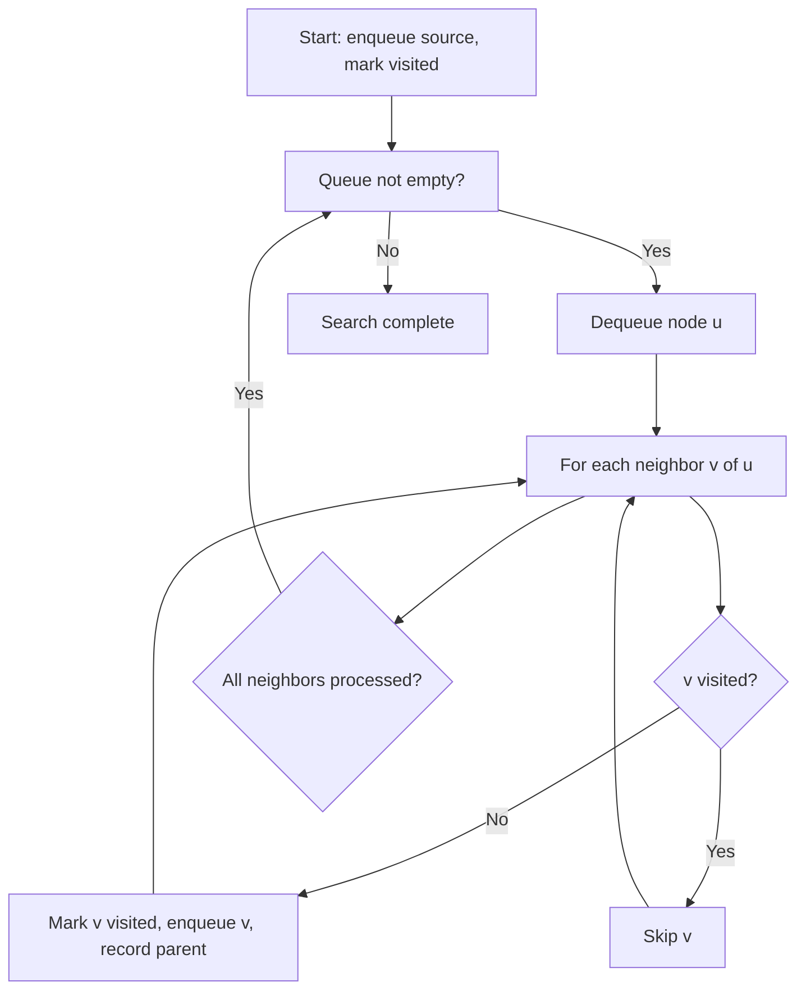

## WHY

Breadth-First Search (BFS) is the algorithm you reach for whenever the problem involves finding the **shortest path** or **minimum number of steps** in an unweighted graph. Before BFS was formalized (by Konrad Zuse in the 1940s and popularized by Edward Moore in 1959 for maze solving), programmers naively used depth-first traversal for shortest-path problems — which catastrophically fails in unweighted graphs. DFS might find *a* path, but it has no guarantee of finding the *shortest* path; BFS guarantees optimality precisely because it explores all nodes at distance k before any node at distance k+1.

The concrete problems BFS solves that DFS cannot: shortest path in a social network graph (degrees of separation), minimum number of word transformations in word ladder problems, shortest route in a grid maze, minimum number of moves in a puzzle (Rubik's cube, 15-puzzle), and shortest dependency chain in a build system. All of these require the level-by-level exploration guarantee that only BFS provides.

The production failure mode from BFS misuse is **memory exhaustion on dense graphs**. BFS stores the entire frontier (all nodes at the current distance) in a queue. In a social network graph, the frontier at distance 2 from a celebrity can contain millions of nodes — Facebook's "6 degrees of separation" query using naive BFS would allocate gigabytes of memory. Production implementations use bidirectional BFS (from both source and destination simultaneously) which reduces the frontier size from O(b^d) to O(b^(d/2)), enabling queries that would otherwise be impossible. Senior engineers must understand when BFS's memory cost is acceptable and when to use optimized variants.

## THEORY

### How BFS Works Internally



### BFS Level-by-Level Exploration

```
Graph:        BFS from A:
A - B - E     Level 0: [A]
|   |         Level 1: [B, C]     ← distance 1 from A
C - D - F     Level 2: [E, D]     ← distance 2 from A
              Level 3: [F]        ← distance 3 from A

Queue states:
Start:   [A]
After A: [B, C]      (enqueued A's neighbors)
After B: [C, E, D]   (enqueued B's unvisited neighbors)
After C: [E, D]      (C's neighbor D already queued)
...
```

### BFS vs. DFS Comparison

| Property | BFS | DFS |
|----------|-----|-----|
| Data structure | Queue (FIFO) | Stack (LIFO) or recursion |
| Guarantees shortest path | ✅ Yes (unweighted) | ❌ No |
| Memory: complete graph | O(V) queue | O(h) stack (h=height) |
| Memory: wide graph | High (wide frontier) | Low |
| Memory: deep graph | Low | High (deep recursion = stack overflow) |
| Finds all at distance k | ✅ Before k+1 | ❌ No guarantee |
| Completeness | ✅ Always | ✅ Always |
| Time complexity | O(V + E) | O(V + E) |

### BFS Complexity

| Operation | Complexity | Why |
|-----------|------------|-----|
| Time | O(V + E) | Each vertex visited once, each edge traversed once |
| Space | O(V) | Queue + visited set each hold at most V vertices |
| Shortest path reconstruction | O(V) | Walk the parent map from dest to source |

### Common Misconception

> "BFS always uses more memory than DFS."

**Reality:** BFS uses memory proportional to the *width* of the graph at the deepest level explored. DFS uses memory proportional to the *depth* (recursion stack or explicit stack). For balanced binary trees of depth d: BFS uses O(2^d) memory (last level has most nodes), DFS uses O(d) memory. But for very deep linear graphs (linked lists), BFS uses O(1) memory (1 node wide), while DFS uses O(n) stack depth — potentially causing StackOverflowError.

## VISUALIZATION_CONFIG

```json
{ "component": "FlowChart", "state": "java-mastery-bfs" }
```

## CODE

### Level 1 — Beginner: BFS on an Adjacency List Graph

```java
import java.util.*;

public class BfsBasic {

    // Graph represented as adjacency list
    private final Map<Integer, List<Integer>> adjacencyList = new HashMap<>();

    public void addEdge(int from, int to) {
        adjacencyList.computeIfAbsent(from, k -> new ArrayList<>()).add(to);
        adjacencyList.computeIfAbsent(to, k -> new ArrayList<>()).add(from); // undirected
    }

    /**
     * BFS traversal from 'start' — visits all reachable nodes in level-order.
     * Returns nodes in the order they were visited.
     */
    public List<Integer> bfs(int start) {
        List<Integer> visited = new ArrayList<>();   // result: nodes in BFS order
        Set<Integer> seen = new HashSet<>();          // prevents revisiting nodes
        Queue<Integer> queue = new LinkedList<>();    // FIFO queue for frontier

        seen.add(start);          // mark start as seen before enqueueing
        queue.offer(start);       // enqueue the start node

        while (!queue.isEmpty()) {
            int current = queue.poll();   // dequeue the next node to process
            visited.add(current);         // record visit

            // Enqueue all unvisited neighbors
            for (int neighbor : adjacencyList.getOrDefault(current, List.of())) {
                if (!seen.contains(neighbor)) {
                    seen.add(neighbor);     // mark BEFORE enqueueing to prevent duplicates
                    queue.offer(neighbor);
                }
            }
        }
        return visited;
    }

    public static void main(String[] args) {
        var graph = new BfsBasic();
        graph.addEdge(0, 1);
        graph.addEdge(0, 2);
        graph.addEdge(1, 3);
        graph.addEdge(1, 4);
        graph.addEdge(2, 5);

        System.out.println("BFS from 0: " + graph.bfs(0));
        // [0, 1, 2, 3, 4, 5] — level-order traversal
    }
}
```

### Level 2 — Intermediate: BFS Shortest Path with Parent Tracking

```java
import java.util.*;

public class BfsShortestPath {

    private final Map<String, List<String>> graph = new HashMap<>();

    public void addEdge(String from, String to) {
        graph.computeIfAbsent(from, k -> new ArrayList<>()).add(to);
        graph.computeIfAbsent(to, k -> new ArrayList<>()).add(from);
    }

    /**
     * Find shortest path from 'start' to 'end' using BFS.
     * Returns empty list if no path exists.
     * Time: O(V+E), Space: O(V) for visited set + parent map
     */
    public List<String> shortestPath(String start, String end) {
        if (!graph.containsKey(start)) return List.of();

        Map<String, String> parent = new HashMap<>();  // node -> how we reached it
        Set<String> visited = new HashSet<>();
        Queue<String> queue = new LinkedList<>();

        visited.add(start);
        queue.offer(start);
        parent.put(start, null);  // start has no parent

        while (!queue.isEmpty()) {
            String current = queue.poll();

            if (current.equals(end)) {
                return reconstructPath(parent, end);  // goal reached!
            }

            for (String neighbor : graph.getOrDefault(current, List.of())) {
                if (!visited.contains(neighbor)) {
                    visited.add(neighbor);
                    parent.put(neighbor, current);  // record how we reached neighbor
                    queue.offer(neighbor);
                }
            }
        }
        return List.of();  // no path found
    }

    /** Reconstruct path by walking parent map from end back to start */
    private List<String> reconstructPath(Map<String, String> parent, String end) {
        List<String> path = new ArrayList<>();
        String current = end;
        while (current != null) {
            path.add(current);
            current = parent.get(current);
        }
        Collections.reverse(path);  // reverse: was built end→start
        return path;
    }

    public static void main(String[] args) {
        var graph = new BfsShortestPath();
        graph.addEdge("A", "B");
        graph.addEdge("A", "C");
        graph.addEdge("B", "D");
        graph.addEdge("C", "D");
        graph.addEdge("D", "E");

        System.out.println(graph.shortestPath("A", "E")); // [A, B, D, E] or [A, C, D, E]
        System.out.println(graph.shortestPath("A", "X")); // [] — no path
    }
}
```

### Level 3 — Advanced: BFS on a Grid, Multi-Source BFS

```java
import java.util.*;

public class AdvancedBfs {

    private static final int[][] DIRECTIONS = {{0,1},{0,-1},{1,0},{-1,0}};

    /**
     * BFS on a 2D grid — finds shortest path from start to end avoiding walls.
     * Uses int[] as queue elements to avoid Integer boxing overhead.
     */
    public static int shortestGridPath(char[][] grid, int[] start, int[] end) {
        int rows = grid.length, cols = grid[0].length;
        boolean[][] visited = new boolean[rows][cols];
        Queue<int[]> queue = new LinkedList<>();

        visited[start[0]][start[1]] = true;
        queue.offer(new int[]{start[0], start[1], 0});  // row, col, distance

        while (!queue.isEmpty()) {
            int[] curr = queue.poll();
            int row = curr[0], col = curr[1], dist = curr[2];

            if (row == end[0] && col == end[1]) return dist;  // reached goal

            for (int[] dir : DIRECTIONS) {
                int newRow = row + dir[0], newCol = col + dir[1];
                if (newRow >= 0 && newRow < rows && newCol >= 0 && newCol < cols
                        && !visited[newRow][newCol] && grid[newRow][newCol] != '#') {
                    visited[newRow][newCol] = true;
                    queue.offer(new int[]{newRow, newCol, dist + 1});
                }
            }
        }
        return -1;  // no path
    }

    /**
     * Multi-Source BFS: find distance from MULTIPLE sources simultaneously.
     * Classic example: "01 Matrix" — minimum distance of each cell to a '0' cell.
     * All sources are enqueued at distance 0; BFS fills outward uniformly.
     */
    public static int[][] multiSourceBfs(int[][] matrix) {
        int rows = matrix.length, cols = matrix[0].length;
        int[][] dist = new int[rows][cols];
        Queue<int[]> queue = new LinkedList<>();

        // Initialize: enqueue all '0' cells as sources at distance 0
        for (int[] row : dist) Arrays.fill(row, Integer.MAX_VALUE);
        for (int r = 0; r < rows; r++) {
            for (int c = 0; c < cols; c++) {
                if (matrix[r][c] == 0) {
                    dist[r][c] = 0;
                    queue.offer(new int[]{r, c});
                }
            }
        }

        // BFS from all sources simultaneously
        while (!queue.isEmpty()) {
            int[] curr = queue.poll();
            for (int[] dir : DIRECTIONS) {
                int nr = curr[0] + dir[0], nc = curr[1] + dir[1];
                if (nr >= 0 && nr < rows && nc >= 0 && nc < cols
                        && dist[nr][nc] > dist[curr[0]][curr[1]] + 1) {
                    dist[nr][nc] = dist[curr[0]][curr[1]] + 1;
                    queue.offer(new int[]{nr, nc});
                }
            }
        }
        return dist;
    }

    public static void main(String[] args) {
        // Grid BFS
        char[][] grid = {
            {'.','.','#','.'},
            {'.','.','.','.'},
            {'#','.','.','#'},
            {'.','.','.','.'}
        };
        System.out.println("Grid shortest path: " +
            shortestGridPath(grid, new int[]{0,0}, new int[]{3,3}));  // 6

        // Multi-source BFS
        int[][] matrix = {{0,0,0},{0,1,0},{1,1,1}};
        System.out.println("Multi-source distances: " +
            Arrays.deepToString(multiSourceBfs(matrix)));
        // [[0, 0, 0], [0, 1, 0], [1, 2, 1]]
    }
}
```

### Level 4 — Expert / Production: Bidirectional BFS and Level-by-Level Processing

```java
import java.util.*;

/**
 * Production BFS patterns:
 * 1. Bidirectional BFS — reduces complexity from O(b^d) to O(b^(d/2))
 * 2. Word Ladder (LeetCode #127) — real interview problem with clean BFS solution
 * 3. Level-by-level iteration with explicit level tracking
 */
public class ProductionBfs {

    /**
     * Word Ladder: minimum transformations from 'begin' to 'end'
     * where each step changes exactly one letter and the result must be in wordList.
     *
     * Uses bidirectional BFS for O(N*26*L / 2) time instead of O(N*26*L)
     * where N = number of words, L = word length
     */
    public static int wordLadder(String beginWord, String endWord, List<String> wordList) {
        Set<String> wordSet = new HashSet<>(wordList);
        if (!wordSet.contains(endWord)) return 0;

        // Bidirectional BFS: search from both ends simultaneously
        Set<String> beginSet = new HashSet<>(Set.of(beginWord));
        Set<String> endSet   = new HashSet<>(Set.of(endWord));
        Set<String> visited  = new HashSet<>();
        int level = 1;

        while (!beginSet.isEmpty()) {
            // Always expand the smaller frontier for efficiency
            if (beginSet.size() > endSet.size()) {
                Set<String> temp = beginSet;
                beginSet = endSet;
                endSet = temp;
            }

            Set<String> nextLevel = new HashSet<>();
            for (String word : beginSet) {
                char[] chars = word.toCharArray();
                for (int i = 0; i < chars.length; i++) {
                    char original = chars[i];
                    for (char c = 'a'; c <= 'z'; c++) {
                        chars[i] = c;
                        String transformed = new String(chars);
                        if (endSet.contains(transformed)) return level + 1;  // met in the middle!
                        if (!visited.contains(transformed) && wordSet.contains(transformed)) {
                            nextLevel.add(transformed);
                            visited.add(transformed);
                        }
                    }
                    chars[i] = original;  // restore
                }
            }
            beginSet = nextLevel;
            level++;
        }
        return 0;  // no path found
    }

    /**
     * Level-by-level BFS — explicit level tracking for problems like
     * "binary tree level order traversal", "minimum depth", etc.
     */
    public static <T> List<List<T>> levelOrder(T root,
            java.util.function.Function<T, List<T>> getChildren) {
        if (root == null) return List.of();

        List<List<T>> result = new ArrayList<>();
        Queue<T> queue = new LinkedList<>();
        queue.offer(root);

        while (!queue.isEmpty()) {
            int levelSize = queue.size();  // number of nodes at CURRENT level
            List<T> currentLevel = new ArrayList<>(levelSize);

            for (int i = 0; i < levelSize; i++) {
                T node = queue.poll();
                currentLevel.add(node);
                // Enqueue children for the NEXT level
                for (T child : getChildren.apply(node)) {
                    if (child != null) queue.offer(child);
                }
            }
            result.add(currentLevel);
        }
        return result;
    }

    public static void main(String[] args) {
        // Word Ladder
        int steps = wordLadder("hit", "cog",
            List.of("hot","dot","dog","lot","log","cog"));
        System.out.println("Word Ladder steps: " + steps);  // 5

        // Level-order traversal using generic helper
        // Using simple integer "tree" via adjacency map
        Map<Integer, List<Integer>> tree = Map.of(
            1, List.of(2, 3),
            2, List.of(4, 5),
            3, List.of(6),
            4, List.of(), 5, List.of(), 6, List.of()
        );
        var levels = levelOrder(1, node -> tree.getOrDefault(node, List.of()));
        System.out.println("Level order: " + levels);
        // [[1], [2, 3], [4, 5, 6]]
    }
}
```

## REAL_WORLD

### How Facebook Uses BFS for "People You May Know"

Facebook's "People You May Know" recommendation system uses a variant of BFS to find nodes within 2-3 hops of a user in their social graph (which has ~3 billion nodes). A naive BFS from any Facebook user would load tens of millions of second-degree connections — completely impractical. Facebook's production system uses **ego-graph sampling** (only a slice of the neighborhood) combined with compressed sparse row (CSR) graph representations stored in RocksDB. The BFS frontier is processed in parallel across hundreds of machines using Apache Spark's GraphX, which distributes the queue across cluster nodes.

```java
// Simplified production-style BFS with distance limit
// Used for "nearby users within k hops" queries
import java.util.*;

public class KHopBfs {

    public static Set<String> kHopNeighbors(
            Map<String, List<String>> graph,
            String source,
            int maxHops) {

        Set<String> visited = new HashSet<>();
        Queue<String[]> queue = new LinkedList<>();  // [node, hopCount]

        visited.add(source);
        queue.offer(new String[]{source, "0"});

        while (!queue.isEmpty()) {
            String[] curr = queue.poll();
            String node = curr[0];
            int hops = Integer.parseInt(curr[1]);

            if (hops >= maxHops) continue;  // stop expanding beyond maxHops

            for (String neighbor : graph.getOrDefault(node, List.of())) {
                if (!visited.contains(neighbor)) {
                    visited.add(neighbor);
                    queue.offer(new String[]{neighbor, String.valueOf(hops + 1)});
                }
            }
        }

        visited.remove(source);  // exclude the source itself
        return visited;
    }

    public static void main(String[] args) {
        var socialGraph = new HashMap<String, List<String>>();
        socialGraph.put("Alice", List.of("Bob", "Carol"));
        socialGraph.put("Bob", List.of("Alice", "Dave", "Eve"));
        socialGraph.put("Carol", List.of("Alice", "Frank"));

        System.out.println("2-hop from Alice: " + kHopNeighbors(socialGraph, "Alice", 2));
        // Dave, Eve, Frank — people 2 hops away
    }
}
```

### Production Gotcha: Forgetting to Mark Visited BEFORE Enqueue

```java
// ❌ DANGEROUS — marking visited AFTER dequeue causes duplicate processing
// In a dense graph, this can enqueue the same node THOUSANDS of times
public List<Integer> buggyBfs(int start) {
    Set<Integer> visited = new HashSet<>();
    Queue<Integer> queue = new LinkedList<>();
    queue.offer(start);

    while (!queue.isEmpty()) {
        int current = queue.poll();
        if (visited.contains(current)) continue;  // ❌ visited AFTER dequeue
        visited.add(current);

        for (int neighbor : adjacencyList.getOrDefault(current, List.of())) {
            queue.offer(neighbor);  // ❌ enqueues duplicates!
        }
    }
    return List.copyOf(visited);
}

// ✅ CORRECT — mark visited BEFORE enqueue to prevent duplicate queue entries
public List<Integer> correctBfs(int start) {
    Set<Integer> visited = new HashSet<>();
    Queue<Integer> queue = new LinkedList<>();

    visited.add(start);   // ✅ mark BEFORE enqueue
    queue.offer(start);

    while (!queue.isEmpty()) {
        int current = queue.poll();
        for (int neighbor : adjacencyList.getOrDefault(current, List.of())) {
            if (!visited.contains(neighbor)) {
                visited.add(neighbor);   // ✅ mark BEFORE enqueue
                queue.offer(neighbor);
            }
        }
    }
    return List.copyOf(visited);
}
```

**Why it happens:** If you mark nodes as visited only when dequeuing, multiple copies of the same node can be enqueued. In dense graphs (each node has many neighbors), a single unvisited node might be enqueued hundreds of times — turning O(V+E) into O(V×E).

### Performance Characteristics

| Operation | Time | Space | Notes |
|-----------|------|-------|-------|
| BFS traversal | O(V+E) | O(V) | V=vertices, E=edges |
| Shortest path | O(V+E) | O(V) | Parent map adds O(V) space |
| Grid BFS (R×C) | O(R×C) | O(R×C) | Each cell visited once |
| Bidirectional BFS | O(b^(d/2)) | O(b^(d/2)) | b=branching, d=diameter |
| Multi-source BFS | O(V+E) | O(V) | Same as single-source |
| Level-order | O(V) | O(V) | Queue holds at most width |

## INTERVIEW

**Q1 (Junior): What data structure does BFS use and why?**
A: BFS uses a **Queue** (FIFO — First In, First Out) because the fundamental BFS invariant is that all nodes at distance k must be fully processed before any node at distance k+1 can be processed. A FIFO queue naturally enforces this: when we enqueue a node's neighbors, they go to the back of the queue. Since all distance-k nodes were already in the queue before we started processing them (and their neighbors), the distance-k nodes are dequeued before any distance-(k+1) neighbors. A Stack (LIFO) would give DFS behavior — it would dive deep into the first neighbor before exploring other neighbors at the same level.

**Q2 (Junior): How do you avoid infinite loops in BFS on a graph with cycles?**
A: You maintain a `visited` set (or `boolean[] visited` array for integer-indexed graphs) and mark each node as visited **before** adding it to the queue. When processing a node's neighbors, you only enqueue neighbors that have not been marked visited. The critical implementation detail: mark nodes as visited when you *enqueue* them, not when you *dequeue* them. If you mark them on dequeue, the same node can be enqueued multiple times (once per neighbor that discovers it), turning the algorithm from O(V+E) into potentially O(V×E) — a performance disaster on dense graphs.

**Q3 (Mid): When does BFS guarantee the shortest path and when does it not?**
A: BFS guarantees the shortest path in **unweighted graphs** — graphs where every edge has equal cost (typically assumed to be 1). The level-by-level exploration ensures that the first time BFS reaches a node, it has found the minimum number of edges to reach it. BFS does NOT guarantee shortest path in **weighted graphs** (where edges have different costs) — you need Dijkstra's algorithm (non-negative weights) or Bellman-Ford (negative weights allowed). Example: in a graph where A→B has weight 10 and A→C→B has weight 3, BFS would say A→B (1 edge) but the true shortest is A→C→B (2 edges, weight 3). Dijkstra's algorithm handles this correctly.

**Q4 (Mid): What is multi-source BFS and when would you use it?**
A: Multi-source BFS initializes the queue with multiple starting nodes simultaneously (all at distance 0) and runs BFS from all of them at once. This finds, for each node in the graph, the minimum distance to the nearest source. Applications: "01 Matrix" (minimum distance from each cell to a '0' cell), "nearest exit in a maze" (from any entry point), "zombie infection spread time" (all zombies start simultaneously), and "fire spreading in a forest" (multiple fire sources). The key insight: instead of running BFS N times (once per source) and taking the minimum — which is O(N×(V+E)) — you run BFS once with all sources in the queue from the start — O(V+E).

**Q5 (Senior): How would you implement BFS for a graph too large to fit in memory?**
A: For graphs that exceed RAM capacity, you use **external BFS**: process the frontier level by level, writing each level to disk before reading the next. This is the approach used by Facebook's social graph traversal systems and large-scale web crawlers. The technique: (1) store the current frontier in a file, (2) for each node in the frontier, look up its adjacency list (from an external database), (3) write all new unvisited neighbors to the next frontier file, (4) swap files and repeat. The visited set is stored as a Bloom filter (probabilistic, sublinear space) or a bitset (1 bit per node, feasible for billions of nodes). This reduces memory usage from O(V) to O(frontier_size), which is typically orders of magnitude smaller.

**Q6 (Senior): Explain bidirectional BFS and why it's faster in practice.**
A: Bidirectional BFS runs two simultaneous BFS searches: one from the source and one from the destination. It terminates when the two frontiers intersect (a node appears in both). The path length is the sum of distances from each frontier to the meeting point. The asymptotic improvement: standard BFS explores O(b^d) nodes (b = branching factor, d = shortest path length). Bidirectional BFS explores O(b^(d/2)) nodes from each side, for O(2 × b^(d/2)) total — which is exponentially smaller than b^d for large d. For the "6 degrees of separation" problem (d=6) with branching factor ~100 (average Facebook friends): standard BFS: 100^6 = 10^12 nodes. Bidirectional: 2 × 100^3 = 2 million nodes — 500,000x improvement.

**Q7 (Senior+): How does BFS relate to Dijkstra's algorithm?**
A: Dijkstra's algorithm is a generalization of BFS for weighted graphs. BFS uses a FIFO queue, which implicitly assigns equal weight to all edges. Dijkstra uses a **priority queue** (min-heap), ordered by accumulated distance, which correctly handles different edge weights. When all edge weights are equal (or all set to 1), Dijkstra degenerates to BFS because the priority queue always returns the node with the minimum accumulated edges, which is exactly the BFS level. The key insight: BFS is Dijkstra's algorithm optimized for the special case of unit-weight edges, replacing the O(log V) heap operations with O(1) queue operations for O(V+E) total instead of Dijkstra's O((V+E) log V).

## FEYNMAN CHECK

### Explain BFS Like I'm 10 Years Old

> Imagine you drop a pebble in a still pond. The ripples spread outward in concentric circles — the first ring is all the points 1 unit away, the second ring is all the points 2 units away, and so on. **BFS works exactly like those ripples.** You start at one node (where the pebble dropped), and you visit ALL nodes that are 1 hop away before visiting ANY node that is 2 hops away. This is why BFS finds the shortest path: the first time you reach a node, you reached it via the fewest number of hops possible. If you used DFS instead (going as deep as possible down one path), you might find a very long path before checking shorter alternatives — like taking the scenic highway before checking if there's a shortcut. The ripple always takes the shortest route.

---

### 5 Deep Conceptual Questions

**Q1: Why does BFS guarantee the shortest path in unweighted graphs but not weighted ones?**
> **A:** BFS explores nodes in strict order of their hop-distance from the source. The first time any node v is reached, BFS has taken the minimum number of edges to get there — because all earlier BFS iterations processed every node at distance d before any node at distance d+1. This holds only for unweighted graphs where every edge costs 1 hop. In weighted graphs, a path through more hops might have a lower total weight (e.g., 1-hop path costs 100, but 3-hop path costs 3). BFS ignores edge weights — it optimizes hop count, not total weight. Dijkstra's algorithm generalizes BFS by using a priority queue ordered by total accumulated weight, ensuring the minimum-weight path is found regardless of hop count.

**Q2: What is the one mental model that makes BFS implementation errors obvious?**
> **A:** "Mark visited when you enqueue, not when you dequeue." The mental model is a physical wave: once a wave front reaches a point, that point is claimed. If two wave fronts both simultaneously try to claim the same point, only the first one succeeds — the second wave front bouncing off. In code: when you enqueue a node, you're claiming it for the current level. If you don't mark it claimed until dequeue, the same node can be claimed multiple times by different wave fronts. This turns an O(E) algorithm into O(E²) in the worst case — a 1000-node dense graph processes 1 million nodes instead of 1000.

**Q3: What is the most common BFS implementation mistake? Show it with code.**
> **A:** Marking nodes as visited when dequeuing instead of when enqueuing — causing O(V²) or worse behavior.
> ```java
> // ❌ Visited-on-dequeue — O(V²) or worse due to duplicate enqueues
> Queue<Integer> queue = new LinkedList<>();
> Set<Integer> visited = new HashSet<>();
> queue.offer(start);
> while (!queue.isEmpty()) {
>     int node = queue.poll();
>     if (visited.contains(node)) continue;  // too late! already enqueued many times
>     visited.add(node);
>     for (int neighbor : graph.get(node))
>         queue.offer(neighbor);  // adds duplicates before they're "visited"
> }
>
> // ✅ Visited-on-enqueue — O(V+E) guaranteed
> queue.offer(start);
> visited.add(start);  // mark immediately
> while (!queue.isEmpty()) {
>     int node = queue.poll();
>     for (int neighbor : graph.get(node))
>         if (!visited.contains(neighbor)) {
>             visited.add(neighbor);  // mark before adding to queue
>             queue.offer(neighbor);
>         }
> }
> ```

**Q4: How does BFS interact with graph connectivity — connected vs. disconnected graphs?**
> **A:** Standard BFS from a single source only visits nodes reachable from that source. If the graph is disconnected, BFS will explore the entire connected component of the source but will never visit nodes in other components. To traverse a fully disconnected graph (all components), you must run BFS from each unvisited node after the previous BFS completes — iterating over all vertices and running BFS from any that haven't been visited yet. This is the standard approach for problems like "count connected components" or "find all islands in a grid" — outer loop over all nodes, inner BFS from each unvisited node.

**Q5: Write a one-sentence definition of BFS for a senior FAANG engineer.**
> **A:** "Breadth-First Search is a graph traversal algorithm that processes nodes in non-decreasing order of their distance from the source using a FIFO queue, guaranteeing that each node is first visited via the minimum-hop path — making it optimal for unweighted shortest-path problems and any problem requiring level-by-level processing — at O(V+E) time and O(V) space, with the critical implementation requirement that nodes be marked visited at enqueue time to prevent exponential duplicate processing in dense graphs."

## BUILD

### 🏗️ Mini Project: Maze Solver and Shortest Path Finder

**What you will build:** A BFS-based maze solver that finds the shortest path through a 2D character grid maze, with path visualization.
**Why this project:** Forces you to apply BFS on a 2D grid, manage direction vectors, implement path reconstruction, and handle edge cases like no-path scenarios.
**Time estimate:** 25 minutes

---

#### Step 1 — Setup

```bash
mkdir maze-solver && cd maze-solver
mkdir -p src/main/java/com/maze
touch src/main/java/com/maze/MazeSolver.java
touch src/main/java/com/maze/MazeSolverTest.java
```

#### Step 2 — Core Implementation

```java
package com.maze;

import java.util.*;

public class MazeSolver {

    private static final int[][] DIRS = {{0,1},{0,-1},{1,0},{-1,0}};
    private static final char WALL = '#', OPEN = '.', START = 'S', END = 'E', PATH = '*';

    record Position(int row, int col) {}

    public static Optional<List<Position>> solve(char[][] maze) {
        Position start = null, end = null;

        for (int r = 0; r < maze.length; r++) {
            for (int c = 0; c < maze[0].length; c++) {
                if (maze[r][c] == START) start = new Position(r, c);
                if (maze[r][c] == END)   end   = new Position(r, c);
            }
        }

        if (start == null || end == null) return Optional.empty();

        Map<Position, Position> parent = new HashMap<>();
        Queue<Position> queue = new LinkedList<>();
        Set<Position> visited = new HashSet<>();

        parent.put(start, null);
        visited.add(start);
        queue.offer(start);

        while (!queue.isEmpty()) {
            Position curr = queue.poll();
            if (curr.equals(end)) return Optional.of(reconstructPath(parent, end));

            for (int[] dir : DIRS) {
                int nr = curr.row() + dir[0], nc = curr.col() + dir[1];
                if (isValid(maze, nr, nc)) {
                    var next = new Position(nr, nc);
                    if (!visited.contains(next)) {
                        visited.add(next);
                        parent.put(next, curr);
                        queue.offer(next);
                    }
                }
            }
        }
        return Optional.empty();
    }

    private static boolean isValid(char[][] maze, int r, int c) {
        return r >= 0 && r < maze.length && c >= 0 && c < maze[0].length
            && maze[r][c] != WALL;
    }

    private static List<Position> reconstructPath(Map<Position, Position> parent, Position end) {
        List<Position> path = new ArrayList<>();
        for (Position curr = end; curr != null; curr = parent.get(curr)) path.add(curr);
        Collections.reverse(path);
        return path;
    }

    public static String visualize(char[][] maze, List<Position> path) {
        char[][] copy = new char[maze.length][];
        for (int i = 0; i < maze.length; i++) copy[i] = Arrays.copyOf(maze[i], maze[i].length);
        for (Position p : path) {
            if (copy[p.row()][p.col()] != START && copy[p.row()][p.col()] != END)
                copy[p.row()][p.col()] = PATH;
        }
        StringBuilder sb = new StringBuilder();
        for (char[] row : copy) sb.append(new String(row)).append('\n');
        return sb.toString();
    }
}
```

#### Step 3 — Main Usage

```java
public class Main {
    public static void main(String[] args) {
        char[][] maze = {
            {'S','.','.','#','.'},
            {'#','#','.','#','.'},
            {'.','.','.','.','.'},
            {'#','.','.','#','E'},
        };

        var result = MazeSolver.solve(maze);
        if (result.isPresent()) {
            System.out.println("Path length: " + (result.get().size() - 1) + " steps");
            System.out.println(MazeSolver.visualize(maze, result.get()));
        } else {
            System.out.println("No path found");
        }
    }
}
```

#### Step 4 — Error Handling

```java
// Boundary checks in isValid() already cover most cases
// Additional validation:
public static Optional<List<Position>> solveSafe(char[][] maze) {
    if (maze == null || maze.length == 0 || maze[0].length == 0)
        throw new IllegalArgumentException("Maze must not be null or empty");
    return solve(maze);
}
```

#### Step 5 — Tests

```java
import org.junit.jupiter.api.Test;
import static org.junit.jupiter.api.Assertions.*;

class MazeSolverTest {
    @Test
    void findsShortestPath() {
        char[][] maze = {{'S','.','E'}};
        var path = MazeSolver.solve(maze);
        assertTrue(path.isPresent());
        assertEquals(3, path.get().size());  // S, ., E
    }

    @Test
    void returnsEmptyWhenNoPath() {
        char[][] maze = {{'S','#','E'}};
        assertTrue(MazeSolver.solve(maze).isEmpty());
    }

    @Test
    void shortestPathAcrossMultipleRoutes() {
        char[][] maze = {
            {'S','.','#'},
            {'.','.','.'},
            {'#','.','E'}
        };
        var path = MazeSolver.solve(maze);
        assertTrue(path.isPresent());
        assertEquals(5, path.get().size());  // 4 steps: (0,0)→(1,0)→(1,1)→(1,2)→(2,2)
    }
}
```

**Expected Output:**
```
Path length: 7 steps
S**.#.
##*#.
..***
#..*#E (path marked with *)
```

**Stretch Challenges:**
- [ ] Add diagonal movement support (8 directions instead of 4)
- [ ] Return ALL shortest paths (not just one)
- [ ] Solve weighted maze where each cell has a movement cost

## SPACED REVIEW

> **How to use:** Answer from memory before reading ahead.

---

### Day 1 — Recall

**Q1:** What data structure does BFS use? What property of that data structure makes BFS explore level-by-level?

**Q2:** What is the time and space complexity of BFS? Give the definitions of V and E and explain why each is O(V+E) and O(V).

**Q3:** Write a BFS that visits all nodes in a graph and returns them in BFS order. Mark nodes visited at the correct time.

---

### Day 3 — Comprehension

**Q4:** BFS guarantees shortest path in unweighted graphs. Give a concrete example where BFS gives the WRONG answer for a weighted graph.

**Q5:** What is multi-source BFS? Write a 10-line example of multi-source BFS finding minimum distance from any '0' cell in a binary matrix.

**Q6:** A graph with 1 million nodes is disconnected into 100 components. How do you visit every node using BFS?

---

### Day 7 — Application

**Q7:** Implement BFS on a 2D grid to find the minimum number of steps to reach from `(0,0)` to `(n-1,n-1)` avoiding obstacles. Handle edge cases: start/end blocked, disconnected grid.

**Q8:** You're told to check if a social network graph is bipartite using BFS. Describe the algorithm and implement it. What does bipartite mean in terms of BFS levels?

**Q9:** What is the tradeoff between BFS and DFS for memory usage? Give a concrete example where BFS runs out of memory but DFS succeeds, and vice versa.

---

### Day 14 — Synthesis & Interview Prep

**Q10:** ★ Classic interview: *"Word Ladder: Given 'hit' and 'cog', and a dictionary, find the minimum number of transformations where each step changes one letter. Solve it with BFS."*

**Q11:** Draw the BFS execution on a 5-node graph — show the queue state, visited set, and parent map after each step.

**Q12:** ★ System design: *"You're building a 'degrees of separation' feature for LinkedIn showing how you're connected to any other user in their 900-million member network. How would you implement this? What graph algorithms, data structures, and distributed computing strategies would you use?"*
