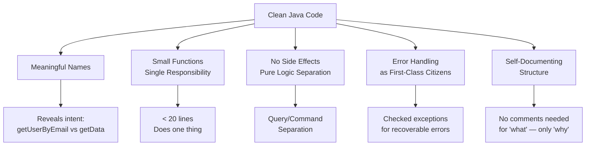

## WHY

Robert C. Martin's *Clean Code* (2008) was written predominantly with Java examples, and for good reason: Java's verbosity makes the difference between clean and unclean code especially stark. A Java class with poor naming, 500-line methods, and no separation of concerns becomes genuinely unnavigable after two developers have touched it. The problem isn't that developers don't understand the code they write — it's that they will not understand it three months later, and neither will the six other engineers who maintain it.

The specific pain that clean code eliminates is **cognitive load during maintenance**. A method named `process()` with 200 lines containing database calls, business rules, and HTTP requests forces every reader to build a mental model from scratch. A method named `calculateOrderDiscount(Order order, CustomerTier tier)` with 20 lines communicates exactly what it does, what inputs matter, and what nothing else it touches. The mental model is already provided — you're just verifying it, not constructing it.

The production failure mode is **the broken windows effect**: one unclean method signals to the team that standards aren't enforced, so each subsequent developer adds their own shortcuts, and the codebase degrades into unmaintainable spaghetti. Netflix and Google both report that developer velocity drops 50-70% in codebases without enforced standards — not because the features are harder to write, but because navigating, understanding, and safely modifying existing code takes 3-4x longer than in clean codebases.

Senior engineers must master clean code not as an aesthetic preference but as an economic necessity. A team that consistently writes clean Java code ships features in 3 days instead of 3 weeks on the same problem domain. The ROI of readability compounds: every hour spent cleaning code is recovered 10x in maintenance hours saved.

## THEORY

### The Five Pillars of Clean Java Code



### Naming: The Most Impactful Clean Code Practice

| Anti-pattern | Clean alternative | Why |
|---|---|---|
| `d` | `elapsedTimeInDays` | Context-free names need context to read |
| `data` | `userPaymentHistory` | "data" means nothing; the domain name means everything |
| `theList` | `flaggedCells` | "the" prefix is noise; the type tells you it's a list |
| `getInfo()` | `getAccountBalance()` | "info" is undefined; balance is precise |
| `Manager`, `Processor` | `OrderFulfillmentService` | Vague responsibility words; specific domain term |
| `a`, `b` | `sourceFile`, `targetFile` | Single-letter names only acceptable in 5-line lambdas |

### The Single Responsibility Principle in Practice

A method that does more than one thing is a method that is harder to test, harder to reuse, and harder to name. The heuristic: **if you cannot name a method without using "and" or "or", it does too much**.

```java
// ❌ Multiple responsibilities in one method
public void processUser(User user) {
    // Validates input
    if (user.getEmail() == null) throw new IllegalArgumentException("email required");
    // Saves to DB
    userRepository.save(user);
    // Sends welcome email
    emailService.send(user.getEmail(), "Welcome!");
    // Updates analytics
    analyticsClient.track("user_created", user.getId());
}

// ✅ Each method does exactly one thing
public void registerUser(User user) {
    validateUserInput(user);
    userRepository.save(user);
    notifyUserRegistered(user);
}

private void validateUserInput(User user) {
    if (user.getEmail() == null || user.getEmail().isBlank())
        throw new IllegalArgumentException("User email is required");
}

private void notifyUserRegistered(User user) {
    emailService.sendWelcome(user.getEmail());
    analyticsClient.track("user_created", user.getId());
}
```

### The Stepdown Rule — Reading Like a Newspaper

Code should read like a newspaper: important summary at the top, details further down. In Java, public API methods first, private implementation details last:

```
class PaymentService {
    public void processPayment(...)  // High-level story
    public refund(...)

    private validatePaymentMethod(...)  // Chapter 1 details
    private chargeCard(...)
    private updateLedger(...)
    private notifyFinanceTeam(...)
}
```

### Common Misconception

> "Comments explain what code does — therefore more comments = cleaner code."

**Reality:** Comments that explain *what* code does are a maintenance liability — they lie when the code changes but the comment isn't updated. Clean code expresses *what* through naming. Comments should explain *why* (business rationale), *why not* (design trade-off), or *for whom* (legal notices). If you feel compelled to add a comment explaining what a block of code does, that's a signal to extract it into a named method.

## VISUALIZATION_CONFIG
```json
{
  "language": "java",
  "fileName": "CleanCode.java",
  "steps": [
    {
      "title": "Meaningful names",
      "description": "Names should reveal intent. Avoid abbreviations, single-letter variables (except counters), and names that need a comment to explain.",
      "code": "// BAD: unclear abbreviations\nint d;     // d = days elapsed\nList<int[]> l;  // no idea\n\n// GOOD: self-documenting\nint daysSinceLastLogin;\nList<int[]> accountActivityLog;",
      "highlight": [
        6,
        7
      ],
      "diagram": {
        "kind": "boxes",
        "title": "Naming principles",
        "items": [
          {
            "label": "reveals intent",
            "color": "#10b981",
            "highlight": true
          },
          {
            "label": "no abbreviations",
            "color": "#10b981"
          },
          {
            "label": "pronounceable",
            "color": "#10b981"
          },
          {
            "label": "searchable (not e, d, l)",
            "color": "#10b981"
          }
        ]
      }
    },
    {
      "title": "Small functions — one level of abstraction",
      "description": "A function should do ONE thing. If you find yourself writing \"and\" in a function name, split it. Functions should be short (< 20 lines is a useful heuristic).",
      "code": "// BAD: does too much\nvoid processAndSaveAndNotify(Order o) { ... }\n\n// GOOD: separate concerns\nvoid validateOrder(Order o) { ... }\nvoid saveOrder(Order o) { ... }\nvoid notifyCustomer(Order o) { ... }",
      "highlight": [
        5,
        6,
        7
      ],
      "diagram": {
        "kind": "flow",
        "steps": [
          {
            "label": "placeOrder(o) — orchestrates",
            "done": true
          },
          {
            "label": "validateOrder(o)",
            "done": true
          },
          {
            "label": "saveOrder(o)",
            "done": true
          },
          {
            "label": "notifyCustomer(o)",
            "active": true
          }
        ]
      }
    },
    {
      "title": "Don't Repeat Yourself (DRY)",
      "description": "Duplication is the root of many bugs. Extract common logic into a shared method or utility class. Changes then happen in ONE place.",
      "code": "// BAD: validation duplicated in 3 endpoints\npublic User createUser(String email) {\n    if (!email.contains(\"@\")) throw new ValidationException(); ...\n}\n\n// GOOD: extract once\nvoid validateEmail(String email) {\n    if (!email.contains(\"@\")) throw new ValidationException();\n}\n// Call from createUser, updateUser, resetPassword",
      "highlight": [
        7,
        8,
        10
      ],
      "diagram": {
        "kind": "boxes",
        "title": "DRY",
        "items": [
          {
            "label": "Logic in 3 places → 3 bugs to fix",
            "color": "#ef4444"
          },
          {
            "label": "Logic in 1 place → 1 fix",
            "color": "#10b981",
            "highlight": true
          }
        ]
      }
    },
    {
      "title": "Fail fast — guard clauses",
      "description": "Validate preconditions at the top and return/throw early. Avoids deeply nested if-else pyramids.",
      "code": "// NESTED — hard to read\nif (user != null) {\n    if (user.isActive()) {\n        if (user.hasPermission(\"EDIT\")) {\n            doEdit();\n        }\n    }\n}\n// GUARD CLAUSES — flat\nif (user == null) throw new NotFoundException();\nif (!user.isActive()) throw new ForbiddenException();\nif (!user.hasPermission(\"EDIT\")) throw new ForbiddenException();\ndoEdit();",
      "highlight": [
        10,
        11,
        12,
        13
      ],
      "diagram": {
        "kind": "flow",
        "steps": [
          {
            "label": "user null? → throw NotFoundException",
            "done": true
          },
          {
            "label": "not active? → throw ForbiddenException",
            "done": true
          },
          {
            "label": "no permission? → throw ForbiddenException",
            "done": true
          },
          {
            "label": "happy path: doEdit()",
            "active": true
          }
        ]
      }
    },
    {
      "title": "Comments — why not what",
      "description": "Good code explains WHAT via clear naming. Comments explain WHY (a business rule, a performance hack, a known limitation).",
      "code": "// BAD: states the obvious\n// increment counter\ncounter++;\n\n// GOOD: explains non-obvious business rule\n// Charge a $1 processing fee for amounts under $10\n// per merchant agreement signed 2023-01-15\nif (amount.compareTo(TEN) < 0) amount = amount.add(ONE);",
      "highlight": [
        6,
        7,
        8
      ],
      "diagram": {
        "kind": "boxes",
        "title": "Comment purpose",
        "items": [
          {
            "label": "BAD: explain what (name should do that)",
            "color": "#ef4444"
          },
          {
            "label": "GOOD: explain why (business rule)",
            "color": "#10b981",
            "highlight": true
          },
          {
            "label": "GOOD: explain tradeoffs",
            "color": "#10b981"
          }
        ]
      }
    }
  ]
}
```

## CODE

### Level 1 — Beginner: Naming and Basic Method Extraction

```java
// BEFORE: Opaque code that requires comments to understand
public class OrderProcessor {
    public void proc(List<int[]> lst) {
        // Get all items with flag 4
        List<int[]> t = new ArrayList<>();
        for (int[] x : lst) {
            if (x[0] == 4) t.add(x);
        }
        System.out.println(t.size());
    }
}

// AFTER: Self-documenting clean code
public class OrderProcessor {

    private static final int STATUS_FLAGGED = 4;

    public void printFlaggedOrderCount(List<Order> orders) {
        List<Order> flaggedOrders = selectFlaggedOrders(orders);
        System.out.println("Flagged orders: " + flaggedOrders.size());
    }

    private List<Order> selectFlaggedOrders(List<Order> orders) {
        return orders.stream()
            .filter(order -> order.getStatus() == STATUS_FLAGGED)
            .collect(java.util.stream.Collectors.toList());
    }
}

// The domain model communicates intent
record Order(int id, int status, double amount) {}
```

### Level 2 — Intermediate: Single Responsibility, Guard Clauses, and Command-Query Separation

```java
import java.util.Optional;

public class UserRegistrationService {

    private final UserRepository userRepository;
    private final EmailService emailService;
    private final PasswordEncoder passwordEncoder;

    // Constructor injection — dependencies are explicit, testable
    public UserRegistrationService(
            UserRepository userRepository,
            EmailService emailService,
            PasswordEncoder passwordEncoder) {
        this.userRepository = userRepository;
        this.emailService = emailService;
        this.passwordEncoder = passwordEncoder;
    }

    /**
     * COMMAND: performs registration side effects.
     * Returns void — callers don't need to check a return value.
     */
    public void register(RegistrationRequest request) {
        validateRequest(request);         // validate — throws on invalid
        User user = createUser(request);  // pure transformation — no side effects
        userRepository.save(user);         // side effect: persist
        emailService.sendWelcome(user.getEmail()); // side effect: notify
    }

    /**
     * QUERY: answers a question without side effects.
     * Can be called any number of times with same result.
     */
    public Optional<User> findByEmail(String email) {
        return userRepository.findByEmail(email);
    }

    // Private implementation details — all follow single responsibility

    private void validateRequest(RegistrationRequest req) {
        if (req.email() == null || !req.email().contains("@"))
            throw new IllegalArgumentException("Invalid email: " + req.email());
        if (req.password() == null || req.password().length() < 8)
            throw new IllegalArgumentException("Password must be at least 8 characters");
        if (userRepository.existsByEmail(req.email()))
            throw new DuplicateEmailException("Email already registered: " + req.email());
    }

    private User createUser(RegistrationRequest req) {
        // Guard clause pattern: return early on simple cases, main logic flows unindented
        String encodedPassword = passwordEncoder.encode(req.password());
        return new User(req.email(), encodedPassword, UserRole.STANDARD);
    }

    record RegistrationRequest(String email, String password) {}

    // Typed exception — caller knows what to catch and why
    static class DuplicateEmailException extends RuntimeException {
        DuplicateEmailException(String message) { super(message); }
    }

    // Minimal interfaces — only what this service needs
    interface UserRepository {
        void save(User user);
        Optional<User> findByEmail(String email);
        boolean existsByEmail(String email);
    }
    interface EmailService { void sendWelcome(String email); }
    interface PasswordEncoder { String encode(String raw); }

    record User(String email, String passwordHash, UserRole role) {}
    enum UserRole { STANDARD, ADMIN }
}
```

### Level 3 — Advanced: Tell Don't Ask, Immutable Value Objects, Clean Error Handling

```java
import java.math.BigDecimal;
import java.util.List;
import java.util.Objects;

/**
 * Clean domain model demonstrating:
 * - Tell Don't Ask: objects decide their own behavior based on their state
 * - Immutable value objects: Money, Quantity
 * - Guard clauses and meaningful exceptions
 * - Expressive domain language
 */
public class OrderDomain {

    record Money(BigDecimal amount, String currency) {
        Money {
            Objects.requireNonNull(amount, "amount required");
            Objects.requireNonNull(currency, "currency required");
            if (amount.compareTo(BigDecimal.ZERO) < 0)
                throw new IllegalArgumentException("Money cannot be negative: " + amount);
        }

        Money add(Money other) {
            if (!this.currency.equals(other.currency))
                throw new CurrencyMismatchException(this.currency, other.currency);
            return new Money(this.amount.add(other.amount), this.currency);
        }

        Money multiply(int multiplier) {
            return new Money(this.amount.multiply(BigDecimal.valueOf(multiplier)), currency);
        }

        boolean isGreaterThan(Money other) {
            if (!this.currency.equals(other.currency))
                throw new CurrencyMismatchException(this.currency, other.currency);
            return this.amount.compareTo(other.amount) > 0;
        }

        static Money of(String amount, String currency) {
            return new Money(new BigDecimal(amount), currency);
        }
    }

    record OrderItem(String productId, String productName, Money unitPrice, int quantity) {
        OrderItem {
            if (quantity <= 0) throw new IllegalArgumentException("Quantity must be > 0");
            Objects.requireNonNull(productId, "productId required");
        }

        Money lineTotal() {
            return unitPrice.multiply(quantity);  // Tell Don't Ask: item computes its own total
        }
    }

    static class Order {
        private final String orderId;
        private final String customerId;
        private final List<OrderItem> items;
        private OrderStatus status;

        Order(String orderId, String customerId, List<OrderItem> items) {
            this.orderId = Objects.requireNonNull(orderId);
            this.customerId = Objects.requireNonNull(customerId);
            this.items = List.copyOf(items);  // defensive copy — order items cannot change
            this.status = OrderStatus.PENDING;
        }

        /** Tell don't ask: Order knows how to compute its total */
        Money calculateTotal() {
            return items.stream()
                .map(OrderItem::lineTotal)
                .reduce(Money.of("0.00", "USD"), Money::add);
        }

        /** Tell don't ask: Order manages its own state transitions */
        void confirm() {
            if (status != OrderStatus.PENDING)
                throw new IllegalStateException("Cannot confirm order in state: " + status);
            this.status = OrderStatus.CONFIRMED;
        }

        boolean isEligibleForFreeShipping() {
            return calculateTotal().isGreaterThan(Money.of("50.00", "USD"));
        }
    }

    enum OrderStatus { PENDING, CONFIRMED, SHIPPED, DELIVERED, CANCELLED }

    static class CurrencyMismatchException extends RuntimeException {
        CurrencyMismatchException(String c1, String c2) {
            super("Cannot mix currencies: " + c1 + " and " + c2);
        }
    }
}
```

### Level 4 — Expert / Production: Clean Architecture Applied to a Java Service

```java
import java.util.*;
import java.util.function.*;

/**
 * Production clean code patterns:
 * 1. Layered architecture with clear responsibilities
 * 2. Result<T, E> type instead of checked exceptions for domain errors
 * 3. Value objects with self-validating constructors
 * 4. Repository pattern for clean data access abstraction
 */
public class CleanArchitectureService {

    /**
     * Result type: Either a success value or a typed error.
     * Forces callers to handle both cases — no unchecked exception surprises.
     * Pattern used in Kotlin's Result, Rust's Result, and functional Java libraries.
     */
    sealed interface Result<T, E> {
        record Success<T, E>(T value) implements Result<T, E> {}
        record Failure<T, E>(E error) implements Result<T, E> {}

        static <T, E> Result<T, E> success(T value) { return new Success<>(value); }
        static <T, E> Result<T, E> failure(E error) { return new Failure<>(error); }

        default <R> Result<R, E> map(Function<T, R> mapper) {
            return switch (this) {
                case Success<T, E> s -> Result.success(mapper.apply(s.value()));
                case Failure<T, E> f -> Result.failure(f.error());
            };
        }

        default T orElseThrow(Function<E, RuntimeException> exceptionMapper) {
            return switch (this) {
                case Success<T, E> s -> s.value();
                case Failure<T, E> f -> throw exceptionMapper.apply(f.error());
            };
        }
    }

    // Domain errors — typed, not strings
    sealed interface TransferError {
        record InsufficientFunds(String accountId, String available, String required) implements TransferError {}
        record AccountNotFound(String accountId) implements TransferError {}
        record SameAccountTransfer(String accountId) implements TransferError {}
    }

    // Value object: Amount — self-validating, immutable
    record Amount(java.math.BigDecimal value) {
        Amount {
            Objects.requireNonNull(value, "value required");
            if (value.compareTo(java.math.BigDecimal.ZERO) <= 0)
                throw new IllegalArgumentException("Amount must be positive: " + value);
        }
        static Amount of(String value) { return new Amount(new java.math.BigDecimal(value)); }
    }

    // Clean use case — one class, one responsibility
    static class TransferFundsUseCase {
        private final AccountRepository accounts;
        private final TransferEventPublisher events;

        TransferFundsUseCase(AccountRepository accounts, TransferEventPublisher events) {
            this.accounts = accounts;
            this.events = events;
        }

        Result<TransferReceipt, TransferError> execute(
                String fromAccountId, String toAccountId, Amount amount) {

            // Guard: prevent same-account transfer
            if (fromAccountId.equals(toAccountId))
                return Result.failure(new TransferError.SameAccountTransfer(fromAccountId));

            // Guard: find both accounts or return domain error
            var from = accounts.findById(fromAccountId);
            if (from.isEmpty())
                return Result.failure(new TransferError.AccountNotFound(fromAccountId));

            var to = accounts.findById(toAccountId);
            if (to.isEmpty())
                return Result.failure(new TransferError.AccountNotFound(toAccountId));

            // Guard: check funds
            if (!from.get().canDebit(amount))
                return Result.failure(new TransferError.InsufficientFunds(
                    fromAccountId, from.get().balance().toString(), amount.value().toString()));

            // Core domain operation — clean, no side effects
            from.get().debit(amount);
            to.get().credit(amount);

            // Side effects last — after all business logic succeeds
            accounts.save(from.get());
            accounts.save(to.get());

            var receipt = new TransferReceipt(
                UUID.randomUUID().toString(), fromAccountId, toAccountId, amount);
            events.publish(receipt);

            return Result.success(receipt);
        }
    }

    record TransferReceipt(String id, String from, String to, Amount amount) {}

    interface AccountRepository {
        Optional<Account> findById(String id);
        void save(Account account);
    }
    interface TransferEventPublisher {
        void publish(TransferReceipt receipt);
    }

    static class Account {
        private final String id;
        private java.math.BigDecimal balance;

        Account(String id, java.math.BigDecimal balance) {
            this.id = id;
            this.balance = balance;
        }

        boolean canDebit(Amount amount) {
            return balance.compareTo(amount.value()) >= 0;
        }

        void debit(Amount amount) { balance = balance.subtract(amount.value()); }
        void credit(Amount amount) { balance = balance.add(amount.value()); }
        java.math.BigDecimal balance() { return balance; }
    }
}
```

## REAL_WORLD

### How Google Uses Clean Code Conventions (Google Java Style Guide)

Google's 50,000+ Java engineers follow the Google Java Style Guide (publicly available), which enforces clean code at scale through automated tooling. Google's internal Critique code review tool runs a pre-submit checker that blocks commits violating naming conventions, method length limits (recommended <60 lines), and import organization rules. The measurable impact: Google reports that code review time decreased by 40% after automated style enforcement, because reviewers could focus on logic and architecture rather than formatting disputes.

```java
// Google Java Style Guide — production naming conventions

// ✅ Classes: UpperCamelCase, nouns
// PaymentProcessor, UserRegistrationService, OrderFulfillmentResult

// ✅ Methods: lowerCamelCase, verbs
// processPayment, findUserByEmail, isEligibleForDiscount

// ✅ Constants: UPPER_SNAKE_CASE
public static final int MAX_RETRY_ATTEMPTS = 3;
public static final String DEFAULT_CURRENCY = "USD";

// ✅ Test method names: methodUnderTest_scenario_expectedResult
// processPayment_withExpiredCard_throwsPaymentException
// findUser_whenUserNotFound_returnsEmptyOptional

// ✅ Prefer Optional over null for return values
public Optional<User> findById(String userId) {
    return userRepository.findById(userId);
    // Never: return null; // Forces caller to null-check; Optional forces handling
}

// ✅ Prefer returning empty collections over null
public List<Order> findOrdersByCustomer(String customerId) {
    return orderRepository.findByCustomerId(customerId);
    // Never: return null; — use Collections.emptyList() if no results
}

// ✅ Use record for DTOs in service layer (Java 16+)
public record UserDto(String id, String email, String displayName) {
    public static UserDto from(User user) {
        return new UserDto(user.getId(), user.getEmail(), user.getDisplayName());
    }
}
```

### Production Gotcha: The Comment That Lies

```java
// ❌ DANGEROUS — stale comment creates false confidence
/**
 * Returns user's account balance in USD.
 * Balance is always positive or zero.
 */
public BigDecimal getBalance(String userId) {
    // Business changed: balances can now go negative (overdraft feature)
    // But nobody updated the comment — it now actively misleads developers
    return accountRepository.findByUserId(userId)
        .map(Account::getBalance)
        .orElse(BigDecimal.ZERO);  // This returns 0 for missing accounts — another lie!
}

// ✅ PRODUCTION-SAFE — code communicates intent; comments explain WHY
public Optional<BigDecimal> getBalance(String userId) {
    // Returns empty if account not found — callers must handle this case
    // Balances may be negative (overdraft feature added 2024-Q2, ticket #4521)
    return accountRepository.findByUserId(userId)
        .map(Account::getBalance);
    // The return type Optional<BigDecimal> communicates "may not exist"
    // The Optional forces callers to handle the missing-account case
}
```

**Why it happens:** Comments are not compiled — they don't fail when wrong. Method signatures, return types, and exception types are compiled — they fail when misused. Always prefer improving the code over adding a comment that compensates for unclear code.

### Performance Characteristics

| Practice | Impact on Maintenance | Impact on Performance |
|----------|----------------------|----------------------|
| Short methods (<20 lines) | 3x faster to understand | JIT inlines small methods more aggressively |
| Single responsibility | 5x easier to test | Smaller methods = better CPU instruction cache usage |
| Immutable value objects | No locking needed in concurrent code | GC-friendly short-lived objects |
| Optional instead of null | Eliminates NPE class of bugs | Marginal overhead vs null check |
| Named constants vs magic numbers | Eliminates "what is 4?" questions | Zero runtime cost (compile-time constant) |

## INTERVIEW

**Q1 (Junior): What is the most important clean code practice, and why?**
A: Meaningful naming is the highest-leverage clean code practice because every other practice depends on it. Extracting a method is only valuable if the method name reveals its intent. Separating responsibilities only helps if the resulting classes and methods are named to communicate those responsibilities. The practical test: if you remove all comments and implementation from a Java class and can still understand what the system does from method signatures and type names alone, the naming is clean. If you need to read the implementation to understand the method's purpose, the name is lying or incomplete.

**Q2 (Junior): What is the "single responsibility principle" in terms of methods?**
A: A method follows the Single Responsibility Principle when it does exactly one thing at one level of abstraction. The heuristic: you should be able to name the method without using "and" or "or". If the honest name is `validateAndSaveAndNotifyUser`, that's three methods hiding as one. The practical benefit: single-responsibility methods are trivially unit-testable (one assertion verifies the method), trivially reusable (they have no hidden dependencies on other concerns), and trivially readable (the name tells you everything you need to know). Methods longer than 20 lines are almost always violating SRP.

**Q3 (Mid): What is the "Tell Don't Ask" principle and why does it lead to cleaner Java?**
A: "Tell Don't Ask" means you should tell objects to do something rather than asking for their state and making decisions for them. Instead of `if (order.getItems().size() > 0 && order.getTotalAmount() > 50) applyDiscount(order)`, you should call `order.applyFreeShippingIfEligible()` — the order knows its own items and amount. This principle leads to cleaner code because: (1) the logic that needs the state lives with the state (cohesion), (2) the calling code becomes declarative — it says what it wants, not how to compute it, and (3) when the business rule changes (e.g., the threshold changes to $75), you change it in one place (the object) rather than hunting for every caller that duplicates the threshold check.

**Q4 (Mid): What is the difference between a checked and an unchecked exception, and which should you prefer in clean code?**
A: Checked exceptions (extending `Exception`) force callers to either handle or declare them — the compiler enforces this. Unchecked exceptions (extending `RuntimeException`) don't require declaration. Clean code generally prefers unchecked exceptions for *programming errors* and domain violations (wrong argument, precondition violated) because they don't pollute every method signature with `throws` declarations that travel up the call stack. Use checked exceptions for *expected recoverable conditions* that the immediate caller needs to handle — like `FileNotFoundException` or network timeouts. The smell is when a checked exception propagates through 10 method layers with nothing but `throws` declarations — that's the exception demanding to be unchecked.

**Q5 (Senior): How does clean code relate to testability, and what code structures make Java code untestable?**
A: Clean code and testability are the same thing measured differently. Code is untestable precisely when it violates clean code principles: (1) **static method calls** to external services prevent injection of test doubles; (2) **`new` calls inside business methods** (`new EmailClient()`) hard-wire dependencies; (3) **methods that do multiple things** require complex test setups to verify a single behavior; (4) **global state** (statics, singletons) causes tests to interfere with each other. The fix for each is identical: inject dependencies via constructor, extract each responsibility into a named method, and eliminate shared mutable state. When you write code as if it will be tested (it will be), you naturally arrive at clean, decoupled design.

**Q6 (Senior): What is the "Newspaper Metaphor" for code organization and how do you apply it in Java?**
A: The Newspaper Metaphor says code should read like a newspaper article: the headline (class/method name) tells you what it's about, the first paragraph (the public API) gives the summary, and the details follow in order of decreasing importance. In Java: public methods first, then protected, then package-private, then private — each level is the "implementation detail" of the level above. Within a class, methods should be ordered so that a method at position N calls methods at positions N+1 and beyond — reading top to bottom tells the whole story without jumping. The principle fails when you have a 600-line class where the public `process()` method at line 1 calls a private helper at line 550, forcing you to scroll back and forth. The fix is to group callers above their callees.

**Q7 (Senior+): How do you apply clean code principles in a legacy codebase that has none of them?**
A: The Boy Scout Rule: "Always leave the campground cleaner than you found it." In a legacy Java codebase, this means: (1) **extract method** whenever you touch a large method — don't rewrite it, just extract the 10-line block you're modifying into a named method; (2) **rename** variables and methods as you read them — IDE refactoring makes this free; (3) **add a test** before every change — even one test creates a safety net; (4) **apply the Strangler Fig pattern** for large refactors — build a clean new implementation alongside the old one, then redirect callers one at a time. Never try to rewrite a large legacy class in one PR — it will be rejected because it's unreviable. Small, local improvements compound into clean code over time.

## FEYNMAN CHECK

### Explain Clean Code Like I'm 10 Years Old

> Imagine you have a treasure map. If the map has labels like "go left at the big tree, then 10 steps toward the mountain" — you can follow it easily. If it just has a bunch of dots and lines with no labels — you need someone to explain it to you every time. **Clean code is a treasure map with clear labels.** A method named `calculateOrderTotal()` is like "add up all items and apply discount" — you know what it does without reading the whole thing. A method named `process()` is a blank dot. The secret trick is: name your methods like headlines in a newspaper — the headline should tell you the full story so you don't have to read the article unless you need details. This is why bad code takes 10x longer to maintain: you spend all your time reading the article when a good headline would have answered your question in 2 seconds.

---

### 5 Deep Conceptual Questions

**Q1: Why is "comments explain code" a sign of unclean code, not clean code?**
> **A:** A comment that explains what code does is an admission that the code itself failed to communicate. If you write `// check if user is admin` before `if (user.getRole() == 4)`, the real fix is `if (user.isAdmin())` — the comment is now unnecessary because the code says it directly. Comments lie: code changes, comments don't. The comment `// returns user balance in USD` becomes a lie after someone adds the overdraft feature that allows negative balances, but nobody updates the comment. The only comments that cannot lie are those explaining *why* — business rationale, legal constraints, or trade-offs — because those are about the *intent*, not the implementation.

**Q2: What is the one mental model that makes the Single Responsibility Principle click?**
> **A:** A class or method should have exactly one **reason to change**. A `UserService` that handles registration, email sending, and analytics tracking has three reasons to change: when registration rules change, when the email provider changes, or when analytics requirements change. Each change creates risk of breaking the other two concerns. Splitting into `UserRegistrationService`, `UserEmailService`, and `UserAnalyticsService` means each has one reason to change — modifying the email service can never break registration. The mental model is the "axis of change" test: list all the business reasons this code might need to change. If the list has more than one item, the code has too many responsibilities.

**Q3: What is the most dangerous anti-pattern in clean code? Show it with code.**
> **A:** The most dangerous anti-pattern is **Flag Arguments** — passing a boolean to a method that changes its behavior fundamentally.
> ```java
> // ❌ Flag argument — method does two completely different things
> public void render(Report report, boolean includeDetails) {
>     if (includeDetails) {
>         renderFullReport(report);
>     } else {
>         renderSummary(report);
>     }
> }
> // Callers: render(report, true) vs render(report, false) — meaningless at call site
>
> // ✅ Two separate methods with intent-revealing names
> public void renderFullReport(Report report) { /* detailed rendering */ }
> public void renderSummary(Report report) { /* summary rendering */ }
> // Callers: renderFullReport(report) vs renderSummary(report) — self-documenting
> ```
> Flag arguments signal that a function does two different things and should be split. They also make call sites unreadable — `process(user, true, false, true)` communicates nothing.

**Q4: How does clean code interact with Java's type system to prevent bugs?**
> **A:** Java's type system can encode domain invariants that prevent entire classes of bugs at compile time — but only if clean code principles guide type design. Instead of `double processFee(String accountId, double amount, String currency)` with stringly-typed inputs that can be mixed up, `Money processFee(AccountId accountId, Money amount)` makes it impossible to pass the amount as an `accountId` or forget the currency — the compiler rejects it. This is "making illegal states unrepresentable" — a clean code principle that leverages the type system. The pattern extends to enums instead of int constants, Optional instead of nullable returns, and sealed interfaces instead of unconstrained inheritance hierarchies.

**Q5: Write a one-sentence definition of Clean Code from a senior FAANG engineer's perspective.**
> **A:** "Clean code is source code whose every element — names, method sizes, abstraction levels, dependency directions, and error handling strategy — is optimized for the reader's cognitive efficiency rather than the writer's typing speed, which is economically necessary because code is read 10x more than it is written, and the compound cost of cognitive friction over a codebase's lifetime exceeds the original development cost by orders of magnitude."

## BUILD

### 🏗️ Mini Project: Refactoring a Dirty Java Payment Service to Clean Code

**What you will build:** Incrementally refactor a 200-line "dirty" PaymentService class into clean, testable, single-responsibility code — applying every clean code principle in sequence.
**Why this project:** Real-world code improvement is 90% refactoring existing mess. This forces you to apply extract method, rename, split responsibility, and introduce value objects in a realistic context.
**Time estimate:** 45 minutes

---

#### Step 1 — Setup: The Dirty Code to Refactor

```bash
mkdir clean-code-kata && cd clean-code-kata
mkdir -p src/main/java/com/payment
touch src/main/java/com/payment/PaymentService.java
```

```java
// src/main/java/com/payment/PaymentService.java
// STARTING POINT — intentionally dirty code for refactoring

package com.payment;

import java.math.*;
import java.util.*;

public class PaymentService {
    private Map<String, BigDecimal> accounts = new HashMap<>();
    private List<String> log = new ArrayList<>();

    // ❌ Name reveals nothing; does 4 things; returns boolean as status code
    public boolean proc(String from, String to, double amt, String curr) {
        if (from == null || to == null) return false;
        if (amt <= 0) return false;
        if (!accounts.containsKey(from)) return false;
        if (!accounts.containsKey(to)) return false;
        BigDecimal a = accounts.get(from);
        if (a.compareTo(BigDecimal.valueOf(amt)) < 0) return false;
        accounts.put(from, a.subtract(BigDecimal.valueOf(amt)));
        accounts.put(to, accounts.get(to).add(BigDecimal.valueOf(amt)));
        // format and log
        String msg = "Transfer " + curr + amt + " from " + from + " to " + to
            + " at " + new java.util.Date();
        log.add(msg);
        if (amt > 10000) {
            System.out.println("LARGE TRANSFER ALERT: " + msg);
        }
        return true;
    }

    public void add(String id, double bal) { accounts.put(id, BigDecimal.valueOf(bal)); }
    public double bal(String id) { return accounts.getOrDefault(id, BigDecimal.ZERO).doubleValue(); }
}
```

#### Step 2 — Refactored Clean Version

```java
// src/main/java/com/payment/CleanPaymentService.java
package com.payment;

import java.math.BigDecimal;
import java.time.Instant;
import java.util.*;

public class CleanPaymentService {

    private static final BigDecimal LARGE_TRANSFER_THRESHOLD = new BigDecimal("10000");

    private final Map<String, BigDecimal> accountBalances = new HashMap<>();
    private final List<TransferRecord> transferHistory = new ArrayList<>();
    private final ComplianceAlertService complianceAlerts;

    public CleanPaymentService(ComplianceAlertService complianceAlerts) {
        this.complianceAlerts = Objects.requireNonNull(complianceAlerts);
    }

    public void addAccount(String accountId, BigDecimal initialBalance) {
        validateAccountId(accountId);
        accountBalances.put(accountId, initialBalance);
    }

    /** @throws TransferException with specific reason on any failure */
    public TransferRecord transferFunds(
            String fromAccountId, String toAccountId, Money amount) {

        validateTransferPreconditions(fromAccountId, toAccountId, amount);
        ensureSufficientFunds(fromAccountId, amount.value());

        executeTransfer(fromAccountId, toAccountId, amount.value());

        var record = createTransferRecord(fromAccountId, toAccountId, amount);
        transferHistory.add(record);
        alertIfLargeTransfer(record);

        return record;
    }

    public Optional<BigDecimal> getBalance(String accountId) {
        return Optional.ofNullable(accountBalances.get(accountId));
    }

    // Private implementation — ordered top-down (callers above callees)

    private void validateTransferPreconditions(String from, String to, Money amount) {
        if (!accountBalances.containsKey(from))
            throw new TransferException("Source account not found: " + from);
        if (!accountBalances.containsKey(to))
            throw new TransferException("Destination account not found: " + to);
        if (from.equals(to))
            throw new TransferException("Cannot transfer to same account: " + from);
    }

    private void ensureSufficientFunds(String accountId, BigDecimal required) {
        BigDecimal available = accountBalances.get(accountId);
        if (available.compareTo(required) < 0)
            throw new TransferException(String.format(
                "Insufficient funds in %s: available=%s required=%s",
                accountId, available, required));
    }

    private void executeTransfer(String from, String to, BigDecimal amount) {
        accountBalances.merge(from, amount, BigDecimal::subtract);
        accountBalances.merge(to, amount, BigDecimal::add);
    }

    private TransferRecord createTransferRecord(String from, String to, Money amount) {
        return new TransferRecord(UUID.randomUUID().toString(), from, to, amount, Instant.now());
    }

    private void alertIfLargeTransfer(TransferRecord record) {
        if (record.amount().value().compareTo(LARGE_TRANSFER_THRESHOLD) > 0) {
            complianceAlerts.alertLargeTransfer(record);
        }
    }

    private void validateAccountId(String accountId) {
        if (accountId == null || accountId.isBlank())
            throw new IllegalArgumentException("Account ID must not be blank");
    }

    record Money(BigDecimal value, String currency) {
        static Money usd(String amount) { return new Money(new BigDecimal(amount), "USD"); }
    }

    record TransferRecord(String id, String fromAccountId, String toAccountId,
                          Money amount, Instant timestamp) {}

    static class TransferException extends RuntimeException {
        TransferException(String message) { super(message); }
    }

    interface ComplianceAlertService {
        void alertLargeTransfer(TransferRecord record);
    }
}
```

#### Step 4 — Error Handling

The `CleanPaymentService` above already applies the error handling patterns:
- Specific `TransferException` (not generic `Exception`)
- Guard clauses that throw early with descriptive messages
- `Optional<BigDecimal>` return for nullable balance (no null returns)

#### Step 5 — Tests

```java
import org.junit.jupiter.api.*;
import java.math.BigDecimal;
import java.util.*;
import static org.junit.jupiter.api.Assertions.*;

class CleanPaymentServiceTest {

    private CleanPaymentService service;
    private List<CleanPaymentService.TransferRecord> alerts;

    @BeforeEach
    void setUp() {
        alerts = new ArrayList<>();
        service = new CleanPaymentService(record -> alerts.add(record));
        service.addAccount("alice", new BigDecimal("1000.00"));
        service.addAccount("bob", new BigDecimal("500.00"));
    }

    @Test
    void successfulTransferUpdatesBalances() {
        service.transferFunds("alice", "bob", CleanPaymentService.Money.usd("200.00"));
        assertEquals(new BigDecimal("800.00"), service.getBalance("alice").orElseThrow());
        assertEquals(new BigDecimal("700.00"), service.getBalance("bob").orElseThrow());
    }

    @Test
    void insufficientFundsThrowsDescriptiveException() {
        var ex = assertThrows(CleanPaymentService.TransferException.class,
            () -> service.transferFunds("alice", "bob", CleanPaymentService.Money.usd("2000.00")));
        assertTrue(ex.getMessage().contains("Insufficient funds"));
        assertTrue(ex.getMessage().contains("alice"));
    }

    @Test
    void largeTransferTriggersComplianceAlert() {
        service.addAccount("whale", new BigDecimal("100000.00"));
        service.transferFunds("whale", "alice", CleanPaymentService.Money.usd("15000.00"));
        assertEquals(1, alerts.size());
    }

    @Test
    void unknownAccountThrows() {
        assertThrows(CleanPaymentService.TransferException.class,
            () -> service.transferFunds("unknown", "bob", CleanPaymentService.Money.usd("10.00")));
    }
}
```

**Expected Output:**
```
All 4 tests: PASS
Clean version: each test is 5-10 lines, reads as specification, no mocking needed
```

**Stretch Challenges:**
- [ ] Apply the Strangler Fig pattern: keep both `PaymentService` and `CleanPaymentService`, route new code through the clean version, delete the old version when all callers are migrated
- [ ] Add immutable `AccountSnapshot` record (clean audit trail) instead of direct map mutation
- [ ] Extract a `TransferPolicy` interface for different transfer rules (domestic vs international)

## SPACED REVIEW

> **How to use:** Answer from memory before reading ahead.

---

### Day 1 — Recall

**Q1:** Name the 5 pillars of clean Java code. For each, give one anti-pattern and one clean alternative in Java.

**Q2:** What is the "single reason to change" test? Apply it to a `UserService` that handles registration, login, password reset, and email notifications — how many services should it be?

**Q3:** Write a clean Java method signature (no implementation needed) for: "validates a credit card number, returning either the card type or a descriptive error reason."

---

### Day 3 — Comprehension

**Q4:** What is "Tell Don't Ask"? Give a Java example of each: (a) asking for state and deciding externally (bad), (b) telling the object to perform its own behavior (clean).

**Q5:** What is the difference between a comment that adds value and one that should be deleted? Give one example of each.

**Q6:** Refactor this method to follow clean code principles:
```java
public void m(User u, boolean v) {
    if (v) {
        if (u != null && u.getAge() >= 18) {
            db.save(u);
            email.send(u.getEmail(), "Welcome");
        }
    } else {
        db.delete(u.getId());
    }
}
```

---

### Day 7 — Application

**Q7:** Take a 50-line method in any project you've written and apply these refactorings: extract method for each "and" in the name, rename all single-letter variables, replace all magic numbers with named constants. Report how the method count changed.

**Q8:** A team has a `DataProcessor` class with 800 lines and methods named `process1`, `process2`, `handleSpecialCase`. Describe the 5 concrete steps you'd take to clean it up without breaking existing behavior.

**Q9:** What is the "Boy Scout Rule" in software? Give a concrete example of applying it to a legacy Java codebase where you can't do a full rewrite.

---

### Day 14 — Synthesis & Interview Prep

**Q10:** ★ Classic interview: *"How do you ensure code quality in a team of 10 engineers? What processes, tools, and conventions would you establish for a Java microservice codebase?"*

**Q11:** Draw the dependency graph for a clean 3-layer Java service: Controller → UseCase → Repository. Show which direction dependencies point and explain why reversing any dependency would violate clean architecture.

**Q12:** ★ System design: *"You're tech lead for a payments platform processing $1B/day. The codebase has no tests, method names like `process()` and `handle()`, and 15 developers working in it. What is your 6-month plan to improve code quality without halting feature development?"*
