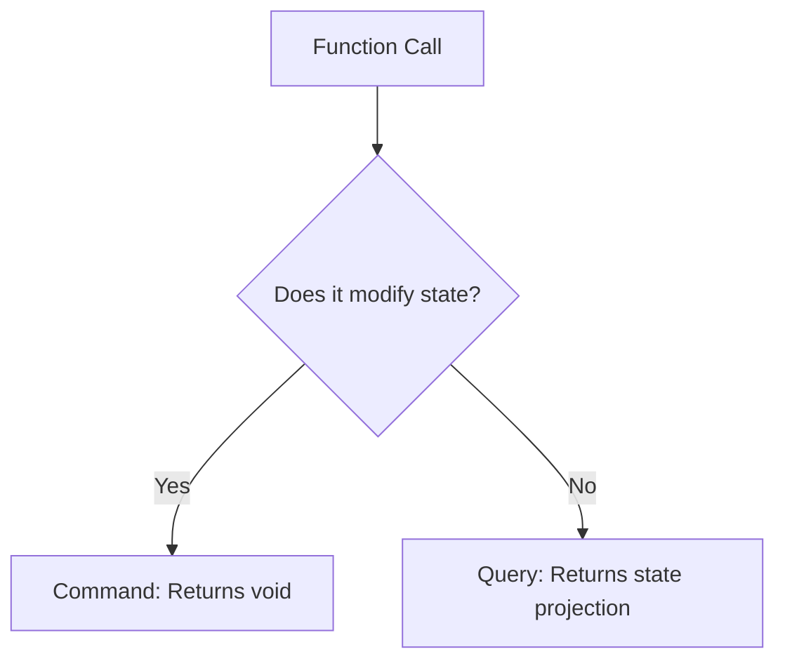

# Clean Code: Names, Functions, Comments, and Classes

Clean code is not merely aesthetic; it directly impacts the economics of software engineering. Over 80% of a software system's lifetime cost is spent on maintenance. Writing clean code minimizes cognitive load, enabling any developer to jump in and safely modify behavior without introducing regressions.

---

## 1. Naming Rules

### Principles
1.  **Use Intention-Revealing Names**: Names must tell you why it exists, what it does, and how it is used.
2.  **Avoid Disinformation**: Never refer to a collection of accounts as `accountList` unless it is actually a `List`. Use `accounts` or `accountGroup`.
3.  **Use Searchable Names**: Single-letter names like `e` or generic identifiers like `data` are impossible to search across large codebases.
4.  **No Abbreviations**: Prefer `userSubscriptionRepository` over `usrSubRepo`.

### Anti-Pattern vs Clean Comparison

```java
// ANTI-PATTERN: Cryptic and non-searchable names
public class Proc {
    private List<String[]> l = new ArrayList<>();

    public List<String[]> get() {
        List<String[]> l1 = new ArrayList<>();
        for (String[] x : l) {
            if (x[0].equals("A")) {
                l1.add(x);
            }
        }
        return l1;
    }
}
```

```java
// CLEAN CODE: Highly expressive, readable, and domain-aligned
public class UserRegistry {
    private static final int STATUS_INDEX = 0;
    private static final String ACTIVE_STATUS = "A";

    private final List<String[]> rawUsers = new ArrayList<>();

    public List<String[]> getActiveUsers() {
        List<String[]> activeUsers = new ArrayList<>();
        for (String[] userRecord : rawUsers) {
            if (isActive(userRecord)) {
                activeUsers.add(userRecord);
            }
        }
        return activeUsers;
    }

    private boolean isActive(String[] userRecord) {
        return userRecord[STATUS_INDEX].equals(ACTIVE_STATUS);
    }
}
```

---

## 2. Function Rules

Functions must be **small**, do **one thing**, and have **no side effects**. They must adhere to **Command-Query Separation (CQS)**: a method should either perform an action (command) or return data (query), but never both.

### Functional Metrics
*   **Arity**: Ideal arguments count is 0 (niladic), followed by 1 (monadic), and 2 (dyadic). Avoid 3+ (triadic/polyadic) arguments.
*   **Cyclomatic Complexity**: Keep complexity below 5. High cyclomatic complexity indicates nested conditionals that are hard to test.



### Anti-Pattern: Fat Function with Side Effects

```java
// ANTI-PATTERN: Function does multiple things and has unexpected side effects
public boolean checkUserAndSaveAndSendEmail(User user) {
    if (user != null) {
        if (user.getAge() > 18) {
            user.setAdult(true); // Side effect: mutates input state
            userRepository.save(user);
            emailService.sendWelcomeEmail(user.getEmail());
            return true;
        }
    }
    return false;
}
```

### Clean Code: Refactored with Single Responsibility

```java
// CLEAN CODE: Segregated functions with clean, predictable interfaces
public class UserActivationService {
    private final UserRepository userRepository;
    private final EmailService emailService;

    public UserActivationService(UserRepository userRepository, EmailService emailService) {
        this.userRepository = userRepository;
        this.emailService = emailService;
    }

    public void activateAdultUser(User user) {
        validateUserEligibility(user);
        User activatedUser = user.markAsAdult();
        userRepository.save(activatedUser);
        emailService.sendWelcomeEmail(activatedUser.getEmail());
    }

    private void validateUserEligibility(User user) {
        if (user == null || user.getAge() <= 18) {
            throw new IllegalArgumentException("User is not eligible for adult activation");
        }
    }
}
```

---

## 3. Comment Rules

Comments are often a necessary evil. They should never explain *what* the code does (the code itself should be expressive enough). Instead, comments must explain *why* a particular decision was made, or serve as a warning of consequences.

```java
// ANTI-PATTERN: Redundant, noisy comment explaining the "what"
// Check if the customer is active
if (customer.getStatus().equals("ACTIVE")) {
    // Save customer to database
    repository.save(customer);
}
```

```java
// CLEAN CODE: Explaining the "Why" (Context & Constraints)
// We must enforce a thread sleep here to allow the legacy mainframe 
// database downstream to complete the transaction synchronization window.
try {
    Thread.sleep(250);
} catch (InterruptedException e) {
    Thread.currentThread().interrupt();
}
```

---

## 4. Class Rules and Code Smells

### Core Code Smells Deconstructed
1.  **Primitive Obsession**: Using raw strings or integers for domain concepts (e.g., `String email`, `double amount`). *Solution*: Wrap them in immutable value objects (`EmailAddress`, `Money`).
2.  **Feature Envy**: A class that spends more time querying and using fields of another class than its own. *Solution*: Move the method to the class containing the data.
3.  **Data Clumps**: Fields that always appear together (e.g., `startDate`, `endDate`, `street`, `zipcode`). *Solution*: Group them into a cohesive record or class.

### Production-Grade Clean Architecture Example

```java
package com.devmastery.cleancode;

import java.time.LocalDate;

// 1. Primitive Obsession & Data Clumps resolved via Records
public record DateRange(LocalDate startDate, LocalDate endDate) {
    public DateRange {
        if (startDate.isAfter(endDate)) {
            throw new IllegalArgumentException("Start date cannot be after end date");
        }
    }

    public boolean contains(LocalDate date) {
        return !date.isBefore(startDate) && !date.isAfter(endDate);
    }
}

public record Money(double amount, String currency) {
    public Money {
        if (amount < 0) {
            throw new IllegalArgumentException("Amount cannot be negative");
        }
    }

    public Money add(Money other) {
        if (!this.currency.equals(other.currency)) {
            throw new IllegalArgumentException("Currency mismatch");
        }
        return new Money(this.amount + other.amount, this.currency);
    }
}

// Highly cohesive Class
public class Subscription {
    private final Long id;
    private final DateRange validityPeriod;
    private final Money