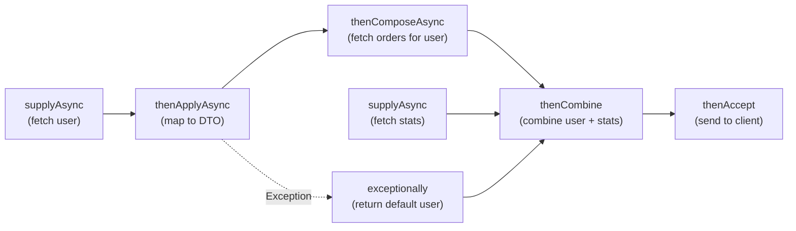

## WHY

Blocking I/O is the number one enemy of scalable Java applications. Every thread blocked waiting for a database query, HTTP call, or file read is a wasted resource. With `CompletableFuture` (introduced in Java 8), you can write fully asynchronous, non-blocking code that chains operations, runs tasks in parallel, and handles failures gracefully.

This is tested in every senior Java interview and is the foundation of reactive systems. The developer who understands `thenApply`, `thenCompose`, `allOf`, and thread pool configuration writes services that handle 10x more load with the same hardware.

---

## THEORY

### CompletableFuture vs Future (Legacy)

| | `Future` (Java 5) | `CompletableFuture` (Java 8+) |
|--|-------------------|-------------------------------|
| Get result | `future.get()` — **blocks** | Callbacks — never blocks |
| Chaining | ❌ Not possible | ✅ `thenApply`, `thenCompose` |
| Error handling | Try-catch around `get()` | `exceptionally`, `handle` |
| Combining | ❌ Manual | ✅ `allOf`, `anyOf`, `thenCombine` |
| Complete manually | ❌ Not possible | ✅ `complete(value)`, `completeExceptionally` |
| Timeout | Very limited | ✅ `orTimeout`, `completeOnTimeout` |

### Key Methods

**Transformation (stays in same thread)**
- `thenApply(fn)` — synchronous transform: `CF<T> → CF<U>` (like `map`)
- `thenCompose(fn)` — async transform: `CF<T> → CF<CF<U>> → CF<U>` (like `flatMap`)

**Side Effects**
- `thenAccept(consumer)` — consume result, return `CF<Void>`
- `thenRun(runnable)` — run side effect, ignore result

**Combining**
- `thenCombine(cf2, fn)` — combine two independent futures when BOTH complete
- `CompletableFuture.allOf(cf1, cf2, ...)` — wait for ALL to complete
- `CompletableFuture.anyOf(cf1, cf2, ...)` — complete when ANY completes (fastest)

**Error Handling**
- `exceptionally(fn)` — recover from exception with fallback value
- `handle(fn)` — handle both success AND failure (result + exception, one is null)
- `whenComplete(fn)` — side-effect on completion, doesn't alter result/exception

**Async variants**: Every method has an `...Async` version: `thenApplyAsync`, `thenComposeAsync`. The base version runs in the thread that completed the upstream stage (or the calling thread). The `Async` version submits to `ForkJoinPool.commonPool()` or a specified executor.

---

## VISUALIZATION_CONFIG



---

## CODE

### Level 1 — Basic Async Operations

```java
import java.util.concurrent.CompletableFuture;
import java.util.concurrent.Executors;
import java.util.concurrent.ExecutorService;

// Use a named thread pool — NEVER use ForkJoinPool.commonPool() for I/O tasks!
ExecutorService ioPool = Executors.newFixedThreadPool(20,
    r -> new Thread(r, "io-worker-" + threadCount.getAndIncrement()));

// WRONG: Uses ForkJoinPool.commonPool() — starves CPU-bound tasks
CompletableFuture<User> bad = CompletableFuture.supplyAsync(() -> userRepo.findById(id));

// CORRECT: Use a dedicated I/O thread pool
CompletableFuture<User> good = CompletableFuture.supplyAsync(
    () -> userRepo.findById(id), ioPool);

// Chain transformations
CompletableFuture<UserDto> userDtoFuture = CompletableFuture
    .supplyAsync(() -> userRepo.findById(id), ioPool)           // fetch user
    .thenApply(user -> new UserDto(user.getId(), user.getName()))  // transform
    .thenApply(dto -> { dto.setAvatarUrl(buildAvatarUrl(dto)); return dto; }); // enrich

// This is NON-BLOCKING — the calling thread is free to do other work
// The chain executes asynchronously in ioPool threads
```

### Level 2 — Parallel Execution with `allOf`

```java
@Service
@RequiredArgsConstructor
public class DashboardService {

    private final UserService userService;
    private final OrderService orderService;
    private final RecommendationService recommendationService;
    private final ExecutorService ioPool;

    /**
     * Load all dashboard data in PARALLEL — not sequentially.
     * Total time ≈ max(each call) instead of sum(all calls)
     */
    public DashboardResponse loadDashboard(UUID userId) {
        // Start all 3 I/O operations simultaneously
        CompletableFuture<UserProfile> profileFuture =
            CompletableFuture.supplyAsync(() -> userService.getProfile(userId), ioPool);

        CompletableFuture<List<Order>> ordersFuture =
            CompletableFuture.supplyAsync(() -> orderService.getRecentOrders(userId), ioPool);

        CompletableFuture<List<Product>> recsFuture =
            CompletableFuture.supplyAsync(() -> recommendationService.getFor(userId), ioPool);

        // Wait for ALL to complete, then combine
        return CompletableFuture.allOf(profileFuture, ordersFuture, recsFuture)
            .thenApply(__ -> new DashboardResponse(
                profileFuture.join(),    // join() is safe here — already completed
                ordersFuture.join(),
                recsFuture.join()
            ))
            .join(); // Block only at the end to return to HTTP response

        // If user, orders, recs each take 200ms:
        // Sequential = 600ms total ❌
        // Parallel   = ~200ms total ✅ (3x faster!)
    }
}
```

### Level 3 — thenCompose (async flatMap)

```java
@Service
public class EnrichedProductService {

    // WRONG: Returns CompletableFuture<CompletableFuture<ProductDetails>>
    public CompletableFuture<CompletableFuture<ProductDetails>> wrongWay(String productId) {
        return CompletableFuture
            .supplyAsync(() -> fetchProduct(productId))    // CF<Product>
            .thenApply(product -> fetchDetails(product));  // CF<CF<ProductDetails>> 🚫
    }

    // CORRECT: thenCompose flattens the nested CF
    public CompletableFuture<ProductDetails> enrichProduct(String productId) {
        return CompletableFuture
            .supplyAsync(() -> fetchProduct(productId), ioPool)    // CF<Product>
            .thenCompose(product ->                                 // CF<ProductDetails>
                CompletableFuture.supplyAsync(() -> fetchDetails(product), ioPool)
            )
            .thenCombine(
                CompletableFuture.supplyAsync(() -> fetchInventory(productId), ioPool),
                (details, inventory) -> details.withInventory(inventory)
            );
    }
}
```

### Level 4 — Error Handling

```java
@Service
public class ResilientUserService {

    public CompletableFuture<UserDto> getUser(UUID id) {
        return CompletableFuture
            .supplyAsync(() -> externalUserApi.fetch(id), ioPool)
            .thenApply(UserDto::from)

            // Option 1: exceptionally — recover with fallback on ANY exception
            .exceptionally(ex -> {
                log.warn("External API failed ({}), using cached data", ex.getMessage());
                return cacheService.getCachedUser(id).orElse(UserDto.ANONYMOUS);
            })

            // Option 2: handle — process both success and failure
            // result XOR exception will be null (they're mutually exclusive)
            .handle((result, ex) -> {
                if (ex != null) {
                    metricsService.incrementApiError("user-fetch");
                    return UserDto.ANONYMOUS;
                }
                metricsService.incrementApiSuccess("user-fetch");
                return result;
            })

            // Option 3: whenComplete — side effect only, doesn't change result
            .whenComplete((result, ex) -> {
                if (ex == null) {
                    auditLog.record("USER_FETCHED", id, result.getEmail());
                }
            });
    }

    // Timeout handling (Java 9+)
    public CompletableFuture<UserDto> getUserWithTimeout(UUID id) {
        return CompletableFuture
            .supplyAsync(() -> externalUserApi.fetch(id), ioPool)
            .thenApply(UserDto::from)
            .orTimeout(3, TimeUnit.SECONDS)  // Throws TimeoutException after 3s
            .completeOnTimeout(UserDto.ANONYMOUS, 3, TimeUnit.SECONDS); // Or: complete with default
    }
}
```

### Level 5 — Thread Pool Configuration for Production

```java
@Configuration
public class AsyncConfig {

    @Bean(name = "ioTaskExecutor")
    public Executor ioTaskExecutor() {
        ThreadPoolTaskExecutor executor = new ThreadPoolTaskExecutor();
        executor.setCorePoolSize(10);       // always-alive threads
        executor.setMaxPoolSize(50);        // burst capacity
        executor.setQueueCapacity(100);     // tasks queued before new threads spawn
        executor.setThreadNamePrefix("io-async-");
        executor.setRejectedExecutionHandler(new ThreadPoolExecutor.CallerRunsPolicy());
        executor.initialize();
        return executor;
    }

    @Bean(name = "cpuTaskExecutor")
    public Executor cpuTaskExecutor() {
        // CPU-bound tasks: size = number of CPU cores
        int cores = Runtime.getRuntime().availableProcessors();
        ThreadPoolTaskExecutor executor = new ThreadPoolTaskExecutor();
        executor.setCorePoolSize(cores);
        executor.setMaxPoolSize(cores);
        executor.setQueueCapacity(500);
        executor.setThreadNamePrefix("cpu-async-");
        executor.initialize();
        return executor;
    }
}

// Enable @Async with a custom executor
@Service
public class AsyncService {
    @Async("ioTaskExecutor")
    public CompletableFuture<String> doIoWork() {
        return CompletableFuture.completedFuture(fetchFromDatabase());
    }
}
```

---

## REAL_WORLD

### How LinkedIn Reduced Dashboard Load Time by 60%

LinkedIn's "People You May Know" feature requires fetching a user's connections, mutual connections, shared companies, and shared schools simultaneously. Before async: these 4 queries ran sequentially (800ms+). After converting to `CompletableFuture.allOf(...)` with a dedicated 50-thread I/O pool: all 4 run in parallel, total time ≈ the slowest query (200ms). This pattern is now standard across all of LinkedIn's feed computation services.

### Google's Search Result Aggregation

Google's search results combine: web pages, images, videos, news, shopping, knowledge panel, map. Each is a separate backend service. Google's frontend service fires ALL these requests in parallel, collects results with a timeout (any service that takes >200ms is skipped), and combines whatever arrived. This is the `anyOf` + timeout pattern at massive scale — graceful degradation over waiting for slow services.

---

## INTERVIEW

**Q1: What is the difference between `thenApply` and `thenCompose`?**
> `thenApply` is for synchronous transformations: `Function<T, U>` → returns `CompletableFuture<U>`. It's like `map` in streams. Use when the transformation is a simple non-async operation. `thenCompose` is for async transformations: `Function<T, CompletableFuture<U>>` → flattens to `CompletableFuture<U>`. It's like `flatMap`. Use when the next step itself returns a `CompletableFuture` (e.g., another async database call). Using `thenApply` with an async function gives you `CompletableFuture<CompletableFuture<U>>` — a nested future that's awkward to unwrap.

**Q2: Why should you NOT use `ForkJoinPool.commonPool()` for I/O operations?**
> `ForkJoinPool.commonPool()` is designed for CPU-bound, compute-intensive tasks. Its size is set to `(number of CPU cores - 1)`. If you submit I/O tasks (which block waiting for network/disk), you'll quickly exhaust the pool, blocking ALL tasks including non-I/O ones. Parallel streams also use this pool — your slow database query will block parallel stream operations globally. Always use a dedicated `ExecutorService` sized for I/O (typically much larger than CPU count).

**Q3: What is the difference between `exceptionally`, `handle`, and `whenComplete`?**
> `exceptionally(fn)`: Only invoked when the upstream stage failed. Provides a fallback value to recover. The resulting future always completes normally. `handle(fn)`: Always invoked, with result (null if failed) and exception (null if succeeded). Can transform both success and failure paths. `whenComplete(fn)`: Always invoked as a side effect (logging, metrics). Does NOT modify the result or exception — the original outcome propagates unchanged.

**Q4: Explain the `join()` vs `get()` difference.**
> Both block the current thread until the future completes. `get()` throws checked exceptions (`InterruptedException`, `ExecutionException`) forcing try-catch. `join()` wraps the exception in an unchecked `CompletionException`. In a chain, `join()` is preferred as it's cleaner. The important point: **both are blocking calls**. If you're inside a Spring MVC request thread, calling `join()` or `get()` blocks that thread. Use `join()` only at the very top level where you need to return the response — ideally, return `CompletableFuture<ResponseEntity>` from Spring controllers directly.

---

## FEYNMAN CHECK

Imagine you're a chef in a restaurant. You need to prepare a meal with three dishes: soup (10 mins), main course (15 mins), dessert (5 mins).

**Sequential way** (like regular code): make soup, WAIT 10 mins, then make main, WAIT 15 mins, then dessert, WAIT 5 mins = **30 mins total**.

**`CompletableFuture.allOf()` way**: start soup, immediately start main, immediately start dessert, all cooking in parallel. Total time = max(10, 15, 5) = **15 mins**.

`thenApply` is like: "When the soup is done, ladle it into a bowl." (transform the result)

`thenCompose` is like: "When the soup base is done, start making the croutons" (chain into another async operation)

`exceptionally` is like: "If the soup burns, serve breadsticks instead" (fallback on failure)

---

## BUILD

**Challenge: Build a parallel product enrichment service.**

Requirements:
1. `ProductEnrichmentService.enrich(List<String> productIds)` that takes a list of product IDs
2. For each product, fetch in parallel: basic info (`ProductService`), reviews (`ReviewService`), inventory (`InventoryService`), pricing (`PricingService`)
3. Combine all 4 into an `EnrichedProduct`
4. If `ReviewService` fails, use empty reviews (don't fail the whole thing)
5. Apply a 3-second timeout per product. If exceeded, skip enrichment and use basic info only
6. Use a dedicated I/O thread pool, NOT `ForkJoinPool.commonPool()`
7. Benchmark: measure time for 10 products with simulated 200ms latency per service
8. Expected result: ~200ms total (parallel), not ~8000ms (sequential across 10 products × 4 calls)

---

## SPACED REVIEW

- `supplyAsync(supplier, executor)` — always specify an executor for I/O tasks!
- `thenApply` = sync map; `thenCompose` = async flatMap (avoids nested `CF<CF<T>>`)
- `allOf` = wait for ALL; `anyOf` = wait for FIRST to complete
- `thenCombine(other, fn)` = combine two independent futures when both done
- `exceptionally` = recover from failure; `handle` = handle both paths; `whenComplete` = side effect only
- `orTimeout(n, unit)` = throw TimeoutException; `completeOnTimeout(val, n, unit)` = use default
- `join()` vs `get()`: join() throws unchecked; get() throws checked — prefer join()
- NEVER use `ForkJoinPool.commonPool()` for I/O — use dedicated `ExecutorService`
- I/O pool size: much larger than CPU count (50-200); CPU pool size = number of cores
- `@Async` + Spring: configure a named executor, return `CompletableFuture<T>`

