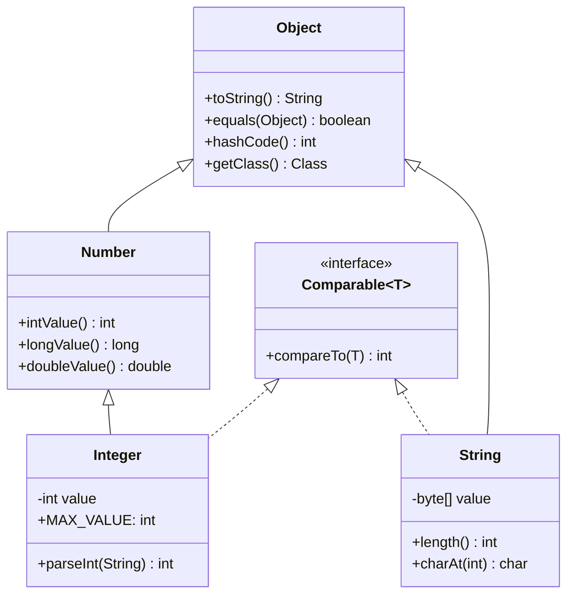

## WHY

Java's type system is the first line of defense against entire categories of production bugs. Before statically-typed languages became dominant, dynamically-typed languages let you call any method on any object — discovering the error only at runtime, often in production, often in a critical path. Java's type system, enforced entirely at compile time, makes type errors impossible to deploy. A `NullPointerException` is not a type error — it's a runtime failure of a valid type.

The critical distinction that traps intermediate engineers is **the difference between the declared type and the runtime type**. A variable declared as `List<String>` might at runtime hold an `ArrayList<String>`, a `LinkedList<String>`, or a `Collections.unmodifiableList(...)` proxy — and the behavior can differ dramatically. This is the foundation of polymorphism but also the source of `ClassCastException` bugs when engineers make incorrect assumptions about the runtime type and cast unsafely.

The production failure mode is **type erasure in generics**. Java generics are compile-time only — at runtime, `List<String>` and `List<Integer>` are both just `List`. This means you cannot create generic arrays (`new T[10]` is illegal), cannot check instanceof against parameterized types (`list instanceof List<String>` doesn't compile), and can create "heap pollution" through unchecked casts that bypass compile-time safety. Heap pollution caused real production bugs in frameworks: a `List<String>` returned from an unchecked API call secretly contained `Integer` objects, throwing `ClassCastException` not at the cast site but hundreds of lines later in a completely different method — making the bug nearly impossible to trace.

Understanding Java's full type system — value types vs. reference types, widening vs. narrowing conversions, type erasure, and the Liskov substitution principle in practice — is mandatory for designing robust APIs, debugging generics-related issues, and understanding frameworks like Spring and Hibernate that rely heavily on reflection and generic type metadata.

## THEORY

### Java Type Hierarchy



### Reference Types vs. Value Types

| Aspect | Primitive (value type) | Reference type |
|--------|----------------------|----------------|
| Storage | Stack (direct value) | Heap (object); stack holds address |
| Default value | `0`, `false`, `'\0'` | `null` |
| Passed to methods | By value (copy) | Reference by value (address copy) |
| `==` compares | Values | Memory addresses |
| Can be `null` | No | Yes |
| Performance | Fast (no GC, no indirection) | Slower (GC, pointer chase) |

### Widening and Narrowing Conversions

```
Widening (automatic, safe, no data loss):
byte → short → int → long → float → double
                  char ↗

Narrowing (requires explicit cast, may lose data):
double → float → long → int → short → byte
                         ↘ char
```

**Widening example:**
```java
int i = 42;
double d = i;    // widening — automatic, safe
long l = i;      // widening — automatic
```

**Narrowing example:**
```java
double d = 3.99;
int i = (int) d;   // narrowing — truncates to 3, NOT rounded!
byte b = (byte) 200; // narrowing — 200 > 127, wraps to -56!
```

### Type Erasure — The Generics Gotcha

Java generics are a **compile-time fiction**. The JVM only sees raw types at runtime:

```
Compile time:  List<String>   List<Integer>   Map<String, List<Integer>>
Runtime:       List           List            Map
```

This means:
1. You cannot instantiate generic types: `new T()` is illegal
2. You cannot create generic arrays: `new T[10]` is illegal
3. `instanceof` against parameterized types doesn't compile: `x instanceof List<String>` → error
4. Unchecked casts can create heap pollution

```java
// Heap pollution — compiles with warning, fails at runtime in a DIFFERENT location
@SuppressWarnings("unchecked")
static <T> List<T> unsafeList(List<?> raw) {
    return (List<T>) raw;  // compiles, but dangerous
}

List<Integer> ints = List.of(1, 2, 3);
List<String> strings = unsafeList(ints);  // no error here
String s = strings.get(0);  // ClassCastException HERE — far from the bug!
```

### Common Misconception

> "Java is pass-by-reference for objects."

**Reality:** Java is *always* pass-by-value. For objects, the *value* passed is the reference (memory address). You can mutate the object at that address, but you cannot change what the caller's variable points to. This distinction matters: `person.setName("Bob")` works, but `person = new Person("Bob")` inside a method does NOT affect the caller's `person` variable.

## VISUALIZATION_CONFIG

```json
{ "component": "UmlClassDiagram", "state": "java-mastery-data-types" }
```

## CODE

### Level 1 — Beginner: Reference Types, null, and Type Casting

```java
public class ReferenceTypeBasics {
    public static void main(String[] args) {
        // Reference types default to null if not initialized as instance fields
        String name = null;
        Integer count = null;

        // Null check before use — prevent NullPointerException
        if (name != null) {
            System.out.println("Length: " + name.length());
        }

        // instanceof — safe type check before cast
        Object obj = "Hello, Java!";
        if (obj instanceof String s) {  // Pattern matching instanceof (Java 16+)
            System.out.println("Upper: " + s.toUpperCase());
        }

        // Upcasting — always safe (subtype to supertype)
        String str = "Hello";
        Object upcast = str;   // String → Object — implicit, always safe

        // Downcasting — requires explicit cast, can throw ClassCastException
        Object data = "World";
        String downcast = (String) data;  // safe here, but check first in production
        System.out.println(downcast.length());  // 5

        // Widening numeric conversion — automatic
        int intVal = 42;
        long longVal = intVal;    // widened automatically
        double dblVal = intVal;   // widened automatically
        System.out.println("long: " + longVal + ", double: " + dblVal);
    }
}
```

### Level 2 — Intermediate: Generics and Type Erasure Effects

```java
import java.util.*;

public class GenericsAndErasure {

    // Wildcard: List<? extends Number> accepts List<Integer>, List<Double>, etc.
    // Can read as Number, cannot write (type-safe covariance)
    public static double sumList(List<? extends Number> numbers) {
        return numbers.stream()
            .mapToDouble(Number::doubleValue)
            .sum();
    }

    // Lower bounded wildcard: List<? super Integer> accepts List<Integer>, List<Number>, List<Object>
    // Can write Integer, cannot safely read (type-safe contravariance)
    public static void addIntegers(List<? super Integer> list, int count) {
        for (int i = 0; i < count; i++) list.add(i);
    }

    // Type token pattern — preserve generic type info that erasure destroys
    public static <T> T deserialize(String json, Class<T> type) {
        // Class<T> carries runtime type info that T alone doesn't
        System.out.println("Deserializing to: " + type.getSimpleName());
        return null; // simplified
    }

    public static void main(String[] args) {
        List<Integer> ints = Arrays.asList(1, 2, 3, 4, 5);
        List<Double> doubles = Arrays.asList(1.5, 2.5, 3.5);

        System.out.println("Sum ints: " + sumList(ints));      // 15.0
        System.out.println("Sum doubles: " + sumList(doubles)); // 7.5

        List<Number> numbers = new ArrayList<>();
        addIntegers(numbers, 3);  // adds 0, 1, 2 as Integer objects
        System.out.println("Numbers: " + numbers);

        // Type erasure in action: both are just List at runtime
        List<String> stringList = new ArrayList<>();
        List<Integer> intList = new ArrayList<>();
        System.out.println("Same type at runtime? " +
            (stringList.getClass() == intList.getClass()));  // true!
    }
}
```

### Level 3 — Advanced: Variance, Type Bounds, and Reflection-Based Type Retrieval

```java
import java.lang.reflect.*;
import java.util.*;
import java.util.function.*;

public class AdvancedTypes {

    /**
     * Generic stack with bounded type parameter.
     * T extends Comparable ensures we can sort elements.
     */
    static class SortedStack<T extends Comparable<T>> {
        private final List<T> elements = new ArrayList<>();

        public void push(T item) {
            elements.add(item);
            Collections.sort(elements);  // maintained sorted via Comparable
        }

        public T pop() {
            if (elements.isEmpty()) throw new NoSuchElementException("Stack is empty");
            return elements.remove(elements.size() - 1);  // largest element
        }

        public T peek() {
            if (elements.isEmpty()) throw new NoSuchElementException("Stack is empty");
            return elements.get(elements.size() - 1);
        }
    }

    /**
     * Recover generic type info at runtime using reflection.
     * Used by Jackson, Gson, Spring for generic deserialization.
     */
    static abstract class TypeToken<T> {
        private final Type type;

        protected TypeToken() {
            // Trick: capture the generic supertype via reflection
            Type superType = getClass().getGenericSuperclass();
            this.type = ((ParameterizedType) superType).getActualTypeArguments()[0];
        }

        public Type getType() { return type; }
        public String getTypeName() { return type.getTypeName(); }
    }

    public static void main(String[] args) {
        var stack = new SortedStack<Integer>();
        stack.push(5); stack.push(1); stack.push(3);
        System.out.println("Pop: " + stack.pop()); // 5 (largest)
        System.out.println("Peek: " + stack.peek()); // 3

        // TypeToken captures List<String> type info despite erasure
        var token = new TypeToken<List<String>>() {};
        System.out.println("Type: " + token.getTypeName()); // java.util.List<java.lang.String>

        // Demonstrate: cannot use instanceof with parameterized types
        List<String> strings = new ArrayList<>();
        System.out.println(strings instanceof List);    // ✅ works
        // System.out.println(strings instanceof List<String>); // ❌ compile error
    }
}
```

### Level 4 — Expert / Production: Generic Repository Pattern with Type Safety

```java
import java.util.*;
import java.util.concurrent.ConcurrentHashMap;
import java.util.function.*;

/**
 * Type-safe generic repository using bounded wildcards, type tokens,
 * and the Liskov substitution principle.
 *
 * Pattern used by Spring Data, JPA implementations, and ORM frameworks.
 */
public class TypeSafeRepository {

    /** Base entity type — all persisted objects must extend this */
    public abstract static class Entity {
        private final UUID id;
        protected Entity() { this.id = UUID.randomUUID(); }
        public UUID getId() { return id; }
    }

    /**
     * Generic repository interface following Liskov Substitution Principle.
     * Any concrete implementation MUST honor all contracts.
     */
    public interface Repository<T extends Entity, ID> {
        void save(T entity);
        Optional<T> findById(ID id);
        List<T> findAll();
        void delete(ID id);
        long count();
    }

    /**
     * In-memory implementation — type-safe via generics.
     * The Class<T> type token is needed because T is erased at runtime.
     */
    public static class InMemoryRepository<T extends Entity>
            implements Repository<T, UUID> {

        private final ConcurrentHashMap<UUID, T> store = new ConcurrentHashMap<>();
        private final Class<T> entityType;  // type token — preserves runtime type info

        public InMemoryRepository(Class<T> entityType) {
            this.entityType = entityType;
        }

        @Override
        public void save(T entity) {
            Objects.requireNonNull(entity, "entity must not be null");
            store.put(entity.getId(), entity);
        }

        @Override
        public Optional<T> findById(UUID id) {
            return Optional.ofNullable(store.get(id));
        }

        @Override
        public List<T> findAll() {
            return Collections.unmodifiableList(new ArrayList<>(store.values()));
        }

        @Override
        public void delete(UUID id) {
            store.remove(id);
        }

        @Override
        public long count() {
            return store.size();
        }

        /** Type-safe filtered query — returns only matching entities */
        public List<T> findWhere(Predicate<T> predicate) {
            return store.values().stream()
                    .filter(predicate)
                    .toList();
        }

        /** Safely cast a raw object to this repository's type — using the Class token */
        public Optional<T> tryAdapt(Object obj) {
            if (entityType.isInstance(obj)) {
                return Optional.of(entityType.cast(obj));  // safe cast using type token
            }
            return Optional.empty();
        }
    }

    // Domain entity
    public static class User extends Entity {
        private final String email;
        private final String role;

        public User(String email, String role) {
            super();
            this.email = email;
            this.role = role;
        }

        public String getEmail() { return email; }
        public String getRole() { return role; }

        @Override
        public String toString() {
            return "User{id=" + getId() + ", email=" + email + ", role=" + role + "}";
        }
    }

    public static void main(String[] args) {
        // Type token ensures runtime safety
        var userRepo = new InMemoryRepository<>(User.class);

        var alice = new User("alice@example.com", "admin");
        var bob   = new User("bob@example.com", "user");
        var carol = new User("carol@example.com", "admin");

        userRepo.save(alice);
        userRepo.save(bob);
        userRepo.save(carol);

        System.out.println("Count: " + userRepo.count());  // 3
        userRepo.findById(alice.getId()).ifPresent(u -> System.out.println("Found: " + u));

        var admins = userRepo.findWhere(u -> "admin".equals(u.getRole()));
        System.out.println("Admins: " + admins.size());  // 2

        userRepo.delete(bob.getId());
        System.out.println("After delete: " + userRepo.count());  // 2
    }
}
```

## REAL_WORLD

### How Jackson Handles Generic Type Erasure

Jackson — the most-used Java JSON library (3.5 billion downloads/month) — uses a `TypeReference<T>` pattern to work around type erasure. When you call `objectMapper.readValue(json, new TypeReference<List<User>>(){})`, Jackson uses reflection to extract the actual type argument `List<User>` from the anonymous subclass's generic supertype, bypassing erasure. Without this trick, you'd get a `List` of `LinkedHashMap` objects instead of `List<User>` — which is the most common Jackson beginner mistake.

```java
import com.fasterxml.jackson.core.type.TypeReference;
import com.fasterxml.jackson.databind.ObjectMapper;
import java.util.List;

public class JacksonTypeExample {
    private static final ObjectMapper mapper = new ObjectMapper();

    // ❌ Returns List<LinkedHashMap<String, Object>> — NOT List<User>
    @SuppressWarnings("unchecked")
    public static List<User> deserializeWrong(String json) throws Exception {
        return (List<User>) mapper.readValue(json, List.class);  // erased to List
    }

    // ✅ Returns List<User> correctly — TypeReference captures generic type at compile time
    public static List<User> deserializeCorrect(String json) throws Exception {
        return mapper.readValue(json, new TypeReference<List<User>>() {});
        // Anonymous subclass trick: TypeReference captures List<User> in its generic supertype
        // Jackson reads: getClass().getGenericSuperclass() → TypeReference<List<User>>
        // Then: ((ParameterizedType)...).getActualTypeArguments()[0] → List<User>
    }

    record User(String email, String role) {}
}
```

### Production Gotcha: ClassCastException from Heap Pollution

```java
// ❌ DANGEROUS — unchecked cast creates heap pollution
// ClassCastException thrown far from the cause
@SuppressWarnings("unchecked")
public static <T> T unsafeCast(Object obj) {
    return (T) obj;  // no runtime check — T is erased!
}

// In service code, appears to work:
Integer value = unsafeCast("not an integer");  // No exception here!

// Exception thrown 100 lines later in a completely different method:
int doubled = value * 2;  // ClassCastException: String cannot be cast to Integer
// Stack trace doesn't mention unsafeCast at all!

// ✅ PRODUCTION-SAFE — always use a Class<T> type token for safe runtime casts
public static <T> Optional<T> safeCast(Object obj, Class<T> type) {
    return type.isInstance(obj) ? Optional.of(type.cast(obj)) : Optional.empty();
}

Optional<Integer> safe = safeCast("not an integer", Integer.class);
// safe.isEmpty() == true — no exception, explicit handling
```

**Why it happens:** Java generics are compile-time only — the type parameter `T` in `(T) obj` is completely invisible at runtime. The JVM sees `(Object) obj` (a no-op cast), which always succeeds. The actual cast happens at the use site where the receiver variable has a concrete type.

### Performance Characteristics

| Operation | Cost | Notes |
|-----------|------|-------|
| Widening cast (e.g., `int` → `long`) | 0 cycles | Compile-time, no runtime instruction |
| Narrowing cast (e.g., `double` → `int`) | 1-2 cycles | Single CPU truncation instruction |
| `instanceof` check | 3-10 cycles | Class identity comparison |
| `instanceof` with pattern matching | 3-10 cycles | Same as instanceof + local assignment |
| Reflection `Class.isInstance()` | 5-20 cycles | More expensive than direct instanceof |
| Generic type argument retrieval (reflection) | ~1000 cycles | One-time cost; cache in field |

## INTERVIEW

**Q1 (Junior): What is the difference between a reference type and a primitive type in Java?**
A: A primitive type stores its value directly — `int x = 42` puts the number 42 directly in the variable's memory location (on the stack for local variables). A reference type stores the memory address of an object on the heap — `String s = "Hello"` stores the address of the String object in the variable. This means: primitives can never be `null` (they always have a value), primitives are compared with `==` by value, and primitives don't have methods. Reference types can be `null` (indicating "no object"), are compared with `==` by address (use `.equals()` for value equality), and have methods. Primitives are stored on the stack and never GC'd; reference type objects live on the heap and are subject to garbage collection.

**Q2 (Junior): What is a `ClassCastException` and when does it occur?**
A: A `ClassCastException` occurs when you attempt to cast an object to a type it does not actually implement or extend. For example, casting a `String` to `Integer` via `(Integer) "hello"` will throw `ClassCastException` at runtime. The most insidious version happens with generics due to type erasure: an unchecked cast like `(List<String>) rawList` succeeds at the cast site (because the JVM sees it as `(List) rawList`), but throws `ClassCastException` later when you try to use a element as a `String`. Always use `instanceof` to check before casting, or use pattern-matching instanceof (`if (obj instanceof String s)`) to combine the check and cast safely.

**Q3 (Mid): What is type erasure and what are its practical implications?**
A: Java generics are implemented via type erasure — the compiler uses generic type information for compile-time type checking but removes it before generating bytecode. At runtime, `List<String>`, `List<Integer>`, and `List` are all identical `List` classes. Practical implications: (1) you cannot instantiate generic types (`new T()` is illegal), (2) you cannot create generic arrays (`new T[10]` is illegal), (3) `instanceof` checks cannot use parameterized types, (4) you need `Class<T>` type tokens to preserve type information for runtime use (Jackson's `TypeReference`, Spring's `ParameterizedTypeReference`), and (5) heap pollution is possible through unchecked casts that bypass compile-time safety.

**Q4 (Mid): What is the PECS rule and when do you use each wildcard?**
A: PECS stands for "Producer Extends, Consumer Super." Use `? extends T` (upper bounded wildcard) when you're reading from a generic structure — a `List<? extends Number>` produces numbers you can read as `Number`. Use `? super T` (lower bounded wildcard) when you're writing to a generic structure — a `List<? super Integer>` consumes integers you can write as `Integer`. The classic example is `Collections.copy(List<? super T> dest, List<? extends T> src)` — `src` produces T's (extends), `dest` consumes T's (super). Using the wrong wildcard makes perfectly valid operations fail at compile time, which is the most common generics usability complaint.

**Q5 (Senior): How would you recover generic type information that was erased?**
A: The standard pattern is the **type token** or **super-type token**: create an anonymous subclass with the generic type as a type parameter, then use `getClass().getGenericSuperclass()` via reflection to retrieve the `ParameterizedType`. For example, `new TypeReference<List<User>>() {}` creates an anonymous class whose generic supertype is `TypeReference<List<User>>`, which reflection can read at runtime despite erasure. Jackson's `TypeReference`, Gson's `TypeToken`, and Guava's `TypeToken` all use this exact pattern. In Spring, `ParameterizedTypeReference<List<User>>` uses the same mechanism for `RestTemplate` and `WebClient` response type declarations.

**Q6 (Senior): Explain why Java is pass-by-value and what this means for objects.**
A: Java is always pass-by-value — the value of the variable is copied into the parameter. For primitives, the value IS the data (e.g., the integer 42). For reference types, the value IS the memory address (e.g., 0x7f3b2a00). So when you pass an object to a method, the method receives a copy of the address — it can navigate to the same object and mutate it (the mutation is visible to the caller), but it cannot change which object the caller's variable points to. `list.add(item)` inside a method mutates the shared list; `list = new ArrayList<>()` inside a method is invisible to the caller. This is often called "pass-by-reference-value" or "call-by-sharing" in academic literature.

**Q7 (Senior+): How does Spring's dependency injection handle type resolution for generic beans?**
A: Spring 4.0+ supports injection of generic beans based on their type parameters, using `ResolvableType` — a wrapper around Java's reflection `Type` that understands parameterized types despite erasure. When you declare `@Autowired List<Order> orders` in a Spring bean, Spring's `AutowiredAnnotationBeanPostProcessor` uses `ResolvableType.forField(field)` to extract `List<Order>` as a `ParameterizedType`, then searches the bean factory for beans that are assignable to `Order`. This is why you can have multiple `Repository<User>` and `Repository<Product>` beans and Spring correctly injects the right one — it resolves generic type parameters at injection time using the same super-type-token pattern.

## FEYNMAN CHECK

### Explain Java's Type System Like I'm 10 Years Old

> Imagine every object in Java is a package in a warehouse. The **type** is like the label on the package — it tells you what's inside and what you're allowed to do with it. A `String` package contains text, so you can call `length()` on it. A `List<String>` package contains a bunch of text packages. Now here's the tricky part: **generics** are like labels that get peeled off before the package leaves the warehouse (that's type erasure). At runtime, every `List<String>` and `List<Integer>` just says "List" — the `<String>` and `<Integer>` labels were peeled off by the compiler. This is why you can't ask "is this a `List<String>`?" at runtime — you'd have to ask "is this a `List`?" instead. This is why ClassCastExceptions happen in weird places: the cast succeeds but the wrong type of object sneaks in through a back door.

---

### 5 Deep Conceptual Questions

**Q1: Why does Java use type erasure instead of reified generics (like C# does)?**
> **A:** Java introduced generics in Java 5 (2004) with the explicit goal of backward compatibility — existing bytecode (`List`, `HashMap`, etc.) had to continue working unchanged. Reifying generics (as C# did by rebuilding its runtime in version 2.0) would have required a completely new JVM and broken all existing Java libraries. Type erasure let Sun add generics to the language layer while leaving the JVM unchanged: the compiler inserts type checks and casts where needed, but the runtime is unmodified. The cost was the set of limitations we live with today: no `new T()`, no `T[]`, no `instanceof T`. Project Valhalla (Java's long-running research project) aims to fix this with value types and possibly reified generics, but backward compatibility remains the constraint.

**Q2: What is the mental model that makes wildcard variance click?**
> **A:** The key insight is that `List<Dog>` is NOT a subtype of `List<Animal>` — even though `Dog` is a subtype of `Animal`. If it were, you could do: `List<Animal> animals = dogs; animals.add(new Cat());` — and now `dogs` contains a Cat! Java prevents this with invariant generics. Wildcards restore flexibility with safety constraints: `List<? extends Animal>` is a "read-only view" — you can get `Animal` objects but you can't add because you don't know the exact type. `List<? super Dog>` is a "write-only view" — you can add `Dog` objects but you can't safely get because the element type might be broader than Dog. Producer Extends, Consumer Super.

**Q3: What is the most dangerous consequence of heap pollution? Show it with code.**
> **A:** Heap pollution means a variable of generic type contains an object of the wrong type — and the ClassCastException is thrown far from where the pollution was introduced.
> ```java
> // ❌ Heap pollution via unchecked cast
> @SuppressWarnings("unchecked")
> public static List<String> pollute() {
>     List rawList = new ArrayList();
>     rawList.add(42);  // adding Integer to raw List
>     return (List<String>) rawList;  // no exception here — just a warning
> }
>
> // Called from completely unrelated code:
> List<String> strings = pollute();
> for (String s : strings) {
>     System.out.println(s.toUpperCase()); // ClassCastException: Integer cannot be cast to String
>     // Stack trace shows THIS line — nothing about pollute()!
> }
> ```

**Q4: How does the declared type vs. runtime type distinction affect polymorphism?**
> **A:** The declared type determines what methods you can *call* at compile time (method signatures visible). The runtime type determines *which implementation* runs at method dispatch. This is dynamic dispatch — the core of polymorphism. `List<String> list = new LinkedList<>()` means the variable declared as `List` can only call `List` methods, but calls to `add()` dispatch to `LinkedList.add()` at runtime. The runtime type also determines instanceof results: `list instanceof LinkedList` is `true` even though the declared type is `List`. This is why programming to interfaces (`List` not `ArrayList`) is the correct style — you can swap implementations without changing calling code.

**Q5: Write a one-sentence definition of Java's type system that a senior FAANG engineer would find precise.**
> **A:** "Java's type system is a statically-verified, nominally-typed, single-rooted class hierarchy with erased-at-runtime parametric generics, which provides compile-time type safety for generic containers at the cost of reification — preventing runtime generic type checks and generic array creation — while the JVM's dynamic dispatch and interface polymorphism enable the Liskov Substitution Principle to be verified by the runtime rather than the compiler, which is why the gap between declared type and runtime type is the source of both polymorphism's power and ClassCastException's confusion."

## BUILD

### 🏗️ Mini Project: Type-Safe Event Bus with Generic Dispatch

**What you will build:** A generic event bus that dispatches events to type-safe handlers using generics, wildcards, and Class type tokens — showing all key type system concepts in a real pattern.
**Why this project:** Forces you to confront type tokens, wildcard variance, type-safe heterogeneous containers, and the practical limits of type erasure.
**Time estimate:** 30 minutes

---

#### Step 1 — Project Setup

```bash
mkdir event-bus && cd event-bus
mkdir -p src/main/java/com/events
touch src/main/java/com/events/EventBus.java
touch src/main/java/com/events/EventBusTest.java
```

#### Step 2 — Core Implementation

```java
package com.events;

import java.util.*;
import java.util.concurrent.ConcurrentHashMap;
import java.util.function.Consumer;

/**
 * Type-safe event bus using Class<T> tokens and wildcard containers.
 *
 * Type system concepts used:
 *   - Class<T>: runtime type token to work around erasure
 *   - List<? super T>: wildcard (handlers can handle supertypes too)
 *   - ConcurrentHashMap: thread-safe heterogeneous type container
 */
public class EventBus {

    // Type-safe heterogeneous container:
    // Map key is Class<T>, value is List of handlers for T
    // Raw types needed here due to erasure — safety enforced by put/get methods
    @SuppressWarnings("rawtypes")
    private final Map<Class, List<Consumer>> handlers = new ConcurrentHashMap<>();

    /**
     * Register a handler for events of exactly type T.
     * Class<T> token preserves type info at runtime despite erasure.
     */
    public <T> void subscribe(Class<T> eventType, Consumer<T> handler) {
        handlers.computeIfAbsent(eventType, k -> new ArrayList<>()).add(handler);
    }

    /**
     * Publish an event to all registered handlers for its exact runtime type.
     * Uses getClass() to find the runtime type — not the declared type.
     */
    @SuppressWarnings("unchecked")
    public <T> void publish(T event) {
        Objects.requireNonNull(event, "event must not be null");
        Class<?> eventType = event.getClass();  // runtime type, not declared type
        List<Consumer> eventHandlers = handlers.getOrDefault(eventType, List.of());
        for (Consumer handler : eventHandlers) {
            handler.accept(event);  // unchecked, but safe by construction (see subscribe)
        }
    }

    public int handlerCount(Class<?> eventType) {
        return handlers.getOrDefault(eventType, List.of()).size();
    }
}
```

#### Step 3 — Domain Events and Usage

```java
package com.events;

// Domain events — strongly typed
public record UserCreatedEvent(String userId, String email) {}
public record OrderPlacedEvent(String orderId, double total) {}
public record PaymentFailedEvent(String orderId, String reason) {}

// Usage
EventBus bus = new EventBus();

bus.subscribe(UserCreatedEvent.class, e ->
    System.out.println("Welcome email sent to: " + e.email()));

bus.subscribe(OrderPlacedEvent.class, e ->
    System.out.println("Processing order: " + e.orderId() + " ($" + e.total() + ")"));

bus.subscribe(PaymentFailedEvent.class, e ->
    System.out.println("Payment failed for " + e.orderId() + ": " + e.reason()));

bus.publish(new UserCreatedEvent("u001", "alice@example.com"));
bus.publish(new OrderPlacedEvent("ord-42", 99.99));
bus.publish(new PaymentFailedEvent("ord-43", "insufficient funds"));
```

#### Step 4 — Error Handling & Edge Cases

```java
// Add to EventBus
public <T> void publishSafely(T event) {
    try {
        publish(event);
    } catch (Exception e) {
        System.err.println("Handler failed for " + event.getClass().getSimpleName()
            + ": " + e.getMessage());
    }
}

public <T> void unsubscribeAll(Class<T> eventType) {
    handlers.remove(eventType);
}
```

#### Step 5 — Tests

```java
package com.events;

import org.junit.jupiter.api.Test;
import java.util.ArrayList;
import static org.junit.jupiter.api.Assertions.*;

class EventBusTest {
    @Test
    void handlerReceivesCorrectEventType() {
        var bus = new EventBus();
        var received = new ArrayList<UserCreatedEvent>();
        bus.subscribe(UserCreatedEvent.class, received::add);
        bus.publish(new UserCreatedEvent("u1", "test@test.com"));
        assertEquals(1, received.size());
        assertEquals("u1", received.get(0).userId());
    }

    @Test
    void differentTypesDoNotCrossFire() {
        var bus = new EventBus();
        var orders = new ArrayList<OrderPlacedEvent>();
        var users = new ArrayList<UserCreatedEvent>();
        bus.subscribe(OrderPlacedEvent.class, orders::add);
        bus.subscribe(UserCreatedEvent.class, users::add);
        bus.publish(new OrderPlacedEvent("o1", 50.0));
        assertEquals(1, orders.size());
        assertEquals(0, users.size());  // UserCreated handler not triggered
    }

    @Test
    void multipleHandlersSameType() {
        var bus = new EventBus();
        int[] callCount = {0};
        bus.subscribe(UserCreatedEvent.class, e -> callCount[0]++);
        bus.subscribe(UserCreatedEvent.class, e -> callCount[0]++);
        bus.publish(new UserCreatedEvent("u1", "a@b.com"));
        assertEquals(2, callCount[0]);
    }
}
```

**Expected Output:**
```
Welcome email sent to: alice@example.com
Processing order: ord-42 ($99.99)
Payment failed for ord-43: insufficient funds
```

**Stretch Challenges:**
- [ ] Add hierarchy-aware dispatch so a handler for `Event` receives all subtype events
- [ ] Add async event delivery using `CompletableFuture` and an `ExecutorService`
- [ ] Implement dead-letter queue for events with no registered handlers

## SPACED REVIEW

> **How to use:** Answer from memory before reading ahead.

---

### Day 1 — Recall

**Q1:** Explain the difference between a reference type and a primitive type in Java. Include: storage location, default value, `==` semantics, and nullability.

**Q2:** What is type erasure? Name 3 things you cannot do in Java because of type erasure.

**Q3:** Write a code snippet demonstrating widening conversion, narrowing conversion (with data loss), and pattern-matching instanceof.

---

### Day 3 — Comprehension

**Q4:** What is the PECS rule? Write a method `copy(List<? super T> dest, List<? extends T> src)` and explain why each wildcard is needed.

**Q5:** What is heap pollution? Show code that creates heap pollution and explain why the ClassCastException appears far from the source.

**Q6:** Is Java pass-by-value or pass-by-reference? Write a method that demonstrates: (a) mutating an object parameter (visible to caller) and (b) reassigning a parameter (invisible to caller).

---

### Day 7 — Application

**Q7:** Implement a `TypeSafeMap` that stores values by their `Class<T>` key, with a `get(Class<T>)` method that returns `Optional<T>` — all without unchecked cast warnings.

**Q8:** A team returns `List<Object>` from a JSON parser and downstream code does `(List<String>) result`. The code works 99% of the time but occasionally throws ClassCastException in production. Explain the root cause and the correct fix.

**Q9:** What is the relationship between `List<Dog>`, `List<Animal>`, and `List<? extends Animal>`? Draw the type lattice and explain why `List<Dog>` is NOT a `List<Animal>`.

---

### Day 14 — Synthesis & Interview Prep

**Q10:** ★ Classic interview: *"Why doesn't `List<Dog>` implement `List<Animal>` even though `Dog` extends `Animal`? Why would this be dangerous?"*

**Q11:** Draw the type hierarchy for `ArrayList<String>` — showing all interfaces and classes it implements/extends, up to `Object`.

**Q12:** ★ System design: *"You're building a plugin system where plugins register handlers for typed events. How do you design the dispatch mechanism to be type-safe at compile time AND at runtime, despite Java's type erasure?"*
