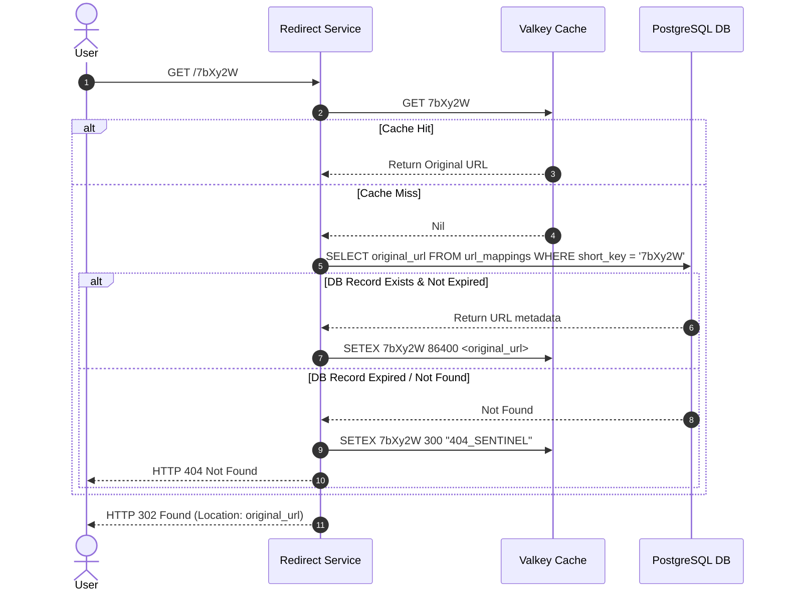
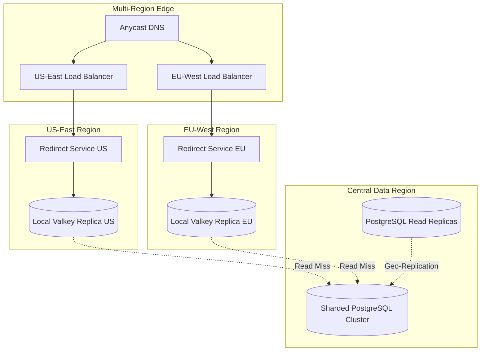

# Design a URL Shortener (bit.ly) | Level: 5

## 1. Requirements Gathering

In a system design interview, starting with assumptions is a common pitfall. We must ask precise, clarifying questions to discover the operational boundaries, data lifecycle requirements, and performance guarantees of our URL shortener.

```
┌────────────────────────────────────────────────────────────────────────┐
│                        REQUIREMENTS GATHERING                          │
├───────────────────────────────────┬────────────────────────────────────┤
│ Candidate Clarifying Questions    │ Interviewer Responses & Decoded    │
│                                   │ Requirements                       │
├───────────────────────────────────┼────────────────────────────────────┤
│ Q: What characters are allowed in │ A: Alphanumeric only [a-z, A-Z,    │
│ the shortened URL?                │ 0-9]. Case-sensitive.              │
├───────────────────────────────────┼────────────────────────────────────┤
│ Q: What is the default expiration │ A: 5 years default. Users can set  │
│ policy of a shortened link?       │ custom expiration or none.         │
├───────────────────────────────────┼────────────────────────────────────┤
│ Q: Can users request custom       │ A: Yes, custom aliases up to 16    │
│ aliases?                          │ characters are supported.          │
├───────────────────────────────────┼────────────────────────────────────┤
│ Q: Do we need real-time analytics │ A: Yes, click counts, geolocations,│
│ or is batch processing acceptable?│ referrers. Latency must remain low.│
├───────────────────────────────────┼────────────────────────────────────┤
│ Q: What are the latency and SLA   │ A: Redirect latency <10ms p99.     │
│ targets for the redirect path?    │ High availability (99.99% uptime). │
└───────────────────────────────────┴────────────────────────────────────┘
```

### Functional Requirements
* **Core Shortening**: Given a long URL, the system must return a unique, shortened URL (e.g., `https://short.ly/7bXy2W`).
* **Redirection**: Accessing the shortened URL must perform an HTTP redirection (301 or 302) to the original long URL.
* **Custom Aliases**: Users can specify custom short paths (e.g., `https://short.ly/my-custom-link`).
* **Link Expiration**: Links must expire after a configurable TTL (Default: 5 years).
* **Analytics**: Track click events, including timestamp, referrer, user agent, and IP-derived geolocation.

### Non-Functional Requirements
* **High Availability**: $99.99\%$ uptime for the redirection path. Link lookup must not fail even if analytics databases are down.
* **Low Latency**: The redirection path is read-heavy. The p99 latency for redirection must be $<10\text{ms}$.
* **Scalability**: Must support $100\text{M}$ new URLs created per day and a $10:1$ read-to-write ratio ($1\text{B}$ redirections per day).
* **Uniqueness & Unpredictability**: Shortened links must not be easily guessable (to prevent malicious scrapers from crawling all shortened links sequentially).

---

## 2. Back-of-the-Envelope Estimation

To design a system of this scale, we must translate the high-level traffic figures into concrete infrastructure parameters: QPS, network bandwidth, storage capacity, and memory footprints.

### Traffic Estimations
* **Write Path (Shortening)**:
  $$\text{Write QPS} = \frac{100,000,000 \text{ URLs}}{86,400 \text{ seconds}} \approx 1,157 \text{ writes/sec}$$
  $$\text{Peak Write QPS} \approx 1,157 \times 3 \approx 3,471 \text{ writes/sec}$$

* **Read Path (Redirection)**:
  $$\text{Read QPS} = \frac{1,000,000,000 \text{ Redirects}}{86,400 \text{ seconds}} \approx 11,574 \text{ reads/sec}$$
  $$\text{Peak Read QPS} \approx 11,574 \times 3 \approx 34,722 \text{ reads/sec}$$

### Storage Estimations
Let us assume each record contains:
* `short_url` (hash/alias): $7 \text{ bytes}$
* `original_url`: $500 \text{ bytes}$ (average)
* `user_id`: $8 \text{ bytes}$ (64-bit integer)
* `created_at`: $8 \text{ bytes}$ (timestamp)
* `expires_at`: $8 \text{ bytes}$ (timestamp)
* **Total per record**: $\approx 531 \text{ bytes}$. Let's round up to $600 \text{ bytes}$ to account for database overhead and indexes.

* **Daily Storage Accumulation**:
  $$\text{Daily Storage} = 100\text{M} \times 600 \text{ bytes} = 60 \text{ GB/day}$$

* **5-Year Storage Capacity**:
  $$\text{5-Year Storage} = 60 \text{ GB/day} \times 365 \times 5 \approx 109.5 \text{ TB}$$

### Bandwidth Estimations
* **Ingress (Write Path)**:
  $$\text{Ingress} = 1,157 \text{ writes/sec} \times 600 \text{ bytes} \approx 694.2 \text{ KB/s}$$

* **Egress (Read Path)**:
  $$\text{Egress} = 11,574 \text{ reads/sec} \times 600 \text{ bytes} \approx 6.94 \text{ MB/s}$$

### Cache Memory Estimations
Applying the Pareto Principle ($80/20$ rule), $20\%$ of the shortened URLs generate $80\%$ of the redirect traffic. We want to cache this hot $20\%$ of active redirects.
* **Daily Active Hot Keys**:
  $$\text{Daily Read Requests} = 1\text{B}$$
  $$\text{Unique Hot URLs to Cache} = 1\text{B} \times 20\% = 200\text{M}$$
  $$\text{Cache Memory Required} = 200,000,000 \times 600 \text{ bytes} \approx 120 \text{ GB}$$

*This $120\text{ GB}$ memory footprint can easily fit into a single high-memory Redis/Valkey node, but we will use a cluster for replication and high availability.*

---

## 3. High-Level Architecture & Component Projections

To handle the scale while ensuring sub-10ms read latencies, we must decouple the read path from the write path. Below is the system architecture.

```mermaid
graph TD
    User([User / Client]) -->|1. Shorten / Redirect| ALB[Application Load Balancer]
    
    subgraph Write Path [Write Path - Shortening]
        ALB -->|POST /api/v1/shorten| ShortenService[Shorten Service]
        ShortenService -->|Get Unique ID| IDGen[Distributed ID Generator]
        ShortenService -->|Write Metadata| DB[(PostgreSQL Cluster)]
        ShortenService -->|Invalidate/Write| Cache[(Valkey Cache Cluster)]
    end

    subgraph Read Path [Read Path - Redirection]
        ALB -->|GET /{short_url}| RedirectService[Redirect Service]
        RedirectService -->|1. Read Cache| Cache
        RedirectService -->|2. Cache Miss: Read DB| DB
        RedirectService -->|3. Async Log Event| Kafka[Kafka Click Event Stream]
    end

    subgraph Analytics Pipeline [Analytics Pipeline]
        Kafka -->|Consume Events| StreamProcessor[Flink / Spark Streaming]
        StreamProcessor -->|Aggregated Analytics| ClickHouse[(ClickHouse OLAP Database)]
        AnalyticsService[Analytics API Service] -->|Query| ClickHouse
    end
```

### Component Descriptions
1. **Application Load Balancer (ALB)**: Terminates TLS, handles routing rules (routing `/api/v1/shorten` to the Shorten Service and `/*` to the Redirect Service), and applies rate-limiting policies.
2. **Shorten Service**: Stateless service that processes URL shortening requests, validates custom aliases, requests unique IDs, and persists mappings.
3. **Redirect Service**: Ultra-lightweight, stateless service optimized for high-throughput reads. It looks up the original URL from the cache or database, returns an HTTP redirect response, and publishes access logs to Kafka asynchronously.
4. **Distributed ID Generator**: Generates unique, non-sequential, highly compact 64-bit identifiers.
5. **Valkey / Redis Cache Cluster**: In-memory key-value store containing the mapping of `short_url -> original_url` with an LRU (Least Recently Used) eviction policy.
6. **PostgreSQL Cluster (Primary/Replica with Sharding)**: Relational database storing the permanent mapping records. Sharded by the hash of the generated ID.
7. **Kafka Message Bus**: Buffers click events from the Redirect Service to prevent analytics tracking from slowing down user redirection.
8. **ClickHouse OLAP**: Column-oriented database optimized for real-time analytics queries.

---

## 4. Deep-Dives into Key Sub-Problems

### Deep-Dive 1: Distributed ID Generation & Base62 Encoding

We need to map a long URL to a unique short string. This short string is the Base62 representation of a unique 64-bit integer. Base62 consists of `[0-9, a-z, A-Z]`.

#### Why Base62?
Using a character set of size 62, a string of length $N$ can represent $62^N$ unique values:
* $N = 6 \implies 62^6 \approx 56.8 \text{ Billion}$
* $N = 7 \implies 62^7 \approx 3.52 \text{ Trillion}$

To support our 5-year estimate ($182.5\text{B}$ links) and prevent collision issues, a **7-character short URL** ($3.52\text{ Trillion}$ combinations) is ideal.

#### Generation Strategies

##### Strategy A: Centralized Auto-Increment (UUID/Sequence)
* **UUID**: A 128-bit UUID represented as a string is too long (36 characters).
* **Single Database Auto-Increment**: Creates a single point of failure and bottleneck.

##### Strategy B: Distributed Range Allocator (ZooKeeper)
* A central coordinator (ZooKeeper) manages ranges of IDs (e.g., Node A gets $1 \text{ to } 1,000,000$, Node B gets $1,000,001 \text{ to } 2,000,000$).
* **Pros**: Guaranteed uniqueness, sequential allocation within blocks.
* **Cons**: Introduces ZooKeeper dependency; sequence guessing is trivial.

##### Strategy C: Modified Snowflake ID Generator (Selected Option)
We construct a 64-bit ID utilizing a Snowflake-like layout to ensure uniqueness without central coordination:

```
+-------------------+--------------------------+---------------------+
| 1-bit (Unused: 0) | 41-bit Timestamp (msec)  | 10-bit Machine ID   | 12-bit Sequence     |
+-------------------+--------------------------+---------------------+
```

* **41 bits for epoch millisecond**: Supports $2^{41} / (1000 \times 60 \times 60 \times 24 \times 365) \approx 69.7 \text{ years}$.
* **10 bits for Machine ID**: Supports up to 1024 concurrent generation nodes.
* **12 bits for Sequence**: Generates up to 4096 IDs per millisecond per machine.

**The Obfuscation Step (Preventing Sequential Guessing)**:
If we encode sequential Snowflake IDs directly into Base62, consecutive shortened URLs will look identical (e.g., `a7X8df1`, `a7X8df2`). This allows competitors or scrapers to crawl our database easily. 

To solve this, we pass the 64-bit Snowflake ID through a **Feistel Cipher** (a symmetric block cipher structure) using a secret key to cryptographically shuffle the bits before encoding to Base62. This step is reversible, requiring no storage, and makes the resulting keys appear random.

```python
# Conceptual Feistel Cipher for Bit-Shuffling (64-bit)
def feistel_cipher(val: int, rounds: int = 4) -> int:
    # Split 64-bit int into two 32-bit halves
    left = (val >> 32) & 0xFFFFFFFF
    right = val & 0xFFFFFFFF
    
    for i in range(rounds):
        # Simple round function using a secret constant
        temp = right
        round_function_output = (right ^ 0xBF5F5A7F) * 97
        right = left ^ (round_function_output & 0xFFFFFFFF)
        left = temp
        
    return (left << 32) | right
```

### Deep-Dive 2: HTTP Redirect Mechanics: 301 vs. 302

Selecting the appropriate HTTP status code is a critical trade-off between server load and analytics precision.

```
                  +-----------------------------------+
                  |      HTTP REDIRECT MECHANICS      |
                  +-----------------------------------+
                                    |
            +-----------------------+-----------------------+
            |                                               |
            v                                               v
  +--------------------+                          +--------------------+
  | 301 Moved Permanently |                       |   302 Found/Temp   |
  +--------------------+                          +--------------------+
  | * Browser caches mapping                      | * Browser asks our |
  |   locally.                                    |   server every     |
  | * Sub-millisecond subsequent                  |   single time.     |
  |   redirects for user.                         | * Capture 100% of  |
  | * Zero visibility into                        |   clicks & metrics.|
  |   subsequent clicks.                          | * Higher server    |
  | * Hard to revoke or expire                    |   load.            |
  |   links.                                      |                    |
  +--------------------+                          +--------------------+
```

* **301 Moved Permanently**:
  * **Behavior**: Browsers cache this redirection aggressively in local memory. Subsequent visits to the short URL bypass our servers entirely.
  * **Pros**: Drastically reduces server load; provides the fastest possible user experience on repeat visits.
  * **Cons**: We lose all analytics tracking after the first click. We cannot easily expire or disable the link once cached by the browser.
* **302 Found (Temporary Redirect)**:
  * **Behavior**: Browsers do not cache this redirection. Every click hits our Redirect Service.
  * **Pros**: Real-time analytics tracking is $100\%$ accurate. We can expire, delete, or modify links instantly.
  * **Cons**: Increased read QPS on our infrastructure.

**The Hybrid Production Decision**:
We use **HTTP 302 Found** by default to support real-time analytics, link expiration, and abuse detection. To mitigate server load, we set a short `Cache-Control: private, max-age=86400` header (1 day), allowing the browser to cache the redirect temporarily, balancing analytics granularity with infrastructure cost.

### Deep-Dive 3: High-Performance Database & Caching Topology

The database and cache layers must handle sustained high-concurrency read operations while maintaining data integrity.

#### Database Schema (PostgreSQL)
We partition our PostgreSQL database to prevent single-node bottlenecks.
```sql
CREATE TABLE url_mappings (
    id BIGINT NOT NULL,
    short_key VARCHAR(16) NOT NULL,
    original_url TEXT NOT NULL,
    user_id BIGINT,
    created_at TIMESTAMP WITH TIME ZONE DEFAULT CURRENT_TIMESTAMP,
    expires_at TIMESTAMP WITH TIME ZONE,
    PRIMARY KEY (id, created_at)
) PARTITION BY RANGE (created_at);
```
* **Indexes**:
  * Unique Index on `short_key` for fast fallback lookups.
  * Index on `user_id` for user dashboard queries.

#### Cache-Aside Flow with Valkey
To achieve sub-10ms latency, the Redirect Service implements a **Cache-Aside** strategy:



**Preventing Cache Penetration (Missing Keys)**:
If malicious clients query non-existent keys repeatedly, they bypass the cache and hit the database. To prevent this, we cache empty/not-found results with a short TTL (e.g., 5 minutes) as a "404 Sentinel", or utilize a **Bloom Filter** in front of the cache.

---

## 5. Failure Modes, Resilience, & Edge Cases

### 1. Valkey Cache Stampede (Thundering Herd)
* **Scenario**: A highly active URL (e.g., posted on a major news site) expires from the cache. Thousands of concurrent requests miss the cache simultaneously and hit the PostgreSQL database, causing database CPU saturation and connection pool exhaustion.
* **Mitigation**:
  * **Mutex Locking (Single Flight Pattern)**: Ensure only one thread/process fetches the data from the database on a cache miss, while other concurrent requests wait for the lock to release or read the newly cached value.
  * **Probabilistic Early Expiration (XFetch)**: Calculate a probability of background recomputation before the key actually expires:
    $$P(\text{recompute}) = \frac{\text{delta} \times \beta \times \ln(\text{rand}())}{\text{TTL}} > 1$$

### 2. Database Connection Pool Exhaustion
* **Scenario**: High read-miss traffic or slow DB queries block connection pools.
* **Mitigation**: Implement **PgBouncer** in transaction mode to pool and reuse connections efficiently. Enforce strict timeouts on database queries ($<200\text{ms}$).

### 3. Analytics Pipeline Failure
* **Scenario**: ClickHouse or Kafka experiences a partition outage. We must ensure this does not block the user redirection path.
* **Mitigation**: The Redirect Service writes click events to a local memory ring-buffer or local disk (using log-forwarders like FluentBit) as a fallback if Kafka is unreachable. Redirections continue to serve normally, decoupling analytics from core functionality.

---

## 6. Scaling the Design (10x and Beyond)

If our traffic scales by $10\text{x}$ ($1\text{B}$ writes/day, $10\text{B}$ reads/day), we must evolve our architecture to handle the increased load.



### 1. Global Anycast Routing & Multi-Region Caching
* Deploy Redirect Services in multiple geographical regions (US-East, US-West, EU-West, AP-East) using **Anycast DNS** to route clients to the nearest data center.
* Keep localized Valkey cache clusters in each region. Since $99\%$ of reads are regional, cache hits will occur at the edge, reducing latency to $<5\text{ms}$.

### 2. Database Sharding by Short Key Hash
* A single PostgreSQL cluster cannot handle $10\text{x}$ write volume. We shard the database across 16 shards using the hash of the `short_key` modulo 16:
  $$\text{Shard ID} = \text{MurmurHash3}(\text{short\_key}) \pmod{16}$$
* This ensures even distribution of write and read loads across independent database nodes.

---

## 7. 45-Minute Interview Walkthrough

### 00:00 - 05:00 | Requirements Gathering
* Ask clarifying questions regarding custom aliases, analytics requirements, and scale.
* Define functional and non-functional requirements clearly on the board.

### 05:00 - 12:00 | Back-of-the-Envelope Estimation
* Calculate write QPS ($1,160$), read QPS ($11.5\text{k}$), storage requirements over 5 years ($110\text{TB}$), and the hot cache size ($120\text{GB}$).
* Confirm with the interviewer that these calculations align with their expectations.

### 12:00 - 22:00 | High-Level Architecture & API Design
* Draw the high-level system diagram showing the separation of write and read paths.
* Outline the basic REST API contracts:
  * `POST /api/v1/shorten`
  * `GET /{short_url}`

### 22:00 - 35:00 | Deep-Dives
* **ID Generation**: Explain Snowflake ID generation, Base62 encoding, and the Feistel Cipher obfuscation step.
* **Redirection Protocol**: Contrast HTTP 301 vs. 302, and justify using 302 with a short browser cache header.
* **Caching**: Explain the Cache-Aside pattern and how to prevent cache stampedes and cache penetration.

### 35:00 - 42:00 | Resilience & Scaling
* Discuss failure modes (cache down, database connection exhaustion).
* Explain how the system scales $10\text{x}$ using Anycast DNS, multi-region local caching, and database sharding.

### 42:00 - 45:00 | Q&A / Review
* Summarize the core trade-offs (e.g., analytics precision vs. redirection latency).
* Answer any remaining questions from the interviewer.

---