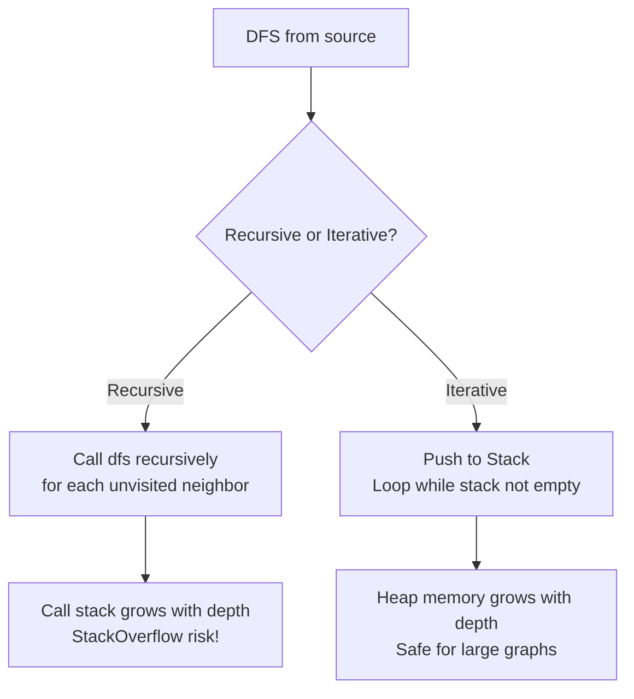

## WHY

Depth-First Search (DFS) is the algorithm you reach for when you need to **explore all possibilities**, detect cycles, determine reachability through any path, or solve problems with backtracking. Unlike BFS which finds shortest paths, DFS is optimized for problems requiring complete exploration: "does any path exist?", "what are all cycles in this graph?", "is this graph connected?", "can we solve this puzzle?".

The pain DFS solves is exhaustive state-space exploration. Build systems need DFS to detect circular dependencies (A depends on B, B depends on C, C depends on A — a cycle that prevents building). Compilers use DFS to compute strongly connected components. Game AI uses DFS to explore game trees (minimax). Maze generators use DFS to carve paths. All require the "go deep before going wide" behavior that only DFS provides.

The production failure mode is **stack overflow on deep recursive DFS**. Java's default stack size is 512KB-1MB, which allows roughly 5,000-10,000 recursive calls. A DFS on a million-node linked-list graph crashes with `StackOverflowError`. Production implementations always use **iterative DFS with an explicit stack** — it has identical semantics but uses heap memory instead of the call stack. Any production DFS on user-controlled input must be iterative, or it becomes a denial-of-service vulnerability.

Senior engineers must master DFS not just as an algorithm but as a problem-solving template: cycle detection, topological sort, strongly connected components, backtracking — all are DFS variants. Understanding the three-color state machine (white/gray/black) and the difference between pre-order and post-order processing unlocks an entire class of graph problems.

## THEORY

### Recursive vs. Iterative DFS



### DFS Traversal States — The Three-Color Algorithm

| State | Color | Meaning |
|-------|-------|---------|
| Not yet visited | White | Node undiscovered |
| In progress | Gray | Node on current DFS path (in recursion stack) |
| Fully processed | Black | Node and all descendants fully explored |

**Cycle detection rule:** A back edge (edge from gray node to another gray node) indicates a cycle in a directed graph.

### DFS Edge Classification

When DFS runs on a directed graph, every edge falls into one of four categories:

1. **Tree Edge** — `(u,v)` where v was first discovered from u
2. **Back Edge** — `(u,v)` where v is an ancestor of u (indicates a cycle)
3. **Forward Edge** — `(u,v)` where v is a descendant of u via a non-tree path
4. **Cross Edge** — `(u,v)` between unrelated subtrees

### DFS vs. BFS Comparison

| Problem | Use BFS | Use DFS |
|---------|---------|---------|
| Shortest path (unweighted) | ✅ | ❌ |
| Cycle detection | ❌ | ✅ |
| Topological sort | ❌ | ✅ |
| All paths | Either | ✅ natural with backtracking |
| Memory-limited deep graphs | ✅ | ❌ (StackOverflow) |

### Common Misconception

> "DFS and BFS visit all nodes, so they're equivalent for most problems."

**Reality:** DFS and BFS produce *different traversal orders*. Topological sort requires DFS's post-order processing. Shortest path requires BFS's level-by-level guarantee.

## VISUALIZATION_CONFIG
```json
{
  "language": "java",
  "fileName": "DFS.java",
  "steps": [
    {
      "title": "DFS uses a stack (or recursion)",
      "description": "Depth-First Search dives as deep as possible before backtracking. Uses a Stack explicitly or the call stack via recursion.",
      "code": "// Recursive DFS\nvoid dfs(Node n, Set<Node> visited) {\n    visited.add(n);\n    process(n);\n    for (Node nb : n.neighbours)\n        if (!visited.contains(nb)) dfs(nb, visited);\n}",
      "highlight": [
        2,
        3,
        4,
        5,
        6
      ],
      "diagram": {
        "kind": "flow",
        "steps": [
          {
            "label": "visit A",
            "done": true
          },
          {
            "label": "recurse into B → recurse into D",
            "done": true
          },
          {
            "label": "backtrack to B → recurse into E",
            "active": true
          },
          {
            "label": "backtrack to A → recurse into C"
          }
        ]
      }
    },
    {
      "title": "Iterative DFS with explicit stack",
      "description": "Use an explicit Stack when you need to avoid call-stack overflow on deep graphs.",
      "code": "Stack<Node> stack = new Stack<>();\nSet<Node> visited = new HashSet<>();\nstack.push(start);\nwhile (!stack.isEmpty()) {\n    Node n = stack.pop();\n    if (visited.contains(n)) continue;\n    visited.add(n);\n    for (Node nb : n.neighbours) stack.push(nb);\n}",
      "highlight": [
        1,
        5,
        6,
        7,
        8
      ],
      "diagram": {
        "kind": "boxes",
        "title": "Stack state during DFS",
        "items": [
          {
            "label": "stack top: C",
            "color": "#10b981",
            "highlight": true
          },
          {
            "label": "B",
            "color": "#818cf8"
          },
          {
            "label": "A",
            "color": "#818cf8",
            "value": "bottom"
          }
        ]
      }
    },
    {
      "title": "Pre-order vs post-order",
      "description": "Visiting a node BEFORE recursing = pre-order (useful for cloning trees). Visiting AFTER = post-order (useful for deleting trees, topological sort).",
      "code": "void dfs(Node n) {\n    // pre-order: process here\n    for (Node nb : n.neighbours) dfs(nb);\n    // post-order: process here\n}",
      "highlight": [
        2,
        4
      ],
      "diagram": {
        "kind": "boxes",
        "title": "Order matters",
        "items": [
          {
            "label": "Pre-order",
            "value": "process → recurse",
            "color": "#10b981",
            "highlight": true
          },
          {
            "label": "Post-order",
            "value": "recurse → process",
            "color": "#818cf8"
          },
          {
            "label": "In-order (BST)",
            "value": "left → node → right",
            "color": "#f59e0b"
          }
        ]
      }
    },
    {
      "title": "Cycle detection with DFS",
      "description": "Use a `visiting` set (grey nodes in progress) + `visited` (finished). If you encounter a grey node, there's a cycle.",
      "code": "Set<Node> visiting = new HashSet<>();\nSet<Node> finished = new HashSet<>();\nboolean hasCycle(Node n) {\n    if (visiting.contains(n)) return true;   // back-edge!\n    if (finished.contains(n)) return false;\n    visiting.add(n);\n    for (Node nb : n.neighbours) if (hasCycle(nb)) return true;\n    visiting.remove(n); finished.add(n);\n    return false;\n}",
      "highlight": [
        4
      ],
      "diagram": {
        "kind": "flow",
        "steps": [
          {
            "label": "mark node GREY (visiting)",
            "done": true
          },
          {
            "label": "recurse into neighbours",
            "done": true
          },
          {
            "label": "if we hit a GREY node → CYCLE",
            "active": true
          },
          {
            "label": "mark BLACK (finished) when done"
          }
        ]
      }
    },
    {
      "title": "DFS complexity",
      "description": "O(V + E) time. O(V) stack space (call stack depth = graph depth).",
      "code": "// Time:  O(V + E)\n// Space: O(V) — recursion depth or explicit stack",
      "diagram": {
        "kind": "boxes",
        "title": "DFS complexity",
        "items": [
          {
            "label": "Time",
            "value": "O(V + E)",
            "color": "#10b981",
            "highlight": true
          },
          {
            "label": "Space",
            "value": "O(V) depth",
            "color": "#818cf8"
          }
        ]
      }
    }
  ]
}
```

## CODE

### Level 1 — Beginner: Recursive and Iterative DFS

```java
import java.util.*;

public class DfsBasic {
    private final Map<Integer, List<Integer>> graph = new HashMap<>();

    public void addEdge(int from, int to) {
        graph.computeIfAbsent(from, k -> new ArrayList<>()).add(to);
        graph.computeIfAbsent(to, k -> new ArrayList<>()).add(from);
    }

    public List<Integer> dfsRecursive(int start) {
        List<Integer> result = new ArrayList<>();
        Set<Integer> visited = new HashSet<>();
        dfsHelper(start, visited, result);
        return result;
    }

    private void dfsHelper(int node, Set<Integer> visited, List<Integer> result) {
        visited.add(node);
        result.add(node);
        for (int neighbor : graph.getOrDefault(node, List.of())) {
            if (!visited.contains(neighbor)) dfsHelper(neighbor, visited, result);
        }
    }

    public List<Integer> dfsIterative(int start) {
        List<Integer> result = new ArrayList<>();
        Set<Integer> visited = new HashSet<>();
        Deque<Integer> stack = new ArrayDeque<>();
        stack.push(start);
        while (!stack.isEmpty()) {
            int current = stack.pop();
            if (visited.contains(current)) continue;
            visited.add(current);
            result.add(current);
            List<Integer> neighbors = graph.getOrDefault(current, List.of());
            for (int i = neighbors.size() - 1; i >= 0; i--) {
                if (!visited.contains(neighbors.get(i))) stack.push(neighbors.get(i));
            }
        }
        return result;
    }
}
```

### Level 2 — Intermediate: Cycle Detection

```java
import java.util.*;

public class CycleDetection {
    public static boolean hasUndirectedCycle(Map<Integer, List<Integer>> graph) {
        Set<Integer> visited = new HashSet<>();
        for (int node : graph.keySet()) {
            if (!visited.contains(node) && dfsUndirected(graph, node, -1, visited)) return true;
        }
        return false;
    }

    private static boolean dfsUndirected(Map<Integer, List<Integer>> graph,
            int node, int parent, Set<Integer> visited) {
        visited.add(node);
        for (int neighbor : graph.getOrDefault(node, List.of())) {
            if (!visited.contains(neighbor)) {
                if (dfsUndirected(graph, neighbor, node, visited)) return true;
            } else if (neighbor != parent) {
                return true;
            }
        }
        return false;
    }

    public static boolean hasDirectedCycle(Map<Integer, List<Integer>> graph) {
        Set<Integer> visited = new HashSet<>();
        Set<Integer> inStack = new HashSet<>();
        for (int node : graph.keySet()) {
            if (!visited.contains(node) && dfsCycleDirected(graph, node, visited, inStack)) return true;
        }
        return false;
    }

    private static boolean dfsCycleDirected(Map<Integer, List<Integer>> graph,
            int node, Set<Integer> visited, Set<Integer> inStack) {
        inStack.add(node);
        for (int neighbor : graph.getOrDefault(node, List.of())) {
            if (inStack.contains(neighbor)) return true;
            if (!visited.contains(neighbor)
                && dfsCycleDirected(graph, neighbor, visited, inStack)) return true;
        }
        inStack.remove(node);
        visited.add(node);
        return false;
    }
}
```

### Level 3 — Advanced: DFS with Backtracking

```java
import java.util.*;

public class DfsBacktracking {
    public static List<List<Integer>> allPaths(Map<Integer, List<Integer>> graph,
            int source, int dest) {
        List<List<Integer>> result = new ArrayList<>();
        List<Integer> path = new ArrayList<>();
        Set<Integer> visited = new HashSet<>();
        path.add(source); visited.add(source);
        dfsAllPaths(graph, source, dest, path, visited, result);
        return result;
    }

    private static void dfsAllPaths(Map<Integer, List<Integer>> graph,
            int current, int dest, List<Integer> path, Set<Integer> visited,
            List<List<Integer>> result) {
        if (current == dest) {
            result.add(new ArrayList<>(path));
            return;
        }
        for (int neighbor : graph.getOrDefault(current, List.of())) {
            if (!visited.contains(neighbor)) {
                path.add(neighbor); visited.add(neighbor);
                dfsAllPaths(graph, neighbor, dest, path, visited, result);
                path.remove(path.size() - 1); visited.remove(neighbor);
            }
        }
    }

    public static List<List<Integer>> permutations(int n) {
        List<List<Integer>> result = new ArrayList<>();
        boolean[] used = new boolean[n + 1];
        backtrack(n, used, new ArrayList<>(), result);
        return result;
    }

    private static void backtrack(int n, boolean[] used, List<Integer> current,
            List<List<Integer>> result) {
        if (current.size() == n) {
            result.add(new ArrayList<>(current));
            return;
        }
        for (int i = 1; i <= n; i++) {
            if (!used[i]) {
                used[i] = true; current.add(i);
                backtrack(n, used, current, result);
                current.remove(current.size() - 1); used[i] = false;
            }
        }
    }
}
```

### Level 4 — Expert / Production: Tarjan's SCC and Iterative Post-Order DFS

```java
import java.util.*;

public class ProductionDfs {
    private int[] disc, low;
    private boolean[] onStack;
    private int timer = 0;
    private Deque<Integer> stack = new ArrayDeque<>();
    private List<List<Integer>> sccs = new ArrayList<>();

    public List<List<Integer>> findSCCs(int n, Map<Integer, List<Integer>> graph) {
        disc = new int[n]; Arrays.fill(disc, -1);
        low = new int[n];
        onStack = new boolean[n];
        for (int i = 0; i < n; i++) {
            if (disc[i] == -1) tarjanDfs(i, graph);
        }
        return sccs;
    }

    private void tarjanDfs(int u, Map<Integer, List<Integer>> graph) {
        disc[u] = low[u] = timer++;
        stack.push(u); onStack[u] = true;
        for (int v : graph.getOrDefault(u, List.of())) {
            if (disc[v] == -1) {
                tarjanDfs(v, graph);
                low[u] = Math.min(low[u], low[v]);
            } else if (onStack[v]) {
                low[u] = Math.min(low[u], disc[v]);
            }
        }
        if (low[u] == disc[u]) {
            List<Integer> scc = new ArrayList<>();
            int v;
            do {
                v = stack.pop();
                onStack[v] = false;
                scc.add(v);
            } while (v != u);
            sccs.add(scc);
        }
    }
}
```

## REAL_WORLD

### How Gradle Uses DFS for Build Dependency Resolution

Gradle — the build system used by Android, Spring Boot, and thousands of Java projects — uses DFS to compute the build order of its task graph. Every Gradle build has a directed acyclic graph (DAG) of tasks. Gradle uses DFS post-order traversal to produce a topological sort: tasks appear in the result after all their dependencies. Critically, Gradle uses **iterative DFS** because build graphs can be thousands of nodes deep — a recursive DFS would stack overflow on large Android multi-module builds.

```java
import java.util.*;

public class BuildTaskScheduler {
    enum State { UNVISITED, IN_PROGRESS, DONE }

    public static List<String> computeBuildOrder(Map<String, List<String>> deps) {
        Map<String, State> state = new HashMap<>();
        List<String> order = new ArrayList<>();
        Set<String> cycles = new HashSet<>();
        for (String t : deps.keySet()) state.put(t, State.UNVISITED);
        for (String t : deps.keySet()) {
            if (state.get(t) == State.UNVISITED) dfs(t, deps, state, order, cycles);
        }
        if (!cycles.isEmpty()) throw new IllegalStateException("Cycle: " + cycles);
        return order;
    }

    private static void dfs(String task, Map<String, List<String>> deps,
            Map<String, State> state, List<String> order, Set<String> cycles) {
        state.put(task, State.IN_PROGRESS);
        for (String dep : deps.getOrDefault(task, List.of())) {
            State s = state.getOrDefault(dep, State.UNVISITED);
            if (s == State.IN_PROGRESS) cycles.add(task + " → " + dep);
            else if (s == State.UNVISITED) dfs(dep, deps, state, order, cycles);
        }
        state.put(task, State.DONE);
        order.add(task);
    }
}
```

### Production Gotcha: Recursive DFS Stack Overflow

```java
// ❌ DANGEROUS — recursive DFS crashes on deep graphs (DoS vulnerability)
public void dfsRecursive(int node, Set<Integer> visited) {
    visited.add(node);
    for (int neighbor : graph.get(node)) {
        if (!visited.contains(neighbor)) dfsRecursive(neighbor, visited);
    }
}

// ✅ PRODUCTION-SAFE — iterative DFS using ArrayDeque
public void dfsIterative(int start, Set<Integer> visited) {
    Deque<Integer> stack = new ArrayDeque<>();
    stack.push(start);
    while (!stack.isEmpty()) {
        int node = stack.pop();
        if (visited.contains(node)) continue;
        visited.add(node);
        for (int neighbor : graph.get(node)) {
            if (!visited.contains(neighbor)) stack.push(neighbor);
        }
    }
}
```

**Why it happens:** Java's call stack has a fixed maximum depth (500-10,000 frames). User-controlled input can construct a graph deep enough to exceed this. Always use iterative DFS for any production code processing untrusted input.

### Performance Characteristics

| Operation | Time | Space | Notes |
|-----------|------|-------|-------|
| DFS traversal | O(V+E) | O(V) | recursive: call stack; iterative: heap stack |
| Cycle detection | O(V+E) | O(V) | in-progress set tracks back edges |
| All paths | O(V! × V) worst case | O(V) current path | Exponential for dense graphs |
| SCC (Tarjan's) | O(V+E) | O(V) | disc/low arrays + stack |

## INTERVIEW

**Q1 (Junior): What is DFS and what data structure does it use?**
A: Depth-First Search is a graph traversal algorithm that explores as far as possible along each branch before backtracking. It uses a **stack** — either the call stack (recursive) or an explicit `ArrayDeque` (iterative). The stack's LIFO property ensures we always process the most recently discovered unvisited neighbor before others, producing the "go deep first" behavior. This contrasts with BFS's queue (FIFO), which processes the oldest discovered unvisited neighbor first.

**Q2 (Junior): When would you choose DFS over BFS?**
A: Choose DFS when you need: (1) **cycle detection** — DFS's back edges directly reveal cycles; (2) **topological sort** — DFS post-order produces a valid topological ordering; (3) **all paths or backtracking** — DFS naturally explores paths fully before backtracking; (4) **deep graphs with narrow width** — DFS uses O(depth) memory vs BFS's O(width). Choose BFS when you need the **shortest path** or **level-by-level processing**.

**Q3 (Mid): How do you detect a cycle in a directed graph using DFS?**
A: Use a three-color approach: white (not visited), gray (currently in DFS path), black (fully processed). When exploring a node's neighbors, if you encounter a gray neighbor, you've found a back edge — which means a cycle exists. The key insight: gray nodes are exactly those on the current DFS call stack. A back edge to a gray node means the current path loops back to an ancestor, forming a cycle.

**Q4 (Mid): What is topological sort and how does DFS produce it?**
A: Topological sort is an ordering of vertices in a directed acyclic graph such that for every directed edge u→v, vertex u comes before v. DFS produces it via **reverse post-order**: run DFS, and when a node is fully processed, add it to a list; reverse the list at the end. The node appears in post-order AFTER all its dependencies, so reversed post-order puts dependencies BEFORE the nodes that need them. This works only on DAGs.

**Q5 (Senior): Why is iterative DFS preferred over recursive DFS in production code?**
A: Recursive DFS uses the JVM call stack, which has a fixed maximum depth (500-10,000 frames). Any user-controlled graph where depth can be made arbitrary becomes a denial-of-service vulnerability: create a linear chain of N nodes, trigger DFS, crash the JVM with `StackOverflowError`. Iterative DFS replaces the call stack with an explicit `ArrayDeque` on the heap — heap size is bounded only by available RAM, which can be gigabytes.

**Q6 (Senior): Explain Tarjan's SCC algorithm and why it's O(V+E).**
A: Tarjan's algorithm finds all Strongly Connected Components in a directed graph in a single DFS pass. Each node gets: `disc[u]` (discovery time) and `low[u]` (lowest discovery time reachable from u's subtree, including back edges). When `low[u] == disc[u]`, u is the "root" of an SCC — pop all nodes from the algorithm's stack until u, forming the SCC. It's O(V+E) because it's exactly one DFS — every vertex visited once, every edge traversed once.

**Q7 (Senior+): How does DFS enable the condensation graph for SCCs?**
A: After finding all SCCs, you can replace each SCC with a single "super-node" and connect super-nodes where edges existed between their constituent nodes. The resulting condensation graph is always a DAG. The condensation enables topological sort of the original graph's SCCs, which is critical for: compiler optimizations (mutually-recursive function evaluation order), network analysis (cluster reachability), and dependency resolution.

## FEYNMAN CHECK

### Explain DFS Like I'm 10 Years Old

> Imagine you're exploring a cave network. **DFS is like exploring cave tunnels one at a time**: you pick the first tunnel and follow it as deep as it goes until you hit a dead end, then backtrack to the last junction and try the next tunnel. You never start the second tunnel until you've completely finished exploring the first. **BFS, by contrast, is like sending a group of explorers out simultaneously** — one person into each tunnel at the same time. DFS is better when you want to completely map one path, find cycles, or explore all possible routes. BFS is better for shortest routes.

---

### 5 Deep Conceptual Questions

**Q1: Why can't DFS guarantee shortest paths in unweighted graphs?**
> **A:** DFS explores as deep as possible along each branch before trying alternatives. Given paths A→B (1 hop) and A→C→D→B (3 hops), DFS might explore the 3-hop path first and record "B is at distance 3 from A," then never reconsider B when it encounters A→B directly. BFS's level-by-level property guarantees it always discovers B via the 1-hop path first.

**Q2: What is the mental model for the gray/white/black cycle detection?**
> **A:** Gray nodes are exactly those currently on the DFS call stack. If DFS encounters a gray node as a neighbor, the current path loops back to a node it's already "inside" — forming a cycle. White nodes haven't been entered. Black nodes have been fully explored. The mental model: if you see footprints from *your current walk* ahead of you, you've made a loop.

**Q3: What is the most dangerous DFS implementation mistake? Show it with code.**
> **A:** Recursive DFS on user-controlled input — creating a StackOverflowError vulnerability.
> ```java
> // ❌ VULNERABLE
> public void dfs(int node, Set<Integer> visited) {
>     visited.add(node);
>     for (int neighbor : graph.get(node))
>         if (!visited.contains(neighbor))
>             dfs(neighbor, visited);  // 100K nodes → StackOverflowError
> }
>
> // ✅ SAFE
> public void dfs(int start, Set<Integer> visited) {
>     Deque<Integer> stack = new ArrayDeque<>();
>     stack.push(start);
>     while (!stack.isEmpty()) {
>         int node = stack.pop();
>         if (visited.contains(node)) continue;
>         visited.add(node);
>         for (int n : graph.get(node)) if (!visited.contains(n)) stack.push(n);
>     }
> }
> ```

**Q4: How does DFS post-order relate to topological sort?**
> **A:** In DFS on a DAG, a node is added to post-order after ALL of its descendants have been processed. If u→v is an edge (u depends on v), v will be processed and added to post-order BEFORE u. Reversing the post-order list gives: u appears before v — exactly the topological sort requirement.

**Q5: One-sentence definition for a senior FAANG engineer.**
> **A:** "Depth-First Search is a graph traversal algorithm that uses a LIFO stack (call stack in recursive form, explicit ArrayDeque in iterative form) to exhaustively explore each branch to its leaf before backtracking, producing properties exploitable for cycle detection (back edges to gray nodes), topological ordering (reverse post-order), and complete path enumeration — at O(V+E) time and O(V) space — with the critical production constraint that recursive DFS must never be used on user-controlled input due to fixed call stack depth limits."

## BUILD

### 🏗️ Mini Project: Dependency Resolver with Cycle Detection

**What you will build:** A DFS-based dependency resolver that validates module dependencies, detects circular dependencies, and produces a valid build order.
**Why this project:** Forces you to apply DFS, implement three-color cycle detection, and produce topological sort output — the real-world application of DFS in every build tool.
**Time estimate:** 25 minutes

---

#### Step 1 — Setup

```bash
mkdir dep-resolver && cd dep-resolver
mkdir -p src/main/java/com/deps
touch src/main/java/com/deps/DependencyResolver.java
touch src/main/java/com/deps/DependencyResolverTest.java
```

#### Step 2 — Core Implementation

```java
package com.deps;
import java.util.*;

public class DependencyResolver {
    enum NodeState { UNVISITED, IN_PROGRESS, DONE }
    public record ResolverResult(boolean hasCycle, List<String> cycleNodes,
                                 List<String> buildOrder) {}

    public static ResolverResult resolve(Map<String, List<String>> dependencies) {
        Map<String, NodeState> state = new HashMap<>();
        List<String> buildOrder = new ArrayList<>();
        List<String> cycles = new ArrayList<>();
        for (String m : dependencies.keySet()) state.put(m, NodeState.UNVISITED);
        for (String m : dependencies.keySet()) {
            if (state.get(m) == NodeState.UNVISITED) {
                dfs(m, dependencies, state, buildOrder, cycles, new ArrayDeque<>());
            }
        }
        return new ResolverResult(!cycles.isEmpty(), cycles, buildOrder);
    }

    private static void dfs(String module, Map<String, List<String>> deps,
            Map<String, NodeState> state, List<String> order,
            List<String> cycles, Deque<String> path) {
        state.put(module, NodeState.IN_PROGRESS);
        path.push(module);
        for (String dep : deps.getOrDefault(module, List.of())) {
            NodeState s = state.getOrDefault(dep, NodeState.UNVISITED);
            if (s == NodeState.IN_PROGRESS) {
                List<String> cycle = new ArrayList<>(path);
                Collections.reverse(cycle);
                int start = cycle.indexOf(dep);
                cycles.add(String.join(" → ", cycle.subList(start, cycle.size())) + " → " + dep);
            } else if (s == NodeState.UNVISITED) {
                dfs(dep, deps, state, order, cycles, path);
            }
        }
        path.pop();
        state.put(module, NodeState.DONE);
        order.add(module);
    }
}
```

#### Step 3 — Usage

```java
public class Main {
    public static void main(String[] args) {
        Map<String, List<String>> deps = new HashMap<>();
        deps.put("app", List.of("lib-web", "lib-core"));
        deps.put("lib-web", List.of("lib-core", "lib-http"));
        deps.put("lib-http", List.of("lib-core"));
        deps.put("lib-core", List.of());
        var result = DependencyResolver.resolve(deps);
        System.out.println("Has cycle: " + result.hasCycle());
        System.out.println("Build order: " + result.buildOrder());
    }
}
```

#### Step 4 — Error Handling

```java
public static List<String> resolveOrThrow(Map<String, List<String>> deps) {
    var result = resolve(deps);
    if (result.hasCycle()) {
        throw new IllegalStateException("Circular dependencies: " + result.cycleNodes());
    }
    return result.buildOrder();
}
```

#### Step 5 — Tests

```java
import org.junit.jupiter.api.Test;
import java.util.*;
import static org.junit.jupiter.api.Assertions.*;

class DependencyResolverTest {
    @Test
    void resolvesDependenciesInCorrectOrder() {
        var deps = Map.of("A", List.of("B", "C"), "B", List.of("D"),
                          "C", List.of("D"), "D", List.<String>of());
        var result = DependencyResolver.resolve(deps);
        assertFalse(result.hasCycle());
        var order = result.buildOrder();
        assertTrue(order.indexOf("D") < order.indexOf("B"));
    }

    @Test
    void detectsDirectCycle() {
        var deps = new HashMap<String, List<String>>();
        deps.put("A", List.of("B")); deps.put("B", List.of("A"));
        var result = DependencyResolver.resolve(deps);
        assertTrue(result.hasCycle());
    }
}
```

**Expected Output:**
```
Has cycle: false
Build order: [lib-core, lib-http, lib-web, app]
```

**Stretch Challenges:**
- [ ] Make the resolver iterative (no recursive DFS) for production safety
- [ ] Support optional vs. required dependencies
- [ ] Return a `Map<String, Integer>` of module → build-level for parallel building

## SPACED REVIEW

> **How to use:** Answer from memory before reading ahead.

---

### Day 1 — Recall

**Q1:** What data structure does DFS use? How does LIFO behavior produce the "go deep first" property?

**Q2:** Write a 15-line recursive DFS and a 15-line iterative DFS on an adjacency list graph. What is the one key difference in behavior?

**Q3:** What are the three node states in directed cycle detection? What does each state mean?

---

### Day 3 — Comprehension

**Q4:** How does DFS detect cycles in a directed graph differently from an undirected graph? Show the different conditions.

**Q5:** What is topological sort? How does DFS post-order produce it? Show a 4-node example.

**Q6:** When would recursive DFS cause a `StackOverflowError`? How would you fix it?

---

### Day 7 — Application

**Q7:** Implement DFS to find all connected components in an undirected graph. Return a `List<List<Integer>>`.

**Q8:** A package manager detects a circular dependency in a 500-module project. How would you find and report it?

**Q9:** What is Tarjan's SCC algorithm? When would you use it over simply counting connected components?

---

### Day 14 — Synthesis & Interview Prep

**Q10:** ★ Classic interview: *"Given a directed graph representing prerequisites, determine if it's possible to finish all courses. If yes, return the order."*

**Q11:** Draw the DFS execution showing disc[], low[], and the stack state for Tarjan's algorithm on a 4-node cycle.

**Q12:** ★ System design: *"You're building a microservice dependency analysis tool for a company with 500 services. How would you use DFS to detect cycles, compute deployment order, and identify 'core' services?"*

