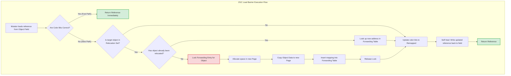

## WHY

In managed runtimes like the JVM, memory allocation is cheap, but memory reclamation is complex. The primary goal of a Garbage Collector (GC) is to provide the illusion of infinite memory while minimizing the impact on application latency, throughput, and footprint.

Historically, stop-the-world (STW) collectors (like Serial and Parallel GC) paused all application threads (mutators) to safely trace and reclaim memory. For modern enterprise applications with heap sizes ranging from 32 GB to several terabytes, STW pauses of even a few milliseconds per gigabyte scale to minutes of total application downtime. This is unacceptable for high-frequency trading, real-time gaming, and microservices under strict SLA constraints.

```
Mutator Threads:  =======[STW Pause]=======   (Parallel GC)
GC Threads:              [=========]

Mutator Threads:  === == = === = == === ===   (Concurrent GC - G1/ZGC)
GC Threads:          =  =   =   =  =   =
```

To solve this, modern collectors like Garbage-First (G1) and Z Garbage Collector (ZGC) perform the vast majority of tracing, evacuation, and compaction concurrently with mutator execution. However, concurrent collection introduces massive complexity:
* **Race Conditions**: Mutators modifying object references while the GC is tracing the object graph.
* **Memory Fragmentation**: Compacting memory without pausing threads requires relocating objects in memory and updating all incoming references in real-time.
* **Overhead**: Concurrent collectors require CPU cycles and memory barriers (read/write barriers) to coordinate with mutators, trading off overall throughput for reduced latency.

Understanding these internal mechanics is critical for tuning the JVM to meet strict latency and throughput requirements.

---

## THEORY

### The Generational Hypothesis
The design of almost all JVM garbage collectors is rooted in the **Weak Generational Hypothesis**:
1. Most objects die young (they are allocated for short-lived operations and quickly become unreachable).
2. The strength of references from old objects to young objects is very low.

Therefore, the heap is split into:
* **Young Generation**: Optimized for high-allocation rates and rapid reclamation. Uses copying algorithms (Eden space copied to Survivor spaces).
* **Old Generation**: Optimized for long-lived objects. Uses mark-sweep-compact or regional compaction algorithms.

### Garbage-First (G1) GC Mechanics
G1 partitions the Java heap into equal-sized virtual memory regions (ranging from 1 MB to 32 MB). Each region can dynamically act as Eden, Survivor, or Old memory.

```
+---+---+---+---+
| E | S | O | H |   E = Eden, S = Survivor, O = Old, H = Humongous
+---+---+---+---+
| O | E | S | O |
+---+---+---+---+
```

#### 1. Remembered Sets (RSets) and Card Tables
To collect a Young region without scanning the entire Old generation (to find incoming references), G1 uses **Remembered Sets (RSets)**.
* The heap is mapped by a **Card Table**, where one byte represents 512 bytes of heap memory (a "Card").
* When an Old generation object is modified to reference a Young generation object, a **Post-Write Barrier** intercepts the write and marks the corresponding Card as "dirty".
* During a collection, G1 scans only the RSets of the target regions, which point to the dirty cards, drastically reducing scan times.

#### 2. SATB (Snapshot-At-The-Beginning)
To trace the object graph concurrently without missing objects, G1 uses SATB. At the start of the marking phase, G1 logical-snapshots the object graph.
* **Pre-Write Barrier**: If a mutator overwrites a reference during concurrent marking, the pre-write barrier intercepts this and pushes the *old* reference onto an SATB buffer. This ensures the GC traces the object as it existed when marking began, preventing the GC from accidentally deleting reachable objects.

### ZGC (Z Garbage Collector) Mechanics
ZGC is a concurrent, low-latency, region-based, generational collector designed to handle multi-terabyte heaps with pause times consistently under 1 millisecond.

#### 1. Colored Pointers
ZGC uses the upper unused bits of a 64-bit virtual memory reference (pointer) to encode metadata about the reference itself:
* **Bits 0-41 (42 bits)**: Actual object address (supports up to 4 TB of physical memory).
* **Bit 42**: `Marked0` (used for liveness tracing).
* **Bit 43**: `Marked1` (used for liveness tracing in alternating GC cycles).
* **Bit 44**: `Remapped` (indicates if the pointer has been updated to the new location of a relocated object).
* **Bit 45**: `Finalizable` (used for finalizable objects).

```
 63          45 44 43 42 41                               0
+--------------+--+--+--+--+-------------------------------+
|   Unused     |Fi|Re|M1|M0|      Object Address           |
+--------------+--+--+--+--+-------------------------------+
```

Because of this, ZGC requires multi-mapping virtual memory. The same physical memory page is mapped to three different virtual address spaces depending on the colored pointer bits.

#### 2. Load Barriers
Unlike G1 which uses write barriers, ZGC uses a **Load Barrier**. When a mutator thread loads a reference from an object field, the load barrier intercepts the read:
1. It checks the color bits of the loaded reference.
2. If the reference is marked as *not* remapped, the load barrier checks if the target object is in the relocation set.
3. If the object has been relocated, the load barrier looks up the new address in a forwarding table, updates the reference field in place (self-healing), and returns the new address.
4. If the object is in the relocation set but not yet relocated, the load barrier relocates it on the fly, updates the reference, and updates the forwarding table.

This "self-healing" mechanism guarantees that mutators always see the correct, updated object reference, allowing compaction to occur completely concurrently.

---

## VISUALIZATION_CONFIG



---

## IMPLEMENTATION

The following code demonstrates how to monitor GC events programmatically using Java's built-in `GarbageCollectorMXBean` and JMX notifications. This is a production-grade utility for real-time SLA breach detection.

```java
package com.devmastery.gc;

import javax.management.Notification;
import javax.management.NotificationEmitter;
import javax.management.NotificationListener;
import javax.management.openmbean.CompositeData;
import java.lang.management.GarbageCollectorMXBean;
import java.lang.management.ManagementFactory;
import java.util.ArrayList;
import java.util.List;
import java.util.concurrent.CopyOnWriteArrayList;

public class GCNotificationMonitor {

    public interface GcEventListener {
        void onGcEvent(GcEventInfo info);
    }

    public static class GcEventInfo {
        public final String gcName;
        public final String gcAction;
        public final String gcCause;
        public final long durationMs;
        public final long usedMemoryBefore;
        public final long usedMemoryAfter;

        public GcEventInfo(String gcName, String gcAction, String gcCause, long durationMs, long usedMemoryBefore, long usedMemoryAfter) {
            this.gcName = gcName;
            this.gcAction = gcAction;
            this.gcCause = gcCause;
            this.durationMs = durationMs;
            this.usedMemoryBefore = usedMemoryBefore;
            this.usedMemoryAfter = usedMemoryAfter;
        }

        @Override
        public String toString() {
            return String.format("[%s] Action: %s, Cause: %s, Duration: %dms, Memory Reclaimed: %.2f MB",
                    gcName, gcAction, gcCause, durationMs, (usedMemoryBefore - usedMemoryAfter) / (1024.0 * 1024.0));
        }
    }

    private final List<GcEventListener> listeners = new CopyOnWriteArrayList<>();
    private final List<NotificationListener> activeJmxListeners = new ArrayList<>();

    public void registerListener(GcEventListener listener) {
        this.listeners.add(listener);
    }

    public void startMonitoring() {
        List<GarbageCollectorMXBean> gcbeans = ManagementFactory.getGarbageCollectorMXBeans();
        for (GarbageCollectorMXBean gcbean : gcbeans) {
            if (gcbean instanceof NotificationEmitter emitter) {
                NotificationListener jmxListener = (notification, handback) -> {
                    if (notification.getType().equals("com.sun.management.gc.notification")) {
                        CompositeData cd = (CompositeData) notification.getUserData();
                        
                        // Extract GC notification details safely using reflection-free JMX parsing
                        String gcName = (String) cd.get("gcName");
                        String gcAction = (String) cd.get("gcAction");
                        String gcCause = (String) cd.get("gcCause");
                        
                        CompositeData info = (CompositeData) cd.get("gcInfo");
                        long duration = (Long) info.get("duration");
                        
                        // Memory usage mapping
                        long usedBefore = 0;
                        long usedAfter = 0;
                        
                        // Extract memory usage before and after GC
                        CompositeData usageBefore = (CompositeData) info.get("memoryUsageBeforeGc");
                        CompositeData usageAfter = (CompositeData) info.get("memoryUsageAfterGc");
                        
                        for (Object key : usageBefore.keySet()) {
                            CompositeData memUsage = (CompositeData) usageBefore.get(key);
                            usedBefore += (Long) memUsage.get("used");
                        }
                        for (Object key : usageAfter.keySet()) {
                            CompositeData memUsage = (CompositeData) usageAfter.get(key);
                            usedAfter += (Long) memUsage.get("used");
                        }

                        GcEventInfo eventInfo = new GcEventInfo(gcName, gcAction, gcCause, duration, usedBefore, usedAfter);
                        for (GcEventListener listener : listeners) {
                            listener.onGcEvent(eventInfo);
                        }
                    }
                };
                emitter.addNotificationListener(jmxListener, null, null);
                activeJmxListeners.add(jmxListener);
            }
        }
    }

    public void stopMonitoring() {
        List<GarbageCollectorMXBean> gcbeans = ManagementFactory.getGarbageCollectorMXBeans();
        for (int i = 0; i < gcbeans.size(); i++) {
            if (gcbeans.get(i) instanceof NotificationEmitter emitter && i < activeJmxListeners.size()) {
                try {
                    emitter.removeNotificationListener(activeJmxListeners.get(i));
                } catch (Exception ignored) {}
            }
        }
        activeJmxListeners.clear();
        listeners.clear();
    }
}
```

---

## TROUBLESHOOTING_AND_PROFILING

### Diagnosing GC Bottlenecks and Latency Spikes
To identify GC issues, you must enable Unified JVM Garbage Collection Logging (JEP 271).

#### 1. Recommended GC Logging Flags
Run your JVM with the following flags for comprehensive diagnostics:
```bash
-Xlog:gc*,gc+phases=debug,gc+safepoint=info:file=gc-trace.log:time,uptime,pid:filecount=5,filesize=100M
```

#### 2. Key Log Signatures to Watch For
* **G1 GC Humongous Allocations**:
  ```
  [gc,ihop] GC(12) Concurrent Cycle Triggered (Humongous Allocation)
  ```
  * *Meaning*: An object larger than 50% of the G1 region size was allocated directly into the Old generation. This causes premature heap fragmentation and triggers aggressive concurrent cycles.
  * *Fix*: Increase region size with `-XX:G1HeapRegionSize=16m` or `-XX:G1HeapRegionSize=32m`.

* **ZGC Page Allocation Stalls**:
  ```
  [gc,alloc] Allocation Stall (Thread: "mutator-3", 12.450ms)
  ```
  * *Meaning*: Mutators are allocating memory faster than ZGC can reclaim it. The mutator is forced to block (stall) until space is freed.
  * *Fix*: Increase heap size (`-Xmx`), or increase GC threads with `-XX:ConcGCThreads` to accelerate concurrent reclamation.

#### 3. Profiling Tools
* **JDK Flight Recorder (JFR)**: Enable JFR with low overhead to capture allocation rates and GC pauses:
  ```bash
  -XX:StartFlightRecording=disk=true,dumponexit=true,filename=recording.jfr,settings=profile
  ```
* **JDK Mission Control (JMC)**: Use JMC to analyze the JFR file. Look at the "GC Config" and "GC Phase" tabs to identify which phase (e.g., Reference Processing, Root Scanning) is causing latency spikes.

---

## ARCHITECTURAL_PATTERNS

### Comparison of Modern Garbage Collectors