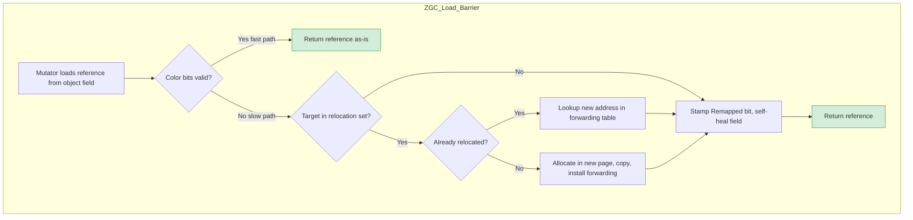

## WHY

In low-level languages like C and C++, every `malloc` demands a matching `free`. Forget one, leak memory. Free twice, corrupt the heap. Free while a pointer still references the object, produce a dangling pointer and a segmentation fault. These bugs are catastrophic, hard to reproduce, and account for the majority of all CVE-class security vulnerabilities in production systems.

Managed runtimes like the JVM eliminate this category of bugs entirely by giving you **automatic, safe memory reclamation** via the Garbage Collector (GC). The promise is simple: "Allocate freely. The runtime will figure out when nothing references your object and reclaim that memory automatically."

But this promise has a hidden cost — **latency**. Every GC algorithm must, at some point, pause the application to safely identify live objects and reclaim dead ones. For decades the only viable approach was the **Stop-The-World (STW)** pause:

```
Mutator Threads:  ====[STW pause]====        (Serial / Parallel GC)
GC Threads:           [tracing ... ]

Mutator Threads:  = == === = == = == ===     (Concurrent: G1, ZGC, Shenandoah)
GC Threads:        =   = =  =  =   =
```

For modest heaps (≤ 4 GB), STW pauses of 100–500 ms are tolerable. For modern systems — high-frequency trading engines, real-time analytics, low-latency APIs, multi-terabyte heaps in big-data services — even a single 200 ms pause violates the SLA. A trading platform that pauses for 1 second loses millions of dollars; a video service freezes mid-stream; a fintech API breaches its latency contract.

This is why modern collectors (**G1, ZGC, Shenandoah, Generational ZGC**) perform almost all of their work *concurrently* with the application threads (the **mutators**) — meaning the GC runs alongside your code, not instead of it. Achieving correctness while another set of threads is actively mutating the object graph is one of the hardest problems in systems programming, and it relies on three deeply technical pillars:

1. **Generational hypothesis** — exploit the observation that most objects die young.
2. **Write/read barriers** — tiny pieces of compiler-inserted code that intercept every memory operation to keep the GC's view of the heap consistent.
3. **Region-based heaps and concurrent compaction** — to defragment memory without pausing the JVM.

Understanding these mechanics is no longer optional for senior Java engineers. Choosing the wrong GC, or mis-tuning it, can multiply your p99 latency by 10× and triple your cloud bill. Tuning it correctly can cut both in half.

---

## THEORY

### 1. The reachability model

Java's GC does **not** track reference counts. It tracks **reachability** from a set of **GC Roots**:

* Active stack frames of every live thread (local variables, parameters).
* JNI references held by native code.
* Static fields of loaded classes.
* Synchronization monitors held by threads.
* The system classloader.

An object is **live** if and only if there is a chain of references from at least one GC Root to that object. Everything else is **garbage** and can be reclaimed.

This means a "memory leak" in Java is not the absence of `free()` — it is an unintentional reference that keeps an object reachable forever (the classic example: a static `HashMap` cache that never evicts entries).

### 2. The weak generational hypothesis

Empirical research across decades of production workloads has shown that:
1. **Most objects die young** — 80–98 % of allocations become unreachable within a few milliseconds.
2. **Old objects rarely reference young objects** — the few that do can be tracked cheaply.

This led to the **generational heap** layout used by every modern collector:

```
+--------------------------- Heap ----------------------------+
|                                                             |
|   Young Generation                Old Generation            |
|   +----------+--+--+               +-----------------+      |
|   |   Eden   |S0|S1|  -- promote-> |  long-lived obj |      |
|   +----------+--+--+               +-----------------+      |
|                                                             |
+-------------------------------------------------------------+
```

* **Eden** — where almost all allocations land via fast bump-pointer allocation in **Thread-Local Allocation Buffers (TLABs)**.
* **Survivor spaces (S0, S1)** — temporary holding pens for objects that survived one young-generation collection ("Minor GC").
* **Old generation** — objects that survived ≥ N young collections (default `MaxTenuringThreshold = 15` for G1) get **promoted** here. Collected by **Major / Full GC** (much rarer, much more expensive).

The win: a **Minor GC** only has to scan the tiny Young generation (usually 1–10 % of heap), copy the small live set into a Survivor, and reclaim the rest in one shot. This is ~10–100× cheaper than scanning the entire heap.

### 3. The tri-color marking algorithm

Concurrent collectors use **tri-color marking** to safely trace the object graph while mutators run:

* **White** — not yet visited; presumed dead.
* **Gray** — visited but its outgoing references are not yet scanned.
* **Black** — fully visited; all referents are also at least gray.

The invariant: **no black object may directly reference a white object**. Violating this would mean the GC declares a live object dead.

Mutators can violate the invariant by re-wiring references during marking:

```
Before:  Black A ──ref──> Gray B ──ref──> White C
After mutator runs:
         Black A ──ref──> White C        (A now points directly to a "dead" object!)
         Gray B (lost its ref to C)
```

This is the **"lost update"** problem. To preserve the invariant under concurrent mutation, the runtime inserts **barriers** — tiny snippets of code automatically generated at every reference write or read.

### 4. Write barriers and read barriers

A **write barrier** intercepts the assignment `obj.field = ref` *before* the mutator's CPU instruction completes. There are two main flavors:

* **SATB (Snapshot-At-The-Beginning)** — used by **G1** and **Shenandoah**.
  When the mutator overwrites a reference during the marking phase, the *old* (about to be erased) reference is logged onto an SATB queue and treated as still reachable for this GC cycle. The GC therefore sees a *consistent snapshot* of the heap as it was when marking began, even though the heap continues to evolve. May produce **floating garbage** (objects collected one cycle later than strictly needed) but never produces dangling pointers.
* **IU (Incremental Update)** — used by some older collectors.
  When the mutator writes a *new* reference into a black object, that new edge is logged so the GC can re-trace from the source. More accurate but creates more re-marking work.

A **read barrier** intercepts `ref = obj.field` and corrects the reference *on the fly* if the target has been relocated. **ZGC** and **Shenandoah** use read barriers to perform concurrent compaction.

### 5. Card tables and remembered sets — finding old → young pointers

To collect the Young generation without scanning the entire Old generation, the JVM needs to know: *which Old generation objects currently hold a reference to a Young object?*

The **card table** is the answer. It's a flat byte array, where each byte (a "card") represents 512 bytes of heap. Whenever an Old object's field is written:

```
oldObj.field = newObj;
// Hot-path write barrier inserted by JIT:
cardTable[ (address_of_field) >> 9 ] = DIRTY;
```

During a Minor GC, the collector scans only **dirty cards** to find roots into the Young generation. Cost: O(dirty-cards) instead of O(heap-size).

**G1** generalizes this further with **Remembered Sets (RSets)** — one RSet per region — that record incoming cross-region references in finer granularity.

### 6. Garbage-First (G1) GC — the default in modern JVMs

G1 partitions the heap into 1–32 MB **regions**. Each region is *dynamically* labeled Eden, Survivor, Old, or Humongous (for objects ≥ 50 % of a region).

```
+---+---+---+---+---+---+
| E | S | O | E | H | O |
+---+---+---+---+---+---+
| O | E | E | S | O | E |
+---+---+---+---+---+---+
```

**Algorithm overview:**

1. **Young collection (STW, parallel)** — evacuate Eden + Survivor live objects to a new Survivor region, promoting tenured ones to Old. Pause = a few ms.
2. **Concurrent marking** — mutators continue. SATB write barrier ensures correctness. Marks all reachable Old objects.
3. **Mixed collection (STW)** — pick a set of "garbage-first" regions (highest dead-byte ratio) and evacuate the live objects out of them. This **compacts** the Old generation incrementally, eliminating the need for expensive Full GC most of the time.
4. **Full GC (last resort)** — single-threaded fallback if G1 cannot keep up. Always considered a tuning failure.

Tuning knob: `-XX:MaxGCPauseMillis=200` (target, soft). G1 dynamically picks how many regions to collect per pause to meet that target.

### 7. ZGC — sub-millisecond pauses on multi-TB heaps

ZGC is the gold standard for low-latency. Pauses are bounded to **< 1 ms** regardless of heap size. Goals: 8 MB to 16 TB heaps, < 1 ms pauses, < 15 % throughput overhead.

**Key techniques:**

* **Colored pointers**: ZGC steals unused high bits (42–46) of a 64-bit reference to encode GC state directly into the pointer:
  ```
   63          45 44 43 42 41                               0
  +--------------+--+--+--+--+-------------------------------+
  |   Unused     |Fi|Re|M1|M0|      Object Address           |
  +--------------+--+--+--+--+-------------------------------+
                  |   |  |  |
                  |   |  |  └── Marked0
                  |   |  └───── Marked1   (alternates each cycle)
                  |   └──────── Remapped
                  └──────────── Finalizable
  ```
* **Multi-mapping virtual memory** — the same physical page is mapped at three different virtual addresses (one per color flag) so the CPU can read a colored pointer as a normal address.
* **Load barriers** — every read of a reference field passes through a barrier. Fast path: bits look right → return as-is. Slow path: object was relocated → consult forwarding table, update the field in place (**self-healing**), return the new address.
* **Concurrent everything** — marking, relocation, reference processing, and class unloading all happen with mutators running. The only STW phases are root scanning and a short reference re-mark, both bounded to < 1 ms.

### 8. Generational ZGC (JDK 21+)

The non-generational ZGC paid an allocation-rate tax because every cycle scanned the entire heap. JDK 21 introduced **Generational ZGC** that splits ZGC into Young + Old generations, retaining sub-ms pauses *and* recovering the throughput of the generational hypothesis. Enable with `-XX:+UseZGC -XX:+ZGenerational`.

### 9. Shenandoah — Red Hat's alternative

Shenandoah is similar in goals to ZGC but uses **Brooks forwarding pointers** (an extra word in every object header) instead of colored pointers. Slightly higher per-object memory overhead but no need for multi-mapping. Strong on heaps where modifying virtual memory layout is impractical (containerized cloud workloads).

### 10. A capsule comparison

| Collector | Pause goal | Throughput | Heap size | Best fit |
|-----------|-----------|-----------|-----------|----------|
| **Serial** | ~100 ms | Highest single-threaded | < 100 MB | Embedded / CLI |
| **Parallel** | ~200 ms+ | Highest multi-thread | 100 MB – 8 GB | Batch jobs |
| **G1** (default) | 100–200 ms | High | 4 GB – 64 GB | General server workloads |
| **ZGC** | < 1 ms | High (Gen ZGC ≈ G1) | 8 MB – 16 TB | Low-latency APIs, large heaps |
| **Shenandoah** | < 10 ms | High | 1 GB – 1 TB | Containerized / cloud |

---

## VISUALIZATION_CONFIG

```json
{ "component": "ArchitectureDiagram", "type": "garbage-collection-mechanics" }
```



---

## CODE

### Level 1 — Inspect the active GC at runtime
```java
import java.lang.management.*;
import java.util.*;

public class WhichGC {
    public static void main(String[] args) {
        for (GarbageCollectorMXBean gc : ManagementFactory.getGarbageCollectorMXBeans()) {
            System.out.println(gc.getName()
                + " | pools: " + Arrays.toString(gc.getMemoryPoolNames())
                + " | collections: " + gc.getCollectionCount()
                + " | total time (ms): " + gc.getCollectionTime());
        }
    }
}
```

Run with `-XX:+UseG1GC`, then `-XX:+UseZGC`, then `-XX:+UseParallelGC` to see the names change.

### Level 2 — Force a GC and watch a Minor → Promotion cycle
```java
import java.util.*;

public class PromotionDemo {
    public static void main(String[] args) {
        List<byte[]> longLived = new ArrayList<>();
        for (int cycle = 0; cycle < 5; cycle++) {
            for (int i = 0; i < 100_000; i++) {
                byte[] shortLived = new byte[256];   // mostly Eden, mostly dies young
                if (i % 1000 == 0) longLived.add(new byte[1024]);   // some get tenured
            }
            System.gc();           // hint, not a guarantee
            System.out.println("Cycle " + cycle + " - long-lived bytes: "
                + longLived.size() * 1024);
        }
    }
}
```

Run with `-Xlog:gc*` to see Minor GC and Promotion happen in real time.

### Level 3 — Listen to GC events programmatically (production-grade)
```java
import javax.management.*;
import javax.management.openmbean.CompositeData;
import java.lang.management.*;
import java.util.*;
import java.util.concurrent.CopyOnWriteArrayList;

public class GCNotificationMonitor {

    public interface GcEventListener { void onGcEvent(GcEventInfo info); }

    public record GcEventInfo(String gcName, String action, String cause,
                              long durationMs, long usedBefore, long usedAfter) {
        public String toString() {
            return "%s | %s | %s | %d ms | reclaimed %.2f MB".formatted(
                gcName, action, cause, durationMs,
                (usedBefore - usedAfter) / (1024.0 * 1024.0));
        }
    }

    private final List<GcEventListener> listeners = new CopyOnWriteArrayList<>();

    public void onEvent(GcEventListener l) { listeners.add(l); }

    public void start() {
        for (GarbageCollectorMXBean gc : ManagementFactory.getGarbageCollectorMXBeans()) {
            if (gc instanceof NotificationEmitter emitter) {
                emitter.addNotificationListener((notification, handback) -> {
                    if (!"com.sun.management.gc.notification".equals(notification.getType())) return;
                    CompositeData cd = (CompositeData) notification.getUserData();
                    String name   = (String) cd.get("gcName");
                    String action = (String) cd.get("gcAction");
                    String cause  = (String) cd.get("gcCause");
                    CompositeData info = (CompositeData) cd.get("gcInfo");
                    long duration  = (Long) info.get("duration");
                    long before    = sumUsed((CompositeData) info.get("memoryUsageBeforeGc"));
                    long after     = sumUsed((CompositeData) info.get("memoryUsageAfterGc"));
                    var ev = new GcEventInfo(name, action, cause, duration, before, after);
                    listeners.forEach(l -> l.onGcEvent(ev));
                }, null, null);
            }
        }
    }

    private static long sumUsed(CompositeData usageMap) {
        long total = 0;
        for (Object key : usageMap.keySet()) {
            CompositeData mu = (CompositeData) usageMap.get(key);
            total += (Long) mu.get("used");
        }
        return total;
    }

    public static void main(String[] args) throws Exception {
        var monitor = new GCNotificationMonitor();
        monitor.onEvent(e -> System.out.println("GC EVENT: " + e));
        monitor.start();

        // Make some garbage so we can see events
        for (int i = 0; i < 1_000_000; i++) new byte[1024];
        Thread.sleep(2000);
    }
}
```

### Level 4 — Reproduce a "premature promotion" anti-pattern
```java
import java.util.*;

public class PrematurePromotion {
    static List<byte[]> heldRefs = new ArrayList<>();
    public static void main(String[] args) {
        // Run with -Xmx256m -Xmn32m -Xlog:gc+age=trace
        // Tiny Eden + huge allocations -> objects survive a single GC and tenure too early.
        for (int i = 0; i < 100_000; i++) {
            byte[] big = new byte[64 * 1024];   // 64 KB each
            if (i % 100 == 0) heldRefs.add(big);
        }
    }
}
```

You will see ages flipping from 0 → 15 within a couple of cycles, then full GCs as the Old generation fills with prematurely promoted objects.

### Level 5 — Trigger a humongous-allocation cycle in G1
```java
public class HumongousAlloc {
    public static void main(String[] args) {
        // Run with -XX:+UseG1GC -XX:G1HeapRegionSize=4m -Xlog:gc+heap=info
        // Any single allocation >= 2 MB becomes humongous and goes straight to Old.
        for (int i = 0; i < 1_000; i++) {
            byte[] huge = new byte[3 * 1024 * 1024];   // 3 MB > 50% of 4 MB region
        }
    }
}
```

The log will show `Humongous regions` lines and concurrent-cycle triggers caused by humongous allocation pressure.

---

## REAL_WORLD

### 1. Trading platform p99 latency cut from 250 ms to 800 µs
A major exchange ran on Parallel GC with a 32 GB heap and saw p99 spikes during peak load. Switching to **Generational ZGC** with `-XX:+UseZGC -XX:+ZGenerational -Xmx32g -XX:ZAllocationSpikeTolerance=5` collapsed p99 pauses to sub-millisecond. The same hardware, three command-line flags, 300× latency improvement.

### 2. Cassandra and Elasticsearch tuning
Both run on the JVM with multi-hundred-GB heaps. They explicitly recommend **G1** with `-XX:MaxGCPauseMillis=300 -XX:G1HeapRegionSize=16m`. Misconfigurations here are the #1 cause of "node went unresponsive and was kicked out of the cluster" incidents.

### 3. Kafka brokers and humongous allocations
Kafka brokers cache log segments as large `ByteBuffer`s. Without `-XX:G1HeapRegionSize=32m`, these become humongous allocations, fragment the Old generation, and trigger constant concurrent cycles. Setting the region size correctly is documented in the Kafka operations guide.

### 4. Memory leaks from static caches
The classic Spring leak: a `@Service` bean holds a `static Map<String, ExpensiveObject> cache` that has no eviction. Every request adds an entry; nothing is ever removed. Heap grows, Old generation fills, Full GCs become more frequent, finally `OutOfMemoryError: Java heap space`. Fix: use **Caffeine** with a size-bounded or TTL-bounded eviction policy.

### 5. Native memory leaks (off-heap)
GC only reclaims heap. Direct `ByteBuffer`s, Netty pooled buffers, JNI allocations, classloader metadata — all live in native memory. Symptoms: heap usage is flat, but `top` shows the JVM RSS growing without bound. Diagnose with **Native Memory Tracking** (`-XX:NativeMemoryTracking=detail`).

### 6. Container limits and `MaxRAMPercentage`
In Kubernetes, never use `-Xmx` directly — use `-XX:MaxRAMPercentage=75.0`. This lets the JVM read the container's cgroup memory limit and size the heap relative to the pod's allocation, instead of using the host's total RAM and getting OOM-killed by the kernel.

---

## INTERVIEW

**Q1: Walk me through what happens during a Minor GC in G1.**
1. STW pause begins. All mutator threads stop at the next safepoint.
2. The collector chooses a Collection Set (CSet) = current Eden + Survivor regions.
3. Root set is enumerated: thread stacks, JNI handles, static fields, Remembered Sets pointing *into* the CSet.
4. Live objects in CSet are evacuated (copied) to a fresh Survivor region. Tenured objects (age ≥ threshold) are copied to an Old region.
5. The original CSet regions are now entirely garbage and added back to the free list.
6. Card table and RSets are updated.
7. Mutators resume. Pause typically 10–50 ms.

**Q2: What is the difference between Minor, Major, and Full GC?**
* **Minor GC** — collects only the Young generation. Frequent, fast.
* **Major GC** — collects the Old generation. In G1, "Major" is folded into mixed collections.
* **Full GC** — collects the entire heap, usually single-threaded, always considered a failure mode in modern collectors.

**Q3: Why is ZGC's pause time independent of heap size?**
Because the only STW work is root scanning (proportional to thread count, not heap size). Marking, relocation, and reference processing all happen concurrently. The colored-pointer + load-barrier design lets compaction happen one object at a time, lazily, as mutators read references.

**Q4: What is a write barrier and why does G1 need one?**
A write barrier is JIT-inserted code that runs on *every* reference store. G1 uses an SATB write barrier to log overwritten references during concurrent marking, so the GC sees a consistent snapshot. Without it, the GC could declare a still-reachable object dead and cause a JVM crash.

**Q5: Explain the role of TLABs.**
**Thread-Local Allocation Buffers** are small, thread-private slabs carved out of Eden. Allocation in a TLAB is a single pointer bump — no locking, ~5 CPU cycles. When a TLAB is full, the thread grabs a new one. This is why Java allocation is famously cheaper than C `malloc` for short-lived objects.

**Q6: How would you diagnose a production OutOfMemoryError?**
1. Run with `-XX:+HeapDumpOnOutOfMemoryError -XX:HeapDumpPath=/var/dumps`.
2. Open the resulting `.hprof` in **Eclipse MAT** or **VisualVM**.
3. Use the "Leak Suspects" report to find dominator trees.
4. Cross-reference with GC logs (`-Xlog:gc*`) to see whether the heap grew steadily (leak) or spiked (load).
5. Confirm with allocation profiling in **JFR / JMC**.

**Q7: What is a safepoint?**
A point in the bytecode where all threads can be safely paused — typically at method entry, loop back-edges, and uncounted loops. The JIT emits safepoint polls so STW operations (GC, biased-locking revocation, deoptimization) can begin promptly. A thread that takes too long to reach a safepoint produces "time-to-safepoint" pauses, which can mask GC issues.

**Q8: Why is `System.gc()` an anti-pattern?**
It's a *hint*, not a command — collectors may ignore it. Worse, it often triggers a Full GC that long-running concurrent collectors specifically work to avoid. Use `-XX:+DisableExplicitGC` to neutralize sloppy library code that calls it.

**Q9: What is floating garbage and where does it come from?**
Objects that became unreachable *after* concurrent marking began but cannot be collected in this cycle because SATB treats them as live (snapshot semantics). They get collected one cycle later. The cost of correctness.

**Q10: Compare CMS, G1, ZGC.**
* **CMS** (deprecated) — concurrent mark-sweep, no compaction → fragmentation → Full GC fallback. Removed in JDK 14.
* **G1** — region-based, generational, partially concurrent, incremental compaction. Default since JDK 9.
* **ZGC** — region-based, colored pointers, load barriers, fully concurrent including compaction. Generational since JDK 21.

---

## FEYNMAN CHECK

Pretend you're explaining GC to a junior who only knows `malloc/free`:

> Imagine a busy kitchen with one trash can. In C, every chef must take their own scraps to the can — forget once and rats appear; throw out the wrong thing and the dish is ruined. In Java, you have a cleaning robot that *watches every plate*. When it notices a plate has no chef pointing at it anymore, the robot scoops it into the trash. You never have to think about it. But the robot has to walk around the kitchen, and while it does, sometimes everyone has to stand still for a moment. Modern robots are so clever they barely make you pause — they walk while you cook, and they have a special way of moving plates without breaking anything you're holding.

**Self-test:**
1. What are the GC roots in a typical Java app?
2. Why does generational GC work in practice?
3. What does a write barrier do, and which collector uses SATB?
4. How does ZGC achieve concurrent compaction without breaking running mutators?
5. Why is a humongous allocation in G1 a tuning red flag?
6. Where does Metaspace live, and is it part of the heap?
7. What's the difference between a Minor GC and a Full GC?

If you can sketch the heap layout of G1 from memory, and explain colored pointers in 60 seconds, you have a senior-level understanding.

---

## BUILD

**Mini-project: a self-instrumenting JVM service.**

Goal: build a Spring Boot app that exposes a `/metrics/gc` endpoint reporting, in real time, the GC pause histogram of the running process.

### Requirements
1. Use the `GCNotificationMonitor` class from the CODE section. Register a listener on startup.
2. Maintain an in-memory **histogram** of GC pauses, bucketed at 1 ms, 5 ms, 10 ms, 50 ms, 100 ms, 500 ms, 1 s, ∞. Use `LongAdder` for thread-safe counting.
3. Expose the histogram as JSON at `GET /metrics/gc`. Include also: total bytes reclaimed per generation, total time spent in GC, p99 pause duration over a rolling 5-minute window.
4. Run your service under three different collectors (`-XX:+UseParallelGC`, `-XX:+UseG1GC`, `-XX:+UseZGC -XX:+ZGenerational`) and produce a comparison table of p50/p99/max pauses under the same workload.
5. **Stress workload** — write a load generator that allocates 100 MB/s of `byte[1024]` and discards them. Hold 5 % of allocations alive in a bounded LRU cache (1 GB capacity). Run for 10 minutes per collector.
6. Plot the p99 pause time over time using Grafana or just `gnuplot`. Identify which collector wins for: (a) lowest median, (b) lowest tail, (c) highest throughput, (d) smallest heap footprint.

### Stretch goals
* Compare classic ZGC vs Generational ZGC on the same workload — quantify the throughput win.
* Add a Prometheus scrape endpoint and a pre-built Grafana dashboard.
* Inject a deliberate humongous allocation every 30 s and visualize the resulting G1 concurrent-cycle spikes.

You will walk away with a deep, *measured* understanding of what each collector actually does on your workload — far more valuable than any blog post.

---

## SPACED REVIEW

**Day 1:**
* Recite the five categories of GC roots.
* State the weak generational hypothesis in one sentence.
* Name three reasons `System.gc()` is harmful.

**Day 3:**
* Draw the G1 heap layout on paper. Label Eden, Survivor, Old, Humongous regions.
* Explain SATB in your own words and write down the pseudo-code for the write barrier.
* Diagram the lifecycle of an object from Eden → Survivor → Old, including the age counter.

**Day 7:**
* Read the OpenJDK source `share/gc/g1/g1RemSet.cpp` and write a one-paragraph summary of how RSets are maintained.
* Configure a side project to run under ZGC and verify with `jcmd <pid> GC.heap_info` that the heap layout looks as expected.

**Day 21:**
* Teach the colored-pointer scheme to a peer. They should be able to draw the 64-bit pointer layout from memory after the conversation.
* Compare the SATB vs IU write barrier trade-offs in a half-page write-up.

**Day 60:**
* Audit one production service. Identify the active collector, the GC pause p99, and at least one tuning improvement (region size, max pause target, allocation rate budget, eviction policy of a static cache). Implement and measure the change.

