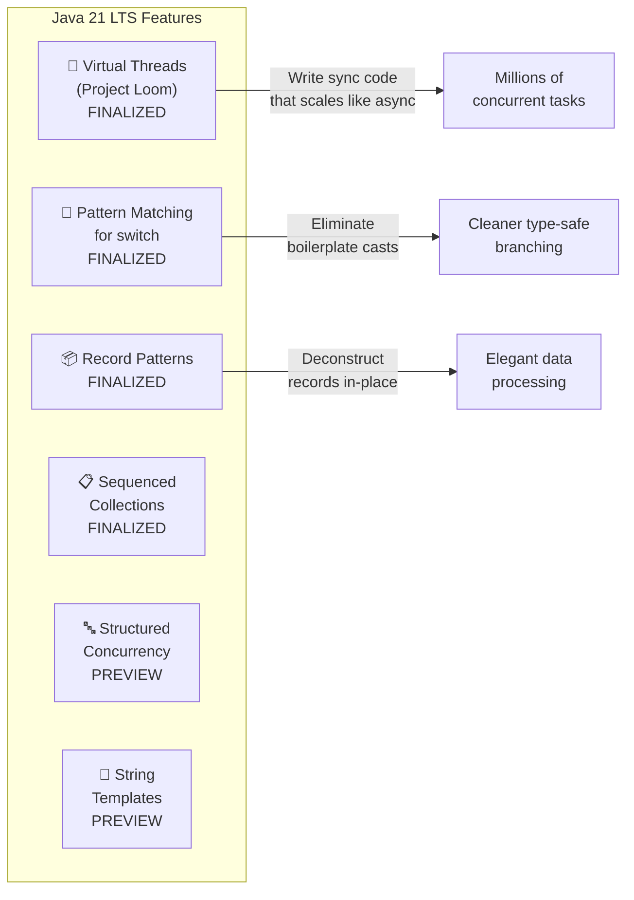

## WHY

Java 21 (September 2023) is a Long-Term Support (LTS) release that contains the most transformative features since Java 8. Three features alone — **Virtual Threads**, **Pattern Matching for switch**, and **Record Patterns** — fundamentally change how you write Java code. Staying on Java 8 or 11 while ignoring these is like ignoring streams and lambdas in 2024.

Every modern Java engineering interview asks about Java 21. These features are not just syntax sugar — they solve real performance and correctness problems.

---

## THEORY

### 1. Virtual Threads (Project Loom) — Finalized in Java 21

Traditional Java threads are OS threads. Creating 10,000 OS threads exhausts RAM and causes OS scheduling overhead. Virtual threads are JVM-managed lightweight threads — you can create **millions** of them.

**Key Properties:**
- Mount/unmount on OS carrier threads automatically when blocking
- When a virtual thread does I/O (database query, HTTP call), it unmounts from the OS thread, freeing it for other virtual threads
- No reactive/callback hell — you write **synchronous-style** code that behaves asynchronously

```java
// Before (CompletableFuture hell for non-blocking):
CompletableFuture<User> future = CompletableFuture.supplyAsync(() -> fetchUser(id))
    .thenCompose(user -> CompletableFuture.supplyAsync(() -> fetchOrders(user)))
    ...

// After (Virtual Threads — simple blocking code, massive scale):
try (var executor = Executors.newVirtualThreadPerTaskExecutor()) {
    executor.submit(() -> {
        User user = fetchUser(id);        // Blocks, but virtual thread unmounts!
        List<Order> orders = fetchOrders(user.getId()); // Blocks again, still fine!
        return buildResponse(user, orders);
    });
}
```

### 2. Pattern Matching for `switch` (Finalized Java 21)

Previously, instanceof checks required verbose casting. Pattern matching eliminates the cast:

```java
// Old Java 8 way:
if (shape instanceof Circle) {
    double area = ((Circle) shape).getArea();  // Explicit cast — tedious
} else if (shape instanceof Rectangle) {
    double area = ((Rectangle) shape).getArea();
}

// Java 21 pattern matching:
double area = switch (shape) {
    case Circle c    -> c.getArea();
    case Rectangle r -> r.getArea();
    case Triangle t  -> t.getArea();
    default          -> throw new IllegalArgumentException("Unknown shape");
};
```

With **guarded patterns** (when clauses):
```java
String description = switch (obj) {
    case Integer i when i < 0  -> "negative number";
    case Integer i when i == 0 -> "zero";
    case Integer i             -> "positive: " + i;
    case String s when s.isBlank() -> "blank string";
    case String s              -> "string: " + s;
    case null                  -> "null value";
    default                    -> "other: " + obj.getClass().getSimpleName();
};
```

### 3. Record Patterns (Java 21)

Deconstruct records directly in pattern matching:

```java
record Point(int x, int y) {}
record Rect(Point topLeft, Point bottomRight) {}

// Without record patterns (Java 16 records, but no deconstruction):
if (obj instanceof Rect rect) {
    Point topLeft = rect.topLeft();
    int x = topLeft.x();
}

// Java 21 Record Patterns — deconstruct inline:
if (obj instanceof Rect(Point(int x1, int y1), Point(int x2, int y2))) {
    System.out.printf("Rect from (%d,%d) to (%d,%d)%n", x1, y1, x2, y2);
}

// Combined with switch:
String formatShape(Object shape) {
    return switch (shape) {
        case Point(int x, int y)                -> "Point at (%d, %d)".formatted(x, y);
        case Rect(Point(var x1, var y1), var br)-> "Rect from (%d,%d)".formatted(x1, y1);
        default                                  -> shape.toString();
    };
}
```

### 4. Sequenced Collections (Java 21)

New interfaces with defined encounter order: `SequencedCollection`, `SequencedSet`, `SequencedMap`.

```java
// Access first and last elements uniformly across List, Deque, SortedSet
SequencedCollection<String> list = new ArrayList<>(List.of("a", "b", "c"));
list.getFirst();    // "a"
list.getLast();     // "c"
list.reversed();    // ["c", "b", "a"] — reversed view
list.addFirst("z"); // ["z", "a", "b", "c"]

// Works on LinkedHashMap too (preserves insertion order)
SequencedMap<String, Integer> map = new LinkedHashMap<>();
map.put("one", 1); map.put("two", 2);
map.firstEntry();   // {one=1}
map.lastEntry();    // {two=2}
```

### 5. Structured Concurrency (Preview in Java 21)

Treat multiple concurrent tasks as a single unit of work:

```java
try (var scope = new StructuredTaskScope.ShutdownOnFailure()) {
    Future<User>   user   = scope.fork(() -> userService.findById(id));
    Future<List<Order>> orders = scope.fork(() -> orderService.getByUser(id));

    scope.join();           // Wait for both
    scope.throwIfFailed();  // Propagate exception if either failed

    return new UserDashboard(user.resultNow(), orders.resultNow());
}
// If userService throws: orders task is automatically cancelled ✅
// Clean, structured, exception-safe parallel execution
```

### 6. String Templates (Preview in Java 21)

Safer, more expressive string interpolation:

```java
// Old (error-prone concatenation or format):
String query = "SELECT * FROM users WHERE id = " + userId; // SQL injection risk!

// Java 21 String Templates (preview):
String query = STR."SELECT * FROM users WHERE id = \{userId}";
// STR processor handles escaping/formatting

// Custom template processors:
String html = HTML."""
    <h1>\{title}</h1>
    <p>\{description}</p>
    """; // HTML processor auto-escapes special characters
```

---

## VISUALIZATION_CONFIG



---

## CODE

### Virtual Threads in Spring Boot 3.2+

```java
// Spring Boot 3.2+ — Enable virtual threads with ONE property:
// spring.threads.virtual.enabled=true

// Or manually configure:
@Configuration
public class WebConfig {
    @Bean
    public TomcatProtocolHandlerCustomizer<?> virtualThreadsProtocol() {
        return handler -> handler.setExecutor(Executors.newVirtualThreadPerTaskExecutor());
    }
}

// Now ALL request handling uses virtual threads automatically!
// Your blocking @Service methods work perfectly — no reactive code needed!
@RestController
public class OrderController {
    @GetMapping("/orders/{userId}")
    public List<Order> getOrders(@PathVariable UUID userId) {
        // This blocks 3 times (user DB + orders DB + inventory DB)
        // With virtual threads: EACH block unmounts the virtual thread,
        // freeing the carrier thread to serve other requests!
        User user = userService.findById(userId);      // block 1 — ok!
        List<Order> orders = orderService.getByUser(userId); // block 2 — ok!
        return enrichWithInventory(orders);            // block 3 — ok!
    }
}
```

### Pattern Matching — Replacing Visitor Pattern

```java
// Before Java 21: verbose Visitor pattern or instanceof chains
sealed interface Expr permits Num, Add, Mul {}
record Num(double value) implements Expr {}
record Add(Expr left, Expr right) implements Expr {}
record Mul(Expr left, Expr right) implements Expr {}

// Java 21: Pattern matching replaces the entire Visitor pattern
public double evaluate(Expr expr) {
    return switch (expr) {
        case Num(var v)         -> v;
        case Add(var l, var r)  -> evaluate(l) + evaluate(r);
        case Mul(var l, var r)  -> evaluate(l) * evaluate(r);
    };
    // Compiler verifies EXHAUSTIVENESS for sealed hierarchies — no default needed!
    // If you add a new sealed subtype, the compiler FORCES you to handle it here.
}

// Usage:
// evaluate(new Add(new Mul(new Num(3), new Num(4)), new Num(5)))
// = evaluate(Mul(3,4)) + 5 = 12 + 5 = 17
```

### Sealed Classes + Pattern Matching = Algebraic Data Types

```java
// Result type (like Rust's Result<T,E>)
sealed interface Result<T> permits Success, Failure {}
record Success<T>(T value) implements Result<T> {}
record Failure<T>(String error) implements Result<T> {}

// Process result exhaustively — compiler catches missing cases
public void processOrderResult(Result<Order> result) {
    switch (result) {
        case Success<Order>(Order order) ->
            notificationService.sendConfirmation(order);
        case Failure<Order>(String error) ->
            notificationService.sendFailureAlert(error);
    }
}

// Chain results functionally
Result<Order> orderResult = orderService.create(request);
Result<Invoice> invoiceResult = switch (orderResult) {
    case Success<Order>(Order order) -> invoiceService.generate(order);
    case Failure<Order> failure      -> failure; // propagate error
};
```

---

## REAL_WORLD

### How Quarkus Uses Virtual Threads

Quarkus and Spring Boot 3.2+ frameworks offer virtual thread support via configuration. A service previously needing 200 reactive code paths to handle 200 concurrent DB calls now uses 200 virtual threads with simple, readable synchronous code. At Shopify, migrating critical checkout services to virtual threads reduced code complexity by ~40% (fewer reactive operators) while maintaining the same throughput. The "cost" of creating a virtual thread is approximately **200 bytes of memory** vs ~1MB for OS threads.

---

## INTERVIEW

**Q1: What is the fundamental difference between OS threads and virtual threads?**
> OS threads are scheduled and managed by the operating system. Creating 10,000 of them consumes ~10GB RAM and causes heavy context-switching overhead. Virtual threads are JVM-managed, extremely lightweight (~200 bytes), and can number in the millions. The JVM maps them to a small pool of OS "carrier threads". When a virtual thread blocks on I/O, the JVM unmounts it from the carrier thread, parks the virtual thread state on the heap, and the carrier thread is free to run another virtual thread. No OS context switch occurs.

**Q2: Are virtual threads always better than platform threads?**
> No. Virtual threads excel for **I/O-bound** work (database queries, HTTP calls, file reads). For **CPU-bound** work (image processing, cryptography, parsing), you should still use a thread pool sized to the number of CPU cores. Having more CPU-bound virtual threads than CPU cores just causes more context switching without benefit. Also avoid `ThreadLocal` state with virtual threads when the pool is very large — each virtual thread gets its own ThreadLocal, so with millions of threads, memory usage multiplies.

**Q3: What is a sealed class and what problem does it solve?**
> A sealed class restricts which other classes can extend or implement it. `sealed interface Shape permits Circle, Rectangle, Triangle`. The key benefit is **exhaustiveness checking** in pattern matching switches — the compiler KNOWS exactly which subtypes exist and can verify that your switch handles all of them. Without sealed classes, you need a `default` branch that might silently hide bugs when new subtypes are added. Sealed classes make the type hierarchy **closed for extension** (controlled), enabling algebraic data types in Java.

**Q4: What are Record Patterns and where do they help the most?**
> Record patterns allow destructuring records directly in `instanceof` checks and `switch` expressions. Instead of: `if (obj instanceof Point p) { int x = p.x(); int y = p.y(); }` you write: `if (obj instanceof Point(int x, int y)) { ... }`. They're most powerful when working with **nested data structures** — you can destructure multiple levels in a single pattern: `case Rect(Point(var x1, var y1), Point(var x2, var y2))`. They eliminate boilerplate accessor calls and make data-processing code dramatically more concise.

---

## FEYNMAN CHECK

**Virtual Threads**: Imagine a restaurant with 10 tables (carrier threads) and 10,000 customers (virtual threads). In the old system, each customer is physically sitting at a table the entire time, even when waiting for food. With virtual threads, customers "hover" until food arrives — when they're waiting, someone else sits at the table. The restaurant serves 10,000 customers with just 10 physical tables!

**Pattern Matching / Sealed Types**: Think of a sorting machine that must handle three types of packages: small, medium, large. In old Java, the machine would check "is it a small box? try to cast it to small box. now check is it a medium box? try to cast..." In Java 21, the machine just does: `case SmallBox(var weight) → one_belt, case MediumBox(var weight, var length) → another_belt`. Cleaner and the factory GUARANTEES there are only 3 types (sealed), so the machine never encounters a surprise "extra large" box without warning.

---

## BUILD

**Challenge: Modernize a legacy service using Java 21 features.**

Legacy code to modernize:
```java
// Before (Java 8 style):
public String formatPayment(Object payment) {
    if (payment instanceof CreditCardPayment) {
        CreditCardPayment cc = (CreditCardPayment) payment;
        return "Card: " + cc.getLastFour();
    } else if (payment instanceof BankTransferPayment) {
        BankTransferPayment bt = (BankTransferPayment) payment;
        return "Bank: " + bt.getAccountSuffix();
    } else if (payment instanceof CryptoPayment) {
        CryptoPayment cp = (CryptoPayment) payment;
        return "Crypto: " + cp.getCurrency();
    }
    return "Unknown";
}
```

Requirements:
1. Convert `Payment` to a `sealed interface` with three `record` implementations
2. Refactor `formatPayment` to use pattern matching switch
3. Add a `value()` method using record pattern deconstruction
4. Create a payment processing service using Virtual Threads: process 1000 payments concurrently using `Executors.newVirtualThreadPerTaskExecutor()`
5. Benchmark: compare throughput with `newFixedThreadPool(10)` under simulated 50ms I/O delay per payment
6. Use Structured Concurrency to simultaneously validate payment + check fraud, cancelling the other if one fails

---

## SPACED REVIEW

- **Virtual Threads**: JVM-managed, ~200 bytes each, millions possible, unmount on I/O automatically
- Enable in Spring Boot 3.2+: `spring.threads.virtual.enabled=true`
- Virtual threads are for **I/O-bound**; platform threads for **CPU-bound**
- **Sealed classes**: restrict who can extend — enables compiler exhaustiveness checking
- **Pattern matching switch**: `case Circle c → ...` — eliminates explicit cast
- **Guarded patterns**: `case Integer i when i < 0 → ...`
- **Record patterns**: `instanceof Point(int x, int y)` — deconstruct inline
- **Sequenced Collections**: `getFirst()`, `getLast()`, `reversed()` — uniform API for all ordered collections
- **Structured Concurrency**: tasks succeed/fail as a unit — automatic cancellation on failure
- Java 21 = LTS. Upgrade path: Java 8 → 11 → 17 → 21 (each LTS = supported for years)

