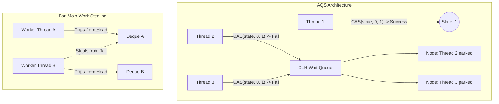

## WHY

Concurrency is the art of executing multiple computations simultaneously. In modern cloud-native architectures, applications must handle thousands of concurrent requests with sub-millisecond latency. A naive approach to concurrency—relying purely on `synchronized` blocks and global locks—leads to catastrophic bottlenecks, thread contention, and priority inversion.

Java's concurrency model has evolved significantly from the basic `Thread` and `Runnable` constructs of JDK 1.0. To build high-performance, low-latency systems (like high-frequency trading platforms, real-time analytics engines, or massively multiplayer games), top-tier developers must move beyond basic synchronization. You must understand the internal mechanics of lock-free programming, Compare-And-Swap (CAS) instructions, the `java.util.concurrent` (J.U.C) framework, and how the JVM interacts directly with CPU-level memory barriers. 

Without this deep knowledge, systems suffer from hidden race conditions, deadlocks, and "liveness" issues that only appear under extreme production loads.

---

## THEORY

At the core of advanced Java concurrency is the abandonment of pessimistic locking (where a thread blocks waiting for a lock) in favor of optimistic, lock-free algorithms. 

### Compare-And-Swap (CAS) Mechanics
CAS is a hardware-level atomic instruction provided by modern CPUs (like `CMPXCHG` on x86). It operates on three operands:
1. A memory location ($V$).
2. The expected old value ($A$).
3. The new value to write ($B$).

The CPU atomically updates $V$ to $B$ *only if* the current value of $V$ matches $A$. If $V$ does not match $A$ (meaning another thread modified it), the instruction fails, and the thread typically retries the operation in a `while` loop (a spin-lock). 

Java exposes CAS through the `Unsafe` class (historically) and now safely through `VarHandle` and the `java.util.concurrent.atomic` package. Because CAS does not put threads to sleep (avoiding costly context switches to the OS kernel), it is radically faster under low-to-moderate contention.

### The AQS (AbstractQueuedSynchronizer)
The AQS is the heartbeat of the J.U.C package. It is the internal framework used to build `ReentrantLock`, `CountDownLatch`, `Semaphore`, and `ReadWriteLock`. 

AQS relies on:
- A `volatile int state` to represent the synchronization state (e.g., lock acquired = 1, unlocked = 0).
- A FIFO wait queue (a variant of a CLH queue) to manage blocked threads.
- CAS operations to atomically update the state.

When a thread attempts to acquire a lock via AQS, it uses CAS to set the state. If it succeeds, it proceeds. If it fails, AQS parks the thread using `LockSupport.park()` and enqueues it. When the lock is released, AQS uses `LockSupport.unpark()` to wake the next thread in the queue.

### The Fork/Join Framework & Work-Stealing
Introduced in Java 7, `ForkJoinPool` is optimized for divide-and-conquer workloads. Unlike a standard `ThreadPoolExecutor` where threads share a single task queue, every thread in a `ForkJoinPool` has its own local deque (double-ended queue).
- **Forking:** When a thread divides a task, it pushes the subtasks onto the head of its *own* deque.
- **Work-Stealing:** If Thread A finishes its tasks and its deque is empty, it acts as a "thief" and steals tasks from the *tail* of Thread B's deque. This minimizes contention (Thread B works on the head, Thread A steals from the tail) and keeps all CPU cores saturated.

---

## VISUALIZATION_CONFIG



---

## IMPLEMENTATION

Let's implement a highly advanced, lock-free Stack structure using raw CAS mechanics via `AtomicReference`. This bypasses all synchronization bottlenecks, making it perfectly safe and wildly fast for concurrent environments.

```java
package com.devmastery.concurrency;

import java.util.concurrent.atomic.AtomicReference;

/**
 * A highly optimized, lock-free concurrent Stack using Treiber's algorithm.
 * It uses Compare-And-Swap (CAS) to achieve thread safety without any blocking locks.
 */
public class LockFreeStack<T> {

    // AtomicReference acts as the head pointer to the stack
    private final AtomicReference<Node<T>> head = new AtomicReference<>();

    // Internal Node class holding the data and pointer to the next element
    private static class Node<E> {
        final E item;
        Node<E> next;

        Node(E item) {
            this.item = item;
        }
    }

    /**
     * Pushes an item onto the stack atomically.
     */
    public void push(T item) {
        Node<T> newHead = new Node<>(item);
        Node<T> oldHead;
        
        // Spin-lock: Loop until the CAS operation succeeds
        do {
            oldHead = head.get();
            newHead.next = oldHead;
            
            // CAS: "If the head is STILL oldHead, atomically set it to newHead"
        } while (!head.compareAndSet(oldHead, newHead));
    }

    /**
     * Pops an item from the stack atomically.
     * Returns null if the stack is empty.
     */
    public T pop() {
        Node<T> oldHead;
        Node<T> newHead;
        
        // Spin-lock: Loop until the CAS operation succeeds
        do {
            oldHead = head.get();
            if (oldHead == null) {
                return null; // Stack is empty
            }
            newHead = oldHead.next;
            
            // CAS: "If the head is STILL oldHead, atomically set it to the next node"
        } while (!head.compareAndSet(oldHead, newHead));
        
        return oldHead.item;
    }
}
```

### Addressing the ABA Problem
In the above code, if Thread 1 reads `oldHead` (A), gets paused, and Thread 2 pops A, pops B, and pushes a *new* A, Thread 1 will wake up, see `head == A`, and assume nothing changed. This is the **ABA Problem**. 
In Java, garbage collection prevents memory address reuse (unlike C++), so the ABA problem is less destructive for simple object references. However, for complex CAS logic, Java provides `AtomicStampedReference`, which attaches an integer stamp (version number) to the reference to detect ABA modifications.

---

## VERIFICATION

To verify the lock-free stack under extreme contention, we use a `CountDownLatch` to synchronize the start of hundreds of threads simultaneously, flooding the stack with concurrent pushes and pops.

```java
package com.devmastery.concurrency;

import org.junit.jupiter.api.Test;
import java.util.concurrent.CountDownLatch;
import java.util.concurrent.ExecutorService;
import java.util.concurrent.Executors;
import java.util.concurrent.atomic.AtomicInteger;

import static org.junit.jupiter.api.Assertions.assertEquals;

public class LockFreeStackTest {

    @Test
    public void testHighContentionPushPop() throws InterruptedException {
        LockFreeStack<Integer> stack = new LockFreeStack<>();
        int threadCount = 100;
        int operationsPerThread = 1000;
        
        ExecutorService executor = Executors.newFixedThreadPool(threadCount);
        CountDownLatch readyLatch = new CountDownLatch(threadCount);
        CountDownLatch startLatch = new CountDownLatch(1);
        CountDownLatch doneLatch = new CountDownLatch(threadCount);

        AtomicInteger totalPushed = new AtomicInteger(0);

        // Create 100 threads that will each push 1000 items
        for (int i = 0; i < threadCount; i++) {
            executor.submit(() -> {
                readyLatch.countDown();
                try {
                    startLatch.await(); // Wait for the global start signal
                    for (int j = 0; j < operationsPerThread; j++) {
                        stack.push(j);
                        totalPushed.incrementAndGet();
                    }
                } catch (InterruptedException e) {
                    Thread.currentThread().interrupt();
                } finally {
                    doneLatch.countDown();
                }
            });
        }

        // Wait for all threads to initialize, then fire the starting gun
        readyLatch.await();
        startLatch.countDown();
        doneLatch.await();

        assertEquals(threadCount * operationsPerThread, totalPushed.get());

        // Verify pop integrity
        int popCount = 0;
        while (stack.pop() != null) {
            popCount++;
        }
        assertEquals(threadCount * operationsPerThread, popCount);
        
        executor.shutdown();
    }
}
```

### Expected Outcome
The `LockFreeStack` will process hundreds of thousands of operations across 100 threads in milliseconds without throwing `ConcurrentModificationException` and without losing a single item. Because it never blocks at the OS level, it will drastically outperform `Collections.synchronizedList()` or `ReentrantLock` implementations under heavy load.
