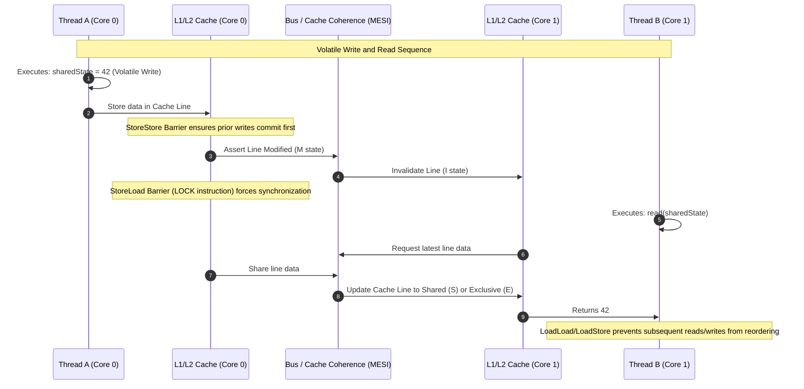

## WHY

In symmetric multiprocessing (SMP) systems, modern multi-core CPUs rely on deep memory hierarchies (L1, L2, L3 caches, and store buffers) to hide the latency of main memory access. This optimization introduces cache coherence challenges. When multiple threads run on separate cores, they modify local cache lines rather than writing directly to RAM. Without strict synchronization rules, modifications made by one core are invisible to others, leading to stale reads and split-brain states.

Furthermore, both the Java compiler (javac) and the Just-In-Time (JIT) compiler (C1/C2) aggressively reorder instructions to maximize pipeline utilization and instruction-level parallelism (ILP). CPUs also execute instructions out-of-order (Speculative Execution) to avoid processor stalls. While these optimizations preserve single-threaded program correctness (the *as-if-serial* semantics), they break multi-threaded correctness. 

```
[Core 0] -> [L1 Cache] -> [L2 Cache] ---\
                                         +--> [L3 Cache] -> [Main Memory]
[Core 1] -> [L1 Cache] -> [L2 Cache] ---/
```

Without a formal memory model, reasoning about concurrent state modifications is impossible. Developers would have to write hardware-specific assembly code with explicit memory fences (`MFENCE`, `LFENCE`, `SFENCE` on x86, or `DMB` on ARM) to guarantee visibility and ordering. 

The Java Memory Model (JMM), specified in JLS §17.4, abstracts this hardware complexity. It establishes a contract between the developer, the compiler, and the execution engine. It defines under what conditions a read of a variable by one thread is guaranteed to see the write to that same variable by another thread, regardless of the underlying hardware architecture.

---

## THEORY

### Internal Mechanics & Memory Barriers
At the core of the JMM is the concept of **Happens-Before** relationships. Happens-Before is a partial order over the actions of a Java program. If action $A$ happens-before action $B$, then the results of $A$ are guaranteed to be visible to $B$, and $A$ is ordered before $B$.

To enforce these relationships across different CPU architectures, the JVM inserts hardware-level memory barriers (fences):
1. **LoadLoad**: Guarantees that all preceding loads are completed before subsequent loads are executed.
2. **StoreStore**: Guarantees that all preceding stores are flushed to cache/memory before subsequent stores are executed.
3. **LoadStore**: Guarantees that preceding loads complete before subsequent stores are executed.
4. **StoreLoad**: The strongest barrier. Guarantees that preceding stores are flushed and visible before subsequent loads are executed. This prevents stale reads after writes.

### CPU-Level Implementation of Volatile
When a field is declared `volatile`, the JIT compiler emits specific instruction sequences:
* **Volatile Write**: Prevents preceding writes from being reordered with it. The JIT emits a `StoreStore` barrier before the write, and a `StoreLoad` barrier *after* the write. On x86, the `StoreLoad` barrier is often implemented using a locked instruction like `LOCK ADD` or `MFENCE`, which flushes the local CPU store buffer to the L1/L2 cache and invalidates the corresponding cache lines on other cores via cache-coherence protocols (such as MESI or MOESI).
* **Volatile Read**: Prevents subsequent reads or writes from being reordered before it. The JIT emits a `LoadLoad` and `LoadStore` barrier after the read. On x86, because the architecture provides strong ordering guarantees (reads are not reordered with other reads), these barriers are often no-ops at the hardware level, making volatile reads extremely cheap on x86 compared to volatile writes.

```
Volatile Write Sequence:
[StoreStore Barrier] -> Volatile Write -> [StoreLoad Barrier] (Heavy!)

Volatile Read Sequence:
Volatile Read -> [LoadLoad Barrier] -> [LoadStore Barrier] (Cheap on x86)
```

### The Happens-Before Rules
The JMM defines several key rules that establish a happens-before order:
* **Program Order Rule**: Each action in a single thread happens-before every action in that thread that comes later in the program order.
* **Monitor Lock Rule**: An unlock on a monitor lock happens-before every subsequent lock on that same monitor.
* **Volatile Variable Rule**: A write to a volatile field happens-before every subsequent read of that same field.
* **Thread Start Rule**: A call to `Thread.start()` on a thread happens-before any action in the started thread.
* **Thread Termination Rule**: Any action in a thread happens-before any other thread detects that the thread has terminated (via `Thread.join()` or `Thread.isAlive()`).
* **Transitivity**: If $A \rightarrow B$ and $B \rightarrow C$, then $A \rightarrow C$.

### Safe Publication and Final Fields
The JMM provides special guarantees for `final` fields. Under the JMM, a reference to an object that contains a `final` field is guaranteed to see the initialized value of that final field once the constructor completes. 
* **Mechanics**: The compiler places a `StoreStore` barrier at the end of the constructor. This ensures that the writes to the final fields are committed to memory before the reference to the containing object itself is published.
* **Escape Hazard**: If the `this` reference escapes the constructor during execution (e.g., registering the object in a listener within the constructor), this guarantee is voided, and other threads may observe uninitialized or partially initialized final fields.

### Common Misconceptions
* **"Volatile is for atomicity"**: No. Volatile only guarantees visibility and ordering. It does not guarantee atomicity. An operation like `count++` on a volatile variable is not thread-safe because it consists of three distinct steps: read, modify, and write.
* **"Volatile forces RAM access directly"**: Not quite. It forces synchronization at the CPU cache hierarchy level using cache coherence protocols (MESI). The data is written to the local cache, and the hardware ensures other cores invalidate their caches and pull the updated cache line. It does not bypass the CPU caches entirely to hit physical DRAM, which would be catastrophically slow.

---

## VISUALIZATION_CONFIG



---

## IMPLEMENTATION

The following code demonstrates a custom, production-grade double-checked locking singleton that leverages the JMM guarantees. It explicitly showcases the danger of partial initialization without `volatile` and how `final` fields behave under construction.

```java
package com.devmastery.jmm;

import java.util.Objects;

public final class SafeLazySingleton {

    // Volatile is mandatory here to prevent instruction reordering.
    // Without volatile, the compiler/CPU can reorder the memory allocation 
    // and the assignment to 'instance' before the constructor runs.
    private static volatile SafeLazySingleton instance;

    // These fields demonstrate final field guarantees
    private final String secureToken;
    private final long initializationTimestamp;
    
    // Non-final field to demonstrate safe publication via volatile write
    private String runtimeConfig;

    private SafeLazySingleton(String secureToken, String runtimeConfig) {
        this.secureToken = Objects.requireNonNull(secureToken, "Token cannot be null");
        this.initializationTimestamp = System.nanoTime();
        this.runtimeConfig = runtimeConfig; // Safely published because of the volatile write on 'instance' later
    }

    /**
     * Double-Checked Locking implementation.
     * Safely publishes the instance using Happens-Before rules.
     */
    public static SafeLazySingleton getInstance(String secureToken, String runtimeConfig) {
        // Read volatile variable once to a local variable (performance optimization)
        SafeLazySingleton result = instance;
        
        if (result == null) {
            synchronized (SafeLazySingleton.class) {
                result = instance;
                if (result == null) {
                    // 1. Allocate memory for SafeLazySingleton
                    // 2. Invoke constructor (sets final fields, inserts StoreStore barrier)
                    // 3. Assign reference to 'instance'
                    // Without volatile, step 3 can happen before step 2!
                    instance = result = new SafeLazySingleton(secureToken, runtimeConfig);
                }
            }
        }
        return result;
    }

    public String getSecureToken() {
        return secureToken;
    }

    public long getInitializationTimestamp() {
        return initializationTimestamp;
    }

    public String getRuntimeConfig() {
        return runtimeConfig;
    }

    public void updateRuntimeConfig(String newConfig) {
        // Standard non-volatile update. Note: changes to this will not be immediately 
        // visible to other threads unless synchronized or volatile read/write occurs.
        this.runtimeConfig = newConfig;
    }
}
```

---

## TROUBLESHOOTING_AND_PROFILING

### Diagnosing Memory Visibility & Reordering Issues
Memory model bugs are notoriously difficult to reproduce because they depend on CPU architecture, core count, thread scheduling, and load. 

#### 1. JSTRESS (jcstress)
To verify correctness against the JMM, standard unit tests are useless. You must use **jcstress** (Java Concurrency Stress tests), a suite designed to detect concurrency bugs, race conditions, and JMM violations.
Add the `jcstress-core` dependency and write a harness:

```java
@JCStressTest
@Outcome(id = "1, 1", expect = Expect.ACCEPTABLE, desc = "Both read updated values.")
@Outcome(id = "0, 1", expect = Expect.ACCEPTABLE, desc = "Thread 2 saw update, Thread 1 did not.")
@Outcome(id = "0, 0", expect = Expect.ACCEPTABLE, desc = "Neither saw update.")
@Outcome(id = "1, 0", expect = Expect.FORBIDDEN, desc = "Violates Happens-Before ordering!")
@State
public class ReorderingStressTest {
    int x = 0;
    volatile int y = 0;

    @Actor
    public void actor1() {
        x = 1; // Non-volatile write
        y = 1; // Volatile write (StoreStore before, StoreLoad after)
    }

    @Actor
    public void actor2(II_Result r) {
        r.r1 = y; // Volatile read
        r.r2 = x; // Non-volatile read
    }
}
```

#### 2. Analyzing Assembly with PrintAssembly
To verify that the JIT is emitting the correct memory barriers, you can dump the native assembly code using the HSDis (HotSpot Disassembler) plugin.
Run your JVM with the following flags:
```bash
java -XX:+UnlockDiagnosticVMOptions \
     -XX:+PrintAssembly \
     -XX:CompileCommand=print,*SafeLazySingleton.getInstance \
     -version
```
Look for the following instructions in the output:
* **x86**: `lock addl $0x0,(%rsp)` or `mfence`. The `lock` prefix on an instruction acts as a full memory barrier.
* **ARM**: `DMB ISHLD` (Data Memory Barrier, Inner Shareable, Load-Load/Store), or `LDAR` / `STLR` (Load-Acquire / Store-Release) instructions.

---

## ARCHITECTURAL_PATTERNS

### Comparison of Memory Coordination Strategies

| Strategy | Performance (Reads) | Performance (Writes) | Thread-Safety Level | Hardware Overhead | Use Case |
| :--- | :--- | :--- | :--- | :--- | :--- |
| **Volatile** | Extremely High (O(1), no-op on x86) | Medium-Low (forces store buffer flush) | Visibility & Ordering only (No atomicity) | Low (StoreLoad fence) | Flags, state transitions, single-writer/multiple-reader patterns. |
| **Synchronized (Fat Lock)** | Low (requires monitor entry) | Low (requires monitor exit) | Full Mutual Exclusion & Visibility | High (OS thread parking, context switches) | Complex state mutations with multiple dependent variables. |
| **Atomics (CAS)** | High (volatile read) | High-Medium (depends on contention) | Lock-Free Atomicity & Visibility | Medium (Bus locking on collision) | Counters, concurrent sequence generators, non-blocking stacks. |
| **VarHandle / Unsafe** | Extremely High | Custom (allows relaxed/opaque modes) | Granular control over fences | Micro-managed | High-performance systems programming (Netty, Aeron, LMAX Disruptor). |

### Decision Tree for Synchronization
```
                  Is the operation a simple read/write of a single variable?
                                       /              \
                                     Yes              No
                                     /                  \
              Does it require atomicity (e.g., counter++)?   Do you need mutual exclusion?
                             /         \                         /         \
                           Yes         No                      Yes          No
                           /             \                     /              \
                     Use Atomics    Use Volatile     Use Synchronized/   Use Lock-Free (AQS/CAS)
                     (AtomicInteger)                 ReentrantLock