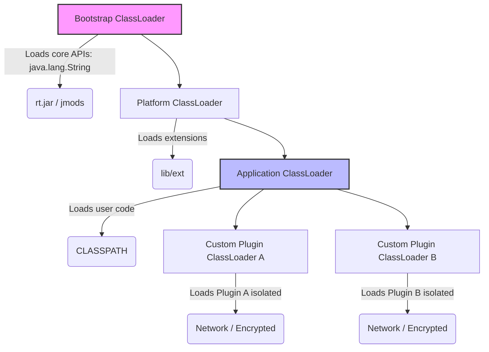

## WHY

In natively compiled languages like C or C++, the entire application is statically linked and compiled into a single executable binary before it ever runs. If you want to add a new module, you must recompile the entire binary and redeploy it.

Java takes a radically different approach: **Dynamic Linking and Loading**. The JVM does not load all `.class` files into memory when the application starts. Instead, it loads them lazily—on demand—only at the exact moment they are first referenced during execution. 

This lazy, dynamic behavior is powered by the **ClassLoader Subsystem**. Understanding ClassLoaders is what separates a junior Java developer from a senior architect. Without mastering ClassLoaders, you cannot understand how Application Servers (like Tomcat) deploy multiple web applications without them crashing into each other, how frameworks like Spring perform bytecode manipulation at runtime, or how to diagnose the dreaded `ClassNotFoundException` and `NoClassDefFoundError`.

---

## THEORY

The ClassLoader subsystem follows three strict principles: **Delegation, Visibility, and Uniqueness**.

### The Parent-Delegation Hierarchy
When the JVM needs to load a class (e.g., `com.devmastery.PaymentProcessor`), the request is handled by a hierarchy of ClassLoaders. Instead of loading the class immediately, a ClassLoader first delegates the request to its parent.

1. **Bootstrap ClassLoader (The Root):** Written in native C/C++ (historically), this loader sits at the very top. It is responsible for loading core Java APIs (`java.lang.*`, `java.util.*`) from `<JAVA_HOME>/lib/rt.jar` (or the `jmods` directory in Java 9+).
2. **Extension ClassLoader / Platform ClassLoader:** This sits below the Bootstrap loader. It loads classes from the extension directories (`<JAVA_HOME>/lib/ext`). In Java 9+, it was renamed to the Platform ClassLoader to align with the module system.
3. **Application (System) ClassLoader:** This is the default loader for your application. It loads classes found on the environment's `CLASSPATH` (your `.jar` files and compiled `/bin` output).
4. **Custom ClassLoaders:** Developers can write their own ClassLoaders to fetch bytecode over the network, decrypt encrypted classes, or isolate plugins.

**The Golden Rule:** A child ClassLoader can see classes loaded by its parent, but a parent ClassLoader *cannot* see classes loaded by its child.

### Resolution and Initialization
Class loading is a three-step process:
1. **Loading:** Fetching the raw byte array of the `.class` file and parsing it into a `java.lang.Class` object located in the JVM's Metaspace.
2. **Linking:**
   * *Verification:* Ensuring the bytecode doesn't violate JVM security constraints (e.g., jumping out of bounds).
   * *Preparation:* Allocating memory for `static` fields and initializing them to default values (e.g., `0` or `null`).
   * *Resolution:* Replacing symbolic references in the constant pool with direct memory references.
3. **Initialization:** Executing the class's `<clinit>` method (static initialization blocks and static field assignments).

### SPI and The Context ClassLoader
There is a fundamental flaw in the parent-delegation model when dealing with Service Provider Interfaces (SPI) like JDBC (`java.sql.DriverManager`). 
`DriverManager` is part of `rt.jar` and is loaded by the Bootstrap ClassLoader. However, the actual database drivers (e.g., PostgreSQL or MySQL jars) are loaded by the Application ClassLoader. Because parents cannot see children, `DriverManager` should logically be unable to find the database drivers!

To break this rule safely, Java introduced the **Thread Context ClassLoader (TCCL)**. The Bootstrap loader essentially asks the current executing thread, "Hey, what ClassLoader do you have?", and uses the Thread's local ClassLoader to bypass the hierarchy and find the database driver.

---

## VISUALIZATION_CONFIG



---

## IMPLEMENTATION

Let's build a highly advanced Custom ClassLoader. This loader will read a `.class` file that has been encrypted or scrambled on disk, decrypt it in memory, and load it securely into the JVM. This pattern is commonly used in DRM (Digital Rights Management) or proprietary enterprise software to prevent bytecode decompilation.

```java
package com.devmastery.classloader;

import java.io.ByteArrayOutputStream;
import java.io.File;
import java.io.FileInputStream;
import java.io.IOException;

/**
 * A Custom ClassLoader capable of loading classes from an isolated directory
 * and decrypting them on the fly before defining them in the JVM.
 */
public class SecurePluginClassLoader extends ClassLoader {

    private final String pluginDirectory;
    private final byte encryptionKey = 0x45; // Simple XOR key for demonstration

    public SecurePluginClassLoader(String pluginDirectory, ClassLoader parent) {
        // Explicitly set the parent to maintain the delegation model
        super(parent);
        this.pluginDirectory = pluginDirectory;
    }

    /**
     * We override findClass, NOT loadClass. 
     * Overriding loadClass breaks the parent-delegation model. By overriding findClass,
     * the JVM will automatically check parents first, and only call this if parents fail.
     */
    @Override
    protected Class<?> findClass(String name) throws ClassNotFoundException {
        try {
            // 1. Fetch the raw (encrypted) byte array from the file system
            byte[] classData = loadEncryptedClassData(name);
            
            // 2. Decrypt the bytecode in memory
            byte[] decryptedData = decrypt(classData);

            // 3. Hand the raw bytecode to the JVM's native engine to parse and link
            return defineClass(name, decryptedData, 0, decryptedData.length);

        } catch (IOException e) {
            throw new ClassNotFoundException("Could not load secure plugin: " + name, e);
        }
    }

    private byte[] loadEncryptedClassData(String className) throws IOException {
        String path = pluginDirectory + File.separator + className.replace('.', File.separatorChar) + ".enc";
        File file = new File(path);
        
        try (FileInputStream fis = new FileInputStream(file);
             ByteArrayOutputStream baos = new ByteArrayOutputStream()) {
            
            int b;
            while ((b = fis.read()) != -1) {
                baos.write(b);
            }
            return baos.toByteArray();
        }
    }

    /**
     * Performs an inverse XOR decryption to restore the original JVM bytecode.
     */
    private byte[] decrypt(byte[] encryptedData) {
        byte[] decrypted = new byte[encryptedData.length];
        for (int i = 0; i < encryptedData.length; i++) {
            decrypted[i] = (byte) (encryptedData[i] ^ encryptionKey);
        }
        return decrypted;
    }
}
```

---

## SYSTEM_DESIGN

### The "Hot Swap" Architecture
If you want to build a system that supports zero-downtime updates (like JRebel or OSGi), you must leverage ClassLoaders.

**The Problem:** Once a class is loaded by a ClassLoader (e.g., `com.example.Service`), it is permanently cached in Metaspace. You cannot "unload" or "redefine" the class within the same ClassLoader instance.

**The Solution:** 
1. Abstract the functionality behind an Interface (e.g., `IService`), loaded by the Application ClassLoader.
2. Load the actual implementation (`ServiceImplV1`) using `CustomClassLoader Instance 1`.
3. When you need to upgrade to V2, you create a brand new `CustomClassLoader Instance 2`.
4. Instance 2 loads `ServiceImplV2`.
5. You swap the reference in your application registry.
6. `CustomClassLoader Instance 1` becomes unreachable. The Garbage Collector sweeps the ClassLoader and all its associated classes out of Metaspace!

```java
// Conceptual Hot-Swap Flow
IService currentService = new PluginClassLoader("path/to/v1", appLoader).loadClass("ServiceImpl").newInstance();

// ... time passes, an update is pushed ...

IService newService = new PluginClassLoader("path/to/v2", appLoader).loadClass("ServiceImpl").newInstance();

// Atomic swap
this.activeService = newService; 

// The old classloader and its classes are now eligible for GC
```

This is the exact mechanic underlying Tomcat's application hot-reloading.
