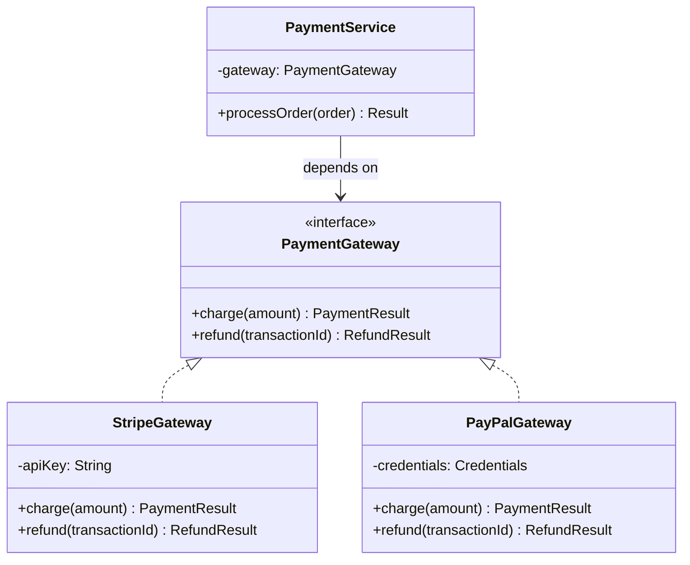

## WHY

Java was designed around objects and interfaces as the primary abstraction mechanism, and this choice was deliberate: in 1995, C++ was the dominant OOP language, and its lack of a clean interface abstraction (relying instead on multiple inheritance with diamond problems) made large codebases fragile. Java's interface mechanism solved this by separating *what* an object can do (the interface contract) from *how* it does it (the implementing class). This separation is the foundation of Java's testability, polymorphism, and the dependency injection patterns that power Spring and every modern Java framework.

The specific pain interfaces solve is **coupling between modules**. Without interfaces, when a `PaymentService` directly instantiates `StripePaymentGateway`, the service is permanently coupled to Stripe — testing requires a live Stripe account, swapping to PayPal requires modifying the service, and adding a new gateway means modifying every service that processes payments. With interfaces, `PaymentService` depends on `PaymentGateway` (the abstraction) and Spring injects `StripePaymentGateway` at runtime — tests inject `MockPaymentGateway`, production injects `StripePaymentGateway`, and adding `PayPalPaymentGateway` requires zero changes to existing services.

The production failure mode from poor interface design is **interface bloat** — an interface with 30 methods that no implementation uses fully. When `Repository` has `save`, `delete`, `findAll`, `findById`, `count`, `existsById`, `findAllPaged`, `flush`, `clearCache`, etc., every mock implementation must stub 30 methods, every test class becomes 100+ lines of mocking boilerplate, and adding a new method to the interface breaks every implementation. Spring Data solved this by segregating into multiple interfaces (`Repository`, `CrudRepository`, `PagingAndSortingRepository`, `JpaRepository`) — services depend only on the narrowest interface they need.

Senior engineers must understand: Java's evolution of interfaces (Java 8 default methods, Java 9 private methods, Java 16 sealed interfaces), when to use abstract classes vs. interfaces, the cost of interface dispatch at the JVM level, and how interfaces enable testability through dependency inversion.

## THEORY

### Object vs. Interface Hierarchy



### Interface Evolution in Java

| Java Version | Feature | Why |
|--------------|---------|-----|
| Java 1.0 (1996) | Basic interfaces | Pure contract, no implementation |
| Java 8 (2014) | `default` methods | Add methods without breaking implementations |
| Java 8 | `static` methods | Utility methods on interface |
| Java 9 (2017) | `private` methods | Share code between default methods |
| Java 16 (2021) | Sealed interfaces | Restrict allowed implementations |
| Java 17 (2021) | Sealed interfaces (final) | Pattern matching exhaustiveness |

### Interface vs. Abstract Class

| Feature | Interface | Abstract Class |
|---------|-----------|----------------|
| Inheritance | Multiple (implements many) | Single (extends one) |
| Default state | Constants only (`public static final`) | Any fields including non-static |
| Method body | `default`/`static`/`private` only | Any method body |
| Constructor | ❌ Cannot have | ✅ Can have |
| Access modifiers | Methods always `public` | Any access modifier |
| Instantiation | ❌ Cannot instantiate | ❌ Cannot instantiate |
| Use when | Defining a contract/capability | Sharing implementation among related classes |

### Object Identity vs. Equality

Java's `Object` class provides two distinct comparison mechanisms:

```
==  : Reference equality — do both variables point to the SAME heap object?
equals() : Logical equality — do the objects represent the same VALUE?

For String "hello":
  String a = "hello";
  String b = "hello";       // string pool: a and b point to SAME object
  String c = new String("hello");  // new heap object
  a == b      → true (same reference)
  a == c      → false (different references)
  a.equals(c) → true (same value)
```

### The `equals()` and `hashCode()` Contract

Three rules every developer must follow:

1. **Reflexive**: `a.equals(a)` must be true
2. **Symmetric**: `a.equals(b)` ⇔ `b.equals(a)`
3. **Transitive**: if `a.equals(b)` and `b.equals(c)`, then `a.equals(c)`
4. **`equals` ↔ `hashCode`**: if `a.equals(b)`, then `a.hashCode() == b.hashCode()`

Violating these rules breaks HashMap, HashSet, and every hash-based collection silently.

### Common Misconception

> "Interfaces with default methods are basically abstract classes."

**Reality:** Default methods allow interfaces to *add* methods without breaking implementations, but they don't provide state — interfaces still cannot have non-static fields, cannot have constructors, and cannot maintain per-instance state across methods. Abstract classes are for sharing *implementation among related classes*; interfaces are for defining *capabilities that any class can claim*. The `Comparable` interface is a capability claim — any class can be comparable, regardless of its hierarchy. The `AbstractList` abstract class shares list implementation among list types — only list-related classes extend it.

## VISUALIZATION_CONFIG
```json
{
  "language": "java",
  "fileName": "ObjectsInterfaces.java",
  "steps": [
    {
      "title": "Object = class + identity + state + behaviour",
      "description": "Every Java object has: a class (its type), an identity (address on heap), state (fields), and behaviour (methods).",
      "code": "class Dog {\n    String name;   // state\n    int    age;\n    void bark() { System.out.println(name + \": Woof!\"); }  // behaviour\n}\nDog rex = new Dog();  // identity: address on heap",
      "highlight": [
        2,
        3,
        4,
        6
      ],
      "diagram": {
        "kind": "memory",
        "stack": [
          {
            "label": "rex",
            "value": "→ 0x1000",
            "type": "Dog ref"
          }
        ],
        "heap": [
          {
            "label": "Dog@0x1000",
            "fields": [
              [
                "name",
                "null"
              ],
              [
                "age",
                "0"
              ]
            ],
            "highlight": true
          }
        ]
      }
    },
    {
      "title": "equals and hashCode contract",
      "description": "If a.equals(b) → a.hashCode() == b.hashCode(). Objects.equals handles null. Override both in value objects.",
      "code": "record Point(int x, int y) {}\n// records auto-generate equals and hashCode\nPoint a = new Point(1, 2);\nPoint b = new Point(1, 2);\nSystem.out.println(a.equals(b));  // true\nSystem.out.println(a.hashCode() == b.hashCode());  // true",
      "highlight": [
        5,
        6
      ],
      "diagram": {
        "kind": "boxes",
        "title": "equals + hashCode contract",
        "items": [
          {
            "label": "equals → true",
            "color": "#10b981"
          },
          {
            "label": "hashCodes MUST match",
            "color": "#10b981",
            "highlight": true
          },
          {
            "label": "use record or IDE generation",
            "color": "#818cf8"
          }
        ]
      }
    },
    {
      "title": "Interface as type",
      "description": "Declare variables with the interface type. This allows hot-swapping implementations and makes code testable (inject a mock or stub).",
      "code": "// Program to interface\nList<String>     list = new ArrayList<>();\nSet<String>      set  = new LinkedHashSet<>();\nQueue<Integer>   q    = new PriorityQueue<>();\nPaymentGateway   pg   = new StripeGateway();  // swap with FakeGateway in test",
      "highlight": [
        5
      ],
      "diagram": {
        "kind": "boxes",
        "title": "Interface type = flexibility",
        "items": [
          {
            "label": "PaymentGateway (interface)",
            "color": "#818cf8"
          },
          {
            "label": "StripeGateway (prod)",
            "color": "#10b981"
          },
          {
            "label": "FakeGateway (test)",
            "color": "#10b981",
            "highlight": true
          }
        ]
      }
    },
    {
      "title": "Object class — root of everything",
      "description": "Every class implicitly extends Object. Object provides toString, equals, hashCode, getClass, clone, notify, wait.",
      "code": "Object obj = new Object();\nobj.getClass();       // Class<Object>\nobj.hashCode();       // identity hash code\nobj.toString();       // getClass().getName() + \"@\" + hexHashCode\nobj.equals(obj);      // identity comparison by default\n// wait/notify/notifyAll — used with synchronized for threading",
      "highlight": [
        2,
        3,
        4,
        5
      ],
      "diagram": {
        "kind": "boxes",
        "title": "Object methods",
        "items": [
          {
            "label": "toString()",
            "color": "#818cf8"
          },
          {
            "label": "equals()",
            "color": "#10b981",
            "highlight": true
          },
          {
            "label": "hashCode()",
            "color": "#10b981"
          },
          {
            "label": "getClass()",
            "color": "#818cf8"
          },
          {
            "label": "wait/notify()",
            "color": "#f59e0b",
            "value": "threading primitives"
          }
        ]
      }
    },
    {
      "title": "Marker interfaces",
      "description": "Some interfaces have no methods — they just mark a class for special treatment. Serializable, Cloneable, and RandomAccess are classic examples.",
      "code": "class MyClass implements Serializable {}  // no methods to implement\n// JVM/ObjectOutputStream checks: instanceof Serializable\nif (obj instanceof Serializable) { serialize(obj); }",
      "highlight": [
        1,
        3
      ],
      "diagram": {
        "kind": "boxes",
        "title": "Marker interfaces",
        "items": [
          {
            "label": "Serializable",
            "color": "#818cf8",
            "value": "allows serialization"
          },
          {
            "label": "Cloneable",
            "color": "#818cf8",
            "value": "allows Object.clone()"
          },
          {
            "label": "RandomAccess",
            "color": "#818cf8",
            "value": "hints O(1) get()"
          },
          {
            "label": "no methods — just a tag",
            "color": "#f59e0b",
            "highlight": true
          }
        ]
      }
    }
  ]
}
```

## CODE

### Level 1 — Beginner: Basic Interface and Implementation

```java
// Define a contract
public interface Shape {
    double area();
    double perimeter();
}

// Implementations of the contract
public class Rectangle implements Shape {
    private final double width;
    private final double height;

    public Rectangle(double width, double height) {
        this.width = width;
        this.height = height;
    }

    @Override
    public double area() {
        return width * height;
    }

    @Override
    public double perimeter() {
        return 2 * (width + height);
    }
}

public class Circle implements Shape {
    private final double radius;
    public Circle(double radius) { this.radius = radius; }

    @Override
    public double area() {
        return Math.PI * radius * radius;
    }

    @Override
    public double perimeter() {
        return 2 * Math.PI * radius;
    }
}

// Polymorphism in action
public class Main {
    public static void main(String[] args) {
        Shape[] shapes = { new Rectangle(4, 3), new Circle(5) };
        for (Shape s : shapes) {
            // Same method call, different behavior per implementation
            System.out.printf("Area=%.2f, Perimeter=%.2f%n", s.area(), s.perimeter());
        }
    }
}
```

### Level 2 — Intermediate: Default Methods, Interface Composition, equals/hashCode

```java
import java.util.*;

// Interface with default methods (Java 8+)
public interface Comparable2D {
    double x();
    double y();

    // Default method — provided implementation
    default double distanceFromOrigin() {
        return Math.sqrt(x() * x() + y() * y());
    }

    // Static factory method on interface
    static Comparable2D of(double x, double y) {
        return new Point(x, y);
    }
}

// Interface composition
public interface Movable {
    void moveTo(double x, double y);
}

public interface Drawable {
    void draw();
}

// A class can implement multiple interfaces
public class Point implements Comparable2D, Movable, Drawable {
    private double x, y;
    public Point(double x, double y) { this.x = x; this.y = y; }

    public double x() { return x; }
    public double y() { return y; }
    public void moveTo(double x, double y) { this.x = x; this.y = y; }
    public void draw() { System.out.printf("Drawing point at (%.1f, %.1f)%n", x, y); }

    // ✅ Correct equals/hashCode implementation
    @Override
    public boolean equals(Object obj) {
        if (this == obj) return true;
        if (!(obj instanceof Point other)) return false;
        return Double.compare(x, other.x) == 0 && Double.compare(y, other.y) == 0;
    }

    @Override
    public int hashCode() {
        return Objects.hash(x, y);  // generates consistent hash from fields
    }

    @Override
    public String toString() {
        return String.format("Point(%.1f, %.1f)", x, y);
    }
}

// Records (Java 16+) — automatic equals, hashCode, toString
public record Vector(double x, double y) implements Comparable2D {
    public Vector scaled(double factor) {
        return new Vector(x * factor, y * factor);
    }
}
```

### Level 3 — Advanced: Sealed Interfaces and Pattern Matching

```java
// Sealed interface (Java 17+) — restricts which classes can implement
public sealed interface PaymentResult permits Success, Declined, Pending, NetworkError {}

public record Success(String transactionId, double amount) implements PaymentResult {}
public record Declined(String reason, String code) implements PaymentResult {}
public record Pending(String waitingFor, long timeoutMillis) implements PaymentResult {}
public record NetworkError(Throwable cause) implements PaymentResult {}

public class PaymentProcessor {

    // Pattern matching with sealed interface (Java 21+)
    // Compiler verifies all cases are handled — no default needed
    public String describeResult(PaymentResult result) {
        return switch (result) {
            case Success(var txId, var amount) ->
                String.format("✅ Charged $%.2f, tx=%s", amount, txId);
            case Declined(var reason, var code) ->
                String.format("❌ Declined: %s [%s]", reason, code);
            case Pending(var waitingFor, var timeoutMs) ->
                String.format("⏳ Awaiting %s (timeout %dms)", waitingFor, timeoutMs);
            case NetworkError(var cause) ->
                String.format("🔌 Network failure: %s", cause.getMessage());
        };
    }

    // Functional pipeline using sealed types
    public boolean isRetryable(PaymentResult result) {
        return switch (result) {
            case NetworkError ignored -> true;     // network errors are retryable
            case Pending ignored -> true;          // pending should be retried
            case Success ignored -> false;         // success doesn't need retry
            case Declined ignored -> false;        // decline is final
        };
    }
}
```

### Level 4 — Expert / Production: Generic Repository Pattern with Interface Segregation

```java
import java.util.*;
import java.util.function.*;
import java.util.stream.*;

/**
 * Production-grade repository hierarchy following Interface Segregation Principle.
 * Each service depends only on the narrowest interface it needs.
 *
 * Pattern used by Spring Data, Hibernate, and most production Java codebases.
 */

// Base read-only repository — minimum capability
public interface ReadOnlyRepository<T, ID> {
    Optional<T> findById(ID id);
    Iterable<T> findAll();
    long count();
    default boolean existsById(ID id) {
        return findById(id).isPresent();
    }
}

// Adds write capabilities
public interface CrudRepository<T, ID> extends ReadOnlyRepository<T, ID> {
    T save(T entity);
    void deleteById(ID id);
    default Iterable<T> saveAll(Iterable<T> entities) {
        List<T> result = new ArrayList<>();
        for (T e : entities) result.add(save(e));
        return result;
    }
}

// Adds pagination
public interface PagingRepository<T, ID> extends CrudRepository<T, ID> {
    List<T> findAll(int page, int pageSize);
    List<T> findAllSorted(int page, int pageSize, Comparator<T> sort);
}

// Adds search/query capabilities
public interface SearchRepository<T, ID> extends PagingRepository<T, ID> {
    List<T> findBy(Predicate<T> criteria);
    <R> List<R> findAndMap(Predicate<T> criteria, Function<T, R> mapper);
}

// In-memory implementation for testing
public class InMemoryRepository<T, ID> implements SearchRepository<T, ID> {
    private final Map<ID, T> store = new LinkedHashMap<>();
    private final Function<T, ID> idExtractor;

    public InMemoryRepository(Function<T, ID> idExtractor) {
        this.idExtractor = idExtractor;
    }

    public Optional<T> findById(ID id) { return Optional.ofNullable(store.get(id)); }
    public Iterable<T> findAll() { return new ArrayList<>(store.values()); }
    public long count() { return store.size(); }

    public T save(T entity) {
        ID id = idExtractor.apply(entity);
        store.put(id, entity);
        return entity;
    }

    public void deleteById(ID id) { store.remove(id); }

    public List<T> findAll(int page, int pageSize) {
        return store.values().stream()
            .skip((long) page * pageSize)
            .limit(pageSize)
            .toList();
    }

    public List<T> findAllSorted(int page, int pageSize, Comparator<T> sort) {
        return store.values().stream()
            .sorted(sort)
            .skip((long) page * pageSize)
            .limit(pageSize)
            .toList();
    }

    public List<T> findBy(Predicate<T> criteria) {
        return store.values().stream().filter(criteria).toList();
    }

    public <R> List<R> findAndMap(Predicate<T> criteria, Function<T, R> mapper) {
        return store.values().stream().filter(criteria).map(mapper).toList();
    }
}

// Service depends only on the interface it needs
public class UserCountService {
    private final ReadOnlyRepository<User, Long> users;  // narrowest interface

    public UserCountService(ReadOnlyRepository<User, Long> users) {
        this.users = users;
    }

    public long getTotalUsers() {
        return users.count();
    }
}

public record User(Long id, String email, String name) {}
```

## REAL_WORLD

### How Spring Data Implements Repository Interface Segregation

Spring Data — the most widely used Java data-access framework — is a textbook example of interface segregation and the power of well-designed interfaces. It defines a hierarchy:

- `Repository<T, ID>` — marker interface, no methods
- `CrudRepository<T, ID>` — adds `save`, `findById`, `deleteById`, `count`
- `PagingAndSortingRepository<T, ID>` — adds pagination
- `JpaRepository<T, ID>` — adds JPA-specific batch operations and flush

A developer chooses the interface for the minimum capability they need:

```java
// Need only read operations → depend on ReadOnly interface
public interface UserReadRepository extends Repository<User, Long> {
    Optional<User> findById(Long id);
    long count();
}

// Standard CRUD service
public interface UserRepository extends CrudRepository<User, Long> {
    // Spring Data generates SQL from method names!
    List<User> findByEmail(String email);
    List<User> findByCreatedAtAfter(LocalDateTime since);
}

// Reporting service needs pagination
@Service
public class UserReportService {
    private final PagingAndSortingRepository<User, Long> users;  // narrow interface

    public UserReportService(PagingAndSortingRepository<User, Long> users) {
        this.users = users;
    }

    public Page<User> getRecentUsers(int page) {
        return users.findAll(PageRequest.of(page, 100,
            Sort.by(Sort.Direction.DESC, "createdAt")));
    }
}
```

### Production Gotcha: Forgetting hashCode() When Overriding equals()

```java
// ❌ DANGEROUS — overrides equals() but not hashCode()
public class UserId {
    private final long value;
    public UserId(long value) { this.value = value; }

    @Override
    public boolean equals(Object obj) {
        if (this == obj) return true;
        if (!(obj instanceof UserId other)) return false;
        return value == other.value;
    }
    // ❌ MISSING hashCode() — uses Object's default (based on memory address)
}

// Symptom: HashMaps and HashSets break silently
Set<UserId> seen = new HashSet<>();
seen.add(new UserId(42));
boolean found = seen.contains(new UserId(42));  // returns false!
// Because hashCode is different for the two UserId(42) instances,
// HashSet looks in wrong bucket and doesn't find it.

// ✅ PRODUCTION-SAFE — always override hashCode() with equals()
@Override
public int hashCode() {
    return Long.hashCode(value);  // or Objects.hash(value)
}

// ✅ EVEN BETTER — use a record, which auto-generates both correctly
public record UserId(long value) {}
```

**Why it happens:** The contract states "if `a.equals(b)`, then `a.hashCode() == b.hashCode()`." Hash-based collections (`HashMap`, `HashSet`, `ConcurrentHashMap`) compute the hash to find the bucket, then call `equals` to find the exact match within that bucket. If two equal objects have different hashes, they end up in different buckets and the collection treats them as unrelated.

### Performance Characteristics

| Operation | Cost | Notes |
|-----------|------|-------|
| Interface method dispatch | 3-5ns | Virtual dispatch via invokeinterface |
| Class method dispatch | 1-2ns | Direct dispatch via invokevirtual |
| Cast `(Interface) obj` | ~0ns at steady state | JIT inlines after warmup |
| `instanceof` check | 1-3ns | Two pointer comparisons typically |
| `equals()` on primitive wrapper | 5-10ns | Two comparisons + null check |
| `equals()` on record (auto-generated) | ~10-50ns | Field-by-field comparison |
| `hashCode()` on record | ~20-100ns | Hash combination across fields |

## INTERVIEW

**Q1 (Junior): What is the difference between an interface and a class in Java?**
A: A class is a blueprint for objects with state (fields), behavior (methods), and constructors — you instantiate it to create objects. An interface is a contract specifying *what* an object must do — it declares method signatures without (typically) implementing them. A class can implement multiple interfaces (multiple inheritance of type), but extends only one class. Interfaces cannot have instance fields, cannot be instantiated directly, and don't have constructors. The key purpose of interfaces is to enable polymorphism: code can work with any class that implements the interface, decoupling consumers from specific implementations.

**Q2 (Junior): What is the contract between equals() and hashCode()?**
A: The contract has four rules: (1) `equals` is reflexive — `a.equals(a)` must be true; (2) `equals` is symmetric — `a.equals(b)` if and only if `b.equals(a)`; (3) `equals` is transitive — if `a.equals(b)` and `b.equals(c)`, then `a.equals(c)`; (4) **If `a.equals(b)` is true, then `a.hashCode() == b.hashCode()` must be true**. The fourth rule is the critical one: hash-based collections (`HashMap`, `HashSet`) use `hashCode` to find the bucket, then `equals` to find the exact match. If two equal objects have different hashes, the collection puts them in different buckets and treats them as unrelated — `HashSet.contains` returns false for objects you just added. Always override both together; never override one without the other.

**Q3 (Mid): When should you use an interface vs. an abstract class?**
A: Use an **interface** when defining a *capability* or *contract* that unrelated classes can claim — `Comparable`, `Iterable`, `AutoCloseable`. Multiple inheritance of interfaces is allowed, so a class can implement many capabilities. Use an **abstract class** when sharing *implementation among related classes* — `AbstractList` shares list infrastructure with `ArrayList` and `LinkedList`. Abstract classes can have constructors, instance fields, and non-public methods; interfaces cannot. Modern Java practice: prefer interfaces for capability contracts, abstract classes for skeletal implementations (Template Method pattern). With Java 8 default methods, the line has blurred — you can often use an interface where an abstract class was previously needed.

**Q4 (Mid): What are default methods in Java interfaces and what problem do they solve?**
A: Default methods (Java 8+) allow an interface to provide a default implementation of a method that implementing classes can use or override. The problem they solve is **interface evolution**: before Java 8, adding a method to an interface broke all existing implementations because they didn't implement the new method. Default methods let you add methods to interfaces without breaking existing code — the JDK used this to add `stream()`, `forEach()`, `removeIf()` to `Collection` in Java 8. The trade-off: default methods can create the "diamond problem" if a class implements two interfaces with the same default method — Java requires you to explicitly override and choose, preventing silent ambiguity. Default methods cannot access instance state (no fields in interfaces), so they're limited to operations expressible in terms of other interface methods.

**Q5 (Senior): What are sealed interfaces and how do they enable safer code?**
A: Sealed interfaces (Java 17+) restrict which classes can implement the interface — only the explicitly permitted classes are allowed. This converts an open hierarchy into a closed (algebraic) type. The benefit: **exhaustive pattern matching** — when you switch over a sealed interface, the compiler verifies you've handled all permitted subtypes, no `default` case needed. This eliminates the bug where you add a new subtype but forget to update one of 10 switch statements. Sealed interfaces enable the "algebraic data type" pattern from functional languages in Java: `sealed interface Result<T> permits Success<T>, Failure` plus pattern matching produces correctness guarantees that older Java relied on testing to catch. The constraint forces all subtypes to be declared in the same module/file, preventing third parties from extending your hierarchy.

**Q6 (Senior): How does interface dispatch differ from class method dispatch at the JVM level?**
A: Class method calls use the `invokevirtual` bytecode, which dispatches through a fixed virtual method table (vtable) — fast, ~1ns. Interface method calls use `invokeinterface`, which is more complex because a class can implement many interfaces — the JVM must find the correct interface method in an interface method table (itable), typically requiring 2-3 pointer chases — ~3-5ns. For hot code paths, the JIT performs "inline caching": after a few calls, it specializes the dispatch for the most common concrete type, making `invokeinterface` nearly as fast as `invokevirtual` (~1-2ns). The performance difference matters only in extreme hot loops (10M+ calls/sec); for normal application code, the overhead is unmeasurable. The JIT also performs "class hierarchy analysis" — if only one class implements an interface, the JIT can fully inline the implementation, eliminating dispatch entirely.

**Q7 (Senior+): How do interfaces enable dependency injection and what is the engineering benefit?**
A: Dependency Injection (DI) works by having classes depend on *interfaces* rather than concrete classes. When `OrderService` depends on `PaymentGateway` (interface), the DI container can inject any implementation at runtime: `StripeGateway` in production, `MockGateway` in tests, `LoggingGateway` for debugging. This is the "Dependency Inversion Principle" — high-level modules depend on abstractions, not concretions. The engineering benefit is fourfold: (1) **testability** — every dependency can be mocked, no integration test needed for unit tests; (2) **swappability** — change implementations without modifying consumers; (3) **separation of concerns** — `OrderService` doesn't know about Stripe APIs; (4) **parallel development** — teams can develop against interface contracts while concrete implementations are still being built. Without interfaces, every class is directly coupled to its dependencies' concrete types, making the codebase rigid and untestable.

## FEYNMAN CHECK

### Explain Interfaces Like I'm 10 Years Old

> Imagine you're at a restaurant. The menu is an **interface** — it lists "you can order: pasta, pizza, salad." The chef in the kitchen is the **class** — they know HOW to make each dish. As a customer, you don't care if the chef is Italian or French, uses a wood-fired oven or an electric one, makes pizza dough from scratch or buys it — you just want pizza. The menu (interface) is a contract: "if you're a chef here, you can make these dishes." Different chefs (different classes) can implement the menu differently, but the customer experience is the same. **This is why interfaces are powerful**: the restaurant can swap chefs without changing the menu, and customers can switch restaurants knowing the menu items mean the same thing.

---

### 5 Deep Conceptual Questions

**Q1: Why does Java separate object behavior into interfaces and classes?**
> **A:** Java's designers wanted to avoid C++'s multiple inheritance complexity (the "diamond problem" where two parent classes have conflicting implementations of the same method). By separating "what can it do?" (interface) from "how does it do it?" (class), Java enables a class to inherit from one class (single implementation hierarchy) while implementing many interfaces (multiple capability claims). This gives you the flexibility of multiple inheritance for type contracts without the ambiguity. The deeper reason: this separation enables dependency inversion. Code depends on interfaces (stable, abstract) rather than classes (volatile, concrete), making the codebase resilient to implementation changes.

**Q2: What is the one mental model that makes interfaces vs. classes click?**
> **A:** "Interfaces describe capabilities; classes describe identities." A `Bird` *is-a* class — every instance is a bird with bird-state (wings, beak, species). `Flyable` *is-a-capability* — anything that can fly. A `Bird` can implement `Flyable`, but so can `Airplane`, `Drone`, and `Superhero` — they share no class hierarchy but share a capability. The interface says "I promise you can call `fly()` on me without knowing what I am." When designing: ask "is this a class of things (Bird, User, Order)?" → class. "Is this a thing things can do (Flyable, Comparable, Serializable)?" → interface.

**Q3: What is the most dangerous interface design mistake? Show it with code.**
> **A:** Fat interface — combining unrelated capabilities into a single interface, forcing all implementers to support all methods.
> ```java
> // ❌ FAT INTERFACE — every implementation must support ALL methods
> public interface Worker {
>     void work();
>     void eat();
>     void sleep();
>     void getPaid();
>     void manage(List<Worker> subordinates);  // not all workers manage!
> }
>
> public class IndividualContributor implements Worker {
>     public void work() { /* ... */ }
>     public void eat() { /* ... */ }
>     public void sleep() { /* ... */ }
>     public void getPaid() { /* ... */ }
>     public void manage(List<Worker> subordinates) {
>         throw new UnsupportedOperationException("Not a manager!");  // ❌ violation
>     }
> }
>
> // ✅ SEGREGATED — split into focused capabilities
> public interface Workable { void work(); }
> public interface Manageable { void manage(List<Worker> subordinates); }
>
> public class IndividualContributor implements Workable { /* ... */ }
> public class Manager implements Workable, Manageable { /* ... */ }
> ```

**Q4: Why must equals() and hashCode() be overridden together?**
> **A:** Hash-based collections (`HashMap`, `HashSet`) use a two-step lookup: (1) compute `hashCode()` to find the bucket — a slot in the internal array; (2) within that bucket, use `equals()` to find the exact match. If you override `equals` but not `hashCode`, two "equal" objects have different default hashes (based on memory address). They land in different buckets, and the collection looks in the wrong bucket — `HashSet.contains` returns false for an object you just added. The collection becomes unreliable. The contract enforces consistency: equal objects must hash to the same bucket. Records solve this automatically — Java generates correct `equals`/`hashCode` from declared components.

**Q5: One-sentence definition of Java interfaces for a senior FAANG engineer.**
> **A:** "A Java interface is a reference type that defines a contract of method signatures (with optional `default`/`static`/`private` implementations since Java 8+) without instance state — enabling multiple inheritance of type, dependency inversion (high-level modules depending on abstractions rather than concretions), polymorphic dispatch via `invokeinterface` bytecode, and — with sealed interfaces (Java 17+) and pattern matching (Java 21+) — exhaustively-checked algebraic data types that move correctness guarantees from tests to the compiler."

## BUILD

### 🏗️ Mini Project: Plugin System with Sealed Interface

**What you will build:** A type-safe plugin system using sealed interfaces and pattern matching to handle different plugin types — demonstrating interface design, polymorphism, and exhaustive matching.
**Why this project:** Forces you to design interfaces correctly, use sealed types for closed hierarchies, and apply pattern matching to dispatch behavior — modern Java best practices.
**Time estimate:** 25 minutes

---

#### Step 1 — Setup

```bash
mkdir plugin-system && cd plugin-system
mkdir -p src/main/java/com/plugins
touch src/main/java/com/plugins/Plugin.java
touch src/main/java/com/plugins/PluginManager.java
touch src/main/java/com/plugins/PluginManagerTest.java
```

#### Step 2 — Core Implementation

```java
package com.plugins;

import java.util.*;

// Sealed interface — only these implementations are allowed
public sealed interface Plugin permits Logger, Cache, Metrics, Notifier {
    String name();
    default boolean isEnabled() { return true; }
}

// Each plugin type is a record (auto equals/hashCode/toString)
public record Logger(String name, String logLevel, String outputPath) implements Plugin {}
public record Cache(String name, int maxSize, long ttlSeconds) implements Plugin {}
public record Metrics(String name, String backend, int sampleRate) implements Plugin {}
public record Notifier(String name, List<String> channels) implements Plugin {}

// Plugin manager with exhaustive pattern matching
public class PluginManager {
    private final Map<String, Plugin> plugins = new LinkedHashMap<>();

    public void register(Plugin plugin) {
        Objects.requireNonNull(plugin, "Plugin must not be null");
        plugins.put(plugin.name(), plugin);
    }

    public Plugin getPlugin(String name) {
        Plugin plugin = plugins.get(name);
        if (plugin == null) throw new NoSuchElementException("No plugin: " + name);
        return plugin;
    }

    // Pattern matching with exhaustive coverage — compiler-checked
    public String initialize(Plugin plugin) {
        return switch (plugin) {
            case Logger(var name, var level, var path) ->
                String.format("Logger '%s' initialized at level %s, output to %s",
                    name, level, path);
            case Cache(var name, var size, var ttl) ->
                String.format("Cache '%s' initialized: max=%d, ttl=%ds", name, size, ttl);
            case Metrics(var name, var backend, var rate) ->
                String.format("Metrics '%s' → %s at %d%% sample rate", name, backend, rate);
            case Notifier(var name, var channels) ->
                String.format("Notifier '%s' will dispatch to %d channels: %s",
                    name, channels.size(), channels);
        };
    }

    public List<String> initializeAll() {
        return plugins.values().stream().map(this::initialize).toList();
    }
}
```

#### Step 3 — Usage

```java
import com.plugins.*;
import java.util.List;

public class Main {
    public static void main(String[] args) {
        var manager = new PluginManager();
        manager.register(new Logger("app-logger", "INFO", "/var/log/app.log"));
        manager.register(new Cache("session-cache", 10000, 3600));
        manager.register(new Metrics("prometheus", "prometheus", 100));
        manager.register(new Notifier("alerts", List.of("email", "slack", "pagerduty")));

        manager.initializeAll().forEach(System.out::println);
    }
}
```

#### Step 4 — Error Handling

```java
public void registerSafe(Plugin plugin) {
    Objects.requireNonNull(plugin, "Plugin required");
    if (plugin.name() == null || plugin.name().isBlank()) {
        throw new IllegalArgumentException("Plugin name required");
    }
    if (plugins.containsKey(plugin.name())) {
        throw new IllegalStateException("Plugin already registered: " + plugin.name());
    }
    plugins.put(plugin.name(), plugin);
}
```

#### Step 5 — Tests

```java
import org.junit.jupiter.api.Test;
import java.util.*;
import static org.junit.jupiter.api.Assertions.*;

class PluginManagerTest {
    @Test
    void initializesEachPluginType() {
        var m = new PluginManager();
        m.register(new Logger("l1", "DEBUG", "/tmp"));
        m.register(new Cache("c1", 100, 60));

        var results = m.initializeAll();
        assertEquals(2, results.size());
        assertTrue(results.get(0).contains("Logger"));
        assertTrue(results.get(1).contains("Cache"));
    }

    @Test
    void recordEqualityWorksAutomatically() {
        var log1 = new Logger("a", "INFO", "/var/log");
        var log2 = new Logger("a", "INFO", "/var/log");
        assertEquals(log1, log2);
        assertEquals(log1.hashCode(), log2.hashCode());
    }

    @Test
    void rejectsNullPlugin() {
        var m = new PluginManager();
        assertThrows(NullPointerException.class, () -> m.register(null));
    }
}
```

**Expected Output:**
```
Logger 'app-logger' initialized at level INFO, output to /var/log/app.log
Cache 'session-cache' initialized: max=10000, ttl=3600s
Metrics 'prometheus' → prometheus at 100% sample rate
Notifier 'alerts' will dispatch to 3 channels: [email, slack, pagerduty]
```

**Stretch Challenges:**
- [ ] Add a `Plugin shutdown()` capability via a default method
- [ ] Support plugin dependencies — plugins that require other plugins
- [ ] Add a `Plugin healthCheck()` method using sealed interface for HealthStatus

## SPACED REVIEW

> **How to use:** Answer from memory before reading ahead.

---

### Day 1 — Recall

**Q1:** What is the difference between an interface and a class? Can you instantiate either directly?

**Q2:** What is the `equals()` / `hashCode()` contract? What breaks if you violate rule #4?

**Q3:** When would you use an interface vs. an abstract class?

---

### Day 3 — Comprehension

**Q4:** What are default methods in interfaces (Java 8+)? What problem do they solve?

**Q5:** Explain the difference between `==` and `equals()` in Java with a String example.

**Q6:** Refactor this fat interface into segregated interfaces:
```java
interface Animal {
    void eat(); void fly(); void swim(); void run();
}
```

---

### Day 7 — Application

**Q7:** Implement a `Comparable<T>` for a `Date` record and demonstrate sorting a list of dates.

**Q8:** A `HashSet<UserId>` is silently failing `contains()` checks. Without seeing the code, list 2 possible bugs and how to verify each.

**Q9:** Design a sealed interface `Shape` permitting `Circle`, `Rectangle`, `Triangle` and write a pattern-matching switch that computes the area exhaustively.

---

### Day 14 — Synthesis & Interview Prep

**Q10:** ★ Classic interview: *"Explain the difference between interface and abstract class in Java. When would you use each?"*

**Q11:** Draw the class diagram for the Spring Data Repository hierarchy showing `Repository`, `CrudRepository`, `PagingAndSortingRepository`, `JpaRepository` and the methods at each level.

**Q12:** ★ System design: *"You're designing a plugin system for a code editor where plugins can declare capabilities (syntax highlighting, code completion, debugging, refactoring). Design the interface hierarchy. How would sealed interfaces and dependency inversion enable a robust plugin ecosystem?"*

