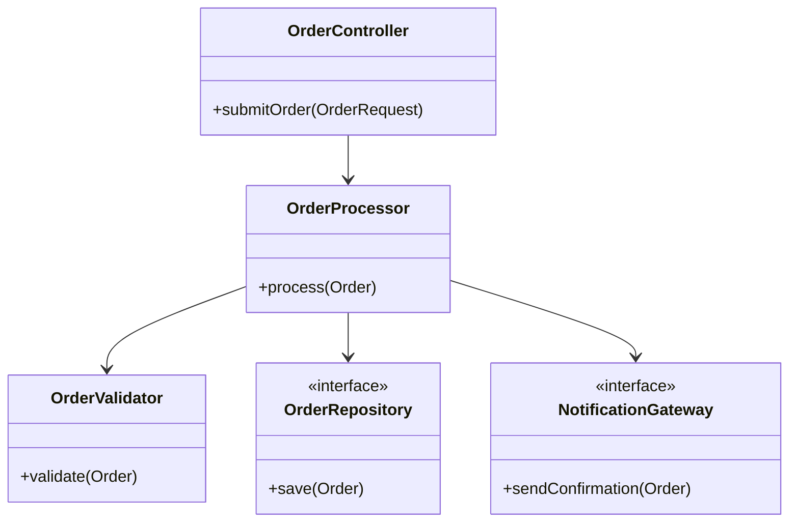
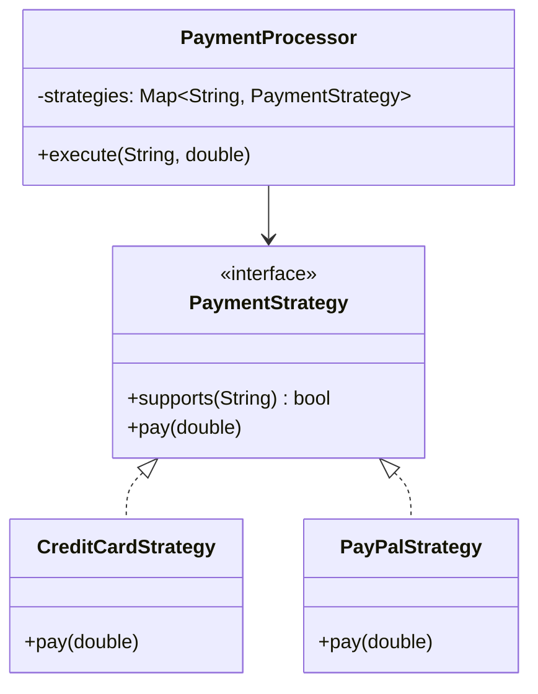
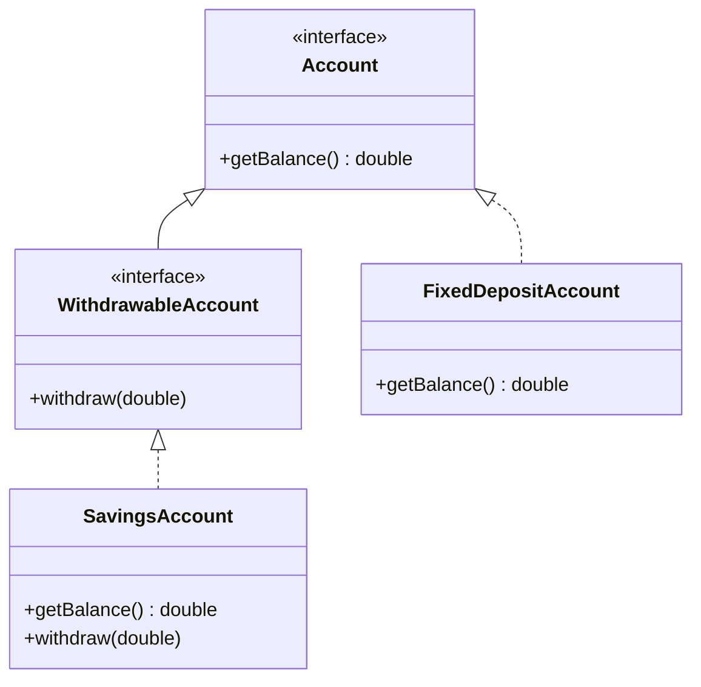
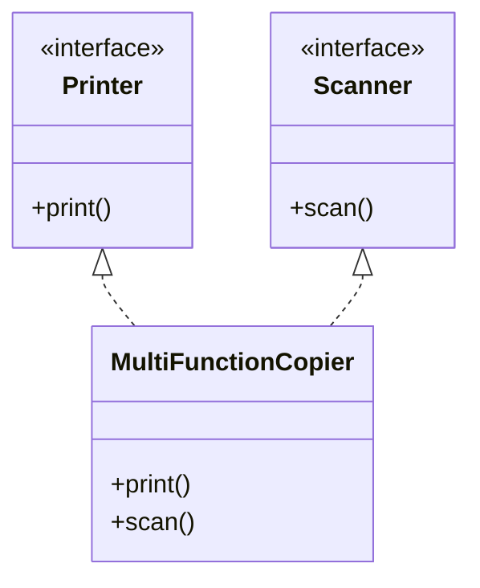
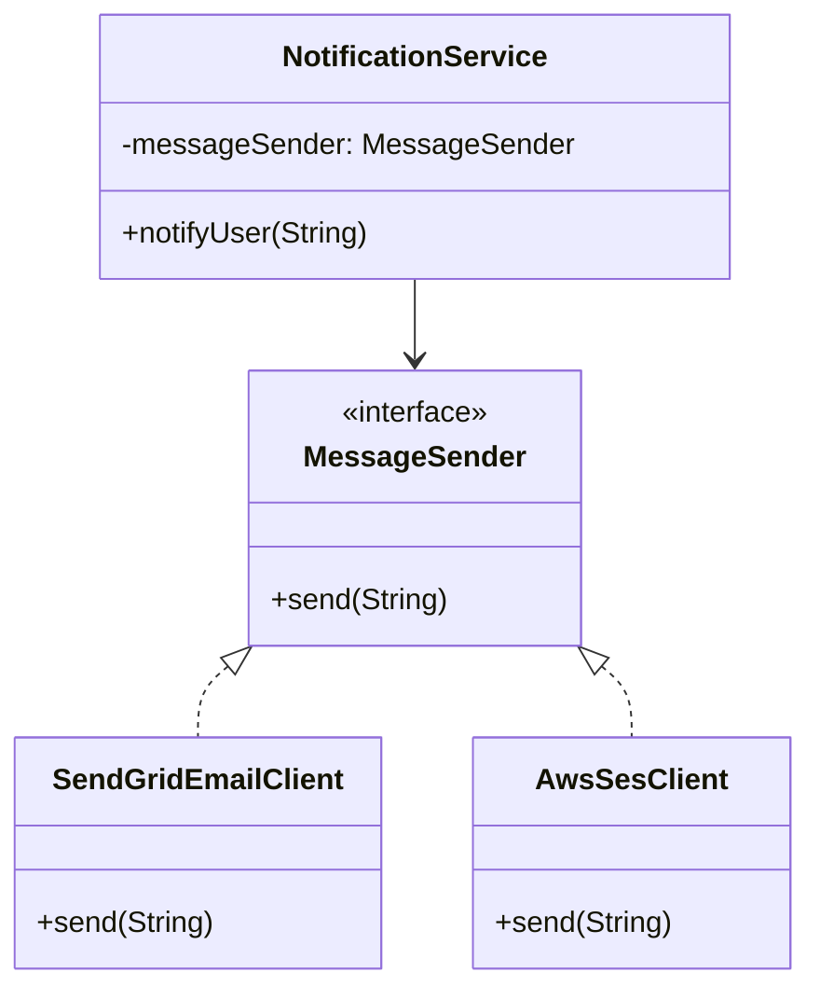

# SOLID Principles: Deep-Dive Architectural Thesis

The SOLID principles, popularized by Robert C. Martin ("Uncle Bob"), serve as the foundational bedrock of clean, maintainable, and extensible object-oriented design. At their core, these principles aim to combat the three primary symptoms of rotting software: **rigidity** (the system is hard to change because every change forces many other changes), **fragility** (the system breaks in unexpected places when changed), and **immobility** (the code is hard to reuse because it cannot be disentangled from its current environment).

By adhering to these design invariants, systems achieve a decoupled architecture where components exhibit high cohesion and low coupling. This translates directly to predictable deployment lifecycles, straightforward testability, and minimized cognitive load for engineering teams.

---

## 1. Single Responsibility Principle (SRP)

### The Anti-Pattern: The Omnipotent "God Class"
In this anti-pattern, a single service class handles business transactions, database persistence, external communication, and representation formatting.

```java
// ANTI-PATTERN: God Class violating SRP
public class OrderManagementService {
    public void processOrder(OrderRequest request) {
        // 1. Validation
        if (request.getItems().isEmpty()) {
            throw new IllegalArgumentException("Order must contain items");
        }
        
        // 2. Business Logic (Price calculation)
        double total = request.getItems().stream()
                .mapToDouble(item -> item.getPrice() * item.getQuantity())
                .sum();
        
        // 3. Database Persistence
        try (Connection conn = DriverManager.getConnection("jdbc:postgresql://localhost:5432/orders", "user", "pass")) {
            String sql = "INSERT INTO orders (total, customer_id) VALUES (?, ?)";
            PreparedStatement stmt = conn.prepareStatement(sql);
            stmt.setDouble(1, total);
            stmt.setString(2, request.getCustomerId());
            stmt.executeUpdate();
        } catch (SQLException e) {
            throw new RuntimeException("Database error", e);
        }
        
        // 4. Notification Logic
        String jsonPayload = "{\"to\":\"" + request.getEmail() + "\", \"body\":\"Your order of " + total + " is confirmed.\"}";
        HttpClient client = HttpClient.newHttpClient();
        HttpRequest emailRequest = HttpRequest.newBuilder()
                .uri(URI.create("https://api.emailservice.com/send"))
                .POST(HttpRequest.BodyPublishers.ofString(jsonPayload))
                .header("Content-Type", "application/json")
                .build();
        try {
            client.send(emailRequest, HttpResponse.BodyHandlers.ofString());
        } catch (Exception e) {
            System.err.println("Failed to send notification: " + e.getMessage());
        }
    }
}
```

#### Consequences of the Anti-Pattern
*   **High Cognitive Load**: Developers must reason about SQL, HTTP, and business rules within a single file.
*   **Fragile Deployments**: A change in the email provider's JSON structure forces a redeployment and retesting of the core database persistence and pricing logic.
*   **Testing Nightmare**: Mocking raw JDBC connections and HTTP clients requires complex test setups.

### The Target Architecture
The solution lies in decomposing the orchestrator into dedicated, cohesive components: a validator, a pricing engine, a data access object (DAO), and an integration gateway.



### Production-Grade Implementation (Java 21 + Spring Boot 3.2)

```java
package com.devmastery.solid.srp;

import org.springframework.stereotype.Component;
import org.springframework.stereotype.Service;
import org.springframework.data.jpa.repository.JpaRepository;
import org.springframework.transaction.annotation.Transactional;
import jakarta.persistence.*;
import java.util.List;

// Domain Entities (Rich Domain Model)
@Entity
@Table(name = "orders")
public class Order {
    @Id
    @GeneratedValue(strategy = GenerationType.IDENTITY)
    private Long id;
    private String customerId;
    private String email;
    
    @OneToMany(cascade = CascadeType.ALL, fetch = FetchType.LAZY)
    private List<OrderItem> items;

    public double calculateTotal() {
        return items.stream()
                .mapToDouble(OrderItem::getTotalPrice)
                .sum();
    }
    
    // Getters, Setters, Constructors
}

@Entity
public class OrderItem {
    @Id
    @GeneratedValue(strategy = GenerationType.IDENTITY)
    private Long id;
    private double price;
    private int quantity;

    public double getTotalPrice() {
        return this.price * this.quantity;
    }
}

// 1. Validation Component
@Component
public class OrderValidator {
    public void validate(Order order) {
        if (order.calculateTotal() <= 0) {
            throw new IllegalArgumentException("Invalid order total");
        }
    }
}

// 2. Persistence Component
interface OrderRepository extends JpaRepository<Order, Long> {}

// 3. Notification Gateway Component
interface NotificationGateway {
    void sendOrderConfirmation(Order order);
}

@Component
class EmailNotificationGateway implements NotificationGateway {
    @Override
    public void sendOrderConfirmation(Order order) {
        // Integrate with SMTP or external HTTP Service
    }
}

// 4. Clean Orchestrator Service
@Service
public class OrderProcessor {
    private final OrderValidator validator;
    private final OrderRepository repository;
    private final NotificationGateway notificationGateway;

    public OrderProcessor(OrderValidator validator, OrderRepository repository, NotificationGateway notificationGateway) {
        this.validator = validator;
        this.repository = repository;
        this.notificationGateway = notificationGateway;
    }

    @Transactional
    public Order process(Order order) {
        validator.validate(order);
        Order savedOrder = repository.save(order);
        notificationGateway.sendOrderConfirmation(savedOrder);
        return savedOrder;
    }
}
```

---

## 2. Open/Closed Principle (OCP)

### The Anti-Pattern: Conditional Branching over Types
Whenever a new payment type is introduced, developers must modify an existing service class, adding a new `if-else` or `switch` branch.

```java
// ANTI-PATTERN: Violating OCP with type checking
public class PaymentService {
    public void processPayment(String type, double amount) {
        if (type.equalsIgnoreCase("CREDIT_CARD")) {
            // Credit card processing logic
        } else if (type.equalsIgnoreCase("PAYPAL")) {
            // PayPal processing logic
        } else if (type.equalsIgnoreCase("BITCOIN")) {
            // Bitcoin processing logic
        } else {
            throw new IllegalArgumentException("Unsupported payment type");
        }
    }
}
```

#### Consequences of the Anti-Pattern
*   **Regression Risk**: Modifying the core `PaymentService` to add Bitcoin support can inadvertently break the credit card processing logic.
*   **Merge Conflicts**: Multiple developers working on different payment integrations will modify the same file.

### The Target Architecture
We use the **Strategy Pattern** combined with Polymorphism. The orchestrator is *closed* for modification but *open* for extension by adding new implementations of the strategy interface.



### Production-Grade Implementation (Java 21 + Spring Boot 3.2)

```java
package com.devmastery.solid.ocp;

import org.springframework.stereotype.Component;
import org.springframework.stereotype.Service;
import java.util.List;
import java.util.Map;
import java.util.function.Function;
import java.util.stream.Collectors;

public interface PaymentStrategy {
    boolean supports(String paymentMethod);
    void pay(double amount);
}

@Component
class CreditCardPaymentStrategy implements PaymentStrategy {
    @Override
    public boolean supports(String paymentMethod) {
        return "CREDIT_CARD".equalsIgnoreCase(paymentMethod);
    }

    @Override
    public void pay(double amount) {
        // Stripe / Adyen integration
    }
}

@Component
class PayPalPaymentStrategy implements PaymentStrategy {
    @Override
    public boolean supports(String paymentMethod) {
        return "PAYPAL".equalsIgnoreCase(paymentMethod);
    }

    @Override
    public void pay(double amount) {
        // PayPal API integration
    }
}

@Service
public class PaymentProcessor {
    private final Map<String, PaymentStrategy> strategies;

    // Spring autowires all implementations of PaymentStrategy into the list
    public PaymentProcessor(List<PaymentStrategy> strategyList) {
        this.strategies = strategyList.stream()
                .collect(Collectors.toMap(
                        strategy -> strategy.getClass().getSimpleName().toUpperCase(),
                        Function.identity()
                ));
    }

    public void executePayment(String method, double amount) {
        PaymentStrategy strategy = strategies.values().stream()
                .filter(s -> s.supports(method))
                .findFirst()
                .orElseThrow(() -> new IllegalArgumentException("Unsupported payment method: " + method));
        strategy.pay(amount);
    }
}
```

---

## 3. Liskov Substitution Principle (LSP)

### The Anti-Pattern: Broken Inheritance & Runtime Failures
A subclass overrides a base class method but throws an exception because it cannot fulfill the base class's implicit contract.

```java
// ANTI-PATTERN: Violating LSP
public class Account {
    protected double balance;

    public void withdraw(double amount) {
        if (amount > balance) {
            throw new IllegalArgumentException("Insufficient funds");
        }
        this.balance -= amount;
    }
}

public class FixedDepositAccount extends Account {
    @Override
    public void withdraw(double amount) {
        throw new UnsupportedOperationException("Withdrawals are not allowed on Fixed Deposit Accounts before maturity!");
    }
}
```

#### Consequences of the Anti-Pattern
*   **Polymorphic Fragility**: A client using a collection of `Account` objects will crash at runtime if it processes a `FixedDepositAccount`.
*   **Defensive Programming**: Clients are forced to use `instanceof` checks to avoid calling unsupported operations.

### The Target Architecture
We reformulate the hierarchy. Instead of forcing all accounts to support withdrawals, we segregate account behaviors into distinct interfaces or clean composition hierarchies.



### Production-Grade Implementation (Java 21 + Spring Boot 3.2)

```java
package com.devmastery.solid.lsp;

import java.math.BigDecimal;

public interface Account {
    BigDecimal getBalance();
}

public interface WithdrawableAccount extends Account {
    void withdraw(BigDecimal amount);
}

public class SavingsAccount implements WithdrawableAccount {
    private BigDecimal balance = BigDecimal.ZERO;

    @Override
    public BigDecimal getBalance() {
        return balance;
    }

    @Override
    public void withdraw(BigDecimal amount) {
        if (amount.compareTo(balance) > 0) {
            throw new IllegalArgumentException("Insufficient funds");
        }
        balance = balance.subtract(amount);
    }
}

public class FixedDepositAccount implements Account {
    private final BigDecimal balance;

    public FixedDepositAccount(BigDecimal initialDeposit) {
        this.balance = initialDeposit;
    }

    @Override
    public BigDecimal getBalance() {
        return balance;
    }
}
```

---

## 4. Interface Segregation Principle (ISP)

### The Anti-Pattern: The Fat Interface
An interface defines too many methods, forcing implementing classes to write boilerplate, empty methods, or throw exceptions for methods they do not need.

```java
// ANTI-PATTERN: Fat Interface
public interface SmartDevice {
    void print();
    void scan();
    void fax();
}

public class BasicPrinter implements SmartDevice {
    @Override public void print() { /* Printing logic */ }
    @Override public void scan() { throw new UnsupportedOperationException(); }
    @Override public void fax() { throw new UnsupportedOperationException(); }
}
```

#### Consequences of the Anti-Pattern
*   **Unnecessary Recompilations**: If the `fax()` method signature changes, `BasicPrinter` must be recompiled and redeployed, even though it does not use that capability.
*   **Bloated Implementations**: Classes are littered with dummy code or exception-throwing placeholders.

### The Target Architecture
Deconstruct the fat interface into smaller, highly focused, single-purpose interfaces.



### Production-Grade Implementation (Java 21 + Spring Boot 3.2)

```java
package com.devmastery.solid.isp;

public interface Printer {
    void print(Document doc);
}

public interface Scanner {
    void scan(Document doc);
}

public interface Fax {
    void sendFax(Document doc);
}

// Client implementations only implement what they need
public class LegacyPrinter implements Printer {
    @Override
    public void print(Document doc) {
        // Basic print action
    }
}

public class ModernOfficeMachine implements Printer, Scanner, Fax {
    @Override
    public void print(Document doc) { /* Print */ }
    @Override
    public void scan(Document doc) { /* Scan */ }
    @Override
    public void sendFax(Document doc) { /* Fax */ }
}

record Document(String content) {}
```

---

## 5. Dependency Inversion Principle (DIP)

### The Anti-Pattern: Hardcoded Concrete Dependencies
A high-level class directly instantiates and depends on a low-level implementation class.

```java
// ANTI-PATTERN: Direct dependency on concrete low-level implementations
public class NotificationService {
    private final SendGridEmailClient emailClient = new SendGridEmailClient(); // Hardcoupled

    public void notifyUser(String message) {
        emailClient.send(message);
    }
}
```

#### Consequences of the Anti-Pattern
*   **Zero Adaptability**: Swapping `SendGridEmailClient` for `AWS_SES_Client` requires modifying the high-level `NotificationService`.
*   **Untestable**: Unit tests cannot isolate `NotificationService` from actual network requests without complex bytecode manipulation.

### The Target Architecture
High-level and low-level modules depend on abstractions (interfaces).



### Production-Grade Implementation (Java 21 + Spring Boot 3.2)

```java
package com.devmastery.solid.dip;

import org.springframework.stereotype.Component;
import org.springframework.stereotype.Service;

// Abstraction
public interface MessageSender {
    void send(String payload);
}

// Concrete Low-Level Implementation 1
@Component
class SendGridMessageSender implements MessageSender {
    @Override
    public void send(String payload) {
        // SendGrid API execution
    }
}

// High-Level Component relying strictly on abstraction
@Service
public class NotificationService {
    private final MessageSender messageSender;

    // Injected via Spring Constructor Dependency Injection
    public NotificationService(MessageSender messageSender) {
        this.messageSender = messageSender;
    }

    public void notifyCustomer(String message) {
        messageSender.send(message);
    }
}
```

---

## Spring Boot Integration Mechanics

Under the hood, Spring Boot's core engine is built entirely upon SOLID principles:
*   **DIP**: The `ApplicationContext` acts as the Inversion of Control (IoC) container, resolving interfaces to concrete classes at runtime.
*   **OCP**: Spring's auto-configuration mechanisms (`@ConditionalOnMissingBean`) enable developers to override framework defaults without modifying framework code.

### Verification Unit Test

```java
package com.devmastery.solid;

import com.devmastery.solid.dip.MessageSender;
import com.devmastery.solid.dip.NotificationService;
import org.junit.jupiter.api.Test;
import org.mockito.Mockito;

import static org.mockito.Mockito.*;

class NotificationServiceTest {

    @Test
    void testNotificationServiceUsesAbstraction() {
        // Arrange
        MessageSender mockSender = mock(MessageSender.class);
        NotificationService service = new NotificationService(mockSender);
        String testMessage = "Hello SOLID!";

        // Act
        service.notifyCustomer(testMessage);

        // Assert
        verify(mockSender, times(1)).send(testMessage);
    }
}
```

---