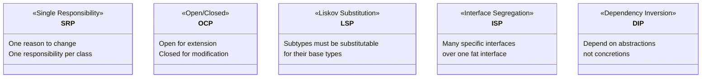

## WHY

Before SOLID principles were formalized by Robert C. Martin in the early 2000s, large Java codebases suffered from a predictable pattern: each new feature required touching dozens of existing classes, each change broke unrelated tests, and simple modifications like "add a new payment method" or "support a new file format" turned into multi-week projects. The codebase had become what Martin called "rigid, fragile, and immobile" — rigid because every change required cascading changes elsewhere, fragile because touching one thing broke another, and immobile because no component could be reused without dragging half the codebase with it.

SOLID gives you five orthogonal design rules that, together, make codebases change-friendly. Each principle targets one specific failure mode: SRP prevents "change propagation" (one business change requiring many class modifications), OCP prevents "modification risk" (extending behavior requires changing tested working code), LSP prevents "substitution failures" (polymorphism producing surprises), ISP prevents "fat interface coupling" (changing one interface forcing recompilation of unrelated implementors), and DIP prevents "concrete coupling" (high-level logic depending on low-level details that change frequently).

The production failure mode that SOLID prevents is the **"shotgun surgery"** pattern: a single business change requires 30 different files to be modified. This happened famously at several fintech companies when trying to add "support for EUR currency" — the currency type was hardcoded in concrete classes throughout the system, violating OCP. What should be a 2-hour change became a 3-week project with 150 modified files and 4 production incidents. This is the concrete cost of ignoring SOLID.

Senior engineers must understand SOLID not as academic principles but as refactoring triggers: when you find yourself modifying 10 files for a one-line change, LSP violation is likely. When a class has 5 fields that split into two unrelated groups, SRP is violated. When your tests require mocking 8 dependencies, DIP is violated. The principles are diagnostic tools as much as design guidelines.

## THEORY

### The 5 SOLID Principles at a Glance



### SRP — Single Responsibility Principle

A class should have one reason to change. The smell: a class name contains "And" or "Manager" (UserAuthenticationAndLoggingManager).

```
❌ UserService: creates users, authenticates, sends emails, validates, logs
✅ UserRegistrationService: creates users
   UserAuthenticationService: authenticates
   UserNotificationService: sends emails
```

### OCP — Open/Closed Principle

Open for extension (new behaviors), closed for modification (existing code untouched). In Java, achieve via **polymorphism** (strategy pattern, template method) or **composition**.

```java
// ❌ Violates OCP: adding PayPal requires modifying this class
public class PaymentProcessor {
    public void process(String type, double amount) {
        if (type.equals("CREDIT")) chargeCard(amount);
        else if (type.equals("PAYPAL")) chargePayPal(amount);
        // adding "CRYPTO" requires modifying this class — risky!
    }
}

// ✅ OCP: adding a new payment method = new class, zero modifications
public interface PaymentMethod { void charge(double amount); }
public class CreditCardPayment implements PaymentMethod { ... }
public class PayPalPayment implements PaymentMethod { ... }
public class CryptoPayment implements PaymentMethod { ... }  // new, zero changes elsewhere
public class PaymentProcessor {
    public void process(PaymentMethod method, double amount) { method.charge(amount); }
}
```

### LSP — Liskov Substitution Principle

If `S` extends `T`, you must be able to replace `T` with `S` without breaking the program. The classic violation: a `Square` subclass of `Rectangle` that breaks `setWidth`/`setHeight` independently.

### ISP — Interface Segregation Principle

Don't force clients to depend on methods they don't use. Break fat interfaces into focused ones.

```
❌ Fat interface: interface Worker { work(); eat(); sleep(); manage(); }
✅ Segregated: interface Workable { work(); }
               interface Manageable { manage(); }
```

### DIP — Dependency Inversion Principle

High-level modules should not depend on low-level modules. Both should depend on abstractions. In Java: constructor-inject interfaces, not concrete classes.

| Without DIP | With DIP |
|-------------|----------|
| `OrderService` → `MySQLOrderRepository` | `OrderService` → `OrderRepository` (interface) |
| Can't test without MySQL | Inject `InMemoryOrderRepository` for tests |
| Changing DB = changing service code | Changing DB = new class, same interface |

### Common Misconception

> "SOLID means you should always use interfaces for everything."

**Reality:** Over-applying SOLID creates "interface soup" — a `UserInterface` that wraps a `UserClass` that has one method, providing zero value. Apply SOLID when you have a concrete problem: a class that breaks often, code that can't be tested, or a feature that keeps requiring existing-class modifications. SOLID principles describe the destination; violations describe the problem worth solving.

## VISUALIZATION_CONFIG

```json
{ "component": "UmlClassDiagram", "state": "java-mastery-solid-principles" }
```

## CODE

### Level 1 — Beginner: Identifying SOLID Violations and Basic Fixes

```java
// === SRP Violation and Fix ===

// ❌ Violates SRP: employee object has salary, reporting, AND persistence
class Employee {
    private String name;
    private double baseSalary;

    public double calculatePay() { return baseSalary * 1.2; }
    public void saveToDatabase() { /* DB code */ }           // ❌ persistence here
    public String generateReport() { return "Report: " + name; } // ❌ reporting here
}

// ✅ SRP: each class has one reason to change
class Employee {
    final String name;
    final double baseSalary;
    Employee(String name, double baseSalary) { this.name = name; this.baseSalary = baseSalary; }
}

class PayCalculator {
    public double calculatePay(Employee e) { return e.baseSalary * 1.2; }
}

class EmployeeRepository {
    public void save(Employee e) { /* only DB code here */ }
}

class EmployeeReportGenerator {
    public String generate(Employee e) { return "Report: " + e.name; }
}
```

### Level 2 — Intermediate: OCP with Strategy Pattern and DIP with Constructor Injection

```java
import java.util.*;

// === OCP with Strategy Pattern ===

// ✅ OCP: new discount types added via new classes, not modifying DiscountCalculator
interface DiscountStrategy {
    double apply(double originalPrice);
    String name();
}

class NoDiscount implements DiscountStrategy {
    public double apply(double price) { return price; }
    public String name() { return "No Discount"; }
}

class PercentageDiscount implements DiscountStrategy {
    private final double percent;
    PercentageDiscount(double percent) { this.percent = percent; }
    public double apply(double price) { return price * (1 - percent / 100); }
    public String name() { return percent + "% off"; }
}

class BuyOneGetOneFree implements DiscountStrategy {
    public double apply(double price) { return price / 2; }  // effectively 50% off
    public String name() { return "BOGO"; }
}

// Closed for modification — never needs to change for new discount types
class DiscountCalculator {
    public double calculate(double price, DiscountStrategy strategy) {
        return strategy.apply(price);
    }
}

// === DIP with Constructor Injection ===

// ✅ DIP: OrderService depends on OrderRepository ABSTRACTION
interface OrderRepository {
    void save(Order order);
    Optional<Order> findById(String id);
    List<Order> findAll();
}

// High-level module — depends on abstraction
class OrderService {
    private final OrderRepository repository;  // interface, not concrete class
    private final NotificationService notifications;

    // Constructor injection — dependencies explicit and replaceable
    public OrderService(OrderRepository repository, NotificationService notifications) {
        this.repository = repository;
        this.notifications = notifications;
    }

    public void placeOrder(Order order) {
        repository.save(order);
        notifications.notify("Order placed: " + order.id());
    }
}

// Low-level implementations — can swap without touching OrderService
class JdbcOrderRepository implements OrderRepository { /* DB implementation */
    public void save(Order o) { System.out.println("DB: saved " + o.id()); }
    public Optional<Order> findById(String id) { return Optional.empty(); }
    public List<Order> findAll() { return List.of(); }
}

class InMemoryOrderRepository implements OrderRepository {  // for tests
    private final Map<String, Order> store = new HashMap<>();
    public void save(Order o) { store.put(o.id(), o); }
    public Optional<Order> findById(String id) { return Optional.ofNullable(store.get(id)); }
    public List<Order> findAll() { return List.copyOf(store.values()); }
}

interface NotificationService { void notify(String message); }
record Order(String id, double total) {}
```

### Level 3 — Advanced: LSP with Contract Enforcement, ISP

```java
import java.util.*;

// === LSP: Enforcing Contracts in Subclasses ===

abstract class Shape {
    // CONTRACT: area() must always return a positive value
    // Subclasses must not weaken preconditions or strengthen postconditions
    public abstract double area();
    public abstract double perimeter();

    // Template method using the contract
    public String describe() {
        return String.format("%s: area=%.2f perimeter=%.2f",
            getClass().getSimpleName(), area(), perimeter());
    }
}

class Rectangle extends Shape {
    protected double width, height;
    Rectangle(double width, double height) {
        if (width <= 0 || height <= 0) throw new IllegalArgumentException("dimensions must be positive");
        this.width = width;
        this.height = height;
    }
    public double area() { return width * height; }
    public double perimeter() { return 2 * (width + height); }
}

// ❌ CLASSIC LSP VIOLATION — Square changes Rectangle's behavior contract
class SquareViolation extends Rectangle {
    SquareViolation(double side) { super(side, side); }
    // Setting width also changes height — violates Rectangle contract
    // Any code that assumes width != height after separate setWidth/setHeight will break
}

// ✅ LSP-CORRECT: Square is a sibling, not a child of Rectangle
class Square extends Shape {  // extends Shape directly, not Rectangle
    private final double side;
    Square(double side) {
        if (side <= 0) throw new IllegalArgumentException("side must be positive");
        this.side = side;
    }
    public double area() { return side * side; }
    public double perimeter() { return 4 * side; }
}

// === ISP: Segregated Interfaces for Multi-Role Objects ===

// ✅ ISP: separate interfaces — classes implement only what they support
interface Readable  { String read(String key); }
interface Writable  { void write(String key, String value); }
interface Deletable { void delete(String key); }

// Read-write store: implements both
class ReadWriteCache implements Readable, Writable {
    private final Map<String, String> data = new HashMap<>();
    public String read(String key) { return data.getOrDefault(key, ""); }
    public void write(String key, String value) { data.put(key, value); }
}

// Read-only store: only implements Readable — clients can't call write/delete on it
class ReadOnlyConfig implements Readable {
    private final Map<String, String> config;
    ReadOnlyConfig(Map<String, String> config) { this.config = Map.copyOf(config); }
    public String read(String key) { return config.getOrDefault(key, ""); }
}
```

### Level 4 — Expert / Production: Full SOLID Application in a Payment Domain

```java
import java.math.BigDecimal;
import java.util.*;

/**
 * Complete SOLID demonstration on a payment processing domain.
 *
 * SRP:  Each class has one job
 * OCP:  New payment types via new classes, not modifications
 * LSP:  All PaymentMethod implementations are truly substitutable
 * ISP:  Interfaces split by client need (processing vs. refunding vs. reporting)
 * DIP:  PaymentOrchestrator depends on abstractions only
 */
public class SolidPaymentSystem {

    // ISP: separate interfaces — not all providers support all capabilities
    interface PaymentProcessor { PaymentResult process(PaymentRequest request); }
    interface RefundProcessor  { RefundResult refund(String transactionId, BigDecimal amount); }
    interface PaymentReporter  { PaymentReport generateReport(String merchantId); }

    // OCP: new provider = new class, zero changes to orchestrator
    static class StripePaymentProcessor implements PaymentProcessor, RefundProcessor {
        public PaymentResult process(PaymentRequest req) {
            // DIP: this would call Stripe SDK, injected separately in production
            return PaymentResult.success("stripe-" + UUID.randomUUID());
        }
        public RefundResult refund(String txId, BigDecimal amount) {
            return new RefundResult(true, "refund-" + txId);
        }
    }

    static class PayPalPaymentProcessor implements PaymentProcessor {
        // PayPal supports processing but not direct refund via this interface
        public PaymentResult process(PaymentRequest req) {
            return PaymentResult.success("paypal-" + UUID.randomUUID());
        }
    }

    // LSP: all PaymentProcessors can be used interchangeably by orchestrator
    // SRP: orchestrator ONLY orchestrates, doesn't know provider details
    static class PaymentOrchestrator {
        private final Map<String, PaymentProcessor> processors;
        private final FraudDetectionService fraudDetection;  // DIP: injected abstraction
        private final PaymentEventPublisher eventPublisher;   // DIP: injected abstraction

        PaymentOrchestrator(
                Map<String, PaymentProcessor> processors,
                FraudDetectionService fraudDetection,
                PaymentEventPublisher eventPublisher) {
            this.processors = Map.copyOf(processors);
            this.fraudDetection = fraudDetection;
            this.eventPublisher = eventPublisher;
        }

        public PaymentResult processPayment(PaymentRequest request) {
            // SRP: orchestrator delegates each concern to the right abstraction
            if (fraudDetection.isSuspicious(request)) {
                return PaymentResult.blocked("Fraud risk too high");
            }
            PaymentProcessor processor = processors.get(request.provider());
            if (processor == null) {
                return PaymentResult.failure("Unknown provider: " + request.provider());
            }
            PaymentResult result = processor.process(request);
            eventPublisher.publish(new PaymentEvent(request, result));
            return result;
        }
    }

    // Value objects (SRP: pure data carriers)
    record PaymentRequest(String provider, BigDecimal amount, String currency, String merchantId) {}
    record PaymentResult(boolean success, String transactionId, String errorMessage) {
        static PaymentResult success(String txId) { return new PaymentResult(true, txId, null); }
        static PaymentResult failure(String err) { return new PaymentResult(false, null, err); }
        static PaymentResult blocked(String err) { return new PaymentResult(false, null, err); }
    }
    record RefundResult(boolean success, String refundId) {}
    record PaymentEvent(PaymentRequest request, PaymentResult result) {}
    record PaymentReport(String merchantId, int transactionCount, BigDecimal totalAmount) {}

    // DIP: abstractions for cross-cutting concerns
    interface FraudDetectionService { boolean isSuspicious(PaymentRequest request); }
    interface PaymentEventPublisher { void publish(PaymentEvent event); }

    // Demonstration
    public static void main(String[] args) {
        var processors = Map.<String, PaymentProcessor>of(
            "stripe", new StripePaymentProcessor(),
            "paypal", new PayPalPaymentProcessor()
        );

        var orchestrator = new PaymentOrchestrator(
            processors,
            request -> request.amount().compareTo(new BigDecimal("100000")) > 0, // simple fraud rule
            event -> System.out.println("Event: " + event.result())
        );

        var request = new PaymentRequest("stripe", new BigDecimal("99.99"), "USD", "m001");
        var result = orchestrator.processPayment(request);
        System.out.println("Result: " + result);
    }
}
```

## REAL_WORLD

### How Spring Framework Embodies All 5 SOLID Principles

Spring is the most widely deployed Java framework, and its architecture is a textbook SOLID implementation. Each Spring subsystem is a masterclass in a different principle:

- **SRP**: Spring separates concerns into `@Repository` (data), `@Service` (business logic), `@Controller` (HTTP), `@Component` (generic) — each stereotype has one responsibility
- **OCP**: Spring's `BeanFactoryPostProcessor` and `BeanPostProcessor` allow extending Spring's behavior without modifying Spring's source code — classic OCP
- **LSP**: All Spring `DataSource` implementations (`HikariDataSource`, `EmbeddedDatabase`, `DriverManagerDataSource`) are perfectly substitutable — swap without changing any application code
- **ISP**: Spring Data splits `Repository<T,ID>`, `CrudRepository`, `PagingAndSortingRepository`, `JpaRepository` into a hierarchy so each service only depends on the capabilities it needs
- **DIP**: Spring's entire DI container is a DIP implementation — business classes declare interface dependencies, Spring injects concrete implementations at startup

```java
// Spring demonstrates DIP perfectly:
// Service declares dependency on abstraction (repository interface)
// Spring injects the concrete JPA implementation at runtime

@Service
public class OrderService {
    private final OrderRepository orderRepository;   // abstraction
    private final PaymentGateway paymentGateway;     // abstraction

    // Spring constructor injection — DIP in action
    public OrderService(OrderRepository orderRepository, PaymentGateway paymentGateway) {
        this.orderRepository = orderRepository;
        this.paymentGateway = paymentGateway;
    }
}

// For production: Spring injects JpaOrderRepository
// For tests: inject InMemoryOrderRepository — no production code changes
@Repository
public class JpaOrderRepository implements OrderRepository { /* JPA implementation */ }

// Test double — enabled by DIP
public class InMemoryOrderRepository implements OrderRepository { /* HashMap implementation */ }
```

### Production Gotcha: The Liskov Violation That Broke Payments

```java
// ❌ CLASSIC LSP VIOLATION in payment domain
// A "FreeTrialAccount" extends "PaidAccount" but throws on charge()
class PaidAccount {
    public void charge(BigDecimal amount) {
        paymentGateway.charge(cardOnFile, amount);  // always works
    }
}

class FreeTrialAccount extends PaidAccount {
    @Override
    public void charge(BigDecimal amount) {
        throw new UnsupportedOperationException("Cannot charge free trial accounts!");
        // ❌ Callers expecting PaidAccount behavior get a crash
    }
}

// Any code that uses PaidAccount polymorphically breaks silently:
List<PaidAccount> accounts = getAccountsForMonthlyBilling();
accounts.forEach(a -> a.charge(monthlyFee));  // crashes when FreeTrialAccount appears!

// ✅ LSP-CORRECT design: Chargeable is a capability, not an identity
interface Chargeable { void charge(BigDecimal amount); }
class PaidAccount implements Chargeable { /* implementation */ }
class FreeTrialAccount { /* does NOT implement Chargeable — correct! */ }

// Billing code is forced by types to only bill chargeable accounts:
List<Chargeable> chargeableAccounts = getChargeableAccounts();
chargeableAccounts.forEach(a -> a.charge(monthlyFee));  // type-safe, no surprises
```

**Why it happens:** Inheritance is a strong statement: "I am a kind of X." If the subclass can't honor all of X's contracts, it isn't really an X — use composition or separate interfaces instead.

### Performance Characteristics

| SOLID Principle | Performance Impact | Notes |
|-----------------|-------------------|-------|
| SRP (many small classes) | ~1% overhead vs monolith | JIT inlines across class boundaries |
| OCP (virtual dispatch) | 3-5ns per virtual call | Negligible unless in tight loop (>10M/sec) |
| LSP (polymorphism) | Same as virtual dispatch | JIT megamorphic dispatch >3 types: deoptimizes |
| ISP (many interfaces) | Zero overhead | Interfaces have no runtime cost |
| DIP (constructor injection) | Zero at steady state | One-time startup cost for DI container |

## INTERVIEW

**Q1 (Junior): What does SRP (Single Responsibility Principle) mean? Give a Java example of a violation and the fix.**
A: SRP says a class should have only one reason to change — one responsibility, one axis of change. A classic violation is a `UserService` that handles authentication, sends emails, generates reports, AND manages user preferences. If the email provider changes, you're modifying the authentication class. If the report format changes, you're touching the preference logic. The fix: split into `UserAuthService`, `UserEmailService`, `UserReportService`, `UserPreferenceService` — each with one reason to change. The practical test: can you describe the class's responsibility in one sentence without using "and" or "or"?

**Q2 (Junior): What is the Open/Closed Principle and how do you achieve it in Java?**
A: OCP says classes should be open for extension but closed for modification — you add new behavior by adding new code, not changing existing tested code. In Java, achieve this through **polymorphism**: define an interface or abstract class, add new behaviors as new implementations. A `if/else-if` chain on a type string is almost always an OCP violation — each new type requires modifying the existing class. The Strategy pattern is the canonical OCP implementation: `interface Discountable { BigDecimal apply(BigDecimal price); }` — new discount types are new classes, the calculator never changes. Spring Boot's auto-configuration uses OCP extensively: new features are new `@Configuration` classes, Spring's core never changes.

**Q3 (Mid): Explain the Liskov Substitution Principle with a concrete Java example of a violation.**
A: LSP says if `S` is a subtype of `T`, then objects of type `T` in a program may be replaced with objects of type `S` without changing the program's correctness. The classic violation is `Square extends Rectangle` — a Square *is-a* rectangle geometrically, but `setWidth(5)` on a Square also changes the height (to maintain the square invariant), which breaks any code that sets width and height independently and expects them to be independent. The test: take every place where `Rectangle` is used and substitute a `Square` — does the program still produce correct results? If not, LSP is violated. The fix: `Square` should not extend `Rectangle`; both should extend `Shape`.

**Q4 (Mid): What is the Dependency Inversion Principle and how does it differ from Dependency Injection?**
A: DIP is the design principle: high-level modules should not depend on low-level modules — both should depend on abstractions. Dependency Injection (DI) is one *mechanism* for achieving DIP: instead of a class creating its own dependencies (`new EmailSender()`), they're provided from outside (`constructor(EmailSender sender)`). DIP can be achieved without a DI framework — just use constructor injection manually. Spring, Guice, and CDI are DI *containers* that automate the wiring. The key DIP rule: your business logic class should import only interfaces, never concrete implementations. When you write `import com.myapp.repository.JdbcUserRepository` in your service class, DIP is violated.

**Q5 (Senior): How do all 5 SOLID principles work together? Give one example where violating one forces you to violate the others.**
A: The principles are interconnected — violating one creates pressure to violate others. Example: violating SRP by putting persistence in a domain class (`User.save()`) violates DIP (User depends on the concrete DB driver), violates OCP (adding a new DB requires modifying User), violates ISP (users of User for business logic must depend on a DB connection they don't need), and potentially violates LSP (a `GuestUser` subclass can't save because guests have no DB record). The pattern: SRP violations propagate through the other four principles because one class doing multiple things creates multiple dependency directions, multiple reasons to change, multiple subclass contract problems, and multiple fat interfaces.

**Q6 (Senior): When should you NOT apply SOLID principles?**
A: SOLID adds complexity — it's only justified when the complexity it removes (from change propagation) exceeds the complexity it adds (more classes, more interfaces). Don't apply SOLID to: (1) **prototypes and experiments** where the design is still fluid — SOLID is for stable codebases; (2) **small single-purpose scripts** that have one file and one developer; (3) **data transfer objects** — a `UserDto` record with 10 fields doesn't need SRP splitting; (4) **over-engineered "SOLID for SOLID's sake"** — if your `StringUtils.capitalize(String)` becomes `CapitalizationStrategy`, `DefaultCapitalizationStrategy`, `CapitalizationStrategyFactory`, you've created a maintenance burden without solving a real change-management problem.

**Q7 (Senior+): How does SOLID relate to microservices architecture and what are the cross-service implications?**
A: SOLID principles apply at both class and service levels. SRP at service level: each microservice should have one bounded context and one reason to change — an "Order and User and Inventory" service is a monolith pretending to be a microservice. OCP at service level: services should expose stable APIs (the interface) that can be evolved by adding new endpoints without breaking existing callers. LSP at service level: if `OrderServiceV2` replaces `OrderServiceV1`, all V1 callers must work unchanged (backward compatibility IS LSP). DIP at service level: services communicate via API contracts (abstractions), not by sharing database schemas (concrete implementations) — the "shared database anti-pattern" is a DIP violation. Violating these service-level SOLID principles is exactly how microservices become "distributed monoliths."

## FEYNMAN CHECK

### Explain SOLID Like I'm 10 Years Old

> Imagine you're building with LEGOs. **SRP** is like each LEGO block doing one thing — a wheel is a wheel, a door is a door. If one block tries to be both a wheel AND a door, it's impossible to move the wheel without also moving the door. **OCP** is like designing the LEGO set so you can add new pieces (a rocket ship booster) without dismantling the existing car to attach it. **LSP** is like knowing that any 2x4 LEGO brick can replace any other 2x4 LEGO brick — if you replace one, the same connections still work. **ISP** is not forcing a simple wheel piece to have a door hinge built into it just because doors exist. **DIP** is like designing the car to connect to "any engine piece" rather than one specific engine — then you can swap engines without redesigning the whole car. SOLID LEGOs are the ones that snap together cleanly; non-SOLID ones require glue, scissors, and prayers.

---

### 5 Deep Conceptual Questions

**Q1: What common failure mode does each SOLID principle specifically prevent?**
> **A:** Each principle prevents one specific design failure: SRP prevents "shotgun surgery" (one change requiring 10+ files to be modified because one class has too many responsibilities). OCP prevents "fragile base class" (changing a working class to add features breaks existing tests). LSP prevents "surprising polymorphism" (subclass methods throwing exceptions or returning wrong values where the supertype contract is expected). ISP prevents "interface fat dependency" (classes depending on 15-method interfaces but only using 2, forcing recompilation when any of the 13 unused methods change). DIP prevents "concrete coupling" (business logic breaking when a low-level detail like the database driver version changes). Together they prevent the evolution of code from "easy to change" to "impossible to change."

**Q2: What is the one mental model that makes all 5 SOLID principles click?**
> **A:** "Dependencies should point toward stability." Every SOLID principle is a specific application of this rule. SRP: a class with one responsibility is more stable (changes less often) than one with five. OCP: don't modify stable code — extend it. LSP: subtypes must be at least as stable as supertypes (same contracts). ISP: small interfaces are more stable than fat ones — fewer clients break when they change. DIP: high-level policy (stable) should not depend on low-level details (unstable). The violations of SOLID share a common root: stable things depending on unstable things, causing unnecessary change propagation.

**Q3: What is the most commonly misunderstood SOLID principle? Show the misconception and the correct interpretation.**
> **A:** LSP is most misunderstood — many engineers think it means "don't override methods." The real meaning is: subtype contracts must be at least as strong as base type contracts.
> ```java
> // ❌ LSP violation that's not obvious: weakening postcondition
> class UserRepository {
>     public List<User> findAll() { return users; } // CONTRACT: never returns null
> }
>
> class CachedUserRepository extends UserRepository {
>     @Override
>     public List<User> findAll() {
>         if (cacheExpired()) return null;  // ❌ breaks contract — base never returns null!
>         return cache;
>     }
> }
>
> // ✅ LSP correct: maintain or strengthen the contract
> class CachedUserRepository extends UserRepository {
>     @Override
>     public List<User> findAll() {
>         if (cacheExpired()) return super.findAll();  // falls back — never null
>         return Collections.unmodifiableList(cache);
>     }
> }
> ```

**Q4: How does DIP enable test-driven development in Java?**
> **A:** DIP is the prerequisite for unit testing in Java. Without DIP, your `OrderService` directly creates `new JdbcOrderRepository()`, `new StripePaymentGateway()`, and `new SendGridEmailClient()` — every unit test requires a live database, live Stripe API, and live SendGrid account. With DIP, `OrderService` accepts `OrderRepository`, `PaymentGateway`, and `EmailClient` interface parameters in its constructor. In tests, you inject `InMemoryOrderRepository`, `FakePaymentGateway(alwaysSucceeds=true)`, and `RecordingEmailClient()` — the test runs in milliseconds with no external services, deterministic outcomes, and complete isolation. This is why "hard to test = poorly designed" is generally true in Java: untestable code usually has DIP violations.

**Q5: Write a one-sentence definition of SOLID for a senior FAANG engineer.**
> **A:** "SOLID is a set of five orthogonal design principles — Single Responsibility (one reason to change), Open/Closed (extend via new code, not modification), Liskov Substitution (subtypes honor supertypes' contracts), Interface Segregation (clients depend only on what they use), and Dependency Inversion (depend on abstractions) — that together minimize the coupling between change-prone low-level details and stable high-level policy, which is why applying SOLID converts 'shotgun surgery' (a one-line business change requiring 30 file modifications) into a 'one new class plus one wiring change' operation."

## BUILD

### 🏗️ Mini Project: SOLID-Compliant Notification System

**What you will build:** A notification system supporting email, SMS, and push notifications — demonstrating all 5 SOLID principles with concrete Java code.
**Why this project:** Forces you to apply each principle under realistic constraints: adding a new channel type, changing the persistence layer, and handling unsupported operations.
**Time estimate:** 35 minutes

---

#### Step 1 — Setup

```bash
mkdir notification-solid && cd notification-solid
mkdir -p src/main/java/com/notify
touch src/main/java/com/notify/{Notification,NotificationChannel,NotificationService}.java
touch src/main/java/com/notify/NotificationTest.java
```

#### Step 2 — Core Implementation (All 5 Principles)

```java
package com.notify;

import java.util.*;
import java.time.Instant;

// ISP: each interface has one concern
interface NotificationChannel {
    boolean supports(String recipientType);  // "EMAIL", "PHONE", "DEVICE_TOKEN"
    void send(Notification notification);
}
interface NotificationLogger { void log(Notification notification, boolean success); }
interface NotificationValidator { void validate(Notification notification); }

// SRP: pure data record — no behavior
record Notification(String id, String recipient, String recipientType,
                    String subject, String body, Instant createdAt) {}

// OCP: new channels via new classes — EmailChannel, SmsChannel, PushChannel
class EmailChannel implements NotificationChannel {
    public boolean supports(String type) { return "EMAIL".equals(type); }
    public void send(Notification n) {
        System.out.printf("EMAIL → %s: %s%n", n.recipient(), n.subject());
    }
}

class SmsChannel implements NotificationChannel {
    public boolean supports(String type) { return "PHONE".equals(type); }
    public void send(Notification n) {
        System.out.printf("SMS → %s: %s%n", n.recipient(), n.body().substring(0, Math.min(160, n.body().length())));
    }
}

class PushChannel implements NotificationChannel {
    public boolean supports(String type) { return "DEVICE_TOKEN".equals(type); }
    public void send(Notification n) {
        System.out.printf("PUSH → %s: %s%n", n.recipient(), n.subject());
    }
}

// DIP: NotificationService depends on abstractions only
class NotificationService {
    private final List<NotificationChannel> channels;  // abstractions
    private final NotificationValidator validator;      // abstraction
    private final NotificationLogger logger;            // abstraction

    public NotificationService(
            List<NotificationChannel> channels,
            NotificationValidator validator,
            NotificationLogger logger) {
        this.channels = List.copyOf(channels);
        this.validator = validator;
        this.logger = logger;
    }

    // LSP: any NotificationChannel implementation is substitutable
    public void send(Notification notification) {
        validator.validate(notification);
        NotificationChannel channel = channels.stream()
            .filter(c -> c.supports(notification.recipientType()))
            .findFirst()
            .orElseThrow(() -> new UnsupportedOperationException(
                "No channel supports type: " + notification.recipientType()));
        boolean success = false;
        try {
            channel.send(notification);
            success = true;
        } finally {
            logger.log(notification, success);
        }
    }
}
```

#### Step 3 — Wiring and Usage

```java
package com.notify;

import java.time.Instant;
import java.util.*;

public class Main {
    public static void main(String[] args) {
        var channels = List.<NotificationChannel>of(
            new EmailChannel(), new SmsChannel(), new PushChannel()
        );

        var validator = (NotificationValidator) n -> {
            if (n.recipient() == null || n.recipient().isBlank())
                throw new IllegalArgumentException("Recipient required");
            if (n.body() == null || n.body().isBlank())
                throw new IllegalArgumentException("Body required");
        };

        var logger = (NotificationLogger) (n, success) ->
            System.out.printf("LOG: [%s] %s → %s%n", success ? "OK" : "FAIL", n.id(), n.recipient());

        var service = new NotificationService(channels, validator, logger);

        service.send(new Notification("n1", "user@email.com", "EMAIL", "Welcome!", "Hello!", Instant.now()));
        service.send(new Notification("n2", "+1234567890", "PHONE", "Code", "Your OTP: 123456", Instant.now()));
    }
}
```

#### Step 4 — Error Handling & Edge Cases

```java
// Add safe-send that doesn't throw on channel failures
class ResilientNotificationService extends NotificationService {
    public ResilientNotificationService(List<NotificationChannel> channels,
            NotificationValidator validator, NotificationLogger logger) {
        super(channels, validator, logger);
    }

    public boolean trySend(Notification notification) {
        try {
            send(notification);
            return true;
        } catch (Exception e) {
            System.err.println("Notification failed: " + e.getMessage());
            return false;
        }
    }
}
```

#### Step 5 — Tests

```java
package com.notify;

import org.junit.jupiter.api.Test;
import java.time.Instant;
import java.util.*;
import static org.junit.jupiter.api.Assertions.*;

class NotificationTest {

    private final List<Notification> sent = new ArrayList<>();
    private final List<Notification> logged = new ArrayList<>();

    private NotificationService buildService() {
        NotificationChannel testChannel = new NotificationChannel() {
            public boolean supports(String type) { return true; }
            public void send(Notification n) { sent.add(n); }
        };
        return new NotificationService(
            List.of(testChannel),
            n -> { if (n.body() == null) throw new IllegalArgumentException("body required"); },
            (n, ok) -> logged.add(n)
        );
    }

    @Test
    void sendDispatchesToCorrectChannel() {
        var service = buildService();
        var n = new Notification("1", "test@test.com", "EMAIL", "Hi", "Hello", Instant.now());
        service.send(n);
        assertEquals(1, sent.size());
        assertEquals("1", sent.get(0).id());
    }

    @Test
    void alwaysLogsEvenOnFailure() {
        var failChannel = new NotificationChannel() {
            public boolean supports(String t) { return true; }
            public void send(Notification n) { throw new RuntimeException("channel down"); }
        };
        var service = new NotificationService(List.of(failChannel), n -> {}, logged::add);
        var n = new Notification("2", "x", "EMAIL", "Hi", "Hello", Instant.now());
        assertThrows(RuntimeException.class, () -> service.send(n));
        assertEquals(1, logged.size());  // still logged despite failure
    }

    @Test
    void unsupportedChannelTypeThrows() {
        var service = new NotificationService(List.of(), n -> {}, (n, ok) -> {});
        var n = new Notification("3", "x", "FAX", "Hi", "Hello", Instant.now());
        assertThrows(UnsupportedOperationException.class, () -> service.send(n));
    }
}
```

**Expected Output:**
```
EMAIL → user@email.com: Welcome!
LOG: [OK] n1 → user@email.com
SMS → +1234567890: Your OTP: 123456
LOG: [OK] n2 → +1234567890
```

**Stretch Challenges:**
- [ ] Add `RetryableNotificationChannel` decorator (OCP: wraps any channel with retry logic)
- [ ] Add `PriorityNotificationService` that tries primary channel and falls back to secondary
- [ ] Apply DIP to inject a `Clock` dependency so notification timestamps are testable

## SPACED REVIEW

> **How to use:** Answer from memory before reading ahead.

---

### Day 1 — Recall

**Q1:** Name all 5 SOLID principles. For each: (a) one-sentence definition, (b) one concrete Java violation example.

**Q2:** What is the "reason to change" test for SRP? Apply it to a `ReportService` that queries the DB, formats results as HTML, and emails them.

**Q3:** Show how the Strategy pattern implements OCP in Java. Write a 15-line example with an interface and two implementations.

---

### Day 3 — Comprehension

**Q4:** What is the Liskov Substitution Principle? Why does `Square extends Rectangle` violate it? What is the correct design?

**Q5:** What is the difference between DIP (the principle) and DI (the mechanism)? Can you achieve DIP without a Spring/Guice container?

**Q6:** Refactor this class to follow ISP:
```java
interface Animal { void eat(); void fly(); void swim(); void run(); }
class Dog implements Animal {
    public void fly() { throw new UnsupportedOperationException(); }
    // ...
}
```

---

### Day 7 — Application

**Q7:** Design a `FileParser` that reads CSV, JSON, and XML files following OCP. Show the interface and 3 implementations. How would you add YAML support without touching existing code?

**Q8:** A `UserService` has constructor parameters: `UserRepository`, `EmailService`, `AnalyticsClient`, `PasswordEncoder`, `AuthTokenService`, `RateLimiter`. Which SOLID principles might be violated? Propose a refactoring.

**Q9:** You're told to add a new "bank transfer" payment type to a payment system. The current code has a 200-line `if/else-if` chain on payment types. How does OCP guide your refactoring strategy?

---

### Day 14 — Synthesis & Interview Prep

**Q10:** ★ Classic interview: *"Explain all 5 SOLID principles in 5 minutes with a single concrete example domain (e.g., an e-commerce order system)."*

**Q11:** Draw the class diagram for a SOLID-compliant `OrderFulfillmentService` — showing which classes depend on which interfaces, and which concrete classes implement which interfaces.

**Q12:** ★ System design: *"You're designing a notification platform that must support email, SMS, push, and Slack, with 10 million messages per day. How do SOLID principles guide your service decomposition and ensure the system can add new channels without downtime?"*
