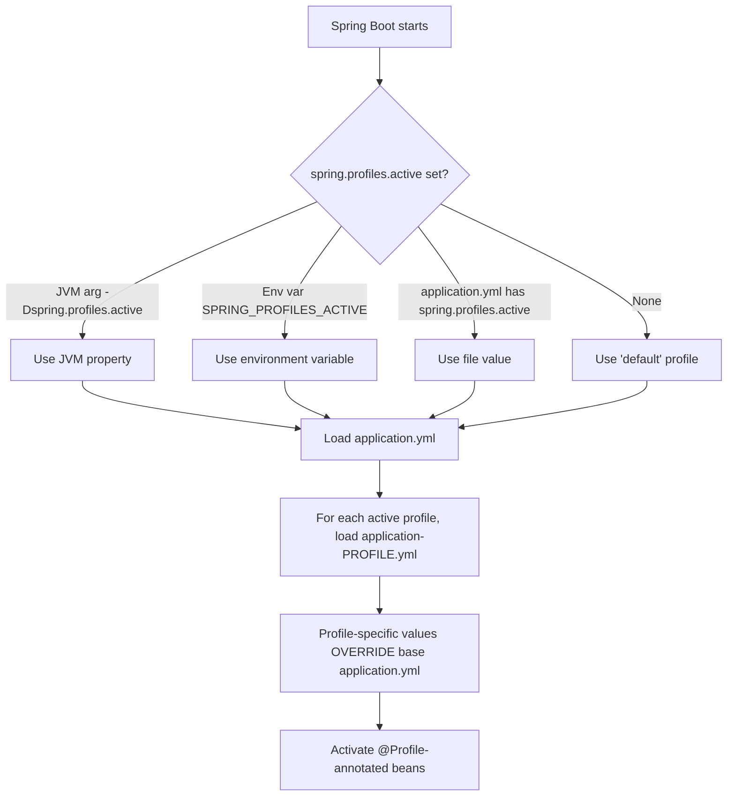

## WHY

Before Spring Profiles (introduced in Spring 3.1, 2011), every Java application that needed different configuration for development, staging, and production used one of three painful approaches: (1) maintaining separate WAR files per environment with hardcoded values — leading to "works on my machine" failures because dev and prod were literally different artifacts; (2) using build-time property replacement (Ant filters, Maven resource filtering) — making it impossible to inspect the actual configuration that would run in production until after the build completed; (3) elaborate `if (env.equals("PROD"))` chains scattered through bean configuration — turning every change into a code change.

Spring Profiles solve all three: a single artifact (one JAR or WAR) contains all environment configurations, and the active profile is selected at runtime via a JVM property, environment variable, or programmatic call. The same code that runs in development runs in production — only the active profile differs. This is the foundation of "build once, deploy everywhere" — the Twelve-Factor App methodology that powers modern cloud-native Java applications.

The production failure mode profiles prevent is **configuration drift**: a working dev environment but broken prod because someone updated a config file in one environment but forgot the others. With profiles, all configurations live in source control side-by-side (`application-dev.yml`, `application-prod.yml`), pull requests show the diff for any environment change, and CI/CD validates all profile combinations. Without profiles, configuration drift causes hours-long outages — the classic "we deployed an empty database password by accident" failure.

Senior engineers must understand: profile resolution precedence (system property vs env var vs default), the difference between `@Profile` on beans vs profile-specific property files, how to combine multiple active profiles, the "default" profile semantics, and patterns for testing profile-specific code without booting the entire context.

## THEORY

### Profile Resolution Order



### Profile Activation Methods (Precedence Order)

| Method | Example | Precedence |
|--------|---------|-----------|
| Command-line argument | `--spring.profiles.active=prod` | Highest |
| JVM system property | `-Dspring.profiles.active=prod` | High |
| Environment variable | `SPRING_PROFILES_ACTIVE=prod` | Medium |
| application.yml | `spring.profiles.active: prod` | Low |
| Programmatic | `app.setAdditionalProfiles("prod")` | Varies |
| Default | (none specified) → "default" profile | Lowest |

### Profile-Specific Configuration Files

```
src/main/resources/
├── application.yml              ← always loaded (base config)
├── application-dev.yml          ← loaded when profile "dev" active
├── application-staging.yml      ← loaded when profile "staging" active
├── application-prod.yml         ← loaded when profile "prod" active
└── application-test.yml         ← loaded when profile "test" active
```

**Override rule:** Values in profile-specific files override values in `application.yml`. Within a profile-specific file, the most recently loaded wins (in case multiple profiles are active).

### `@Profile` Annotation Patterns

```java
@Profile("prod")                // Active only when "prod" is active
@Profile("!prod")               // Active when "prod" is NOT active
@Profile({"dev", "test"})       // Active when "dev" OR "test" is active
@Profile("prod & cloud")        // Active when BOTH "prod" AND "cloud" are active (Spring 5.1+)
@Profile("default")             // Active when NO profiles are active
```

### Common Misconception

> "Spring Profiles are just a way to use different .yml files."

**Reality:** Profiles operate at two levels: (1) **configuration profiles** — different property values per profile (different DB URLs, etc.); (2) **bean profiles** — entire beans only exist when certain profiles are active. The second is more powerful: in production you might use a real `SmsGateway` bean, while in development you have a `LoggingSmsGateway` bean that just logs SMS messages instead of sending them. The two beans never coexist — only the profile-matching bean is registered. This eliminates production surprises where a dev-only mock accidentally runs in production.

## VISUALIZATION_CONFIG
```json
{
  "language": "yaml",
  "fileName": "application.yml",
  "steps": [
    {
      "title": "What are Spring profiles?",
      "description": "Profiles activate different bean configurations and properties per environment: dev (in-memory DB), staging (shared DB), prod (production DB + security).",
      "code": "spring:\n  profiles:\n    active: dev   # or: export SPRING_PROFILES_ACTIVE=prod",
      "diagram": {
        "kind": "boxes",
        "title": "Profile environments",
        "items": [
          {
            "label": "dev",
            "color": "#10b981",
            "value": "in-memory H2, debug logging"
          },
          {
            "label": "staging",
            "color": "#f59e0b",
            "value": "shared Postgres, some security"
          },
          {
            "label": "prod",
            "color": "#ef4444",
            "value": "real DB, full security, monitoring",
            "highlight": true
          }
        ]
      }
    },
    {
      "title": "Profile-specific properties",
      "description": "Create application-dev.yml, application-prod.yml. Properties there override the base application.yml when that profile is active.",
      "code": "# application.yml (base)\nspring:\n  datasource:\n    url: jdbc:h2:mem:testdb\n# application-prod.yml (overrides for prod)\nspring:\n  datasource:\n    url: jdbc:postgresql://${DB_HOST}/prod",
      "diagram": {
        "kind": "flow",
        "steps": [
          {
            "label": "application.yml loaded first (base)",
            "done": true
          },
          {
            "label": "active profile = prod?",
            "done": true
          },
          {
            "label": "application-prod.yml overrides merge in",
            "active": true
          },
          {
            "label": "prod datasource.url wins"
          }
        ]
      }
    },
    {
      "title": "@Profile on beans",
      "description": "@Profile(\"prod\") on a @Bean or @Component means the bean is only created when the prod profile is active.",
      "code": "@Bean @Profile(\"!prod\")   // any profile EXCEPT prod\npublic EmailService fakeEmailService() { return new FakeEmailService(); }\n\n@Bean @Profile(\"prod\")\npublic EmailService realEmailService() { return new SmtpEmailService(smtpConfig); }",
      "highlight": [
        1,
        2,
        4,
        5
      ],
      "diagram": {
        "kind": "boxes",
        "title": "@Profile on beans",
        "items": [
          {
            "label": "@Profile(\"dev\")",
            "color": "#10b981",
            "value": "dev only"
          },
          {
            "label": "@Profile(\"prod\")",
            "color": "#ef4444",
            "value": "prod only",
            "highlight": true
          },
          {
            "label": "@Profile(\"!prod\")",
            "color": "#818cf8",
            "value": "everywhere except prod"
          }
        ]
      }
    },
    {
      "title": "Programmatic profile check",
      "description": "Inject Environment and call environment.acceptsProfiles(Profiles.of(\"prod\")) when conditional logic is complex.",
      "code": "@Autowired Environment env;\n\nif (env.acceptsProfiles(Profiles.of(\"prod\"))) {\n    enableAuditLogging();\n    enableRateLimiting();\n}",
      "highlight": [
        3,
        4,
        5
      ],
      "diagram": {
        "kind": "flow",
        "steps": [
          {
            "label": "inject Environment",
            "done": true
          },
          {
            "label": "acceptsProfiles(\"prod\")",
            "active": true
          },
          {
            "label": "true → enable prod-only features"
          },
          {
            "label": "false → skip"
          }
        ]
      }
    },
    {
      "title": "Combining profiles with @ActiveProfiles in tests",
      "description": "@ActiveProfiles(\"test\") in test classes activates the test profile, swapping real beans for fakes.",
      "code": "@SpringBootTest\n@ActiveProfiles(\"test\")\nclass OrderServiceIT {\n    @Autowired OrderService svc;  // uses test profile beans\n    @Autowired FakeEmailService email;  // injected because @Profile(\"test\")\n}",
      "highlight": [
        2,
        4,
        5
      ],
      "diagram": {
        "kind": "boxes",
        "title": "Test profile",
        "items": [
          {
            "label": "@ActiveProfiles(\"test\")",
            "color": "#10b981",
            "highlight": true
          },
          {
            "label": "FakeEmailService activated",
            "color": "#10b981"
          },
          {
            "label": "H2 in-memory DB activated",
            "color": "#10b981"
          },
          {
            "label": "SMTP, prod DB skipped",
            "color": "#818cf8"
          }
        ]
      }
    }
  ]
}
```

## CODE

### Level 1 — Beginner: Profile-Specific Property Files

```yaml
# application.yml — always loaded (base config)
spring:
  application:
    name: my-app
  profiles:
    active: dev  # default profile to use locally

server:
  port: 8080

logging:
  level:
    root: INFO
```

```yaml
# application-dev.yml — loaded when profile "dev" is active
spring:
  datasource:
    url: jdbc:h2:mem:devdb
    username: sa
    password:

logging:
  level:
    com.myapp: DEBUG  # verbose logging in dev
```

```yaml
# application-prod.yml — loaded when profile "prod" is active
spring:
  datasource:
    url: jdbc:postgresql://prod-db.internal:5432/myapp
    username: ${DB_USER}        # from environment variable
    password: ${DB_PASSWORD}    # from environment variable

logging:
  level:
    com.myapp: WARN  # minimal logging in prod

server:
  port: 8443  # production HTTPS port
```

```bash
# Run with specific profile
java -jar app.jar --spring.profiles.active=prod

# Or via env variable
SPRING_PROFILES_ACTIVE=prod java -jar app.jar
```

### Level 2 — Intermediate: Profile-Specific Beans

```java
import org.springframework.context.annotation.*;
import org.springframework.stereotype.*;

// Common interface — profile-specific implementations
public interface EmailSender {
    void send(String to, String subject, String body);
}

// Dev/Test implementation — logs instead of sending
@Component
@Profile({"dev", "test"})
public class LoggingEmailSender implements EmailSender {
    public void send(String to, String subject, String body) {
        System.out.printf("[DEV EMAIL] To: %s | Subject: %s | Body: %s%n",
            to, subject, body);
    }
}

// Production implementation — actually sends via SES
@Component
@Profile("prod")
public class SesEmailSender implements EmailSender {
    private final SesClient sesClient;

    public SesEmailSender(SesClient sesClient) {
        this.sesClient = sesClient;
    }

    public void send(String to, String subject, String body) {
        sesClient.sendEmail(SendEmailRequest.builder()
            .destination(d -> d.toAddresses(to))
            .message(m -> m
                .subject(s -> s.data(subject))
                .body(b -> b.text(t -> t.data(body))))
            .source("noreply@myapp.com")
            .build());
    }
    // SesClient stub for compilation
    interface SesClient { void sendEmail(SendEmailRequest r); }
    interface SendEmailRequest {
        static Builder builder() { return null; }
        interface Builder {
            Builder destination(java.util.function.Consumer<DestBuilder> c);
            Builder message(java.util.function.Consumer<MsgBuilder> c);
            Builder source(String s);
            SendEmailRequest build();
        }
        interface DestBuilder { void toAddresses(String... t); }
        interface MsgBuilder { MsgBuilder subject(java.util.function.Consumer<SubBuilder> c);
                              MsgBuilder body(java.util.function.Consumer<BodyBuilder> c); }
        interface SubBuilder { void data(String d); }
        interface BodyBuilder { void text(java.util.function.Consumer<TextBuilder> c); }
        interface TextBuilder { void data(String d); }
    }
}

// Service depends on the interface — doesn't know which implementation
@Service
public class NotificationService {
    private final EmailSender emailSender;

    public NotificationService(EmailSender emailSender) {
        this.emailSender = emailSender;
    }

    public void notifyUser(String email, String message) {
        emailSender.send(email, "Notification", message);
    }
}
```

### Level 3 — Advanced: Profile Combinations and Conditional Configuration

```java
import org.springframework.context.annotation.*;
import org.springframework.boot.context.properties.*;
import org.springframework.stereotype.*;

// Profile expression — bean active only when BOTH profiles match
@Component
@Profile("prod & aws")  // Spring 5.1+ expression syntax
public class AwsProductionConfig {
    // Only loaded in production deployed on AWS
}

// Multiple profiles via OR
@Component
@Profile({"dev", "staging"})
public class NonProductionFeatures {
    // Loaded in dev or staging
}

// Negation — load when NOT in production
@Component
@Profile("!prod")
public class DevelopmentEndpoints {
    // Debug endpoints not exposed in production
}

// Default profile fallback
@Configuration
public class DefaultConfig {
    @Bean
    @Profile("default")  // Active when no profile is explicitly set
    public CacheManager defaultCache() {
        return new SimpleInMemoryCache();
    }
}

// Type-safe configuration properties bound to profile-specific values
@Configuration
@ConfigurationProperties(prefix = "myapp.payment")
public class PaymentConfig {
    private String gatewayUrl;
    private int timeoutMs;
    private int maxRetries;

    public String getGatewayUrl() { return gatewayUrl; }
    public void setGatewayUrl(String v) { this.gatewayUrl = v; }
    public int getTimeoutMs() { return timeoutMs; }
    public void setTimeoutMs(int v) { this.timeoutMs = v; }
    public int getMaxRetries() { return maxRetries; }
    public void setMaxRetries(int v) { this.maxRetries = v; }
}

// In application-dev.yml:
// myapp.payment:
//   gateway-url: http://localhost:8081/mock-payment
//   timeout-ms: 30000
//   max-retries: 1

// In application-prod.yml:
// myapp.payment:
//   gateway-url: https://api.stripe.com
//   timeout-ms: 5000
//   max-retries: 3

interface CacheManager {}
class SimpleInMemoryCache implements CacheManager {}
```

### Level 4 — Expert / Production: Programmatic Profile Activation and Multi-Tenant Config

```java
import org.springframework.boot.SpringApplication;
import org.springframework.boot.autoconfigure.SpringBootApplication;
import org.springframework.context.ConfigurableApplicationContext;
import org.springframework.context.annotation.*;
import org.springframework.core.env.*;
import org.springframework.stereotype.*;

@SpringBootApplication
public class MultiProfileApp {

    public static void main(String[] args) {
        var app = new SpringApplication(MultiProfileApp.class);

        // Detect environment and activate appropriate profiles programmatically
        String env = System.getenv().getOrDefault("DEPLOYMENT_ENV", "local");
        String region = System.getenv().getOrDefault("AWS_REGION", "");

        // Build profile list based on environment + region + features
        if (env.equals("production")) {
            app.setAdditionalProfiles("prod", region.isEmpty() ? "onprem" : "aws");
        } else if (env.equals("staging")) {
            app.setAdditionalProfiles("staging", "aws");
        } else {
            app.setAdditionalProfiles("dev", "local");
        }

        // Feature flags as profiles
        if (Boolean.parseBoolean(System.getenv().getOrDefault("ENABLE_BETA_FEATURES", "false"))) {
            app.setAdditionalProfiles("beta");
        }

        ConfigurableApplicationContext context = app.run(args);

        // Verify and log active profiles for ops visibility
        Environment environment = context.getEnvironment();
        String[] activeProfiles = environment.getActiveProfiles();
        System.out.println("Application started with profiles: " +
            String.join(", ", activeProfiles));
    }
}

// Profile-aware bean factory for multi-tenant SaaS
@Configuration
public class TenantAwareConfiguration {

    @Bean
    @Profile("prod & enterprise")
    public TenantIsolationStrategy enterpriseTenantStrategy() {
        // Enterprise tenants get dedicated database schemas
        return new SchemaPerTenantStrategy();
    }

    @Bean
    @Profile("prod & !enterprise")
    public TenantIsolationStrategy standardTenantStrategy() {
        // Standard tenants share schema with tenant_id column
        return new SharedSchemaStrategy();
    }

    @Bean
    @Profile({"dev", "test"})
    public TenantIsolationStrategy singleTenantDevStrategy() {
        // Dev/test: single tenant, no isolation
        return new NoIsolationStrategy();
    }
}

// Conditional configuration based on profile + feature flag
@Component
public class FeatureToggleService {
    private final Environment env;

    public FeatureToggleService(Environment env) {
        this.env = env;
    }

    public boolean isEnabled(String feature) {
        // Check if feature is enabled for current profile combination
        for (String profile : env.getActiveProfiles()) {
            String key = String.format("features.%s.%s", profile, feature);
            if (Boolean.parseBoolean(env.getProperty(key, "false"))) {
                return true;
            }
        }
        return false;
    }
}

interface TenantIsolationStrategy {}
class SchemaPerTenantStrategy implements TenantIsolationStrategy {}
class SharedSchemaStrategy implements TenantIsolationStrategy {}
class NoIsolationStrategy implements TenantIsolationStrategy {}
```

## REAL_WORLD

### How Netflix Uses Spring Profiles for Region-Based Deployment

Netflix runs Spring Boot services across multiple AWS regions (us-east-1, us-west-2, eu-west-1) with region-specific configurations: different database endpoints, different CDN URLs, different feature toggles, different compliance requirements (GDPR for EU, etc.). Netflix's deployment pipeline activates a *combination* of profiles: `prod,us-east-1,gdpr-off` for US production, `prod,eu-west-1,gdpr-on` for EU production. The same JAR is deployed everywhere — only the active profiles differ.

```java
// Netflix-style region-aware configuration
import org.springframework.context.annotation.*;
import org.springframework.stereotype.*;
import org.springframework.boot.context.properties.*;

@Configuration
@ConfigurationProperties(prefix = "netflix.cdn")
public class CdnConfiguration {
    private String primaryUrl;
    private String fallbackUrl;
    private int timeoutMs;
    // getters/setters omitted

    public String getPrimaryUrl() { return primaryUrl; }
    public void setPrimaryUrl(String url) { this.primaryUrl = url; }
}

@Component
@Profile("us-east-1")
public class UsEastCdnRouter {
    // Routes traffic through US East CDN nodes
}

@Component
@Profile("eu-west-1")
public class EuWestCdnRouter {
    // Routes traffic through EU CDN nodes
}

// GDPR compliance — region-aware data handling
@Component
@Profile("gdpr-on")
public class GdprCompliantDataHandler {
    public void processUserData(UserData data) {
        // Encrypt PII at rest, log access for audit, etc.
        // Required only for EU/UK regions
    }
}

@Component
@Profile("gdpr-off")
public class StandardDataHandler {
    public void processUserData(UserData data) {
        // Simpler processing — no GDPR audit overhead
    }
}

record UserData(String email, String name) {}

// Service depends on the abstraction
@Service
class UserService {
    private final Object dataHandler;  // injected based on profile

    UserService(Object dataHandler) { this.dataHandler = dataHandler; }
}
```

```yaml
# application-us-east-1.yml
netflix:
  cdn:
    primary-url: https://us-east-1.cdn.netflix.com
    fallback-url: https://us-west-2.cdn.netflix.com
    timeout-ms: 1500

# application-eu-west-1.yml
netflix:
  cdn:
    primary-url: https://eu-west-1.cdn.netflix.com
    fallback-url: https://eu-central-1.cdn.netflix.com
    timeout-ms: 1500
```

### Production Gotcha: Profile Not Activated Due to Typo

```yaml
# ❌ DANGEROUS — typo in profile name silently falls back to default
spring:
  profiles:
    active: produciton  # typo: should be "production"
# Result: app uses "default" profile, which might have empty DB credentials
# Symptom: NullPointerException at first DB query in "production"
```

```java
// ✅ PRODUCTION-SAFE — validate active profiles at startup
@Component
public class ProfileValidator {
    private static final Set<String> VALID_PROFILES = Set.of(
        "dev", "staging", "production", "test",
        "us-east-1", "us-west-2", "eu-west-1",
        "gdpr-on", "gdpr-off"
    );

    public ProfileValidator(Environment env) {
        String[] active = env.getActiveProfiles();
        Set<String> invalid = Arrays.stream(active)
            .filter(p -> !VALID_PROFILES.contains(p))
            .collect(Collectors.toSet());
        if (!invalid.isEmpty()) {
            throw new IllegalStateException("Unknown profiles: " + invalid +
                ". Valid: " + VALID_PROFILES);
        }
        // Require AT LEAST one environment profile
        boolean hasEnv = Arrays.stream(active)
            .anyMatch(p -> Set.of("dev", "staging", "production").contains(p));
        if (!hasEnv) {
            throw new IllegalStateException("Must specify one of: dev, staging, production");
        }
    }
}

// ALSO add tests that verify profile-specific beans load correctly
@SpringBootTest
@ActiveProfiles("prod")
class ProductionProfileTest {
    @Autowired EmailSender emailSender;

    @Test
    void prodProfileUsesRealEmailSender() {
        assertThat(emailSender).isInstanceOf(SesEmailSender.class);
    }
}

interface Environment { String[] getActiveProfiles(); String getProperty(String k, String d); }
interface EmailSender {}
class SesEmailSender implements EmailSender {}
```

**Why it happens:** Spring silently treats unknown profile names as inactive — there's no error if you typo "produciton." Combined with the fact that the "default" profile might have insecure or empty values (for local development), a typo can deploy a production app with no database password. Always validate active profiles at startup.

### Performance Characteristics

| Operation | Cost | Notes |
|-----------|------|-------|
| Profile resolution at startup | ~5-20ms | Reads JVM properties, env vars, files |
| Per-profile YAML parse | ~10-50ms | Linear with file size |
| @Profile bean filtering | ~1-5ms | One-time at context creation |
| Runtime profile check | Zero | Beans are filtered at startup, no runtime cost |
| Property lookup | ~1µs | HashMap lookup in PropertySource |

## INTERVIEW

**Q1 (Junior): What are Spring Profiles and what problem do they solve?**
A: Spring Profiles allow a single application artifact to behave differently in different environments (dev, staging, production) by activating different configurations and beans at runtime. The problem they solve: before profiles, teams maintained separate WAR files per environment or used build-time property replacement, both of which led to "works on my machine" failures and configuration drift between environments. With profiles, you build the artifact once, then activate the appropriate profile via JVM property (`-Dspring.profiles.active=prod`), environment variable (`SPRING_PROFILES_ACTIVE=prod`), or command-line argument (`--spring.profiles.active=prod`). The same JAR runs in dev with H2 in-memory DB and in prod with PostgreSQL — only the active profile differs.

**Q2 (Junior): How do you activate a Spring profile? What is the precedence?**
A: You can activate profiles in order of precedence (highest first): (1) Command-line argument: `java -jar app.jar --spring.profiles.active=prod`; (2) JVM system property: `-Dspring.profiles.active=prod`; (3) Environment variable: `SPRING_PROFILES_ACTIVE=prod`; (4) In `application.yml`: `spring.profiles.active: prod`; (5) Programmatically: `SpringApplication.setAdditionalProfiles("prod")`. If no profile is specified, Spring uses the "default" profile. Higher-precedence sources override lower ones, allowing you to override file-based defaults at deployment time without rebuilding.

**Q3 (Mid): How do you create profile-specific beans? Show an example.**
A: Use the `@Profile` annotation on `@Component`/`@Service`/`@Bean` to activate them only when specific profiles are active:
```java
// Active only in production
@Service @Profile("prod")
public class SesEmailSender implements EmailSender { /* AWS SES */ }

// Active in dev or test
@Service @Profile({"dev", "test"})
public class LoggingEmailSender implements EmailSender { /* just logs */ }

// Active when prod is NOT active
@Component @Profile("!prod")
public class DebugDashboard { /* exposed in dev only */ }
```
The service depends on the `EmailSender` interface — Spring's DI container injects the matching implementation at runtime. Only one bean implementing `EmailSender` is registered, eliminating ambiguity. Spring 5.1+ supports profile expressions: `@Profile("prod & aws")` requires both, `@Profile("staging | qa")` accepts either.

**Q4 (Mid): What is the difference between `application.yml` and `application-{profile}.yml`?**
A: `application.yml` is the base configuration, always loaded regardless of active profile. `application-{profile}.yml` (e.g., `application-prod.yml`) is loaded only when that profile is active. Profile-specific files override values in the base — if `application.yml` has `server.port: 8080` and `application-prod.yml` has `server.port: 8443`, production runs on 8443. The base file typically holds environment-independent settings (application name, common feature flags), while profile-specific files hold environment-specific settings (DB URLs, credentials, region-specific endpoints). This pattern keeps configuration DRY — you don't repeat the common settings in each profile file.

**Q5 (Senior): How would you test profile-specific code without booting the entire Spring context?**
A: Three approaches: (1) **`@ActiveProfiles` annotation** — `@SpringBootTest @ActiveProfiles("prod")` boots the context with the prod profile, useful for verifying integration but slow; (2) **Direct unit testing** — instantiate the profile-specific class directly without Spring (`new SesEmailSender(mockSesClient)`), bypassing the profile mechanism entirely — fast but doesn't verify wiring; (3) **`@TestPropertySource`** — override specific properties for the test without loading a profile file. For verifying profile wiring, use `@SpringBootTest @ActiveProfiles("X")` with assertions on the injected bean type: `assertThat(emailSender).isInstanceOf(SesEmailSender.class)`. This is the only way to catch "wrong bean is wired in profile X" bugs.

**Q6 (Senior): How do you handle the case where a typo in the active profile causes silent fallback to defaults?**
A: This is one of the most common production outage causes — `produciton` (typo) silently falls back to the "default" profile, which often has insecure or empty credentials. The defense: implement a startup validator that checks active profiles against a known set:
```java
@Component
public class ProfileValidator {
    public ProfileValidator(Environment env) {
        Set<String> VALID = Set.of("dev", "staging", "production");
        Set<String> active = Set.of(env.getActiveProfiles());
        if (Collections.disjoint(active, VALID)) {
            throw new IllegalStateException("Must specify dev|staging|production, got: " + active);
        }
    }
}
```
This fails the application startup loudly instead of silently running with broken defaults. Additionally, never put production credentials in default profiles — use empty/invalid values that fail-fast if production is misconfigured.

**Q7 (Senior+): How do profiles relate to feature flags and what are the trade-offs?**
A: Profiles and feature flags overlap but serve different purposes: **profiles** are infrastructure-level configuration (which database, which region, which auth provider) — they typically change at deployment time and represent stable environment characteristics. **Feature flags** are runtime application configuration (is "new checkout flow" enabled?) — they change without redeploying and represent business decisions. Profiles activate via JVM startup; feature flags activate via API/database queries. You can simulate feature flags with profiles (`@Profile("new-checkout")`) but this requires a restart to toggle — for true runtime toggling, use a feature flag service (LaunchDarkly, Unleash, Split.io). The right pattern: profiles for "where is this app deployed?" and feature flags for "what features are enabled right now?" Use both: production might activate the `prod` profile, and within that, feature flag `new-checkout` is enabled for 10% of users.

## FEYNMAN CHECK

### Explain Spring Profiles Like I'm 10 Years Old

> Imagine you have one suitcase, but you travel to three places: snowy mountains, the beach, and a city for business. You can't pack three suitcases (too heavy), so instead you pack ONE big suitcase with all the clothes, then label each set of clothes: "snow gear," "beach gear," "city gear." When you arrive somewhere, you just look at the label and grab the right clothes. **Spring Profiles are exactly that**: one application (suitcase) contains all the configurations (clothes for every climate), and when you start the app, you tell it which "label" to use — dev, prod, staging — and it picks the matching settings. The same app runs everywhere, but it behaves differently depending on which label you activated.

---

### 5 Deep Conceptual Questions

**Q1: Why is "build once, deploy everywhere" superior to per-environment builds?**
> **A:** Per-environment builds (separate dev.war, prod.war) suffer from three fatal problems: (1) **build drift** — the prod artifact is built later than the dev artifact, so it might include code changes that weren't tested in dev; (2) **environment drift** — changes to a config file in one environment don't propagate, leading to "works in dev, broken in prod"; (3) **slow feedback** — finding a config bug requires rebuilding and redeploying. With profiles, the EXACT bytecode that passed dev tests is what runs in prod — only the active profile changes. Configuration changes are visible in source control as profile file diffs. Testing in dev with `--spring.profiles.active=prod-dryrun` catches profile-specific issues before deployment.

**Q2: What is the one mental model that makes profile design click?**
> **A:** "Profiles are dimensions, and applications can be active in multiple dimensions simultaneously." Think of profiles as orthogonal axes: deployment environment (dev/staging/prod), region (us-east/eu-west/ap-southeast), compliance (gdpr-on/gdpr-off), feature set (beta/stable). An app deployed in production EU with GDPR enabled and beta features activates profiles `prod,eu-west-1,gdpr-on,beta` — four active profiles intersecting to produce a specific configuration. The `@Profile("prod & gdpr-on")` expression activates GDPR-specific beans only at the intersection. Designing profiles this way enables flexible deployment without combinatorial explosion of profile names like `prod-eu-gdpr-beta`.

**Q3: What is the most dangerous Spring Profile mistake? Show it with code.**
> **A:** Typo'd profile name silently falling back to defaults — possibly with insecure values.
> ```yaml
> # ❌ DANGEROUS — typo in active profile silently uses defaults
> # In CI/CD pipeline:
> # SPRING_PROFILES_ACTIVE=produciton  ← typo!
> # App starts with "default" profile, which has:
> spring:
>   datasource:
>     password: ""   # empty — was meant only for local dev!
> # → Production app connects to its database with empty password → outage
> ```
>
> ```java
> // ✅ SAFE — validate at startup, fail loudly
> @Component
> public class ProfileGate {
>     public ProfileGate(Environment env) {
>         Set<String> active = Set.of(env.getActiveProfiles());
>         if (!active.contains("dev") && !active.contains("staging")
>             && !active.contains("prod")) {
>             throw new IllegalStateException(
>                 "Must specify environment profile, got: " + active);
>         }
>     }
> }
> ```

**Q4: How do Spring Profiles interact with Spring's bean lifecycle?**
> **A:** Profile resolution happens during the *environment setup* phase, BEFORE bean definition processing. By the time Spring starts creating beans, it already knows which profiles are active. When Spring scans for `@Component`/`@Bean`, it evaluates each `@Profile` annotation against the active profile set — beans whose profile expression doesn't match are SKIPPED entirely (not even registered as bean definitions). This means: (1) there's zero runtime cost for profile-based bean selection (it's a startup-time filter); (2) `@Autowired` resolution doesn't need to consider profiles — only matching beans exist in the context; (3) you can't dynamically toggle profiles at runtime — you'd need to restart the application context.

**Q5: One-sentence definition of Spring Profiles for a senior FAANG engineer.**
> **A:** "Spring Profiles are an environment-aware bean activation and configuration mechanism that, by evaluating `@Profile` annotations and merging profile-specific `application-{profile}.yml` files at context startup based on the precedence-ordered active-profiles resolution (command-line > JVM property > environment variable > file > default), enables a single application artifact to express multiple deployment topologies through orthogonal configuration dimensions — supporting the Twelve-Factor App's 'build once, deploy everywhere' principle while preserving compile-time type safety via `@ConfigurationProperties` bound to profile-aware property sources."

## BUILD

### 🏗️ Mini Project: Multi-Environment Web App with Profile-Based Configuration

**What you will build:** A Spring Boot REST API that uses profiles to switch between an in-memory development data store and a JDBC-backed production store, with profile validation.
**Why this project:** Forces you to apply profile-specific beans, profile-specific YAML, programmatic profile activation, and startup validation — the real-world pattern for every Spring Boot service.
**Time estimate:** 30 minutes

---

#### Step 1 — Setup

```bash
mkdir profiled-app && cd profiled-app
mkdir -p src/main/java/com/app src/main/resources src/test/java/com/app
touch src/main/java/com/app/{Application,UserService,UserStore}.java
touch src/main/resources/{application.yml,application-dev.yml,application-prod.yml}
```

#### Step 2 — Core Implementation

```java
// src/main/java/com/app/Application.java
package com.app;
import org.springframework.boot.SpringApplication;
import org.springframework.boot.autoconfigure.SpringBootApplication;
import org.springframework.context.annotation.Profile;
import org.springframework.stereotype.*;
import org.springframework.web.bind.annotation.*;
import org.springframework.core.env.Environment;
import java.util.*;
import java.util.concurrent.*;

@SpringBootApplication
public class Application {
    public static void main(String[] args) {
        var app = new SpringApplication(Application.class);
        // Programmatic profile activation based on environment
        String env = System.getenv().getOrDefault("APP_ENV", "dev");
        app.setAdditionalProfiles(env);
        app.run(args);
    }
}

// Common interface
interface UserStore {
    void save(String id, String name);
    Optional<String> get(String id);
    int count();
    String describe();
}

// Dev/test implementation — in-memory
@Component
@Profile({"dev", "test"})
class InMemoryUserStore implements UserStore {
    private final Map<String, String> store = new ConcurrentHashMap<>();
    public void save(String id, String name) { store.put(id, name); }
    public Optional<String> get(String id) { return Optional.ofNullable(store.get(id)); }
    public int count() { return store.size(); }
    public String describe() { return "In-memory store (dev/test)"; }
}

// Production implementation — would use JDBC in real code
@Component
@Profile("prod")
class JdbcUserStore implements UserStore {
    // Simplified — real version would inject DataSource
    private final Map<String, String> store = new ConcurrentHashMap<>();
    public void save(String id, String name) { store.put(id, name); }
    public Optional<String> get(String id) { return Optional.ofNullable(store.get(id)); }
    public int count() { return store.size(); }
    public String describe() { return "JDBC-backed store (prod)"; }
}

// REST controller using the profile-selected store
@RestController
@RequestMapping("/users")
class UserController {
    private final UserStore store;
    private final Environment env;

    UserController(UserStore store, Environment env) {
        this.store = store;
        this.env = env;
    }

    @PostMapping("/{id}")
    public Map<String, Object> create(@PathVariable String id, @RequestParam String name) {
        store.save(id, name);
        return Map.of("id", id, "name", name, "totalUsers", store.count());
    }

    @GetMapping("/{id}")
    public Map<String, Object> get(@PathVariable String id) {
        return Map.of(
            "id", id,
            "name", store.get(id).orElse("not found"),
            "profiles", List.of(env.getActiveProfiles()),
            "storeType", store.describe()
        );
    }
}
```

#### Step 3 — Profile YAML Files

```yaml
# src/main/resources/application.yml
spring:
  application:
    name: profiled-app
  profiles:
    active: dev   # default if APP_ENV not set
server:
  port: 8080
```

```yaml
# src/main/resources/application-dev.yml
logging:
  level:
    com.app: DEBUG
server:
  port: 8080
```

```yaml
# src/main/resources/application-prod.yml
logging:
  level:
    com.app: WARN
server:
  port: 8443
```

#### Step 4 — Profile Validation

```java
@Component
class ProfileValidator {
    private static final Set<String> VALID = Set.of("dev", "test", "prod");

    ProfileValidator(Environment env) {
        Set<String> active = Set.of(env.getActiveProfiles());
        Set<String> invalid = active.stream()
            .filter(p -> !VALID.contains(p))
            .collect(java.util.stream.Collectors.toSet());
        if (!invalid.isEmpty()) {
            throw new IllegalStateException(
                "Invalid profiles: " + invalid + ". Valid: " + VALID);
        }
        if (Collections.disjoint(active, VALID)) {
            throw new IllegalStateException(
                "Must specify dev|test|prod, got: " + active);
        }
        System.out.println("✅ Active profiles validated: " + active);
    }
}
```

#### Step 5 — Tests

```java
import org.junit.jupiter.api.*;
import org.springframework.beans.factory.annotation.Autowired;
import org.springframework.boot.test.context.SpringBootTest;
import org.springframework.test.context.ActiveProfiles;
import static org.junit.jupiter.api.Assertions.*;

@SpringBootTest
@ActiveProfiles("dev")
class DevProfileTest {
    @Autowired UserStore store;
    @Test void usesInMemoryStoreInDev() {
        assertTrue(store instanceof InMemoryUserStore);
    }
}

@SpringBootTest
@ActiveProfiles("prod")
class ProdProfileTest {
    @Autowired UserStore store;
    @Test void usesJdbcStoreInProd() {
        assertTrue(store instanceof JdbcUserStore);
    }
}

@SpringBootTest
@ActiveProfiles("test")
class TestProfileTest {
    @Autowired UserStore store;
    @Test void usesInMemoryStoreInTest() {
        assertTrue(store instanceof InMemoryUserStore);
    }
}
```

**Expected Output:**
```bash
# Dev startup
APP_ENV=dev java -jar app.jar
> ✅ Active profiles validated: [dev]
> Application started on port 8080

# Prod startup
APP_ENV=prod java -jar app.jar
> ✅ Active profiles validated: [prod]
> Application started on port 8443
```

**Stretch Challenges:**
- [ ] Add a `cloud` profile combined with `prod` (`@Profile("prod & cloud")`)
- [ ] Use `@ConfigurationProperties` for type-safe profile-specific properties
- [ ] Add a `/actuator/env` endpoint showing active profiles and config sources

## SPACED REVIEW

> **How to use:** Answer from memory before reading ahead.

---

### Day 1 — Recall

**Q1:** What are Spring Profiles and what problem do they solve? Name 3 ways to activate them.

**Q2:** What is the difference between `application.yml` and `application-prod.yml`? Which wins if there's a conflict?

**Q3:** Write a `@Profile`-annotated bean that is active only when "dev" or "test" is active.

---

### Day 3 — Comprehension

**Q4:** What is the precedence order for profile activation? What happens if no profile is active?

**Q5:** Show a `@Profile` expression for a bean active in production AND when GDPR mode is enabled.

**Q6:** A developer says "profile X isn't working." List 3 things you would check to diagnose the issue.

---

### Day 7 — Application

**Q7:** Design a profile structure for an app deployed in 3 regions (us-east, eu-west, ap-south) with 3 environments (dev, staging, prod). How would you organize the profiles?

**Q8:** Implement a startup validator that fails the app boot if an unknown profile is active.

**Q9:** A bug occurred where prod started with the "default" profile due to a typo. Write a fix and explain how to prevent it in CI.

---

### Day 14 — Synthesis & Interview Prep

**Q10:** ★ Classic interview: *"How would you configure a Spring Boot app to use different databases in dev, test, and prod environments?"*

**Q11:** Draw the profile activation flow when a Spring Boot app starts with `APP_ENV=prod`, `--spring.profiles.active=us-east-1`, and `application.yml` has `spring.profiles.active: dev`.

**Q12:** ★ System design: *"You're architecting a Spring Boot microservice that needs to run in 5 environments (local, dev, staging, prod-us, prod-eu), with feature flags, region-specific compliance (GDPR for EU), and rolling deployments. Design the profile structure, configuration management, and validation strategy."*

