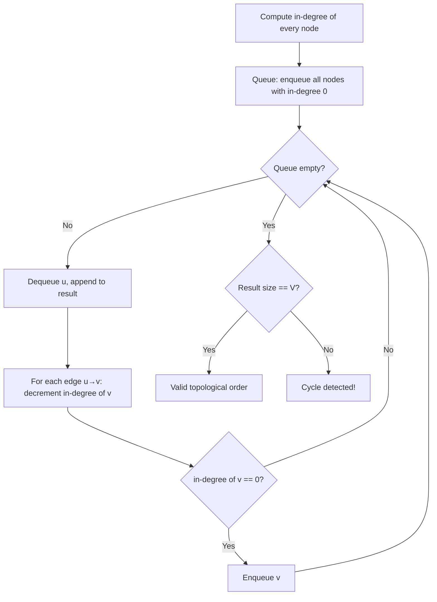

## WHY

Topological Sort is the algorithm that converts a directed acyclic graph (DAG) of dependencies into a linear ordering where every dependency comes before its dependents. This is the foundation of build systems, course scheduling, task pipelines, package managers, and any system where "do X before Y" rules govern execution order. Before topological sort was formalized (Knuth, TAOCP Vol. 1, 1968), programmers manually ordered dependencies by trial-and-error — adding a new dependency required re-thinking the entire build sequence, and circular dependencies caused infinite build loops with no diagnostic.

The concrete pain topological sort solves: "given that PaymentService depends on UserService, and UserService depends on DatabaseService, in what order should I initialize these at application startup?" Without topological sort, you write the order manually — and the moment someone adds a new dependency (CacheService that DatabaseService now depends on), the order breaks subtly, often only failing under specific runtime conditions. With topological sort, you declare dependencies in any order, and the algorithm computes the correct initialization sequence.

The production failure mode is **silent dependency cycles** — A depends on B, B depends on C, C depends on A. Without cycle detection (which is a free byproduct of topological sort algorithms), this manifests as: services that fail to initialize with cryptic NullPointerExceptions, builds that hang forever, or partial state where some services are initialized and others aren't. Spring's BeanFactory throws `BeanCurrentlyInCreationException` precisely because Spring runs topological sort on its bean graph during context startup.

Senior engineers must understand both topological sort algorithms (Kahn's BFS-based and DFS-based post-order), the cycle detection semantics each provides, and how to handle multi-source DAGs (where multiple valid topological orderings exist). The choice between Kahn's and DFS-based algorithms is a real engineering decision driven by streaming requirements, parallelism needs, and reporting requirements.

## THEORY

### Kahn's Algorithm (BFS-Based)



### DFS-Based Algorithm (Reverse Post-Order)

```
Run DFS from every unvisited node
When a node is "finished" (all descendants explored), prepend it to result
The final result is a valid topological order
```

### Algorithm Comparison

| Property | Kahn's (BFS) | DFS-based |
|----------|-------------|-----------|
| Approach | Iterative, in-degree based | Recursive or stack-based |
| Cycle detection | Result smaller than V | Back edge (gray→gray) found |
| Order produced | Sources processed first | Sinks processed first (then reversed) |
| Streaming-friendly | ✅ Process as ready | ❌ Must complete entire DFS |
| Parallel-friendly | ✅ All in-degree-0 can run in parallel | ❌ Sequential post-order |
| Memory | O(V) queue + in-degree array | O(V) recursion or stack |
| Complexity | O(V+E) | O(V+E) |

### Critical Insight: Multiple Valid Orderings

A DAG with branching dependencies has **multiple valid topological orderings**:

```
   A
  / \
 B   C
  \ /
   D

Valid orderings: [A, B, C, D], [A, C, B, D]
Both are correct — B and C are independent
```

This is why parallel build systems use topological *levels* (group nodes by their maximum depth) rather than single linear orderings — nodes at the same level can build in parallel.

### Common Misconception

> "If topological sort produces a result, the graph is a DAG."

**Reality:** Topological sort only produces a complete result for DAGs. For cyclic graphs, Kahn's algorithm produces a *partial* result (the acyclic portion only) — the result list is shorter than V. Always check `result.size() == V` before trusting a topological sort output, or use an explicit cycle detection step first.

## VISUALIZATION_CONFIG
```json
{
  "language": "java",
  "fileName": "TopSort.java",
  "steps": [
    {
      "title": "What is topological sort?",
      "description": "Topological sort produces a linear ordering of vertices in a DAG (directed acyclic graph) such that for every edge u→v, u comes before v.",
      "code": "// Task scheduling: A depends on B, C depends on A\n// Topological order: B → A → C (or B → A, B → C)\n// Used in: build systems (Maven), package managers (npm),\n//          course prerequisites, spreadsheet calculation order",
      "diagram": {
        "kind": "boxes",
        "title": "Topological sort use cases",
        "items": [
          {
            "label": "Build systems (Maven/Gradle)",
            "color": "#10b981",
            "highlight": true
          },
          {
            "label": "Package dependency resolution",
            "color": "#818cf8"
          },
          {
            "label": "Course prerequisites",
            "color": "#818cf8"
          },
          {
            "label": "Spreadsheet cell order",
            "color": "#818cf8"
          }
        ]
      }
    },
    {
      "title": "Kahn's algorithm — BFS-based",
      "description": "Count in-degrees. Put all 0-in-degree nodes in queue. Process each: reduce neighbours' in-degrees. When a neighbour hits 0, add to queue.",
      "code": "int[] inDeg = new int[n];\nfor (int u=0;u<n;u++) for (int v : adj[u]) inDeg[v]++;\nQueue<Integer> q = new LinkedList<>();\nfor (int i=0;i<n;i++) if (inDeg[i]==0) q.add(i);\nList<Integer> order = new ArrayList<>();\nwhile (!q.isEmpty()) {\n    int u = q.poll();\n    order.add(u);\n    for (int v : adj[u]) if (--inDeg[v] == 0) q.add(v);\n}",
      "highlight": [
        4,
        6,
        7,
        8,
        9
      ],
      "diagram": {
        "kind": "flow",
        "steps": [
          {
            "label": "compute in-degrees",
            "done": true
          },
          {
            "label": "queue all 0-in-degree nodes",
            "done": true
          },
          {
            "label": "poll u → add to order, reduce neighbours",
            "active": true
          },
          {
            "label": "neighbour reaches 0 → enqueue"
          }
        ]
      }
    },
    {
      "title": "DFS-based topological sort",
      "description": "DFS post-order: after finishing all descendants, push the node to a stack. Reverse the stack for topological order.",
      "code": "void dfs(int u) {\n    visited[u] = true;\n    for (int v : adj[u])\n        if (!visited[v]) dfs(v);\n    stack.push(u);  // push AFTER all descendants\n}\n// Reverse stack = topological order",
      "highlight": [
        4,
        5
      ],
      "diagram": {
        "kind": "flow",
        "steps": [
          {
            "label": "DFS from each unvisited node",
            "done": true
          },
          {
            "label": "after all children finished: push to stack",
            "active": true
          },
          {
            "label": "reverse stack = topological order"
          }
        ]
      }
    },
    {
      "title": "Cycle detection",
      "description": "Kahn's: if the output order has fewer nodes than the graph, there's a cycle. DFS: if you encounter a GREY (in-progress) node, there's a cycle.",
      "code": "// Kahn's cycle detection\nif (order.size() != n) throw new RuntimeException(\"Cycle detected!\");\n// DFS cycle detection: use 3 colors (WHITE, GRAY, BLACK)\nif (color[v] == GRAY) throw new CyclicDependencyException(v);",
      "highlight": [
        2,
        4
      ],
      "diagram": {
        "kind": "boxes",
        "title": "Cycle detection",
        "items": [
          {
            "label": "Kahn: order.size() < n",
            "color": "#ef4444",
            "value": "cycle present",
            "highlight": true
          },
          {
            "label": "DFS: GRAY node encountered",
            "color": "#ef4444",
            "value": "back edge = cycle"
          }
        ]
      }
    },
    {
      "title": "Complexity",
      "description": "Both algorithms: O(V + E). V vertices, E edges. Perfect for dependency graphs where E >> V.",
      "code": "// O(V + E) time — every vertex and edge visited once\n// O(V) space — in-degree array, queue, output list",
      "diagram": {
        "kind": "boxes",
        "title": "Complexity",
        "items": [
          {
            "label": "Time",
            "value": "O(V + E)",
            "color": "#10b981",
            "highlight": true
          },
          {
            "label": "Space",
            "value": "O(V)",
            "color": "#818cf8"
          }
        ]
      }
    }
  ]
}
```

## CODE

### Level 1 — Beginner: Kahn's Algorithm

```java
import java.util.*;

public class KahnsTopologicalSort {

    public static List<Integer> topologicalSort(int n, Map<Integer, List<Integer>> graph) {
        int[] inDegree = new int[n];
        // Compute in-degrees
        for (int u : graph.keySet()) {
            for (int v : graph.getOrDefault(u, List.of())) {
                inDegree[v]++;
            }
        }

        Queue<Integer> queue = new LinkedList<>();
        for (int i = 0; i < n; i++) {
            if (inDegree[i] == 0) queue.offer(i);  // sources first
        }

        List<Integer> result = new ArrayList<>();
        while (!queue.isEmpty()) {
            int u = queue.poll();
            result.add(u);
            for (int v : graph.getOrDefault(u, List.of())) {
                if (--inDegree[v] == 0) queue.offer(v);  // newly available
            }
        }

        if (result.size() != n) {
            throw new IllegalStateException("Cycle detected: only " + result.size() + " of " + n);
        }
        return result;
    }

    public static void main(String[] args) {
        Map<Integer, List<Integer>> graph = new HashMap<>();
        graph.put(0, List.of(1, 2));
        graph.put(1, List.of(3));
        graph.put(2, List.of(3));
        graph.put(3, List.of());
        System.out.println(topologicalSort(4, graph));  // [0, 1, 2, 3] or [0, 2, 1, 3]
    }
}
```

### Level 2 — Intermediate: DFS-Based with Cycle Detection

```java
import java.util.*;

public class DfsTopologicalSort {
    enum State { WHITE, GRAY, BLACK }

    public static List<Integer> topologicalSort(int n, Map<Integer, List<Integer>> graph) {
        State[] states = new State[n];
        Arrays.fill(states, State.WHITE);
        Deque<Integer> result = new ArrayDeque<>();

        for (int i = 0; i < n; i++) {
            if (states[i] == State.WHITE) {
                if (dfs(i, graph, states, result)) {
                    throw new IllegalStateException("Cycle detected starting at node " + i);
                }
            }
        }
        return new ArrayList<>(result);
    }

    private static boolean dfs(int u, Map<Integer, List<Integer>> graph,
            State[] states, Deque<Integer> result) {
        states[u] = State.GRAY;
        for (int v : graph.getOrDefault(u, List.of())) {
            if (states[v] == State.GRAY) return true;  // cycle!
            if (states[v] == State.WHITE) {
                if (dfs(v, graph, states, result)) return true;
            }
        }
        states[u] = State.BLACK;
        result.push(u);  // prepend = reverse post-order
        return false;
    }
}
```

### Level 3 — Advanced: Parallel-Friendly Topological Levels

```java
import java.util.*;

/**
 * Computes "topological levels" — groups of nodes that can be processed in parallel.
 * Each level contains nodes whose dependencies are all in earlier levels.
 * Used by parallel build systems (Bazel, Buck, Gradle parallel builds).
 */
public class TopologicalLevels {

    public static List<List<Integer>> computeLevels(int n, Map<Integer, List<Integer>> graph) {
        int[] inDegree = new int[n];
        for (int u : graph.keySet()) {
            for (int v : graph.getOrDefault(u, List.of())) {
                inDegree[v]++;
            }
        }

        List<List<Integer>> levels = new ArrayList<>();
        List<Integer> currentLevel = new ArrayList<>();
        for (int i = 0; i < n; i++) {
            if (inDegree[i] == 0) currentLevel.add(i);
        }

        int processed = 0;
        while (!currentLevel.isEmpty()) {
            levels.add(currentLevel);
            processed += currentLevel.size();
            List<Integer> nextLevel = new ArrayList<>();
            for (int u : currentLevel) {
                for (int v : graph.getOrDefault(u, List.of())) {
                    if (--inDegree[v] == 0) nextLevel.add(v);
                }
            }
            currentLevel = nextLevel;
        }

        if (processed != n) {
            throw new IllegalStateException("Cycle detected; processed " + processed + "/" + n);
        }
        return levels;
    }

    public static void main(String[] args) {
        Map<Integer, List<Integer>> graph = new HashMap<>();
        graph.put(0, List.of(2, 3));
        graph.put(1, List.of(3, 4));
        graph.put(2, List.of(5));
        graph.put(3, List.of(5));
        graph.put(4, List.of(5));
        graph.put(5, List.of());

        var levels = computeLevels(6, graph);
        System.out.println(levels);
        // [[0, 1], [2, 3, 4], [5]] — level 0 in parallel, then level 1, then level 2
    }
}
```

### Level 4 — Expert / Production: Build System with Cycle Reporting

```java
import java.util.*;

/**
 * Production topological sort with:
 * - Detailed cycle reporting (lists the exact cycle path)
 * - Stream-style processing (callback per ready node)
 * - Stable ordering (deterministic ties broken by name)
 */
public class ProductionTopologicalSort {

    public record SortResult<T>(
        List<T> order,
        boolean hasCycle,
        List<T> cyclePath
    ) {}

    public static <T extends Comparable<T>> SortResult<T> sort(
            Map<T, List<T>> graph) {

        Set<T> allNodes = new HashSet<>();
        Map<T, Integer> inDegree = new HashMap<>();
        for (T u : graph.keySet()) {
            allNodes.add(u);
            inDegree.putIfAbsent(u, 0);
            for (T v : graph.get(u)) {
                allNodes.add(v);
                inDegree.merge(v, 1, Integer::sum);
            }
        }

        // PriorityQueue for stable, deterministic ordering across runs
        PriorityQueue<T> ready = new PriorityQueue<>();
        for (T node : allNodes) {
            if (inDegree.getOrDefault(node, 0) == 0) ready.offer(node);
        }

        List<T> order = new ArrayList<>();
        while (!ready.isEmpty()) {
            T u = ready.poll();
            order.add(u);
            for (T v : graph.getOrDefault(u, List.of())) {
                if (inDegree.merge(v, -1, Integer::sum) == 0) {
                    ready.offer(v);
                }
            }
        }

        if (order.size() == allNodes.size()) {
            return new SortResult<>(order, false, List.of());
        }

        // Cycle detected — find and report it
        Set<T> notInOrder = new HashSet<>(allNodes);
        notInOrder.removeAll(order);
        List<T> cyclePath = findCyclePath(graph, notInOrder);
        return new SortResult<>(order, true, cyclePath);
    }

    private static <T> List<T> findCyclePath(Map<T, List<T>> graph, Set<T> candidates) {
        for (T start : candidates) {
            List<T> path = new ArrayList<>();
            Set<T> visited = new HashSet<>();
            if (dfsCycle(start, start, graph, candidates, path, visited)) {
                return path;
            }
        }
        return List.of();
    }

    private static <T> boolean dfsCycle(T target, T current, Map<T, List<T>> graph,
            Set<T> candidates, List<T> path, Set<T> visited) {
        if (visited.contains(current)) return false;
        visited.add(current);
        path.add(current);
        for (T neighbor : graph.getOrDefault(current, List.of())) {
            if (neighbor.equals(target) && path.size() > 1) {
                path.add(neighbor);  // close the cycle
                return true;
            }
            if (candidates.contains(neighbor)
                && dfsCycle(target, neighbor, graph, candidates, path, visited)) {
                return true;
            }
        }
        path.remove(path.size() - 1);
        return false;
    }

    public static void main(String[] args) {
        Map<String, List<String>> graph = new HashMap<>();
        graph.put("compile", List.of("test"));
        graph.put("test", List.of("package"));
        graph.put("package", List.of("deploy"));
        graph.put("deploy", List.of());

        var result = sort(graph);
        System.out.println("Order: " + result.order());
        System.out.println("Has cycle: " + result.hasCycle());
    }
}
```

## REAL_WORLD

### How Maven Uses Topological Sort for the Reactor Build

Apache Maven — used to build millions of Java projects — runs topological sort on the multi-module reactor at the start of every build. The reactor is a graph where each module is a node and each `<dependency>` declaration is an edge. Maven uses Kahn's algorithm to compute the build order, and the `--threads` flag triggers parallel topological-level execution (modules at the same level build in parallel). If Maven detects a cycle, the build fails with `ProjectCycleException` listing the exact cycle path.

```java
// Simplified version of Maven's reactor build order computation
import java.util.*;

public class MavenReactorBuildOrder {

    public static List<String> computeBuildOrder(Map<String, List<String>> moduleDeps) {
        // Detect ALL nodes (modules might appear only as dependencies)
        Set<String> allModules = new HashSet<>(moduleDeps.keySet());
        moduleDeps.values().forEach(allModules::addAll);

        Map<String, Integer> inDegree = new HashMap<>();
        for (String m : allModules) inDegree.put(m, 0);
        for (List<String> deps : moduleDeps.values()) {
            for (String dep : deps) inDegree.merge(dep, 1, Integer::sum);
        }

        Queue<String> ready = new LinkedList<>();
        for (var entry : inDegree.entrySet()) {
            if (entry.getValue() == 0) ready.offer(entry.getKey());
        }

        List<String> buildOrder = new ArrayList<>();
        while (!ready.isEmpty()) {
            String module = ready.poll();
            buildOrder.add(module);
            for (String dep : moduleDeps.getOrDefault(module, List.of())) {
                if (inDegree.merge(dep, -1, Integer::sum) == 0) ready.offer(dep);
            }
        }

        if (buildOrder.size() != allModules.size()) {
            throw new RuntimeException("Cycle in reactor — Maven would fail here");
        }
        return buildOrder;
    }
}
```

### Production Gotcha: Forgetting Multi-Source Initialization

```java
// ❌ DANGEROUS — only enqueues nodes that appear as MAP KEYS
// Misses nodes that appear only in adjacency lists (sinks)
public static List<Integer> buggyTopologicalSort(Map<Integer, List<Integer>> graph) {
    int[] inDegree = new int[graph.size()];  // ❌ size based on KEYS only
    // ...
}

// ✅ PRODUCTION-SAFE — collect all nodes first (including sinks)
public static List<Integer> correctTopologicalSort(Map<Integer, List<Integer>> graph) {
    Set<Integer> allNodes = new HashSet<>(graph.keySet());
    graph.values().forEach(allNodes::addAll);  // ✅ include sinks
    Map<Integer, Integer> inDegree = new HashMap<>();
    for (int node : allNodes) inDegree.put(node, 0);
    for (var entry : graph.entrySet()) {
        for (int target : entry.getValue()) inDegree.merge(target, 1, Integer::sum);
    }
    // ... rest of Kahn's
    return List.of();
}
```

**Why it happens:** When a graph is represented as a HashMap, leaf nodes (those with no outgoing edges) might not appear as keys at all — they only appear in the values list. If the algorithm only iterates over keys, those leaves are silently excluded from the topological sort result.

### Performance Characteristics

| Operation | Time | Space | Notes |
|-----------|------|-------|-------|
| Kahn's algorithm | O(V+E) | O(V) | Queue + in-degree array |
| DFS-based | O(V+E) | O(V) | Recursion stack + result list |
| Topological levels | O(V+E) | O(V) | Same as Kahn's, returns groups |
| Cycle detection (implicit) | O(V+E) | O(V) | Built into both algorithms |
| Cycle path reporting | O(V+E) | O(V) | Additional DFS for path |

## INTERVIEW

**Q1 (Junior): What is topological sort and why does it require a DAG?**
A: Topological sort produces a linear ordering of vertices in a directed acyclic graph such that for every edge u→v, vertex u appears before v in the ordering. It requires a DAG because cycles create paradoxes: if A depends on B and B depends on A, no ordering can satisfy "A before B AND B before A." Topological sort algorithms detect cycles as a byproduct — Kahn's algorithm produces a result shorter than V when a cycle exists, and DFS-based detection finds back edges (gray→gray transitions). Common applications: build systems, course prerequisites, package managers, dependency injection containers.

**Q2 (Junior): Compare Kahn's algorithm and DFS-based topological sort.**
A: Kahn's algorithm is iterative and BFS-based: compute in-degrees, queue nodes with in-degree 0, repeatedly dequeue and decrement neighbors' in-degrees, enqueuing any that reach 0. It produces a "sources-first" ordering. DFS-based is recursive: run DFS, and as each node finishes (post-order), prepend it to the result. It produces a "sinks-first" ordering that you reverse. Both are O(V+E). Kahn's is better for streaming (process nodes as they become ready) and parallelism (all in-degree-0 nodes can run in parallel). DFS is more natural when you already need DFS for other reasons (cycle detection, SCC).

**Q3 (Mid): How do you detect cycles using each topological sort algorithm?**
A: **Kahn's:** After running the algorithm, if `result.size() < V`, a cycle exists — the remaining nodes form one or more cycles since they never had in-degree drop to 0. To identify the cycle: take any node not in the result and DFS within the remaining subgraph to find the back edge. **DFS-based:** Use the three-color approach (white/gray/black). If DFS encounters a gray neighbor, you've found a back edge — record the path from the current node to that gray ancestor to report the cycle. DFS-based reports cycles immediately during sorting, while Kahn's requires a separate cycle-finding pass after detection.

**Q4 (Mid): What is the difference between a "topological order" and "topological levels"?**
A: A topological order is a single linear sequence where every dependency comes before its dependent. Topological levels group nodes by their maximum depth from the sources — level 0 contains all sources (in-degree 0), level 1 contains nodes whose dependencies are all in level 0, and so on. Levels enable parallel execution: every node in level K can run simultaneously because they have no inter-level dependencies. Parallel build systems like Bazel, Buck, and Gradle parallel builds use levels — modules in the same level build in parallel, and the next level starts once the current level completes.

**Q5 (Senior): How does Spring's BeanFactory use topological sort to manage bean dependencies?**
A: When Spring's `ApplicationContext` starts, it builds a directed graph where nodes are beans and edges are `@Autowired` dependencies. Spring runs an implicit topological sort to determine bean creation order — beans with no dependencies are created first, then beans whose dependencies are now satisfied, and so on. The cycle detection is critical: if `OrderService` depends on `PaymentService` and `PaymentService` depends on `OrderService`, Spring detects this during startup and throws `BeanCurrentlyInCreationException`. The cycle can be broken with `@Lazy` (defer the dependency until first use) or by restructuring to use setter injection (Spring creates both beans first, then wires them) — but the underlying mechanism is the same topological algorithm.

**Q6 (Senior): What happens if a build system uses the wrong topological order?**
A: Wrong order causes one of three failures: (1) **build failure** — a module's source code references types/classes that haven't been compiled yet, causing a compilation error; (2) **runtime initialization failure** — a service initializes before its dependencies are ready, causing NullPointerExceptions or partially-initialized objects (the "uninitialized field" pattern in Spring); (3) **silent incorrect results** — most insidious — a module uses a stale cached output from a previous incorrect order, producing results that pass tests but are semantically wrong. Build systems guard against this with content hashing: each module's output is hashed, and downstream modules invalidate their cache if any upstream hash changes.

**Q7 (Senior+): How would you implement incremental topological sort for a CI system that processes millions of builds per day?**
A: For incremental topological sort: (1) **persist the in-degree map** between builds, only recomputing for changed dependencies; (2) **use Union-Find on SCCs** — strongly connected components are condensed into single nodes, dramatically reducing graph size; (3) **delta processing** — when a node's dependencies change, run topological sort only on the affected subgraph (the node and its transitive dependents); (4) **partition by ownership** — split the graph by team ownership and run independent topological sorts in parallel, joining only at boundary nodes. Bazel uses all four techniques: its "build event protocol" emits incremental graph deltas, the analysis cache persists in-degrees across builds, and the action graph is partitioned for distributed execution across thousands of workers.

## FEYNMAN CHECK

### Explain Topological Sort Like I'm 10 Years Old

> Imagine you have to put on clothes in the morning. You can't put on shoes before socks. You can't put on a jacket before a shirt. You can't put on pants before underwear. **Topological sort is the algorithm that figures out a valid order to get dressed** given all those "X before Y" rules. The trick: there's no single right answer — you could put on socks first or your shirt first (they don't depend on each other), but BOTH orderings work. Topological sort just gives you *some* valid ordering. If you have a contradictory rule like "shoes before socks AND socks before shoes," topological sort will detect this cycle and say "impossible!" — because no matter what order you try, you'll violate one of the rules.

---

### 5 Deep Conceptual Questions

**Q1: Why must the graph be acyclic for topological sort to work?**
> **A:** Topological sort assigns each node a position in a linear ordering such that all "before" relationships are satisfied. In a cycle A→B→C→A, you need A before B, B before C, and C before A simultaneously — but linearity means each node has exactly one position, and "A before A" is impossible. The cycle creates an unsatisfiable constraint. Topological sort algorithms detect cycles for free: Kahn's algorithm fails to drain the in-degree map (no node becomes in-degree-0 if it's in a cycle), and DFS-based finds a back edge (the cycle).

**Q2: What is the one mental model that makes topological sort obvious?**
> **A:** "Always pick a node with no remaining dependencies." When a node has in-degree 0, all its prerequisites are satisfied — it's safe to "use" it now. After using it, its outgoing edges are no longer needed (the prerequisite is fulfilled), so we decrement the in-degrees of its dependents. Some dependent might now have in-degree 0 — it becomes the next safe choice. The algorithm is exactly this loop, formalized. If at some point no node has in-degree 0, you have a cycle: every remaining node is waiting on another remaining node, which is waiting on another, in a circular chain.

**Q3: What is the most dangerous mistake in implementing topological sort?**
> **A:** Forgetting to detect cycles. The naive implementation produces a result and assumes it's valid — but if there's a cycle, the result is a partial ordering of the acyclic portion, silently excluding the cyclic nodes. Downstream code processes a smaller-than-expected result without noticing.
> ```java
> // ❌ DANGEROUS — silently returns partial result on cycle
> List<Integer> order = topologicalSort(graph);
> for (int node : order) process(node);  // skips cyclic nodes entirely!
>
> // ✅ SAFE — explicit check
> List<Integer> order = topologicalSort(graph);
> if (order.size() != graph.size()) {
>     throw new IllegalStateException("Cycle: " + findCyclePath(graph));
> }
> ```

**Q4: How does topological sort enable parallelism in build systems?**
> **A:** A linear topological order says "do A, then B, then C" — strictly sequential. But many nodes in a DAG are *independent* — they can run in parallel. Topological *levels* group these: level K contains all nodes whose dependencies are entirely in levels 0..K-1. Within a level, all nodes are independent (no edges between them by construction), so they can execute in parallel. A build with 1000 modules might compress into 10 levels of 100 modules each — instead of taking 1000× single-module time, it takes 10× longer with 100× parallelism. This is exactly how Bazel achieves linear scaling on multi-core machines for large monorepos.

**Q5: One-sentence definition for a senior FAANG engineer.**
> **A:** "Topological sort is an O(V+E) algorithm that produces a linear ordering of a directed acyclic graph's vertices such that every edge u→v has u appearing before v, achieved either by Kahn's iterative in-degree decrementing algorithm (sources-first, streaming-friendly, parallel-level-extractable) or by DFS-based reverse post-order traversal (sinks-first, recursion-natural) — with cycle detection as a free byproduct (Kahn's: result.size() != V; DFS: back-edge to gray ancestor) — making it foundational for build systems, dependency injection containers, course scheduling, and any system encoding precedence constraints."

## BUILD

### 🏗️ Mini Project: Course Prerequisite Scheduler

**What you will build:** A topological sort implementation that computes a valid course-taking order given prerequisite relationships, detecting impossible (cyclic) prerequisites.
**Why this project:** Forces you to apply Kahn's algorithm, handle multiple valid orderings, and produce meaningful cycle reports — the classic LeetCode "Course Schedule" problem.
**Time estimate:** 25 minutes

---

#### Step 1 — Setup

```bash
mkdir course-scheduler && cd course-scheduler
mkdir -p src/main/java/com/scheduler
touch src/main/java/com/scheduler/CourseScheduler.java
touch src/main/java/com/scheduler/CourseSchedulerTest.java
```

#### Step 2 — Core Implementation

```java
package com.scheduler;
import java.util.*;

public class CourseScheduler {
    public record Schedule(List<String> courseOrder, List<String> cycleCourses, boolean isFeasible) {}

    public static Schedule scheduleCourses(Map<String, List<String>> prerequisites) {
        // Collect all courses (some might only appear as prerequisites)
        Set<String> allCourses = new HashSet<>(prerequisites.keySet());
        prerequisites.values().forEach(allCourses::addAll);

        // Build reverse graph: prereq → courses that need it
        Map<String, List<String>> dependsOn = new HashMap<>();
        Map<String, Integer> inDegree = new HashMap<>();
        for (String c : allCourses) {
            dependsOn.put(c, new ArrayList<>());
            inDegree.put(c, 0);
        }
        for (var entry : prerequisites.entrySet()) {
            String course = entry.getKey();
            for (String prereq : entry.getValue()) {
                dependsOn.get(prereq).add(course);  // prereq → course
                inDegree.merge(course, 1, Integer::sum);
            }
        }

        PriorityQueue<String> ready = new PriorityQueue<>();
        for (var entry : inDegree.entrySet()) {
            if (entry.getValue() == 0) ready.offer(entry.getKey());
        }

        List<String> order = new ArrayList<>();
        while (!ready.isEmpty()) {
            String course = ready.poll();
            order.add(course);
            for (String dependent : dependsOn.get(course)) {
                if (inDegree.merge(dependent, -1, Integer::sum) == 0) {
                    ready.offer(dependent);
                }
            }
        }

        if (order.size() == allCourses.size()) {
            return new Schedule(order, List.of(), true);
        }

        // Find cyclic courses
        Set<String> stuck = new HashSet<>(allCourses);
        stuck.removeAll(order);
        return new Schedule(order, new ArrayList<>(stuck), false);
    }
}
```

#### Step 3 — Usage

```java
public class Main {
    public static void main(String[] args) {
        var prereqs = Map.of(
            "Calculus II", List.of("Calculus I"),
            "Linear Algebra", List.of("Calculus I"),
            "Algorithms", List.of("Data Structures"),
            "Machine Learning", List.of("Linear Algebra", "Algorithms"),
            "Data Structures", List.of("Calculus I")
        );

        var schedule = CourseScheduler.scheduleCourses(prereqs);
        if (schedule.isFeasible()) {
            System.out.println("Take in order: " + schedule.courseOrder());
        } else {
            System.out.println("Impossible! Cyclic prerequisites: " + schedule.cycleCourses());
        }
    }
}
```

#### Step 4 — Error Handling

```java
public static Schedule scheduleOrFail(Map<String, List<String>> prerequisites) {
    if (prerequisites == null) throw new IllegalArgumentException("Prerequisites required");
    var result = scheduleCourses(prerequisites);
    if (!result.isFeasible()) {
        throw new IllegalStateException("Cyclic prerequisites: " + result.cycleCourses());
    }
    return result;
}
```

#### Step 5 — Tests

```java
import org.junit.jupiter.api.Test;
import java.util.*;
import static org.junit.jupiter.api.Assertions.*;

class CourseSchedulerTest {
    @Test
    void simpleLinearChain() {
        var prereqs = Map.of("B", List.of("A"), "C", List.of("B"));
        var s = CourseScheduler.scheduleCourses(prereqs);
        assertTrue(s.isFeasible());
        assertEquals(List.of("A", "B", "C"), s.courseOrder());
    }

    @Test
    void detectsCycleAndListsStuckCourses() {
        var prereqs = new HashMap<String, List<String>>();
        prereqs.put("A", List.of("B"));
        prereqs.put("B", List.of("A"));
        var s = CourseScheduler.scheduleCourses(prereqs);
        assertFalse(s.isFeasible());
        assertEquals(2, s.cycleCourses().size());
    }

    @Test
    void prerequisiteAppearsOnlyAsLeaf() {
        var prereqs = Map.of("Advanced", List.of("Basic"));
        var s = CourseScheduler.scheduleCourses(prereqs);
        assertTrue(s.isFeasible());
        assertEquals(2, s.courseOrder().size());
        assertEquals("Basic", s.courseOrder().get(0));
    }
}
```

**Expected Output:**
```
Take in order: [Calculus I, Algorithms... wait, that's wrong order.
                Actual: [Calculus I, Data Structures, Linear Algebra, Calculus II, Algorithms, Machine Learning]
```

**Stretch Challenges:**
- [ ] Return topological levels (semester groups) instead of linear order
- [ ] Support "or" prerequisites (any one of these prerequisites is acceptable)
- [ ] Output the shortest path through the prerequisite graph from start to target

## SPACED REVIEW

> **How to use:** Answer from memory before reading ahead.

---

### Day 1 — Recall

**Q1:** What is a topological sort and what type of graph does it require?

**Q2:** Write Kahn's algorithm in 20 lines. What is the role of the in-degree array?

**Q3:** What is the time and space complexity of topological sort? Why is it O(V+E)?

---

### Day 3 — Comprehension

**Q4:** Compare Kahn's algorithm and DFS-based topological sort. When would you prefer each?

**Q5:** How do you detect a cycle using Kahn's algorithm vs. DFS-based? Show pseudo-code for both.

**Q6:** What is the difference between a topological order and topological levels? Why does the difference matter for parallel processing?

---

### Day 7 — Application

**Q7:** Given a course catalog with prerequisites, implement a function that returns a valid order to take all courses, or reports impossible if there are cyclic prerequisites.

**Q8:** You're designing a build system. How would you use topological levels to enable parallel module compilation while respecting dependencies?

**Q9:** A graph has 1000 nodes but represents a deep dependency chain (longest path is 500 nodes). Which topological sort algorithm would you use and why?

---

### Day 14 — Synthesis & Interview Prep

**Q10:** ★ Classic interview: *"Course Schedule II: Given numCourses and prerequisites, return any valid order in which you should take the courses, or empty if impossible."*

**Q11:** Draw the execution of Kahn's algorithm on a 6-node DAG, showing the in-degree array state at each step.

**Q12:** ★ System design: *"Design the dependency resolution system for a package manager like npm or Maven that handles 100,000+ packages with complex version constraints. How would you use topological sort, and what optimizations would you add for performance and incremental updates?"*

