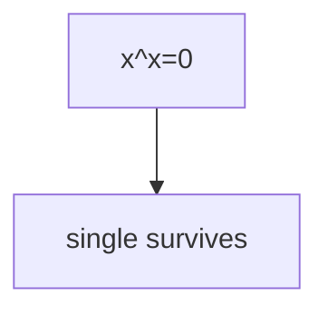

## WHY
XOR cancels pairs, masks pack flags, subsets enumerate via bits. Find single number XORs all in O(1) space.

## THEORY
Independent bits; mask/shift/XOR.


## VISUALIZATION_CONFIG
```json
{
  "steps": [
    {
      "title": "Bitwise Operators",
      "description": "AND, OR, XOR, NOT, shift left/right — foundation of bit tricks.",
      "code": "// Common bit operations\na & b   // AND: both bits 1\na | b   // OR:  either bit 1\na ^ b   // XOR: bits differ\n~a      // NOT: flip all bits\na << 1  // shift left (multiply by 2)\na >> 1  // shift right (divide by 2)\na >>> 1 // unsigned shift right\n\n// Key identities\nx ^ 0 === x       // XOR identity\nx ^ x === 0       // XOR self\nx & (x - 1)       // clear lowest set bit\nx & -x            // isolate lowest set bit\nx | (1 << i)      // set bit i\nx & ~(1 << i)     // clear bit i\n(x >> i) & 1      // get bit i",
      "highlight": [
        11,
        12,
        13,
        14,
        15,
        16,
        17
      ],
      "diagram": {
        "kind": "boxes",
        "items": [
          {
            "label": "AND: mask/test bits",
            "color": "#1e88e5"
          },
          {
            "label": "OR: set bits",
            "color": "#43a047"
          },
          {
            "label": "XOR: toggle/diff",
            "color": "#fb8c00"
          },
          {
            "label": "Shift: multiply/divide",
            "color": "#8e24aa"
          }
        ]
      }
    },
    {
      "title": "Single Number",
      "description": "XOR all numbers — pairs cancel, leaving the unique one.",
      "code": "// LC 136: Single Number\nfunction singleNumber(nums) {\n  return nums.reduce((acc, n) => acc ^ n, 0);\n}\n// XOR properties:\n// a ^ a = 0\n// a ^ 0 = a\n// XOR is commutative\n// So all pairs cancel, only unique remains\n\n// LC 137: Single Number II (all others appear 3 times)\n// Bit-by-bit: sum bit counts, mod 3 → answer's bit\nfunction singleNumberII(nums) {\n  let result = 0;\n  for (let i = 0; i < 32; i++) {\n    let count = 0;\n    for (const n of nums) count += (n >> i) & 1;\n    result |= (count % 3) << i;\n  }\n  return result;\n}",
      "highlight": [
        3,
        5,
        6,
        7,
        13,
        14,
        15,
        16,
        17,
        18
      ],
      "diagram": {
        "kind": "flow",
        "steps": [
          {
            "label": "XOR all elements"
          },
          {
            "label": "Pairs cancel to 0"
          },
          {
            "label": "Unique survives"
          },
          {
            "label": "O(n) time, O(1) space"
          }
        ]
      }
    },
    {
      "title": "Count Bits",
      "description": "Brian Kernighan's algorithm: n & (n-1) clears lowest set bit.",
      "code": "// LC 191: Number of 1 Bits (Hamming weight)\nfunction hammingWeight(n) {\n  let count = 0;\n  while (n !== 0) {\n    n = n & (n - 1); // clear lowest set bit\n    count++;\n  }\n  return count;\n}\n\n// LC 338: Counting Bits (0 to n)\nfunction countBits(n) {\n  const dp = new Array(n + 1).fill(0);\n  for (let i = 1; i <= n; i++) {\n    dp[i] = dp[i >> 1] + (i & 1); // half + last bit\n  }\n  return dp;\n}",
      "highlight": [
        4,
        5,
        6,
        12,
        13,
        14,
        15
      ],
      "diagram": {
        "kind": "flow",
        "steps": [
          {
            "label": "n & (n-1) clears lowest bit"
          },
          {
            "label": "Count iterations"
          },
          {
            "label": "DP: dp[i] = dp[i/2] + (i%2)"
          },
          {
            "label": "O(n) for all counts"
          }
        ]
      }
    },
    {
      "title": "Missing Number (XOR)",
      "description": "XOR trick — XOR all indices and all values; unmatched is the missing number.",
      "code": "// LC 268: Missing Number\nfunction missingNumber(nums) {\n  let xor = nums.length;\n  for (let i = 0; i < nums.length; i++) {\n    xor ^= i ^ nums[i];\n  }\n  return xor;\n}\n// XOR indices 0..n and values → missing survives\n\n// LC 260: Single Number III (two unique)\nfunction singleNumberIII(nums) {\n  const xor = nums.reduce((a, b) => a ^ b, 0);\n  const bit = xor & -xor; // lowest differing bit\n  let a = 0, b = 0;\n  for (const n of nums) {\n    if (n & bit) a ^= n;\n    else b ^= n;\n  }\n  return [a, b];\n}",
      "highlight": [
        3,
        4,
        5,
        6,
        13,
        14,
        15,
        16,
        17,
        18
      ],
      "diagram": {
        "kind": "flow",
        "steps": [
          {
            "label": "XOR all indices + values"
          },
          {
            "label": "Missing = leftover"
          },
          {
            "label": "For 2 uniques: partition by bit"
          },
          {
            "label": "XOR each partition"
          },
          {
            "label": "Return both"
          }
        ]
      }
    },
    {
      "title": "Subsets via Bitmask",
      "description": "Each subset = binary representation from 0 to 2^n - 1.",
      "code": "// Generate all subsets using bitmask\nfunction subsets(nums) {\n  const n = nums.length;\n  const result = [];\n  for (let mask = 0; mask < (1 << n); mask++) {\n    const subset = [];\n    for (let i = 0; i < n; i++) {\n      if (mask & (1 << i)) subset.push(nums[i]);\n    }\n    result.push(subset);\n  }\n  return result;\n}\n// mask 0000 → []\n// mask 0001 → [nums[0]]\n// mask 0011 → [nums[0], nums[1]]\n// mask 1111 → all elements\n// Total: 2^n subsets",
      "highlight": [
        5,
        6,
        7,
        8,
        14,
        15,
        16,
        17
      ],
      "diagram": {
        "kind": "flow",
        "steps": [
          {
            "label": "Iterate 0 to 2^n - 1"
          },
          {
            "label": "Each bit = include or not"
          },
          {
            "label": "Bit i set → include nums[i]"
          },
          {
            "label": "All 2^n subsets"
          },
          {
            "label": "O(n × 2^n)"
          }
        ]
      }
    }
  ]
}
```

## CODE
### Level1 single
```java
for(int v:a)x^=v;
```
### Level2 count
```java
while(x!=0){x&=x-1;c++;}
```
### Level3 subsets via bits
### Level4 two singles partition by bit

## REAL_WORLD
Permissions/Bloom filters. Gotcha: clear `x&=~(1<<i)`.
| Op|Time|
|--|--|
|all|O(1)|

## INTERVIEW
**Q1:** XOR. **Q2:** set/clear. **Q3:** kernighan. **Q4:** subsets. **Q5:** bloom.

## FEYNMAN CHECK
### Like10 > Switches; pairs cancel, lone stays.
**Q1** xor **Q2** mask **Q3** clear **Q4** count **Q5** def

## BUILD
### Bits
**Out:** `1 3`

## SPACED REVIEW
### Day 1 Recall
**Q1:** Trigger. **Q2:** Cost. **Q3:** 10-line.
### Day 3
**Q4:** vs alt. **Q5:** bug. **Q6:** refactor.
### Day 7
**Q7:** apply. **Q8:** PR slow. **Q9:** degrade.
### Day 14
**Q10:** ★ classic. **Q11:** links. **Q12:** ★ at 10M.
