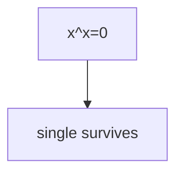

## WHY
XOR cancels pairs, masks pack flags, subsets enumerate via bits. Find single number XORs all in O(1) space.

## THEORY
Independent bits; mask/shift/XOR.


## VISUALIZATION_CONFIG

```json
{ "component": "FlowChart", "state": "leetcode-bit-manipulation-pattern" }
```

## CODE
### Level1 single
```java
for(int v:a)x^=v;
```
### Level2 count
```java
while(x!=0){x&=x-1;c++;}
```
### Level3 subsets via bits
### Level4 two singles partition by bit

## REAL_WORLD
Permissions/Bloom filters. Gotcha: clear `x&=~(1<<i)`.
| Op|Time|
|--|--|
|all|O(1)|

## INTERVIEW
**Q1:** XOR. **Q2:** set/clear. **Q3:** kernighan. **Q4:** subsets. **Q5:** bloom.

## FEYNMAN CHECK
### Like10 > Switches; pairs cancel, lone stays.
**Q1** xor **Q2** mask **Q3** clear **Q4** count **Q5** def

## BUILD
### Bits
**Out:** `1 3`

## SPACED REVIEW
### Day 1 Recall
**Q1:** Trigger. **Q2:** Cost. **Q3:** 10-line.
### Day 3
**Q4:** vs alt. **Q5:** bug. **Q6:** refactor.
### Day 7
**Q7:** apply. **Q8:** PR slow. **Q9:** degrade.
### Day 14
**Q10:** ★ classic. **Q11:** links. **Q12:** ★ at 10M.
