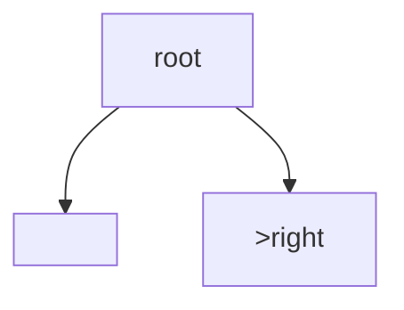

## WHY
BST gives ordered ops O(log n) balanced; inorder sorted. Validate, kth, range queries. Sorted insert degrades to list.

## THEORY
Left<root<right; inorder ascending.


## VISUALIZATION_CONFIG
```json
{
  "steps": [
    {
      "title": "BST Property",
      "description": "Binary Search Tree: left < root < right for every node — enables O(log n) operations.",
      "code": "// BST Insert - O(log n) average\nfunction insertIntoBST(root, val) {\n  if (!root) return { val, left: null, right: null };\n  if (val < root.val) root.left = insertIntoBST(root.left, val);\n  else root.right = insertIntoBST(root.right, val);\n  return root;\n}\n\n// BST Search - O(log n) average\nfunction searchBST(root, val) {\n  if (!root || root.val === val) return root;\n  return val < root.val\n    ? searchBST(root.left, val)\n    : searchBST(root.right, val);\n}",
      "highlight": [
        2,
        3,
        4,
        5,
        9,
        10,
        11,
        12,
        13
      ],
      "diagram": {
        "kind": "flow",
        "steps": [
          "Compare val with root",
          "val < root → go left",
          "val > root → go right",
          "Match → return",
          "O(log n) if balanced"
        ]
      }
    },
    {
      "title": "Validate BST",
      "description": "Check BST property using min/max bounds recursively.",
      "code": "// LC 98: Validate Binary Search Tree\nfunction isValidBST(root, min = -Infinity, max = Infinity) {\n  if (!root) return true;\n  if (root.val <= min || root.val >= max) return false;\n  return (\n    isValidBST(root.left, min, root.val) &&\n    isValidBST(root.right, root.val, max)\n  );\n}\n\n// Alt: inorder should be strictly increasing\nfunction isValidBSTInorder(root) {\n  let prev = -Infinity;\n  const helper = (node) => {\n    if (!node) return true;\n    if (!helper(node.left)) return false;\n    if (node.val <= prev) return false;\n    prev = node.val;\n    return helper(node.right);\n  };\n  return helper(root);\n}",
      "highlight": [
        3,
        4,
        5,
        6,
        12,
        13,
        14,
        15,
        16,
        17
      ],
      "diagram": {
        "kind": "flow",
        "steps": [
          "Track min/max bounds",
          "Node in range?",
          "Recurse left: max = node",
          "Recurse right: min = node",
          "Any invalid → false"
        ]
      }
    },
    {
      "title": "Kth Smallest in BST",
      "description": "Inorder traversal visits nodes in sorted order — stop at k.",
      "code": "// LC 230: Kth Smallest Element in BST\nfunction kthSmallest(root, k) {\n  const stack = [];\n  let curr = root;\n  while (curr || stack.length) {\n    while (curr) {\n      stack.push(curr);\n      curr = curr.left;\n    }\n    curr = stack.pop();\n    if (--k === 0) return curr.val;\n    curr = curr.right;\n  }\n}\n\n// For frequent queries: augment nodes with subtree size\n// Then find kth in O(log n) per query",
      "highlight": [
        5,
        6,
        7,
        8,
        10,
        11
      ],
      "diagram": {
        "kind": "flow",
        "steps": [
          "Iterative inorder",
          "Visit in sorted order",
          "Decrement k",
          "k=0 → answer",
          "O(H + k)"
        ]
      }
    },
    {
      "title": "Lowest Common Ancestor in BST",
      "description": "BST LCA is much simpler than general tree LCA — use BST property.",
      "code": "// LC 235: Lowest Common Ancestor of BST\nfunction lowestCommonAncestor(root, p, q) {\n  while (root) {\n    if (p.val < root.val && q.val < root.val) {\n      root = root.left;\n    } else if (p.val > root.val && q.val > root.val) {\n      root = root.right;\n    } else {\n      return root; // split point\n    }\n  }\n  return null;\n}\n\n// Insight: LCA is first node where p and q diverge",
      "highlight": [
        3,
        4,
        5,
        6,
        7,
        8,
        9
      ],
      "diagram": {
        "kind": "flow",
        "steps": [
          "Both < root → go left",
          "Both > root → go right",
          "Split → root is LCA",
          "O(log n)"
        ]
      }
    },
    {
      "title": "BST Iterator",
      "description": "Design iterator with O(1) hasNext, amortized O(1) next — controlled inorder.",
      "code": "// LC 173: Binary Search Tree Iterator\nclass BSTIterator {\n  constructor(root) {\n    this.stack = [];\n    this._pushLeft(root);\n  }\n  _pushLeft(node) {\n    while (node) {\n      this.stack.push(node);\n      node = node.left;\n    }\n  }\n  next() {\n    const node = this.stack.pop();\n    this._pushLeft(node.right);\n    return node.val;\n  }\n  hasNext() {\n    return this.stack.length > 0;\n  }\n}",
      "highlight": [
        3,
        4,
        5,
        7,
        8,
        9,
        10,
        12,
        13,
        14,
        15
      ],
      "diagram": {
        "kind": "flow",
        "steps": [
          "Push all left path",
          "next() pops",
          "Push right's left path",
          "Amortized O(1)",
          "O(h) space"
        ]
      }
    }
  ]
}
```

## CODE
### Level1 search
### Level2 validate range
```java
if(n.v<=lo||n.v>=hi)false;
```
### Level3 kth via inorder
### Level4 LCA

## REAL_WORLD
TreeMap. Gotcha: balance.
| Op|Time|
|--|--|
|search|O(log n)|

## INTERVIEW
**Q1:** inorder sorted. **Q2:** validate. **Q3:** kth. **Q4:** vs heap. **Q5:** LCA.

## FEYNMAN CHECK
### Like10 > Left smaller, right bigger; dive like dictionary.
**Q1** order **Q2** validate **Q3** kth **Q4** balance **Q5** def

## BUILD
### Validate
**Out:** `true`

## SPACED REVIEW
### Day 1 Recall
**Q1:** Trigger. **Q2:** Cost. **Q3:** 10-line.
### Day 3
**Q4:** vs alt. **Q5:** bug. **Q6:** refactor.
### Day 7
**Q7:** apply. **Q8:** PR slow. **Q9:** degrade.
### Day 14
**Q10:** ★ classic. **Q11:** links. **Q12:** ★ at 10M.
