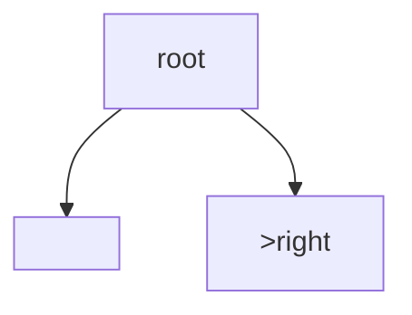

## WHY
BST gives ordered ops O(log n) balanced; inorder sorted. Validate, kth, range queries. Sorted insert degrades to list.

## THEORY
Left<root<right; inorder ascending.


## VISUALIZATION_CONFIG

```json
{ "component": "TreeVisualization", "state": "leetcode-bst-pattern" }
```

## CODE
### Level1 search
### Level2 validate range
```java
if(n.v<=lo||n.v>=hi)false;
```
### Level3 kth via inorder
### Level4 LCA

## REAL_WORLD
TreeMap. Gotcha: balance.
| Op|Time|
|--|--|
|search|O(log n)|

## INTERVIEW
**Q1:** inorder sorted. **Q2:** validate. **Q3:** kth. **Q4:** vs heap. **Q5:** LCA.

## FEYNMAN CHECK
### Like10 > Left smaller, right bigger; dive like dictionary.
**Q1** order **Q2** validate **Q3** kth **Q4** balance **Q5** def

## BUILD
### Validate
**Out:** `true`

## SPACED REVIEW
### Day 1 Recall
**Q1:** Trigger. **Q2:** Cost. **Q3:** 10-line.
### Day 3
**Q4:** vs alt. **Q5:** bug. **Q6:** refactor.
### Day 7
**Q7:** apply. **Q8:** PR slow. **Q9:** degrade.
### Day 14
**Q10:** ★ classic. **Q11:** links. **Q12:** ★ at 10M.
