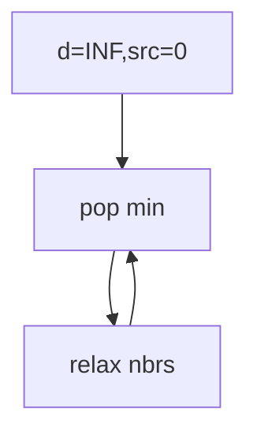

## WHY
Shortest path with weights by BFS is wrong. Dijkstra greedily expands nearest via min-heap O((V+E)log V). Negative edges break it.

## THEORY
Pop min dist, relax neighbors, skip stale.


## VISUALIZATION_CONFIG
```json
{
  "steps": [
    {
      "title": "Dijkstra's Algorithm",
      "description": "Shortest path in weighted graph with non-negative edges — greedy + priority queue.",
      "code": "// Dijkstra's shortest path\nfunction dijkstra(graph, start, n) {\n  const dist = new Array(n).fill(Infinity);\n  dist[start] = 0;\n  const pq = new MinHeap(); // [distance, node]\n  pq.push([0, start]);\n  while (!pq.isEmpty()) {\n    const [d, u] = pq.pop();\n    if (d > dist[u]) continue; // stale entry\n    for (const [v, w] of graph[u] || []) {\n      const newDist = d + w;\n      if (newDist < dist[v]) {\n        dist[v] = newDist;\n        pq.push([newDist, v]);\n      }\n    }\n  }\n  return dist;\n}",
      "highlight": [
        3,
        4,
        5,
        6,
        8,
        9,
        10,
        11,
        12,
        13,
        14
      ],
      "diagram": {
        "kind": "flow",
        "steps": [
          "dist[start] = 0",
          "PQ min by distance",
          "Pop nearest",
          "Relax neighbors",
          "Update if shorter",
          "O((V+E) log V)"
        ]
      }
    },
    {
      "title": "Network Delay Time",
      "description": "Find time for signal to reach all nodes — max of shortest distances.",
      "code": "// LC 743: Network Delay Time\nfunction networkDelayTime(times, n, k) {\n  const graph = Array.from({ length: n + 1 }, () => []);\n  for (const [u, v, w] of times) graph[u].push([v, w]);\n\n  const dist = new Array(n + 1).fill(Infinity);\n  dist[k] = 0;\n  const pq = [[0, k]]; // simple min-heap simulation\n  while (pq.length) {\n    pq.sort((a, b) => a[0] - b[0]); // for demo; use real heap\n    const [d, u] = pq.shift();\n    if (d > dist[u]) continue;\n    for (const [v, w] of graph[u]) {\n      if (d + w < dist[v]) {\n        dist[v] = d + w;\n        pq.push([dist[v], v]);\n      }\n    }\n  }\n  const max = Math.max(...dist.slice(1));\n  return max === Infinity ? -1 : max;\n}",
      "highlight": [
        6,
        7,
        12,
        13,
        14,
        15,
        20,
        21
      ],
      "diagram": {
        "kind": "flow",
        "steps": [
          "Source = k",
          "Dijkstra from k",
          "dist[v] for all v",
          "Max reachable",
          "Or -1 if unreachable"
        ]
      }
    },
    {
      "title": "Cheapest Flights K Stops",
      "description": "Constrained shortest path — modified Dijkstra tracking stops used.",
      "code": "// LC 787: Cheapest Flights Within K Stops\nfunction findCheapestPrice(n, flights, src, dst, k) {\n  const graph = Array.from({ length: n }, () => []);\n  for (const [u, v, p] of flights) graph[u].push([v, p]);\n\n  // [cost, node, stopsUsed]\n  const pq = [[0, src, 0]];\n  const best = Array.from({ length: n }, () => new Array(k + 2).fill(Infinity));\n  while (pq.length) {\n    pq.sort((a, b) => a[0] - b[0]);\n    const [cost, u, stops] = pq.shift();\n    if (u === dst) return cost;\n    if (stops > k) continue;\n    for (const [v, price] of graph[u]) {\n      const newCost = cost + price;\n      if (newCost < best[v][stops + 1]) {\n        best[v][stops + 1] = newCost;\n        pq.push([newCost, v, stops + 1]);\n      }\n    }\n  }\n  return -1;\n}",
      "highlight": [
        7,
        8,
        12,
        13,
        14,
        15,
        16,
        17
      ],
      "diagram": {
        "kind": "flow",
        "steps": [
          "State = (cost, node, stops)",
          "Track best per stops",
          "Reached dst? return",
          "stops > k → skip",
          "Otherwise relax"
        ]
      }
    },
    {
      "title": "Path with Minimum Effort",
      "description": "Dijkstra on grids where edge weight = elevation difference.",
      "code": "// LC 1631: Path With Minimum Effort\nfunction minimumEffortPath(heights) {\n  const m = heights.length, n = heights[0].length;\n  const dist = Array.from({length: m}, () => new Array(n).fill(Infinity));\n  dist[0][0] = 0;\n  const pq = [[0, 0, 0]]; // [effort, row, col]\n  const dirs = [[0,1],[0,-1],[1,0],[-1,0]];\n  while (pq.length) {\n    pq.sort((a, b) => a[0] - b[0]);\n    const [e, r, c] = pq.shift();\n    if (r === m-1 && c === n-1) return e;\n    for (const [dr, dc] of dirs) {\n      const nr = r + dr, nc = c + dc;\n      if (nr < 0 || nr >= m || nc < 0 || nc >= n) continue;\n      const newE = Math.max(e, Math.abs(heights[nr][nc] - heights[r][c]));\n      if (newE < dist[nr][nc]) {\n        dist[nr][nc] = newE;\n        pq.push([newE, nr, nc]);\n      }\n    }\n  }\n}",
      "highlight": [
        11,
        14,
        15,
        16
      ],
      "diagram": {
        "kind": "flow",
        "steps": [
          "Grid as graph",
          "Weight = |elevation diff|",
          "Dijkstra minimize MAX",
          "Reached bottom-right?",
          "Return effort"
        ]
      }
    },
    {
      "title": "Dijkstra vs BFS vs Bellman-Ford",
      "description": "Pick the right shortest-path algorithm for your constraint.",
      "code": "// BFS: unweighted graph (all edges weight 1)\n// Time: O(V + E)\n\n// Dijkstra: weighted, non-negative edges\n// Time: O((V + E) log V) with heap\n\n// Bellman-Ford: handles negative weights\n// Detects negative cycles\n// Time: O(V × E)\n\n// Floyd-Warshall: all-pairs shortest paths\n// Time: O(V^3)\n\n// A*: heuristic-guided Dijkstra\n// Faster when goal known + admissible heuristic\n\n// SPFA: Bellman-Ford with queue optimization\n// Fast in practice, worst case O(V × E)",
      "highlight": [
        2,
        5,
        8,
        11,
        14,
        17
      ],
      "diagram": {
        "kind": "boxes",
        "boxes": [
          {
            "id": "b",
            "label": "BFS: unweighted",
            "color": "#1e88e5"
          },
          {
            "id": "d",
            "label": "Dijkstra: non-neg",
            "color": "#43a047"
          },
          {
            "id": "bf",
            "label": "Bellman-Ford: neg edges",
            "color": "#fb8c00"
          },
          {
            "id": "fw",
            "label": "Floyd-Warshall: all pairs",
            "color": "#8e24aa"
          }
        ],
        "connections": []
      }
    }
  ]
}
```

## CODE
### Level1 init
```java
d[s]=0;pq.add(new int[]{0,s});
```
### Level2
```java
while(!pq.isEmpty()){var c=pq.poll();if(c[0]>d[c[1]])continue;for(var e:g[c[1]])if(d[c[1]]+e.w<d[e.to]){d[e.to]=d[c[1]]+e.w;pq.add(new int[]{d[e.to],e.to});}}
```
### Level3 path reconstruct
### Level4 network delay

## REAL_WORLD
GPS routing. Gotcha: negatives → bellman.
| Op|Time|
|--|--|
|sp|O((V+E)logV)|

## INTERVIEW
**Q1:** greedy ok. **Q2:** heap. **Q3:** non-neg. **Q4:** vs bellman. **Q5:** lazy delete.

## FEYNMAN CHECK
### Like10 > Always step to nearest unvisited city.
**Q1** greedy **Q2** heap **Q3** neg bug **Q4** vs bf **Q5** def

## BUILD
### Dijkstra
**Out:** `7`

## SPACED REVIEW
### Day 1 Recall
**Q1:** Trigger. **Q2:** Cost. **Q3:** 10-line.
### Day 3
**Q4:** vs alt. **Q5:** bug. **Q6:** refactor.
### Day 7
**Q7:** apply. **Q8:** PR slow. **Q9:** degrade.
### Day 14
**Q10:** ★ classic. **Q11:** links. **Q12:** ★ at 10M.
