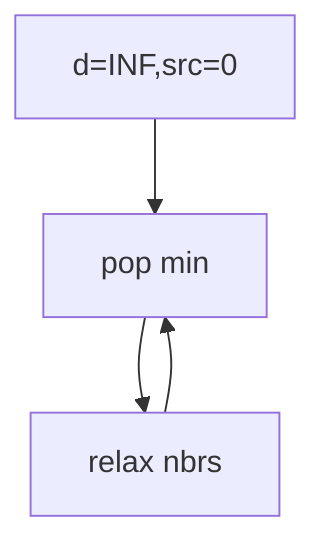

## WHY
Shortest path with weights by BFS is wrong. Dijkstra greedily expands nearest via min-heap O((V+E)log V). Negative edges break it.

## THEORY
Pop min dist, relax neighbors, skip stale.


## VISUALIZATION_CONFIG

```json
{ "component": "NetworkDiagram", "state": "leetcode-dijkstra-pattern" }
```

## CODE
### Level1 init
```java
d[s]=0;pq.add(new int[]{0,s});
```
### Level2
```java
while(!pq.isEmpty()){var c=pq.poll();if(c[0]>d[c[1]])continue;for(var e:g[c[1]])if(d[c[1]]+e.w<d[e.to]){d[e.to]=d[c[1]]+e.w;pq.add(new int[]{d[e.to],e.to});}}
```
### Level3 path reconstruct
### Level4 network delay

## REAL_WORLD
GPS routing. Gotcha: negatives → bellman.
| Op|Time|
|--|--|
|sp|O((V+E)logV)|

## INTERVIEW
**Q1:** greedy ok. **Q2:** heap. **Q3:** non-neg. **Q4:** vs bellman. **Q5:** lazy delete.

## FEYNMAN CHECK
### Like10 > Always step to nearest unvisited city.
**Q1** greedy **Q2** heap **Q3** neg bug **Q4** vs bf **Q5** def

## BUILD
### Dijkstra
**Out:** `7`

## SPACED REVIEW
### Day 1 Recall
**Q1:** Trigger. **Q2:** Cost. **Q3:** 10-line.
### Day 3
**Q4:** vs alt. **Q5:** bug. **Q6:** refactor.
### Day 7
**Q7:** apply. **Q8:** PR slow. **Q9:** degrade.
### Day 14
**Q10:** ★ classic. **Q11:** links. **Q12:** ★ at 10M.
