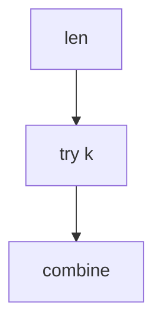

## WHY
Matrix-chain, burst balloons need choosing split points; brute force exponential. Interval DP O(n^3) over lengths.

## THEORY
dp[i][j]=min over k of dp[i][k]+dp[k][j]+cost.


## VISUALIZATION_CONFIG
```json
{
  "steps": [
    {
      "title": "Interval DP Structure",
      "description": "dp[i][j] = optimal for range [i..j]. Fill by increasing length.",
      "code": "// General interval DP template\nfor (let len = 2; len <= n; len++) {         // length\n  for (let i = 0; i + len - 1 < n; i++) {   // start\n    const j = i + len - 1;                   // end\n    for (let k = i; k < j; k++) {            // split point\n      dp[i][j] = optimum(dp[i][j],\n        dp[i][k] + dp[k+1][j] + costOfMerging(i, k, j));\n    }\n  }\n}\n\n// Use cases:\n// - Matrix chain multiplication\n// - Palindrome partitioning\n// - Optimal BST\n// - Burst balloons",
      "highlight": [
        2,
        3,
        4,
        5,
        6,
        7
      ],
      "diagram": {
        "kind": "flow",
        "steps": [
          {
            "label": "Iterate by length"
          },
          {
            "label": "For each start i, end j"
          },
          {
            "label": "Try every split k"
          },
          {
            "label": "Optimal cost"
          },
          {
            "label": "O(n³) typical"
          }
        ]
      }
    },
    {
      "title": "Matrix Chain Multiplication",
      "description": "Find optimal parenthesization to minimize scalar multiplications.",
      "code": "// Matrix Chain Multiplication\nfunction matrixChain(dims) {\n  const n = dims.length - 1;\n  const dp = Array.from({length: n}, () => new Array(n).fill(0));\n  for (let len = 2; len <= n; len++) {\n    for (let i = 0; i + len - 1 < n; i++) {\n      const j = i + len - 1;\n      dp[i][j] = Infinity;\n      for (let k = i; k < j; k++) {\n        const cost = dp[i][k] + dp[k+1][j] + dims[i] * dims[k+1] * dims[j+1];\n        dp[i][j] = Math.min(dp[i][j], cost);\n      }\n    }\n  }\n  return dp[0][n-1];\n}\n// dims = [10, 30, 5, 60] → matrices A(10x30) B(30x5) C(5x60)\n// (AB)C: 10*30*5 + 10*5*60 = 4500\n// A(BC): 30*5*60 + 10*30*60 = 27000\n// Answer: 4500",
      "highlight": [
        5,
        6,
        7,
        9,
        10,
        11,
        17,
        18,
        19
      ],
      "diagram": {
        "kind": "flow",
        "steps": [
          {
            "label": "For each chain length"
          },
          {
            "label": "Try each split point"
          },
          {
            "label": "Cost = left + right + merge"
          },
          {
            "label": "Take minimum"
          },
          {
            "label": "dp[0][n-1] answer"
          }
        ]
      }
    },
    {
      "title": "Burst Balloons",
      "description": "Last-balloon insight — think about which balloon bursts LAST in each range.",
      "code": "// LC 312: Burst Balloons\nfunction maxCoins(nums) {\n  const arr = [1, ...nums, 1]; // pad with 1s\n  const n = arr.length;\n  const dp = Array.from({length: n}, () => new Array(n).fill(0));\n  for (let len = 2; len < n; len++) {\n    for (let i = 0; i + len < n; i++) {\n      const j = i + len;\n      for (let k = i + 1; k < j; k++) {\n        // k is LAST balloon to burst in (i, j)\n        const coins = arr[i] * arr[k] * arr[j] + dp[i][k] + dp[k][j];\n        dp[i][j] = Math.max(dp[i][j], coins);\n      }\n    }\n  }\n  return dp[0][n-1];\n}",
      "highlight": [
        3,
        6,
        7,
        8,
        9,
        10,
        11,
        16
      ],
      "diagram": {
        "kind": "flow",
        "steps": [
          {
            "label": "Pad with 1s"
          },
          {
            "label": "For each range (i,j)"
          },
          {
            "label": "Try each k as LAST"
          },
          {
            "label": "coins = arr[i]*arr[k]*arr[j]"
          },
          {
            "label": "Neighbors known when k bursts"
          }
        ]
      }
    },
    {
      "title": "Palindrome Partitioning II",
      "description": "Min cuts to partition string into palindromic substrings.",
      "code": "// LC 132: Palindrome Partitioning II\nfunction minCut(s) {\n  const n = s.length;\n  const pal = Array.from({length: n}, () => new Array(n).fill(false));\n  const dp = new Array(n).fill(0);\n  for (let i = 0; i < n; i++) {\n    let min = i;\n    for (let j = 0; j <= i; j++) {\n      if (s[i] === s[j] && (i - j < 2 || pal[j+1][i-1])) {\n        pal[j][i] = true;\n        min = j === 0 ? 0 : Math.min(min, dp[j-1] + 1);\n      }\n    }\n    dp[i] = min;\n  }\n  return dp[n-1];\n}",
      "highlight": [
        4,
        6,
        8,
        9,
        10,
        11,
        14
      ],
      "diagram": {
        "kind": "flow",
        "steps": [
          {
            "label": "Build palindrome table"
          },
          {
            "label": "For each end i"
          },
          {
            "label": "Try all starts j"
          },
          {
            "label": "If pal(j,i): update dp[i]"
          },
          {
            "label": "dp[n-1] = min cuts"
          }
        ]
      }
    },
    {
      "title": "Optimal BST",
      "description": "Construct BST from keys with given frequencies — minimize search cost.",
      "code": "// Optimal BST\nfunction optimalBST(freq, n) {\n  const dp = Array.from({length: n+1}, () => new Array(n).fill(0));\n  // sum[i][j] = sum of freq[i..j]\n  for (let i = 0; i < n; i++) dp[i][i] = freq[i];\n  for (let len = 2; len <= n; len++) {\n    for (let i = 0; i + len - 1 < n; i++) {\n      const j = i + len - 1;\n      dp[i][j] = Infinity;\n      let sum = 0;\n      for (let s = i; s <= j; s++) sum += freq[s];\n      for (let r = i; r <= j; r++) {\n        const left = r > i ? dp[i][r-1] : 0;\n        const right = r < j ? dp[r+1][j] : 0;\n        dp[i][j] = Math.min(dp[i][j], left + right + sum);\n      }\n    }\n  }\n  return dp[0][n-1];\n}",
      "highlight": [
        5,
        6,
        7,
        8,
        12,
        13,
        14,
        15
      ],
      "diagram": {
        "kind": "flow",
        "steps": [
          {
            "label": "For each range"
          },
          {
            "label": "Try each root r"
          },
          {
            "label": "Left + right + sum"
          },
          {
            "label": "Min over roots"
          },
          {
            "label": "Optimal BST cost"
          }
        ]
      }
    }
  ]
}
```

## CODE
### Level1 frame
```java
for len; for i; for k;
```
### Level2 matrix chain
### Level3 burst balloons
### Level4 mcm path

## REAL_WORLD
Query planners. Gotcha: length outer loop.
| Op|Time|
|--|--|
|iv|O(n^3)|

## INTERVIEW
**Q1:** split. **Q2:** len loop. **Q3:** combine. **Q4:** vs lcs. **Q5:** balloons.

## FEYNMAN CHECK
### Like10 > Best place to cut to pay least.
**Q1** split **Q2** len **Q3** order **Q4** mcm **Q5** def

## BUILD
### Balloons
**Out:** `167`

## SPACED REVIEW
### Day 1 Recall
**Q1:** Trigger. **Q2:** Cost. **Q3:** 10-line.
### Day 3
**Q4:** vs alt. **Q5:** bug. **Q6:** refactor.
### Day 7
**Q7:** apply. **Q8:** PR slow. **Q9:** degrade.
### Day 14
**Q10:** ★ classic. **Q11:** links. **Q12:** ★ at 10M.
