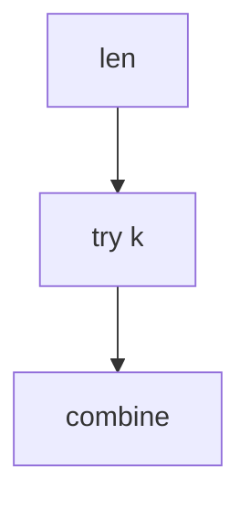

## WHY
Matrix-chain, burst balloons need choosing split points; brute force exponential. Interval DP O(n^3) over lengths.

## THEORY
dp[i][j]=min over k of dp[i][k]+dp[k][j]+cost.


## VISUALIZATION_CONFIG

```json
{ "component": "FlowChart", "state": "leetcode-dp-interval-pattern" }
```

## CODE
### Level1 frame
```java
for len; for i; for k;
```
### Level2 matrix chain
### Level3 burst balloons
### Level4 mcm path

## REAL_WORLD
Query planners. Gotcha: length outer loop.
| Op|Time|
|--|--|
|iv|O(n^3)|

## INTERVIEW
**Q1:** split. **Q2:** len loop. **Q3:** combine. **Q4:** vs lcs. **Q5:** balloons.

## FEYNMAN CHECK
### Like10 > Best place to cut to pay least.
**Q1** split **Q2** len **Q3** order **Q4** mcm **Q5** def

## BUILD
### Balloons
**Out:** `167`

## SPACED REVIEW
### Day 1 Recall
**Q1:** Trigger. **Q2:** Cost. **Q3:** 10-line.
### Day 3
**Q4:** vs alt. **Q5:** bug. **Q6:** refactor.
### Day 7
**Q7:** apply. **Q8:** PR slow. **Q9:** degrade.
### Day 14
**Q10:** ★ classic. **Q11:** links. **Q12:** ★ at 10M.
