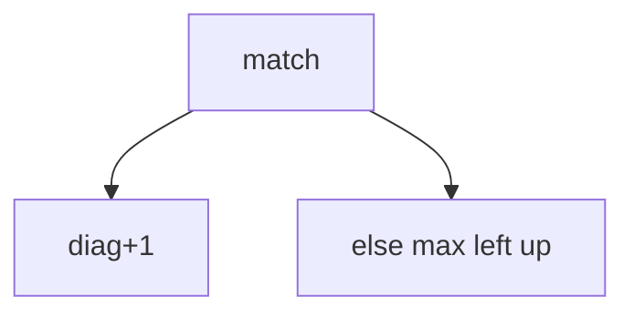

## WHY
LCS/LIS by brute force is exponential. DP aligns sequences O(nm) / O(n log n). Diff, autocomplete depend on it.

## THEORY
2D match diag+1 else max; LIS patience O(n log n).


## VISUALIZATION_CONFIG

```json
{ "component": "FlowChart", "state": "leetcode-dp-subsequence-pattern" }
```

## CODE
### Level1 LCS
```java
d[i][j]=eq?d[i-1][j-1]+1:max(d[i-1][j],d[i][j-1]);
```
### Level2 LIS dp
### Level3 LIS binary O(n log n)
### Level4 edit distance

## REAL_WORLD
git diff LCS. Gotcha: subsequence vs substring.
| Op|Time|
|--|--|
|lcs|O(nm)|

## INTERVIEW
**Q1:** subseq. **Q2:** lis nlogn. **Q3:** match rule. **Q4:** vs substring. **Q5:** diff.

## FEYNMAN CHECK
### Like10 > Longest shared order ignoring gaps.
**Q1** lcs **Q2** lis **Q3** rule **Q4** patience **Q5** def

## BUILD
### LCS
**Out:** `3`

## SPACED REVIEW
### Day 1 Recall
**Q1:** Trigger. **Q2:** Cost. **Q3:** 10-line.
### Day 3
**Q4:** vs alt. **Q5:** bug. **Q6:** refactor.
### Day 7
**Q7:** apply. **Q8:** PR slow. **Q9:** degrade.
### Day 14
**Q10:** ★ classic. **Q11:** links. **Q12:** ★ at 10M.
