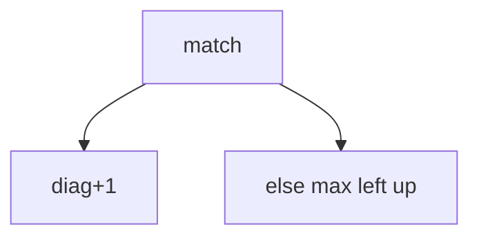

## WHY
LCS/LIS by brute force is exponential. DP aligns sequences O(nm) / O(n log n). Diff, autocomplete depend on it.

## THEORY
2D match diag+1 else max; LIS patience O(n log n).


## VISUALIZATION_CONFIG
```json
{
  "steps": [
    {
      "title": "Longest Common Subsequence",
      "description": "LCS: dp[i][j] = length of LCS of text1[0..i] and text2[0..j]. O(n×m).",
      "code": "// LC 1143: Longest Common Subsequence\nfunction longestCommonSubsequence(text1, text2) {\n  const m = text1.length, n = text2.length;\n  const dp = Array.from({length: m+1}, () => new Array(n+1).fill(0));\n  for (let i = 1; i <= m; i++) {\n    for (let j = 1; j <= n; j++) {\n      if (text1[i-1] === text2[j-1]) {\n        dp[i][j] = dp[i-1][j-1] + 1;\n      } else {\n        dp[i][j] = Math.max(dp[i-1][j], dp[i][j-1]);\n      }\n    }\n  }\n  return dp[m][n];\n}",
      "highlight": [
        7,
        8,
        9,
        10,
        14
      ],
      "diagram": {
        "kind": "boxes",
        "boxes": [
          {
            "id": "m",
            "label": "Match: dp[i-1][j-1] + 1",
            "color": "#43a047"
          },
          {
            "id": "nm",
            "label": "No match: max(up, left)",
            "color": "#e53935"
          }
        ],
        "connections": []
      }
    },
    {
      "title": "Longest Increasing Subsequence",
      "description": "LIS: O(n²) DP or O(n log n) with binary search + patience piles.",
      "code": "// LC 300: Longest Increasing Subsequence\n\n// O(n²) DP\nfunction lengthOfLIS(nums) {\n  const dp = new Array(nums.length).fill(1);\n  for (let i = 1; i < nums.length; i++) {\n    for (let j = 0; j < i; j++) {\n      if (nums[j] < nums[i]) dp[i] = Math.max(dp[i], dp[j] + 1);\n    }\n  }\n  return Math.max(...dp);\n}\n\n// O(n log n) with binary search\nfunction lengthOfLISFast(nums) {\n  const tails = [];\n  for (const n of nums) {\n    let lo = 0, hi = tails.length;\n    while (lo < hi) {\n      const mid = (lo + hi) >> 1;\n      if (tails[mid] < n) lo = mid + 1;\n      else hi = mid;\n    }\n    tails[lo] = n;\n  }\n  return tails.length;\n}",
      "highlight": [
        5,
        6,
        7,
        8,
        15,
        16,
        17,
        18,
        19,
        20,
        21,
        22,
        23
      ],
      "diagram": {
        "kind": "flow",
        "steps": [
          "O(n²): compare each pair",
          "OR",
          "Binary search insertion",
          "tails[] = smallest tail per length",
          "Length = LIS"
        ]
      }
    },
    {
      "title": "Edit Distance",
      "description": "Min operations (insert/delete/replace) to convert word1 to word2.",
      "code": "// LC 72: Edit Distance\nfunction minDistance(word1, word2) {\n  const m = word1.length, n = word2.length;\n  const dp = Array.from({length: m+1}, () => new Array(n+1).fill(0));\n  for (let i = 0; i <= m; i++) dp[i][0] = i; // delete all\n  for (let j = 0; j <= n; j++) dp[0][j] = j; // insert all\n  for (let i = 1; i <= m; i++) {\n    for (let j = 1; j <= n; j++) {\n      if (word1[i-1] === word2[j-1]) {\n        dp[i][j] = dp[i-1][j-1]; // no op\n      } else {\n        dp[i][j] = 1 + Math.min(\n          dp[i-1][j],   // delete\n          dp[i][j-1],   // insert\n          dp[i-1][j-1]  // replace\n        );\n      }\n    }\n  }\n  return dp[m][n];\n}",
      "highlight": [
        5,
        6,
        9,
        10,
        12,
        13,
        14,
        15,
        20
      ],
      "diagram": {
        "kind": "flow",
        "steps": [
          "Match: no op",
          "Delete: dp[i-1][j] + 1",
          "Insert: dp[i][j-1] + 1",
          "Replace: dp[i-1][j-1] + 1",
          "Take min"
        ]
      }
    },
    {
      "title": "Distinct Subsequences",
      "description": "Count how many times pattern appears as subsequence of text.",
      "code": "// LC 115: Distinct Subsequences\nfunction numDistinct(s, t) {\n  const m = s.length, n = t.length;\n  const dp = Array.from({length: m+1}, () => new Array(n+1).fill(0));\n  for (let i = 0; i <= m; i++) dp[i][0] = 1; // empty pattern\n  for (let i = 1; i <= m; i++) {\n    for (let j = 1; j <= n; j++) {\n      dp[i][j] = dp[i-1][j]; // skip s[i-1]\n      if (s[i-1] === t[j-1]) dp[i][j] += dp[i-1][j-1]; // match\n    }\n  }\n  return dp[m][n];\n}",
      "highlight": [
        5,
        8,
        9,
        12
      ],
      "diagram": {
        "kind": "flow",
        "steps": [
          "dp[i][0] = 1 (empty t)",
          "Skip s[i-1]: dp[i-1][j]",
          "Match: + dp[i-1][j-1]",
          "Sum ways",
          "Return dp[m][n]"
        ]
      }
    },
    {
      "title": "Wildcard/Regex Matching",
      "description": "DP for regex-style pattern matching with * and ? wildcards.",
      "code": "// LC 44: Wildcard Matching\nfunction isMatch(s, p) {\n  const m = s.length, n = p.length;\n  const dp = Array.from({length: m+1}, () => new Array(n+1).fill(false));\n  dp[0][0] = true;\n  for (let j = 1; j <= n; j++) {\n    if (p[j-1] === '*') dp[0][j] = dp[0][j-1];\n  }\n  for (let i = 1; i <= m; i++) {\n    for (let j = 1; j <= n; j++) {\n      if (p[j-1] === '*') {\n        // *: match empty (dp[i][j-1]) or one more (dp[i-1][j])\n        dp[i][j] = dp[i][j-1] || dp[i-1][j];\n      } else if (p[j-1] === '?' || p[j-1] === s[i-1]) {\n        dp[i][j] = dp[i-1][j-1];\n      }\n    }\n  }\n  return dp[m][n];\n}",
      "highlight": [
        5,
        6,
        7,
        10,
        11,
        12,
        13,
        19
      ],
      "diagram": {
        "kind": "flow",
        "steps": [
          "* : match empty or extend",
          "?: match one char",
          "Exact match: consume both",
          "dp[m][n] final",
          "True/False"
        ]
      }
    }
  ]
}
```

## CODE
### Level1 LCS
```java
d[i][j]=eq?d[i-1][j-1]+1:max(d[i-1][j],d[i][j-1]);
```
### Level2 LIS dp
### Level3 LIS binary O(n log n)
### Level4 edit distance

## REAL_WORLD
git diff LCS. Gotcha: subsequence vs substring.
| Op|Time|
|--|--|
|lcs|O(nm)|

## INTERVIEW
**Q1:** subseq. **Q2:** lis nlogn. **Q3:** match rule. **Q4:** vs substring. **Q5:** diff.

## FEYNMAN CHECK
### Like10 > Longest shared order ignoring gaps.
**Q1** lcs **Q2** lis **Q3** rule **Q4** patience **Q5** def

## BUILD
### LCS
**Out:** `3`

## SPACED REVIEW
### Day 1 Recall
**Q1:** Trigger. **Q2:** Cost. **Q3:** 10-line.
### Day 3
**Q4:** vs alt. **Q5:** bug. **Q6:** refactor.
### Day 7
**Q7:** apply. **Q8:** PR slow. **Q9:** degrade.
### Day 14
**Q10:** ★ classic. **Q11:** links. **Q12:** ★ at 10M.
