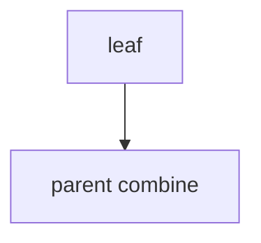

## WHY
Tree max-sum/diameter need child answers first. Post-order DP O(n). Robber III, diameter.

## THEORY
Return tuple per node; parent combines.


## VISUALIZATION_CONFIG
```json
{
  "steps": [
    {
      "title": "Tree DP: Diameter",
      "description": "DP on trees uses post-order: children's answers feed into parent's answer.",
      "code": "// LC 543: Diameter of Binary Tree\nfunction diameterOfBinaryTree(root) {\n  let diameter = 0;\n\n  const depth = (node) => {\n    if (!node) return 0;\n    const left = depth(node.left);\n    const right = depth(node.right);\n    // At this node, longest path THROUGH here\n    diameter = Math.max(diameter, left + right);\n    // Return: depth of subtree\n    return 1 + Math.max(left, right);\n  };\n\n  depth(root);\n  return diameter;\n}",
      "highlight": [
        6,
        7,
        8,
        10,
        12,
        15
      ],
      "diagram": {
        "kind": "flow",
        "steps": [
          {
            "label": "Post-order DFS"
          },
          {
            "label": "left = depth(left)"
          },
          {
            "label": "right = depth(right)"
          },
          {
            "label": "Path through node: L+R"
          },
          {
            "label": "Track global max"
          }
        ]
      }
    },
    {
      "title": "House Robber III (Tree)",
      "description": "Cannot rob adjacent nodes — return (rob, notRob) tuple for each subtree.",
      "code": "// LC 337: House Robber III\nfunction rob(root) {\n  const dfs = (node) => {\n    if (!node) return [0, 0]; // [rob, notRob]\n    const [lRob, lNot] = dfs(node.left);\n    const [rRob, rNot] = dfs(node.right);\n    return [\n      node.val + lNot + rNot,           // rob this: children can't be robbed\n      Math.max(lRob, lNot) + Math.max(rRob, rNot) // don't rob: max of each child\n    ];\n  };\n  const [rob, notRob] = dfs(root);\n  return Math.max(rob, notRob);\n}",
      "highlight": [
        3,
        4,
        5,
        6,
        8,
        9,
        10,
        12,
        13
      ],
      "diagram": {
        "kind": "flow",
        "steps": [
          {
            "label": "Post-order return (rob, notRob)"
          },
          {
            "label": "Rob: node.val + child.notRob"
          },
          {
            "label": "notRob: max of child options"
          },
          {
            "label": "Max at root"
          },
          {
            "label": "O(n) time"
          }
        ]
      }
    },
    {
      "title": "Max Path Sum",
      "description": "Any node to any node path — track max at each node contributing to path.",
      "code": "// LC 124: Binary Tree Maximum Path Sum\nfunction maxPathSum(root) {\n  let max = -Infinity;\n\n  const dfs = (node) => {\n    if (!node) return 0;\n    // Ignore negative subtrees\n    const left = Math.max(0, dfs(node.left));\n    const right = Math.max(0, dfs(node.right));\n    // Path THROUGH this node\n    max = Math.max(max, node.val + left + right);\n    // Return: single-side path (parent can only use one side)\n    return node.val + Math.max(left, right);\n  };\n\n  dfs(root);\n  return max;\n}",
      "highlight": [
        5,
        6,
        7,
        8,
        9,
        10,
        11,
        12,
        13
      ],
      "diagram": {
        "kind": "flow",
        "steps": [
          {
            "label": "Post-order DFS"
          },
          {
            "label": "Ignore negative subtrees"
          },
          {
            "label": "Path through: v+L+R"
          },
          {
            "label": "Return single side"
          },
          {
            "label": "Max updates globally"
          }
        ]
      }
    },
    {
      "title": "Distribute Coins in Tree",
      "description": "Every node needs 1 coin — count moves needed. Bottom-up excess tracking.",
      "code": "// LC 979: Distribute Coins in Binary Tree\nfunction distributeCoins(root) {\n  let moves = 0;\n\n  const dfs = (node) => {\n    if (!node) return 0;\n    const left = dfs(node.left);\n    const right = dfs(node.right);\n    moves += Math.abs(left) + Math.abs(right);\n    // Return excess/deficit\n    return node.val + left + right - 1;\n  };\n\n  dfs(root);\n  return moves;\n}\n// Insight: |excess of subtree| = moves through edge to parent",
      "highlight": [
        5,
        6,
        7,
        8,
        9,
        10,
        11,
        15,
        16
      ],
      "diagram": {
        "kind": "flow",
        "steps": [
          {
            "label": "Post-order excess"
          },
          {
            "label": "Excess = val + subtrees - 1"
          },
          {
            "label": "moves += |excess|"
          },
          {
            "label": "Flow through edges"
          },
          {
            "label": "Total moves"
          }
        ]
      }
    },
    {
      "title": "Longest ZigZag Path",
      "description": "Alternate left-right children — DP returns two states per node.",
      "code": "// LC 1372: Longest ZigZag Path in Binary Tree\nfunction longestZigZag(root) {\n  let max = 0;\n\n  const dfs = (node) => {\n    if (!node) return [-1, -1]; // [leftPath, rightPath]\n    const [lL, lR] = dfs(node.left);\n    const [rL, rR] = dfs(node.right);\n    // Going left from this node = 1 + right path of left child\n    const goLeft = lR + 1;\n    const goRight = rL + 1;\n    max = Math.max(max, goLeft, goRight);\n    return [goLeft, goRight];\n  };\n\n  dfs(root);\n  return max;\n}",
      "highlight": [
        5,
        6,
        7,
        8,
        9,
        10,
        11,
        12,
        13
      ],
      "diagram": {
        "kind": "flow",
        "steps": [
          {
            "label": "Return [leftPath, rightPath]"
          },
          {
            "label": "Left path = 1 + child.rightPath"
          },
          {
            "label": "Right path = 1 + child.leftPath"
          },
          {
            "label": "ZigZag alternation"
          },
          {
            "label": "Track max"
          }
        ]
      }
    }
  ]
}
```

## CODE
### Level1 height
### Level2 diameter
```java
int d=l+r; best=max(best,d);
```
### Level3 robber III tuple
### Level4 reroot

## REAL_WORLD
Org cost. Gotcha: recompute → memo.
| Op|Time|
|--|--|
|tree|O(n)|

## INTERVIEW
**Q1:** post-order. **Q2:** tuple. **Q3:** diameter. **Q4:** vs 1d. **Q5:** reroot.

## FEYNMAN CHECK
### Like10 > Ask kids first, then decide.
**Q1** post **Q2** tuple **Q3** dia **Q4** rob **Q5** def

## BUILD
### Diameter
**Out:** `4`

## SPACED REVIEW
### Day 1 Recall
**Q1:** Trigger. **Q2:** Cost. **Q3:** 10-line.
### Day 3
**Q4:** vs alt. **Q5:** bug. **Q6:** refactor.
### Day 7
**Q7:** apply. **Q8:** PR slow. **Q9:** degrade.
### Day 14
**Q10:** ★ classic. **Q11:** links. **Q12:** ★ at 10M.
