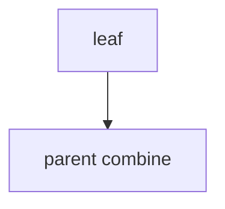

## WHY
Tree max-sum/diameter need child answers first. Post-order DP O(n). Robber III, diameter.

## THEORY
Return tuple per node; parent combines.


## VISUALIZATION_CONFIG

```json
{ "component": "TreeVisualization", "state": "leetcode-dp-tree-pattern" }
```

## CODE
### Level1 height
### Level2 diameter
```java
int d=l+r; best=max(best,d);
```
### Level3 robber III tuple
### Level4 reroot

## REAL_WORLD
Org cost. Gotcha: recompute → memo.
| Op|Time|
|--|--|
|tree|O(n)|

## INTERVIEW
**Q1:** post-order. **Q2:** tuple. **Q3:** diameter. **Q4:** vs 1d. **Q5:** reroot.

## FEYNMAN CHECK
### Like10 > Ask kids first, then decide.
**Q1** post **Q2** tuple **Q3** dia **Q4** rob **Q5** def

## BUILD
### Diameter
**Out:** `4`

## SPACED REVIEW
### Day 1 Recall
**Q1:** Trigger. **Q2:** Cost. **Q3:** 10-line.
### Day 3
**Q4:** vs alt. **Q5:** bug. **Q6:** refactor.
### Day 7
**Q7:** apply. **Q8:** PR slow. **Q9:** degrade.
### Day 14
**Q10:** ★ classic. **Q11:** links. **Q12:** ★ at 10M.
