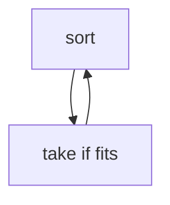

## WHY
Pick local best when it equals global best — intervals, jump game, Huffman. Fails on {1,3,4} coins → DP.

## THEORY
Sort by key, take if compatible.


## VISUALIZATION_CONFIG

```json
{ "component": "FlowChart", "state": "leetcode-greedy-pattern" }
```

## CODE
### Level1 intervals
```java
sort end; if start>=e take;
```
### Level2 jump
```java
for reach=max(reach,i+a[i]);
```
### Level3 gas station
### Level4 task scheduler

## REAL_WORLD
CDN bandwidth. Gotcha: greedy where DP needed.
| Op|Time|
|--|--|
|greedy|O(n log n)|

## INTERVIEW
**Q1:** choice prop. **Q2:** sort. **Q3:** exchange. **Q4:** vs dp. **Q5:** huffman.

## FEYNMAN CHECK
### Like10 > Grab biggest now, no regrets.
**Q1** prop **Q2** sort **Q3** fail **Q4** vs dp **Q5** def

## BUILD
### Activity Select
**Out:** `ok`

## SPACED REVIEW
### Day 1 Recall
**Q1:** Trigger. **Q2:** Cost. **Q3:** 10-line.
### Day 3
**Q4:** vs alt. **Q5:** bug. **Q6:** refactor.
### Day 7
**Q7:** apply. **Q8:** PR slow. **Q9:** degrade.
### Day 14
**Q10:** ★ classic. **Q11:** links. **Q12:** ★ at 10M.
