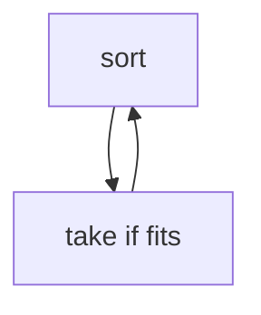

## WHY
Pick local best when it equals global best — intervals, jump game, Huffman. Fails on {1,3,4} coins → DP.

## THEORY
Sort by key, take if compatible.


## VISUALIZATION_CONFIG
```json
{
  "steps": [
    {
      "title": "Greedy Strategy",
      "description": "Make locally optimal choice at each step, hoping for global optimum. Not always correct — prove it.",
      "code": "// Greedy works when:\n// 1. Greedy choice property: local optimum → global\n// 2. Optimal substructure\n\n// Classic: Coin Change with US denominations\n// Coins: [1, 5, 10, 25]\n// Amount: 30\n// Greedy: 25 + 5 = 2 coins ✓ optimal\n\n// Counter-example: Coins [1, 3, 4], Amount 6\n// Greedy: 4 + 1 + 1 = 3 coins ✗\n// Optimal: 3 + 3 = 2 coins (needs DP)\n\n// Rule: prove greedy works before using it!",
      "highlight": [
        2,
        3,
        6,
        7,
        8,
        10,
        11,
        12
      ],
      "diagram": {
        "kind": "flow",
        "steps": [
          {
            "label": "At each step:"
          },
          {
            "label": "Choose local best"
          },
          {
            "label": "Hope for global best"
          },
          {
            "label": "Verify with proof"
          },
          {
            "label": "Or use DP if not"
          }
        ]
      }
    },
    {
      "title": "Jump Game",
      "description": "Greedy — track furthest reachable index; if current index unreachable, fail.",
      "code": "// LC 55: Jump Game\nfunction canJump(nums) {\n  let maxReach = 0;\n  for (let i = 0; i < nums.length; i++) {\n    if (i > maxReach) return false; // stuck\n    maxReach = Math.max(maxReach, i + nums[i]);\n    if (maxReach >= nums.length - 1) return true;\n  }\n  return true;\n}\n\n// LC 45: Jump Game II (min jumps)\nfunction jump(nums) {\n  let jumps = 0, end = 0, farthest = 0;\n  for (let i = 0; i < nums.length - 1; i++) {\n    farthest = Math.max(farthest, i + nums[i]);\n    if (i === end) {\n      jumps++;\n      end = farthest;\n    }\n  }\n  return jumps;\n}",
      "highlight": [
        3,
        4,
        5,
        6,
        7,
        14,
        15,
        16,
        17,
        18,
        19
      ],
      "diagram": {
        "kind": "flow",
        "steps": [
          {
            "label": "Track maxReach"
          },
          {
            "label": "i > maxReach → false"
          },
          {
            "label": "Update on each step"
          },
          {
            "label": "Reached end? true"
          },
          {
            "label": "Greedy correctness proven"
          }
        ]
      }
    },
    {
      "title": "Gas Station",
      "description": "One-pass greedy: if total gas ≥ total cost, answer exists; find starting station.",
      "code": "// LC 134: Gas Station\nfunction canCompleteCircuit(gas, cost) {\n  let total = 0, tank = 0, start = 0;\n  for (let i = 0; i < gas.length; i++) {\n    const diff = gas[i] - cost[i];\n    total += diff;\n    tank += diff;\n    if (tank < 0) {\n      // Cannot reach next station from current start\n      start = i + 1;\n      tank = 0;\n    }\n  }\n  return total < 0 ? -1 : start;\n}\n// Key insight: if we fail at i from start, no station in [start..i] works\n// So next candidate is i+1",
      "highlight": [
        3,
        4,
        5,
        6,
        7,
        8,
        9,
        10,
        11,
        14,
        16,
        17
      ],
      "diagram": {
        "kind": "flow",
        "steps": [
          {
            "label": "Track running tank"
          },
          {
            "label": "tank < 0 → reset start"
          },
          {
            "label": "total ≥ 0 → answer exists"
          },
          {
            "label": "O(n) single pass"
          }
        ]
      }
    },
    {
      "title": "Task Scheduler",
      "description": "Greedy — schedule most frequent task first, use cooldown periods.",
      "code": "// LC 621: Task Scheduler\nfunction leastInterval(tasks, n) {\n  const freq = new Array(26).fill(0);\n  for (const t of tasks) freq[t.charCodeAt(0) - 65]++;\n  freq.sort((a, b) => b - a);\n  const maxFreq = freq[0];\n  // Number of tasks with maxFreq\n  let sameMax = 0;\n  for (const f of freq) if (f === maxFreq) sameMax++;\n  // Formula: (maxFreq - 1) * (n + 1) + sameMax\n  return Math.max(tasks.length, (maxFreq - 1) * (n + 1) + sameMax);\n}\n// Insight: shape = \"AAA\" with n gaps between → total slots",
      "highlight": [
        3,
        4,
        5,
        6,
        8,
        9,
        10,
        11,
        13
      ],
      "diagram": {
        "kind": "flow",
        "steps": [
          {
            "label": "Count frequencies"
          },
          {
            "label": "Max freq determines shape"
          },
          {
            "label": "Fill gaps optimally"
          },
          {
            "label": "Formula: (F-1)*(n+1) + same"
          },
          {
            "label": "Or tasks.length"
          }
        ]
      }
    },
    {
      "title": "Partition Labels",
      "description": "Track last occurrence of each char — extend partition to cover all occurrences.",
      "code": "// LC 763: Partition Labels\nfunction partitionLabels(s) {\n  const lastIdx = new Map();\n  for (let i = 0; i < s.length; i++) lastIdx.set(s[i], i);\n\n  const result = [];\n  let start = 0, end = 0;\n  for (let i = 0; i < s.length; i++) {\n    end = Math.max(end, lastIdx.get(s[i]));\n    if (i === end) {\n      result.push(end - start + 1);\n      start = i + 1;\n    }\n  }\n  return result;\n}\n// Extend partition end whenever a char's last idx > current end",
      "highlight": [
        3,
        4,
        6,
        7,
        8,
        9,
        10,
        11,
        12,
        13
      ],
      "diagram": {
        "kind": "flow",
        "steps": [
          {
            "label": "Map: char → last idx"
          },
          {
            "label": "Extend end to cover chars"
          },
          {
            "label": "i === end → cut here"
          },
          {
            "label": "Record partition size"
          },
          {
            "label": "Reset start"
          }
        ]
      }
    }
  ]
}
```

## CODE
### Level1 intervals
```java
sort end; if start>=e take;
```
### Level2 jump
```java
for reach=max(reach,i+a[i]);
```
### Level3 gas station
### Level4 task scheduler

## REAL_WORLD
CDN bandwidth. Gotcha: greedy where DP needed.
| Op|Time|
|--|--|
|greedy|O(n log n)|

## INTERVIEW
**Q1:** choice prop. **Q2:** sort. **Q3:** exchange. **Q4:** vs dp. **Q5:** huffman.

## FEYNMAN CHECK
### Like10 > Grab biggest now, no regrets.
**Q1** prop **Q2** sort **Q3** fail **Q4** vs dp **Q5** def

## BUILD
### Activity Select
**Out:** `ok`

## SPACED REVIEW
### Day 1 Recall
**Q1:** Trigger. **Q2:** Cost. **Q3:** 10-line.
### Day 3
**Q4:** vs alt. **Q5:** bug. **Q6:** refactor.
### Day 7
**Q7:** apply. **Q8:** PR slow. **Q9:** degrade.
### Day 14
**Q10:** ★ classic. **Q11:** links. **Q12:** ★ at 10M.
