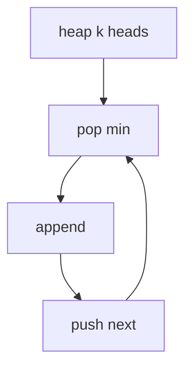

## WHY
Merging k sorted lists by concatenate+sort is O(N log N). A heap of k heads merges in O(N log k). Forgetting to push next breaks order.

## THEORY
Min-heap of one node per list; pop smallest, push its next.


## VISUALIZATION_CONFIG
```json
{
  "steps": [
    {
      "title": "Merge K Sorted Arrays",
      "description": "Same pattern as merge k lists — min-heap of front elements.",
      "code": "// Merge K sorted arrays into one\nfunction mergeKArrays(arrays) {\n  const heap = new MinHeap((a, b) => a[0] - b[0]);\n  for (let i = 0; i < arrays.length; i++) {\n    if (arrays[i].length) {\n      heap.push([arrays[i][0], i, 0]); // [value, arrayIdx, elemIdx]\n    }\n  }\n  const result = [];\n  while (!heap.isEmpty()) {\n    const [val, aIdx, eIdx] = heap.pop();\n    result.push(val);\n    if (eIdx + 1 < arrays[aIdx].length) {\n      heap.push([arrays[aIdx][eIdx + 1], aIdx, eIdx + 1]);\n    }\n  }\n  return result;\n}",
      "highlight": [
        3,
        4,
        5,
        6,
        10,
        11,
        12,
        13,
        14
      ],
      "diagram": {
        "kind": "flow",
        "steps": [
          {
            "label": "Heap [val, aIdx, eIdx]"
          },
          {
            "label": "Pop smallest"
          },
          {
            "label": "Append to result"
          },
          {
            "label": "Push next of same array"
          },
          {
            "label": "O(N log k)"
          }
        ]
      }
    },
    {
      "title": "Kth Smallest in Sorted Matrix",
      "description": "Rows and columns sorted — k-way merge using row heads.",
      "code": "// LC 378: Kth Smallest Element in Sorted Matrix\nfunction kthSmallest(matrix, k) {\n  const n = matrix.length;\n  const heap = new MinHeap((a, b) => a[0] - b[0]);\n  for (let i = 0; i < Math.min(n, k); i++) {\n    heap.push([matrix[i][0], i, 0]);\n  }\n  for (let i = 0; i < k - 1; i++) {\n    const [_, r, c] = heap.pop();\n    if (c + 1 < n) heap.push([matrix[r][c + 1], r, c + 1]);\n  }\n  return heap.peek()[0];\n}\n// Alt: binary search on values - O(n log(max-min))",
      "highlight": [
        4,
        5,
        6,
        8,
        9,
        10,
        12,
        13,
        14
      ],
      "diagram": {
        "kind": "flow",
        "steps": [
          {
            "label": "Push row heads"
          },
          {
            "label": "Pop k-1 times"
          },
          {
            "label": "Push next col each pop"
          },
          {
            "label": "Top is kth smallest"
          },
          {
            "label": "O(k log n)"
          }
        ]
      }
    },
    {
      "title": "Smallest Range Covering K Lists",
      "description": "Track min and max of one element from each list — shrink range.",
      "code": "// LC 632: Smallest Range Covering K Lists\nfunction smallestRange(nums) {\n  const heap = new MinHeap((a, b) => a[0] - b[0]);\n  let curMax = -Infinity;\n  for (let i = 0; i < nums.length; i++) {\n    heap.push([nums[i][0], i, 0]);\n    curMax = Math.max(curMax, nums[i][0]);\n  }\n  let bestRange = [-1e9, 1e9];\n  while (heap.size() === nums.length) {\n    const [min, i, j] = heap.pop();\n    if (curMax - min < bestRange[1] - bestRange[0]) {\n      bestRange = [min, curMax];\n    }\n    if (j + 1 < nums[i].length) {\n      const next = nums[i][j + 1];\n      curMax = Math.max(curMax, next);\n      heap.push([next, i, j + 1]);\n    }\n  }\n  return bestRange;\n}",
      "highlight": [
        3,
        4,
        5,
        6,
        7,
        10,
        11,
        12,
        13,
        14,
        15,
        16,
        17,
        18
      ],
      "diagram": {
        "kind": "flow",
        "steps": [
          {
            "label": "One element per list in heap"
          },
          {
            "label": "Track min (heap top) + max"
          },
          {
            "label": "Update best range"
          },
          {
            "label": "Advance min's list"
          },
          {
            "label": "Repeat while all lists represented"
          }
        ]
      }
    },
    {
      "title": "Find K Pairs with Smallest Sums",
      "description": "K-way merge over pairs (nums1[i], nums2[j]).",
      "code": "// LC 373: Find K Pairs with Smallest Sums\nfunction kSmallestPairs(nums1, nums2, k) {\n  const heap = new MinHeap((a, b) => a[0] - b[0]);\n  for (let i = 0; i < Math.min(k, nums1.length); i++) {\n    heap.push([nums1[i] + nums2[0], i, 0]);\n  }\n  const result = [];\n  while (heap.size() && result.length < k) {\n    const [sum, i, j] = heap.pop();\n    result.push([nums1[i], nums2[j]]);\n    if (j + 1 < nums2.length) {\n      heap.push([nums1[i] + nums2[j + 1], i, j + 1]);\n    }\n  }\n  return result;\n}",
      "highlight": [
        3,
        4,
        5,
        7,
        8,
        9,
        10,
        11,
        12,
        13
      ],
      "diagram": {
        "kind": "flow",
        "steps": [
          {
            "label": "Push all (i, 0) pairs"
          },
          {
            "label": "Pop smallest sum"
          },
          {
            "label": "Push (i, j+1)"
          },
          {
            "label": "K pairs collected"
          },
          {
            "label": "Similar to k-way merge"
          }
        ]
      }
    },
    {
      "title": "When to Use K-Way Merge",
      "description": "Multiple sorted sources, find kth element or merge — heap of front elements is idiomatic.",
      "code": "// Common patterns:\n// - Merge k sorted lists/arrays\n// - Kth smallest in matrix\n// - Smallest range across k lists\n// - K smallest pairs\n// - Median from k data streams\n\n// Key insight:\n// Sorted sources → heap of smallest unmerged element from each\n// Pop → advance that source\n// Total elements N, k sources → O(N log k)\n\n// vs. concatenate + sort: O(N log N)\n// K-way merge is faster when k << N",
      "highlight": [
        2,
        3,
        4,
        5,
        6,
        9,
        10,
        11,
        13
      ],
      "diagram": {
        "kind": "boxes",
        "items": [
          {
            "label": "Heap of front elements",
            "color": "#1e88e5"
          },
          {
            "label": "Advance min source",
            "color": "#43a047"
          },
          {
            "label": "O(N log k)",
            "color": "#fb8c00"
          }
        ]
      }
    }
  ]
}
```

## CODE
### Level1
```java
for(var l:lists)if(l!=null)pq.add(l);
```
### Level2 merge
```java
while(!pq.isEmpty()){var n=pq.poll();tail.next=n;tail=n;if(n.next!=null)pq.add(n.next);}
```
### Level3 smallest range
### Level4 kth smallest in matrix

## REAL_WORLD
Log aggregation merges sorted streams. Gotcha: comparator on value.
| Op|Time|
|--|--|
|merge|O(N log k)|

## INTERVIEW
**Q1:** heap k. **Q2:** push next. **Q3:** O(N log k). **Q4:** vs sort. **Q5:** matrix kth.

## FEYNMAN CHECK
### Like10 > k sorted decks, take smallest top each time.
**Q1** logk **Q2** push next **Q3** comp bug **Q4** vs sort **Q5** def

## BUILD
### Merge k
**Out:** `1 1 2 3 4 4 5 6`

## SPACED REVIEW
### Day 1 Recall
**Q1:** Trigger. **Q2:** Cost. **Q3:** 10-line.
### Day 3
**Q4:** vs alt. **Q5:** bug. **Q6:** refactor.
### Day 7
**Q7:** apply. **Q8:** PR slow. **Q9:** degrade.
### Day 14
**Q10:** ★ classic. **Q11:** links. **Q12:** ★ at 10M.
