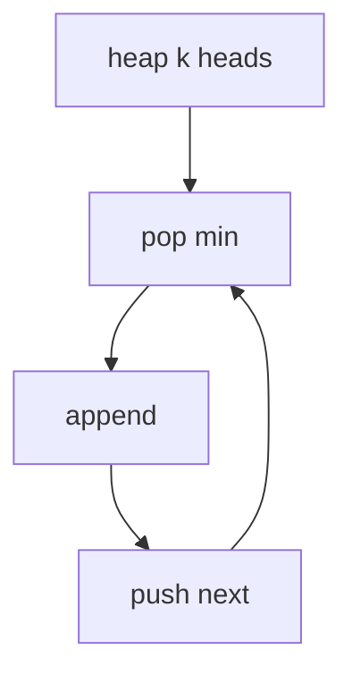

## WHY
Merging k sorted lists by concatenate+sort is O(N log N). A heap of k heads merges in O(N log k). Forgetting to push next breaks order.

## THEORY
Min-heap of one node per list; pop smallest, push its next.


## VISUALIZATION_CONFIG

```json
{ "component": "TreeVisualization", "state": "leetcode-k-way-merge-pattern" }
```

## CODE
### Level1
```java
for(var l:lists)if(l!=null)pq.add(l);
```
### Level2 merge
```java
while(!pq.isEmpty()){var n=pq.poll();tail.next=n;tail=n;if(n.next!=null)pq.add(n.next);}
```
### Level3 smallest range
### Level4 kth smallest in matrix

## REAL_WORLD
Log aggregation merges sorted streams. Gotcha: comparator on value.
| Op|Time|
|--|--|
|merge|O(N log k)|

## INTERVIEW
**Q1:** heap k. **Q2:** push next. **Q3:** O(N log k). **Q4:** vs sort. **Q5:** matrix kth.

## FEYNMAN CHECK
### Like10 > k sorted decks, take smallest top each time.
**Q1** logk **Q2** push next **Q3** comp bug **Q4** vs sort **Q5** def

## BUILD
### Merge k
**Out:** `1 1 2 3 4 4 5 6`

## SPACED REVIEW
### Day 1 Recall
**Q1:** Trigger. **Q2:** Cost. **Q3:** 10-line.
### Day 3
**Q4:** vs alt. **Q5:** bug. **Q6:** refactor.
### Day 7
**Q7:** apply. **Q8:** PR slow. **Q9:** degrade.
### Day 14
**Q10:** ★ classic. **Q11:** links. **Q12:** ★ at 10M.
