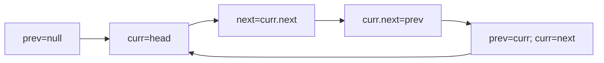

## WHY

Reversing a linked list with extra arrays costs O(n) memory and breaks streaming constraints. In-place reversal rewires pointers using three references — prev, curr, next — for O(1) space. Before this, devs copied to arrays then rebuilt, doubling memory and risking node-identity bugs in caches/LRU. The failure mode: reversing a 100M-node list by copying blows the heap; getting the next pointer save wrong loses the tail forever. Senior engineers reverse sublists in one pass for problems like reverse-k-group and palindrome-list.

## THEORY

Walk the list, flip each next pointer backward, advance all three pointers.



1. Save next. 2. Point curr back to prev. 3. Slide window. New head = prev.

| Variant | Space | Note |
|---------|-------|------|
| Array copy | O(n) | breaks identity |
| In-place | O(1) | rewire pointers |

Misconception: forgetting to save next loses rest of list.

## VISUALIZATION_CONFIG

```json
{ "component": "FlowChart", "state": "leetcode-ll-reversal" }
```

## CODE

### Level 1 — Beginner: Reverse list
```java
Node p=null;while(h!=null){Node n=h.next;h.next=p;p=h;h=n;}return p;
```

### Level 2 — Intermediate: Reverse first k
```java
Node p=null,c=head;for(int i=0;i<k;i++){Node n=c.next;c.next=p;p=c;c=n;}head.next=c;return p;
```

### Level 3 — Advanced: Reverse between m,n
```java
// dummy, walk to m-1, reverse n-m nodes, reconnect
```

### Level 4 — Expert: Reverse k-group
```java
Node rev(Node h,int k){Node c=h;int cnt=0;while(c!=null&&cnt<k){c=c.next;cnt++;}if(cnt<k)return h;Node p=rev(c,k);while(cnt-->0){Node n=h.next;h.next=p;p=h;h=n;}return p;}
```

## REAL_WORLD

LRU caches reverse/move nodes in O(1) by pointer rewiring. Gotcha:
```java
// ❌ c.next=p before saving next → list lost
// ✅ Node n=c.next; c.next=p;
```

| Op | Time | Space |
|----|------|-------|
| Reverse | O(n) | O(1) |

## INTERVIEW
**Q1:** Three pointers? A: prev/curr/next slide flipping links.
**Q2:** Why save next? A: Else lose rest of list.
**Q3:** k-group? A: Recurse, reverse k, link.
**Q4:** vs array? A: O(1) space, keeps identity.
**Q5:** Palindrome list? A: Reverse half, compare.

## FEYNMAN CHECK
### Explain Like I'm 10
> Flip each arrow to point backward as you walk; keep a finger on the next clue so you don't lose the trail.
### 5 Q
**Q1:** core. > pointer rewire O(1). **Q2:** model. > slide window. **Q3:** bug. > lost next. **Q4:** k-group. > recurse. **Q5:** def. > in-place pointer flip.

## BUILD
### 🏗️ Reverse + Palindrome
#### Step 2 **Core** `flip pointers`
#### Step 5 **Tests** `1-2-2-1=>pal`
**Expected Output:** `true`

## SPACED REVIEW
### Day 1 **Q1** 3 ptrs **Q2** save next **Q3** 10-line
### Day 3 **Q4** vs array **Q5** lost bug **Q6** k
### Day 7 **Q7** between m,n **Q8** PR copies **Q9** degrade
### Day 14 **Q10** ★ k-group **Q11** link fast-slow **Q12** ★ 100M list

