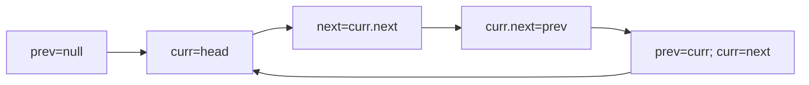

## WHY

Reversing a linked list with extra arrays costs O(n) memory and breaks streaming constraints. In-place reversal rewires pointers using three references — prev, curr, next — for O(1) space. Before this, devs copied to arrays then rebuilt, doubling memory and risking node-identity bugs in caches/LRU. The failure mode: reversing a 100M-node list by copying blows the heap; getting the next pointer save wrong loses the tail forever. Senior engineers reverse sublists in one pass for problems like reverse-k-group and palindrome-list.

## THEORY

Walk the list, flip each next pointer backward, advance all three pointers.



1. Save next. 2. Point curr back to prev. 3. Slide window. New head = prev.

| Variant | Space | Note |
|---------|-------|------|
| Array copy | O(n) | breaks identity |
| In-place | O(1) | rewire pointers |

Misconception: forgetting to save next loses rest of list.

## VISUALIZATION_CONFIG
```json
{
  "steps": [
    {
      "title": "Reverse a Linked List (In-Place)",
      "description": "Classic iterative reversal using prev, curr, next pointers.",
      "code": "// LC 206: Reverse Linked List\nfunction reverseList(head) {\n  let prev = null, curr = head;\n  while (curr) {\n    const next = curr.next;\n    curr.next = prev;\n    prev = curr;\n    curr = next;\n  }\n  return prev; // new head\n}",
      "highlight": [
        3,
        4,
        5,
        6,
        7,
        8
      ],
      "diagram": {
        "kind": "flow",
        "steps": [
          {
            "label": "null ← 1 → 2 → 3"
          },
          {
            "label": "null ← 1 ← 2 → 3"
          },
          {
            "label": "null ← 1 ← 2 ← 3"
          },
          {
            "label": "prev = new head"
          }
        ]
      }
    },
    {
      "title": "Reverse Between Positions",
      "description": "Reverse only nodes between position m and n.",
      "code": "// LC 92: Reverse Linked List II\nfunction reverseBetween(head, m, n) {\n  const dummy = { next: head };\n  let pre = dummy;\n  for (let i = 1; i < m; i++) pre = pre.next;\n\n  // Reverse next (n-m+1) nodes after pre\n  let curr = pre.next;\n  for (let i = 0; i < n - m; i++) {\n    const next = curr.next;\n    curr.next = next.next;\n    next.next = pre.next;\n    pre.next = next;\n  }\n  return dummy.next;\n}",
      "highlight": [
        4,
        5,
        8,
        9,
        10,
        11,
        12,
        13
      ],
      "diagram": {
        "kind": "flow",
        "steps": [
          {
            "label": "Find pre (m-1)"
          },
          {
            "label": "Iterate n-m times"
          },
          {
            "label": "Move each next to front"
          },
          {
            "label": "Reversed segment in place"
          }
        ]
      }
    },
    {
      "title": "Reverse in K-Groups",
      "description": "Reverse nodes k at a time — hard variant combining reversal + traversal.",
      "code": "// LC 25: Reverse in K-Group\nfunction reverseKGroup(head, k) {\n  // Check if k nodes exist\n  let node = head;\n  for (let i = 0; i < k; i++) {\n    if (!node) return head; // less than k, don't reverse\n    node = node.next;\n  }\n  // Reverse k nodes\n  let prev = null, curr = head;\n  for (let i = 0; i < k; i++) {\n    const next = curr.next;\n    curr.next = prev;\n    prev = curr;\n    curr = next;\n  }\n  // Recurse for rest\n  head.next = reverseKGroup(curr, k);\n  return prev;\n}",
      "highlight": [
        4,
        5,
        6,
        9,
        10,
        11,
        12,
        17
      ],
      "diagram": {
        "kind": "flow",
        "steps": [
          {
            "label": "Check k nodes exist"
          },
          {
            "label": "Reverse k nodes"
          },
          {
            "label": "Recurse on rest"
          },
          {
            "label": "Link segments"
          },
          {
            "label": "Final head"
          }
        ]
      }
    },
    {
      "title": "Palindrome Linked List",
      "description": "Find middle, reverse second half, compare halves.",
      "code": "// LC 234: Palindrome Linked List\nfunction isPalindrome(head) {\n  // 1. Find middle (fast/slow)\n  let slow = head, fast = head;\n  while (fast && fast.next) {\n    slow = slow.next;\n    fast = fast.next.next;\n  }\n  // 2. Reverse second half\n  let prev = null;\n  while (slow) {\n    const next = slow.next;\n    slow.next = prev;\n    prev = slow;\n    slow = next;\n  }\n  // 3. Compare halves\n  let left = head, right = prev;\n  while (right) {\n    if (left.val !== right.val) return false;\n    left = left.next;\n    right = right.next;\n  }\n  return true;\n}",
      "highlight": [
        4,
        5,
        10,
        11,
        12,
        13,
        18,
        19,
        20
      ],
      "diagram": {
        "kind": "flow",
        "steps": [
          {
            "label": "Find middle"
          },
          {
            "label": "Reverse 2nd half"
          },
          {
            "label": "Compare from both ends"
          },
          {
            "label": "Mismatch? false"
          },
          {
            "label": "All match? true"
          }
        ]
      }
    },
    {
      "title": "Reorder List",
      "description": "Rearrange as L0 → Ln → L1 → Ln-1 → ... using find-middle + reverse + merge.",
      "code": "// LC 143: Reorder List\nfunction reorderList(head) {\n  if (!head?.next) return;\n  // 1. Find middle\n  let slow = head, fast = head;\n  while (fast.next && fast.next.next) {\n    slow = slow.next;\n    fast = fast.next.next;\n  }\n  // 2. Reverse second half\n  let second = slow.next;\n  slow.next = null;\n  let prev = null;\n  while (second) {\n    const next = second.next;\n    second.next = prev;\n    prev = second;\n    second = next;\n  }\n  // 3. Merge two halves\n  let first = head; second = prev;\n  while (second) {\n    const t1 = first.next, t2 = second.next;\n    first.next = second;\n    second.next = t1;\n    first = t1; second = t2;\n  }\n}",
      "highlight": [
        5,
        6,
        11,
        12,
        13,
        14,
        20,
        21,
        22,
        23
      ],
      "diagram": {
        "kind": "flow",
        "steps": [
          {
            "label": "Find middle"
          },
          {
            "label": "Split"
          },
          {
            "label": "Reverse 2nd half"
          },
          {
            "label": "Merge alternating"
          },
          {
            "label": "L0 → Ln → L1 → ..."
          }
        ]
      }
    }
  ]
}
```

## CODE

### Level 1 — Beginner: Reverse list
```java
Node p=null;while(h!=null){Node n=h.next;h.next=p;p=h;h=n;}return p;
```

### Level 2 — Intermediate: Reverse first k
```java
Node p=null,c=head;for(int i=0;i<k;i++){Node n=c.next;c.next=p;p=c;c=n;}head.next=c;return p;
```

### Level 3 — Advanced: Reverse between m,n
```java
// dummy, walk to m-1, reverse n-m nodes, reconnect
```

### Level 4 — Expert: Reverse k-group
```java
Node rev(Node h,int k){Node c=h;int cnt=0;while(c!=null&&cnt<k){c=c.next;cnt++;}if(cnt<k)return h;Node p=rev(c,k);while(cnt-->0){Node n=h.next;h.next=p;p=h;h=n;}return p;}
```

## REAL_WORLD

LRU caches reverse/move nodes in O(1) by pointer rewiring. Gotcha:
```java
// ❌ c.next=p before saving next → list lost
// ✅ Node n=c.next; c.next=p;
```

| Op | Time | Space |
|----|------|-------|
| Reverse | O(n) | O(1) |

## INTERVIEW
**Q1:** Three pointers? A: prev/curr/next slide flipping links.
**Q2:** Why save next? A: Else lose rest of list.
**Q3:** k-group? A: Recurse, reverse k, link.
**Q4:** vs array? A: O(1) space, keeps identity.
**Q5:** Palindrome list? A: Reverse half, compare.

## FEYNMAN CHECK
### Explain Like I'm 10
> Flip each arrow to point backward as you walk; keep a finger on the next clue so you don't lose the trail.
### 5 Q
**Q1:** core. > pointer rewire O(1). **Q2:** model. > slide window. **Q3:** bug. > lost next. **Q4:** k-group. > recurse. **Q5:** def. > in-place pointer flip.

## BUILD
### 🏗️ Reverse + Palindrome
#### Step 2 **Core** `flip pointers`
#### Step 5 **Tests** `1-2-2-1=>pal`
**Expected Output:** `true`

## SPACED REVIEW
### Day 1 **Q1** 3 ptrs **Q2** save next **Q3** 10-line
### Day 3 **Q4** vs array **Q5** lost bug **Q6** k
### Day 7 **Q7** between m,n **Q8** PR copies **Q9** degrade
### Day 14 **Q10** ★ k-group **Q11** link fast-slow **Q12** ★ 100M list

