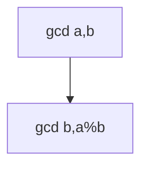

## WHY
GCD, sieve, modular pow show up in counting/crypto. Brute factor is slow; gcd O(log), sieve O(n log log n).

## THEORY
gcd Euclid; sieve marks composites; modpow square.


## VISUALIZATION_CONFIG

```json
{ "component": "FlowChart", "state": "leetcode-math-number-theory-pattern" }
```

## CODE
### Level1 gcd
```java
int gcd(int a,int b){return b==0?a:gcd(b,a%b);}
```
### Level2 sieve
### Level3 modpow
### Level4 modular inverse

## REAL_WORLD
Crypto modexp. Gotcha: overflow → long.
| Op|Time|
|--|--|
|gcd|O(log)|

## INTERVIEW
**Q1:** gcd. **Q2:** sieve. **Q3:** modpow. **Q4:** overflow. **Q5:** inverse.

## FEYNMAN CHECK
### Like10 > Largest shared block; cross out multiples to find primes.
**Q1** gcd **Q2** sieve **Q3** modpow **Q4** ovf **Q5** def

## BUILD
### Sieve
**Out:** `2 3 5 7`

## SPACED REVIEW
### Day 1 Recall
**Q1:** Trigger. **Q2:** Cost. **Q3:** 10-line.
### Day 3
**Q4:** vs alt. **Q5:** bug. **Q6:** refactor.
### Day 7
**Q7:** apply. **Q8:** PR slow. **Q9:** degrade.
### Day 14
**Q10:** ★ classic. **Q11:** links. **Q12:** ★ at 10M.
