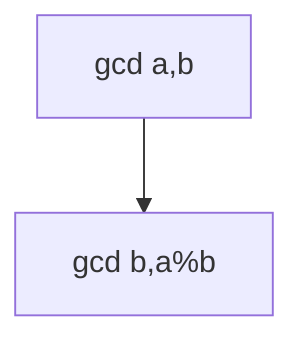

## WHY
GCD, sieve, modular pow show up in counting/crypto. Brute factor is slow; gcd O(log), sieve O(n log log n).

## THEORY
gcd Euclid; sieve marks composites; modpow square.


## VISUALIZATION_CONFIG
```json
{
  "steps": [
    {
      "title": "GCD and LCM",
      "description": "Euclidean algorithm for GCD. LCM = a*b / GCD.",
      "code": "// Greatest Common Divisor\nfunction gcd(a, b) {\n  while (b) [a, b] = [b, a % b];\n  return a;\n}\n\n// Least Common Multiple\nfunction lcm(a, b) {\n  return (a / gcd(a, b)) * b; // divide first to avoid overflow\n}\n\n// Extended Euclidean\nfunction gcdExt(a, b) {\n  if (b === 0) return [a, 1, 0];\n  const [g, x1, y1] = gcdExt(b, a % b);\n  return [g, y1, x1 - Math.floor(a / b) * y1];\n}\n// Finds x, y such that ax + by = gcd(a, b)",
      "highlight": [
        2,
        3,
        4,
        8,
        9,
        10,
        13,
        14,
        15,
        16,
        17
      ],
      "diagram": {
        "kind": "flow",
        "steps": [
          {
            "label": "gcd(a, b) = gcd(b, a%b)"
          },
          {
            "label": "Base: gcd(a, 0) = a"
          },
          {
            "label": "LCM = a*b/gcd"
          },
          {
            "label": "Extended: also finds x,y"
          },
          {
            "label": "O(log min(a,b))"
          }
        ]
      }
    },
    {
      "title": "Prime Sieve",
      "description": "Sieve of Eratosthenes — find all primes up to n in O(n log log n).",
      "code": "// Sieve of Eratosthenes\nfunction sieve(n) {\n  const isPrime = new Array(n + 1).fill(true);\n  isPrime[0] = isPrime[1] = false;\n  for (let i = 2; i * i <= n; i++) {\n    if (isPrime[i]) {\n      for (let j = i * i; j <= n; j += i) {\n        isPrime[j] = false;\n      }\n    }\n  }\n  const primes = [];\n  for (let i = 2; i <= n; i++) if (isPrime[i]) primes.push(i);\n  return primes;\n}\n\n// LC 204: Count Primes\nfunction countPrimes(n) {\n  return sieve(n - 1).length;\n}",
      "highlight": [
        3,
        4,
        5,
        6,
        7,
        8,
        9,
        10,
        11,
        18,
        19,
        20
      ],
      "diagram": {
        "kind": "flow",
        "steps": [
          {
            "label": "Mark 0, 1 as non-prime"
          },
          {
            "label": "For each prime p"
          },
          {
            "label": "Mark multiples starting p²"
          },
          {
            "label": "Remaining are primes"
          },
          {
            "label": "O(n log log n)"
          }
        ]
      }
    },
    {
      "title": "Fast Power",
      "description": "Compute a^n in O(log n) using binary exponentiation.",
      "code": "// Fast Power (iterative)\nfunction power(a, n) {\n  let result = 1;\n  while (n > 0) {\n    if (n & 1) result *= a;\n    a *= a;\n    n >>= 1;\n  }\n  return result;\n}\n\n// Modular exponentiation\nfunction powMod(a, n, mod) {\n  a %= mod;\n  let result = 1n;\n  let base = BigInt(a), exp = BigInt(n), m = BigInt(mod);\n  while (exp > 0n) {\n    if (exp & 1n) result = (result * base) % m;\n    base = (base * base) % m;\n    exp >>= 1n;\n  }\n  return Number(result);\n}",
      "highlight": [
        4,
        5,
        6,
        7,
        8,
        15,
        16,
        17,
        18,
        19,
        20
      ],
      "diagram": {
        "kind": "flow",
        "steps": [
          {
            "label": "n in binary"
          },
          {
            "label": "For each bit"
          },
          {
            "label": "Bit set? multiply result"
          },
          {
            "label": "Square base"
          },
          {
            "label": "Shift right"
          },
          {
            "label": "O(log n)"
          }
        ]
      }
    },
    {
      "title": "Modular Arithmetic",
      "description": "Combinatorics under mod — inverse via Fermat's little theorem.",
      "code": "const MOD = 1_000_000_007n;\n\n// Precompute factorials\nconst fact = [1n];\nfor (let i = 1; i <= 1e5; i++) {\n  fact.push((fact[i - 1] * BigInt(i)) % MOD);\n}\n\n// Modular inverse using Fermat's little theorem\n// a^(p-1) ≡ 1 (mod p) → a^-1 = a^(p-2)\nfunction modInverse(a) {\n  return powModBig(a, MOD - 2n, MOD);\n}\n\n// nCr mod p\nfunction nCr(n, r) {\n  if (r > n) return 0n;\n  return (fact[n] * modInverse((fact[r] * fact[n-r]) % MOD)) % MOD;\n}",
      "highlight": [
        4,
        5,
        6,
        7,
        10,
        11,
        12,
        13,
        16,
        17,
        18
      ],
      "diagram": {
        "kind": "flow",
        "steps": [
          {
            "label": "Precompute factorials"
          },
          {
            "label": "Fermat: a^(p-1) ≡ 1"
          },
          {
            "label": "Inverse: a^(p-2)"
          },
          {
            "label": "nCr = n!/(r!(n-r)!)"
          },
          {
            "label": "All mod p"
          }
        ]
      }
    },
    {
      "title": "Pow(x, n) with Negatives",
      "description": "Handle negative exponents — invert base, negate n.",
      "code": "// LC 50: Pow(x, n)\nfunction myPow(x, n) {\n  if (n === 0) return 1;\n  if (n < 0) {\n    x = 1 / x;\n    n = -n;\n  }\n  let result = 1;\n  while (n > 0) {\n    if (n & 1) result *= x;\n    x *= x;\n    n = Math.floor(n / 2);\n  }\n  return result;\n}\n// Careful: n = -2^31 → -n overflows in int32\n// Use BigInt or careful casting",
      "highlight": [
        3,
        4,
        5,
        6,
        7,
        8,
        9,
        10,
        11,
        12,
        13,
        14,
        15,
        16
      ],
      "diagram": {
        "kind": "flow",
        "steps": [
          {
            "label": "n < 0? invert x, negate n"
          },
          {
            "label": "Iterative fast power"
          },
          {
            "label": "Odd n → multiply"
          },
          {
            "label": "Square base"
          },
          {
            "label": "O(log n)"
          }
        ]
      }
    }
  ]
}
```

## CODE
### Level1 gcd
```java
int gcd(int a,int b){return b==0?a:gcd(b,a%b);}
```
### Level2 sieve
### Level3 modpow
### Level4 modular inverse

## REAL_WORLD
Crypto modexp. Gotcha: overflow → long.
| Op|Time|
|--|--|
|gcd|O(log)|

## INTERVIEW
**Q1:** gcd. **Q2:** sieve. **Q3:** modpow. **Q4:** overflow. **Q5:** inverse.

## FEYNMAN CHECK
### Like10 > Largest shared block; cross out multiples to find primes.
**Q1** gcd **Q2** sieve **Q3** modpow **Q4** ovf **Q5** def

## BUILD
### Sieve
**Out:** `2 3 5 7`

## SPACED REVIEW
### Day 1 Recall
**Q1:** Trigger. **Q2:** Cost. **Q3:** 10-line.
### Day 3
**Q4:** vs alt. **Q5:** bug. **Q6:** refactor.
### Day 7
**Q7:** apply. **Q8:** PR slow. **Q9:** degrade.
### Day 14
**Q10:** ★ classic. **Q11:** links. **Q12:** ★ at 10M.
